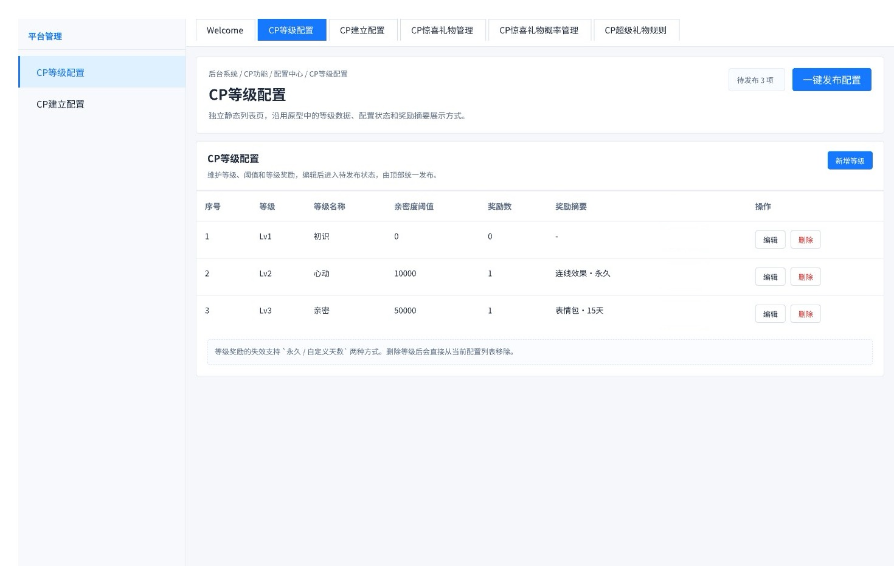
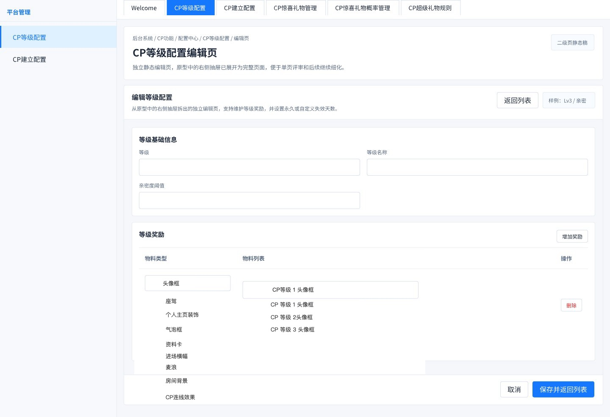
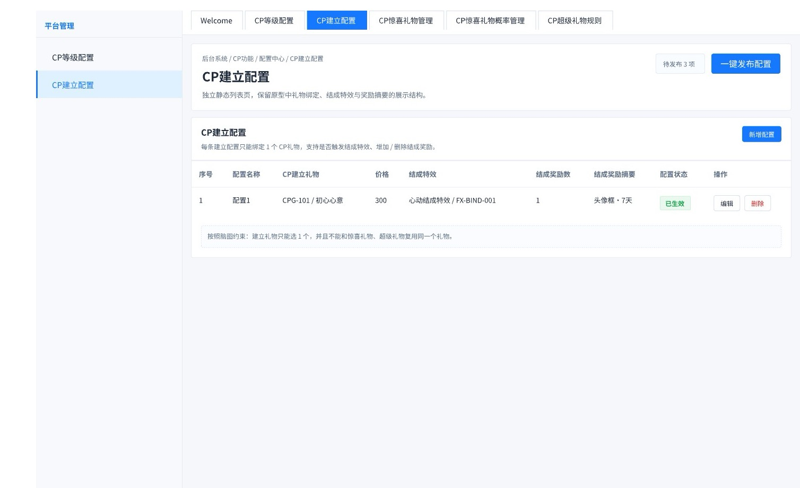
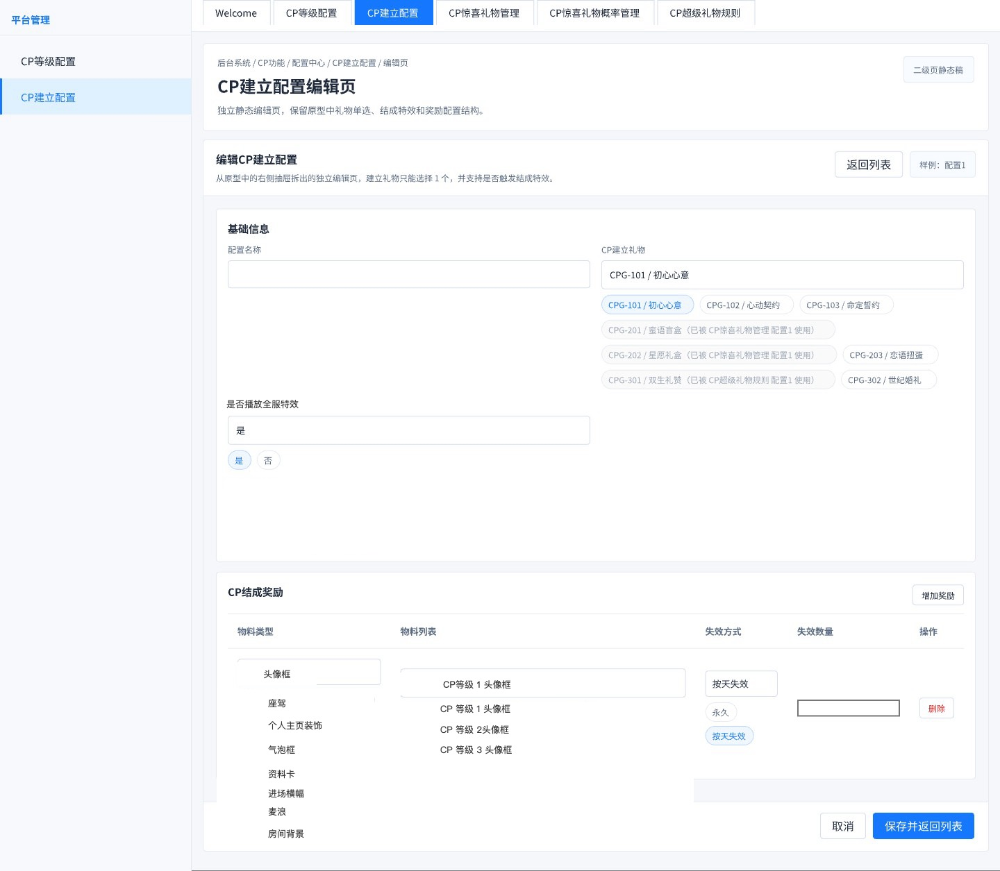
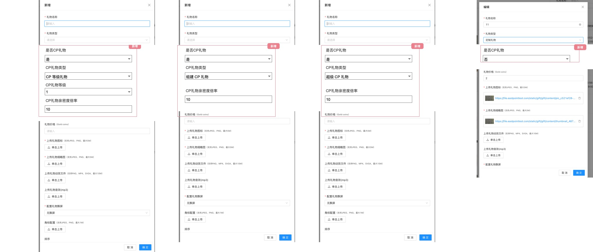
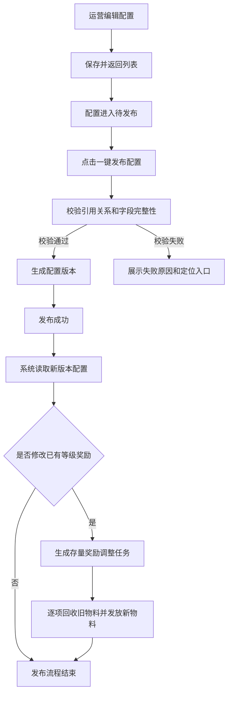

# CP系统需求文档 v1.0 后台

**版本：** 1.0  
**更新时间：** 2026-07-17  
**用途：** 后台配置页面、字段、交互与生效规则

> 本文档为《CP系统需求文档_v1.0》后台拆分版。  
> 核心规则见《CP系统需求文档_v1.0_核心逻辑》。  
> 客户端展示见《CP系统需求文档_v1.0_客户端》。

---

## 八、平台后台
### 1. CP等级配置模块
#### 模块背景
CP等级配置用于维护 CP 关系等级、等级名称、亲密度阈值和首次达成该等级时的奖励。新版后台将原右侧抽屉重构为独立新增/编辑页；列表页负责查看和进入维护，所有新增、编辑、删除变更统一进入待发布范围，由页面顶部“一键发布配置”后生效。

#### 原型引用说明
本模块逐页对应以下新版后台原型：
- 等级列表：`后台-cp等级配置.jpg`
- 等级新增/编辑：`后台-cp等级新增_配置编辑页.jpg`

#### 1.1 CP等级配置列表

##### 页面定位
用于展示当前 CP 等级体系及各等级奖励摘要，并提供新增、编辑、删除及统一发布入口。当前原型不提供搜索、筛选、分页、复制、单条发布、单条停用等能力。

##### 页面结构
| 区域 | 展示/操作 |
|---|---|
| 页面头部 | 页面标题、说明文案、待发布数量、“一键发布配置”按钮 |
| 列表卡片 | 模块说明、“新增等级”按钮、等级配置表格 |
| 底部提示 | 奖励失效方式说明、删除等级后的列表表现说明 |

##### 页面字段定义表
| 字段 | 说明 | 展示规则 |
|---|---|---|
| 序号 | 当前列表展示顺序 | 按等级由低到高生成 |
| 等级 | CP等级标识，如 Lv1、Lv2、Lv3 | 与编辑页“等级”一致 |
| 等级名称 | 等级中文名称，如初识、心动、亲密 | 未配置时不得发布 |
| 亲密度阈值 | 达到该等级所需最低亲密度 | 数值展示 |
| 奖励数 | 当前等级已配置奖励项数量 | 无奖励时显示0 |
| 奖励摘要 | 物料类型/名称与有效期摘要 | 无奖励时显示“-”；多项奖励按配置顺序展示 |
| 操作 | 编辑、删除 | 不展示复制、停用、单条发布 |

##### 原型示例数据
| 序号 | 等级 | 等级名称 | 亲密度阈值 | 奖励数 | 奖励摘要 |
|---:|---|---|---:|---:|---|
| 1 | Lv1 | 初识 | 0 | 0 | - |
| 2 | Lv2 | 心动 | 10000 | 1 | 连线效果·永久 |
| 3 | Lv3 | 亲密 | 50000 | 1 | 表情包·15天 |

##### 统计/计算口径
| 口径项 | 规则 |
|---|---|
| 列表排序 | 按等级数值从低到高展示；序号随当前待发布列表顺序生成 |
| 奖励数 | 统计该等级下已填写完整的奖励行数量 |
| 奖励摘要 | 每项展示“物料名称/类型·永久”或“物料名称/类型·N天” |
| 待发布数量 | 统计本次尚未发布的新增、编辑、删除配置项；同一等级连续修改合并为1项待发布变更 |

##### 交互逻辑
1. 点击“新增等级”，进入独立新增/编辑页，页面不使用抽屉承载。
2. 点击“编辑”，进入对应等级的独立编辑页，并回填该等级当前待发布数据；无待发布数据时回填已生效数据。
3. 仅当前最高等级允许进入删除校验。点击最高等级“删除”时，系统查询该等级是否存在历史达成记录。
4. 若任一CP关系中的用户曾达到过该等级，无论当前等级是否已变化、CP关系是否仍有效，均不允许删除，并提示：“已有用户达到该等级，不允许删除。”
5. 若该等级不存在任何历史达成记录，弹出二次确认；确认后从当前配置列表中移除并形成待发布删除项，删除动作本身不直接改变线上等级体系。
6. 点击最低等级或任一中间等级的“删除”时阻止操作，并提示：“当前等级不是最高等级，不允许删除。请先删除更高等级。”
7. 点击“一键发布配置”时，系统必须再次校验待删除等级是否仍为最高等级、是否仍不存在历史达成记录；全部校验通过后，整体生成新的等级配置版本并生效。
8. 发布校验失败时保留全部待发布内容，并指出具体等级和失败原因；不得只发布其中一部分导致等级表断层。

##### 状态定义
| 状态 | 触发条件 | 页面表现 |
|---|---|---|
| 已生效 | 当前线上版本中的等级且无待发布修改 | 列表展示线上内容 |
| 待发布-新增 | 新增等级已保存 | 列表展示新增结果，计入待发布数量 |
| 待发布-编辑 | 已生效等级被修改并保存 | 列表优先展示修改后内容，计入待发布数量 |
| 待发布-删除 | 等级已执行删除但尚未发布 | 从当前配置列表移除，线上仍按旧版本运行 |

##### 系统后台核心逻辑
- CP等级配置按完整等级表整体发布，不能让单个等级独立生效。
- 等级标识必须唯一且连续；仅允许从当前最高等级开始逐级删除，不允许删除最低等级或中间等级。
- 即使是当前最高等级，只要存在任一用户的历史达成记录，也不允许删除。历史达成记录包括当前仍处于该等级、已升至更高等级、因阈值调整而等级变化，以及CP关系后来解除等情况。
- 亲密度阈值必须为非负整数并随等级严格递增：最低等级只需小于下一等级，中间等级必须大于上一等级且小于下一等级，最高等级只需大于上一等级；阈值与相邻等级相等同样不允许保存。
- 发布成功后，当前与新建立的CP关系均按最新完整等级表和当前亲密度重新判断当前等级。
- 编辑已有等级的奖励配置并发布后，系统必须追溯所有历史已达成该等级且关系当前仍有效的存量CP关系；按发布前后的奖励配置逐项比对，分别回收CP双方因该等级奖励获得的已删除或已替换旧物料，并分别向双方发放新增或替换后的新物料。
- 存量奖励调整以“CP关系 + 等级 + 发布版本”为一次处理范围；同一发布版本重复执行时不得重复回收或重复发放。
- 删除或调整等级不删除历史关系、历史达成记录、历史奖励记录和历史榜单快照；物料回收与重新发放必须新增调整记录，保留原发放记录，不覆盖历史事实。

##### 异常与边界
| 场景 | 处理规则 |
|---|---|
| 等级重复或不连续 | 阻止保存/发布，指出冲突等级 |
| 阈值为空或非整数 | 阻止保存/发布，提示亲密度阈值必须为非负整数 |
| 当前阈值小于或等于上一等级阈值 | 阻止保存，提示：“当前等级亲密度阈值必须大于上一等级。” |
| 当前阈值大于或等于下一等级阈值 | 阻止保存，提示：“当前等级亲密度阈值必须小于下一等级。” |
| 删除最低等级或中间等级 | 阻止操作，提示：“当前等级不是最高等级，不允许删除。请先删除更高等级。” |
| 删除已有用户达到过的最高等级 | 阻止操作，提示：“已有用户达到该等级，不允许删除。” |
| 删除校验时无人达成、发布前新增达成记录 | 发布时再次校验并阻止发布，保留待发布删除项，提示：“已有用户达到该等级，不允许删除。” |
| 奖励物料失效 | 阻止发布，列出失效物料及所属等级 |
| 待发布期间再次编辑 | 合并到该等级同一待发布项，以最后一次保存内容为准 |
| 发布中发生并发修改 | 本次发布失败并保留草稿，提示刷新后重新确认 |

#### 1.2 CP等级新增/配置编辑页

##### 页面定位
新增与编辑共用独立整页表单，用于维护单个等级的基础信息和等级奖励。保存后返回列表并进入待发布，不在编辑页直接发布。

##### 页面字段定义表
| 分组 | 字段 | 控件 | 必填 | 规则 |
|---|---|---|---|---|
| 等级基础信息 | 等级 | 单行输入 | 是 | 填写等级标识；必须唯一并满足完整等级表连续性 |
| 等级基础信息 | 等级名称 | 单行输入 | 是 | 前台展示名称 |
| 等级基础信息 | 亲密度阈值 | 数字输入 | 是 | 非负整数；最低等级须小于下一等级，中间等级须大于上一等级且小于下一等级，最高等级须大于上一等级；不得等于相邻等级阈值 |
| 等级奖励 | 物料类型 | 下拉单选 | 奖励行必填 | 原型可见：头像框、座驾、个人主页装饰、气泡框、资料卡、进场横幅、麦浪、房间背景、CP连线效果 |
| 等级奖励 | 物料列表 | 下拉单选 | 奖励行必填 | 仅展示所选物料类型下当前有效资源 |
| 等级奖励 | 失效方式 | 单选 | 奖励行必填 | 永久、自定义天数；原型说明明确支持两种方式 |
| 等级奖励 | 失效天数 | 正整数输入 | 条件必填 | 仅失效方式为自定义天数时填写 |
| 等级奖励 | 操作 | 行操作 | 否 | 删除当前奖励行 |

##### 交互逻辑
1. 新增页基础信息默认为空；编辑页回填对应等级当前配置。
2. 点击“增加奖励”追加一条空奖励行；奖励不是必配项，允许奖励数为0。
3. 先选择物料类型，再从“物料列表”中选择具体物料；切换物料类型时清空已选物料。
4. 选择“永久”时隐藏并清空失效天数；选择“自定义天数”时展示失效天数且必须填写正整数。
5. 点击奖励行“删除”仅移除当前未保存行；页面至少允许保留0条奖励。
6. 点击“保存并返回列表”时立即校验亲密度阈值：最低等级校验小于下一等级，中间等级校验大于上一等级且小于下一等级，最高等级校验大于上一等级；任一条件不满足时阻止保存并定位亲密度阈值字段。
7. 阈值及其他字段校验通过后，保存为待发布并返回列表。
8. 点击“取消”或“返回列表”且存在未保存修改时，弹出离开确认；确认离开后不保存本次修改。

##### 系统后台核心逻辑
- 保存只更新待发布版本，不改变前台读取的已生效等级表；存量物料在统一发布成功后才开始调整。
- 新达成等级时，按“CP关系 + 等级”控制首次达成发放；编辑已有等级奖励后的存量调整，按“CP关系 + 等级 + 发布版本”控制同一版本只处理一次。
- 发布时记录新旧奖励配置差异。未变化的物料不回收、不重复发放；已删除或被替换的旧物料执行回收；新增或替换后的新物料执行发放。
- 未发布配置引用失效物料时不得发布；已经处于失效或已回收状态的旧物料不重复回收，但必须记录本次处理结果。

##### 异常与边界
| 场景 | 处理规则 |
|---|---|
| 基础信息缺失 | 阻止保存，并定位首个缺失字段 |
| 等级或名称重复 | 阻止保存，提示冲突项 |
| 亲密度阈值小于或等于上一等级 | 阻止保存，提示：“当前等级亲密度阈值必须大于上一等级。” |
| 亲密度阈值大于或等于下一等级 | 阻止保存，提示：“当前等级亲密度阈值必须小于下一等级。” |
| 奖励行仅填写部分字段 | 阻止保存，标记未完成的奖励行 |
| 自定义天数为空或非正整数 | 阻止保存 |
| 同一等级重复添加同一物料 | 阻止保存，提示删除重复奖励 |
| 奖励配置仅修改有效期 | 视为奖励变更：回收旧物料权益后，按新有效期重新发放 |
| 旧物料与新物料完全一致 | 不执行回收或补发，仅记录为无差异 |
| 存量旧物料已到期、已失效或已回收 | 不重复回收，继续发放应获得的新物料并记录旧物料当前状态 |
| 用户通过其他来源拥有同款物料 | 仅回收由该CP关系、该等级奖励产生的权益实例；活动、购买、补偿等其他来源获得的同款物料不得被回收 |
| 旧物料回收失败 | 记录失败原因并进入重试；该CP关系对应的新物料暂不发放，避免新旧奖励同时有效 |
| 新物料发放失败 | 记录失败原因并进入补发；已成功回收的旧物料不自动恢复 |
| 同一发布版本重复触发 | 根据处理记录跳过已成功项，只重试失败项，不得重复回收或重复发放 |
| CP关系已解除 | 不纳入本次存量物料调整；历史奖励和历史记录保持原状 |

### 2. CP建立关系配置模块
#### 模块背景
CP建立关系配置用于维护建立CP时绑定的唯一礼物、是否播放全服结成特效、是否播放全服飘屏以及关系建立成功后的双方奖励。新版后台将原抽屉重构为独立新增/编辑页，列表页继续承载状态查看、删除和统一发布。

#### 原型引用说明
本模块逐页对应以下新版后台原型：
- 建立配置列表：`后台-cp建立配置.jpg`
- 建立配置新增/编辑：`后台-cp建立配置新增_编辑页.jpg`

#### 2.1 CP建立配置列表

##### 页面定位
用于展示各CP建立配置绑定的礼物、价格、结成全服特效、结成全服飘屏、奖励摘要和配置状态，并提供新增、编辑、删除及统一发布入口。

##### 页面字段定义表
| 字段 | 说明 | 展示规则 |
|---|---|---|
| 序号 | 列表顺序号 | 从1递增 |
| 配置名称 | 后台识别名称 | 展示保存值 |
| CP建立礼物 | 礼物编号/名称 | 每条配置仅1个 |
| 价格 | 所选礼物Gold coins价格 | 读取礼物当前资料用于列表展示；业务执行按邀请快照 |
| 结成全服特效 | 是否播放全服结成特效 | 开启时显示“是”，关闭时显示“否” |
| 结成全服飘屏 | 是否播放全服结成飘屏 | 开启时显示“是”，关闭时显示“否” |
| 结成奖励数 | 奖励行数量 | 无奖励时显示0 |
| 结成奖励摘要 | 物料与有效期摘要 | 示例“头像框·7天” |
| 配置状态 | 待发布、已生效等 | 列表展示当前状态 |
| 操作 | 编辑、删除 | 不展示复制、单条发布、停用入口 |

##### 原型示例数据
| 序号 | 配置名称 | CP建立礼物 | 价格 | 结成全服特效 | 结成全服飘屏 | 奖励数 | 奖励摘要 | 状态 |
|---:|---|---|---:|---|---|---:|---|---|
| 1 | 配置1 | CPG-101 / 初心心意 | 300 | 是 | 是 | 1 | 头像框·7天 | 已生效 |

##### 统计/计算口径
| 口径项 | 规则 |
|---|---|
| 建立礼物数量 | 每条配置固定绑定1个礼物 |
| 奖励数 | 统计已填写完整的结成奖励行 |
| 待发布数量 | 统计尚未统一发布的新增、编辑、删除项；同一配置连续修改合并计1项 |
| 礼物占用 | 建立礼物不得与CP惊喜礼物管理、CP惊喜礼物概率管理、CP超级礼物规则复用同一礼物 |

##### 交互逻辑
1. 点击“新增配置”进入独立新增/编辑页。
2. 点击“编辑”进入对应配置独立编辑页并回填数据。
3. 点击“删除”后二次确认；确认后从当前列表移除并形成待发布删除项，发布前不影响线上已生效配置。
4. 点击“一键发布配置”统一校验待发布项；校验通过后生成新版本并立即作用于之后新发起的CP邀请。
5. 列表中的“结成全服特效”“结成全服飘屏”展示当前已保存并生效的开关结果，不展开展示具体播放内容。
6. 已经创建的待处理邀请继续使用创建邀请时冻结的配置快照，不因发布、编辑或删除追溯改变。

##### 状态定义
| 状态 | 触发条件 | 页面表现 |
|---|---|---|
| 待发布 | 新增、编辑或删除已保存但未统一发布 | 计入头部待发布数量 |
| 已生效 | 已完成统一发布 | 可被新CP邀请使用 |
| 已删除待发布 | 已从当前编辑列表移除但尚未发布 | 线上旧配置仍可被读取 |

##### 系统后台核心逻辑
- 每条建立配置只能绑定1个“组建CP礼物”。
- 同一礼物不能同时被建立配置、惊喜礼物管理、惊喜礼物概率管理或超级礼物规则使用。
- 创建邀请时冻结礼物、价格、亲密度倍率、结成特效开关、结成全服飘屏开关、奖励及配置版本；接受邀请时按该快照完成关系建立后的结果处理。
- 结成成功后，若“是否播放全服特效=是”，则触发全服结成特效；若“是否播放全服飘屏=是”，则同步触发全服结成飘屏。两个开关相互独立，允许分别开启或关闭。
- 结成奖励默认向CP双方各发放一份；原型未提供奖励对象字段，不允许后台按单方配置。
- 结成特效播放失败、全服飘屏播放失败均不得回滚已成功建立的CP关系及已成功发放的奖励；失败结果需分别记录。

##### 异常与边界
| 场景 | 处理规则 |
|---|---|
| 礼物已被其他配置占用 | 候选项展示占用模块和配置名称，不允许保存该礼物 |
| 礼物已下架或改为非CP礼物 | 阻止发布，指出失效礼物 |
| 删除已被历史邀请引用的配置 | 允许以新版本停止后续使用，保留历史快照和记录 |
| 发布前发生礼物占用冲突 | 整体发布失败，保留待发布内容 |
| 已有待处理邀请 | 旧邀请继续使用创建时快照，包括结成全服特效开关和结成全服飘屏开关 |
| 全服飘屏播放失败 | 不回滚关系建立和奖励发放，记录飘屏播放失败结果 |

#### 2.2 CP建立配置新增/编辑页

##### 页面定位
新增与编辑共用独立整页表单，用于维护配置名称、单个CP建立礼物、全服结成特效开关、全服飘屏开关和多条结成奖励。保存后返回列表并进入待发布。

##### 页面字段定义表
| 分组 | 字段 | 控件 | 必填 | 规则 |
|---|---|---|---|---|
| 基础信息 | 配置名称 | 单行输入 | 是 | 后台识别名称 |
| 基础信息 | CP建立礼物 | 标签式单选 | 是 | 仅可选择1个；候选项展示编号、名称及占用说明 |
| 基础信息 | 是否播放全服特效 | 是/否单选 | 是 | 控制关系建立成功后是否播放全服结成特效 |
| 基础信息 | 是否播放全服飘屏 | 是/否单选 | 是 | 控制关系建立成功后是否播放全服结成飘屏 |
| CP结成奖励 | 物料类型 | 下拉单选 | 奖励行必填 | 原型可见：头像框、座驾、个人主页装饰、气泡框、资料卡、进场横幅、麦浪、房间背景 |
| CP结成奖励 | 物料列表 | 下拉单选 | 奖励行必填 | 按物料类型联动可选资源 |
| CP结成奖励 | 失效方式 | 单选 | 奖励行必填 | 永久、按天失效 |
| CP结成奖励 | 失效数量 | 正整数输入 | 条件必填 | 按天失效时填写天数 |
| CP结成奖励 | 操作 | 行操作 | 否 | 删除当前奖励行 |

##### 礼物候选与占用展示
候选礼物需显示“礼物编号 / 礼物名称”。已被其他模块使用的礼物同时展示占用来源，例如：
- 被占用礼物为禁选态；当前配置编辑时，允许继续回显自身已绑定礼物，不得误判为与自身冲突。

##### 交互逻辑
1. CP建立礼物采用单选；改选其他礼物时覆盖原选项。
2. 点击“增加奖励”追加奖励行；支持配置0条或多条奖励。
3. 物料列表随物料类型联动刷新；切换类型时清空原物料。
4. 失效方式选择“永久”时隐藏并清空失效数量；选择“按天失效”时要求填写正整数天数。
5. 点击奖励行“删除”移除该行。
6. “是否播放全服特效”“是否播放全服飘屏”为独立开关，任一字段切换不影响另一字段已选值。
7. 点击“保存并返回列表”时校验配置名称、礼物唯一占用、开关取值合法性、奖励完整性和资源有效性；通过后保存为待发布并返回列表。
8. 点击“取消”或“返回列表”且存在未保存修改时，弹出离开确认。

##### 系统后台核心逻辑
- 保存与统一发布两个阶段均需重新校验礼物占用，防止并发编辑造成重复绑定。
- 组建CP礼物的等级限制不用于发起建立邀请；邀请被接受后，按邀请快照中的礼物价格与亲密度倍率一次性增加关系亲密度。
- 全服结成特效与全服飘屏均按邀请创建时冻结的配置执行；邀请创建后即使后台修改开关，已发出的待处理邀请仍按旧快照处理。
- 奖励按奖励行逐项向双方发放，每一方的每一项发放结果独立记录；单项失败不撤销关系建立，失败项进入补发处理。

##### 异常与边界
| 场景 | 处理规则 |
|---|---|
| 配置名称或礼物未填 | 阻止保存并定位字段 |
| 全服特效或全服飘屏开关未选择 | 阻止保存并定位对应字段 |
| 选择已占用礼物 | 禁止选中并展示占用来源 |
| 发布时礼物被抢占 | 发布失败并提示最新占用配置 |
| 奖励行不完整 | 阻止保存 |
| 奖励物料下架 | 阻止发布并列出具体物料 |
| 全服特效或全服飘屏播放失败 | 不回滚关系建立和奖励发放，分别记录失败结果 |
| 全服特效播放失败 | 记录失败，不回滚关系和奖励 |

### 3. CP礼物配置模块
#### 模块背景
CP礼物能力嵌入通用礼物新增/编辑弹窗。新版原型不再只配置“CP礼物等级”，而是先判断是否为CP礼物，再将CP礼物明确划分为“CP等级礼物、组建CP礼物、超级CP礼物”三种类型，并按类型联动等级与亲密度倍率字段。

#### 原型引用说明
本模块对应新版后台原型 `后台-配置cp礼物.jpg`。该图同时给出新增态、编辑态及不同CP礼物类型的显隐分支；通用礼物的基础字段沿用原礼物管理能力，本节重点定义CP新增字段和与其直接相关的表单联动。

#### 3.1 配置CP礼物新增/编辑

##### 页面定位
在通用礼物新增/编辑弹窗中补充CP属性。弹窗使用“取消 / 确定”提交，不使用CP等级/建立配置页面顶部的“一键发布配置”入口；提交后的上下架与生效节奏沿用通用礼物管理机制。

##### 通用礼物字段（原型可见）
| 字段 | 控件 | 必填/限制 |
|---|---|---|
| 礼物名称 | 单行输入 | 必填 |
| 礼物类型 | 下拉单选 | 必填；原型可见“定制礼物” |
| 礼物价格（Gold coins） | 数字输入 | 按通用礼物价格规则校验 |
| 上传礼物图标 | 文件上传 | 必填；JPEG/PNG，最大5M |
| 上传礼物缩略图 | 文件上传 | 必填；JPEG/PNG，最大5M |
| 上传礼物动效文件 | 文件上传 | 非必填；PAG/MP4/SVG，最大10M |
| 上传礼物音效 | 文件上传 | 非必填；MP3 |
| 配置礼物飘屏 | 下拉单选 | 必填；原型可见“无飘屏” |
| 角标配置图 | 文件上传 | 非必填；JPEG/PNG，最大1M |
| 排序 | 数字输入 | 沿用通用礼物排序规则 |

##### CP新增字段定义表
| 字段 | 控件 | 必填 | 显示条件 | 规则 |
|---|---|---|---|---|
| 是否CP礼物 | 下拉单选（是/否） | 是 | CP配置区始终展示 | 为“否”时隐藏并清空其余CP字段 |
| CP礼物类型 | 下拉单选 | 条件必填 | 是否CP礼物=是 | CP等级礼物、组建CP礼物、超级CP礼物 |
| CP礼物等级 | 下拉单选 | 条件必填 | CP礼物类型=CP等级礼物 | 选择允许赠送该礼物的CP等级门槛 |
| CP礼物亲密度倍率 | 数字输入 | 条件必填 | 是否CP礼物=是 | 三种CP礼物类型均展示并生效 |

##### 字段显隐矩阵
| 是否CP礼物 | CP礼物类型 | CP礼物等级 | CP礼物亲密度倍率 |
|---|---|---|---|
| 否 | 隐藏并清空 | 隐藏并清空 | 隐藏并清空 |
| 是 + CP等级礼物 | 展示 | 展示且必填 | 展示且必填 |
| 是 + 组建CP礼物 | 展示 | 隐藏并清空 | 展示且必填 |
| 是 + 超级CP礼物 | 展示 | 隐藏并清空 | 展示且必填 |

##### 统计/计算口径
| 口径项 | 规则 |
|---|---|
| CP礼物来源池 | 是否CP礼物=是且礼物有效 |
| CP等级礼物 | 进入客户端CP礼物展示/赠送范围，并按CP礼物等级限制赠送 |
| 组建CP礼物 | 作为CP建立配置的候选礼物；发起建立邀请时不校验CP礼物等级 |
| 超级CP礼物 | 作为CP超级礼物规则的候选礼物 |
| 亲密度增加值 | 礼物Gold coins价格 × CP礼物亲密度倍率；倍率按发生业务时的有效配置或业务快照读取 |

##### 交互逻辑
1. 新增时先填写通用礼物字段，再配置CP属性。
2. 选择“是否CP礼物=否”时，仅保留该字段，清空CP礼物类型、等级和倍率，礼物不进入任何CP礼物来源池。
3. 选择“是否CP礼物=是”后必须选择CP礼物类型并填写倍率。
4. 切换为“CP等级礼物”时展示CP礼物等级；切换为另外两种类型时隐藏并清空等级。
5. 编辑页回填当前礼物及已上传文件；已上传文件展示文件链接并支持移除，移除必填文件后必须重新上传才能提交。
6. 点击“确定”执行全部字段、文件、CP类型和倍率校验；成功后关闭弹窗并刷新礼物列表。
7. 点击“取消”、右上角关闭或遮罩关闭且存在未保存修改时，提示是否放弃修改。

##### 系统后台核心逻辑
- 一个礼物同一时刻只能有一个CP礼物类型，不能同时作为CP等级礼物、组建CP礼物和超级CP礼物。
- CP礼物亲密度倍率必须大于0，最多支持两位小数；不设业务上限时仍需防止超出系统数值承载范围。
- 修改CP礼物类型前，系统必须检查该礼物是否被建立配置、惊喜礼物配置或超级礼物规则引用。
- 被已生效配置引用时，不允许改为非CP礼物、不允许改成不匹配的CP礼物类型、不允许删除或下架；需先解除引用或发布替代配置。
- 历史送礼、历史邀请和历史奖励按发生时记录或快照追溯，不因礼物后续改名、改价、改倍率或改类型重算。

##### 异常与边界
| 场景 | 处理规则 |
|---|---|
| 是否CP礼物=是但类型为空 | 阻止提交 |
| CP等级礼物未选等级 | 阻止提交 |
| 倍率为空、小于等于0或超过两位小数 | 阻止提交，提示填写大于0且最多两位小数的数值 |
| 类型切换后残留旧字段 | 隐藏字段必须同步清空，不参与保存 |
| 被其他CP配置引用时修改类型/下架/删除 | 阻止操作并展示引用模块及配置名称 |
| 必填图片被移除 | 阻止提交，要求重新上传 |
| 上传格式或大小不符合要求 | 拒绝上传并提示对应限制 |

### 4. CP配置发布与生效管理模块
#### 模块背景
本模块用于统一约束带有页面顶部“待发布 / 一键发布配置”入口的CP配置页面，包括等级配置、建立关系配置。通用礼物新增/编辑弹窗中的CP礼物属性沿用通用礼物管理的提交与生效机制，不计入本入口的待发布数量。

#### 原型引用说明
本模块不对应单一前台页面，而是作用于等级、邀请、礼物奖励、榜单和通知等多个前台结果页；前台表现均通过已发布版本承接。

#### 状态定义
后台配置状态分为“发布状态”和“业务状态”两层，不能混用。

| 状态类型 | 状态 | 说明 | 可操作 |
|---|---|---|---|
| 发布状态 | 待发布 | 已保存但未生效，系统业务不读取 | 编辑、删除、发布 |
| 发布状态 | 已生效 | 已发布，系统后台业务读取该版本 | 编辑（另存待发布版本）、下线 |
| 业务状态 | 启用 | 当前配置允许被新业务使用 | 可随发布版本生效 |
| 业务状态 | 停用/下线 | 当前配置不再允许被新业务使用 | 不影响历史已产生记录 |

#### 发布承接说明
当前后台原型只展示「待发布 3 项」和「一键发布配置」入口。1.0版本以列表页直接发布为准：点击后直接执行完整校验与发布，不进入生效范围选择、存量影响评估或二次确认页面；发布结果和错误信息在列表页提示中反馈。

| 承接场景 | 展示方式 | 必须展示内容 |
|---|---|---|
| 点击一键发布配置 | 列表页直接执行发布 | 待发布配置数量、涉及模块、主要影响范围 |
| 发布校验失败 | 列表页错误提示 | 失败模块、失败字段、失败原因、定位入口 |
| 发布成功 | 列表页成功提示 | 发布版本号、发布时间、发布人、立即生效结果；如修改已有等级奖励，同时提示将对存量CP关系执行旧物料回收和新物料发放 |
| 查看发布记录 | 配置版本记录 | 发布前后版本、操作人、操作时间、影响模块；CP1.0不支持业务回滚，仅支持通过新版本覆盖旧版本 |

如果后续需要独立发布日志页面，可作为后续扩展能力补充原型。

#### 发布流程

#### 发布校验
| 校验项 | 说明 |
|---|---|
| 引用关系有效 | 所有关联的礼物、特效、奖励资源必须存在 |
| 等级删除资格 | 待删除等级必须仍为当前最高等级，且不存在任何用户的历史达成记录；删除操作时与统一发布时各校验一次 |
| 奖励资源存在 | 奖励资源编号在资源库中存在 |
| 礼物未被其他配置使用 | 建立礼物不得与惊喜礼物管理、惊喜礼物概率管理复用同一礼物 |

#### 配置生效边界规则
| 场景 | 规则 |
|---|---|
| 新建CP关系 | 使用发布时刻的最新已生效配置 |
| 已绑定CP等级 | 发布成功后，当前与新建立的CP关系均按最新已生效完整等级表实时计算当前等级 |
| 等级奖励配置修改 | 追溯所有历史已达成该等级且关系当前仍有效的存量CP关系；按新旧配置差异分别回收CP双方由该等级奖励产生的旧物料并发放新物料，不因用户当前已升至更高等级而跳过；其他来源获得的同款物料不受影响 |
| 等级或阈值调整 | 存量关系的当前等级按新等级表重新计算；仅因等级重算进入某等级但历史从未达成过该等级时，按新配置发放该等级奖励 |
| 历史记录与快照 | 原发放记录、历史达成记录、历史送礼结果和历史榜单快照不删除、不覆盖；新增回收、补发和失败记录用于追溯 |
| 历史榜单快照 | 不因配置发布而重算 |

> **设计原则：** CP1.0以列表页直接发布为唯一入口；发布成功即由线上读取新版本。业务回滚不在本期支持范围内，如需修正，仅可发布新版本覆盖旧版本。

#### 删除规则
| 规则 | 说明 |
|---|---|
| 待发布状态可删除 | 未生效配置可从当前编辑列表移除；删除本身作为待发布变更，发布后生效 |
| CP等级删除限制 | 仅允许删除当前最高等级，且该等级不得存在任何用户历史达成记录；点击删除和统一发布时分别校验。最低等级、中间等级或已有用户达到过的最高等级均不允许删除 |
| 建立配置删除限制 | 建立配置如需停用，需通过新版本调整后发布生效 |
| 被引用配置不可删除 | 其他配置引用时不可删除 |

#### 奖励有效期口径
| 规则项 | 规则 |
|---|---|
| 永久奖励 | 不设置自然到期时间；但其所属等级奖励配置被删除或替换并发布时，存量用户的旧永久物料仍需按新配置回收 |
| 按天失效奖励 | 奖励获得当天按东三区自然日计为第1天；有效期为N天时，自奖励获得时起可使用至第N天结束，精确失效时间为第N天结束后的00:00:00（东三区） |
| 限时奖励重新发放 | 因等级奖励配置变更而发放的新限时物料，从本次重新发放成功时重新计算完整有效期，不继承旧物料剩余时长 |
| 到期处理 | 到期后对应限时资源自动失效；历史送礼、原奖励、回收、重新发放与到期记录均保留用于追溯 |

#### 权限边界
| 权限 | 可执行范围 |
|---|---|
| 查看配置 | 查看已发布配置、草稿和发布记录 |
| 编辑草稿 | 新增、编辑草稿；不可直接发布 |
| 发布等级配置 | 发布完整连续等级表 |
| 发布建立配置 | 发布建立关系配置的待发布版本 |
| 查看发布记录 | 查看版本、操作人、时间和影响模块 |

## 九、附录
### 1. 配置项清单
| 配置项 | 说明 | 默认值 | 所属模块 | 生效边界 |
|---|---|---|---|---|
| 是否CP礼物 | 标记礼物是否进入CP礼物体系 | 否 | CP礼物配置模块 | 为“否”时清空其余CP属性 |
| CP礼物类型 | 区分CP等级礼物、组建CP礼物、超级CP礼物 | 空 | CP礼物配置模块 | 是否CP礼物=是时必填，一个礼物只能选择一种类型 |
| CP礼物等级 | 限制CP等级礼物的赠送门槛 | 空 | CP礼物配置模块 | 仅CP礼物类型=CP等级礼物时生效 |
| CP礼物亲密度倍率 | 配置赠送礼物增加的CP亲密度倍率 | 空 | CP礼物配置模块 | 三种CP礼物类型均需配置；前台不得硬编码 |

### 2. 后台原型映射清单
| 文档模块 | 文档内原型路径 | 原始原型文件 | 覆盖状态 |
|---|---|---|---|
| CP等级配置列表 | `../原型图/CP完整版本原型图/后台/后台-cp等级配置.jpg` | `后台-cp等级配置.jpg` | 已按新版重构原型更新 |
| CP等级新增/配置编辑页 | `../原型图/CP完整版本原型图/后台/后台-cp等级新增_配置编辑页.jpg` | `后台-cp等级新增_配置编辑页.jpg` | 已按新版独立页面更新 |
| CP建立配置列表 | `../原型图/CP完整版本原型图/后台/后台-cp建立配置.jpg` | `后台-cp建立配置.jpg` | 已按新版重构原型更新 |
| CP建立配置新增/编辑页 | `../原型图/CP完整版本原型图/后台/后台-cp建立配置新增_编辑页.jpg` | `后台-cp建立配置新增_编辑页.jpg` | 已按新版独立页面更新 |
| 配置CP礼物 | `../原型图/CP完整版本原型图/后台/后台-配置cp礼物.jpg` | `后台-配置cp礼物.jpg` | 已按三类CP礼物结构更新 |

