# CP系统需求文档 v1.0 客户端

**版本：** 1.0  
**生成时间：** 2026-07-16  
**用途：** 客户端页面、弹窗、交互、原型

> 本文档为《CP系统需求文档_v1.0》客户端拆分版。  
> 核心规则/状态机/流程图见《CP系统需求文档_v1.0_核心逻辑》。  
> 后台配置见《CP系统需求文档_v1.0_后台》。

---

## 客户端通用交互与状态规则

以下规则适用于所有 CP 客户端入口、页面、弹窗、消息卡片和结果页；各功能模块只补充自身差异点，不再重复展开。

| 规则项 | 统一口径 |
|---|---|
| 最新状态读取 | 所有跨入口进入 CP主页、邀请详情、消息卡片、资料页、房间入口时，均必须读取服务端最新关系/邀请状态，不得使用旧缓存执行操作。 |
| 已解除关系阻断 | 已绑定态入口进入关系页前必须校验当前 CP 关系；若关系已解除，统一 toast：`双方已解除CP关系`，并刷新当前页面为未绑定态或隐藏入口。 |
| 邀请终态只读 | 已接受、已拒绝、已取消均为邀请终态；历史消息、通知、详情页再次进入时只读展示最终结果，不允许再次接受/拒绝。 |
| 邀请前置拦截 | 邀请创建前置校验失败时，按通用邀请前置拦截规则处理，仅展示对应提示。 |
| 支付前校验 | 礼物支付前必须校验关系状态、对象资格、礼物可用性、等级门槛和钱包余额；任一失败均阻断支付。 |
| 页面返回刷新 | 从邀请、送礼、解除关系、等级变化等结果页返回时，相关入口和页面必须刷新为最新状态。 |
| 历史消息点击 | 历史消息卡片仅作为结果查看入口；点击时按最新状态落地，不能绕过终态校验。 |

---

## 一、CP邀请与关系建立模块

### 1. 邀请发起与房间建立链路
#### 1.1 礼物面板 CP 分类与组建 CP 礼物

**功能描述：** 房间内礼物面板的 CP 礼物分类页，展示组建CP专属权益进度、收礼对象、CP礼物卡片（含组建CP/CP10-40档位标签）、赠送数量快捷项和发送按钮。未绑定用户选择麦上对象并发起组建 CP 邀请；已绑定用户的收礼对象固定为自己的 CP 对象，无论对方是否在线、是否在当前房间或是否上麦，均持续展示且允许赠送 CP 礼物。

**关键交互：**
1. 用户点击礼物分类栏中的 `CP` 标签，切换到 CP 礼物列表
2. 未绑定用户在顶部头像列表中单选组建对象；已绑定用户固定展示并选中自己的CP对象（均不支持 ALL）
3. 点击礼物卡片选择要赠送的 CP 礼物（组建CP/CP10-40等）
4. 选择赠送数量（1/7/21/51/101 或自定义）
5. 点击 `Send` 按钮，校验通过后执行送礼并进入后续链路

##### 前置条件
| 条件项 | 说明 |
|---|---|
| 用户已登录 | 未登录用户点击送礼需先登录 |
| 用户在房间内 | 原型展示的是房间内打开礼物面板后的状态 |
| 礼物面板加载成功 | 可展示礼物分类、礼物卡片、数量选择和发送按钮 |
| CP分类已配置并生效 | 礼物面板分类中展示 `CP` 标签 |

##### 页面字段定义表
| 字段 | 说明 | 数据来源 |
|---|---|---|
| 礼物分类标签 | Lucky、Customize、Normal、VIP、Backpack、CP 等分类入口 | 礼物分类配置 |
| CP分类 | 礼物面板中的 CP 礼物分类，不是独立页面入口 | CP礼物分类配置 |
| 顶部提示条 | `赠送组建CP礼物可邀请对方组建CP` | CP礼物提示文案配置 |
| 麦上用户选择栏 | 未绑定用户切到 `CP` 分类后，礼物栏顶部展示所有可邀请的麦上用户（排除本人） | 房间成员信息、麦位状态、邀请资格 |
| 当前收礼对象 | 未绑定时为本次组建邀请选中的唯一对象；已绑定时固定为自己的当前 CP 对象 | CP关系记录、房间成员信息、预选对象参数 |
| CP对象在线状态 | 仅作为在线/离线展示信息，不参与已绑定用户的对象展示与送礼资格判断 | 用户在线状态、CP关系记录 |
| 用户选中态 | 未绑定用户默认未选中、只允许单选；已绑定用户默认选中自己的CP对象且不可改选 | 客户端交互状态、CP关系记录 |
| 礼物图标 | CP分类下每个礼物的图片资源 | 礼物资源配置 |
| 礼物名称 | Rings、Basket、Fountain、Tycoon、Treasure box 等 | 礼物配置 |
| 礼物价格 | 当前礼物金币价格 | 礼物配置 |
| 礼物标签 | 组建 CP 礼物显示“组建 CP 礼物标签”、CP 等级礼物“显示所需等级标签”、CP 超级礼物“显示全服特效标签” |  |
| 赠送数量 | 1、7、21、51、101 等数量快捷选项 | 礼物面板配置 |
| 金币余额 | 当前用户可用金币 | 钱包余额 |
| Send按钮 | 发送当前选中礼物 | 礼物面板交互状态 |
| 关系权益横幅 | 用于展示“组建CP解锁专属权益”等关系转化说明 | CP权益配置 |
| 组建结果承接入口 | 送礼成功后进入邀请确认或关系结果链路的承接能力 | CP邀请流程配置 |

##### 统计/计算口径
| 口径项 | 规则 |
|---|---|
| 组建CP礼物亲密度 | 邀请被接受时，按后台已发布组建CP礼物配置的亲密度规则触发一次 |
| 组建CP礼物财富值 | 邀请被接受时按 `1金币 = 1财富值` 仅给发起者 |
| 对象选择规则 | 未绑定用户建立 CP 时一次只能选择一个对象；已绑定用户不可改选，固定向自己的 CP 对象送礼 |
| 未绑定对象范围 | 切到 `CP` 分类后，顶部展示当前房间所有符合邀请资格的麦上用户（排除本人） |
| 已绑定对象范围 | 始终展示自己的当前 CP 对象，不受对方在线、离线、是否在当前房间或是否上麦影响 |
| 默认状态 | 未绑定用户的麦上对象默认均未选中；已绑定用户默认选中自己的 CP 对象 |
| 群发能力 | 组建CP链路不支持 `ALL`，不支持一次向多个对象发送 |
| 未选对象拦截 | 未选择对象时，提示 `请先选择组建CP用户` |
| CP10 / CP20 类标签 | 表示不同亲密度档位或礼物档位，具体换算以配置为准 |
| 动画可见性 | 原型强调“仅CP双方可见”，默认按配置限定展示范围 |

##### 交互逻辑
**礼物面板入口与分类切换**
1. 用户在房间内点击礼物入口，打开底部礼物面板。
2. 礼物面板默认展示某个礼物分类，用户点击 `CP` 分类后，面板切换为 CP 礼物列表。
3. `CP` 与 Lucky、Customize、Normal、VIP、Backpack 是同级分类，不承担“跳转 CP主页 / 邀请列表”的入口职责。

**CP对象选择规则**
1. 未绑定用户通过礼物面板建立 CP 时，一次只能选择一个收礼对象，不支持 `ALL`，也不支持群发。
2. 未绑定用户切到 `CP` 分类后，礼物栏顶部展示当前房间所有符合邀请资格的麦上用户，排除用户本人。
3. 未绑定用户的麦上对象默认均为未选中状态，仅允许单选一个用户。
4. 若未绑定用户从房间系统提示、资料卡或其他已带目标对象的入口进入 `CP` 分类，则当前对象可直接预选，但支付前仍可改选另一位符合邀请资格的麦上用户。
5. 未绑定用户未选择对象时，点击 `组建CP` 礼物或尝试发送，toast 提示：`请先选择组建CP用户`。
6. 未绑定用户点击某位麦上用户后，该用户进入选中态，其他用户取消选中，页面进入“已选对象待送礼态”。
7. 未绑定用户选定对象后，收礼对象锁定到本次邀请快照；支付前可改单选对象，支付后不得修改。
8. 已绑定用户进入 `CP` 分类时，收礼对象始终展示并默认选中自己的当前 CP 对象，不再展示其他麦上用户供改选。
9. 已绑定用户的 CP 对象无论在线或离线、是否在当前房间、是否处于麦位，均持续展示且允许赠送 CP 礼物；在线状态只影响状态标识，不影响送礼按钮可用性。
10. 已绑定用户不得将普通、等级或全服特效类 CP 礼物赠送给非 CP 对象；关系解除或变更后，应立即刷新固定对象和礼物可用状态。

**CP礼物选择与送出**

1. 用户点击某个 CP 礼物卡片后，该礼物进入选中态。
2. 用户选择赠送数量，如 1、7、21、51、101。
3. 页面底部展示当前金币余额和 `Send` 按钮。
4. 点击 `Send` 后，系统校验金币余额、礼物状态、房间状态、收礼对象状态和 CP 礼物规则。
5. 校验通过后完成送礼扣费，并按礼物标签进入对应业务链路。

**组建CP礼物链路**
1. 若礼物标签为 `组建CP`，送出后用于发起 CP 邀请。
2. 系统创建邀请记录，并把所选礼物、礼物价格、发起者、被邀请者、有效期写入邀请快照。
3. 被邀请者接受后，双方建立 CP 关系；被拒绝或系统统一转为已拒绝时，按邀请规则处理退币或结果通知。

**已绑定CP礼物链路**
1. 若用户已绑定 CP，送出 CP 礼物后增加双方亲密度。
3. 若礼物标签为 `全服特效`，送礼后触发全服或房间范围内的特效展示。

**后续链路分流**

##### 状态定义
| 状态 | 触发条件 | 页面表现 | 后续处理 |
|---|---|---|---|
| CP分类未选中 | 用户未点击 CP 标签 | 礼物面板展示其他分类 | 不展示 CP 礼物列表 |
| CP分类选中 | 用户点击 CP 标签 | 未绑定时展示麦上对象列表；已绑定时固定展示自己的CP对象 | 可选组建对象或直接选礼物 |
| 未选对象态 | 未绑定用户当前无任何收礼对象被选中 | 顶部用户列表全部未选中，组建链路不可直发 | 点击用户进入单选 |
| 已选对象待送礼态 | 已选定唯一收礼对象 | 顶部展示唯一选中对象，可继续选礼物和支付 | 等待用户发送 |
| 已绑定CP固定对象态 | 当前存在有效CP关系 | 顶部固定展示并默认选中自己的CP对象；可标记在线/离线，但不可改选 | 可直接选择CP礼物和数量后发送 |
| 礼物已选中 | 用户点击某个 CP 礼物 | 礼物卡片高亮，Send 可用 | 等待用户发送 |
| 余额不足 | 用户金币不足 | Send 后提示余额不足 | 不扣费 |
| 送礼成功 | 扣费与送礼记录创建成功 | 播放动画或展示结果 | 进入亲密度/邀请/奖励链路 |
| 动画播放失败 | 动效资源加载失败 | 不播放或轻提示 | 不回滚奖励和送礼 |

##### 系统后台核心逻辑
- CP分类是礼物系统分类配置，不是 CP关系状态分流入口。
- 组建 CP 礼物创建邀请前，`recipient_user_id` 必须有值；未选对象时不得创建邀请。
- 通过礼物面板建立 CP 的一次送礼只能绑定一个收礼对象，不支持 `ALL` 和多对象并发邀请。
- 未绑定用户的顶部麦上对象列表必须实时过滤：排除自己、已绑定 CP、已开启自动拒绝、被拉黑/封禁或不可互动的麦上用户。
- 已绑定用户不读取麦上对象列表作为收礼对象来源，必须直接读取当前有效 CP 关系中的对方用户；对方离线、不在房间或未上麦时仍返回并展示该对象。
- 已绑定用户的在线状态不得作为 CP 礼物送礼资格条件；只有关系失效、礼物不可用、余额不足、账号不可交易等实际阻断条件才可禁止发送。
- `组建CP` 礼物创建邀请时必须写入邀请快照，后续礼物改价或下架不影响已创建邀请。
- 房间动画展示失败不应回滚送礼扣费、亲密度增长或奖励发放；但需要记录播放失败便于排查。

##### 异常与测试关注点
| 场景 | 页面反馈 | 处理规则 |
|---|---|---|
| 用户未绑定 CP 但送普通 CP 礼物 | 提示需先组建 CP，或仅允许组建CP礼物可送 | 不得误触发亲密度增长 |
| 用户已绑定 CP 但选择组建CP礼物 | 根据规则置灰或提示“你已拥有CP关系” | 不重复创建邀请 |
| 已绑定CP对象离线/不在房间/未上麦 | 固定展示CP对象，可显示离线状态，Send保持可用 | 允许正常赠送，支付成功后按正常CP礼物链路结算 |
| 已绑定CP关系在面板打开期间解除 | 清除固定对象并刷新为未绑定态 | 阻断本次发送，不得向旧CP对象继续结算CP礼物 |
| 未绑定用户当前无可选麦上用户 | 顶部用户栏空态，提示“当前暂无可邀请的麦上用户” | 不允许直接送组建CP礼物；不影响已绑定用户向自己的CP对象送礼 |
| 未选择对象直接点击组建礼物 | toast `请先选择组建CP用户` | 不允许进入邀请创建 |
| 收礼对象不可互动 | 轻提示“当前用户无法接收CP礼物” | 不扣费 |
| 礼物已下架 | 礼物卡片隐藏或不可送 | 不允许发送 |
| 金币余额不足 | 轻提示余额不足并引导充值 | 不创建送礼记录 |
| 用户关闭奖励弹窗 | 弹窗消失 | 不撤销已发奖励 |
| CP双方之一离开房间 | 动画可不展示给离房方 | 奖励和记录仍按送礼结果处理 |
#### 1.2 房间绑定 CP 完整流程

###### 原型一：邀请者视角

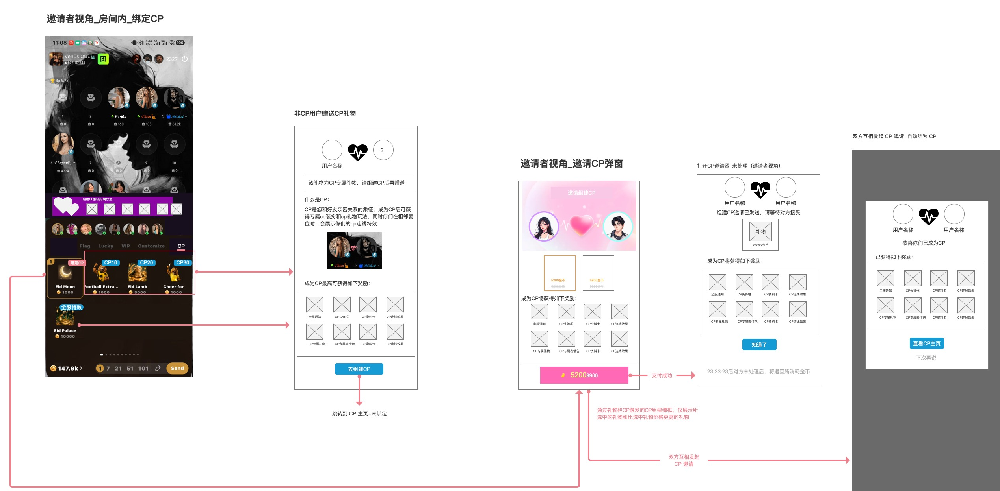

**页面组成与业务职责：**

** 非 CP 用户赠送 CP 礼物拦截提示页（资格拦截页）**

- 当用户尝试赠送仅限 CP 关系使用的礼物，但当前并非有效 CP 用户时触发；
- 页面职责是：
  - 明确告诉用户“当前礼物仅 CP 用户可赠送”；
  - 展示 CP 可获得权益；
  - 引导用户先去组建 CP；
- 该页属于前置校验失败页，不是异常结果页，也不是送礼成功页；
- 在该页中不得创建送礼记录、不得扣费、不得生成邀请记录。

**邀请组建 CP 确认弹窗（支付前确认页）**

- 当用户点击 `组建CP` 礼物后触发；
- 弹窗内需明确展示：
  - 邀请双方头像与关系对象；
  - 本次用于发起邀请的礼物；
  - 当前礼物及更高档位礼物展示；
  - 成为 CP 后可获得的权益；
  - 支付金额按钮；
- 本页职责是完成最后一次关系确认与支付确认；
- 该页仍不是结果页，只有支付成功后才允许进入结果页。

** 邀请已发送待处理结果页（邀请者结果页）**

- 支付成功后进入；
- 页面需明确告诉用户：
  - 邀请已成功发送；
  - 当前状态为“等待对方处理”；
  - 若对方超时未处理，将按规则退回已消耗金币；
- 页面中展示本次礼物与成为 CP 可获得的权益，用于结果确认与价值强化；
- 本页只允许用户确认关闭，不允许再次修改邀请状态。

**关键交互：**
1. 用户在房间场景中打开礼物面板并切换至 `CP` 分类；
2. 若当前从系统提示进入，则系统优先带入推荐对象；若无预选对象，则需要用户在礼物面板中先明确邀请对象；
3. 用户点击礼物卡片后，系统先判断礼物类型：
   - 若是 `组建CP` 礼物 → 进入邀请确认弹窗；
   - 若是仅 CP 可赠送的礼物，且当前用户不是 CP → 进入资格拦截提示页；
   - 若是已绑定 CP 可用礼物，且当前状态满足 → 进入对应送礼链路；
4. 用户在邀请确认弹窗点击支付按钮后，系统完成支付并创建邀请；
5. 支付成功后进入“邀请已发送待处理”结果页；
6. 用户点击 `知道了` 关闭结果页，回到房间上下文。

**页面反馈与状态分支：**
- **正常发起分支**：`CP` 分类 → `组建CP` 礼物 → 邀请确认弹窗 → 支付成功 → 已发送待处理结果页；
- **资格拦截分支**：`CP` 分类 → CP 专属礼物 → 非 CP 用户拦截提示页 → 引导去组建 CP；
- **发送阻断分支**：未选对象 / 对象不可互动 / 礼物下架 / 金币不足时，在点击礼物或点击支付前就阻断，不允许创建邀请；
- **结果等待分支**：支付成功后，不代表关系立即建立，只代表邀请已创建并进入待处理。

**边界与约束：**
- 邀请者在本链路中只能对应一个明确的被邀请对象，不支持 `ALL` 或多对象并发邀请；
- 邀请创建时机必须在支付成功之后，不能在打开弹窗时提前创建；
- 非 CP 用户尝试赠送 CP 专属礼物时，只能被引导，不能继续扣费；
- “已发送待处理结果页”必须展示超时处理规则，防止用户误解金币已永久消耗；
- 本原型中的房间页面、礼物面板、确认弹窗、结果页属于一条连续前台链路，但每一层承担的业务职责必须严格区分，不得在文档中混写成一个页面。

###### 原型二：被邀请者视角

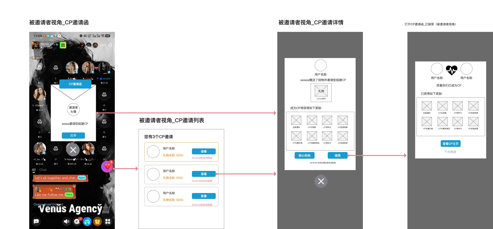

###### 原型三：房间内收到的 CP 邀请函
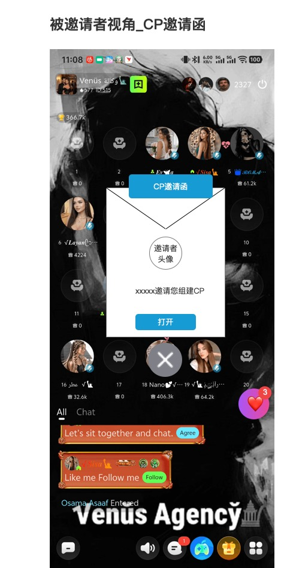

**说明：** 这是被邀请者收到的邀请函消息卡，不是邀请列表或邀请详情页；后续流程图中的列表与详情由其各自页面承接。

**功能描述：** 被邀请者在房间内收到 CP 邀请函浮层、点击打开后进入邀请详情、点击查看进入邀请列表、从列表点击查看进入单条邀请详情、在详情页点击接受或狠心拒绝的完整处理流程。左侧展示 CP 邀请函浮层和邀请列表页，右侧展示邀请详情弹窗，含接受/狠心拒绝按钮和倒计时提示。

**关键交互：**
1. 被邀请者在房间内收到 CP 邀请函浮层，点击 `打开` 进入邀请详情
2. 或点击房间右下角心形入口（带红点角标）进入邀请列表
3. 在邀请列表中查看所有待处理邀请，按礼物价值和剩余时间排序
4. 点击某条邀请的 `查看` 按钮，进入该条邀请详情弹窗
5. 在详情弹窗中查看邀请者信息、礼物信息、奖励预览
6. 点击 `接受` 建立 CP 关系，或点击 `狠心拒绝` 拒绝邀请并触发退款

##### 前置条件
| 条件项 | 说明 |
|---|---|
| 邀请者从房间系统提示进入，或从礼物面板手动切到 `CP` 分类 | 来源必须是房间内系统主动提示或房间内礼物面板入口 |
| 礼物面板 CP 分类可用 | 礼物面板存在 `CP` 分类，可展示组建 CP 礼物 |
| 存在可用组建 CP 礼物 | 至少一个礼物带 `组建CP` 标签 |
| 邀请者金币余额满足所选礼物 | 金币不足时不能创建邀请 |
| 被邀请者可接收邀请 | 未绑定 CP，且未命中封禁、黑名单、自动拒绝等拦截条件 |

##### 页面字段定义表
| 阶段 | 字段/元素 | 说明 | 数据来源 |
|---|---|---|---|
| CP礼物面板 | `CP` 分类 | 房间礼物面板内的 CP 礼物分类 | 礼物配置 |
| CP礼物面板 | 顶部麦上用户选择栏 | 切到 `CP` 分类后直接展示所有麦上用户（排除本人） | 房间成员信息、麦位状态 |
| CP礼物面板 | 当前收礼对象 | 当前这次组建 CP 的唯一收礼对象 | 房间成员信息、预选对象参数 |
| CP礼物面板 | 组建CP礼物 | 可触发 CP 邀请的礼物 | 礼物配置 |
| 邀请确认弹窗 | 邀请组建CP标题 | 确认本次邀请行为 | 客户端文案 |
| 邀请确认弹窗 | 当前选中礼物 | 邀请者在礼物面板选择的组建 CP 礼物 | 礼物配置 |
| 邀请确认弹窗 | 当前收礼对象 | 本次邀请对应的唯一被邀请者 | 房间成员信息、对象选择结果 |
| 邀请确认弹窗 | 价格按钮 | 点击后确认支付/扣费并创建邀请 | 礼物配置、钱包余额 |
| 被邀请者浮层 | CP邀请函 | 房间内收到的邀请提示 | CP邀请记录 |
| 邀请入口 | 心形入口 | 聚合未处理 CP 邀请 | CP邀请记录 |
| 邀请入口 | 数量角标 | 未处理邀请数量，超过99显示 `99+` | CP邀请记录 |
| 邀请列表 | `查看` 按钮 | 进入单条邀请详情 | 客户端配置 |
| 邀请详情 | `接受` / `狠心拒绝` | 处理邀请的主动作 | CP邀请记录 |

##### 统计/计算口径
| 口径项 | 规则 |
|---|---|
| 邀请创建时机 | 仅在邀请者确认组建 CP 礼物并完成支付/扣费后创建 |
| 单对象规则 | 通过礼物面板建立 CP 时，一次只允许对应一个收礼对象 |
| 对象来源优先级 | 系统提示/资料卡进入时使用预选对象；无预选对象时直接在顶部麦上用户栏手动单选 |
| 对象范围 | 默认仅允许选择当前房间内可邀请的麦上用户 |
| 默认状态 | 顶部所有麦上用户默认均为未选中状态 |
| 群发能力 | 组建 CP 链路不支持 `ALL`，不支持多对象并发邀请 |
| 组建CP礼物亲密度 | 邀请被接受时，按后台已发布组建CP礼物配置给 CP 双方增加亲密度 |
| 发起者财富值 | 邀请被接受时，按 `1金币 = 1财富值` 给发起者增加财富值 |
| 待处理数量 | 统计当前被邀请者仍可处理的待处理邀请 |
| 邀请列表排序 | 按礼物价值降序；同价值按剩余时间升序 |

##### 交互逻辑
1. 邀请者从房间系统提示点击 `发起CP`，或在普通礼物面板中手动切到 `CP` 分类。
2. 系统打开房间礼物面板，并定位到 `CP` 分类。
3. 如果是从房间系统提示进入，则推荐对象已经作为当前唯一收礼对象预选完成，顶部麦上用户栏直接以该用户为选中态展示。
4. 如果是用户在当前无 CP 的情况下先打开礼物面板、再手动切到 `CP` 分类，且当前没有预选对象，则顶部麦上用户栏展示当前房间所有麦上用户（排除本人），默认全部未选中。
5. 用户点击顶部某位麦上用户后，该用户进入选中态，其他用户自动拒绝选中；一次只能有一个对象被选中。
6. 未选择对象时，按通用邀请前置拦截规则提示 `请先选择组建CP用户`。
7. 选中对象后，邀请者选择带 `组建CP` 标签的礼物。
8. 系统弹出 `邀请组建CP` 确认弹窗，展示当前收礼对象、礼物信息和价格按钮。
9. 邀请者点击价格按钮并完成支付/扣费后，系统创建 CP 邀请。
10. 被邀请者在房间内收到 `CP邀请函` 浮层，可点击 `打开` 进入邀请详情或邀请列表。
11. 被邀请者也可以点击房间右下角心形入口进入待处理邀请列表；心形入口展示未处理数量，超过99显示 `99+`。
12. 被邀请者点击某条邀请的 `查看`，进入邀请详情。
13. 被邀请者点击 `接受` 后，系统建立 CP 关系，刷新双方主页、房间展示、资料卡和私聊状态。
14. 被邀请者点击 `狠心拒绝` 后，邀请进入已拒绝状态，并按组建 CP 礼物退款规则处理。
15. 用户点击详情 `X` 只关闭详情，不接受、不拒绝、不查看当前邀请处理状态。
16. 倒计时结束仍未处理时，系统将该邀请更新为已拒绝。

##### 状态定义
| 对象 | 状态 | 触发条件 | 页面表现 |
|---|---|---|---|
| 面板 | 未选对象态 | 无预选对象且尚未选择对象 | 顶部麦上用户栏全部未选中，组建链路不可直发 |
| 面板 | 已选对象待送礼态 | 已选择唯一收礼对象 | 顶部展示唯一选中对象，可继续选礼物和支付 |
| 礼物 | 可用于组建CP | 礼物上架且配置为组建CP礼物 | 礼物卡片显示 `组建CP` 标签 |
| 邀请 | 待处理 | 邀请创建成功但未被处理 | 可查看、可接受、可拒绝 |
| 邀请 | 已接受 | 被邀请者点击接受并校验通过 | 建立 CP 关系 |
| 邀请 | 已拒绝/已拒绝 | 终态 | 只读展示终态结果 |
| 关系 | 已绑定CP | 邀请被接受后创建关系 | 房间展示 CP 连线，主页切换已绑定态 |

##### 系统后台核心逻辑
- 礼物面板中的 `CP` 分类与组建 CP 礼物列表必须读取后台已发布配置。
- 创建邀请前必须校验双方 CP 状态、账号状态、黑名单/封禁、自动拒绝、金币余额、礼物上架状态。
- 组建 CP 邀请创建前，`recipient_user_id` 必须有值；未选择对象时不得创建邀请。
- 房间内通过礼物面板建立 CP 的一次送礼，只能绑定一个收礼对象，不支持 `ALL` 和多对象并发邀请。
- 顶部麦上用户栏的数据必须由系统后台实时过滤：排除自己、已绑定 CP、已开启自动拒绝、被拉黑/封禁或不可互动的麦上用户。
- 邀请记录必须保存：邀请者、被邀请者、礼物ID、礼物金币价值、权益快照、来源场景、创建时间、过期时间、状态。
- 被邀请者接受邀请后，系统创建 CP 关系，并基于组建 CP 礼物写入亲密度和财富值。
- 用户接受某个 CP 邀请并成功建立关系后，系统将其收到的其他待处理邀请统一转为已拒绝，并将其自己已发出的其他待处理邀请统一转为已取消。

##### 异常与测试关注点
| 场景 | 预期处理 |
|---|---|
| 金币余额不足 | 提示余额不足，不创建邀请 |
| 被邀请者开启自动拒绝 | 新邀请自动拒绝，并向邀请者反馈结果 |
| 当前无可选麦上用户 | 顶部用户栏空态，提示“当前暂无可邀请的麦上用户” |
| 未选择对象直接点击组建礼物 | toast `请先选择组建CP用户` |
| 被邀请者同时存在多条邀请 | 心形入口展示未处理数量，列表按礼物价值和剩余时间排序 |
| 被邀请者点击 `X` | 只关闭详情，不改变邀请状态 |
| 倒计时结束未处理 | 系统自动清理并按退款规则处理 |
| 跨设备重复处理同一邀请 | 仅第一笔有效操作成功，其余设备刷新终态 |
| 预选对象在支付前离开房间或变为不可邀请 | 支付前重新校验并阻断创建邀请 |
#### 1.3 邀请弹窗

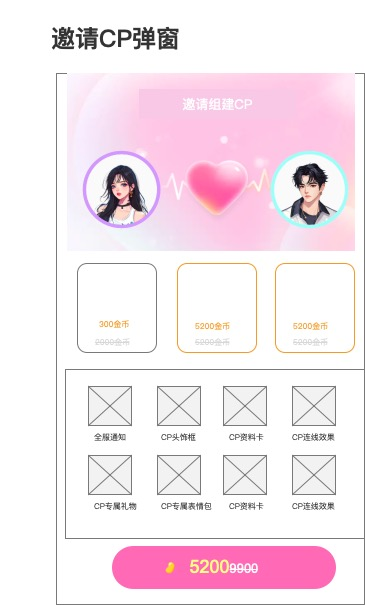

**功能描述：** 邀请者确认发起 CP 邀请的弹窗，展示邀请者/被邀请者头像、当前组建礼物、可升级礼物、权益预览（8宫格奖励列表）和支付按钮。

**关键交互：**
1. 弹窗顶部展示邀请者和被邀请者头像，中间为 CP 心形图标
2. 中部展示礼物选择区，当前选中礼物档位高亮，同时展示更高档位礼物供升级
3. 下方展示成为 CP 奖励列表
4. 底部为价格按钮，文案为当前礼物金币价格，点击后确认支付并发起邀请

##### 前置条件
| 条件项 | 说明 |
|---|---|
| 用户已登录 | 未登录不可发起邀请 |
| 用户未绑定 CP | 已绑定用户不进入邀请弹窗 |
| 目标用户未绑定 CP | 对方已绑定时不可继续邀请 |
| 双方未互相拉黑 | 任意一方拉黑对方时不可发起邀请 |
| 对方未开启自动拒绝 | 对方开启自动拒绝 CP 邀请时不可发起邀请 |
| 双方账号状态正常 | 任意一方账号异常、封禁或不可互动时不可发起邀请 |
| 不存在有效主动邀请 | 发起者已有待处理主动邀请时不可重复创建；若对方已向当前用户发出待处理邀请，则按双向邀请规则直接接受已有邀请 |
| 金币余额充足 | 不足时提示余额不足并拉起充值页 |
| 钱包与礼物配置可读取 | 用于展示可用礼物和支付金额 |

##### 页面字段定义表
| 字段 | 说明 | 数据来源 |
|---|---|---|
| 被邀请对象确认区 | 当前选中对象的头像、昵称、编号 | 用户资料 |
| 组建礼物列表 | 可选礼物的图标、名称、金币价格 | 礼物配置 |
| 已选礼物 | 当前选中礼物的图标、名称、金币价格 | 用户选择 + 礼物配置 |
| 金币消耗 | 本次邀请需要支付的金币数 | 礼物配置 |
| 金币余额 | 当前用户可支付金币 | 钱包记录 |
| 邀请处理期限 | 待处理邀请的剩余处理时间，固定为 6 小时 | CP 邀请记录 + 功能配置 |
| 提交结果 | 成功、失败及失败原因 | 邀请创建结果 |
| 状态提示文案 | 邀请已发送、等待对方处理、到期未处理转为已拒绝并退回金币说明 | CP 功能配置 |
| 奖励说明区 | 成为 CP 后可获得的奖励与权益说明 | CP 功能配置 |
| 发送邀请按钮 | 发送邀请操作按钮 | CP 功能配置 |
| 取消/返回按钮 | 关闭当前弹窗 | CP 功能配置 |
| 查看结果按钮 | 仅待处理状态可用 | CP 功能配置 |

##### 统计/计算口径
| 口径项 | 规则 |
|---|---|
| 金币消耗 | 直接读取当前选中组建礼物的金币价格 |
| 邀请有效期 | 邀请创建时间 + 6小时，按东三区时间计算 |
| 待处理剩余时间 | 邀请处理截止时间 - 当前系统时间 |

##### 交互逻辑
1. 用户可从半屏资料页的 CP 区域 `+` 按钮，或全屏资料页中的 CP 模块 `+` 按钮进入邀请弹窗，两个入口进入的是同一套邀请流程。
2. 弹窗顶部先展示双方头像和 CP 主视觉，帮助用户确认当前邀请对象。
3. 中部展示多个组建 CP 礼物档位或套餐卡片，用户点击任一档位后，当前卡片进入选中态；底部主按钮同步更新为当前档位价格。
4. 用户在弹窗内可先浏览该档位附带的 CP 权益说明，再决定是否继续发起邀请。
5. 当用户向已给自己发送待处理 CP 邀请的对象发起 CP 邀请时，不进入支付扣款流程，系统直接按接受对方邀请处理，并展示组建 CP 成功结果。
6. 校验通过后，扣减金币并创建邀请记录，页面进入“邀请已发出、等待对方处理”的承接态；资料页中的 CP 模块同步从“可邀请”切换为“已发出邀请/待处理”状态。
7. 校验失败或命中无法发起邀请场景时，弹窗停留在当前页，保留已选档位，并按下方《无法发起邀请的 Toast 文案》提示对应原因；不创建邀请、不扣款。
8. 待处理期间，发起者再次进入该对象资料页时，应看到 CP 模块已经变化，避免继续重复发起；进入邀请详情后可查看剩余有效期和当前处理状态。
9. 邀请发送成功后展示心形、连线或关系建立相关视觉反馈，但视觉反馈不等于已成为 CP；真正建立关系仍以后续接受结果为准。

##### 无法发起邀请的 Toast 文案
| 无法发起原因 | Toast 提示文案 | 处理结果 |
|---|---|---|
| 双方任意一方拉黑对方 | `双方存在拉黑关系，无法建立 CP` | 阻断发起，不创建邀请、不扣款 |
| 对方开启自动拒绝 CP 邀请 | `对方已开启自动拒绝CP邀请，无法发起邀请` | 阻断发起，不创建邀请、不扣款 |
| 当前用户已有其他主动待处理邀请 | `已有待处理CP邀请，请等待对方处理` | 阻断重复发起，不创建第二条邀请、不扣款 |
| 当前用户账号异常、封禁或不可交易 | `当前账号状态异常，无法发起CP邀请` | 阻断发起，不创建邀请、不扣款 |
| 对方账号异常、封禁或不可互动 | `对方账号状态异常，无法发起CP邀请` | 阻断发起，不创建邀请、不扣款 |
| 当前所选组建 CP 礼物已下架或不可用 | `该礼物暂不可用，请选择其他礼物` | 阻断提交，保留弹窗并刷新可用礼物列表，不创建邀请、不扣款 |
| 金币余额不足 | `金币余额不足` | 不创建邀请、不扣款，并拉起充值页 |
| 邀请资格、钱包或礼物数据读取失败 | `暂时无法发起CP邀请，请稍后重试` | 阻断提交，不创建邀请、不扣款，允许用户重试 |

> 当对方已向当前用户发出有效的待处理 CP 邀请时，不属于“无法发起邀请”场景：不展示失败 Toast，不进入支付扣款流程，直接按接受对方已有邀请处理，并展示组建 CP 成功结果。

##### 状态定义
| 状态 | 触发条件 | 页面表现 |
|---|---|---|
| 编辑中 | 用户尚未提交邀请 | 可搜索目标、选礼物、查看消耗 |
| 提交校验中 | 点击发送邀请后 | 按钮 loading，防重复提交 |
| 发送成功待处理 | 邀请创建成功 | 展示等待对方回应、倒计时、奖励说明 |
| 校验失败 | 提交失败或命中无法发起邀请场景 | 保留当前输入，并按《无法发起邀请的 Toast 文案》展示对应提示 |
| 已终态 | 对方已接受或已拒绝 | 展示最终结果，不再允许取消 |

##### 系统后台核心逻辑
- 扣款和邀请创建必须在同一事务中，任一失败则全部回滚。
- 同一发起者同一时刻只能有一个有效主动邀请。
- 邀请创建成功后状态为待处理，倒计时按创建时间 + 6小时计算。
- 邀请被拒绝后，金币按原支付记录退回发起者，并记录退币结果。
- 成功动画仅为视觉反馈，不影响邀请记录状态。

##### 异常与测试关注点
- 覆盖扣款成功但邀请创建失败的事务回滚。
- 覆盖发送成功后等待状态、处理期限结束后自动转为已拒绝。
### 2. 邀请处理与关系确认链路
#### 2.1 接受邀请
##### 页面定位
接受邀请页承接被邀请者对某条待处理邀请的最终确认动作，用于在真正建立 CP 关系前再次展示关键信息、礼物结果和关系收益，避免误操作。

> 当前新版原型目录未提供“接受邀请”独立原型图；本节复用邀请详情的业务承接逻辑。

##### 前置条件
| 条件项 | 说明 |
|---|---|
| 当前用户是被邀请者 | 身份确认正确 |
| 邀请仍为待处理 | 邀请状态为待处理且未进入已接受、已拒绝或已取消终态 |
| 双方均未绑定其他 CP | 接受前重新校验 |
| 当前邀请记录存在 | 邀请编号可查询 |

##### 页面字段定义表
| 字段 | 说明 | 数据来源 |
|---|---|---|
| 邀请者资料 | 头像、昵称、等级、基础信息 | 用户资料、等级配置 |
| 组建礼物信息 | 礼物图标、名称、金币价值 | 礼物配置 |
| 邀请说明文案 | 发起者邀请你建立 CP 的说明 | CP 消息模板、功能配置 |
| 权益预览区 | 成为 CP 后可获得的权益 | CP 功能配置 |
| 接受按钮 | 建立关系主操作 | CP 功能配置 |
| 拒绝按钮 | 拒绝邀请主操作 | CP 功能配置 |
| 剩余处理时间 | 邀请处理截止时间倒计时 | CP 邀请记录 |

##### 统计/计算口径
| 口径项 | 规则 |
|---|---|
| 接受结果 | 建立关系、初始亲密度、奖励结果都以服务端最终落库为准 |
| 剩余处理时间 | 邀请处理截止时间 - 当前系统时间 |

##### 交互逻辑
1. 被邀请者从邀请详情、私聊消息卡片或待处理入口进入接受页。
2. 页面先展示邀请者资料、组建礼物、权益预览和接受后的关系收益，帮助用户确认“接受后会发生什么”。
3. 用户点击“接受”后，系统先重新校验邀请状态、双方关系状态和有效期；校验通过才真正建立关系。
4. 接受成功后，系统建立 CP 关系、写入初始亲密度和奖励结果，并将主页、资料卡、房间展示切换为已绑定状态。
5. 用户点击“拒绝”则进入拒绝链路，不直接在当前页 silent close。
6. 若邀请在用户停留期间已拒绝或双方任一方已绑定其他 CP，当前页必须刷新为不可处理结果态。

##### 状态定义
| 状态 | 触发条件 | 页面表现 |
|---|---|---|
| 待确认接受态 | 邀请仍可处理 | 展示接受/拒绝按钮 |
| 接受成功态 | 服务端建立关系成功 | 展示成功结果并引导查看 CP 主页 |
| 不可处理态 | 已拒绝、已被处理、关系冲突 | 展示终态结果，不再可操作 |

##### 系统后台核心逻辑
- 接受操作必须以被邀请者为并发锁核心，防止同时接受多条邀请。
- 接受成功后，需要：建立 CP 关系；将当前用户收到的其他待处理邀请转为已拒绝；将当前用户已发出的其他待处理邀请转为已取消；写入初始亲密度流水；发送相关通知；刷新 CP 主页、资料卡和私聊消息状态。
- 点击接受时不能使用页面打开时的旧状态直接建链，必须再次向服务端取实时状态。

##### 异常与测试关注点
- 覆盖网络中断后重新进入、终态页展示和拒绝链路衔接。
#### 2.2 拒绝邀请
##### 页面定位
拒绝邀请页用于承接被邀请者在决定不建立关系时的确认动作，避免误触拒绝，并把退币、状态变化和消息回流结果明确展示出来。

> 当前新版原型目录未提供“拒绝邀请”独立原型图；本节复用邀请详情的业务承接逻辑。

##### 前置条件
| 条件项 | 说明 |
|---|---|
| 当前用户是被邀请者 | 身份校验正确 |
| 邀请仍为待处理 | 已终态邀请不可再次拒绝 |

##### 页面字段定义表
| 字段 | 说明 | 数据来源 |
|---|---|---|
| 邀请者资料 | 头像、昵称、基础信息 | 用户资料 |
| 拒绝确认文案 | 说明拒绝后的结果 | CP 功能配置 |
| 确认拒绝按钮 | 执行拒绝操作 | CP 功能配置 |
| 返回按钮 | 取消本次拒绝 | CP 功能配置 |
| 退币结果摘要 | 发起者金币退回结果 | 钱包记录、邀请记录 |

##### 统计/计算口径
| 口径项 | 规则 |
|---|---|
| 拒绝结果 | 邀请进入已拒绝终态 |
| 退币规则 | 组建礼物金币按原支付记录退回发起者 |
| 拒绝原因 | 需区分手动拒绝与系统自动拒绝 |

##### 交互逻辑
1. 用户在邀请详情页点击“狠心拒绝”后，进入拒绝确认页或确认弹窗。
2. 页面说明拒绝后当前邀请将结束，发起者礼物金币按规则退回。
3. 用户确认拒绝后，邀请进入已拒绝状态；若取消，则返回上一级邀请详情页。
4. 拒绝后的结果继续通过邀请列表、私聊消息卡片和资料页待处理状态同步回流，避免出现列表已拒绝但聊天流仍像待处理的断链。
5. 拒绝成功后，邀请列表、消息卡片、资料页状态同步刷新。

##### 状态定义
| 状态 | 触发条件 | 页面表现 |
|---|---|---|
| 待确认拒绝态 | 用户刚点击拒绝 | 展示确认文案和双按钮 |
| 已拒绝结果态 | 服务端拒绝成功 | 返回或刷新为已拒绝状态 |
| 不可处理态 | 邀请已拒绝、已拒绝或已被处理 | 展示终态，不再允许拒绝 |

##### 系统后台核心逻辑
- 拒绝操作需写入拒绝原因，区分手动拒绝与系统自动清理。
- 拒绝成功后触发退币和状态同步，不能留半完成态。
- 同一邀请拒绝动作按邀请ID幂等处理，重复提交只返回同一结果。

**异常与测试关注点：** - 覆盖正常拒绝、终态后重复拒绝和退币失败补偿。
#### 2.3 邀请列表

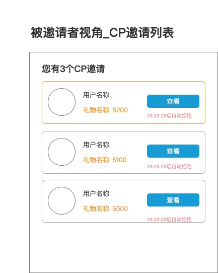

**功能描述：** 被邀请者的 CP 邀请列表，集中展示当前仍处于待处理状态的邀请，包括邀请者、礼物信息、剩余有效期和查看入口。列表顶部显示"您有X个CP邀请"总提示，每条邀请卡片展示邀请者头像、用户名、礼物名称及金币价值、倒计时和查看按钮。

**关键交互：**
1. 被邀请者从房间内收到邀请函浮层，或点击房间右下角心形入口（带红点角标）进入邀请列表
2. 列表展示所有待处理邀请，按礼物价值和剩余时间排序
3. 点击某条邀请的 `查看` 按钮，进入该条邀请详情弹窗
4. 倒计时结束未处理的邀请自动转为已拒绝

##### 前置条件
| 条件项 | 说明 |
|---|---|
| 用户已登录 | 未登录不可进入邀请列表 |
| 当前用户存在收到的待处理邀请或允许展示空态 | 无待处理邀请时展示空列表页 |

##### 页面字段定义表
| 字段 | 说明 | 数据来源 |
|---|---|---|
| 邀请编号 | 邀请记录唯一标识 | CP 邀请记录 |
| 邀请者资料 | 发起者头像、昵称、编号 | 用户资料 |
| 礼物信息 | 组建 CP 礼物图标、名称、金币价值 | 礼物配置 |
| 邀请状态标签 | 固定展示待处理 | CP 邀请记录 |
| 创建时间 | 邀请发起时间 | CP 邀请记录 |
| 剩余处理时间 | 邀请处理截止时间 - 当前系统时间 | CP 邀请记录 |
| `查看` 按钮 | 进入待处理邀请详情页 | 客户端配置 |
| 列表空态提示 | 当前无待处理邀请时展示 | 客户端文案配置 |

##### 统计/计算口径
| 口径项 | 规则 |
|---|---|
| 列表排序 | 按礼物金币价值降序；同价值按剩余有效期升序；仍相同按创建时间倒序 |
| 展示范围 | 仅展示当前状态为待处理的邀请记录 |
| 入口红点统计 | 与待处理邀请数保持同口径，仅统计当前仍可处理的邀请 |

##### 交互逻辑
1. 用户可从 CP 主页待处理入口、系统通知、私聊邀请卡片等入口进入邀请列表。
2. 列表仅展示当前用户收到的待处理邀请；已接受、已拒绝、已取消等终态邀请不在本列表展示。
3. 每张邀请卡片至少展示邀请者信息、礼物信息、待处理状态、创建时间、剩余有效期和 `查看` 入口。
4. 被邀请者收到多个邀请时，列表作为集中选择页使用；用户先在列表里选择一条邀请，再进入详情页决定接受或拒绝。
5. 发起者视角不通过本列表查看自己已发出的邀请；发起者已发出邀请的等待状态由邀请消息卡片或对应待处理结果页承接。
6. 某条邀请被接受、拒绝或由系统转为已拒绝后，应立即从本列表移除，并同步刷新入口红点和相关消息卡片状态。

##### 状态定义
| 状态 | 触发条件 | 页面表现 |
|---|---|---|
| 空列表 | 当前用户无收到的待处理邀请 | 展示空态插图或提示 |
| 待处理 | 邀请仍在有效期内且未被接受/拒绝/系统处理 | 展示待处理标签、剩余有效期和查看入口 |

##### 系统后台核心逻辑
- 系统后台只返回当前用户作为被邀请者且状态为待处理的邀请记录。
- 已接受、已拒绝、已取消等终态邀请不返回给本列表。
- 处理期限结束仍未处理的邀请由系统后台统一转为已拒绝，并从本列表移除，同时触发退币和通知。
- 被邀请者可同时收到多个待处理邀请，但只能接受一个；接受其中一个后，其他待处理邀请自动转为已拒绝并从列表移除。
- 自动拒绝开关开启时，新邀请在创建前即被拦截，不进入本列表。
- 列表状态变化后，邀请入口红点、私聊消息卡片、邀请详情页需同步刷新。

##### 异常与测试关注点
- 覆盖空列表、单条待处理邀请、多条待处理邀请、分页加载、网络失败重试。
- 覆盖接受一个邀请后其他待处理邀请自动转为已拒绝并从列表移除。
- 覆盖过期、被拒绝、被系统处理后列表刷新、倒计时归零、详情返回后列表状态同步。
#### 2.4 邀请详情

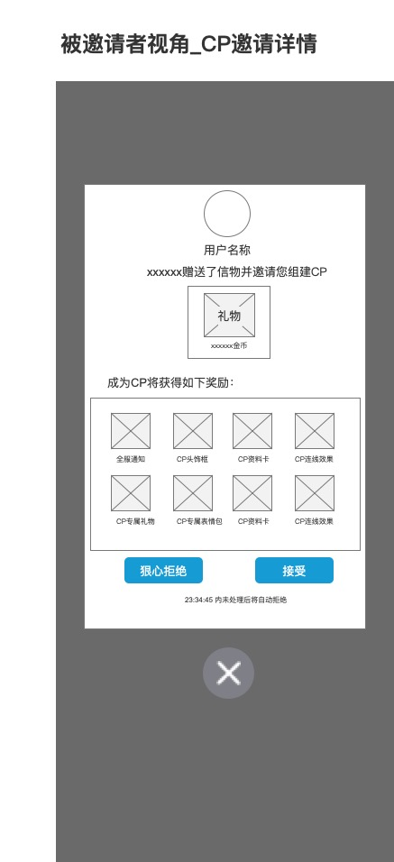

**功能描述：** 被邀请者查看单条 CP 邀请详情弹窗，展示邀请者头像、用户名、邀请说明文案、信物礼物卡片、成为CP奖励列表、倒计时提示、接受和狠心拒绝按钮。

**关键交互：**
1. 顶部展示邀请者信息和邀请说明
2. 中部展示信物礼物卡片
3. 下方展示成为 CP 奖励列表
4. 底部左侧为 `狠心拒绝` 按钮，右侧为 `接受` 按钮
5. 底部显示倒计时提示
6. 点击 `接受` 建立 CP 关系，点击 `狠心拒绝` 结束邀请

##### 前置条件
| 条件项 | 说明 |
|---|---|
| 邀请记录存在 | 邀请编号可查询 |
| 当前用户具备查看权限 | 当前用户是发起者或被邀请者 |

##### 页面字段定义表
| 字段 | 说明 | 数据来源 |
|---|---|---|
| 邀请编号 | 邀请记录唯一标识 | CP 邀请记录 |
| 发起者信息 | 头像、昵称、等级、编号 | 用户中心、等级表 |
| 礼物信息 | 图标、名称、金币价值 | 礼物配置表 |
| 剩余有效期 | 仅待处理状态展示 | CP 邀请记录 |
| 接受按钮 | 仅被邀请者待处理状态可见 | CP 功能配置 |
| 拒绝按钮 | 仅被邀请者待处理状态可见 | CP 功能配置 |

##### 统计/计算口径
| 口径项 | 规则 |
|---|---|
| 剩余有效期 | 邀请处理截止时间 - 当前系统时间 |

##### 交互逻辑
1. 用户从邀请列表、私聊消息卡片或资料页中的待处理入口进入邀请详情。
2. 详情页顶部先展示邀请人和被邀请人的关系主视觉、礼物信息和当前状态，确保用户先理解“是谁邀请谁、用什么礼物邀请”。
3. 邀请详情页不是纯说明页，它同时承接奖励预览：页面中需展示“成为CP将获得如下奖励”这类转化内容，帮助用户在决定接受前理解收益。该奖励预览区要与新原型中的权益九宫格/奖励列表保持一致，不能只写一句抽象说明。
4. 被邀请者进入待处理邀请详情后，页面底部展示“接受邀请”和“狠心拒绝”两个主操作按钮；这是处理邀请的主页面，不要求用户再跳第三层页面才能决策。
5. 点击“接受邀请”后，系统先校验邀请是否仍有效、双方是否未绑定其他 CP；校验通过则建立关系、写入亲密度和奖励结果，并将主页状态切换为已绑定 CP。
6. 点击“狠心拒绝”后，先弹出二次确认，再执行拒绝；拒绝成功后该邀请进入已拒绝状态，并触发原路退回金币。
7. 发起者进入待处理邀请详情时，页面重点展示“等待对方处理”的结果态和剩余有效期，不提供修改邀请状态操作。
8. 已接受、已拒绝、已取消等终态详情页仅保留结果展示，不再出现可操作按钮；这类终态也应能从私聊消息卡片回看，而不是只存在列表里。

##### 状态定义
| 状态 | 触发条件 | 页面表现 |
|---|---|---|
| 待处理 | 邀请仍在有效期内且未被处理 | 展示倒计时与可操作按钮 |
| 已接受 | 被邀请者接受邀请 | 展示已接受结果，不可再操作 |
| 已拒绝 | 被邀请者拒绝邀请或系统按拒绝规则处理 | 展示已拒绝结果，不可再操作 |
| 已取消 | 邀请发起者接受第三方邀请并成功建立 CP | 邀请者侧展示 `CP邀请已取消`；被邀请者侧展示 `对方已取消CP邀请`，不可再操作 |
| 不可处理异常态 | 双方任一方已绑定其他 CP、记录异常 | 阻断操作并提示当前不可处理原因 |

##### 系统后台核心逻辑
- 接受、拒绝操作前必须重新校验：邀请仍为待处理、双方未绑定其他 CP、双方账号状态有效。
- 同一邀请只能产生一次最终处理结果；跨设备同时处理时，只允许第一笔有效操作成功。
- 已拒绝或已取消涉及组建礼物消耗时，金币必须按原支付记录退回发起者，并记录退币结果。

##### 异常与测试关注点
- 覆盖正常接受、正常拒绝、系统统一拒绝、系统自动取消、操作后返回列表刷新。
- 覆盖邀请已接受、已拒绝、已取消、记录不存在、双方任一方已绑定其他 CP。
### 3. CP邀请统一状态与并发处理规则

#### 3.1 统一邀请状态机

**功能说明：** 所有房间、私聊、资料页、CP主页发起的邀请共用同一套邀请状态。各入口只负责展示和操作，不得自行定义另一套状态或退款口径。
##### 状态定义
| 状态 | 进入条件 | 可执行操作 | 金币处理 | 页面表现 |
|---|---|---|---|---|
| Pending（待处理） | 邀请创建成功且礼物支付成功 | 被邀请者可接受或拒绝；邀请者可查看详情 | 保持支付占用，等待结果 | 展示剩余有效时间 |
| Accepted（已接受） | 被邀请者接受，或命中双向邀请自动接受规则 | 查看CP主页 | 结算原邀请礼物一次 | 双方进入已绑定状态 |
| Rejected（已拒绝） | 被邀请者主动拒绝、处理期限结束仍未处理，或被邀请者先与其他用户建立 CP | 查看结果、关闭 | 原路退回发起者 | 展示拒绝结果，不再可接受 |
| Canceled（已取消） | 邀请发起者接受其他用户的 CP 邀请并成功建立关系，导致自己此前发出的 Pending 邀请无法继续处理 | 查看结果、关闭 | 原路退回该邀请发起者 | 邀请者侧展示 `CP邀请已取消`；被邀请者侧展示 `对方已取消CP邀请`，不再可接受或拒绝 |

##### 状态流转规则
1. 新邀请只能从创建中进入 Pending；支付失败不得生成 Pending 邀请函。
2. Pending 只允许进入 Accepted、Rejected 或 Canceled，任何终态不可再次接受或拒绝。
3. 被邀请者主动拒绝、处理期限结束仍未处理，或被邀请者先与其他用户建立 CP 时，邀请进入 Rejected。
4. 邀请发起者接受其他用户的 CP 邀请并成功建立关系后，其此前已发出的其他 Pending 邀请统一进入 Canceled；不得误记为 Rejected。
5. Rejected、Canceled 的退款结果必须回写邀请详情、私聊消息卡和系统通知，避免不同入口显示冲突。

#### 3.2 双向邀请自动合并

##### 触发条件
- 用户A向用户B存在有效 Pending 邀请；
- 用户B随后从任一入口尝试向用户A发起邀请；
- 双方当前仍为未绑定状态，且原邀请仍可处理。

##### 处理规则
1. 系统不创建第二条邀请，不再次扣除用户B金币。
2. 用户B的发起行为视为接受用户A的已有 Pending 邀请，原邀请直接进入 Accepted。
3. 只结算用户A原邀请所选的组建CP礼物一次；用户B本次选择的礼物、套餐或数量不得形成第二笔支付。
4. 双方收到同一关系建立结果，并跳转或刷新到同一CP主页。

##### 页面反馈
| 场景 | 页面反馈 |
|---|---|
| 命中自动合并 | “你们已互相发起邀请，现已成功组建CP” |
| 对方已绑定其他用户 | 阻断操作，提示“对方当前已拥有CP，暂时无法邀请” |
| 当前用户已绑定其他用户 | 阻断操作，返回当前CP关系入口 |

#### 3.3 邀请退款与结果同步

##### 退款规则
1. Rejected、Canceled 均退回原邀请实际支付的金币；优惠展示价、礼物原价不得作为退款金额。
2. Accepted 不退款，只结算原邀请礼物和对应组建结果。
3. 同一邀请只允许成功退款一次；重复打开消息卡或重复刷新不得重复到账。
4. 退款处理中，详情页展示“金币退回处理中”；成功后展示实际退回金币数；失败时保留补偿处理状态。

##### 跨入口同步
邀请状态变化后，以下入口必须同步刷新：
- CP主页待处理数量与红点；
- 房间邀请入口和邀请列表；
- 私聊邀请函消息卡及详情；
- 资料页邀请按钮状态；
- 系统通知中的邀请结果。

##### 异常与测试关注点
- 双方同时接受、拒绝或发起反向邀请时，只生成一个终态结果；若邀请发起者先接受第三方邀请并成功建立关系，则其原已发邀请进入 Canceled；若原邀请先被接受并成功建立关系，则原邀请进入 Accepted，第三方邀请按其角色与最终关系结果进入 Rejected 或 Canceled。
- 网络重试、重复点击、跨端同时操作不得重复扣币、重复结算礼物或重复退款。
- 邀请终态与关系状态不一致时，页面以最新有效关系为准，并保留邀请结果供用户查看。

## 二、CP消息与通知模块
### 1. 邀请函与私聊承接
#### 模块边界说明
本组模块必须严格区分四类展示形态，不能再把“邀请函弹窗”“消息卡片”“详情弹窗”“已发送待处理结果页”揉成一坨：

| 形态 | 场景定位 | 是否已创建邀请记录 | 主要按钮 | 业务职责 |
|---|---|---|---|---|
| 系统提示组建 CP 弹窗 | 邀请前的关系引导层 | 否 | `发起CP`、`不再提示` | 提示用户去发起邀请，不直接生成邀请 |
| 私聊邀请函消息卡片 | 私聊消息流中的通知卡片 | 是 | `查看` | 提醒用户有一条邀请，点击后再进入下一层 |
| 被邀请者邀请详情弹窗 | 被邀请者打开消息后的可处理详情层 | 是 | `接受`、`狠心拒绝` | 展示邀请内容并执行接受/拒绝 |
| 邀请者打开后的待处理页 | 邀请者打开已发送消息后的只读页 | 是 | `知道了` | 展示“已发出、等待对方处理”，不允许邀请者改状态 |

#### 

#### 1.2 收到邀请函消息卡片
##### 页面定位
收到邀请函消息卡片是被邀请者在私聊消息流中看到的通知型卡片。它属于“消息触达层”，不是弹窗，也不是可直接接受/拒绝的详情操作页。

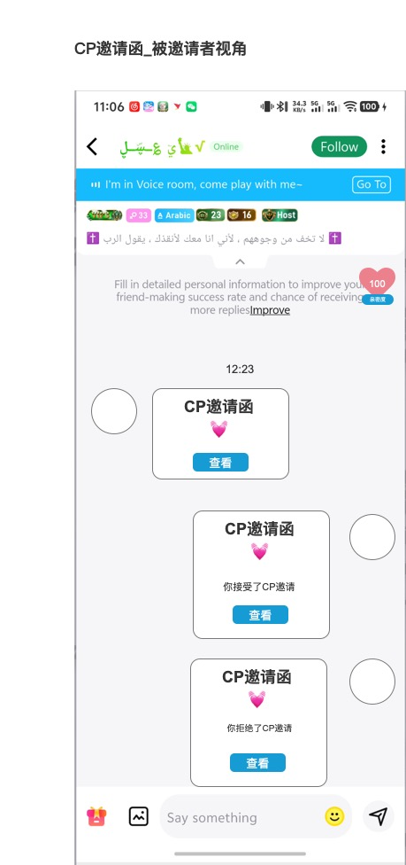

**功能描述：** 该图展示的是私聊消息流中的 CP 邀请函消息卡片。卡片嵌在聊天记录中，展示邀请标题、状态文案和 `查看` 按钮，用于提醒被邀请者有一条待处理邀请。

**关键交互：** 被邀请者点击 `查看` 后，才进入邀请详情弹窗或详情页；消息卡片本身不展示 `接受` / `拒绝` 按钮。

##### 前置条件
| 条件项 | 说明 |
|---|---|
| 邀请记录已创建成功 | 卡片绑定真实有效的邀请记录 |
| 当前用户为被邀请者 | 仅被邀请者看到“收到邀请”消息卡片 |
| 私聊消息链路正常 | 卡片需要成功进入消息流 |

##### 页面字段定义表
| 字段 | 说明 | 数据来源 |
|---|---|---|
| 卡片标题 | `CP邀请函` | 消息模板 |
| 邀请状态文案 | 如“收到CP邀请”“你接受了CP邀请” | 消息模板、邀请状态 |
| 邀请者头像/昵称 | 发起邀请方摘要信息 | 用户资料 |
| 礼物摘要 | 组建礼物图标、名称、价值摘要 | 邀请快照、礼物配置 |
| `查看` 按钮 | 进入下一层详情 | 消息卡片配置 |

##### 统计/计算口径
| 口径项 | 规则 |
|---|---|
| 卡片定位 | 只属于私聊消息流消息卡片 |
| 卡片状态 | 以点击时重新读取的邀请最新状态为准 |
| 终态展示 | 已接受、已拒绝、已取消均保留历史卡片，但点击后只读查看最新结果 |

##### 交互逻辑
1. 邀请创建成功后，系统向被邀请者会话插入一条 CP 邀请函消息卡片。
2. 卡片在消息流中展示标题、状态摘要和 `查看` 按钮。
3. 被邀请者点击 `查看` 后，系统重新读取邀请最新状态，并进入对应详情层：
   - 待处理：进入可操作详情弹窗；
   - 已接受/已拒绝/已取消：进入对应结果态只读页。
4. 关闭聊天页、划走消息卡片或不点击 `查看`，都不代表已处理邀请。

##### 系统后台核心逻辑
- 卡片内容可固化；点击 `查看` 时遵循通用历史消息点击规则。
- 旧卡片不得绕过通用终态只读规则。
- 卡片进入消息流后不因邀请终态自动删除，只更新点击后的落点行为。

##### 异常与测试关注点
| 场景 | 页面反馈 | 处理规则 |
|---|---|---|
| 邀请已拒绝后点击 `查看` | 进入已拒绝结果态 | 不允许接受/拒绝 |
| 邀请已取消后点击 `查看` | 展示 `对方已取消CP邀请` 并进入只读结果态 | 不允许接受/拒绝 |
| 消息延迟到达 | 卡片仍可展示 | 点击时以最新状态为准 |
| 跨设备查看同一卡片 | 两端状态一致 | 不得因旧设备重复处理 |

#### 1.3 被邀请者邀请详情弹窗

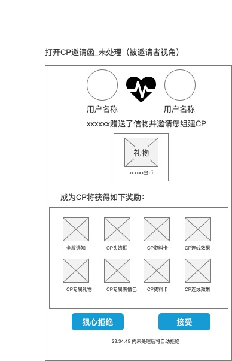

**功能描述：** 被邀请者打开私聊消息卡片后进入的邀请详情弹窗。弹窗顶部展示邀请者头像和用户名，中部展示邀请说明文案和信物礼物卡片，下方展示"成为CP将获得如下奖励"奖励列表，底部显示倒计时提示、接受和狠心拒绝按钮。

**关键交互：**
1. 顶部展示邀请者信息和邀请说明
2. 中部展示信物礼物卡片
3. 下方展示成为 CP 奖励列表
4. 底部左侧为 `狠心拒绝` 按钮，右侧为 `接受` 按钮
5. 底部显示倒计时提示
6. 点击 `接受` 建立 CP 关系，点击 `狠心拒绝` 结束邀请

##### 前置条件
| 条件项 | 说明 |
|---|---|
| 当前用户为被邀请者 | 当前用户必须是该邀请记录的接收方 |
| 邀请仍可查询 | 邀请编号存在且状态可读取 |
| 点击消息卡片或邀请列表进入 | 由上一层通知卡片/列表承接 |
| 双方状态可校验 | 用于接受/拒绝前重校验 |

##### 页面字段定义表
| 字段 | 说明 | 数据来源 |
|---|---|---|
| 邀请者头像/昵称 | 发起邀请方信息 | 用户资料 |
| 邀请说明文案 | 如“xxx赠送了信物并邀请您组建CP” | 消息模板、邀请记录 |
| 礼物信息 | 礼物图标、名称、金币价值 | 邀请快照、礼物配置 |
| 奖励预览区 | 成为 CP 后可获得的奖励预览 | CP权益配置 |
| 剩余有效期 | 邀请剩余处理时间 | 邀请创建时间 + 6小时 |
| `接受` 按钮 | 接受当前邀请 | 客户端交互 |
| `狠心拒绝` 按钮 | 拒绝当前邀请 | 客户端交互 |

##### 统计/计算口径
| 口径项 | 规则 |
|---|---|
| 页面定位 | 这是打开消息后的详情处理层，不是消息流卡片 |
| 可操作前提 | 仅待处理邀请展示 `接受` / `狠心拒绝` |
| 倒计时 | 邀请处理截止时间 - 当前系统时间 |
| 终态处理 | 已接受、已拒绝、已取消邀请进入时只读展示最新结果，不再保留处理按钮 |

##### 交互逻辑
1. 被邀请者从消息卡片点击 `查看` 后，打开邀请详情弹窗。
2. 弹窗展示邀请者资料、礼物信息、关系奖励预览和剩余有效期。
4. 被邀请者点击 `狠心拒绝` 时，进入拒绝确认或直接执行拒绝流程，并把邀请转成已拒绝结果态。
5. 关闭详情弹窗不等于已处理邀请；再次从消息卡片进入时仍按最新状态展示。

##### 系统后台核心逻辑
- 接受/拒绝动作只能在本层或更深结果层执行，消息卡片层不得直接改状态。
- 点击 `接受` / `拒绝` 前必须重新读取邀请当前状态，不能使用弹窗打开时的旧快照直接处理。
- 待处理邀请在处理期限结束后仍未处理时，由系统统一转为已拒绝结果态，并同步刷新消息卡片与邀请列表。

##### 异常与测试关注点
| 场景 | 页面反馈 | 处理规则 |
|---|---|---|
| 弹窗打开期间邀请已拒绝 | 提示 `邀请已拒绝` | 转只读终态 |
| 弹窗打开期间邀请已取消 | 提示 `对方已取消CP邀请` | 立即隐藏接受/拒绝按钮并转只读终态 |
| 任一方已绑定其他 CP | 提示不可处理原因 | 不允许接受 |
| 重复点击 `接受` | 按钮进入处理中 | 后台按邀请 ID 幂等 |
| 网络失败 | 保留当前弹窗态 | 用户可重试 |

#### 1.4 邀请函查看（邀请者已发送待处理页）

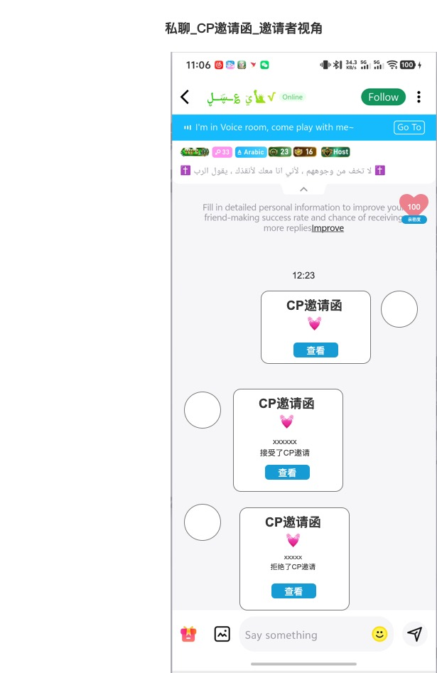

**功能描述：** 邀请者在私聊消息流中看到的已发送 CP 邀请函消息卡片。卡片嵌入聊天记录中，展示被邀请者头像、用户名、邀请说明、信物礼物、状态标签和 `查看` 按钮。

**关键交互：**
1. 卡片嵌入私聊消息流展示
2. 顶部展示被邀请者头像和用户名，中间为 CP 心形图标
3. 待处理卡片：展示"CP邀请函"标题和 `查看` 按钮
4. 已接受卡片：展示"对方接受了CP邀请"状态文案和 `查看` 按钮
5. 已拒绝卡片：展示"对方拒绝了CP邀请"状态文案和 `查看` 按钮
6. 已取消卡片：邀请者侧展示 `CP邀请已取消`，被邀请者侧展示 `对方已取消CP邀请`，并保留 `查看` 按钮
7. 点击 `查看` 进入详情或结果页

###### 原型二：打开邀请函后的未处理状态（邀请者视角）

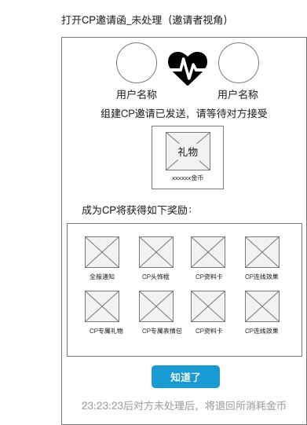

**功能描述：** 邀请者点击待处理卡片后进入的只读等待页。页面展示"组建CP邀请已发送，请等待对方接受"说明、信物礼物、奖励预览和倒计时提示。

**关键交互：**
1. 页面顶部展示邀请说明文案："组建CP邀请已发送，请等待对方接受"
2. 中部展示信物礼物卡片和奖励预览
3. 底部显示倒计时提示
4. 点击 `知道了` 关闭页面

##### 前置条件
| 条件项 | 说明 |
|---|---|
| 当前用户为邀请发起者 | 仅发起者可以看到这条已发送消息和待处理页 |
| 邀请记录存在 | 当前邀请编号可查询 |
| 通过消息卡片或邀请列表进入 | 从上一层消息/列表承接 |

##### 页面字段定义表
| 字段 | 说明 | 数据来源 |
|---|---|---|
| 邀请状态摘要 | 待处理、已接受、已拒绝、已取消 | 邀请记录 |
| 双方头像与昵称 | 邀请双方关系摘要 | 用户资料 |
| 邀请礼物信息 | 礼物图标、名称、金币价值 | 邀请快照 |
| 奖励预览区 | 成为 CP 后可能获得的奖励预览 | CP权益配置 |
| 倒计时提示 | 如“xx后对方未处理，将转为已拒绝并退回金币” | 邀请处理期限配置 |
| `查看` 入口 | 从消息卡片进入该页 | 消息卡片配置 |
| `知道了` 按钮 | 关闭当前页面 | 客户端交互 |

##### 交互逻辑
1. 邀请者在私聊消息流中看到“已发送邀请”的消息卡片。
2. 点击 `查看` 后，打开邀请者已发送待处理页。
3. 页面展示邀请状态、礼物信物、奖励预览和剩余等待时间。
4. 本页只允许关闭或返回，不允许邀请者把待处理邀请改成已接受或已拒绝。
5. 当对方接受、主动拒绝、系统统一转为已拒绝，或该邀请因邀请者接受第三方邀请而转为已取消后，再次打开该页时应自动切换为对应终态结果页。

##### 系统后台核心逻辑
- 邀请者待处理页属于只读承接层，不允许在本层执行接受/拒绝操作。
- 页面进入时遵循通用最新状态读取规则。
- 已拒绝或已取消邀请的退币结果完成后，再同步刷新邀请者侧消息卡片和待处理页落点。

##### 异常与测试关注点
| 场景 | 页面反馈 | 处理规则 |
|---|---|---|
| 对方已接受后再次打开 | 切换到已接受结果页 | 不再展示待处理文案 |
| 对方已拒绝后再次打开 | 切换到已拒绝结果页 | 不再展示 `知道了` 等待态文案 |
| 邀请已拒绝 | 展示拒绝结果与退币结果 | 只读查看 |
| 邀请已取消 | 展示 `CP邀请已取消` 与退币结果 | 只读查看 |
| 邀请记录不存在 | 提示记录已拒绝 | 返回消息流 |

#### 1.5 私聊页绑定 CP 承接流程

###### 原型一：邀请者视角

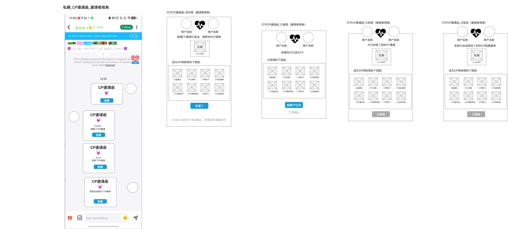

**功能描述：** 邀请者在私聊场景下从顶部关系摘要、消息流邀请卡片、待处理查看页、结果页到关系主页回流的完整绑定 CP 承接流程。该视角重点不是“处理邀请”，而是让发起者在私聊会话内持续看到当前邀请进度，并在对方处理后被正确带入最新关系结果。

**页面组成与业务职责：**

**私聊顶部关系摘要区（会话状态承接层）**
- 位于私聊页顶部，用于展示当前与该用户的关系状态；
- 在未建立 CP 且已发出邀请时，展示“已发起邀请/等待对方回应”等承接信息；
- 在邀请已接受后，顶部关系摘要需切换为已绑定 CP 的展示状态；
- 在邀请已拒绝、已取消、处理期限结束被系统归入已拒绝，或双方后续解除关系后，顶部关系摘要需按最新关系状态刷新，不允许继续展示旧的待处理关系文案。

**私聊消息流邀请函卡片（消息留痕层）**
- 邀请创建成功后，在邀请者与被邀请者的私聊消息流内写入同一笔邀请对应的 CP 邀请函消息卡片；
- 卡片用于承接邀请状态留痕，需展示对方信息、邀请状态摘要、礼物摘要及 `查看` 按钮；
- 消息卡片本身不允许直接改状态，点击后只能进入查看层或结果层；
- 即使邀请已处理完成，历史消息卡片仍保留在消息流中，但再次点击必须读取最新终态，不得回到旧状态。

**邀请者待处理查看页（只读等待层）**
- 邀请者点击自己侧卡片 `查看` 后进入；
- 该页核心职责是告诉邀请者：邀请已发送、当前正在等待对方处理、当前礼物与权益是什么、剩余处理时间还有多久；
- 页面需展示明确等待文案和倒计时，但不得提供 `接受`、`拒绝`、`撤回` 等处理动作；
- 若用户关闭该页，则回到原私聊消息流，不改变邀请状态。

**邀请终态结果页（结果承接层）**
- 当邀请状态已经变为已接受、已拒绝或已取消时，邀请者再次点击消息卡片，需直接进入对应结果页；
- 已接受结果页用于承接“对方已接受，关系已建立”的结果，并继续把用户带往 CP 主页或关系详情；
- 已拒绝结果页用于承接“对方已拒绝/系统统一归拒绝”的结果，同时展示退币结果或结束说明；
- 已取消结果页用于承接“邀请者接受第三方邀请后，原已发邀请被系统取消”的结果；邀请者侧展示 `CP邀请已取消`，被邀请者侧展示 `对方已取消CP邀请`，并展示退币结果；
- 终态页均为只读结果层，不允许在本层再次发起处理。

**关键交互：**
1. 邀请创建成功后，私聊页顶部关系摘要区刷新为“已发起邀请/等待回应”状态，同时消息流写入 CP 邀请函卡片；
2. 邀请者进入与该用户的私聊页时，优先看到顶部关系摘要和历史邀请卡片，知道当前存在一笔待处理邀请；
3. 邀请者点击消息卡片 `查看` 后，系统先读取该邀请最新状态：
   - 若仍为待处理 → 进入邀请者待处理查看页；
   - 若已接受 → 进入已接受结果页；
   - 若已拒绝 → 进入已拒绝结果页；
   - 若已取消 → 进入已取消结果页；
4. 待处理查看页展示邀请对象、邀请礼物、权益摘要、等待说明、剩余处理时间和只读确认按钮；
5. 在待处理期间，邀请者可退出当前页、切回消息流、离开会话后再回来，但不得通过本页主动修改邀请状态；
6. 对方处理邀请后，邀请者侧顶部关系摘要、消息卡片状态、打开后的详情页类型都必须同步切换到最新结果；
7. 若结果为已接受，邀请者可继续进入 CP 主页或关系详情；若结果为已拒绝或已取消，则只承接对应结果说明和退币说明，不再进入旧待处理页；
8. 若用户点击历史结果消息时双方关系已发生变化，则仍先读取最新关系状态，按最新有效结果承接，不得展示过期关系页面。

###### 原型二：被邀请者视角

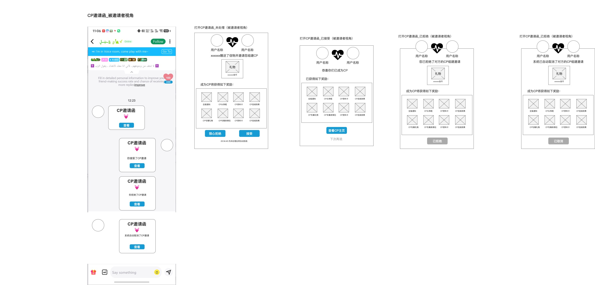

**功能描述：** 被邀请者在私聊场景下从收到邀请函、打开卡片、查看详情、接受/拒绝到结果回流的完整绑定 CP 承接流程。左侧展示私聊页消息流中的邀请函卡片，右侧展示打开卡片后的邀请详情和操作按钮。

**关键交互：**
1. 消息流中嵌入 CP 邀请函消息卡片，展示邀请者信息和 `查看` 按钮
2. 点击 `查看` 进入邀请详情弹窗
3. 详情弹窗展示邀请者、礼物、奖励预览和倒计时
4. 底部展示 `接受` 和 `狠心拒绝` 按钮
5. 点击 `接受` 建立 CP 关系，点击 `狠心拒绝` 结束邀请

##### 前置条件
| 条件项 | 说明 |
|---|---|
| 私聊会话中存在 CP 事件 | 如提示、邀请、接受结果、拒绝结果、奖励结果等 |
| 事件状态可读取 | 能返回对应邀请或关系事件当前状态 |
| 用户具备查看权限 | 当前用户是事件相关方 |

##### 页面字段定义表
| 字段 | 说明 | 数据来源 |
|---|---|---|
| 系统提示层 | 邀请前引导弹窗 | 关系热度规则、提示策略 |
| 消息卡片层 | 私聊消息流中的邀请函卡片，展示邀请状态摘要、礼物摘要与 `查看` 入口 | 消息模板、邀请记录、礼物快照 |
| 邀请者待处理查看层 | 邀请者打开卡片后的只读等待页，展示等待文案、倒计时、礼物和权益摘要 | 邀请记录、礼物快照、权益配置、倒计时规则 |
| 详情处理层 | 被邀请者打开后的可处理详情弹窗 | 邀请记录、礼物快照、权益配置 |
| 结果回流层 | 已接受/已拒绝/已取消等结果页与结果消息；邀请者和被邀请者进入的是各自最新终态结果 | 邀请状态、消息模板、退币结果、关系记录 |
| 最终跳转目标 | CP主页、关系详情、奖励结果页；若目标为关系主页类入口，进入前需重新校验双方当前关系是否仍有效 | 事件类型配置、CP关系记录 |

##### 交互逻辑
1. 系统命中关系提示条件时，先弹出邀请前的系统提示层。
2. 用户点击 `发起CP` 后进入正式邀请创建流程，邀请创建成功后向私聊消息流写入邀请函卡片，并刷新当前会话顶部关系摘要。
3. 被邀请者点击消息卡片 `查看` 后进入可处理详情弹窗，在该层执行接受或拒绝。
4. 邀请者点击自己侧消息卡片 `查看` 后，系统必须先实时读取邀请最新状态，再决定进入只读待处理页还是终态结果页。
5. 邀请仍为待处理时，邀请者只可查看等待说明、礼物摘要、权益摘要和剩余处理时间，不可在本层执行接受、拒绝、撤回、再次发起等动作。
6. 当被邀请者完成处理后，邀请者侧私聊顶部关系摘要、消息卡片状态、卡片点击落点和结果文案都必须同步刷新到最新状态。
7. 当邀请进入已接受、已拒绝或已取消后，消息流继续保留留痕，但点击只展示最新结果页，不再回到旧待处理页。
8. 建立成功后，结果层继续把用户带回 CP 主页、关系详情或奖励结果页；若目标为 CP 主页或关系详情，则进入前先按双方当前最新 CP 关系重新校验。
9. 若双方当前已经不是 CP，则阻断跳转并 toast 提示：`双方已解除CP关系`。

- 点击历史消息遵循通用历史消息点击规则。
- 私聊消息流只负责留痕和承接，不得通过旧消息重复发起邀请处理。
- 邀请者侧待处理页属于查看层，不承担任何邀请状态流转职责。

##### 异常与测试关注点
| 场景 | 预期处理 |
|---|---|
| 历史消息重复点击 | 只展示最新状态，不重复处理 |
| 邀请者在待处理页停留期间对方完成接受/拒绝 | 当前页刷新为最新结果态或用户下次点击直接进入最新结果态 |
| 消息已送达但邀请被系统清理为已拒绝 | 进入已拒绝结果态 |
| A 接受 C 的邀请后，B 点击 A→B 的历史邀请卡片 | 展示 `对方已取消CP邀请`，进入已取消只读结果态 |
| 邀请者反复进入/退出私聊会话 | 顶部关系摘要、卡片状态、倒计时口径始终与系统后台一致 |
| 接受结果消息延迟点击且关系已解除 | toast 提示 `双方已解除CP关系`，不进入旧关系页 |
| 会话刷新或重连 | 卡片状态与系统后台保持一致 |
| 结果页回流后再次打开消息 | 仍按最新结果只读展示 |

### 2. 邀请结果与通知卡片
#### 2.1 邀请被接受通知
##### 页面定位
邀请被接受通知用于在发起者侧承接“对方已接受当前邀请”的结果反馈，帮助用户知道本次建联成功、关系已建立，并把用户带回 CP 主页或关系详情。

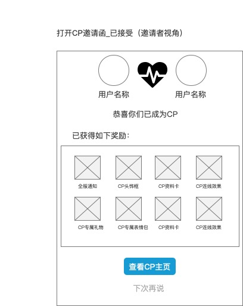

###### 被邀请者已接受结果视角
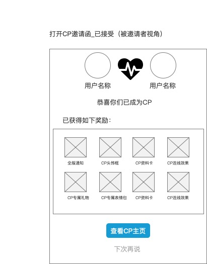

**说明：** 同一已接受邀请在双方侧共享关系建立结果，但展示文案按邀请者 / 被邀请者视角区分。

**功能描述：** 邀请者侧看到“对方已接受邀请”的结果通知页，用于承接邀请成功后的结果反馈和后续进入 CP 主页的跳转。

**关键交互：** 邀请者打开该通知后可查看关系已建立结果，并继续进入 CP 主页或关系详情；该页不再提供重复发起或重新处理邀请的动作。

##### 前置条件
| 条件项 | 说明 |
|---|---|
| 当前邀请已被接受 | 服务端已将邀请状态更新为已接受 |
| 当前用户是发起者 | 仅发起者收到该结果通知 |
| CP关系已成功建立 | 通知必须建立在关系创建成功之后 |

##### 页面字段定义表
| 字段 | 说明 | 数据来源 |
|---|---|---|
| 对方资料 | 头像、昵称、基础信息 | 用户资料 |
| 接受结果文案 | 说明对方已接受邀请并已成为 CP | 消息模板、功能配置 |
| 当前CP等级 | 刚建立后的初始等级或关系标识 | CP等级配置、CP关系记录 |
| 初始亲密度 | 接受后写入的初始亲密度 | 邀请快照、礼物配置、计算结果 |
| 查看主页按钮 | 点击后按通用状态校验通过后进入 CP 主页 | 页面配置、CP关系记录 |
| 查看关系详情入口 | 点击后按通用状态校验通过后进入关系详情或等级权益页 | 页面配置、CP关系记录 |

##### 统计/计算口径
| 口径项 | 规则 |
|---|---|
| 通知触发时机 | 仅在关系创建成功后触发 |
| 初始亲密度 | 以后台已发布组建CP礼物配置计算后的实际亲密度结果为准 |
| 发起者财富值结果 | 组建礼物金币 × 1 |
| 查看主页跳转校验 | 点击 `查看主页` 时以双方当前最新 CP 关系状态为准 |
| 查看关系详情跳转校验 | 点击 `查看关系详情` 时以双方当前最新 CP 关系状态为准 |
| 消息终态 | 已接受结果为只读终态，不再允许取消或重复邀请 |

##### 交互逻辑
1. 被邀请者接受邀请后，系统向发起者推送“邀请被接受”结果通知。
2. 通知展示对方资料、关系建立结果、按后台礼物配置结算后的初始亲密度结果或权益摘要。
3. 用户点击 `查看主页` 或 `查看关系详情` 后，系统先校验双方当前是否仍为有效 CP 关系。
4. 若双方当前仍为 CP，则按点击入口分别进入 CP 主页已绑定态或关系详情页，而不是回到旧的待处理邀请页。
6. 关闭通知后，资料页中的 CP 模块、邀请列表、私聊消息卡片和房间展示都应同步刷新为当前最新关系状态。

##### 状态定义
| 状态 | 触发条件 | 页面表现 |
|---|---|---|
| 接受结果态 | 对方已接受邀请 | 展示关系建立成功结果 |
| 已查看态 | 用户点击查看或关闭 | 回退主页或原场景 |

##### 系统后台核心逻辑
- 关系创建成功后，服务端需更新邀请状态、写入初始亲密度、增加发起者财富值并向发起者生成接受结果通知。
- 发起者侧通知只展示结果，不允许通过该通知重新进入旧待处理状态。
- 点击 `查看主页` 或 `查看关系详情` 时遵循“8.6 跨入口关系状态实时校验与失效拦截”；命中失效时停留当前通知结果态。

##### 异常与测试关注点
- 覆盖点击 `查看主页` 或 `查看关系详情` 时双方已解除 CP，toast 提示 `双方已解除CP关系` 且阻断跳转。
- 覆盖房间内同步展示、双方不在同房间、关系建立成功但特效失败。
#### 2.2 邀请被拒绝通知
##### 页面定位
邀请被拒绝通知用于在发起者侧承接“对方已拒绝当前邀请”的结果反馈，帮助用户知道本次建联失败并同步刷新资料页、邀请列表和待处理状态。

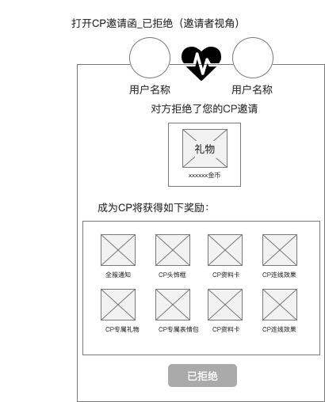

###### 被邀请者已拒绝结果视角
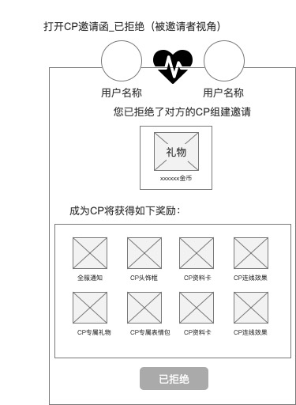

**说明：** 邀请者侧展示“对方拒绝”，被邀请者侧展示“您已拒绝”，两者不可互换。

**功能描述：** 邀请者侧看到“对方已拒绝邀请”的结果通知页，用于反馈邀请终态和后续回流结果。

**关键交互：** 邀请者只能查看拒绝结果和相关退回状态，不应在该页继续强行改写邀请状态；后续如允许重新邀请，需重新走新的邀请链路。

##### 前置条件
| 条件项 | 说明 |
|---|---|
| 当前邀请已被拒绝 | 服务端已将邀请状态更新为已拒绝 |

##### 页面字段定义表
| 字段 | 说明 | 数据来源 |
|---|---|---|
| 拒绝结果文案 | 说明对方已拒绝本次邀请 | 功能配置、消息模板 |
| 退币说明 | 当前邀请礼物金币退回结果 | 钱包记录、邀请记录 |
| 查看邀请按钮 | 跳回邀请详情或邀请列表 | CP 功能配置 |
| 关闭按钮 | 关闭当前结果页 | 客户端交互 |

##### 统计/计算口径
| 口径项 | 规则 |
|---|---|
| 通知触发时机 | 邀请状态被更新为已拒绝后触发 |
| 退币结果 | 以钱包退回成功或补偿状态为准 |
| 主页回退 | 关闭后资料页 CP 模块回退为可再次邀请态 |

##### 交互逻辑
1. 发起者在对方拒绝邀请后收到结果通知或结果弹层。
2. 页面展示“对方已拒绝”的结果，并同步说明当前邀请已结束。
3. 用户可点击查看按钮回到邀请详情或邀请列表，确认当前状态和退币结果。
4. 关闭通知后，资料页中的 CP 模块应回退为可再次邀请态，而不是继续停留在待处理态。

##### 状态定义
| 状态 | 触发条件 | 页面表现 |
|---|---|---|
| 拒绝结果态 | 对方已拒绝 | 展示拒绝结果和退币说明 |
| 已关闭态 | 用户关闭通知 | 回退原页面或邀请列表 |

**系统后台核心逻辑：** - 拒绝成功后，服务端需更新邀请状态、处理退币并向发起者生成结果通知。
##### 异常与测试关注点
#### 2.3 邀请已取消通知
##### 页面定位
邀请已取消通知用于承接“邀请发起者接受第三方 CP 邀请并成功建立关系，系统自动取消其此前已发出的其他待处理邀请”的结果反馈。

##### 触发条件
- A 向 B 发出的邀请仍为 Pending；
- A 接受 C 的 CP 邀请且 A-C 关系创建成功；
- 系统将 A→B 的邀请更新为 Canceled，并完成原支付金币退回处理。

##### 私聊展示与交互
| 查看角色 | 私聊卡片/结果文案 | 点击结果 | 可执行操作 |
|---|---|---|---|
| 邀请者 A | `CP邀请已取消` | 进入已取消只读结果页，展示退款结果 | 仅查看、关闭 |
| 被邀请者 B | `对方已取消CP邀请` | 进入已取消只读结果页 | 仅查看、关闭 |

##### 系统处理规则
1. A-C 关系创建成功后，A→B 邀请才允许从 Pending 转为 Canceled；若 A 接受 C 失败，则不得取消 A→B 邀请。
2. Canceled 为只读终态，B 不得再接受或拒绝；B 若停留在邀请详情页，页面应立即隐藏操作按钮并刷新为已取消结果。
3. A→B 邀请原支付金币原路退回 A；同一邀请只允许成功退款一次。
4. A、B 双方私聊消息卡片、邀请详情、待处理数量、房间邀请入口和系统通知同步刷新。
5. 历史消息卡片继续保留；再次点击时读取 Canceled 最新状态，不得回到 Pending 处理页。

##### 并发边界
| 并发场景 | 处理结果 |
|---|---|
| B 接受 A→B 与 A 接受 C 同时发生 | 以先成功创建 CP 关系的操作为准；若 A-C 先成功，A→B 转为 Canceled；若 A-B 先成功，A→B 转为 Accepted，A 接受 C 的操作失败 |
| Canceled 状态写入与退款重复重试 | 保持同一 Canceled 结果，不重复退款、不重复发送结果消息 |

#### 2.4 邀请通知卡片
##### 页面定位
邀请通知卡片是私聊页或消息流中承接 CP 邀请事件的消息卡片，用于把用户从聊天流带回邀请处理链路。

> 本节与 `1.2 收到邀请函消息卡片` 使用同一组消息卡片原型，相关画面可对照 `被邀请者视角_cp邀请函.jpg`。

##### 前置条件
| 条件项 | 说明 |
|---|---|
| CP 邀请事件已产生 | 邀请创建成功或状态变化 |
| 当前用户可接收该消息 | 会话权限正常 |

##### 页面字段定义表
| 字段 | 说明 | 数据来源 |
|---|---|---|
| 消息类型 | 邀请、接受、拒绝、取消、解除关系等 | 邀请记录、事件记录 |
| 卡片标题 | 如“CP邀请函” | 消息模板 |
| 消息文案 | 当前邀请状态的提示文案 | 消息模板 |
| 查看按钮 | 点击进入邀请函页或邀请详情页 | 页面配置 |
| 跳转目标 | 邀请函页、邀请详情页、终态页 | 事件类型 |
| 状态摘要 | 当前是否仍可处理 | 邀请记录 |

##### 统计/计算口径
| 口径项 | 规则 |
|---|---|
| 卡片生成时机 | 邀请创建或状态变化后生成 |
| 跳转校验 | 点击时按最新邀请状态重新校验 |
| 历史留痕 | 历史消息保留，但不允许绕过当前状态处理 |

##### 交互逻辑
1. CP 邀请或状态变化发生后，系统在私聊消息流中生成对应卡片。
2. 私聊消息流中的卡片至少应承接：邀请函、接受结果、拒绝结果、取消结果、解除关系结果；它们共同构成关系状态在聊天流中的留痕链。
3. 用户点击卡片后，进入邀请函页或邀请详情页，而不是停留在纯文本通知层。
4. 若消息对应的邀请已终态，则进入时展示最新结果，不允许重复处理。
5. 历史卡片保留在聊天流中，但不能绕过当前状态校验。
6. 邀请通知卡片在产品上承担“消息流中的业务入口”角色，因此字段颗粒度应至少能支撑：谁发起、当前状态、点击去哪里、是否还能处理。

##### 状态定义
| 状态 | 触发条件 | 页面表现 |
|---|---|---|
| 可处理消息态 | 邀请仍待处理 | 点击后进入处理链路 |
| 结果消息态 | 邀请已终态 | 点击后进入结果摘要或详情 |

##### 系统后台核心逻辑
- 消息卡片由服务端事件生成，不由客户端自行拼接关键业务文案。
- 点击消息卡片时必须重新校验当前邀请状态和权限。

**异常与测试关注点：** - 覆盖待处理、终态、重复点击、历史消息、状态过期后的跳转一致性。
### 3. 成长与关系系统通知
#### 3.1 CP等级升级触发与动画调度

**功能说明：** CP等级升级系统负责把“亲密度增长后的等级变化”转化为双方可感知的升级反馈。等级计算、动画、奖励和通知属于同一次升级结果的不同承接，不得各自重复计算等级或重复发奖。
##### 升级触发判定
| 场景 | 处理规则 |
|---|---|
| 单次升级 | 新等级高于旧等级时触发一次升级链路 |
| 多级连升 | 合并为一次升级结果，展示最终等级，并汇总跨越等级解锁的权益与奖励 |
| 等级未变化 | 只刷新亲密度进度，不播放升级动画、不弹奖励 |
| 达到满级 | 展示满级升级反馈，后续增长不再重复触发满级动画 |
| 关系已解除 | 终止尚未开始的动画；已确认产生的奖励按奖励状态继续处理 |

##### 即时与延迟触发
1. 用户当前处于可展示全局浮层的页面时，升级结果确认后即时进入动画调度。
2. 用户处于支付、视频、强制弹窗或其他不可打断状态时，升级反馈延迟到高优先级内容结束后展示。
3. 用户离线时不强制播放动画；下次进入客户端后展示未消费的升级结果与奖励承接。
4. 延迟只影响展示时机，不影响等级写入、权益生效和奖励资格生成。

##### 动画分级
| 升级级别 | 动画形式 | 适用说明 |
|---|---|---|
| 普通升级 | 轻提示或局部高亮 | 不遮挡当前操作，突出新等级 |
| 重要等级升级 | 半屏动画 | 展示双方头像、新等级和核心解锁权益 |
| 高级/里程碑升级 | 全屏动画 | 展示双方头像、关系等级、完整升级氛围和播报入口 |

##### 动画队列与优先级
1. 升级动画进入全局动画队列，不与支付结果、CP建立动画或更高优先级活动动画同时全屏播放。
2. 同一关系短时间内多级连升只保留一条队列记录，最终等级覆盖中间等级，奖励列表合并但不得漏发。
3. 多个不同CP升级事件按确认时间进入队列；高级/里程碑升级可高于普通礼物动画，但不得中断正在进行的支付确认。
4. 动画资源加载失败时不播放或轻提示，升级结果、权益和奖励弹窗仍继续执行。

##### 动画展示内容
- 当前CP双方头像与昵称；
- 旧等级、新等级和升级方向；
- 本次新解锁的权益摘要；
- 进入CP主页或查看等级奖励的入口；
- 多级连升时展示“已连升至CP{等级}”，不逐级重复播报。

#### 3.2 CP升级奖励弹窗与发放

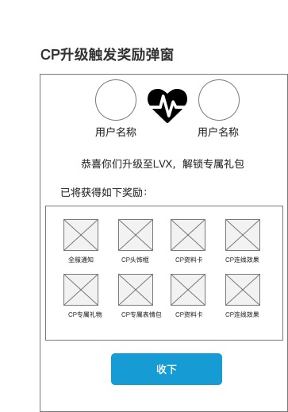

**功能说明：** 升级奖励弹窗承接本次CP等级提升实际可获得的奖励，奖励来源、发放资格与当前关系的等级成长结果绑定。
##### 展示时机与强制承接
1. 升级动画结束后展示奖励弹窗；动画未播放时，奖励弹窗仍需独立展示。
2. 同一次多级连升将跨越等级的可发奖励合并为一张弹窗，并按等级从低到高排列。
3. 用户切换页面或短暂离开客户端时，未消费的奖励弹窗保留；下次进入可展示页面后继续承接。
4. 关系在动画后解除，不影响本次升级时已生成的非永久奖励资格；永久属性物料按当前有效关系状态展示。

##### 页面字段定义表
| 字段 | 说明 |
|---|---|
| 双方头像 | 本次升级关系双方头像 |
| 新等级 | 本次升级后的最终等级 |
| 奖励列表 | 奖励图标、名称、数量、有效期和来源等级 |
| 新权益列表 | 本次解锁的资料卡、连线、气泡框、主页背景等权益 |
| 收下按钮 | 用户确认查看并领取本次奖励 |
| 发放状态 | 待发放、发放中、已发放、部分失败、待补偿 |

##### 发放规则
1. 当前CP关系首次达到对应等级时，为双方分别生成奖励资格；双方奖励按同一配置独立发放。
2. 用户点击“收下”后提交发放，按钮进入处理中并防重复点击。
3. 用户关闭弹窗、掉线或长时间未点击时，系统自动发放兜底；不能因未点击导致奖励永久丢失。
4. 同一关系、同一等级、同一用户、同一奖励只允许成功发放一次。
5. 多级连升时分别记录每个跨越等级的发放结果，弹窗可以合并展示，账务不能合成一笔不可追溯结果。
6. 一方发放失败不阻断另一方；失败方进入补偿队列并在再次查看时展示最新状态。

##### 状态定义
| 状态 | 页面表现 | 操作 |
|---|---|---|
| 待发放 | 展示完整奖励列表和“收下”按钮 | 可确认领取 |
| 发放中 | 按钮不可重复点击 | 等待结果 |
| 已发放 | 展示到账结果 | 可关闭或查看主页 |
| 部分失败 | 标记失败奖励 | 自动重试或等待补偿 |
| 自动发放 | 展示“奖励已自动发放” | 可查看奖励明细 |

##### 异常与测试关注点
- 覆盖部分奖励成功、部分失败时不重复发放成功项。
- 覆盖动画失败但奖励弹窗和自动发放仍正常执行。

#### 3.3 CP升级通知与全服播报

##### 双方升级通知
1. 等级写入成功后，向双方发送升级通知，展示最终等级、新解锁权益和奖励状态。
2. 点击通知进入CP等级奖励页或当前CP主页；进入前校验当前关系。
3. 关系已解除时仍可查看历史升级与已发放奖励，但不得进入失效关系主页。
4. 通知发送失败可补发，不得反向回滚已完成的升级或奖励。

##### 全服升级播报
1. 仅高级等级、里程碑等级或特殊CP成就命中播报配置时触发。
2. 播报展示双方头像、昵称、新等级或成就名称，以及“查看”入口。
3. 全服播报只展示已确认的升级结果，不影响双方奖励发放。
4. 点击“查看”时，关系仍有效则进入CP主页；关系已解除则展示最新状态，不进入旧关系。
5. 多级连升只按最终命中的最高播报等级展示一次，避免连续刷屏。

##### 动画与播报去重
- 升级全屏动画面向关系双方；全服播报面向其他用户，两者可由同一升级结果触发，但分别按展示对象去重。
- 同一升级结果不得重复生成多条全服播报。
- 播报队列拥堵时可延迟展示，不得篡改等级、奖励或权益结果。

#### 3.4 CP解体通知
##### 页面定位
CP解体通知用于在关系解除后向双方同步结果，明确说明关系已拒绝、权益已拒绝以及后续查看落点。该通知是结果反馈，不是操作入口。

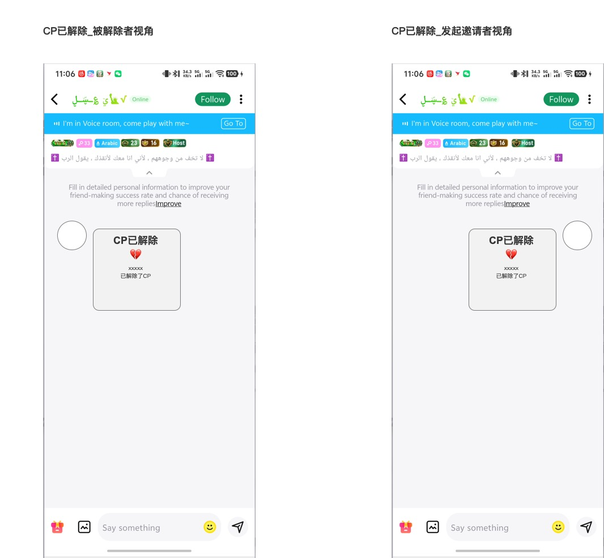

**功能描述：** CP 解体后的通知或结果承接页，用于向双方反馈关系已解除的结果和后续状态。

**关键交互：** 用户打开该通知后只能查看解体结果与后续引导，不应继续把已终止关系重新视为可直接恢复的待处理状态。

##### 前置条件
| 条件项 | 说明 |
|---|---|
| CP 关系解除成功 | 通知必须在系统确认关系已解除后发送 |
| 双方账号可接收通知 | 账号封禁、注销按消息规则处理 |
| 解除来源明确 | 需要区分本人主动解除、对方解除、系统解除 |

##### 页面字段定义表
| 字段 | 说明 | 数据来源 |
|---|---|---|
| 解除结果文案 | “你与XX的CP关系已解除”或等价文案 | CP消息模板 |
| 解除发起方 | 本人 / 对方 / 系统 | 解除关系记录 |
| CP主页入口 | 点击通知进入 CP 主页未绑定态 | 消息卡片配置 |
| 权益失效说明 | 等级权益、专属礼物已拒绝 | CP功能配置 |
| 解除时间 | 关系失效时间 | CP关系记录 |

##### 统计/计算口径
| 口径项 | 规则 |
|---|---|
| 通知发送时机 | 必须在关系解除成功后发送 |
| 历史保留 | 历史亲密度、礼物记录、榜单快照按历史记录保留 |
| 跳转口径 | 点击后进入未绑定态或当前最新关系状态 |

##### 交互逻辑
1. 系统确认关系已解除后，向双方推送解体通知。
2. 通知文案根据解除来源区分，例如“你与[CP昵称]的CP关系已解除”或“[CP昵称]已解除与你的CP关系”。
3. 用户点击通知后，进入 CP 主页未绑定态或当前最新关系状态页，不再进入旧关系页。
4. 原 CP 权益和专属礼物入口同步失效；通知只负责告知，不再允许继续操作旧关系。

##### 状态定义
| 状态 | 触发条件 | 页面表现 |
|---|---|---|
| 解体结果态 | 关系已解除 | 展示解体结果和权益失效说明 |
| 已查看态 | 用户点击查看或关闭 | 回退主页未绑定态或原场景 |

##### 系统后台核心逻辑
| 逻辑项 | 处理规则 |
|---|---|
| 状态先行 | 必须先完成关系解除，再发送解除通知 |
| 权益失效 | 解除后 CP主页、资料卡、私聊CP信息、专属礼物、等级权益同步失效 |
| 历史保留 | 历史亲密度、礼物记录、榜单快照按历史记录保留，不参与当前关系 |
| 通知去重 | 同一次解除只发送一组解除通知，重复解除请求不重复推送 |
| 跳转校验 | 点击解除通知进入 CP主页时，展示未绑定态或当前最新关系状态 |

##### 异常处理
| 异常场景 | 页面处理 | 系统处理 |
|---|---|---|
| 通知发送失败 | 用户进入 CP主页时仍显示未绑定态 | 记录失败并允许补发 |
| 解除后旧入口点击 | 刷新为未绑定态 | 阻断旧关系主页访问 |
| 重复解除请求 | 展示关系已解除 | 不重复写解除记录 |

##### 异常与测试关注点
- 覆盖主动解除、对方解除、系统解除、通知点击跳转、解除后权益失效。
#### 3.5 消息通知触发与补偿规则
##### 前置条件
| 条件项 | 说明 |
|---|---|
| 对应业务状态已产生 | 邀请、关系、奖励或退币结果已落库 |
| 通知服务可用 | 支持创建、发送、回执和补偿 |
| 消息模板已发布 | 各类通知模板可读取 |

##### 页面字段定义表
| 字段 | 说明 | 统计/计算方式 | 数据来源 |
|---|---|---|---|
| 通知编号 | 通知唯一标识 | 状态变化时生成 | 通知服务 |
| 业务对象编号 | 关联邀请、关系、奖励或退币记录 | 按触发来源绑定 | CP邀请/CP关系/钱包记录 |
| 通知状态 | 已发送、发送失败、已读 | 通知服务回执更新 | 通知服务 |
| 剩余时间 | 邀请待处理剩余时间 | 邀请处理截止时间 - 当前时间 | CP邀请记录 |
| 退款金额 | 退回金币数量 | 原邀请礼物消耗金币数 | 钱包记录 |
| 模板类型 | 邀请、接受、拒绝、取消、升级、维护、解除、退币等 | 通知模板配置 |

##### 统计/计算口径
| 口径项 | 规则 |
|---|---|
| 通知去重 | 同一状态变化使用业务对象编号 + 状态作为去重口径 |
| 退币通知触发 | 钱包退回成功后发送；补偿处理中则延迟或展示处理中状态 |
| 详情落点校验 | 点击通知卡片时以最新业务状态重新校验 |

##### 交互逻辑
1. 用户收到 CP邀请后，通知卡片展示邀请人、礼物、权益说明和剩余时间。
2. 用户点击通知卡片进入邀请详情页，详情页必须重新校验邀请当前状态。
3. 若邀请已被接受、主动拒绝、系统统一转为已拒绝或已取消，详情页展示最终状态，不再展示可操作按钮。
4. 发生升级、解除、退币等结果时，通知文案必须明确说明发生了什么和用户下一步能做什么。
5. 通知发送失败不应影响主业务状态，但必须记录失败并允许补发或在用户进入页面时展示最新状态。

##### 状态定义
| 状态 | 触发条件 | 页面表现 |
|---|---|---|
| 待发送态 | 业务结果已产生，消息待发出 | 进入通知发送队列 |
| 已发送态 | 通知发送成功 | 用户可看到消息卡片 |
| 发送失败态 | 通知发送失败 | 进入补偿或重试队列 |
| 已读态 | 用户点击查看 | 标记为已读 |
| 补偿处理中 | 钱包退回或通知补发尚未完成 | 展示处理中或延迟投递 |

##### 系统后台核心逻辑
- 通知只能反映系统后台最终状态，不能由页面根据本地倒计时自行改写邀请状态。
- 退币通知必须在钱包退回成功后发送；如果退币补偿处理中，通知应展示“退回处理中”或延迟发送，避免用户看到已退但余额未变。
- 邀请状态变更与通知发送需要有业务对象编号关联，便于客服追溯。
- 同一状态变化不要重复发送多条相同通知；需要用业务对象编号 + 状态作为去重口径。
- 通知发送失败应进入补偿任务，不回滚主业务状态。

##### 异常与测试关注点
- 覆盖发送成功、发送失败、重试成功、补偿处理中
- 覆盖点击通知后状态已变化、详情页重新校验
- 覆盖退币通知与钱包到账时序不一致、去重口径和重复消息防护
#### 3.6 CP细分通知类型与跳转规则

**功能说明：** CP系统通知按业务事件拆分类型，每种通知必须独立定义触发条件、接收对象、展示文案和点击去向，不能全部压成“CP状态变化通知”。
##### 个人通知类型
| 通知类型 | 触发条件 | 接收对象 | 核心内容 | 点击去向 |
|---|---|---|---|---|
| 邀请系统拒绝提醒 | Pending邀请因处理期限结束转为Rejected且退款结果已生成 | 邀请者、被邀请者 | 对方信息、处理截止时间、退款状态 | 邀请详情结果态 |
| 新特权解锁提醒 | CP等级提升并解锁新的等级权益 | CP双方 | 新等级、新特权名称、使用场景 | 等级奖励页或权益说明页 |
| 解除后永久属性物料失效提醒 | CP关系解除成功，当前关系对应资料卡、连线、气泡框、主页背景失效 | CP双方 | 已失效物料清单、解除时间 | CP主页当前未绑定态或最新关系状态 |

##### 全服播报类型
| 播报类型 | 触发条件 | 展示对象 | 核心内容 | 点击去向 |
|---|---|---|---|---|
| 高级CP升级播报 | 升级到配置的高级/里程碑等级 | 命中展示范围内用户 | 双方头像、昵称、新等级 | 当前有效CP主页 |
| 特殊CP成就播报 | 达成配置的特殊成就 | 命中展示范围内用户 | 成就名称、双方信息、达成时间 | 成就详情或CP主页 |
| 高级CP绑定全服祝福 | 使用满足全服祝福门槛的组建礼物且关系进入Accepted | 命中展示范围内用户 | 双方头像、昵称、组建祝福 | 当前有效CP主页 |

##### 触发与结果口径
1. 业务状态先成功，再生成通知或播报；Pending邀请、支付失败或关系仍未建立时不得提前发送成功类内容。
2. 邀请系统拒绝提醒须读取 Rejected 状态，并明确说明因处理期限结束未处理而被系统拒绝。
3. 新特权解锁提醒按多级连升合并展示本次新增权益，不重复列出此前已解锁权益。
4. 永久属性物料失效提醒只说明当前关系展示权益失效，不得误写为回收已经到账的非永久奖励。
5. 同一业务事件、同一接收对象、同一通知类型只生成一条有效通知；补发不得形成重复未读项。

##### 点击与失效处理
1. 点击个人通知时读取邀请、关系或奖励的最新状态，历史通知可以查看结果，但不能绕过当前资格继续操作。
2. 点击全服播报时，目标关系仍有效则进入CP主页；已解除或已变更时展示“该CP关系已失效”，不进入旧关系页。
3. 页面或目标资源不可用时保留通知已读结果，并展示兜底说明，不反向撤销业务状态。

##### 异常与测试关注点
- 覆盖通知延迟、重复发送、关系在点击前解除、多级连升、双方一方离线。
- 覆盖过期退款处理中、永久物料失效列表读取失败、播报资源加载失败。
- 全服播报排队不影响等级、绑定和奖励结果。

## 三、CP主页与关系展示模块
### 1. 主页入口与主页状态
#### 1.1 CP主页入口

> 本节为入口路由规则模块，无独立客户端原型。  
> 未绑定用户进入后落地页原型见 **1.2 未绑定 CP 主页**。  
> 已绑定用户进入后落地页原型见 **1.3 已绑定 CP 主页**。

**功能描述：** CP主页入口是用户从 Mine 页、个人主页、房间、好友列表等场景进入 CP 模块的统一入口。点击后根据当前关系状态分流至未绑定主页或已绑定主页。

**关键交互：**
1. 用户从各业务入口点击 `CP` 后进入 CP 主页
2. 无 CP 关系：落到未绑定主页（见 1.2）
3. 已绑定 CP：落到已绑定主页（见后续模块）
4. 存在待处理邀请：入口红点提示，进入后优先承接待处理事项
5. 不同入口只影响"从哪里来"，不改变主页分流规则

##### 前置条件
| 条件项 | 说明 |
|---|---|
| 用户已登录 | 未登录不可进入 CP 主页 |
| CP 功能开启 | 当前版本、地区、分层允许使用 |

##### 页面字段定义表
| 字段 | 说明 | 数据来源 |
|---|---|---|
| 入口位置 | Mine 页、个人主页、房间、好友列表等 | 页面配置 |
| CP 状态红点 | 待处理邀请数量提示 | 邀请记录 |
| 入口文案 | CP、我的CP、组建CP等 | CP 功能配置 |

##### 统计/计算口径
| 口径项 | 规则 |
|---|---|
| 入口红点统计 | 仅统计当前仍可处理的邀请 |
| 主页状态分流 | 进入后根据当前关系状态切未绑定或已绑定主页 |
| 待处理优先级 | 存在待处理事项时，优先把用户带到当前待处理事项 |

##### 交互逻辑
1. 用户从各业务入口点击 `CP` 后进入 CP 主页面。
2. 进入后系统立即读取当前状态，并决定展示未绑定主页或已绑定主页。
3. 若有待处理邀请，则入口红点和主页入口摘要需同步展示。
4. 不同入口只影响“从哪里来”，不改变 CP 主页本身的业务规则。
5. 若入口带有待处理红点，则点击进入后应优先把用户带到当前待处理事项，而不是简单回到空白主页。

##### 状态定义
| 状态 | 触发条件 | 页面表现 |
|---|---|---|
| 普通入口态 | 无特殊待处理事项 | 正常进入 CP 主页 |
| 红点提醒态 | 存在待处理邀请 | 展示待处理数量提示 |

##### 系统后台核心逻辑
- 不同入口共用同一套主页状态分流规则。
- 入口红点和主页内待处理状态必须使用同一数据口径。

**异常与测试关注点：** - 覆盖多入口、红点刷新和状态分流一致性。
#### 1.2 未绑定 CP 主页

###### 原型一：未绑定 CP 主页主状态

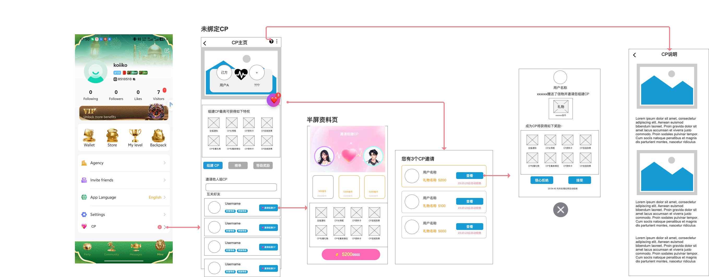

**功能描述：** 未绑定状态下的 CP 主页主状态。顶部展示未绑定关系卡和权益展示区，下方为 `组建CP / 榜单 / 等级奖励` 三个一级 Tab，默认选中组建CP Tab。

**关键交互：**
1. 顶部展示未绑定关系卡，提示用户可组建 CP
2. Tab 栏展示三个入口：组建CP / 榜单 / 等级奖励
3. 默认选中组建CP Tab，展示待处理邀请、搜索目标对象、推荐对象
4. 点击榜单 Tab 进入榜单页
5. 点击等级奖励 Tab 进入等级奖励页

###### 原型二：组建CP Tab

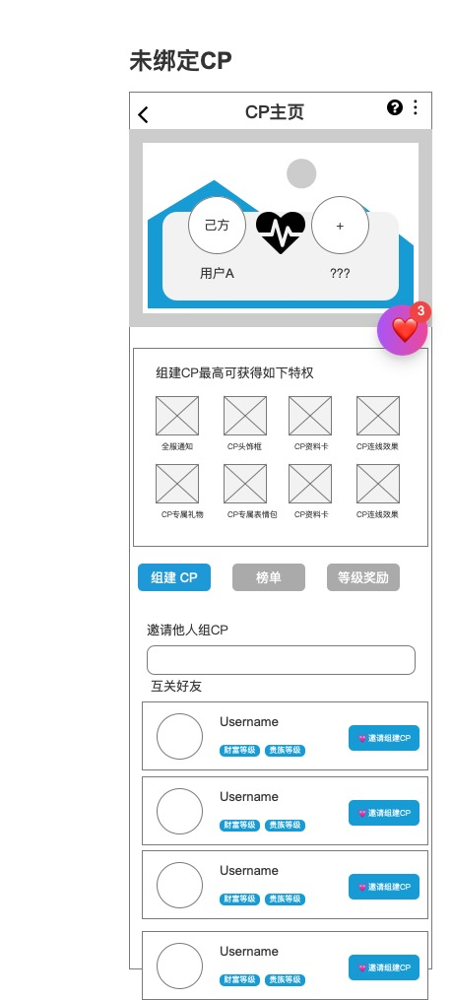

**功能描述：** 组建CP Tab 展示待处理邀请列表、搜索目标对象、推荐对象和邀请按钮。

**关键交互：**
1. 顶部搜索栏：输入用户编号或昵称搜索目标对象
2. 推荐对象区：展示系统推荐的可组建 CP 对象
3. 待处理邀请区：展示当前收到的待处理邀请卡片
4. 点击邀请按钮进入邀请发起流程

###### 原型三：榜单 Tab

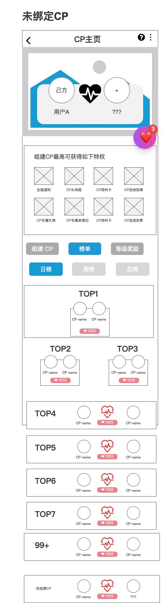

**功能描述：** 榜单 Tab 展示 CP 日榜/周榜/总榜。

**关键交互：**
1. Tab 栏切换：日榜 / 周榜 / 总榜
2. 榜单列表展示排名、CP 双方头像、亲密度
3. 点击某条 CP 可查看详情

###### 原型四：等级奖励 Tab

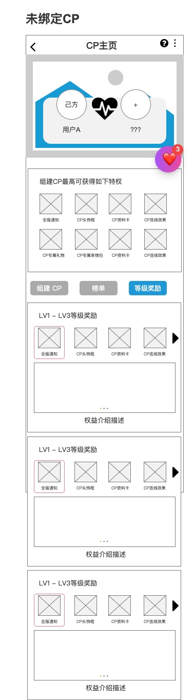

**功能描述：** 等级奖励 Tab 展示 CP 各等级段奖励预览。

**关键交互：**
1. 展示等级列表和对应奖励
2. 点击某等级可查看奖励详情
3. 底部展示规则说明入口

##### 前置条件
| 条件项 | 说明 |
|---|---|
| 用户已登录 | 游客态不进入 CP 主页 |
| 当前无有效 CP 关系 | 已绑定用户进入的是已绑定 CP 主页，不是本页 |
| CP 功能已开启 | 当前版本、地区和用户分层允许使用 CP 功能 |
| 页面基础数据可读取 | 包括待处理邀请数、权益展示、Tab配置、榜单数据、等级奖励预览、搜索结果、推荐列表 |

##### 页面字段定义表
| 页面区块 | 字段 | 展示规则 | 数据来源 |
|---|---|---|---|
| Mine页入口 | CP入口红点 | 有待处理邀请时显示红点；超出99显示99+ | CP 邀请记录 |
| 顶部关系卡 | 页面标题 | 固定显示 `CP主页` | 页面配置 |
| 顶部关系卡 | 当前状态 | 显示未绑定状态提示 | 页面文案配置 |
| 顶部关系卡 | 用户A（自己） | 左侧展示本人头像或个人卡位 | 用户资料 |
| 顶部关系卡 | 占位对象 `???` | 右侧展示待绑定占位对象 | 页面资源配置 |
| 顶部关系卡 | CP连接icon | 展示心形/心电图连接样式 | 客户端资源配置 |
| 顶部关系卡 | 初级CP背景板 | 未绑定状态统一展示初级背景板 | 背景板配置 |
| 邀请入口区 | 心形邀请入口 | 进入邀请列表或邀请处理链路 | 页面配置 |
| 邀请入口区 | 邀请红点数量 | 展示待处理邀请数量 | CP 邀请记录 |
| 权益展示区 | 模块标题 | 展示 `组建CP最高可获得如下特权` | 页面文案配置 |
| 权益展示区 | 权益九宫格 | 图标 + 名称形式展示权益预览 | 权益配置、组建礼物配置 |
| Tab切换区 | 一级Tab | 展示 `组建CP`、`榜单`、`等级奖励` 三个一级Tab | 页面配置 |
| 榜单Tab | 榜单二级Tab | 展示 `日榜`、`周榜`、`总榜` 切换 | 榜单配置 |
| 榜单Tab | TOP榜单卡片 | 展示TOP1 / TOP2 / TOP3 的特殊样式卡片 | 榜单数据、页面配置 |
| 榜单Tab | 常规榜单列表 | 展示TOP4以后榜单行、99+区间和本人占位行 | 榜单数据、页面配置 |
| 榜单Tab | 本人排名占位 | 未上榜或未建CP时展示本人占位信息 | 榜单数据、CP关系状态 |
| 等级奖励Tab | 等级段标题 | 如 `LV1-LV3等级奖励` | 等级配置、奖励配置 |
| 等级奖励Tab | 奖励权益icon | 展示当前等级段包含的权益icon和名称 | 等级奖励配置、权益配置 |
| 等级奖励Tab | 权益选中态 | 当前选中的权益icon高亮 | 客户端交互状态 |
| 等级奖励Tab | 权益说明区 | 展示当前选中权益的图文说明 | 等级奖励配置、权益说明配置 |
| 等级奖励Tab | 等级段切换入口 | 支持查看下一个等级段奖励预览 | 页面配置、等级奖励配置 |
| 搜索区 | 搜索输入框 | 支持输入用户ID或靓号搜索 | 页面配置 |
| 搜索区 | 搜索结果卡片 | 展示头像、昵称、标签、邀请按钮 | 用户资料、搜索结果 |
| 搜索区 | 搜索空态 | 未命中时展示 `输入ID不存在` | 页面文案配置 |
| 推荐列表区 | 推荐数据源 | 以互关好友为主 | 好友关系、推荐策略 |
| 推荐列表区 | 推荐对象头像 | 展示推荐对象头像 | 用户资料 |
| 推荐列表区 | 推荐对象昵称 | 展示推荐对象昵称 | 用户资料 |
| 推荐列表区 | 财富等级 | 展示财富等级标签 | 用户资料 |
| 推荐列表区 | 魅力等级 | 展示魅力等级标签；无等级时不占用标签位置 | 用户资料 |
| 推荐列表区 | 亲密等级 | 展示亲密等级标签 | 用户资料 |
| 推荐列表区 | 推荐标签 | 展示推荐原因或推荐标识 | 推荐策略 |
| 推荐列表区 | `邀请组建CP` 按钮 | 点击后进入发起邀请链路 | 页面配置 |
| 帮助入口 | 帮助入口 | 进入 CP 规则说明页 | 页面配置 |

##### 统计/计算口径
| 口径项 | 规则 |
|---|---|
| 页面适用状态 | 当前无有效 CP 关系时进入本页；有待处理邀请仍属于未绑定主页范畴 |
| 默认一级Tab | 默认展示 `组建CP` Tab |
| 榜单一级Tab口径 | `榜单` Tab 仅新增展示入口，榜单类型、排序、结算、快照、刷新规则完全复用 `### 榜单规则` 与 `#### 2.1 CP榜单 / 2.2 CP榜单结算 / 2.4 CP榜单周期与结算规则` |
| 榜单二级Tab口径 | 展示 `日榜 / 周榜 / 总榜` 三种周期口径，不新增未绑定专属榜单类型 |
| 榜单本人展示口径 | 未绑定用户可查看榜单；本人未上榜或当前未建CP时，展示未建CP/未上榜占位信息，不生成新的榜单统计规则 |
| 等级奖励Tab口径 | `等级奖励` Tab 仅新增展示入口，等级门槛、奖励内容、发放和解锁逻辑复用 `### CP等级体系规则`、`### CP等级配置表` 及既有等级奖励章节 |
| 等级奖励展示口径 | 未绑定用户仅查看等级段奖励预览和权益说明，不触发奖励领取、发放或解锁写入 |
| 待处理邀请数 | 仅统计当前用户仍可处理的 Pending 邀请 |
| 红点显示规则 | 1~99 按真实数量展示；超出99按99+展示 |
| 搜索口径 | 支持通过用户ID或靓号搜索平台用户 |
| 推荐数据源 | 默认以互关好友为主，并叠加推荐策略筛选 |
| 推荐过滤规则 | 已有CP关系、存在任一拉黑关系、封禁用户必须过滤 |
| 推荐排序规则 | 以转化概率优先，综合参考亲密度高、互动频繁、高付费用户等维度 |
| 推荐数量上限 | 最多展示20个推荐用户 |
| 推荐刷新机制 | 每次进入未绑定 CP 主页时实时拉取 |
| 权益展示来源 | 展示后台配置的组建CP礼物中金币价值最高的一组权益 |
| 背景板规则 | 未绑定状态统一显示初级CP背景板 |

##### 交互逻辑
**入口与初始化**
1. 用户从 Mine 页点击 `CP` 入口后，系统先判断当前是否存在待处理邀请；若存在，则在入口和页面内展示红点与快捷入口。
2. 只要当前用户无有效 CP 关系，点击 `CP` 入口后都进入未绑定 CP 主页，而不是直接跳到邀请详情页。
3. 页面初始化时依次加载顶部关系卡、待处理邀请入口、权益展示区、一级Tab区、默认Tab内容和帮助入口；默认进入 `组建CP` Tab。
4. 若页面打开时用户已在其他入口完成 CP 绑定，系统应直接切换到已绑定 CP 主页，不再展示未绑定页面骨架。

**Tab切换链路**
5. 用户点击 `组建CP` Tab 时，页面展示搜索区、推荐列表区和发起邀请相关内容。
6. 用户点击 `榜单` Tab 时，页面展示 `日榜 / 周榜 / 总榜` 二级Tab和对应榜单内容；榜单排序、分层、周期和快照逻辑完全复用已有榜单章节。
7. 用户点击 `等级奖励` Tab 时，页面展示等级段奖励卡片、权益icon和权益说明区；奖励发放、解锁和升级逻辑完全复用既有等级奖励章节。
8. Tab切换只改变当前展示内容，不改变用户当前“未绑定 CP”关系状态。

**邀请入口与待处理链路**
9. 用户点击心形邀请入口后，进入邀请列表，再由邀请列表进入邀请详情，处理接受、拒绝或查看已发邀请结果。
10. 用户从邀请详情返回本页后，待处理数量、入口红点、顶部状态和当前Tab下相关展示必须按最新结果刷新。

**搜索与主动邀请链路**
11. 用户可在 `组建CP` Tab 的搜索区输入用户ID或靓号搜索目标对象。
12. 搜索无结果时，页面在搜索区下方展示空状态文案 `输入ID不存在`。
13. 搜索命中时，页面展示统一的用户结果卡片，至少包含头像、昵称、标签和 `邀请组建CP` 按钮。

**推荐列表链路**
14. `组建CP` Tab 的推荐列表默认展示互关好友，并按推荐策略排序，不要求用户先搜索才能看到可邀请对象。
15. 推荐卡片至少展示头像、昵称、财富等级、魅力等级、亲密等级和 `邀请组建CP` 按钮。
16. 点击推荐卡片时优先进入半屏资料页；点击 `邀请组建CP` 按钮时优先直接进入发起邀请链路。
17. 推荐列表最多展示20个推荐用户；当推荐结果为空时，页面展示兜底空态，但保留搜索区和待处理邀请入口。

**榜单浏览链路**
18. 用户在 `榜单` Tab 下点击 `日榜 / 周榜 / 总榜` 时，仅切换榜单周期视图，不新增其他榜单维度。
19. 榜单页需展示TOP区和常规排名区；未绑定用户本人未上榜或当前未建CP时，展示未建CP/未上榜占位信息。
20. 用户在榜单页点击榜单对象卡片时，跳转逻辑复用既有榜单对象承接规则，不因未绑定态新增特殊跳转链路。

**等级奖励浏览链路**
21. 用户在 `等级奖励` Tab 下可查看不同等级段奖励卡片。
22. 用户点击某个权益icon时，页面在下方说明区展示该权益的对应说明。
23. 用户切换不同等级段时，仅切换奖励预览内容，不触发奖励领取、发放或等级状态变更。

**说明与状态切换链路**
24. 用户点击帮助入口后进入 `1.4 CP 规则说明页`；返回后回到未绑定主页原位置和原Tab。
25. 若用户在本页停留期间通过其他入口成功建立 CP，再次聚焦或刷新本页时，页面必须切换到已绑定 CP 主页。

##### 状态定义
| 状态 | 触发条件 | 页面表现 |
|---|---|---|
| 组建CP默认态 | 无有效 CP 关系，进入未绑定主页默认Tab | 展示顶部关系卡、权益展示、搜索区和推荐列表 |
| 待处理邀请态 | 当前存在待处理邀请 | 在未绑定主页中额外展示心形邀请入口和红点数量 |
| 榜单展示态 | 用户切换到 `榜单` Tab | 展示榜单二级Tab、TOP区和常规榜单列表 |
| 等级奖励展示态 | 用户切换到 `等级奖励` Tab | 展示等级段奖励卡片、权益icon和权益说明区 |
| 搜索命中态 | 搜索成功命中目标对象 | 在 `组建CP` Tab 搜索区下方展示结果卡片 |
| 搜索空态 | 搜索无结果 | 在 `组建CP` Tab 展示 `输入ID不存在` 空态文案 |
| 推荐空态 | 推荐结果为空 | 在 `组建CP` Tab 展示兜底空态，但保留搜索与邀请入口 |
| 榜单本人未上榜态 | 当前用户未上榜或当前未建CP | 榜单区域展示本人占位信息，不影响榜单正常浏览 |
| 状态切换态 | 用户已建立 CP 关系 | 页面刷新后切换到已绑定 CP 主页 |

##### 系统后台核心逻辑
- 未绑定 CP 主页是用户状态页，不是静态介绍页；只要用户当前无有效 CP 关系，即使存在待处理邀请，也应优先展示未绑定主页结构。
- 未绑定主页新增 `组建CP / 榜单 / 等级奖励` 三个一级Tab，但仅新增展示入口，不新增独立业务计算规则。
- `榜单` Tab 的榜单类型、排序、结算、历史快照、刷新口径完全复用既有榜单章节；未绑定态仅承接浏览和转化展示，不改榜单统计对象和统计规则。
- `等级奖励` Tab 的等级门槛、权益内容、解锁条件、奖励发放和升级逻辑完全复用既有等级体系与奖励章节；未绑定态仅承接奖励预览，不产生领取或发奖写入。
- Mine 页入口红点、页面心形邀请入口、邀请列表和邀请详情必须共用同一套 Pending 统计口径。
- 推荐列表优先使用互关好友，并叠加推荐策略筛选；已绑定用户、互相拉黑用户、封禁用户必须从推荐池中剔除。
- 推荐排序口径以转化概率优先，综合考虑亲密度高、互动频繁、高付费用户等维度，不允许前端本地随意改序。
- 权益展示区默认展示后台配置中金币价值最高的组建 CP 礼物权益集合，用于强化转化价值感。
- 搜索结果、推荐结果和邀请前校验必须复用同一套对象可邀请性校验口径，避免出现“搜索可邀、推荐不可邀”的冲突。
- 本页承接“查看邀请、主动找人、快速邀请、查看榜单、查看等级奖励、查看规则说明”六类动作，不直接完成关系建立；关系建立结果由邀请链路回写。
- 当用户状态在其他入口发生变化时，本页再次展示必须按最新关系状态重判，不能沿用旧缓存继续展示未绑定页面。

##### 异常与测试关注点
| 场景 | 预期处理 |
|---|---|
| 当前无推荐对象 | 在 `组建CP` Tab 展示兜底空态，不影响搜索和待处理入口 |
| 推荐对象刚建立了CP关系 | 刷新列表后自动剔除，不允许继续邀请 |
| 推荐对象与当前用户产生拉黑关系 | 刷新后从推荐池移除 |
| 待处理邀请数超过99 | Mine页红点和页面心形入口统一按99+展示 |
| 搜索对象不存在 | 在 `组建CP` Tab 展示 `输入ID不存在` |
| 切换到榜单Tab | 正确展示日榜/周榜/总榜入口和对应榜单内容，不串组建Tab数据 |
| 当前用户未建CP但查看榜单 | 允许正常浏览榜单；本人区域按未建CP/未上榜占位展示 |
| 榜单数据延迟刷新 | 榜单展示遵循既有榜单刷新口径，不因未绑定态产生新的缓存口径 |
| 切换到等级奖励Tab | 正确展示等级段奖励、权益icon和说明区，不触发奖励发放 |
| 等级奖励配置更新 | 未绑定态读取最新已发布等级奖励配置，与既有等级奖励页口径一致 |
| 页面打开期间用户在其他入口建立CP | 页面返回或刷新后切换到已绑定 CP 主页 |
| 邀请列表状态已变化 | 心形入口数量、列表和详情保持一致 |
| 入口红点与页面无邀请 | 视为状态不一致缺陷，必须排查同一口径读取是否失效 |

#### 1.3 已绑定 CP 主页

###### 原型一：已绑定主页主状态
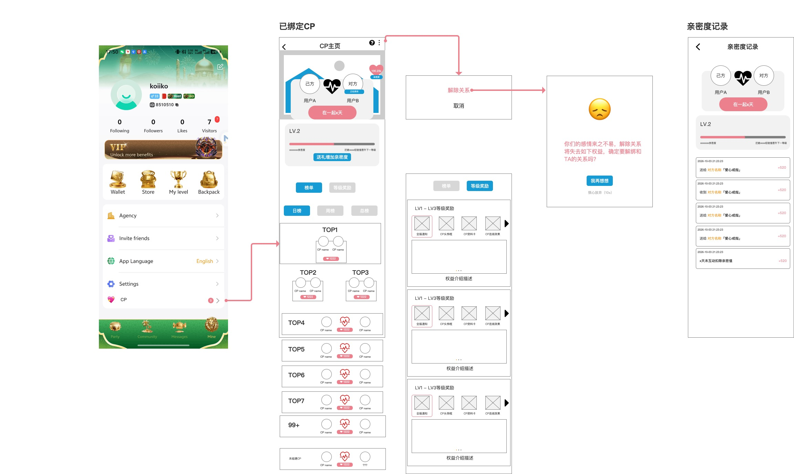

**功能描述：** 已绑定用户进入 CP 主页后的关系经营主页面。页面必须在同一屏内明确展示“双方是谁、关系处于什么等级、已经在一起多久、当前亲密度如何、下一步可以做什么”，

###### 原型二：已绑定 CP 榜单视图
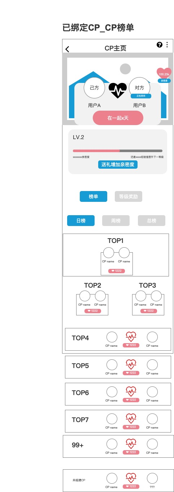

###### 原型三：已绑定 CP 等级奖励视图
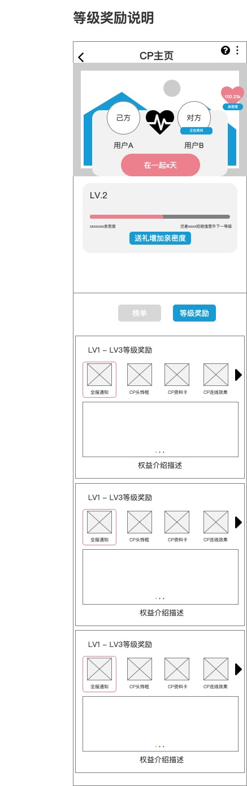

##### 前置条件
| 条件项 | 说明 |
|---|---|
| 当前存在有效CP关系 | 关系已解除时直接展示未绑定主页 |
| 双方资料可读取 | 头像、昵称异常时使用兜底展示，不影响关系读取 |
| 等级与亲密度配置有效 | 用于显示等级、进度、背景和权益入口 |
| 当前关系编号一致 | 主页、榜单、奖励、亲密度必须读取同一关系 |

##### 页面结构
1. **顶部关系卡**：双方头像、双方昵称、CP连线、当前等级、在一起天数和当前关系状态。
2. **等级背景区**：根据当前CP等级读取对应主页背景；等级变化后同步替换，不继续展示旧等级背景。
3. **亲密度成长区**：显示当前亲密度、当前等级、升级进度、距下一等级差值和“送礼增加亲密度”入口。
4. **功能切换区**：提供亲密度记录、榜单、等级奖励等入口或Tab。
5. **关系操作区**：更多菜单中提供解除关系入口，进入前再次校验当前关系。

##### 页面字段定义表
| 字段 | 说明 | 数据来源 |
|---|---|---|
| 双方头像 | 当前CP双方头像 | 用户资料 |
| 双方昵称 | 当前CP双方昵称 | 用户资料 |
| CP连线 | 当前等级对应的关系连线样式 | 当前等级权益 |
| CP等级 | 当前有效关系等级 | 关系等级结果 |
| 在一起天数 | 从绑定成功日起累计的自然日天数 | 绑定成功时间 |
| 当前亲密度 | 当前关系累计有效亲密度 | 亲密度流水 |
| 升级进度 | 当前等级区间内的成长进度 | 等级配置+当前亲密度 |
| 下一等级差值 | 距下一等级门槛的亲密度差值 | 等级配置 |
| 主页背景 | 当前等级对应的主页背景 | 当前等级权益 |
| 榜单状态 | 当前关系在所选榜单中的排名或未上榜状态 | 榜单结果 |
| 等级奖励 | 各等级奖励及当前解锁状态 | 等级奖励配置+领取记录 |

##### 统计与展示口径
1. 在一起天数按绑定成功时间和东三区自然日计算；绑定成功当天记为第一天。
2. 当前亲密度、等级、背景、连线和权益必须基于同一关系编号、同一时点读取。
3. 等级奖励Tab只展示奖励配置和当前解锁/发放结果，不因反复进入页面重复发奖。
4. 榜单口径沿用“CP成长体系与榜单模块”，本节不重复定义榜单周期。

##### 交互逻辑
**入口与初始化**
1. 用户从Mine页CP入口、资料页关系卡或私聊关系摘要进入CP主页。
2. 页面先校验当前关系；有效则加载已绑定主页，无效则切换未绑定主页。

**送礼增加亲密度**
1. 点击“送礼增加亲密度”后打开底部礼物面板，仅定位CP礼物分类。
2. 默认收礼对象为当前CP另一方，不允许默认选中其他用户。
3. 选择礼物并支付成功后，私聊内生成对应礼物消息；亲密度按有效赠送结果刷新。
4. 支付失败、余额不足或关系在支付前失效时，不增加亲密度，不播放成功反馈。

**Tab与页面联动**
1. 点击亲密度、榜单、等级奖励分别进入或切换对应视图。
2. 从子页面返回时重新读取关系、等级和亲密度，避免展示旧缓存。
3. 点击更多菜单中的解除关系，进入解除确认流程；仅打开菜单不改变关系。

##### 状态定义
| 状态 | 触发条件 | 页面表现 |
|---|---|---|
| 已绑定正常态 | 关系有效且数据完整 | 展示完整关系卡、成长区和功能入口 |
| 数据加载态 | 关系有效，摘要数据读取中 | 保留页面骨架，不展示旧关系数据 |
| 等级刷新态 | 亲密度变化导致等级变化 | 同步更新等级、背景、连线和权益 |
| 关系失效态 | 关系已解除或被替换 | 立即切回未绑定主页 |
| 部分数据异常态 | 头像、背景或榜单读取失败 | 使用对应兜底，不影响其他模块操作 |

##### 系统后台核心逻辑
- 已绑定主页只读取当前有效CP关系，历史关系不得继续占用当前主页。
- 亲密度、等级、榜单、权益和主页物料必须通过当前关系统一关联，不能按单个用户拼接两份结果。
- 礼物支付成功后才允许产生亲密度增长、私聊礼物消息和等级变化反馈。
- 关系解除后，主页、私聊、资料页、房间和礼物面板必须同步刷新状态。

##### 异常与测试关注点
- 覆盖支付中关系变化、等级变化和资源加载失败。
- 覆盖从多个入口进入同一主页时关系编号一致。
- 覆盖返回、切换 Tab 和跨端状态刷新。

#### 1.4 CP 规则说明页
##### 页面定位
CP 规则说明页用于解释 CP 关系、亲密度、等级、权益、榜单或解除规则，是纯信息展示页，不直接改变业务状态。

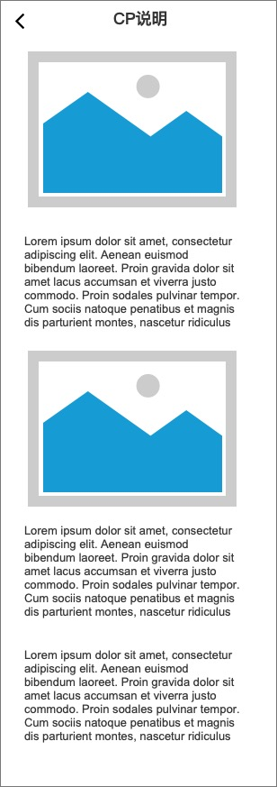

**功能描述：** CP 规则说明页，用于集中展示玩法规则、等级规则、礼物规则和其他帮助说明。

**关键交互：** 用户从主页右上角帮助入口进入该页，浏览规则后原路返回主页；该页本身不直接发起邀请或修改关系状态。

##### 前置条件
| 条件项 | 说明 |
|---|---|
| 用户已进入 CP 模块 | 一般从 CP 主页点击帮助入口进入 |
| 规则文案已发布 | 后台存在当前版本的说明内容 |

##### 页面字段定义表
| 字段 | 说明 | 数据来源 |
|---|---|---|
| 规则标题 | 说明页标题 | 玩法说明配置 |
| 规则分组 | 亲密度、等级、权益、榜单、解除等分组说明 | 玩法说明配置 |
| 文案内容 | 每条规则的详细文字说明 | 运营文案配置 |
| 关闭/返回入口 | 返回上一页 | 客户端交互 |

##### 统计/计算口径
| 口径项 | 规则 |
|---|---|
| 规则版本 | 展示当前已发布版本，不展示历史废弃口径 |
| 返回落点 | 返回进入前的主页状态，不重置业务状态 |

##### 交互逻辑
1. 用户从未绑定主页或已绑定主页点击帮助入口进入说明页。
2. 说明页按分组展示 CP 规则、亲密度规则、等级权益、榜单或解除规则。
3. 用户阅读完成后点击关闭或返回，回到进入前的主页状态。
4. 说明页本身不触发邀请、送礼、解除、升级等业务动作。

##### 状态定义
| 状态 | 触发条件 | 页面表现 |
|---|---|---|
| 正常展示 | 文案加载成功 | 正常显示规则内容 |
| 加载失败 | 配置拉取失败 | 展示失败提示或兜底文案 |
| 返回态 | 用户关闭说明页 | 返回原主页状态 |

##### 系统后台核心逻辑
- 说明页文案必须与当前已发布 CP 配置版本一致，避免页面规则和实际结算口径不一致。
- 说明页仅作展示，不写入邀请、关系、送礼或榜单状态。

##### 异常与测试关注点
| 场景 | 预期处理 |
|---|---|
| 文案加载失败 | 使用兜底说明或失败提示 |
| 返回后主页状态变化 | 回到最新主页状态，不保留旧缓存 |
| 运营文案更新 | 页面读取新版本，不展示旧口径 |
### 2. 资料卡、全屏资料与房间露出
#### 2.1 半屏资料卡 CP 入口

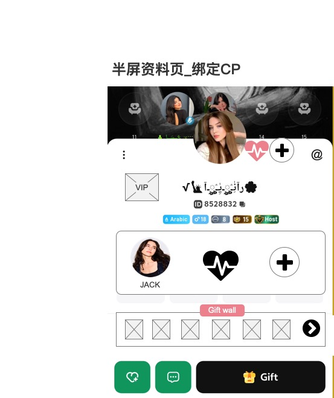

**功能描述：** 半屏资料卡弹窗中的 CP 入口展示区。资料卡顶部展示用户头像、昵称、关注按钮和更多操作按钮，中部展示 CP 关系摘要区（CP 标识、等级、亲密度），下方为其他资料信息和操作按钮。

**关键交互：**
1. 资料卡顶部：用户头像、昵称、`Follow` 按钮、更多按钮
2. CP 关系摘要区：展示 CP 标识、等级、亲密度等关系信息
3. 点击 CP 关系区域可进入 CP 主页或关系详情
4. 无 CP 关系时展示组建 CP 入口

##### 前置条件
| 条件项 | 说明 |
|---|---|
| 用户已登录 | 游客态不展示可操作入口 |
| 当前对象资料可访问 | 未被拉黑、封禁或隐私限制完全拦截 |
| CP 功能已开启 | 当前版本、地区和分层允许使用 |

##### 页面字段定义表
| 字段 | 说明 | 数据来源 |
|---|---|---|
| 半屏资料卡 CP 模块 | 资料卡中的关系入口区块 | 页面布局配置 |
| 对方头像/昵称 | 当前资料页对象信息 | 用户资料 |
| 用户头像+CP展示 | 原型中的资料页强化露出区域 | 用户资料、CP关系记录 |
| CP 标识 | 关系 icon / 等级标签 / 关系摘要 | CP 关系记录、等级配置 |
| `+` 按钮 | 未绑定态主操作入口 | 页面配置 |
| 资料页上下文信息 | 房间入口、Profile、Posts、Gift wall 等完整资料信息 | 用户资料、页面配置 |

##### 统计/计算口径
| 口径项 | 规则 |
|---|---|
| 入口状态 | 由当前关系状态实时决定 |
| 关系摘要 | 使用当前有效关系数据，不沿用历史失效关系 |
| 跳转目标 | 已绑定进入主页，未绑定进入邀请弹窗 |
| 关系入口跳转校验 | 已绑定态点击 CP 模块进入关系主页类页面前，以双方当前最新 CP 关系状态为准 |

##### 交互逻辑
1. 用户打开半屏资料卡后，卡片内展示 CP 模块。
2. 未绑定时，点击 `+` 按钮进入邀请 CP 弹窗；全屏资料页和半屏资料卡进入的是同一套邀请流程。
3. 已绑定时，点击 CP 模块后，系统先校验双方当前是否仍为有效 CP 关系；仍为 CP 时进入 CP 主页或关系详情。
5. 若当前存在待处理邀请，则 CP 模块优先承接邀请查看或处理，不重复触发发起邀请。
6. 全屏资料页中的用户头像区与 CP 展示区应作为一个完整关系露出区理解，而不是两块完全无关的信息区。
7. 用户从邀请链路返回资料页时，资料页 CP 模块需按最新状态刷新。

##### 状态定义
| 状态 | 触发条件 | 页面表现 |
|---|---|---|
| 未绑定 | 无有效关系 | 展示 `+` 按钮 |
| 已绑定 | 存在有效关系 | 展示关系摘要和等级标识 |
| 待处理 | 存在待处理邀请 | 展示待处理入口或状态提示 |
| 不可邀请 | 对方已绑定、开启自动拒绝或命中拦截 | 保留资料页，不进入邀请弹窗 |

##### 系统后台核心逻辑
- 半屏资料卡的 CP 模块与全屏资料页共用同一套关系状态分流规则。
- 点击发起前必须校验双方 CP 状态、互相关系、自动拒绝、黑名单和待处理邀请规则。
- 已绑定态入口进入 CP 主页或关系详情时遵循“8.6 跨入口关系状态实时校验与失效拦截”；命中失效时刷新资料页 CP 模块。

##### 异常与测试关注点
| 场景 | 预期处理 |
|---|---|
| 发起前对象已被邀请他人绑定 | 提示不可邀请或已有待处理邀请 |
| 返回资料页时状态已变化 | CP 模块及时刷新 |
| 点击时关系刚解除 | toast 提示 `双方已解除CP关系`，CP 模块刷新为未绑定态或最新状态 |
| 资料页加载失败 | CP 模块不单独假成功，跟随页面错误态 |
| 对方资料权限变化 | 不展示越权入口 |
#### 2.2 全屏资料页 CP 入口

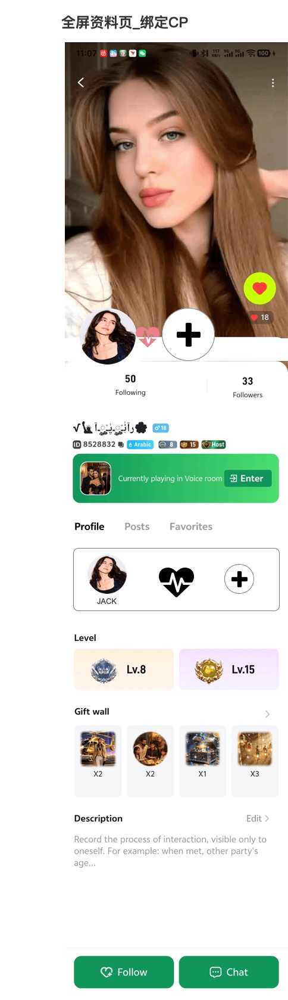

**功能描述：** 全屏资料页内的 CP 关系入口：已绑定展示双方关系摘要和等级标识，未绑定展示 `+` 入口。

###### 双形态对照原型
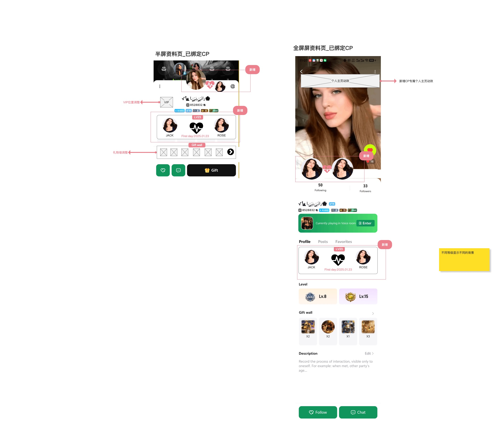

**说明：** 该图同时包含半屏和全屏已绑定资料页，仅用于核对两处关系露出的统一口径，不替代上方全屏资料页原型。

##### 交互逻辑
1. 已绑定点击关系入口前校验当前有效关系，校验通过进入 CP主页或关系详情。
2. 未绑定点击 `+` 进入邀请 CP 弹窗并带入当前对象；待处理邀请优先承接查看/处理，不能重复创建。
3. 从邀请或关系页返回后重新读取关系状态；已解除则刷新为未绑定态。

##### 页面字段与双状态
| 区域 | 未绑定状态 | 已绑定状态 |
|---|---|---|
| CP入口 | 展示 `+` 入口 | 展示当前CP双方头像、关系标识和等级 |
| 等级动效 | 不展示CP等级动效 | 按当前CP等级展示对应动效；加载失败使用静态样式 |
| 点击行为 | 他人资料页进入邀请流程；自己的资料页点击无响应 | 点击进入当前CP主页，进入前校验关系 |
| Gift Wall | 保持资料页原入口 | 点击进入该用户Gift Wall，不得误跳CP礼物面板 |

##### 页面状态规则
1. 查看自己的全屏资料页时，未绑定状态下的 `+` 仅作占位展示，点击不打开邀请弹窗，也不允许对自己发起邀请。
2. 查看他人资料页时，若双方未绑定且无有效Pending邀请，点击 `+` 进入资料页邀请流程。
3. 若双方存在有效Pending邀请，点击入口优先打开已有邀请详情，不创建第二条邀请。
4. 已绑定状态下，关系摘要、等级动效和主页入口必须读取当前有效关系；解除后立即回退未绑定状态。
5. 半屏资料卡与全屏资料页共享关系结果，但各自保留独立布局和关闭/返回方式。

##### 异常与测试关注点
- 覆盖自己的资料页、他人资料页、已绑定、未绑定、Pending及关系刚解除场景。
- 覆盖等级动效加载失败、Gift Wall返回、从邀请页返回后的关系刷新。
- 半屏与全屏不得串用展开状态、滚动位置或当前查看对象。

#### 2.3 资料页发起 CP 邀请承接

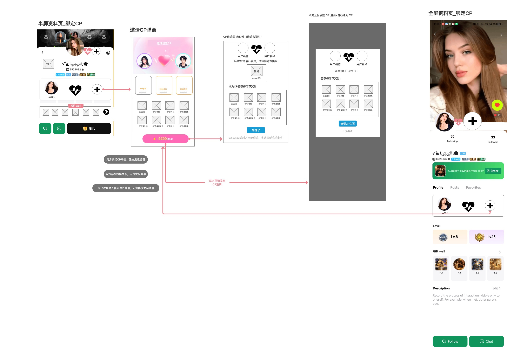

**功能描述：** 从半屏/全屏资料页点击 CP 入口、打开邀请弹窗、提交后在私聊承接待处理邀请函的跨场景流程，不是独立资料页样式图。

##### 交互逻辑
1. 点击 `+` 打开邀请 CP 弹窗；仅打开弹窗不创建邀请。
2. 确认礼物和价格后创建邀请；邀请者看到待处理邀请函，被邀请者收到可处理邀请函。
3. 接受后建立关系；拒绝或系统统一转为已拒绝时资料页不得显示已绑定。

##### 邀请弹窗结构
| 区域 | 功能要求 |
|---|---|
| 邀请对象区 | 固定展示当前资料页用户头像、昵称及身份信息，不允许在弹窗内切换对象 |
| 套餐区 | 按实际支付价格从低到高排列；默认选中最低价可用套餐 |
| 套餐滑动 | 套餐超出可视区域时支持左右滑动，选中态必须始终清晰可见 |
| 权益区 | 随套餐选择实时展示对应组建礼物、关系权益和展示效果 |
| 价格区 | 展示所选套餐实际支付金币数及当前金币余额 |
| 提交按钮 | 显示当前选择结果；提交中防重复点击 |

##### 套餐选择与权益联动
1. 打开弹窗后默认选中价格最低且当前可用的套餐。
2. 用户左右滑动套餐列表只改变浏览位置，不自动改变当前选中项。
3. 点击其他套餐后，礼物图、价格、权益说明和展示效果同步切换为该套餐内容。
4. 套餐不可用或配置失效时不得选中；若默认套餐失效，自动顺延到下一可用套餐。
5. 发送前再次校验所选套餐、价格、双方关系状态和邀请资格，不能沿用弹窗打开时的旧结果。

##### 支付与结果反馈
1. 余额充足且支付成功后，创建一条Pending邀请，并在私聊中生成邀请函消息卡。
2. 余额不足时，拉起半屏充值页面；关闭充值页后返回原邀请弹窗，并保留当前对象和套餐选择。
3. 充值成功返回后刷新金币余额，用户仍需主动确认发送，不得自动扣款。
4. 支付失败时提示失败原因，不创建邀请、不发送消息卡、不触发任何组建效果。
5. 发送成功后展示明确成功反馈，并刷新资料页入口为“待对方处理”承接状态。
6. 当用户向已给自己发送待处理 CP 邀请的对象发起 CP 邀请时，不进入支付扣款流程，系统直接按接受对方邀请处理，并展示组建 CP 成功结果。
7. 命中双向邀请时，按统一双向邀请规则接受已有Pending邀请，不创建第二条邀请或第二笔支付。

##### 状态定义
| 状态 | 页面表现 |
|---|---|
| 默认选择态 | 最低价可用套餐选中，提交按钮可用 |
| 套餐切换态 | 权益、价格和礼物展示同步变化 |
| 余额不足态 | 拉起半屏充值，原选择保留 |
| 提交中态 | 禁止重复提交，等待支付结果 |
| 发送成功态 | 展示成功反馈，并承接私聊Pending邀请函 |
| 已有邀请态 | 打开已有邀请详情，不重复发送 |
| 已绑定态 | 不再展示邀请提交操作，刷新为关系摘要 |

##### 异常与测试关注点
- 套餐配置刷新、价格变化、最低价套餐下线时，提交金额必须以发送前最新有效配置为准。
- 支付回调重复、页面快速关闭、网络重试不得重复扣币或重复创建邀请。
- 从半屏资料卡和全屏资料页发起的邀请，最终必须落到同一邀请状态和私聊消息卡。

#### 2.4 房间 CP 功能模块

##### 2.4.1 房间内 CP 展示模块

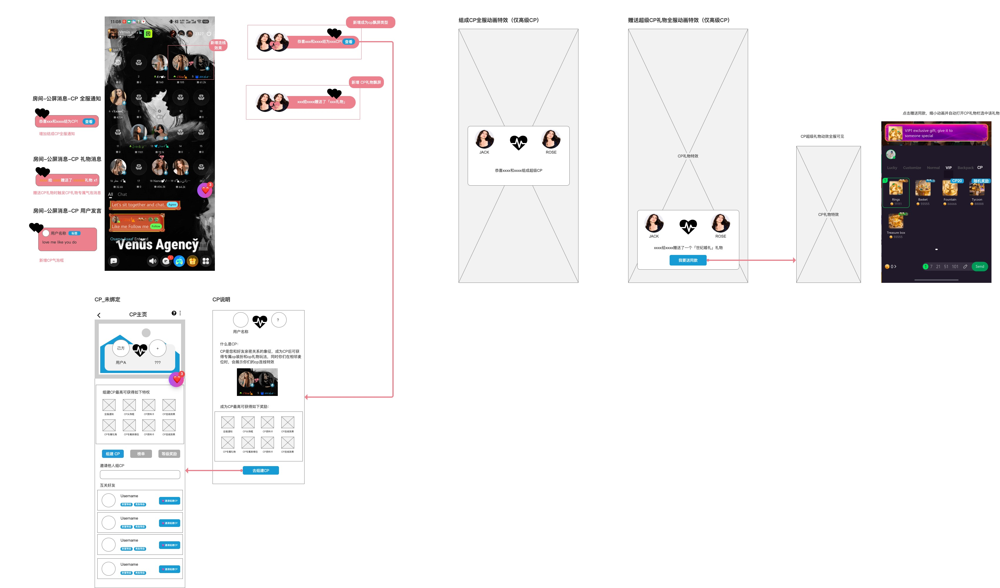

**功能描述：** 房间麦位区域的 CP 连线展示和等级徽标。双方头像之间显示心形连线，头像旁展示 CP 等级徽标，不同等级对应不同样式。

**关键交互：**
1. 房间麦位区域：CP 双方头像之间显示心形连线（发光/跳动动画）
2. 头像旁展示 CP 等级徽标（如"Lv.8"）
3. 不同 CP 等级对应不同徽标样式和连线颜色
4. 点击 CP 连线或徽标可进入 CP 主页

**展示位置：** 房间麦位区域  
**展示形式：** 双方头像连线 + 等级徽标  
**状态差异：** 普通/高级/超级 CP 对应不同动效和样式

##### 2.4.2 建立 CP 全服飘屏

**功能描述：** CP 关系建立成功后触发的全服飘屏通知。展示"恭喜xxx与xxx成为CP"文案，用户点击"查看"可进入 CP 主页。

**关键交互：**
1. 用户赠送组建 CP 礼物并被接受后触发
2. 飘屏展示"恭喜xxx与xxx成为CP"
3. 全房间可见（根据礼物配置决定是否全服）
4. 点击"查看"进入 CP 主页

**展示位置：** 房间浮层  
**触发条件：** 组建 CP 成功且礼物配置为全服飘屏  
**文案：** 恭喜xxx与xxx成为CP

##### 2.4.3 CP 高级礼物飘屏

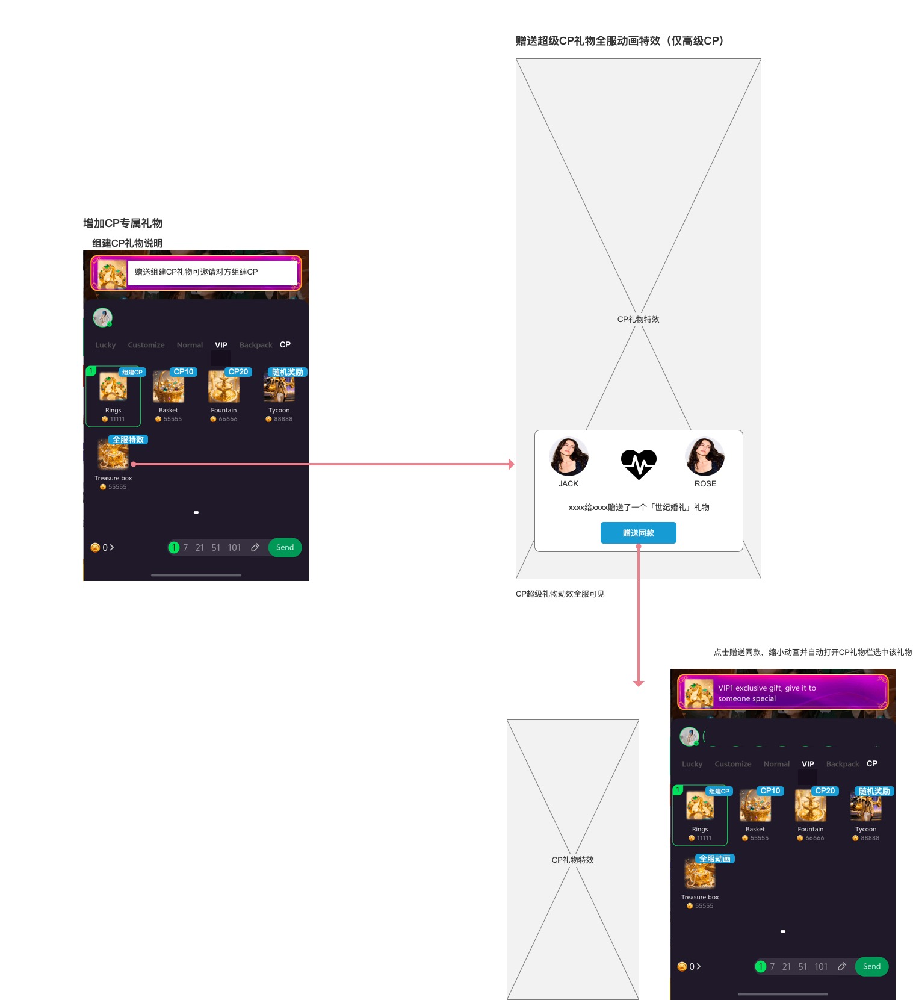

**功能描述：** 赠送 CP 超级礼物后触发的房间屏显。展示送礼者、收礼者、礼物信息和 CP 关系卡片，根据礼物等级显示差异化效果。

**关键交互：**
1. 用户赠送 CP 超级礼物后触发
2. 展示送礼者/收礼者头像 + 心形图标 + 礼物文案
3. 普通/高级/超级 CP 对应不同动画、颜色、展示时长
4. 点击可查看详情

**分级展示：** 普通 CP / 高级 CP / 超级 CP  
**差异化效果：** 不同等级对应不同动画、颜色、展示时长

##### 2.4.4 CP专属表情

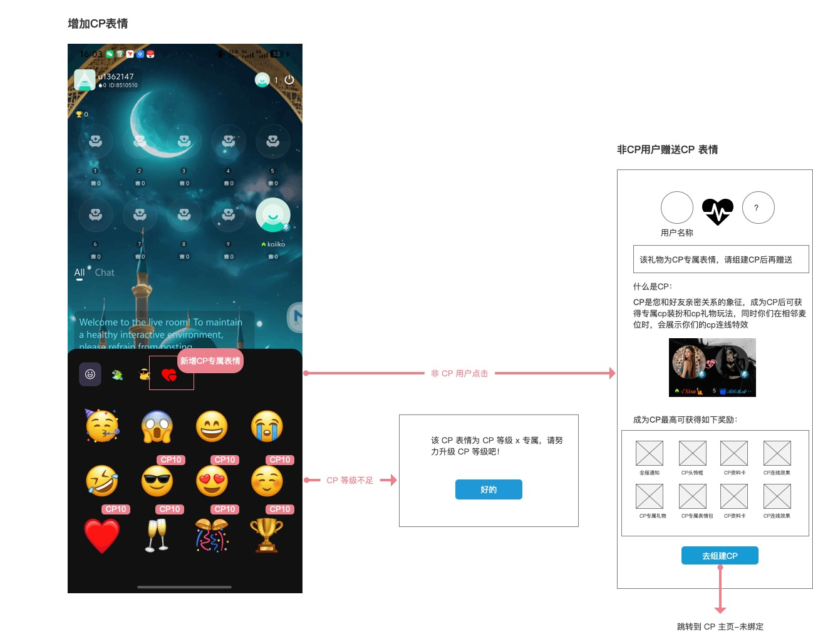

**功能描述：** 房间聊天输入区的CP专属表情面板。原型展示CP10等不同等级的专属表情资源；用户选择高于当前CP等级的表情时，弹出等级未达标提示；非CP用户选择赠送CP专属表情时，弹出组建CP引导弹窗。该能力属于聊天输入能力，不是CP建立公告或送礼气泡。

**入口与分类：**

1. 点击房间聊天输入区的表情入口，打开表情面板。
2. 面板区分“普通表情”和“CP专属”分类；CP分类使用独立标识，不能与普通免费表情混排。
3. CP分类内按当前关系等级和表情配置展示可用、未解锁、免费或付费状态。

| 状态 | 页面表现 | 点击结果 |
|---|---|---|
| 等级未解锁 | 灰态展示对应CP等级门槛 | 弹窗提示“该CP表情为CP等级{required_level}专属，请努力升级CP等级吧！”；不插入、不发送 |
| 非CP用户 | CP分类与CP专属表情可见，但当前无有效CP关系 | 点击赠送CP专属表情时弹出组建CP引导弹窗；不赠送、不扣费 |
| 关系已失效 | 刷新为非CP状态 | 按非CP用户规则弹出组建CP引导弹窗，不继续使用缓存关系 |

**非CP用户赠送CP表情提示规则：**
1. 用户当前未建立有效CP关系，点击赠送任一CP专属表情时，立即阻断本次赠送并弹出组建CP引导弹窗。
2. 弹窗主提示固定为：`该礼物为CP专属表情，请组建CP后再赠送`。
3. 弹窗展示“什么是CP”说明：`CP是您和好友亲密关系的象征，成为CP后可获得专属CP装扮和CP礼物玩法，同时你们在相邻麦位时，会展示你们的CP连线特效。`
4. 弹窗展示“成为CP最高可获得如下奖励”权益区；具体奖励图标与内容按当前CP权益配置展示，不在客户端写死。
5. 用户点击弹窗主操作按钮后，跳转至`CP主页-未绑定`页面，承接CP玩法介绍及组建CP操作；返回房间后不自动恢复或补发此前被拦截的表情。
6. 用户关闭弹窗后仍停留在当前CP专属表情面板，原选择不进入待发送状态；再次赠送前须由用户重新选择表情。
7. 弹窗出现期间，不插入表情、不创建表情消息、不触发赠送、不扣除金币，也不占用或消耗任何CP权益。
8. 连续点击同一或不同CP专属表情时只保留一个引导弹窗，不重复叠加；当前弹窗未关闭前不重复发起跳转。
9. 正式赠送前再次校验CP关系。若用户在面板打开期间刚完成CP绑定，刷新关系状态后再按当前CP等级判断该表情是否可用；若关系仍未生效，继续执行非CP拦截规则。

**高于当前CP等级的表情提示规则：**
1. 每个CP专属表情必须绑定对应的解锁等级；用户可以看到未解锁表情及其等级标识，但不能直接发送。
2. 用户点击的表情所需等级高于当前CP等级时，立即弹出等级未达标提示：`该CP表情为CP等级{required_level}专属，请努力升级CP等级吧！`。
3. `{required_level}` 取当前所选表情配置的实际解锁等级，不得使用用户当前等级，也不得写死为固定等级。
4. 弹窗出现后，不把该表情插入聊天输入区、不创建表情消息、不扣除金币，也不触发发送请求。
5. 弹窗关闭后仍停留在CP专属表情面板；用户关闭弹窗前已有的文字或其他输入内容保持不变。
6. 同一未解锁表情被连续点击时只保留一个提示弹窗，不重复叠加；用户改点另一个未解锁表情时，提示中的等级按最新所选表情更新。
7. CP等级在表情面板打开期间发生提升时，客户端刷新可用状态；达到解锁等级后，用户再次点击该表情可进入正常发送流程。
8. 弹窗不提供跳过等级限制的发送能力；即使客户端缓存状态异常，正式发送前仍须再次校验当前有效CP关系和等级。

**发送规则：**
1. 点击可用表情后插入当前聊天输入；确认发送时再次校验CP关系、等级和付费状态。
2. 免费表情不扣金币；付费表情仅在发送成功时扣除对应金额。
3. 发送成功后在房间聊天区展示表情消息；发送失败不扣款，已扣款但发送失败进入补偿处理。
4. 建立公告、送礼气泡和全服动画分别由对应模块承接，不得复用表情原型冒充其他能力。
5. 若发送前复核发现当前CP等级低于表情所需等级，则终止发送并展示同一等级未达标提示，不得沿用面板打开时的旧等级缓存放行。

##### 2.4.5 房间CP气泡消息系统

**功能说明：** 房间公屏对CP送礼和CP关系建立结果提供专属气泡消息。气泡属于房间消息层，不替代全服动画，也不直接创建CP关系。

| 气泡类型 | 触发条件 | 展示内容 | 展示范围 |
|---|---|---|---|
| CP送礼气泡 | CP双方之间的CP礼物支付并发送成功 | 送礼者、收礼者、礼物名称、数量、CP等级 | 当前房间 |
| CP建立公告气泡 | 组建邀请进入Accepted且关系建立成功 | 双方头像、昵称、组建成功文案、查看入口 | 当前房间；是否扩展全服按组建礼物配置 |

**样式分级：**
1. 根据组建礼物或CP礼物等级读取普通、高级、超级气泡样式。
2. 高级样式可使用特殊背景、边框或光效，但不得遮挡房间核心操作区。
3. 无匹配样式或资源加载失败时展示普通CP气泡或轻提示，业务结果仍然展示。

**动画与队列：**
1. 气泡以淡入进入，在公屏区域短暂停留并轻量漂浮后淡出。
2. 多条气泡连续到达时进入房间气泡队列，按成功时间顺序展示；同一送礼批次可合并数量。
3. 全服动画播放时，房间气泡延后展示，不能与全屏动画同时抢占主要视觉区域。
4. 点击建立公告气泡的“查看”进入CP主页；进入前校验关系，关系已解除则阻断并刷新气泡结果态。

**异常与测试关注点：**
- 支付失败不得展示CP送礼气泡；邀请仍Pending时不得提前展示建立成功气泡。
- 重复支付回调或重复关系结果不得产生重复气泡。
- 关系解除后历史气泡可保留消息语义，但点击不得进入失效关系页。

##### 2.4.6 房间 CP 入口与转化链路

**功能描述：** 房间内从 CP 展示到邀请发起的完整交互链路。

**关键交互：**
1. 用户进入房间，看到 CP 连线/动画
2. 点击 CP 展示区或"查看"按钮
3. 进入 CP 说明页或邀请弹窗
4. 未绑定用户：发起 CP 邀请
5. 已绑定用户：进入 CP 主页

**曝光路径：** 用户进入房间 → 看到 CP 连线/动画  
**触发路径：** 点击 CP 展示/查看  
**转化路径：** 进入 CP 说明页 → 发起 CP 邀请

##### 前置条件
| 条件项 | 说明 |
|---|---|
| 用户处于房间场景 | 当前页面为房间主界面或房间成员露出区 |
| 房间允许展示 CP 功能 | 当前房型与配置支持 CP 露出 |
| 关系状态可读取 | 能获取当前用户与目标对象的关系或邀请状态 |

##### 页面字段定义表
| 字段 | 说明 | 数据来源 |
|---|---|---|
| 房间 CP 标识 | 房间内的关系露出 icon 或标识 | 房间展示配置、CP 关系记录 |
| CP 连线展示 | 双方头像连线或关系强化效果 | 房间展示配置、CP 关系记录 |
| 等级样式 | 不同 CP 等级对应不同样式/动效 | 等级配置、房间资源配置 |
| 房间浮层/气泡消息 | 建立CP或高价值CP礼物后的房间内提示 | 房间消息配置、特效配置 |
| 目标对象摘要 | 当前关联对象头像、昵称、关系摘要 | 用户资料、房间成员信息 |
| 快捷入口 | 进入 CP 主页、关系摘要或房间组建链路的入口 | 页面配置 |
| 房间上下文 | 房间成员、麦位、礼物、互动上下文 | 房间状态服务 |

##### 统计/计算口径
| 口径项 | 规则 |
|---|---|
| 房间关系展示 | 以当前有效关系为准 |
| CP连线展示 | 仅在满足展示条件时露出 |
| 等级样式 | 随当前等级变化实时更新 |
| 房间邀请入口 | 若未绑定则按房间组建 CP 链路承接 |
| 关系入口跳转校验 | 已绑定态点击房间快捷入口进入关系主页类页面前，以双方当前最新 CP 关系状态为准 |
| 返回刷新 | 用户离房再进房后重新读取状态 |

##### 状态定义
| 状态 | 触发条件 | 页面表现 |
|---|---|---|
| 已绑定露出 | 有效关系存在 | 展示关系标识、CP连线或快捷入口 |
| 未绑定露出 | 无有效关系但功能开放 | 展示轻量入口 |
| 不展示 | 功能关闭、房型不支持或对象不可见 | 不显示 CP 露出 |

##### 系统后台核心逻辑
- 房间内 CP 展示必须随关系建立、解除、等级变化实时刷新。
- 房间场景入口不能单独维护一套状态，需与 CP 主页、资料页、私聊页共用同一关系口径。
- 房间露出只承接入口，不直接完成关系建立。
- 已绑定态房间快捷入口进入 CP 主页或关系摘要时遵循"8.6 跨入口关系状态实时校验与失效拦截"；命中失效时刷新当前房间 CP 露出状态。

##### 异常与测试关注点
| 场景 | 预期处理 |
|---|---|
| 离房再回房 | 重新拉取状态，不展示旧缓存 |
| 房间上下文失效 | 不强行展示入口 |
| 关系刚解除 | 房间 CP 露出立即消失或回未绑定态 |
| 点击时关系刚解除 | toast 提示 `双方已解除CP关系`，房间 CP 露出刷新为未绑定态或消失 |
| 对象离开房间 | 房间快捷入口失效，不绕到旧对象页 |

#### 2.4 跨场景 CP 等级标签展示
##### 页面定位
跨场景 CP 等级标签展示用于在半屏资料页、全屏资料页、个人中心、私聊聊天页和消息列表中统一展示用户当前有效 CP 等级标签，强化关系识别与身份露出。该模块只补充展示口径，不单独定义新的等级计算规则。

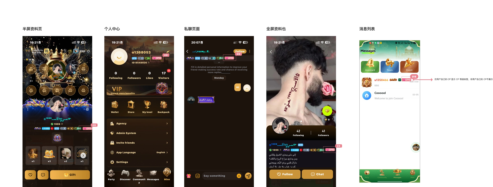

**功能描述：** 该图汇总展示 CP 等级标签在半屏资料页、个人中心、私聊页面、全屏资料页和消息列表中的露出位置与样式差异。

**关键交互：** 用户在资料类页面和聊天页可直接看到对应对象的 CP 等级标签；消息列表场景需额外校验“该会话对象是否为当前登录用户自己的 CP”，只有命中时才展示标签。

##### 前置条件
| 条件项 | 说明 |
|---|---|
| CP 功能已开启 | 当前地区、版本和用户分层允许使用 CP 功能 |
| CP 等级数据可读取 | 能返回对象当前有效 CP 关系对应的等级标签 |
| 场景页面可正常打开 | 半屏资料页、全屏资料页、个人中心、聊天页、消息列表可正常展示 |

##### 页面字段定义表
| 场景 | 字段 | 说明 | 数据来源 |
|---|---|---|---|
| 半屏资料页 | CP等级标签 | 展示资料对象当前有效 CP 等级，如 `CP10` | CP关系记录、等级配置 |
| 全屏资料页 | CP等级标签 | 展示资料对象当前有效 CP 等级，如 `CP10` | CP关系记录、等级配置 |
| 个人中心 | CP等级标签 | 展示当前登录用户自己的 CP 等级标签 | 当前用户CP关系记录、等级配置 |
| 私聊/聊天页 | CP等级标签 | 展示当前会话对应关系的 CP 等级标签 | CP关系记录、等级配置 |
| 消息列表 | CP等级标签 | 仅在会话对象为当前登录用户自己的 CP 时展示 | 当前用户CP关系记录、会话对象信息、等级配置 |
| 消息列表 | 标签隐藏态 | 非当前用户自己的 CP 会话对象不展示标签 | 关系校验结果 |

##### 统计/计算口径
| 口径项 | 规则 |
|---|---|
| 等级标签来源 | 统一复用 `### CP等级体系规则` 与 `### CP等级配置表` 的当前有效等级结果 |
| 资料页展示口径 | 半屏资料页、全屏资料页展示资料对象当前有效 CP 等级；无有效 CP 关系则不展示 |
| 个人中心展示口径 | 仅展示当前登录用户自己的当前有效 CP 等级；无有效 CP 则不展示 |
| 私聊页展示口径 | 仅在当前会话双方存在有效 CP 关系时展示对应等级；无有效关系则不展示 |
| 消息列表展示口径 | 仅当消息列表中的会话对象是当前登录用户自己的有效 CP 对象时，展示其 CP 等级标签 |
| 消息列表隐藏口径 | 会话对象即使与其他用户存在 CP 关系，只要不是当前登录用户自己的 CP，就不展示该标签 |
| 实时性 | 关系建立、解除、等级变化后，相关页面再次进入或刷新时读取最新等级标签 |

##### 交互逻辑
1. 半屏资料页打开时，若资料对象当前存在有效 CP 关系，则在资料卡对应位置展示其 CP 等级标签；否则不展示。
2. 全屏资料页打开时，若资料对象当前存在有效 CP 关系，则在资料页 CP 展示区展示其 CP 等级标签；否则不展示。
3. 用户进入个人中心时，若当前登录用户存在有效 CP 关系，则展示自己的 CP 等级标签；无有效 CP 时不展示该标签。
4. 用户进入私聊聊天页时，若当前会话双方存在有效 CP 关系，则在关系摘要区展示 CP 等级标签；无有效关系时隐藏。
5. 用户进入消息列表时，系统逐条校验会话对象是否为当前登录用户自己的有效 CP 对象。
6. 若命中“当前登录用户自己的 CP”，则在该条会话右侧展示 CP 等级标签。
7. 若未命中，即会话对象不是当前登录用户自己的 CP，则即使对方和其他用户存在 CP，也不展示 CP 等级标签。
8. 用户点击等级标签本身不单独跳转；仍按所在页面原有资料页、会话或 CP 入口链路承接。
9. 当关系解除、关系对象变更或等级变化后，对应页面需在再次进入、切前后台刷新或列表重绘时更新展示结果。

##### 状态定义
| 状态 | 触发条件 | 页面表现 |
|---|---|---|
| 展示态 | 当前场景命中有效 CP 关系展示规则 | 展示 CP 等级标签 |
| 不展示态 | 当前无有效 CP 关系或场景不命中展示规则 | 隐藏 CP 等级标签 |
| 消息列表命中态 | 会话对象为当前登录用户自己的有效 CP | 消息列表该会话展示 CP 等级标签 |
| 消息列表隐藏态 | 会话对象不是当前登录用户自己的有效 CP | 消息列表该会话不展示 CP 等级标签 |
| 刷新态 | 关系状态或等级变化 | 重新读取后刷新标签展示 |

##### 系统后台核心逻辑
- 跨场景 CP 等级标签展示统一复用同一套 CP 关系状态和等级计算口径，不允许各页面单独维护等级结果。
- 半屏资料页、全屏资料页、个人中心、私聊页读取的都是“当前有效 CP 关系”的实时等级结果，不读取历史失效关系。
- 消息列表必须增加“是否为当前登录用户自己的 CP 对象”校验；不满足时即使对方存在 CP 等级，也不得展示。
- 等级标签展示只承担露出，不触发升级、奖励、榜单或关系写入逻辑。
- 关系解除、等级变化、对象切换后，列表和页面展示必须使用最新结果，不能沿用旧缓存标签。

##### 异常与测试关注点
| 场景 | 预期处理 |
|---|---|
| 半屏资料页对象无有效 CP | 不展示 CP 等级标签 |
| 全屏资料页对象无有效 CP | 不展示 CP 等级标签 |
| 当前用户个人中心无有效 CP | 不展示 CP 等级标签 |
| 私聊会话双方无有效 CP | 不展示 CP 等级标签 |
| 消息列表对象是当前用户自己的 CP | 展示 CP 等级标签 |
| 消息列表对象不是当前用户自己的 CP | 不展示 CP 等级标签 |
| 消息列表对象与其他人有 CP | 仍不展示标签 |
| 等级变化后返回页面 | 展示最新 CP 等级标签 |
| 关系解除后返回页面 | 标签隐藏或回退未展示态 |
| 等级数据读取失败 | 使用隐藏态或兜底不展示，不展示错误等级 |

### 3. 私聊关系展示
#### 3.1 私聊页 CP 关系摘要区

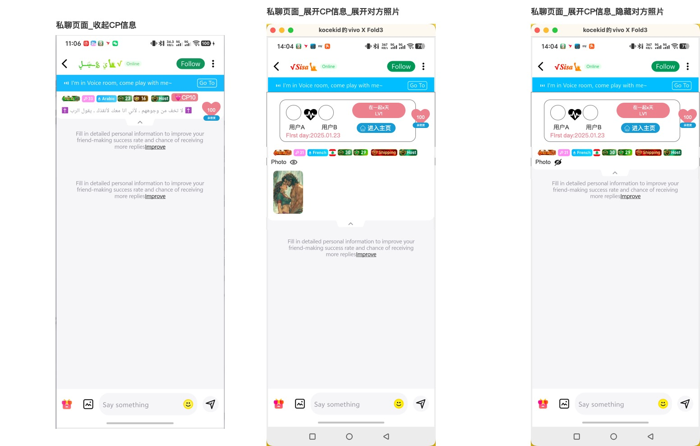

**功能描述：** 私聊页面顶部的 CP 关系摘要展示区。左侧展示 CP 对象头像、用户名和在线状态，中间展示 CP 关系图标和等级标识，右侧展示 CP 等级标签（如"Lv.8"）。下方展示语音房状态提示和操作按钮。

**关键交互：**
1. 顶部展示 CP 对象头像、用户名和在线状态
2. 中间展示 CP 关系图标和等级标识
3. 右侧展示 CP 等级标签（如"Lv.8"）
4. 点击 CP 关系摘要区可进入 CP 主页或关系详情
5. 下方展示语音房状态和进入按钮

##### 前置条件
| 条件项 | 说明 |
|---|---|
| 私聊会话可访问 | 当前与目标对象的会话有效 |
| CP 功能已开启 | 当前地区、版本、分层允许使用 |
| 关系信息可读取 | 能返回双方当前 CP 状态或摘要信息 |

##### 页面字段定义表
| 字段 | 说明 | 数据来源 |
|---|---|---|
| 顶部 CP 关系标识 | 私聊页顶部的 CP 状态标识 | 页面布局配置、CP关系记录 |
| CP 等级 | 当前关系等级标签 | CP关系记录、等级配置 |
| 在一起天数 | 当前关系持续天数 | 绑定成功时间 |
| 对方照片 | 展开态展示的对方资料图片 | 用户资料 |
| 双方头像 | 展开态展示双方头像 | 用户资料 |
| 关系摘要 | 当前 CP 状态、等级、在一起天数、亲密度摘要 | CP 关系记录、等级配置 |
| 展开/收起入口 | 控制信息区展开或收起 | 客户端界面状态 |
| 主页入口 | 点击后默认进入 CP 主页；进入前需校验双方当前是否仍为有效 CP | 页面配置、CP关系记录 |

##### 统计/计算口径
| 口径项 | 规则 |
|---|---|
| 展开/收起状态 | 仅为当前界面展示状态，不写回关系数据 |
| 关系摘要 | 读取当前有效关系，不显示失效历史关系 |
| 在一起天数 | 按绑定成功时间和东三区自然日计算 |
| 关系入口跳转校验 | 点击关系摘要区或主页入口进入关系主页类页面前，以双方当前最新 CP 关系状态为准 |

##### 交互逻辑
1. 用户进入私聊会话后，顶部或会话内展示 CP 关系摘要区。
2. 已绑定 CP 时，顶部显示 CP 关系标识、CP 等级和快捷进入 CP 主页入口；未绑定时不展示完整关系摘要区。
3. 用户点击展开入口后，显示双方头像、对方照片、等级和更完整的关系摘要；再次点击可收起，释放聊天空间。
4. 收起态下仅保留精简的关系信息和主页入口，不展示完整资料内容。
5. 展开态和收起态都可以点击关系摘要区进入 CP 主页，但进入前需重新校验关系是否仍有效。
6. 若关系已解除，按通用已解除关系阻断规则处理。
7. 展开/收起只影响展示，不改变会话输入、消息收发和关系状态。
8. 当关系状态变化后，摘要区在会话内随之刷新。

##### 状态定义
| 状态 | 触发条件 | 页面表现 |
|---|---|---|
| 展开态 | 用户主动展开 | 显示双方头像、对方照片和完整摘要 |
| 收起态 | 默认紧凑或用户收起 | 保留关系标识、等级和主页入口 |
| 未绑定态 | 当前无有效 CP 关系 | 不展示完整 CP 摘要区 |
| 失效态 | 关系解除或数据失效 | 刷新为未绑定或隐藏摘要 |

##### 系统后台核心逻辑
- 私聊摘要区必须与 CP 主页、资料页共用同一关系状态口径。
- 点击关系摘要区或主页入口前必须重新校验关系当前状态；已解除则阻断跳转并 toast 提示 `双方已解除CP关系`，同时刷新摘要区为未绑定或最新状态，防止历史会话入口进入失效关系页。

##### 异常与测试关注点
| 场景 | 预期处理 |
|---|---|
| 对方照片加载失败 | 使用默认头像或兜底样式 |
| 关系刚解除 | 摘要区及时回退未绑定态 |
| 点击时关系刚解除 | toast 提示 `双方已解除CP关系`，摘要区刷新为未绑定态或最新状态 |
| 会话切换 | 不串台，不沿用上个会话的展开状态 |
| 反复展开收起 | 不影响消息输入和滚动位置 |

#### 3.2 消息列表CP标识与置顶

**功能说明：** 消息列表对当前有效CP会话提供可识别、可管理的专属展示，帮助用户从会话列表直接识别CP对象并管理置顶顺序。该能力只改变会话展示与排序，不改变关系等级或消息状态。
##### 页面字段定义表
| 字段 | 说明 |
|---|---|
| CP等级标识 | 展示在CP对象头像附近，样式与当前CP等级一致 |
| CP特殊Icon | 标识该会话为当前有效CP会话 |
| 置顶状态 | 未置顶/已置顶 |
| 最后消息时间 | 用于普通会话排序或多个置顶会话内部排序 |
| 未读数 | 沿用消息系统未读口径，不因CP身份清零 |

##### 交互逻辑
1. 当前有效CP对象的会话头像旁展示CP等级标识和特殊Icon。
2. 长按或打开会话操作菜单，可选择“置顶聊天”；已置顶时显示“取消置顶”。
3. 置顶成功后，CP会话进入置顶区域；取消置顶后回到普通会话区域，并按最近消息时间排序。
4. 存在多个置顶会话时，按最近一条有效消息时间倒序排列；新消息到达后只在置顶区域内部调整顺序。
5. 点击会话进入私聊页后，顶部CP关系卡按本章3.1展示。

##### 状态与异常
| 场景 | 处理规则 |
|---|---|
| CP关系解除 | 移除CP等级标识和特殊Icon；用户手动置顶状态保留 |
| 等级变化 | 会话列表等级标识刷新为最新等级 |
| 置顶操作失败 | 恢复操作前排序并提示失败 |
| 会话被删除后重建 | 按消息系统规则重建，CP标识读取当前关系；不自动继承已删除会话的置顶状态 |
| 多端同时修改置顶 | 以最新有效结果刷新，不能出现同一会话重复占位 |

### 4. 亲密度与关系维护
#### 4.1 CP亲密度展示

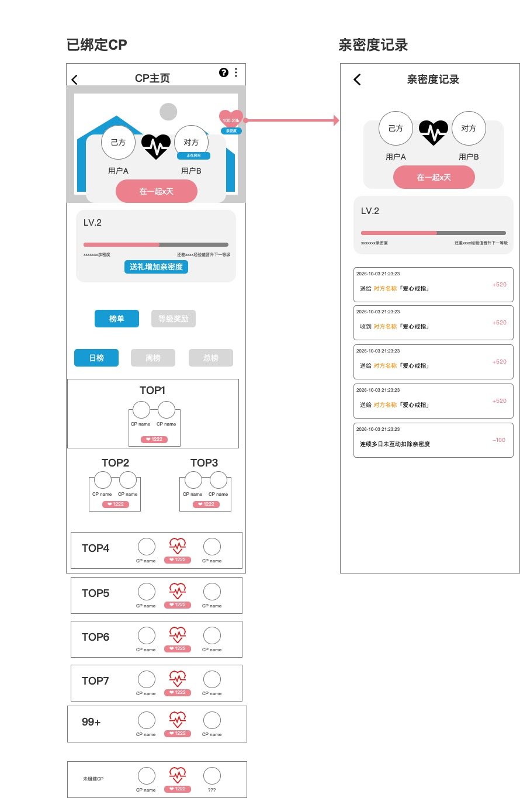

**功能描述：** CP 主页中的亲密度展示模块，展示当前 CP 关系的亲密度总值、当前等级、升级进度和下一等级差值。顶部展示 CP 双方头像和关系标识，中部展示亲密度数值和等级进度条，下方展示等级标签和升级提示。

**关键交互：**
1. 顶部展示 CP 双方头像和在线状态
2. 中部展示当前亲密度数值和等级进度条
3. 进度条显示当前等级到下一等级的进度
4. 下方展示当前等级标签和升级提示
5. 点击亲密度区域可查看亲密度详情和历史记录

##### 前置条件
| 条件项 | 说明 |
|---|---|
| 当前存在有效 CP 关系 | 未绑定不展示关系成长结果 |
| 当前等级配置有效 | 可匹配到等级区间 |

##### 页面字段定义表
| 字段 | 说明 | 数据来源 |
|---|---|---|
| 当前亲密度 | 当前累计亲密度总值 | 亲密度流水 |
| 当前等级 | 当前关系等级 | 等级配置 |
| 升级进度条 | 当前等级内进度 | 计算结果 |
| 下一等级差值 | 距离下一等级差多少亲密度 | 等级配置 |
| 在一起天数 | 当前关系持续时长 | 关系记录 |

##### 统计/计算口径
| 口径项 | 规则 |
|---|---|
| 当前亲密度 | 有效亲密度流水累加结果 |
| 当前等级 | 按总亲密度命中等级配置 |
| 升级进度 | 当前等级区间内进度百分比 |
| 下一等级差值 | 下一等级门槛 - 当前亲密度 |

##### 交互逻辑
1. 用户进入已绑定 CP 主页后，优先看到亲密度展示区。
2. 新原型中亲密度展示区不只是看数值，还承接“送礼增加亲密度”这一明确经营动作，因此该区块同时承担结果展示和行为引导。
3. 点击亲密度进度区或等级入口后，进入等级详情页或权益页，查看更多成长信息。
4. 亲密度变化后，当前值、等级和进度条同步刷新，不需要用户手动刷新页面。

##### 状态定义
| 状态 | 触发条件 | 页面表现 |
|---|---|---|
| 正常成长态 | 存在有效关系且未满级 | 展示等级、亲密度和升级差值 |
| 满级态 | 达到最高等级 | 展示满级结果，不再展示下一等级差值 |
| 等级刷新态 | 因送礼增长导致等级变化 | 展示最新等级和最新进度 |

**系统后台核心逻辑：** - 亲密度展示区与等级详情页必须使用同一套等级匹配和亲密度计算口径。
##### CP亲密度进度复用组件

**展示位置：** CP主页使用完整组件；私聊顶部使用紧凑组件。两处读取同一关系、同一亲密度和等级结果，仅布局不同。组件仅对当前CP双方展示，不向其他用户公开具体亲密度数值。

| 组件区域 | CP主页完整态 | 私聊顶部紧凑态 |
|---|---|---|
| 数值区 | 展示当前亲密度和下一等级所需值 | 展示当前亲密度摘要 |
| 等级标签区 | 展示当前等级名称、等级图标 | 展示等级图标或简化等级 |
| 爱心进度区 | 展示完整爱心填充进度 | 展示紧凑进度，不遮挡聊天 |
| 行为入口 | 可进入亲密度记录或送礼 | 点击关系卡进入CP主页 |

**计算公式：**
- 当前等级区间进度 =（当前亲密度 - 当前等级起始值）÷（下一等级门槛 - 当前等级起始值）。
- 展示百分比限制在0%—100%；满级固定展示100%，不再显示下一等级差值。
- 单次增长跨越多个等级时，最终数值和等级直接以最新结果为准，动画按“数值增长 → 爱心填充 → 升级反馈”顺序合并播放，不逐级重复阻塞页面。

**动态反馈：**
1. 送礼或有效互动产生亲密度后，数值从旧值滚动到新值，爱心进度同步填充。
2. 普通增长使用轻量高亮；达到升级门槛时增加轻震动和升级高亮，并交由升级动画模块统一调度。
3. 页面不可见时不强制播放完整增长动画；再次进入时展示最新结果，必要时承接未展示的升级反馈。
4. 同一笔亲密度结果在主页与私聊只消费一次业务增长，不因两个组件同时存在重复累计。

##### 异常与测试关注点
- 覆盖送礼增长、互动增长、满级态、跨级增长、关系解除和两端同时在线。
- 覆盖数值已更新但动效资源失败时，最终数值仍必须正确。
- 覆盖主页与私聊快速切换时，两处等级和进度一致。

#### 4.2 CP亲密度变动记录
**页面定位：** 亲密度变动记录页用于展示当前 CP 关系下每次亲密度增加、扣减和维护记录，供用户追溯亲密度变化来源、变化值和变化后总额。该页不是只展示“送礼记录”，而是要把文档中所有真正会写入亲密度流水的来源完整展示出来。
##### 前置条件
| 条件项 | 说明 |
|---|---|
| 用户已绑定 CP | 未绑定不展示当前关系记录 |
| CP 关系有效或允许查看历史记录 | 当前关系编号可查询 |

##### 页面字段定义表
| 字段 | 说明 | 数据来源 |
|---|---|---|
| 己方头像与昵称 | 页面顶部左侧展示 | 用户资料 |
| 对方头像与昵称 | 页面顶部右侧展示 | 用户资料 |
| 在一起天数 | 当前关系持续天数 | CP 关系建立时间 |
| CP等级 | 当前关系等级 | CP 等级配置 |
| 当前亲密度 | 当前累计亲密度 | CP 关系记录 |
| 升级差值文字 | 距离下一等级所差亲密度 | CP 等级配置 + 当前亲密度 |
| 进度条 | 当前等级内的进度展示 | 计算得出 |
| 记录时间 | 每条记录发生时间 | 亲密度流水记录 |
| 变动项 | 本次亲密度变化来源类别 | 亲密度流水记录 |
| 变动方向 | 增加 / 扣减 | 亲密度流水记录 |
| 目标对象 | 对方名称或相关对象 | 用户资料 |
| 物品名称 / 来源说明 | 礼物名称、活动名、补偿原因（仅送礼相关） | 礼物配置、活动记录、后台操作记录 |
| 变动值 | 本次亲密度增加或减少的值 | 亲密度流水记录 |
| 变动后总额 | 该条记录后的亲密度总值 | 亲密度流水记录 |

##### 客户端需展示的亲密度变动项
| 变动项 | 增减方向 | 触发场景 | 客户端展示要求 | 是否计入当前榜单周期 | 数据来源 |
|---|---|---|---|---|---|
| 组建CP成功初始化 | 增加 | 被邀请者接受邀请、CP关系正式建立 | 操作类型显示“组建CP成功”或同义建立关系文案；来源说明展示对应组建CP礼物 | 是 | 邀请记录、组建CP礼物快照、亲密度流水 |
| 普通礼物送礼 | 增加 | 已绑定关系内赠送普通礼物 | 当前用户视角可显示“送给”或“收到”；物品名称展示礼物名称 | 是 | 礼物流水、亲密度流水 |
| CP专属礼物送礼 | 增加 | 已绑定关系内赠送 CP 专属礼物 | 展示礼物名称和实际记入的亲密度结果 | 是 | 礼物流水、礼物配置、亲密度流水 |
| 幸运礼物送礼 | 增加 | 已绑定关系内赠送幸运礼物 | 展示幸运礼物名称；变动值展示折算后实际记入的亲密度，不展示理论原值冒充结果 | 是 | 礼物流水、礼物配置、亲密度流水 |

##### 统计/计算口径
| 口径项 | 规则 |
|---|---|
| 当前亲密度 | 有效亲密度流水累加得到当前值 |
| 变动后总额 | 每条流水落库时记录该次变动后的累计总额 |
| 升级差值 | 下一等级门槛 - 当前亲密度；满级时展示满级态 |
| 进度条 | 当前等级区间内亲密度进度百分比 |
| 记录来源口径 | 只展示真实写入亲密度流水的来源，不允许把未生效的理论结果、失败送礼、纯提醒消息伪装成亲密度变动项 |

##### 交互逻辑
1. 用户从 CP 主页点击亲密度记录入口进入。
2. 页面顶部展示双方关系卡片、当前等级和亲密度进度。
3. 下方列表按时间倒序展示亲密度变动记录。
4. 每条记录至少展示：记录时间、变动项、目标对象、物品名称或来源说明、变动值、变动后总额。
5. 礼物类记录必须能区分普通礼物、CP专属礼物、幸运礼物、组建CP成功初始化。CP1.0仅展示送礼相关真实亲密度流水；其他扩展能力统一见《CP2.0需求文档》。
6. 若原型支持点击明细，则进入来源详情；若未展示点击态，不额外扩展独立详情页能力。

##### 状态定义
| 状态 | 触发条件 | 页面表现 |
|---|---|---|
| 有记录 | 存在亲密度流水 | 展示顶部关系卡片和流水列表 |
| 空记录 | 暂无可展示记录 | 展示空态提示 |
| 历史查看态 | 当前关系已解除但允许查看历史 | 仅展示历史记录，不参与当前关系经营 |

##### 系统后台核心逻辑
- 亲密度记录必须按 CP 关系编号查询，避免历史关系串数据。
- 记录页与 CP 主页亲密度总额必须使用同一套流水口径。
- 所有实际生效的亲密度变化都必须生成可追溯明细；CP1.0范围内仅包含送礼相关亲密度流水。
- 客户端展示项只能来自真实落库的亲密度流水，不得根据礼物弹窗、活动提示或消息通知自行拼凑伪记录。
- 分页加载属于系统实现，但页面需保证倒序口径一致。

##### 异常与测试关注点
- 覆盖组建CP成功初始化、普通礼物、CP专属礼物、幸运礼物四类变动项。
- 覆盖关系解除后查看历史记录、顶部信息与当前主页总额一致性。
- 覆盖来源文案生成、礼物信息缺失兜底、活动名缺失、异常流水展示。
- 覆盖送礼增长记录展示、空记录、分页加载和历史查看态。
#### 4.4 CP解除关系

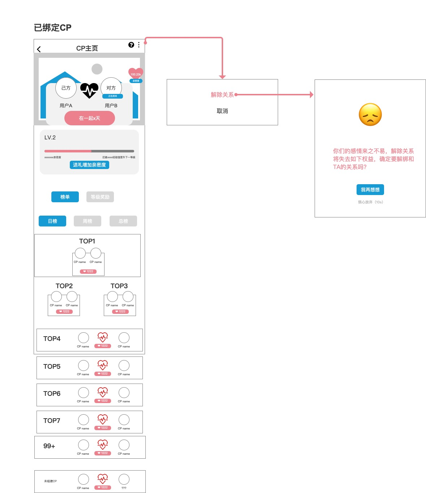

**功能描述：** CP 主页中的解除关系入口和确认弹窗。左侧展示 CP 主页关系摘要区，右侧展示解除关系确认弹窗。弹窗顶部展示解除关系说明文案，中部展示解除后影响说明，底部展示"我再想想"和"解除关系"按钮。

**关键交互：**
1. 用户在 CP 主页点击"解除关系"入口
2. 弹出解除关系确认弹窗
3. 弹窗展示解除后影响说明（亲密度清零、等级重置、权益失效等）
4. 点击"我再想想"返回 CP 主页，不改变关系状态
5. 点击"解除关系"执行解绑操作，关系即时生效

##### 前置条件
| 条件项 | 说明 |
|---|---|
| 当前用户已绑定 CP | 未绑定用户不展示解除入口 |
| 当前关系状态有效 | 已解除或解除中关系不重复发起 |
| 用户具备操作资格 | 当前用户是关系双方之一 |
| 解除规则可读取 | 用于展示解除影响和结果提示 |

##### 页面字段定义表
| 字段 | 说明 | 数据来源 |
|---|---|---|
| 当前CP对象 | 对方头像、昵称、UID | CP关系记录 + 用户资料 |
| 关系ID | 当前 CP 关系唯一记录 | CP关系记录 |
| 在一起天数 | 当前关系持续天数 | 绑定时间计算 |
| 当前亲密度 | 关系当前亲密度 | CP亲密度记录 |
| 解除影响说明 | 解除后权益、榜单、等级、记录影响 | CP解除规则配置 |
| 挽回按钮 | 返回上一页或取消解除 | 客户端交互 |
| 确认解除按钮 | 最终提交解除关系 | CP关系状态 |
| 解除结果 | 已解除、失败、处理中 | 解除提交结果 |

##### 统计/计算口径
| 口径项 | 规则 |
|---|---|
| 解除生效时点 | 以系统后台确认关系解除成功时间为准 |
| 历史保留 | 历史亲密度、礼物记录、榜单快照保留，不再参与当前关系 |
| 权益失效 | 当前等级权益和专属入口按解除结果失效 |

##### 交互逻辑
**入口与确认**
1. 用户在 CP主页点击更多菜单。
2. 选择解除关系后进入解除确认页，页面展示对方信息和解除影响。
3. 用户点击“我再想想”返回 CP主页，不改变关系状态；该按钮文案必须按原型保留为“我再想想”，不能泛化成普通取消。
4. 用户点击“确认解除”后进入提交中状态，按钮防重复点击。

**结果处理**
1. 提交成功后，双方 CP关系状态变为已解除。
2. 双方 CP主页入口切换为未绑定状态。
3. 私聊、资料卡、礼物面板中的 CP 状态同步刷新。
4. 系统向双方发送解除关系通知。

##### 状态定义
| 状态 | 触发条件 | 页面表现 |
|---|---|---|
| 待确认解除态 | 用户刚进入解除页 | 展示解除影响和双按钮 |
| 提交中态 | 用户点击确认解除 | 按钮防重，等待结果 |
| 已解除结果态 | 服务端解除成功 | 页面和入口切到未绑定态 |
| 失败态 | 解除提交失败 | 提示失败并允许重试 |

##### 系统后台核心逻辑
- 解除关系必须按关系ID幂等处理，重复提交只返回同一解除结果。
- 解除后停止新增亲密度，但历史亲密度记录、历史礼物记录、历史奖励记录保留。
- 未领取但已达成的奖励是否保留，以等级奖励规则为准；不得因解除关系重复发放。

##### 异常与测试关注点
| 场景 | 页面反馈 | 处理规则 |
|---|---|---|
| 对方已先解除 | 展示“关系已解除” | 本次操作不重复处理 |
| 提交中网络失败 | 提示“提交失败，请重试” | 后台可能已成功，重试按关系ID幂等返回 |
| 解除后再次进入旧页面 | 自动刷新为未绑定状态 | 不展示旧关系操作 |

##### 解除后重新绑定资格
1. 解除成功后，双方立即回到未绑定状态，不设置固定等待时间。
2. 双方可立即再次与原CP对象绑定，也可与其他符合资格的用户绑定。
3. 新一次绑定必须生成新的CP关系记录；上一段关系的等级、亲密度、在一起天数和当前榜单成绩不得直接继承。
4. 重新绑定前仍需执行黑名单、封禁、自动拒绝设置、双方当前关系状态和邀请资格校验。

##### 解除后的奖励与物料处理
| 类型 | 解除后处理 | 新关系处理 |
|---|---|---|
| 等级展示与永久属性物料 | 资料卡、连线效果、气泡框、个人主页背景按当前有效CP等级展示；原关系解除后立即失效，不得继续挂在个人页面 | 新关系按新的CP等级重新解锁或切换，不继承旧关系等级 |
| 已发放非永久奖励 | 已到账的礼物、金币、游戏币、钻石、水晶及非永久物料不回收 | 同一新关系首次达到对应等级时可按规则重新获得 |
| 当前关系未发放奖励 | 关系解除后不再按旧关系继续触发 | 仅按新关系的首次达级结果判断发放资格 |
| 历史记录 | 历史奖励、礼物、亲密度和榜单快照保留可追溯 | 不计入新关系当前值 |

##### 频繁解绑重绑处理
1. 不通过固定冷却时间限制正常用户重新绑定。
2. 对同一批用户高频解绑重绑、重复触发等级奖励、异常送礼或异常刷榜等行为进行异常识别。
3. 命中异常策略时，可按结果限制继续邀请、暂缓奖励发放、冻结奖励资格或进入人工复核；关系解除结果本身不回滚。
4. 若奖励处于暂缓或复核状态，页面须展示“奖励处理中”，不能先显示领取成功。
5. 异常识别结果不得导致同一邀请重复扣币、同一等级重复发奖或历史奖励被错误回收。

## 四、CP礼物与奖励模块
### 1. CP礼物功能与规则
#### 2.1 CP礼物功能模块
**页面定位：** CP礼物功能模块是 CP 系统的核心商业化与关系经营模块，承担四条主链路：发起关系、增长亲密度、触发特效、获得奖励。该模块统一约束礼物面板中的 `CP` 分类、礼物类型分层、奖励入口和关系联动口径。
##### 前置条件
| 条件项 | 说明 |
|---|---|
| 用户已登录 | 游客态不可送礼 |
| 礼物面板可正常打开 | 当前场景支持礼物面板 |
| CP 功能已开启 | 当前地区、版本、分层允许使用 |
| 钱包余额可读取 | 用于支付和余额校验 |
| 当前关系状态可读取 | 用于区分未绑定、已绑定、待处理等状态 |

##### 页面字段定义表
| 字段 | 说明 | 数据来源 |
|---|---|---|
| `CP` 分类入口 | 礼物面板内的独立分类 | 礼物面板配置 |
| 金币价格 | 单礼物售价 | 礼物配置 |
| 等级门槛 | 最低使用CP等级 | 等级权益配置 |
| 亲密度倍率 | 送礼后记入的亲密度倍率 | 礼物配置 |
| 赠送同款入口 | 围观用户快速打开同款礼物 | 礼物配置 |

##### 统计/计算口径
| 口径项 | 规则 |
|---|---|
| CP专属礼物倍率 | 以后台已发布礼物配置为准 |
| 幸运礼物倍率 | 以后台已发布礼物配置为准 |

##### 交互逻辑
1. 用户打开礼物面板后，可在顶部分类区切换到 `CP` 分类；该切换发生在礼物面板内，不跳新页。
2. 用户点击礼物卡片后，系统先校验当前关系状态、礼物可用性、等级门槛和金币余额。
3. 礼物具备说明时，用户可先点“查看”进入说明弹层，再决定是否赠送；关闭弹层后回到当前礼物面板状态。
4. 围观用户若看到“赠送同款”入口，点击后直接打开礼物面板并定位对应礼物，不单独创建额外业务页。

##### 状态定义
| 状态 | 触发条件 | 页面表现 |
|---|---|---|
| 未绑定引导态 | 当前无有效 CP 关系 | 展示组建CP礼物和引导文案 |
| 已绑定经营态 | 当前存在有效 CP 关系 | 展示 CP 专属礼物体系 |
| 未解锁态 | 等级未达礼物门槛 | 礼物置灰，点击提示解锁条件 |
| 余额不足态 | 支付前余额不足 | 阻断送礼并提示充值 |

##### 异常与测试关注点
- 覆盖未绑定/已绑定分类展示状态
- 覆盖未解锁礼物置灰和支付拦截
- 覆盖支付成功但后续特效失败、奖励反馈失败、关系状态变化导致拦截
#### 2.2 CP礼物入口

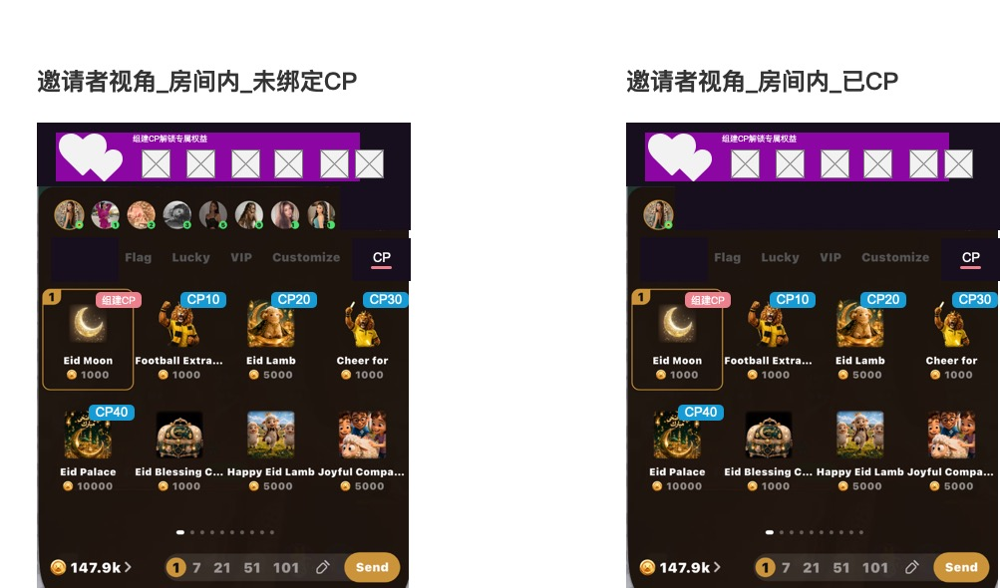

**功能描述：** CP礼物入口承接房间礼物面板和私聊礼物面板中的 `CP` 分类。用户从房间系统提示点击"发起CP"后，礼物面板自动切换到 CP 分类并带入推荐对象；用户也可手动从礼物面板切换到 CP 分类。未绑定用户选择组建CP礼物后进入邀请确认弹窗；已绑定用户按 CP 等级和关系状态展示可送礼的 CP 专属礼物。

**关键交互：**
1. 从房间系统提示进入：自动切换到 CP 分类，带入推荐对象
2. 手动进入：从礼物面板分类栏切换到 CP 分类
3. 未绑定用户：选择组建CP礼物后弹出邀请确认弹窗
4. 已绑定用户：展示 CP 专属礼物，按等级和关系状态过滤
5. 非组建类 CP 礼物：已绑定可送，未绑定提示不可用

**功能描述：** 邀请者在房间内进入 CP 礼物面板后的状态，是房间组建 CP 流程中从系统提示承接到邀请确认的中间页面。

**关键交互：** 邀请者选择带 `组建CP` 标签的礼物后，系统弹出邀请确认弹窗；选择非组建类 CP 礼物时，按已绑定 CP 送礼规则处理或提示不可用。

| 条件项 | 说明 |
|---|---|
| 用户已登录且在房间内 | 原型流程发生在房间场景，礼物面板从房间内打开 |
| CP 功能可用 | 当前版本、地区、用户分层允许使用 CP |
| CP 礼物配置已发布 | `组建CP` 礼物、CP10、CP20、CP30、CP40 等配置可读取 |
| 存在可邀请对象 | 由系统主动提示或上下文带入目标对象 |
| 当前无有效 CP 关系 | 已绑定 CP 时进入已绑定 CP 礼物赠送逻辑，不再发起组建邀请 |

##### 页面字段定义表
| 字段 | 说明 | 数据来源 |
|---|---|---|
| CP 分类标签 | 礼物面板中的 `CP` 分类入口，点击后仅切换礼物面板内容 | 客户端礼物面板配置 |
| 收礼对象头像 | 当前准备发送 CP 礼物的对象；房间系统提示链路中由推荐对象带入 | 房间成员信息、CP推荐结果 |
| 权益横幅 | `组建CP解锁专属权益` 及权益占位 | CP 权益配置 |
| `Rings` 礼物 | 原型中带 `组建CP` 标签的组建 CP 礼物 | 礼物配置 |
| CP10/CP20/CP30/CP40 礼物 | 更高价值 CP 礼物，可能用于弹窗升级选择或已绑定后赠送 | 礼物配置、CP等级/价值配置 |
| 礼物价格 | 礼物对应金币消耗，如 11111、55555、66666、88888 | 礼物价格配置 |
| 数量选择 | 1、7、21、51、101 等礼物数量快捷项 | 礼物面板通用配置 |
| `Send` 按钮 | 在 CP 分类下发起后续送礼/邀请确认动作 | 客户端交互 |

##### 统计/计算口径
| 口径项 | 规则 |
|---|---|
| 分类展示 | 点击 `CP` 分类后，只切换礼物面板内容，不跳离当前房间 |
| 组建礼物识别 | 只有带 `组建CP` 标签或后台标记为组建 CP 类型的礼物，才能触发组建邀请弹窗 |
| 弹窗礼物过滤 | 通过礼物栏 CP 触发的邀请弹窗，仅展示当前选中礼物和比当前礼物价值更高的礼物 |
| 已绑定礼物过滤 | 已绑定 CP 后按 CP 等级、关系状态和礼物发布状态筛选可赠送礼物 |
| 亲密度生效 | 组建 CP 礼物只有在被邀请者接受、关系正式建立后，才按组建 CP 规则计入亲密度 |

##### 交互逻辑
**入口与初始化**
1. 邀请者在房间内点击系统提示弹窗的 `发起CP` 后，页面打开礼物面板。
2. 礼物面板自动切换到 `CP` 分类，并带入系统推荐的被邀请对象。
3. 如果用户手动从礼物入口进入 `CP` 分类，也应按当前 CP 状态展示未绑定引导态或已绑定送礼态。

**组建 CP 礼物选择**
1. 未绑定状态下，用户可选择带 `组建CP` 标签的礼物，例如原型中的 `Rings`。
2. 用户切换到 CP10、CP20、CP30、CP40 等更高价值礼物时，系统同步更新选中态、价格和后续邀请弹窗展示内容。
3. 如果选中的礼物不是组建 CP 类型，只能走普通 CP 礼物赠送或置灰提示，不能创建组建邀请。

**邀请确认承接**
1. 用户点击 `Send` 或选中组建 CP 礼物后的确认动作后，系统弹出 `邀请组建CP` 弹窗。
2. 弹窗展示双方头像、当前礼物、比当前礼物价值更高的礼物、成为 CP 后可获得的权益和底部价格按钮。
3. 用户点击价格按钮后，系统才正式提交 CP 邀请；仅打开 CP 分类或仅选中礼物，不算发起邀请。
4. 当用户向已给自己发送待处理 CP 邀请的对象发起 CP 邀请时，不进入支付扣款流程，系统直接按接受对方邀请处理，并展示组建 CP 成功结果。
5. 邀请提交成功后，被邀请者在房间内收到 CP 邀请函，并可通过房间心形入口进入邀请列表。

**已绑定送礼承接**
2. 已绑定送礼不会再弹出组建 CP 邀请弹窗，而是进入送礼、亲密度增长、房间动效和奖励反馈链路。

##### 状态定义
| 状态 | 触发条件 | 页面表现 |
|---|---|---|
| 房间组建引导态 | 从房间系统提示点击 `发起CP` 进入 | 打开礼物面板并定位 `CP` 分类，带入推荐对象 |
| 未绑定组建态 | 当前无有效 CP 关系且存在可邀请对象 | 展示带 `组建CP` 标签的礼物，选择后可弹出邀请确认 |
| 邀请确认态 | 用户选择组建 CP 礼物并触发确认 | 展示 `邀请组建CP` 弹窗和可升级礼物 |
| 已绑定送礼态 | 当前存在有效 CP 关系 | 展示 CP 专属礼物和奖励说明，不再发起组建邀请 |
| 不可用态 | 礼物下架、对象不可邀请、余额不足或功能关闭 | 礼物置灰、轻提示或隐藏入口 |

##### 系统后台核心逻辑
- `CP` 分类礼物列表必须按当前关系状态、CP 等级、礼物状态、组建 CP 标记和后台已发布配置实时计算。
- 房间系统提示带入的推荐对象必须透传到礼物面板和邀请确认弹窗；若对象状态变化，提交前以后端最新状态拦截。
- 通过礼物栏 CP 触发的邀请弹窗，只展示当前选中礼物及更高价值礼物，不展示低价值礼物，。
- 组建 CP 礼物的扣费、邀请创建、接受后亲密度写入、主动拒绝/系统统一拒绝/系统自动取消退款必须形成同一业务链路，不能拆成普通送礼和普通邀请两条互不关联的记录。
- 已绑定状态下送 CP 礼物只产生送礼与亲密度增长，不得重复创建组建邀请。

##### 异常与测试关注点
| 场景 | 页面反馈 | 处理规则 |
|---|---|---|
| 从房间提示进入后对象失效 | 轻提示“对方当前不可邀请” | 返回礼物面板或关闭邀请确认，不扣费 |
| 用户只打开 CP 分类未点击确认 | 无邀请状态变化 | 不创建邀请记录 |
| 选中礼物下架 | 礼物置灰或提示“该礼物暂不可用” | 不允许继续提交邀请 |
| 金币余额不足 | 价格按钮处提示余额不足 | 不创建邀请，不通知被邀请者 |
| 当前已有待处理邀请 | 提示“已有待处理CP邀请，请等待对方处理”或进入等待态 | 防止同对象重复创建邀请 |
| 已绑定用户进入 CP 分类 | 展示已绑定 CP 礼物 | 不展示组建邀请弹窗 |
#### 2.3 CP礼物类型设计

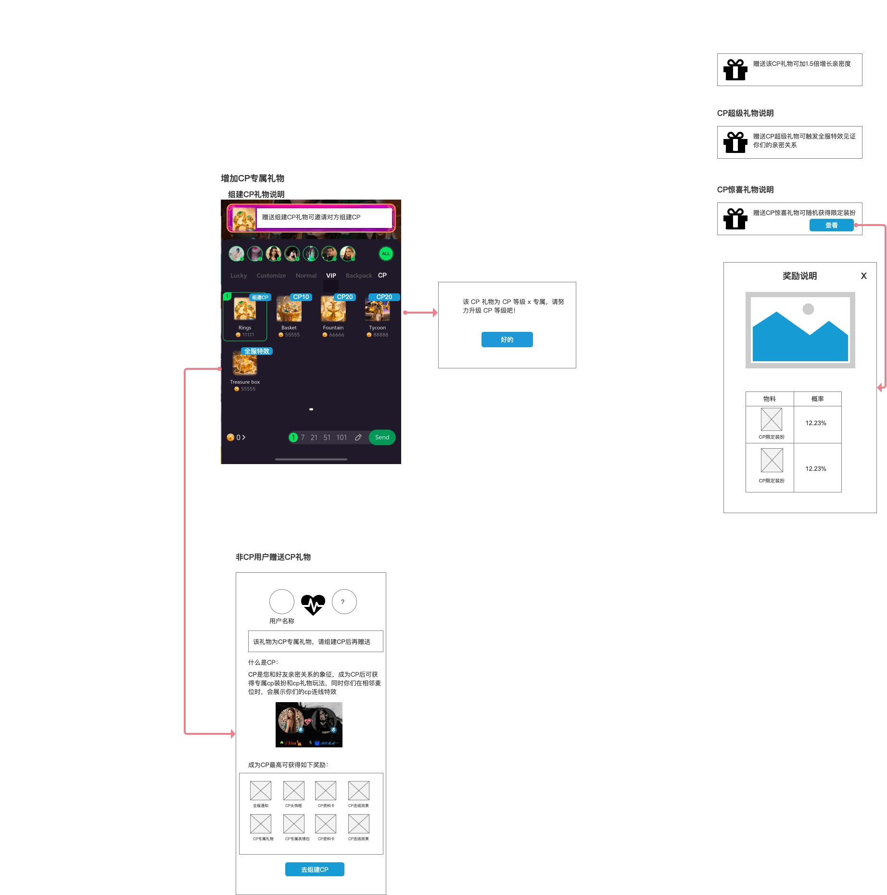

**关键交互：**
2. 中部展示礼物卡片和说明文案
3. 底部展示等级门槛（如"Lv.1及以上可赠送"）和亲密度倍率
4. 点击关闭按钮返回礼物面板

##### 前置条件
| 条件项 | 说明 |
|---|---|
| 用户已进入礼物面板 `CP` 分类 | 只描述 CP 分类内礼物结构 |
| 礼物配置已发布 | 礼物类型、标签、价格、等级门槛已配置 |

##### 页面字段定义表
| 字段 | 说明 | 数据来源 |
|---|---|---|
| 礼物图标 | 礼物展示图片 | 礼物配置 |
| 礼物名称 | 礼物名称 | 礼物配置 |
| 金币价格 | 礼物售价 | 礼物配置 |
| 等级门槛 | 最低使用 CP 等级 | 等级权益配置 |
| 亲密度倍率 | 赠送后获得的亲密度倍率 | 礼物配置 |

##### 统计/计算口径
| 口径项 | 规则 |
|---|---|
| 组建CP礼物 | 用于未绑定关系的邀请链路，不进入日常经营送礼 |
| 普通CP礼物 | 作为关系经营的基础送礼类型 |
| 高级CP礼物 | 以高价值动效和曝光为主 |

##### 交互逻辑
1. 用户进入 `CP` 分类后，看到按类型组织的 CP 礼物卡片。
3. 非 CP 用户点击组建CP礼物时，进入组建邀请链路。
4. 已绑定 CP 用户点击组建CP礼物时，不再允许用其建立新关系；应根据产品规则隐藏或阻断。

##### 状态定义
| 状态 | 触发条件 | 页面表现 |
|---|---|---|
| 可送礼态 | 关系状态和等级条件满足 | 可正常点击和赠送 |
| 未绑定拦截态 | 用户未绑定 CP 但点击经营类礼物 | 提示先组建 CP |
| 未解锁态 | 等级门槛未满足 | 礼物置灰并提示解锁条件 |
| 不可展示态 | 礼物下架或配置不可用 | 礼物不展示 |

##### 系统后台核心逻辑
- 礼物类型决定送礼主分流，不能由客户端仅凭文案判断。
- 未绑定/已绑定态的可见礼物集合允许不同，需由系统后台返回或按配置筛选。

##### 异常与测试关注点
- 覆盖类型标签展示、未绑定拦截、已绑定后组建礼物处理
- 覆盖礼物下架、配置缺失、等级门槛错误
- 覆盖同一礼物多标签组合时的展示优先级
#### 2.4 CP礼物规则说明
##### 前置条件
| 条件项 | 说明 |
|---|---|
| 用户已进入 `CP` 礼物分类 | 规则说明围绕 CP 分类礼物生效 |
| 当前关系状态可读取 | 用于判断未绑定、已绑定和等级门槛 |

##### 页面字段定义表
| 字段 | 说明 | 数据来源 |
|---|---|---|
| CP专属礼物亲密度倍率 | 以后台已发布礼物配置为准 | 礼物配置 |
| 等级门槛标识 | 礼物需要的最低 CP 等级 | 等级权益配置 |
| 组建CP礼物档位 | 按金币价值划分的礼物档位 | 礼物配置 |
| 展示范围 | 房间内可见 / 全服广播 / 仅双方可见等范围控制 | 礼物配置、特效配置 |
| 说明入口 | 礼物面板顶部提示条或礼物卡片 `查看` 按钮 | 页面配置 |

##### 统计/计算口径
| 口径项 | 规则 |
|---|---|
| CP专属礼物倍率 | 以后台已发布礼物配置为准 |
| 组建CP礼物触发 | 被邀请者接受后，双方增加亲密度；发起者增加财富值 |
| 超级礼物展示范围 | 房间内动效，是否全服广播由礼物配置决定 |
| 奖励结果一致性 | 邀请者和被邀请者看到的文案可不同，但共享同一笔服务端奖励结果 |

##### 交互逻辑
2. 用户关闭说明弹层后，返回当前礼物面板状态，不丢失当前 `CP` 分类和礼物上下文。
3. 用户点击未解锁礼物时，系统优先提示等级门槛，而不是直接进入支付链路。
5. 说明模块只负责解释规则，不直接创建邀请、不直接触发奖励发放。

##### 状态定义
| 状态 | 触发条件 | 页面表现 |
|---|---|---|
| 未解锁提示态 | 用户点击未解锁礼物 | 展示等级门槛说明 |
| 说明弹层关闭态 | 用户关闭说明 | 返回原礼物面板状态 |
| 配置异常态 | 配置缺失或加载失败 | 展示兜底说明或失败提示 |

##### 系统后台核心逻辑
| 逻辑项 | 处理规则 |
|---|---|
| 特效控制 | 房间动效、全服特效、赠送同款入口均由礼物配置控制 |

##### 异常与测试关注点
- 覆盖倍率配置、等级门槛、未解锁礼物置灰提示
- 覆盖超级礼物全服/房间特效、赠送同款、动效队列
- 覆盖说明弹层关闭后回到原面板、配置缺失兜底
#### 2.5 CP礼物与关系绑定逻辑
**页面定位：** CP礼物与关系绑定逻辑模块用于定义“礼物如何影响关系建立、关系成长和权益展示”，尤其是组建CP礼物与邀请链路、等级解锁和权益口径之间的绑定关系。
##### 前置条件
| 条件项 | 说明 |
|---|---|
| 当前礼物可识别类型 | 礼物已配置为组建CP、经营类或奖励类 |
| 当前关系状态可读取 | 用于判断未绑定/已绑定和礼物分流 |
| 礼物配置已发布 | 档位、权益、等级门槛等规则已存在 |

##### 页面字段定义表
| 字段 | 说明 | 数据来源 |
|---|---|---|
| 礼物档位 | 根据金币价格划分的档位 | 礼物配置 |
| 邀请文案 | 根据礼物档位匹配的邀请文案 | CP功能配置 |
| 权益奖励 | 对应组建CP礼物的权益展示 | CP权益配置 |
| 关系状态 | 当前是否已绑定 CP | CP关系记录 |

##### 统计/计算口径
| 口径项 | 规则 |
|---|---|
| 组建CP礼物 | 作为发起邀请的唯一礼物入口 |
| 权益默认展示 | 使用金币价格最高的组建CP礼物对应权益 |
| 礼物排序 | 按礼物价值降序排列 |
| 解锁校验 | 以当前 CP 等级和有效关系状态为准 |

##### 交互逻辑
1. 用户在 `CP` 礼物分类中选择组建CP礼物时，进入关系建立链路；选择经营类礼物时，进入已绑定关系经营链路。
2. 组建CP礼物用于未绑定关系下的邀请发起，不用于已绑定关系的日常经营。
3. 当前礼物档位不同，会影响邀请文案和权益展示，但不改变邀请主链结构。

##### 状态定义
| 状态 | 触发条件 | 页面表现 |
|---|---|---|
| 建联礼物态 | 礼物配置为组建CP礼物 | 进入邀请链路 |
| 经营礼物态 | 礼物配置为经营类礼物 | 进入亲密度增长/特效/奖励链路 |
| 未解锁态 | 等级或关系状态不满足 | 阻断赠送并提示原因 |

##### 系统后台核心逻辑
- 组建CP礼物是发起CP邀请的唯一礼物入口，不能被普通经营礼物替代。
- 礼物档位决定邀请文案和权益预览，但关系建立的状态机保持一致。
- CP专属礼物解锁条件由等级权益配置和当前关系状态共同决定。
- 同一礼物的后续链路由系统后台类型配置决定，前端不可仅凭标签字符串自由推断。

##### 异常与测试关注点
- 覆盖未绑定误点经营类礼物、已绑定误点组建礼物、等级不足、礼物档位切换
- 覆盖邀请文案与权益展示跟随礼物档位变化
- 覆盖关系状态变化后礼物可用性刷新
#### 2.6 CP礼物记录
**页面定位：** CP礼物记录页用于沉淀关系经营中的送礼历史、奖励反馈结果和亲密度变化线索，是用户回看“送过什么、得到什么、关系怎么涨上来的”的结果页。
##### 前置条件
| 条件项 | 说明 |
|---|---|
| 用户已登录 | 游客不可查看礼物记录 |
| 当前用户已进入 CP 模块 | 从 CP 主页或礼物结果链路下钻进入 |
| 礼物记录服务可读取 | 至少能返回发出 / 收到 记录 |

##### 页面字段定义表
| 字段 | 说明 | 数据来源 |
|---|---|---|
| 赠送人 | 赠送方头像和昵称 | 用户信息 |
| 接收人 | 接收方头像和昵称 | 用户信息 |
| 礼物信息 | 礼物图标、名称、数量、礼物类型 | 礼物记录 |
| 亲密度变化 | 本次赠送增加的亲密度 | 计算结果 |
| 奖励结果 | 是否中奖、奖励项、奖励状态 | 奖励记录 |
| 赠送时间 | 记录时间 | 系统时间 |
| 记录类型 | 发出 / 收到 | 记录方向 |
| 可见范围 | 仅自己可见或CP双方可见 | 配置规则 |

##### 统计/计算口径
| 口径项 | 规则 |
|---|---|
| 排序 | 按时间倒序排列 |
| 类型区分 | 支持发出 / 收到 两种记录方向 |
| 奖励结果 | 以服务端奖励记录为准；同一送礼结果只记一条主奖励结果 |
| 亲密度变化 | 展示单次礼物实际计入的亲密度 |

##### 交互逻辑
1. 用户进入礼物记录页后，默认按时间倒序展示最新记录。
2. 用户可切换“发出 / 收到”两种记录视角，分别查看自己送出的礼物和收到的礼物；该切换只改变记录方向，不改变奖励结果本身。
3. 点击单条记录后，查看该次礼物的详情、奖励结果和亲密度变化。
5. 记录页只承接结果，不承担再次送礼或修改关系状态。

##### 状态定义
| 状态 | 触发条件 | 页面表现 |
|---|---|---|
| 正常记录态 | 有送礼记录 | 展示列表和详情入口 |
| 空态 | 当前没有记录 | 展示空状态文案 |
| 奖励结果态 | 记录关联奖励 | 在详情中展示奖励结果 |

##### 系统后台核心逻辑
| 逻辑项 | 处理规则 |
|---|---|
| 记录生成 | 送礼成功后生成礼物记录；中奖则额外关联奖励记录 |
| 视角隔离 | 发出 / 收到 根据当前登录用户ID判断 |
| 奖励一致性 | 不同视角看到的文案可不同，但同一笔礼物共用同一奖励结果 |
| 删除策略 | 历史记录保留，不因奖励确认而删除 |

##### 异常与测试关注点
- 覆盖发出/收到切换、空态、详情展开、奖励结果存在与不存在两种情况
- 覆盖记录服务异常、时间排序错误、重复记录去重

#### 2.6.1 CP全服动画与“赠送同款”转化链路

**功能说明：** 当CP礼物或组建CP礼物命中全服动画配置时，系统向目标范围播放动画，并在动画中提供“赠送同款”入口。该入口承接快速送礼转化，但所有扣费、关系和等级校验仍沿用CP礼物主流程。
##### 全服动画字段
| 字段 | 说明 |
|---|---|
| 送礼者/收礼者 | 双方头像与昵称 |
| CP关系标识 | 当前有效CP等级或组建成功标识 |
| 礼物信息 | 礼物图、礼物名和赠送数量 |
| 动画文案 | 按礼物或组建场景读取配置文案 |
| 赠送同款按钮 | 打开CP礼物面板并定位当前礼物 |

##### “赠送同款”完整链路
1. 围观用户点击动画内“赠送同款”。
2. 当前全服动画缩小到左下角继续播放或停留，主操作区让位给礼物面板；关闭面板后可恢复动画展示状态。
3. 打开底部礼物面板并自动定位到`CP`分类，不停留在用户上次浏览的其他分类。
4. 自动滚动到同款礼物位置并高亮；默认选中该礼物和配置的默认数量。
5. 默认收礼对象沿用当前动画中的收礼者；若当前场景不允许直接确定收礼对象，则要求用户确认后才能发送。
6. 用户点击快速发送前，重新校验礼物上下架、CP关系、等级门槛、余额和收礼资格。
7. 支付成功后生成正常礼物记录、亲密度和动画结果；支付失败不触发任何成功反馈。

##### 默认数量与快速发送
- 默认数量优先读取礼物配置；未配置时默认为1。
- 用户可在发送前修改数量，修改后按实际数量展示总价。
- 快速发送不等于免确认扣款；涉及余额不足、数量变化或对象变化时必须展示明确支付信息。
- 同款礼物已下架、当前用户未解锁或不满足CP关系时，礼物置灰并展示阻断原因。

##### 动画队列、优先级与限流
1. 全服动画进入统一动画队列，同一时刻只播放一个主要全服动画。
2. 高级组建、里程碑升级和超级CP礼物按配置优先级排序；相同优先级按成功时间排序。
3. 同一用户、同一礼物在短时间内连续赠送，可合并数量和文案，避免全服刷屏；每笔支付和礼物记录仍独立可追溯。
4. 动画排队过久时可延后展示，但“赠送同款”入口只在仍具备有效礼物上下文时展示。
5. 用户打开礼物面板期间，新的全服动画进入队列，不强行覆盖当前支付操作。

##### 异常与测试关注点
- 动画资源失败时不播放或轻提示，送礼结果和记录不受影响。
- 同款礼物在动画播放期间下架时，打开面板后展示不可用状态，不使用旧价格继续扣款。
- 关闭礼物面板、切换房间、关系解除或收礼者离开后，不得沿用失效对象快速发送。
- 重复点击“赠送同款”只打开一个礼物面板，不创建重复订单。

- 

#### 2.8 金币明细—CP相关账变

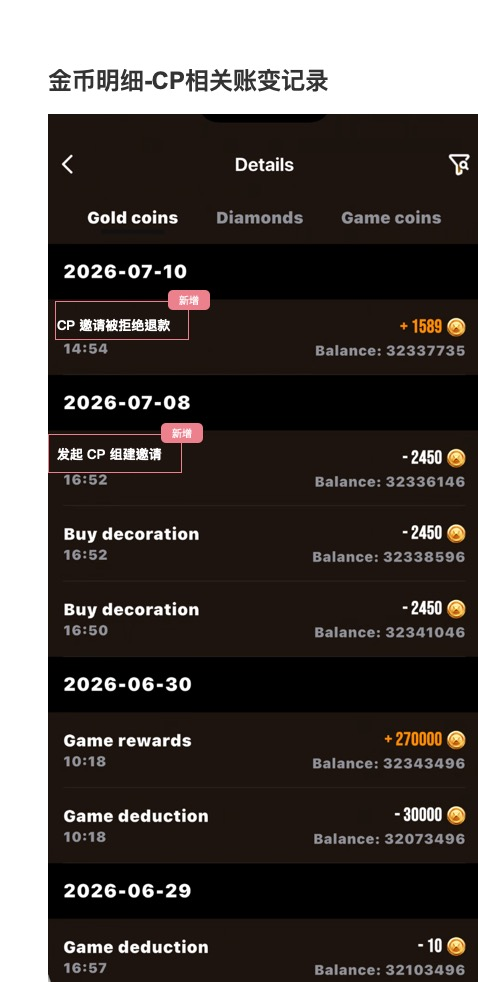

**新增说明：** 金币明细的 `Gold coins` 分类新增以下两类 CP 账变记录：

| 账变记录 | 展示规则 |
|---|---|
| `发起CP组建` | 发起 CP 组建扣款成功后展示，金额以负数显示，并展示账变时间 |
| `CP邀请被拒绝退款` | CP 邀请被拒绝且退款成功后展示，金额以正数显示，并展示账变时间 |

## 五、CP成长体系与榜单模块
### 1. 等级详情与特权
#### 1.1 CP等级详情页

> 原型目录没有独立的“CP等级详情页”整页画面。跨场景等级标签见 **三、2.4 跨场景 CP 等级标签展示**；已绑定主页等级奖励见 **五、1.3 CP等级特权**。

**功能描述：** CP等级详情页，展示当前 CP 关系的等级信息、亲密度进度、等级权益和升级条件。左侧展示 CP 双方头像和等级标识，右侧展示等级标签（如"Lv.8"）、亲密度进度条和下一等级差值。

**关键交互：**
1. 左侧展示 CP 双方头像和等级标识
2. 右侧展示等级标签和亲密度进度条
3. 进度条显示当前等级到下一等级的进度
4. 点击亲密度区域可查看详情和历史记录
5. 点击等级标签可查看等级权益说明

##### 前置条件
| 条件项 | 说明 |
|---|---|
| 用户存在有效 CP 关系 | 未绑定不展示当前关系权益 |
| 等级配置有效 | 当前亲密度可匹配等级 |
| 权益资源已配置 | 资源未下架 |

##### 页面字段定义表
| 字段 | 说明 | 数据来源 |
|---|---|---|
| 当前等级 | 当前 CP 等级编号和名称 | CP 等级配置 |
| 等级图标 | 当前等级徽章 | CP 等级配置 |
| 当前亲密度 | 当前累计亲密度 | CP 关系记录 |
| 下一等级门槛 | 升级所需亲密度 | CP 等级配置 |
| 升级进度 | 当前等级区间内的进度百分比 | CP 关系记录 + CP 等级配置 |
| 等级列表 | 各等级节点与解锁状态 | CP 等级配置 |
| 权益列表 | 当前等级和后续等级可解锁权益 | CP 等级权益配置 |
| 权益描述区 | 当前选中权益的详细说明 | CP 等级权益配置 |
| 已解锁标识 | 当前等级可用权益 | CP 等级和权益配置 |
| 未解锁标识 | 更高等级权益及所需等级 | CP 等级权益配置 |
| 升级引导文案 | 如“赠送礼物可快速提升亲密度” | CP 功能配置 |

##### 统计/计算口径
| 口径项 | 规则 |
|---|---|
| 当前等级 | 当前亲密度 ≥ 该等级门槛 且 < 下一等级门槛时命中该等级 |
| 升级进度 | （当前亲密度 - 当前等级门槛）÷（下一等级门槛 - 当前等级门槛） |
| 下一等级差值 | 下一等级门槛 - 当前亲密度；满级时展示满级态 |
| 权益解锁状态 | 按当前等级和权益类型实时计算 |

##### 交互逻辑
1. 用户从 CP 主页点击等级图标、进度条或升级通知进入等级详情页。
2. 页面顶部展示当前等级、当前亲密度和升级进度。
3. 中部展示等级列表；当前等级高亮，未达到等级置灰。
4. 用户点击某个等级或权益卡片后，查看该等级权益详情。
5. 底部展示升级引导文案，用于引导继续提升亲密度。

##### 状态定义
| 状态 | 触发条件 | 页面表现 |
|---|---|---|
| 已解锁权益 | 当前等级已满足权益解锁条件 | 展示可用态 |
| 未解锁权益 | 当前等级未满足解锁条件 | 展示锁定态和所需等级 |
| 满级态 | 当前已达最高等级 | 不展示下一等级差值，展示满级说明 |

##### 系统后台核心逻辑
- 查询 CP 等级配置，获取完整等级列表和权益配置。
- 查询当前 CP 关系记录，按当前亲密度匹配当前等级。
- 等级变化后，权益列表和解锁状态需实时刷新。
- 当前等级权益、限时权益、纪念型永久权益和历史荣誉需按不同口径处理，避免混用。

##### 异常与测试关注点
- 覆盖已解锁、未解锁、满级、等级变化后刷新。
- 覆盖限时权益到期、纪念型永久权益保留。
- 覆盖资源缺失、等级配置异常、页面入口多来源一致性。
#### 1.2 CP等级权益与奖励规则
##### 页面定位
CP等级权益与奖励规则模块用于统一等级权益、等级奖励、升级解锁和重复领奖口径，避免在等级详情页、等级特权页和升级通知中出现多套解释。

###### CP升级奖励触发弹窗

**说明：** 该图展示升级解锁专属礼包与奖励明细，属于等级成长反馈，不能标成“CP礼物领取弹窗”。

##### 前置条件
| 条件项 | 说明 |
|---|---|
| 存在有效 CP 关系 | 等级、权益和奖励均以关系维度生效 |
| 等级配置已发布 | 当前等级门槛、权益和奖励配置可读取 |
| 当前亲密度可计算 | 亲密度汇总可用 |

##### 页面字段定义表
| 字段 | 说明 | 数据来源 |
|---|---|---|
| 当前等级 | 关系当前等级 | CP关系记录、等级配置 |
| 历史最高等级 | 当前关系已达成过的最高等级 | 等级历史记录 |
| 当前等级权益 | 背景板、连线、气泡框、展示样式等 | 等级权益配置 |
| 当前等级功能权限 | CP专属礼物、表情、超级礼物等使用权限 | 等级权益配置 |
| 非永久奖励 | 金币、礼物、限时装扮、道具等奖励 | 奖励配置 |
| 奖励去重键 | 控制同一关系是否重复领奖 | 奖励发放记录 |
| 奖励维度 | 用户维度 / CP关系维度 | 奖励规则配置 |

##### 统计/计算口径
| 口径项 | 规则 |
|---|---|
| 等级计算维度 | 以 CP关系编号 为维度，而不是单个用户维度 |
| 奖励发放维度 | 奖励按“用户+CP关系”维度发放；具体奖励按配置区分用户维度或关系维度 |
| 关系维度奖励去重 | 使用“CP关系编号 + 等级 + 奖励项” |
| 用户维度奖励去重 | 使用“用户编号 + 等级 + 奖励项” |
| 非永久奖励 | 当前 CP关系首次达到奖励等级时发放；已发放奖励不重复发放 |
| 历史最高等级 | 用于展示/纪念，不参与同一CP关系内的重复领奖 |
| 组建CP礼物口径 | 组建CP礼物是独立类别，仅在邀请被接受时触发一次；发起者财富值按 `1金币 = 1财富值` 增加 |
| 重绑奖励规则 | 解绑后重新绑定视为新CP关系；是否可再次领奖按奖励维度和防刷规则共同判断 |

##### 交互逻辑
1. 用户在等级详情页、等级特权页或升级通知中看到的等级权益和奖励，都应引用本模块统一口径。
4. 关系维度奖励重点反映“这段CP关系达成了什么”；用户维度奖励重点防止换人刷奖励。
6. 历史最高等级仅用于纪念和展示，不参与权益发放或奖励重复领取判断。

##### 状态定义
| 状态 | 触发条件 | 页面表现 |
|---|---|---|
| 升级解锁态 | 当前等级首次达到新门槛 | 展示新权益、新奖励 |
| 当前等级维持态 | 当前等级未发生变化 | 权益保持不变 |
| 历史纪念态 | 当前关系存在历史最高等级记录 | 展示历史最高等级标识 |
| 其他扩展规则 | 统一见《CP2.0需求文档》 | 版本外能力 |

##### 系统后台核心逻辑
- 等级计算必须以 CP关系编号 为维度，不能只按单个用户维度计算。
- 当前等级权益按当前等级展示；非永久奖励一经发放不重复发放。
- 等级配置修改后，是否影响已绑定 CP关系必须以配置生效策略为准；已发放奖励不得因配置变更自动重算。

##### 异常与测试关注点
- 覆盖升级首次达成、重复达到、历史最高等级保留
- 覆盖关系维度奖励和用户维度奖励的去重差异
- 覆盖同一人重绑、换人重绑、异常频繁重绑的奖励资格判断
- 覆盖配置变更后旧关系展示、奖励不追溯重算
#### 1.3 CP等级特权
##### 页面定位
CP等级特权页用于集中展示不同等级可解锁的权益、当前已解锁状态及未解锁预告，是等级详情页的权益子视图。

**功能描述：** CP 等级与特权页，用于展示不同等级解锁的关系权益、礼物权限、表情资源或外显效果。

**关键交互：** 用户进入该页后可查看当前等级、下一等级门槛和已解锁权益；该页是说明页，不直接修改等级结果。

##### 前置条件
| 条件项 | 说明 |
|---|---|
| 当前存在有效 CP 关系 | 未绑定不展示当前关系权益 |
| 权益配置有效 | 等级和权益资源可正确匹配 |

##### 页面字段定义表
| 字段 | 说明 | 数据来源 |
|---|---|---|
| 等级区间标题 | 当前等级段权益标题 | 等级配置 |
| 权益图标列表 | 各等级权益项 | 权益配置 |
| 已解锁标识 | 当前可用权益 | 权益配置、当前等级 |
| 未解锁标识 | 更高等级权益及门槛 | 权益配置 |
| 权益描述 | 当前选中权益详细说明 | 权益配置 |

##### 统计/计算口径
| 口径项 | 规则 |
|---|---|
| 已解锁判定 | 当前等级已满足对应门槛 |
| 未解锁判定 | 当前等级不足，展示门槛和锁定态 |
| 权益刷新 | 当前等级变更后实时刷新 |

##### 交互逻辑
1. 用户从等级详情页或主页“等级奖励”入口进入特权页。
2. 页面按等级区间展示权益列表，用户点击某项后查看其描述。
3. 当前已解锁权益突出展示，未解锁权益展示门槛和锁定态。
4. 页面只负责解释和展示，不在该页内直接触发新的关系动作。

##### 状态定义
| 状态 | 触发条件 | 页面表现 |
|---|---|---|
| 已解锁态 | 当前等级已满足 | 展示可用效果 |
| 未解锁态 | 当前等级不足 | 展示锁定说明 |

##### 系统后台核心逻辑
- 权益解锁态必须按当前等级实时判断，不允许使用静态写死状态。
- 当前等级变更后，特权页内容需同步刷新。

**异常与测试关注点：** - 覆盖已解锁、未解锁、等级变化后刷新、资源缺失兜底。
### 2. 榜单、排名与结算
#### 2.1 CP榜单
##### 页面定位
CP榜单用于展示 CP 关系在不同周期内的亲密度或贡献排名。原型中存在“榜单 / 等级奖励”主切换，以及日榜、周榜、总榜等周期切换，底部固定展示“我的排名”区域。

**功能描述：** CP 榜单页，是用户查看日榜、周榜、总榜排名、自己位置和他人关系热度的主要页面。

**关键交互：** 用户可在不同榜单周期之间切换查看排名，点击榜单卡片或关系入口后再下钻到对应 CP 主页或详情。

##### 前置条件
| 条件项 | 说明 |
|---|---|
| 用户已登录 | 未登录不可查看个性化排名 |
| 榜单功能开启 | 后台配置当前周期榜单可见 |
| 榜单数据可读取 | 当前周期或历史周期存在排行数据 |
| 用户CP状态可读取 | 用于判断底部“我的排名”展示 |

##### 页面字段定义表
| 字段 | 说明 | 数据来源 |
|---|---|---|
| 主切换标签 | 榜单 / 等级奖励 | CP主页配置 |
| 周期切换标签 | 日榜、周榜、总榜等周期 | CP榜单配置 |
| 榜单排名 | CP关系在当前周期内的排名 | 榜单统计结果 |
| CP双方头像 | 榜单行展示双方头像 | CP关系记录 + 用户资料 |
| CP双方昵称 | 榜单行展示双方昵称 | 用户资料 |
| 榜单分值 | 当前周期亲密度、贡献值或榜单积分 | CP亲密度/礼物统计 |
| TOP样式 | 前三名特殊样式 | 客户端样式配置 |
| 我的排名 | 当前用户 CP 关系在当前周期排名 | 榜单统计结果 + 当前关系ID |
| 距上一名差距 | 与上一名榜单分值差值 | 榜单统计计算 |
| 榜单更新时间 | 当前榜单最后统计时间 | 榜单任务记录 |

##### 统计/计算口径
| 口径项 | 规则 |
|---|---|
| 周期口径 | 支持日榜 / 周榜 / 总榜三种周期 |
| 排名口径 | 按当前周期内有效亲密度或贡献值排序 |
| 我的排名 | 以当前关系ID查询，不按用户历史关系串榜 |
| 未上榜判定 | 根据展示榜单阈值判断，不拿上一周期冒充当前结果 |

##### 交互逻辑
**入口与切换**
1. 用户从 CP主页进入榜单区域。
2. 默认展示当前配置的默认周期，如日榜或周榜。
3. 点击“榜单 / 等级奖励”主切换时，页面在排行内容和等级奖励内容之间切换。
4. 点击日榜、周榜、总榜时，榜单列表和我的排名同步刷新。

**列表展示**
1. TOP1-3 使用强化视觉展示，TOP4以后按列表展示。
2. 用户自己的 CP 关系不在可见榜单范围内时，底部展示“未上榜”及距上榜差值。
3. 点击榜单行可查看对应 CP 主页或资料卡，具体开放范围受隐私规则控制。

##### 状态定义
| 状态 | 触发条件 | 页面表现 |
|---|---|---|
| 正常榜单态 | 榜单数据存在 | 展示榜单列表 |
| 空榜单态 | 当前周期暂无数据 | 展示空态文案 |
| 未绑定引导态 | 当前用户未绑定 CP | 我的排名区域展示组建引导 |
| 未上榜态 | 当前关系未进入展示榜单 | 我的排名区域展示未上榜 |

##### 系统后台核心逻辑
- 榜单按 CP关系维度统计，不按单个用户维度统计。
- 日榜、周榜必须使用各自周期边界并在周期结束后生成固定结果；总榜按当前 CP状态正常的关系实时排序展示，不单独结算。
- 同分排序需要兜底规则，默认按先达到该分值的时间靠前；仍相同按关系ID稳定排序。
- 日榜、周榜历史快照必须按“周期 + 榜单类型 + CP关系ID”唯一固化。

##### 异常与测试关注点
| 场景 | 页面反馈 | 处理规则 |
|---|---|---|
| 榜单暂无数据 | 展示空态文案 | 不展示假排名 |
| 当前用户未绑定 CP | 我的排名展示未绑定引导 | 不参与关系榜单 |
| 榜单统计延迟 | 展示最近更新时间 | 不用客户端本地估算排名 |
| CP关系已解除 | 历史周期可保留，当前周期停止新增分值 | 按周期规则处理 |
| 同分排名 | 先达到者靠前 | 记录达成时间作为排序依据 |
#### 2.2 CP榜单结算
**页面定位：** CP榜单结算模块用于在日榜、周榜周期结束时，固化榜单快照并沉淀历史结果。该模块是榜单展示与历史追溯之间的桥梁，不直接暴露给前端作为独立页面操作。
##### 前置条件
| 条件项 | 说明 |
|---|---|
| 榜单周期已结束 | 到达日榜/周榜的结算时点 |
| 榜单快照已生成 | 结算以不可变快照为唯一依据 |
| 历史查询能力可用 | 用于前台历史榜单和客服追溯 |

##### 页面字段定义表
| 字段 | 说明 | 数据来源 |
|---|---|---|
| 榜单类型 | 日榜 / 周榜 | 榜单配置 |
| 周期快照 | 当前结算周期的最终榜单快照 | 榜单快照记录 |
| TopN结果 | 当前周期前列关系结果 | 榜单快照记录 |
| 本人排名 | 当前关系在该周期的最终名次 | 榜单快照记录 |
| 累计贡献值 | 当前关系在该周期的最终贡献值 | 榜单快照记录 |
| 达成时间 | 达到当前最终分值的时间 | 榜单快照记录 |

##### 统计/计算口径
| 口径项 | 规则 |
|---|---|
| 快照不可变 | 周期结束后使用快照作为唯一历史依据 |
| 快照唯一键 | `CP关系ID + 周期类型 + 周期ID + 分区` |
| 历史读取 | 日榜、周榜历史结果只读快照；总榜不读历史快照 |
| 排名并列 | 使用榜单排序规则中的兜底字段（达成时间、关系创建时间、用户ID） |

##### 交互逻辑
1. 周期结束时，系统触发日榜或周榜的结算任务。
2. 系统读取该周期最终榜单，生成不可变快照并锁定排名。
3. 快照生成后，历史榜单页面、我的历史排名和客服查询均读取该快照。
4. 新周期开始后，榜单页刷新为新周期数据；历史榜单保留旧周期快照结果。
5. 总榜始终读取当前实时排序结果，不进入独立结算流程。

##### 状态定义
| 状态 | 触发条件 | 页面表现 |
|---|---|---|
| 待结算态 | 周期结束但任务尚未执行完成 | 进入结算任务队列 |
| 已快照态 | 快照生成成功 | 固定该周期榜单结果 |
| 结算处理中 | 统计延迟或任务失败重试 | 展示结算中或最近更新时间 |

##### 系统后台核心逻辑
| 步骤 | 逻辑 |
|---|---|
| 1. 触发结算任务 | 日榜/周榜周期结束时的定时任务触发 |
| 2. 生成快照 | 读取该周期最终榜单，生成不可变快照 |
| 3. 锁定排名 | 记录 TopN、本人排名、累计贡献值、达成时间 |
| 4. 提供历史读取 | 历史榜单、客服追溯统一读取同一份快照 |

##### 异常与测试关注点
- 覆盖日榜/周榜两种结算任务，总榜不进入独立结算
- 覆盖榜单并列兜底、快照锁定后重算策略
- 覆盖历史榜单读取快照一致性
- 覆盖统计延迟、快照生成失败后的重试与空态表现
#### 2.3 我的排名
##### 页面定位
“我的排名”区域是 CP 榜单页底部固定展示区，用于向当前用户持续反馈自己的关系名次、贡献值和上榜差距，不随榜单列表滚动而消失。

> 当前新版原型目录未提供“我的排名”独立原型图；本节与榜单主页面使用同一视觉承接。

##### 前置条件
| 条件项 | 说明 |
|---|---|
| 用户已进入 CP榜单页 | 作为榜单页底部固定区域存在 |
| 用户CP状态可读取 | 用于判断已绑定 / 未绑定 |
| 当前周期榜单结果可查询 | 用于计算排名和差值 |

##### 页面字段定义表
| 字段 | 说明 | 数据来源 |
|---|---|---|
| 我的排名 | 当前名次；未上榜展示“未上榜” | 榜单计算结果 |
| CP对象头像 | 对方头像 | 用户资料 |
| 我的贡献值 | 当前周期累计贡献亲密度 | 亲密度流水+榜单计算 |
| 距上一名差距 | 亲密度差值 | 榜单计算结果 |
| 未绑定引导 | “组建CP上榜单” | CP 功能配置 |

##### 统计/计算口径
| 口径项 | 规则 |
|---|---|
| 查询口径 | 我的排名按当前 CP 关系编号查询 |
| 周期一致 | 我的排名与榜单列表使用同一榜单类型和同一周期 |
| 未上榜判定 | 未进入展示名次时展示未上榜或超过九十九 |
| 未绑定处理 | 未绑定 CP 用户展示组建引导，不查询历史关系排名 |

##### 交互逻辑
1. 若用户未绑定 CP，则底部区域展示组建引导，不展示历史关系的当前榜单数据。
2. 若用户已绑定但未上榜，展示“未上榜”、当前贡献值和距上榜差值。
3. 若用户已上榜，展示当前排名、当前贡献值和距上一名差距。
4. 切换日榜、周榜、总榜时，“我的排名”区域必须同步刷新，而不是保留旧周期数据。

##### 状态定义
| 状态 | 触发条件 | 页面表现 |
|---|---|---|
| 已上榜态 | 当前关系进入榜单展示区 | 展示排名和贡献值 |
| 未上榜态 | 当前关系有贡献但未进入榜单展示区 | 展示未上榜和差距 |
| 未绑定态 | 当前用户无有效 CP 关系 | 展示组建引导 |
| 结算中态 | 榜单结算或统计延迟 | 展示最近更新时间或结算中提示 |

##### 系统后台核心逻辑
| 逻辑项 | 处理规则 |
|---|---|
| 查询口径 | 我的排名按当前 CP 关系编号查询，不能只按用户编号查询，避免历史关系串榜 |
| 周期一致 | 我的排名与榜单列表必须使用同一榜单类型和同一周期 |
| 数据延迟 | 榜单计算延迟时展示加载中或更新时间，不允许客户端自行排序 |

##### 异常与测试关注点
| 场景 | 处理规则 |
|---|---|
| 当前 CP 无贡献 | 展示未上榜或贡献为 0 |
| 周期切换 | 重新查询对应周期我的排名 |
| 关系解除 | 不展示旧关系的当前榜单身份 |
| 榜单结算中 | 展示结算中提示或最近更新时间 |
#### 2.4 CP榜单周期与结算规则
**页面定位：** CP榜单周期与结算规则模块用于定义日榜、周榜、总榜三种榜单口径的统计边界、快照生成和历史读取规则，是榜单页、我的排名和榜单历史固化任务的统一依据。
##### 前置条件
| 条件项 | 说明 |
|---|---|
| 榜单配置已发布 | 周期类型、快照策略和结算配置存在 |
| 榜单计算服务可用 | 能按周期聚合有效亲密度贡献 |
| 系统时间服务可用 | 日榜、周榜按东三区时间切分 |

##### 页面字段定义表
| 字段 | 说明 | 数据来源 |
|---|---|---|
| 榜单类型 | 日榜 / 周榜 / 总榜 | 榜单配置 |
| 周期标识 | 日榜、周榜的周期键；总榜固定标识 | 系统时间服务 |
| 排名 | 当前榜单口径下的关系排名 | 榜单计算结果 |
| 我的排名 | 当前用户关系在榜单中的名次 | 榜单计算结果 |
| 上榜状态 | 是否进入展示榜单或未上榜 | 榜单计算结果 |
| 历史快照 | 日榜、周榜周期结束后的固定榜单结果 | 榜单快照记录 |

##### 统计/计算口径
| 榜单类型 | 周期口径 | 数据来源 | 默认定位 | 是否需要快照 |
|---|---|---|---|---|
| 日榜 | 东三区时间自然日 | 当日有效亲密度贡献 | 默认日榜或按产品配置 | 是 |
| 周榜 | 东三区时间自然周 | 本周有效亲密度贡献 | 核心主榜 | 是 |
| 总榜 | 全周期累计 | 当前总亲密度 | 长期关系竞争 | 否 |

##### 交互逻辑
1. 用户从 CP主页点击榜单入口进入 CP榜单页。
2. 页面展示榜单/等级奖励主切换，并支持日榜、周榜、总榜切换。
3. 切换周期时，系统重新加载对应周期榜单数据和“我的排名”区域。
4. 前列1 使用重点展示卡片，前列2-3 使用并列卡片，前列4及以后使用列表展示。
5. 用户未组建 CP 时，底部“我的排名”区域展示未组建 CP 占位态；已组建但未上榜时展示当前关系信息和未上榜状态。
6. 榜单为空时展示空状态，不允许展示上一周期本地暂存数据冒充当前榜单。

##### 状态定义
| 状态 | 触发条件 | 页面表现 |
|---|---|---|
| 当前周期展示态 | 当前周期榜单数据正常 | 展示榜单列表和我的排名 |
| 历史快照读取态 | 查看历史周期结果 | 读取不可变快照 |
| 未组建占位态 | 当前用户无有效 CP 关系 | 展示未组建 CP 引导 |
| 未上榜态 | 有关系但未进入展示榜单 | 展示当前关系信息和未上榜状态 |
| 空榜单态 | 当前周期无数据 | 展示空状态 |

##### 系统后台核心逻辑
- 排序规则：贡献值高者在前；贡献值相同时按首次达到该贡献值时间早者在前；仍相同时按 CP关系编号 做稳定兜底排序。
- 日榜、周榜周期结束时应生成不可变榜单快照，历史榜单、奖励结算、客服追溯均读取快照，不被后续流水回滚随意影响；总榜不生成独立结算快照，仅展示当前实时排序结果。
- 我的排名必须以当前 CP关系编号 查询，不能只按用户编号查，否则同一用户历史关系会串榜。

##### 异常与测试关注点
- 覆盖东三区跨日、跨周边界
- 覆盖历史快照读取、未上榜状态、空榜单态
- 覆盖周期切换时“我的排名”区域同步刷新
## 六、CP设置与隐私模块
### 1. 隐私与邀请防打扰
#### 1.1 自动拒绝设置

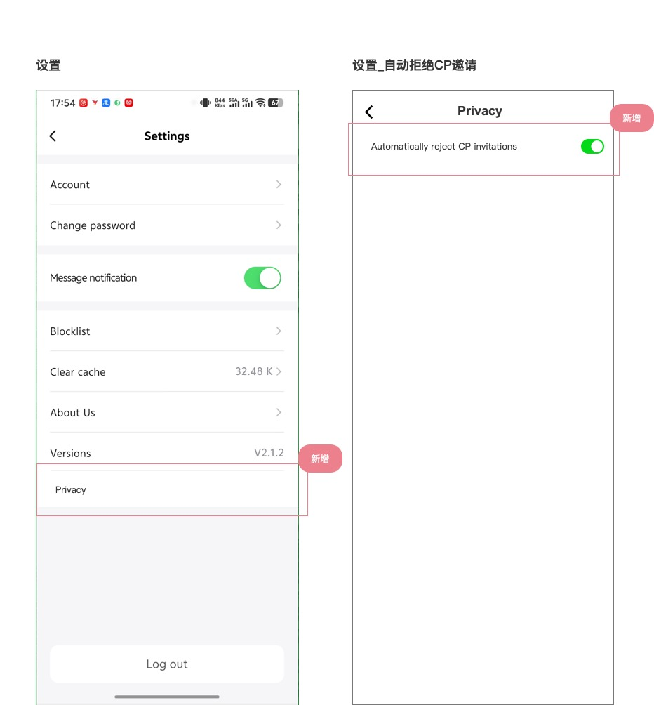

**功能描述：** CP隐私设置页中的自动拒绝设置开关。页面顶部展示用户头像和设置标题，中部展示"自动拒绝CP邀请"开关和说明文案，下方展示其他隐私设置选项。

**关键交互：**
1. 顶部展示用户头像和"隐私设置"标题
2. 中部展示"自动拒绝CP邀请"开关和说明文案
3. 开关默认关闭，用户可开启或关闭
4. 开启后，其他用户无法向该用户发起 CP 组建邀请
5. 下方展示其他隐私设置选项

##### 前置条件
| 条件项 | 说明 |
|---|---|
| 用户已登录 | 设置归属当前用户账号 |
| 隐私设置页可访问 | 从 Settings / Privacy 进入 |
| CP邀请功能对用户开放 | 功能关闭时该设置可隐藏或置灰 |

##### 页面字段定义表
| 字段 | 说明 | 数据来源 |
|---|---|---|
| Automatically reject CP invitations | 自动拒绝 CP 邀请开关 | 用户隐私设置 |
| 当前开关状态 | 开启/关闭 | 用户隐私设置 |
| 生效说明 | 开启后自动拒绝新邀请 | CP隐私配置文案 |
| 更新时间 | 最近一次修改时间 | 用户设置记录 |
| 保存结果 | 修改成功或失败提示 | 设置保存结果 |

##### 统计/计算口径
| 口径项 | 规则 |
|---|---|
| 自动拒绝生效边界 | 只作用于设置变更后的新邀请 |
| 历史邀请处理 | 已经存在的待处理邀请不因开关开启自动批量拒绝 |
| 结果口径 | 自动拒绝与手动拒绝使用同一邀请终态口径，但拒绝原因不同 |

##### 交互逻辑
**入口与初始化**
1. 用户进入 Settings 页面后点击 Privacy。
2. Privacy 页面加载当前自动拒绝 CP 邀请开关状态。

**开关操作**
1. 用户打开开关后，系统立即保存并生效。
2. 用户关闭开关后，系统立即恢复接收新邀请能力。
3. 保存成功后开关保持新状态；保存失败时回滚为原状态并提示“设置保存失败，请稍后重试”。

**邀请处理联动**
1. 开启后，新到达邀请不进入待处理列表，系统自动清理。
2. 已经存在的待处理邀请不因开关开启自动批量拒绝，除非产品另行配置。
3. 自动拒绝开关命中时，邀请在创建前被拦截，不进入邀请状态流转。

##### 状态定义
| 状态 | 触发条件 | 页面表现 |
|---|---|---|
| 关闭态 | 开关关闭 | 正常接收新邀请 |
| 开启态 | 开关开启 | 新邀请自动拒绝 |
| 保存中 | 用户切换开关 | 显示保存中或轻提示 |
| 保存失败 | 服务端保存失败 | 回滚为旧状态 |

##### 系统后台核心逻辑
- 开关状态保存到用户隐私设置，按用户维度生效。
- 新邀请创建前检查被邀请者自动拒绝开关；若开启，则不创建待处理邀请，直接返回自动拒绝结果。
- 自动拒绝必须在扣款和邀请创建前完成校验；若提交期间因并发状态变化命中自动拒绝，扣款与邀请创建整体回滚，不形成扣款记录、退款记录或待处理邀请。

##### 异常与测试关注点
| 场景 | 页面反馈 | 处理规则 |
|---|---|---|
| 保存失败 | 开关回滚并提示失败 | 不改变后台设置 |
| 开启后收到邀请 | 被邀请者无感或收到轻量提示 | 发起者收到拒绝/退币结果 |
| 已有待处理邀请 | 保持原待处理状态 | 用户仍可手动处理 |
| 多设备同时修改 | 以后端最新状态为准 | 其他设备下次进入刷新 |
### 2. 通用设置入口与变更规则
#### 2.1 CP设置
**页面定位：** CP设置页承接与当前用户 CP 关系相关的设置能力，包括隐私设置入口、自动拒绝 CP 邀请开关承接、关系维护相关入口和通用设置联动。
##### 前置条件
| 条件项 | 说明 |
|---|---|
| 用户已登录 | 未登录不可进入设置 |
| 设置页可访问 | CP 功能可用 |

##### 页面字段定义表
| 字段 | 说明 | 数据来源 |
|---|---|---|
| 返回按钮 | 导航栏左侧返回入口 | 客户端交互 |
| 页面标题 | Settings | 客户端样式 |
| Privacy 入口 | CP 隐私设置子页面入口 | 客户端交互 |
| 自动拒绝设置入口 | 进入自动拒绝开关配置 | 用户 CP 设置记录 |
| Message notification | 消息通知开关 | 用户设置记录 |
| Blocklist | 黑名单入口 | 客户端交互 |
| Clear cache | 清除缓存入口及缓存大小 | 客户端计算 |
| About Us | 关于我们入口 | 客户端交互 |
| Versions | 版本信息 | 客户端版本 |
| Log out | 退出登录按钮 | 客户端交互 |

##### 统计/计算口径
| 口径项 | 规则 |
|---|---|
| 设置真实状态 | 页面读取系统保存值，不以本地缓存为准 |
| 自动拒绝生效范围 | 仅影响新邀请，不追溯历史待处理邀请 |
| 跨设备同步 | 以系统保存值为准 |

##### 交互逻辑
1. 用户从 CP 主页或个人中心进入 `Settings` 设置页。
2. 设置页保留通用设置结构，但新增 `Privacy` 入口，作为 CP 隐私能力的唯一显式入口。
3. 用户点击 `Privacy` 后进入隐私设置子页面，在该页切换“自动拒绝 CP 邀请”开关。
4. 原型未展示单独保存按钮，因此开关切换即触发保存；保存成功后返回设置页时继续展示最新状态。
5. 其他设置项如消息通知、黑名单、缓存、关于我们、版本信息仍按通用设置页逻辑处理，不在当前文档中额外延展新交互分支。

##### 状态定义
| 状态 | 触发条件 | 页面表现 |
|---|---|---|
| 正常可编辑态 | 设置读取成功 | 展示真实状态并允许修改 |
| 读取失败态 | 设置拉取失败 | 展示错误提示或重试入口 |
| 保存中 | 提交设置变更后 | 禁止重复提交 |
| 保存失败 | 设置保存失败 | 回滚到保存前状态 |

##### 系统后台核心逻辑
- 设置项必须读取系统保存状态，并与隐私设置子页面保持一致。
- 自动拒绝只影响开启后的新邀请，不追溯历史待处理邀请。
- 设置变更需要写入操作日志，并保证跨设备同步。

##### 异常与测试关注点
- 覆盖设置读取失败、自动拒绝设置保存失败、不同设备状态同步。
- 覆盖退出登录前后设置状态刷新。

## 六、CP道具展示模块

### 1. 商城背包 CP 道具展示规则

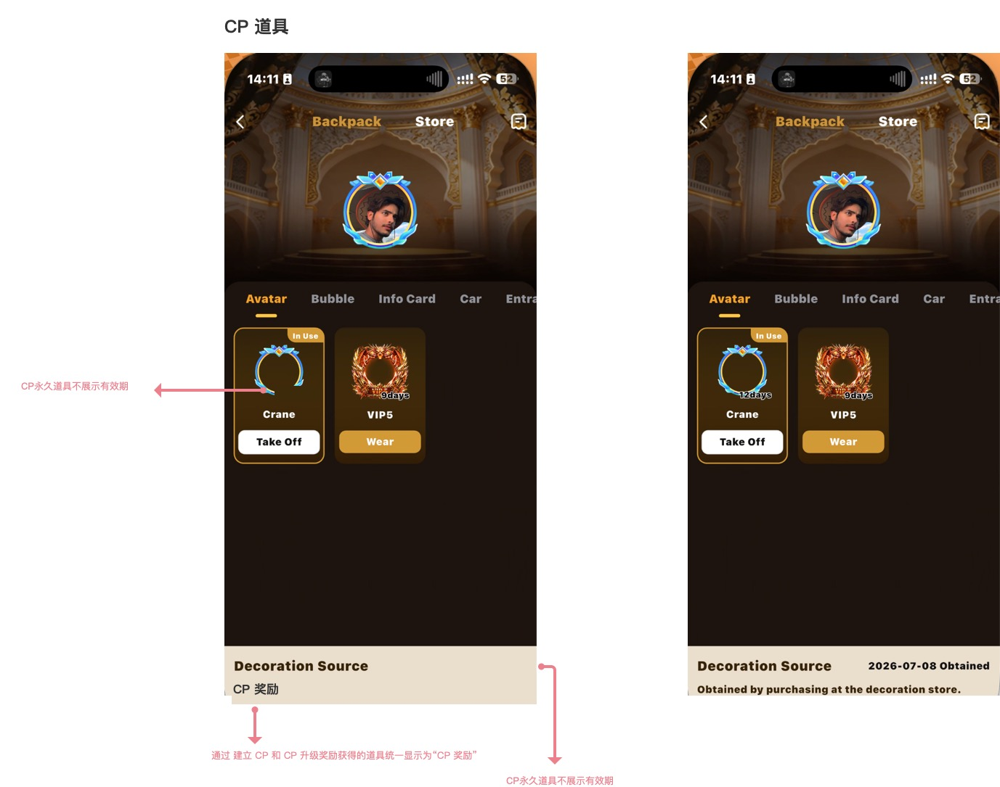

**功能描述：** 商城背包中 CP 永久道具的展示规则。

**核心规则：**
- **CP 永久类型道具不展示有效期和剩余天数**
- **道具来源统一显示"CP奖励"**（包括建组CP奖励和CP升级奖励）

普通时效道具按实际获得渠道展示来源和剩余有效期。

---
## 七、客户端通用实现约束
#### 1.1 并发与数据一致性
| 问题 | 说明 | 解决方案 |
|---|---|---|
| 同时接受多个邀请 | 用户同时收到多个邀请，可能并发接受 | 使用分布式锁（以用户编号作为并发控制依据），仅第一个成功 |
| 双方同时互相邀请 | A邀请B和B邀请A同时存在 | 后发起方自动接受对方邀请，不重复扣款 |
| 金币扣减与邀请创建 | 金币扣减成功但邀请创建失败 | 使用数据存储事务，失败则回滚金币 |
| 亲密度变动与等级计算 | 并发增加亲密度可能导致等级判断错误 | 使用原子操作更新亲密度，变动后重新计算等级 |

#### 1.2 时区处理
| 问题 | 说明 | 解决方案 |
|---|---|---|
| 中东区时区 | 中东区使用东三区时间，所有时间计算基于东三区时间 | 系统后台统一使用东三区时间计算，用户端展示时转换 |
| 榜单周期 | 日榜/周榜/总榜的时间范围基于东三区时间 | 定时任务使用东三区时间时区触发 |
| 邀请处理期限 | 处理截止时间基于东三区时间 | 创建邀请时计算处理截止时间=当前东三区时间+6小时 |
