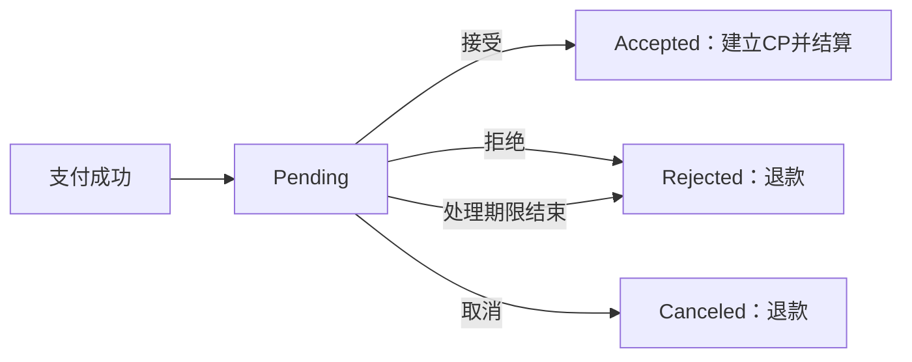
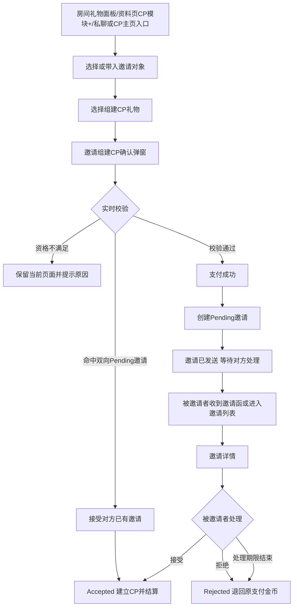
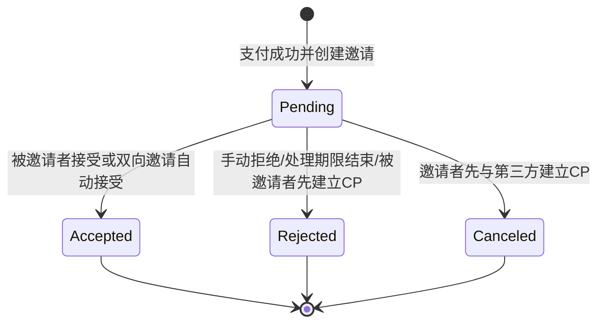
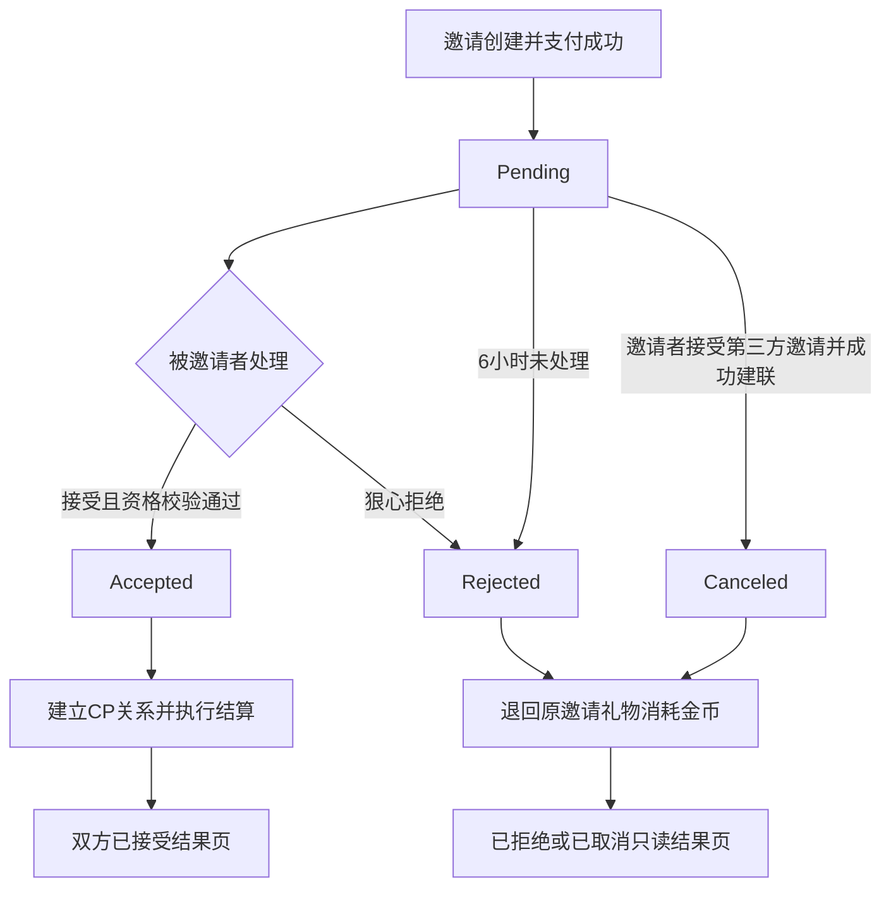
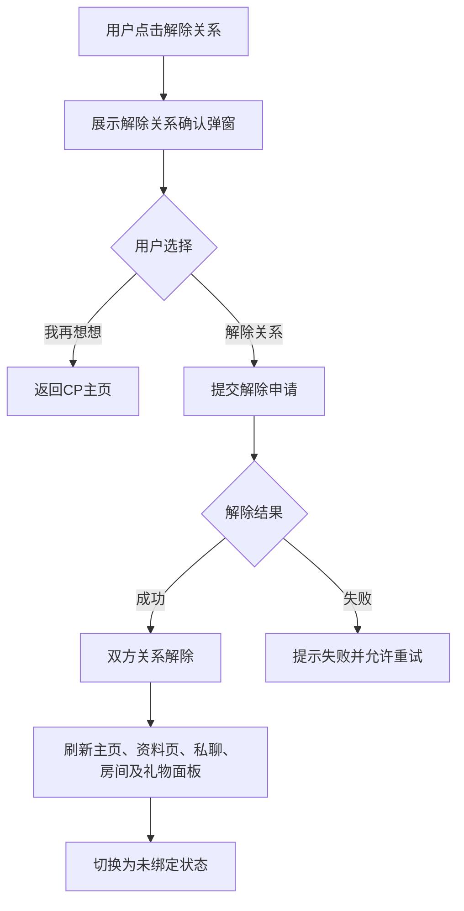
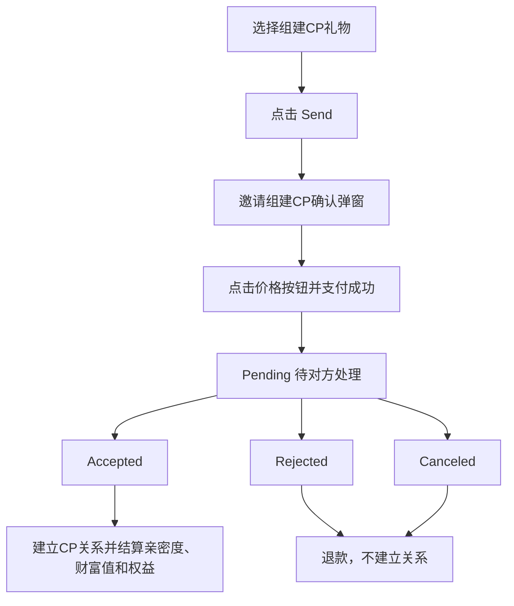
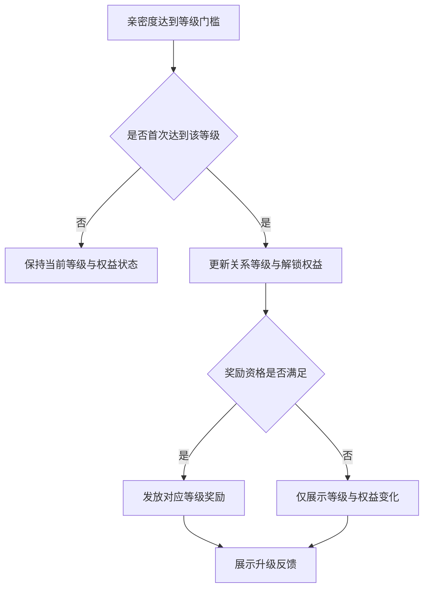
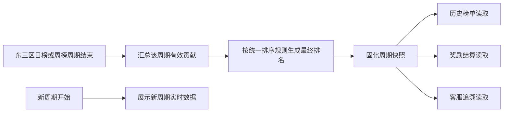

# CP系统需求文档 v1.0（客户端·推荐压缩版）

> 版本说明：在不改变客户端原型归属及核心业务规则的前提下，将跨页面共用的状态、支付退款、并发与刷新规则集中维护；页面章节仅保留本场景专属字段、交互、状态和异常。
## 1. 文档说明与全局业务口径

### 1.1 适用范围
本章适用于 CP 客户端全部入口、页面、弹窗、私聊消息卡片、通知及结果页，包括资料页、CP 主页、房间入口及历史邀请消息。跨页状态、支付、退款与刷新规则均以本章为准；具体页面仅补充自身展示字段和入口差异，不得以本地历史状态覆盖当前关系结果。

#### 1.1.1 全局展示口径

| 场景 | 页面处理 |
|---|---|
| 读取关系、邀请、余额或礼物 | 展示加载状态，相关操作按钮不可点击 |
| 当前无关系、无邀请或无榜单数据 | 展示对应空态，不展示旧数据或默认成功结果 |
| 操作处理中 | 保留当前页面上下文，防止重复接受、拒绝、取消、支付或赠送 |
| 查询或处理未完成 | 不展示未确认的 CP 关系、余额变化、礼物赠送记录或等级结果 |
| 已解除关系进入已绑定入口 | 提示`双方已解除CP关系`，页面切换为未绑定态或隐藏已绑定入口 |

### 1.2 关系与邀请

#### 1.2.1 邀请状态及结果展示
邀请状态包括 Pending、Accepted、Rejected、Canceled。支付成功后仅进入 Pending，不能据此展示 CP 已建立、CP 专属权益已生效或礼物已结算。Accepted、Rejected、Canceled 均为终态：详情页、通知和历史消息仅展示最终结果，不再提供邀请处理操作。

| 状态 | 展示结果 | 可执行操作 |
|---|---|---|
| Pending | 展示邀请对象、邀请内容及剩余倒计时 | 被邀请者可接受或拒绝；邀请者仅查看 |
| Accepted | 展示已接受结果及当前 CP 关系 | 不可再次处理邀请 |
| Rejected | 展示已拒绝结果 | 不可再次处理邀请 |
| Canceled | 展示已取消结果 | 不可再次处理邀请 |

#### 1.2.2 建联、退款与双向邀请
仅当 Pending 被接受为 Accepted 后，双方建立 CP 关系并完成对应结算。被邀请者主动拒绝、处理期限结束转为 Rejected，或既有 Pending 因邀请者接受第三方邀请而转为 Canceled 时，均按原邀请实际支付金额退款并刷新余额。双方互相发起邀请时，后发起行为视为接受既有 Pending：不得二次扣费、不得创建第二笔邀请、不得重复建立 CP 关系。

### 1.3 操作校验与历史消息

#### 1.3.1 邀请及支付限制
创建邀请前须确认双方当前未建立 CP 且均具备邀请资格；任一条件不符时，不创建邀请、不扣费、不变更关系。邀请已终态、关系状态读取中、资格不符或操作处理中时，入口对应按钮禁用。支付或送礼前须校验当前 CP 关系、对象资格、礼物可用状态、等级门槛及余额；任一不满足即阻断本次操作。

#### 1.3.2 历史邀请消息处理
点击私聊中的历史 CP 邀请消息，默认展示该条邀请函快照。已接受消息需再次确认双方当前关系：仍为 CP 时展示已接受邀请弹窗；已解除时不展示弹窗，并提示`你们已解除 CP 关系`。已拒绝和已取消消息只展示对应终态；处理期限结束未处理的邀请按已拒绝结果展示，不恢复原待处理按钮。

### 1.4 刷新、礼物与时间

#### 1.4.1 结果刷新范围
邀请终态、关系建立或解除、支付退款、送礼成功及等级变化后，邀请详情、消息卡片、通知、CP 主页、资料页和房间入口均须按最新状态更新。返回上一级页面时，不得继续保留已失效的待处理邀请、已绑定关系、旧余额、旧等级或旧礼物结果。

#### 1.4.2 CP 专属礼物规则
CP 专属表情仅可在当前有效 CP 关系下发送。非 CP 用户尝试发送 CP 专属表情时，不发送、不扣费、不形成赠送记录；礼物不可用、等级不足、余额不足或支付处理中时，同样不可形成赠送结果。

### 1.5 倒计时与榜单

#### 1.5.1 时间口径
邀请剩余倒计时、处理期限判断、日榜、周榜及相关统计统一按东三区时间计算，用户端展示时转换。倒计时归零后，仍处于 Pending 的邀请转为 Rejected 并执行退款；页面、消息卡片和通知刷新为已拒绝结果。

#### 1.5.2 榜单口径
榜单提供日榜、周榜、总榜三类视图，展示名次、用户信息及对应统计结果；各榜单展示的 TopN 数量可配置。切换榜单类型后，以所选周期的东三区统计结果为准，不混用其他周期数据。

## 2. CP邀请与关系建立

### 2.1 统一规则

#### 2.1.1 关系、邀请与结算规则

CP 邀请用于建立两名用户之间唯一有效的 CP 关系。邀请、支付、关系建立和礼物结算必须按同一业务口径处理；房间、资料页、私聊、系统通知及 CP 主页仅提供不同入口和展示，不得形成不同的建联或退款规则。

| 项目 | 规则 |
|---|---|
| 关系唯一性 | 单个用户同一时间仅可存在一段有效 CP 关系；双方任一方已有有效 CP 时，不可再建立新的 CP 关系。 |
| 邀请对象 | 一次邀请仅对应 1 名明确对象，不支持 `ALL`、群发、多人选择或一次向多名用户发起邀请。 |
| 创建时机 | 用户完成组建 CP 礼物支付后，才创建 Pending（待处理）邀请；打开面板、选择礼物、进入确认弹窗、播放动效或送达邀请函均不代表已建立 CP。 |
| 建联时机 | 仅邀请进入 Accepted（已接受）后建立 CP 关系；Pending 期间双方仍为未绑定状态。 |
| 邀请有效期 | Pending 邀请自创建起 6 小时有效；邀请详情、列表、结果页中的剩余时间均按东三区时间计算，用户端展示时转换。 |
| 倒计时计算 | 剩余时间 = 邀请截止时间 − 当前业务时间；剩余时间归零后不可再接受或拒绝，邀请转为 Rejected（已拒绝）。 |
| 礼物快照 | 创建邀请时固化本次组建 CP 礼物、实际支付金币、亲密度、权益内容、创建时间及截止时间。后续礼物改价、下架、权益调整不影响已有邀请的处理结果。 |
| Accepted 结算 | 建立 CP 后，按“邀请快照中的礼物金币价值 × 邀请快照中的后台配置倍率”为双方结算初始亲密度；仅向邀请发起者增加财富值，换算口径为 `1金币 = 1财富值`；Accepted 不退款。 |
| Rejected / Canceled | 邀请不建立 CP，向原发起者退回该邀请原支付记录中的实际扣除金币；不按礼物现价、展示原价或后续活动价重新计算。 |
| 退款唯一性 | 同一邀请只允许完成一次退款。重复查看终态、重复进入详情或跨端重复操作不得导致重复退款。退款尚未完成时统一展示 `金币退回处理中`。 |
| 终态不可逆 | Accepted、Rejected、Canceled 均为终态，不可再次接受、拒绝、取消、结算或退款。 |
| 自动拒绝 | 用户开启自动拒绝 CP 邀请后，仅影响此后新发起的邀请，不追溯处理已存在的 Pending 邀请。 |
| CP 专属表情 | 非 CP 用户发送 CP 专属表情时，不发送、不扣费、不增加亲密度，也不创建任何邀请或送礼结果。 |
| CP 礼物范围 | 未绑定用户仅可通过带有 `组建CP` 标签的礼物进入建联流程；普通 CP 礼物、CP 等级礼物及全服特效类 CP 礼物仅面向已建立有效 CP 关系的用户使用。 |
| 动画与业务结果 | 心形连线、房间动效、全服特效及奖励展示仅为结果反馈。动效未展示、展示失败或一方离开房间，不回滚已完成的送礼、建联、亲密度或财富值结果。 |

#### 2.1.2 发起及处理资格

邀请资格在对象选择、打开确认弹窗、点击价格按钮及处理邀请时均需按当前状态确认。页面已展示的对象、礼物或邀请，不代表后续仍然可发起或可处理。

| 场景 | 规则或页面提示 |
|---|---|
| 发起基本条件 | 发起者与被邀请者均账号正常、可互动、未互相拉黑、未绑定其他 CP；组建 CP 礼物可用且发起者金币余额充足。 |
| 房间候选人 | 未绑定用户仅可从当前房间麦上、非本人、未绑定 CP 且可互动的用户中选择邀请对象。 |
| 已有 CP 候选人 | 房间麦上已有 CP 的用户可保留展示，但不可选中；点击提示 `对方已有 CP 无法选择对方组建 CP`。 |
| 不可互动对象 | 因账号异常、封禁或互动限制无法接收邀请的对象不可进入有效邀请流程；如在支付前发现不可互动，提示 `对方账号状态异常，无法发起CP邀请`。 |
| 拉黑关系 | 任意一方拉黑另一方时，不可建立 CP，提示 `双方存在拉黑关系，无法建立 CP`。 |
| 自动拒绝 | 被邀请者已开启自动拒绝时，不可新建 Pending 邀请，提示 `对方已开启自动拒绝CP邀请，无法发起邀请`。 |
| 已绑定发起者 | 当前用户已有有效 CP 时，不可再通过组建 CP 礼物建立新关系；组建 CP 礼物不可再次用于建联。 |
| 已绑定收礼对象 | 已绑定用户进入 CP 礼物面板时，收礼对象固定为当前 CP，不受对方是否在线、是否在房间、是否上麦影响。 |
| 无候选人 | 未绑定用户在房间内没有可选择的麦上对象时，提示 `当前暂无可邀请的麦上用户`。 |
| 未选择对象 | 未绑定用户未选择对象即点击组建 CP 礼物或 `Send`，提示 `请先选择组建CP用户`。 |
| 礼物不可用 | 当前所选组建 CP 礼物下架、失效或不可赠送时，提示 `该礼物暂不可用，请选择其他礼物`，保留当前页面并刷新可用礼物。 |
| 金币不足 | 发起者余额不足时提示 `金币余额不足`，不扣费、不创建邀请。 |
| 主动 Pending 限制 | 同一发起者同一时刻仅可存在 1 条有效主动 Pending 邀请；再次向其他对象发起时提示 `已有待处理CP邀请，请等待对方处理`。 |
| 双向邀请例外 | 若被邀请者已向当前发起者存在有效 Pending 邀请，则当前反向发起不创建第二条邀请、不扣除新的金币，按接受原邀请处理。 |
| 处理资格 | 仅邀请双方可查看邀请详情；仅被邀请者可在 Pending 期间执行 `接受` 或 `狠心拒绝`。非双方不可查看邀请内容及处理结果。 |

### 2.2 房间 CP 礼物面板

#### 2.2.1 页面组成与字段说明

用户在房间内打开礼物面板后，点击与 Lucky、Customize、Normal、VIP、Backpack 同级的 `CP` 分类，进入 CP 礼物分类页。`CP` 分类仅用于展示和赠送 CP 相关礼物，不承担跳转 CP 主页、邀请列表或关系详情的职责。

页面顶部展示提示文案 `赠送组建CP礼物可邀请对方组建CP`，并展示组建 CP 权益横幅。未绑定用户需先选择邀请对象；已绑定用户展示固定 CP 对象。页面下方展示礼物卡片、数量选项、金币余额和 `Send` 按钮。

| 页面区域 | 展示字段 | 业务规则 |
|---|---|---|
| 分类栏 | Lucky、Customize、Normal、VIP、Backpack、`CP` 等礼物分类 | 点击 `CP` 后切换为 CP 礼物列表；不跳转邀请列表或 CP 主页。 |
| 顶部提示条 | `赠送组建CP礼物可邀请对方组建CP` | 仅用于说明组建 CP 礼物的用途。 |
| 权益横幅 | 组建 CP 后可解锁的专属权益、关系转化说明 | 内容以当前有效权益配置展示；不因展示横幅直接发放权益。 |
| 未绑定对象栏 | 当前房间麦上用户头像、昵称、在线状态及选中状态 | 排除本人；默认均不选中；仅支持单选 1 人；不可选择 `ALL`。 |
| 已绑定对象栏 | 当前 CP 对象头像、昵称、在线或离线状态 | 默认选中且不可改选；对象不在房、未上麦或离线时仍持续展示。 |
| 礼物卡片 | 图标、名称、金币价格、`组建CP`、CP 等级、全服特效等标签 | 组建 CP 礼物用于邀请；其他 CP 礼物按当前 CP 关系和礼物规则赠送。 |
| 礼物示例 | Rings、Basket、Fountain、Tycoon、Treasure box 等 | 名称、图标、价格和标签按当前可用礼物展示。 |
| 礼物档位标签 | CP10、CP20、CP30、CP40 等 | 表示礼物对应的 CP 档位或亲密度档位，具体亲密度以礼物快照为准。 |
| 数量选择 | 1、7、21、51、101 及自定义数量 | 仅对当前可赠送礼物生效；组建 CP 邀请仍只对应一个收礼对象。 |
| 金币余额 | 当前可用金币余额 | 用于判断本次礼物支付是否可完成。 |
| `Send` 按钮 | 发送当前选中礼物 | 基于当前对象、礼物、数量、余额、关系及资格进行校验和分流。 |

#### 2.2.2 对象选择与礼物分流

未绑定用户进入 `CP` 分类时，顶部展示当前房间麦上对象，默认不选中任何人。若用户从房间系统提示、资料页 CP 模块或其他带目标的入口进入，可预选对应对象；预选仅在支付前有效，用户仍可改选其他符合资格的麦上对象。

已绑定用户不读取麦上用户列表作为收礼对象来源，而是固定展示当前有效 CP 对象。固定对象不可改选，且对方在线、离线、离房或未上麦不影响其作为 CP 礼物收礼对象的资格。

| 操作或场景 | 页面表现与业务结果 |
|---|---|
| 点击可邀请麦上用户 | 该用户进入选中态，其他对象取消选中；本次组建 CP 流程仅对应此人。 |
| 点击已有 CP 的麦上用户 | 不改变当前选中对象，提示 `对方已有 CP 无法选择对方组建 CP`。 |
| 无预选对象直接点击组建 CP 礼物 | 提示 `请先选择组建CP用户`，不进入确认弹窗。 |
| 对象预选后改选 | 支付前允许切换为另一位符合资格的麦上对象；支付后不得修改邀请对象。 |
| 当前无可选麦上用户 | 对象栏为空或仅含不可选对象时提示 `当前暂无可邀请的麦上用户`，不可直接发送组建 CP 礼物。 |
| 未绑定用户选择 `组建CP` 礼物 | 选中礼物和数量后，点击 `Send` 进入邀请组建 CP 确认流程。 |
| 未绑定用户选择普通 CP、等级或全服特效礼物 | 进入 CP 专属礼物资格拦截页；不送礼、不扣费、不增加亲密度、不创建邀请。 |
| 已绑定用户选择可用 CP 礼物 | 收礼对象固定为当前 CP；支付成功后按普通 CP 礼物规则赠送并增加双方亲密度。 |
| 已绑定用户选择 `组建CP` 礼物 | 置灰或提示已拥有 CP 关系，不重复创建邀请或建立新关系。 |
| 全服特效礼物 | 已绑定 CP 用户支付成功后按礼物配置播放全服或房间范围特效；展示范围按礼物配置执行。 |
| 面板打开期间 CP 关系解除 | 清除原固定对象，刷新为未绑定状态；未完成的发送不得继续向旧 CP 对象结算。 |
| 房间动效展示失败 | 可不展示动效或轻提示，但不回滚已成功完成的送礼、亲密度及相关结果。 |

#### 2.2.3 `Send` 处理规则

1. 用户选择礼物及数量后点击 `Send`，系统按当前最新状态校验对象、礼物、金币余额、双方 CP 关系和互动资格。
2. 未绑定用户选择 `组建CP` 礼物时，`Send` 不直接代表建联，而是进入 `邀请组建CP` 确认弹窗。
3. 未绑定用户选择仅 CP 可用礼物时，页面展示资格拦截说明：`当前礼物仅 CP 用户可赠送`，同时展示成为 CP 可获得的权益，并引导用户选择 `组建CP` 礼物。
4. 资格拦截页属于引导页，不属于支付结果页；关闭或返回后回到来源面板，当前不产生送礼记录、金币扣除、亲密度或邀请记录。
5. 已绑定用户向固定 CP 对象赠送普通 CP 礼物时，礼物支付成功后增加双方亲密度；CP 超级礼物可同步触发对应特效。
6. 已绑定用户不得将 CP 礼物转赠给非 CP 对象；关系变化后应以当前有效关系刷新对象和可送礼物。
7. 若余额不足，提示 `金币余额不足`；若礼物失效，提示 `该礼物暂不可用，请选择其他礼物`；若对象当前不可互动，提示 `当前用户无法接收CP礼物`。上述情况均不扣费、不送礼、不创建邀请。

### 2.3 邀请发起与待处理

#### 2.3.1 CP 专属礼物资格拦截页

当未建立有效 CP 关系的用户尝试赠送仅限 CP 用户使用的普通 CP 礼物、CP 等级礼物或全服特效礼物时，展示资格拦截页。该页面用于解释限制并承接组建 CP 转化，不得与邀请确认页或邀请结果页混用。

| 页面内容 | 说明 |
|---|---|
| 限制文案 | 展示 `当前礼物仅 CP 用户可赠送`，明确当前礼物不可直接送出。 |
| CP 权益说明 | 展示成为 CP 后可使用的专属礼物、亲密度、特效及其他权益预览。 |
| 组建 CP 引导 | 引导用户返回 CP 礼物列表选择带 `组建CP` 标签的礼物。 |
| 返回或关闭 | 返回礼物面板或原来源页面，不创建邀请、不扣费、不送礼。 |

用户从该页面返回后，可选择组建 CP 礼物并重新发起邀请；不得将此前被拦截的 CP 专属礼物自动替换、自动支付或自动加入邀请礼物。

#### 2.3.2 邀请组建 CP 确认弹窗

邀请确认弹窗是支付前最后一次确认页面。用户从房间 CP 礼物面板选择 `组建CP` 礼物后进入；从半屏资料页、全屏资料页 CP 模块的 `+` 按钮发起时，也进入同一套确认流程，并带入目标对象。

弹窗用于确认邀请对象、组建礼物和可获得权益，不得在弹窗打开时提前创建 Pending 邀请，也不得因用户仅浏览礼物档位产生金币扣除。

| 页面区域 | 展示内容与规则 |
|---|---|
| 顶部关系主视觉 | 展示邀请者头像、被邀请者头像及 CP 心形图标，帮助用户确认邀请对象。 |
| 对象信息区 | 展示被邀请者头像、昵称、编号等基础资料；当前对象为本次唯一邀请对象。 |
| 当前组建礼物 | 展示礼物图标、名称、金币价格和当前选中态。 |
| 可升级礼物区 | 展示当前礼物及更高档位组建礼物；点击其他可用档位后切换选中态。 |
| 权益预览区 | 展示成为 CP 后可获得的权益、奖励列表或九宫格权益内容；仅作预览，Accepted 后才按礼物快照结算。 |
| 金币余额 | 展示当前可用金币，供用户判断是否可支付。 |
| 有效期说明 | 展示邀请发出后有效期为 6 小时、对方超时未处理将按规则退回金币的说明。 |
| 价格按钮 | 按当前选中礼物显示对应金币价格；点击后发起最终校验与支付。 |
| 关闭或返回 | 关闭弹窗并返回来源页面；不创建邀请、不扣费。 |

弹窗内切换礼物时，礼物选中态、权益预览和价格按钮必须同步刷新。用户可以浏览不同档位后再决定发起，最终仅以点击价格按钮时选中的礼物为准。

| 点击价格按钮后的场景 | 业务结果 |
|---|---|
| 双方均可发起、礼物可用且余额充足 | 完成支付，创建 Pending 邀请，进入邀请已发送结果页。 |
| 对方已向当前用户发出有效 Pending 邀请 | 不进入新的支付流程，不创建第二条邀请、不扣除当前用户金币；将当前动作按接受对方原邀请处理。 |
| 当前用户已有其他主动 Pending 邀请 | 保留当前弹窗和已选礼物，提示 `已有待处理CP邀请，请等待对方处理`。 |
| 双方存在拉黑关系 | 保留弹窗，提示 `双方存在拉黑关系，无法建立 CP`。 |
| 对方开启自动拒绝 | 保留弹窗，提示 `对方已开启自动拒绝CP邀请，无法发起邀请`。 |
| 任一方账号异常或不可互动 | 保留弹窗，提示 `当前账号状态异常，无法发起CP邀请` 或 `对方账号状态异常，无法发起CP邀请`。 |
| 对象已建立 CP | 阻断发起并展示当前不可邀请原因，不创建邀请。 |
| 礼物失效或下架 | 保留弹窗并刷新礼物列表，提示 `该礼物暂不可用，请选择其他礼物`。 |
| 金币余额不足 | 提示 `金币余额不足`，不创建邀请、不扣费。 |
| 支付成功但未完成邀请创建 | 全额退回本次实际扣除金币，不保留 Pending 邀请、不发送待处理邀请函。 |

#### 2.3.3 邀请者待处理结果页与主流程

支付成功且 Pending 邀请创建成功后，邀请者进入“邀请已发送”待处理结果页。该结果页用于告知邀请已发出、展示等待状态和超时退款说明，不得误导用户已成功建立 CP。

| 页面内容 | 规则 |
|---|---|
| 邀请对象 | 展示本次被邀请者头像、昵称及关系主视觉。 |
| 当前状态 | 明确展示邀请已发送、`等待对方处理` 或 Pending 状态。 |
| 组建礼物 | 展示本次邀请已固化的礼物图标、名称、实际支付金币及权益预览。 |
| 剩余时间 | 展示按东三区时间计算并由用户端转换展示的 6 小时倒计时。 |
| 超时说明 | 展示对方未在有效期内处理时，将退回本次实际消耗金币的说明。 |
| `知道了` | 关闭结果页并返回来源页面或房间上下文，不改变邀请状态。 |
| 结果反馈 | 心形、连线或邀请函送达仅为视觉反馈；不代表双方已经成为 CP。 |

资料页 CP 模块在 Pending 期间应展示已发出邀请或待处理状态，避免发起者再次重复发起。发起者可从待处理入口或邀请消息查看邀请详情，但在 Pending 期间仅能查看等待状态和剩余时间，不可修改邀请结果。

### 2.4 被邀请者邀请函、列表与详情

#### 2.4.1 房间 CP 邀请函与入口

被邀请者在房间内收到新的有效 Pending 邀请时，展示 `CP邀请函` 浮层。邀请函是即时提醒和单条邀请入口，不等同于邀请列表，也不承担接受、拒绝或退款操作。

| 区域或入口 | 页面内容与规则 |
|---|---|
| `CP邀请函` 浮层 | 展示邀请者基础信息、组建 CP 礼物和邀请提醒。 |
| `打开` 按钮 | 进入该条邀请的详情页；如详情不可直接打开，可先进入邀请列表并定位至对应邀请。 |
| 关闭浮层 | 仅关闭当前浮层，不改变 Pending 状态、不视为拒绝、不影响倒计时。 |
| 房间心形入口 | 聚合当前用户收到的有效 Pending 邀请，点击进入 CP 邀请列表。 |
| 红点角标 | 统计当前仍可处理的收到邀请数量；超过 99 时显示 `99+`。 |
| 私聊邀请卡与系统通知 | 可跳转至对应邀请详情或邀请列表；仅承接展示和跳转，不重新定义处理规则。 |

邀请函、心形入口、私聊卡片和系统通知中的待处理数量与状态，均以当前用户作为被邀请者且邀请仍为有效 Pending 的口径统计。邀请 Accepted、Rejected 或 Canceled 后，邀请函及消息展示同步刷新为对应结果，心形入口不再计入该邀请。

#### 2.4.2 CP 邀请列表

CP 邀请列表是被邀请者集中查看待处理邀请的页面。列表仅展示当前用户收到且仍处于有效期内的 Pending 邀请；发起者已发出的等待状态不通过本列表承接。

| 页面字段 | 展示与计算规则 |
|---|---|
| 顶部文案 | 展示 `您有X个CP邀请`，其中 X 与房间心形入口红点使用相同 Pending 统计口径。 |
| 邀请者资料 | 每张卡片展示邀请者头像、昵称、编号等基础资料。 |
| 组建礼物 | 展示礼物图标、礼物名称及创建邀请时固化的金币价值。 |
| 创建时间 | 展示邀请发起时间。 |
| 当前状态 | 有效列表中固定为待处理状态。 |
| 剩余时间 | 展示截至邀请截止时间的倒计时，按东三区时间计算，用户端展示时转换。 |
| `查看` 按钮 | 进入当前邀请的详情页。 |
| 空态 | 当前无收到的有效 Pending 邀请时展示空态，房间入口不显示待处理红点。 |

列表排序必须统一为：先按礼物金币价值降序排列；礼物价值相同时，按剩余有效期升序排列；剩余有效期仍相同时，按创建时间倒序排列。列表中的金币价值使用邀请创建时的礼物快照，不随礼物后续价格变化而改变。

| 状态变化 | 列表及入口结果 |
|---|---|
| 用户接受某条邀请 | 当前邀请从列表移除；其他收到的 Pending 邀请同步转为 Rejected 并移除。 |
| 用户拒绝某条邀请 | 当前邀请进入 Rejected，从列表和红点统计中移除。 |
| 邀请到期 | 邀请进入 Rejected，从列表和红点统计中移除。 |
| 邀请者先与第三方建立 CP | 当前邀请进入 Canceled，从列表和红点统计中移除。 |
| 详情页返回列表 | 按当前最新 Pending 状态刷新卡片、数量和排序。 |
| 多条待处理邀请 | 被邀请者可浏览并选择一条进入详情，但最终只能接受其中一条建立 CP。 |

#### 2.4.3 CP 邀请详情与处理

邀请详情用于展示单条邀请的完整信息，并由被邀请者完成接受或拒绝决策。详情不是单纯说明页：除邀请者和礼物信息外，还需展示成为 CP 的权益预览、当前状态及倒计时，让用户在处理前明确“谁邀请、以什么礼物邀请、接受后获得什么”。

| 页面区域 | Pending 状态展示 | 终态展示 |
|---|---|---|
| 关系主视觉 | 展示邀请者与被邀请者头像、CP 心形视觉及双方关系方向 | 保留双方及邀请信息，展示最终处理结果。 |
| 邀请编号 | 展示当前邀请编号 | 保留展示，便于关联历史邀请结果。 |
| 邀请者资料 | 展示头像、昵称、等级、编号等资料 | 保留展示。 |
| 组建礼物 | 展示图标、名称、金币价值及礼物快照内容 | 保留为本次邀请的历史礼物结果。 |
| 权益预览 | 展示成为 CP 后的权益、奖励列表或九宫格内容 | 展示本次邀请对应权益结果或终态说明。 |
| 状态与倒计时 | 展示待处理状态和剩余有效期 | 展示 Accepted、Rejected 或 Canceled，不再显示可处理倒计时。 |
| `接受` | 仅当前用户为被邀请者且邀请有效 Pending 时展示 | 不展示。 |
| `狠心拒绝` | 仅当前用户为被邀请者且邀请有效 Pending 时展示 | 不展示。 |
| `X` | 关闭详情，不改变邀请状态 | 关闭详情，不改变终态结果。 |

被邀请者点击 `接受` 后，需按当前状态确认邀请仍为 Pending、仍未到期且双方均未绑定其他 CP。确认成功后，邀请进入 Accepted，建立 CP 关系，并按礼物快照为双方结算初始亲密度，为发起者按 `1金币 = 1财富值` 结算财富值。双方资料页、CP 主页、房间关系展示及私聊关系展示同步切换为已绑定状态。

被邀请者点击 `狠心拒绝` 后，先展示拒绝确认层。确认层需说明拒绝将结束当前邀请，发起者支付的组建 CP 礼物金币将按规则退回；点击 `确认拒绝` 后邀请进入 Rejected 并处理退款，点击返回则关闭确认层并保持 Pending。

| 操作或状态 | 处理结果 |
|---|---|
| 被邀请者点击 `接受` | 邀请有效且双方均未绑定其他 CP 时，建立 CP 并进入 Accepted；若状态已变化，刷新为最新终态。 |
| 被邀请者点击 `狠心拒绝` | 打开二次确认层，不立即改变邀请状态。 |
| 点击 `确认拒绝` | 邀请进入 Rejected，向原发起者退回原支付记录中的实际扣除金币。 |
| 拒绝确认层点击返回 | 返回邀请详情，邀请保持 Pending。 |
| 点击详情 `X` | 仅关闭详情，不接受、不拒绝、不暂停倒计时。 |
| 发起者查看 Pending 详情 | 展示 `等待对方处理`、礼物、权益和剩余时间；不展示接受、拒绝及修改操作。 |
| 非邀请双方查看详情 | 不提供邀请详情访问权限。 |
| 页面停留期间邀请已被处理 | 当前页面刷新为最新 Accepted、Rejected 或 Canceled 结果；不可按旧页面状态重复处理。 |
| 已终态邀请 | 仅展示结果，不再显示 `接受`、`狠心拒绝` 或其他可改变状态的按钮。 |
| 退款处理中 | Rejected、Canceled 终态下展示 `金币退回处理中`，直至原支付金额退回完成。 |

### 2.5 状态、冲突与退款

#### 2.5.1 邀请状态流转

所有入口使用同一邀请状态。Pending 是唯一可处理状态；Accepted、Rejected、Canceled 均为不可逆终态。状态变化后，关系展示、待处理入口、邀请函、私聊卡片、系统通知和资料页邀请按钮必须同步为同一结果。

| 状态 | 进入条件 | CP 关系及金币结果 | 页面展示重点 |
|---|---|---|---|
| Pending（待处理） | 支付成功且邀请创建成功 | 尚未建立 CP；原支付金币等待处理结果 | 展示等待对方处理及 6 小时倒计时。 |
| Accepted（已接受） | 被邀请者接受成功，或命中双向邀请自动接受 | 建立 CP；按礼物快照结算双方亲密度及发起者财富值；不退款 | 双方切换为已绑定 CP。 |
| Rejected（已拒绝） | 被邀请者手动拒绝、处理期限结束仍未处理，或被邀请者先与他人建立 CP | 不建立 CP；退回原发起者实际支付金币 | 展示已拒绝结果及退款状态。 |
| Canceled（已取消） | 邀请者先接受第三方邀请并成功建立 CP | 不建立 CP；退回该邀请原发起者实际支付金币 | 邀请者侧展示 `CP邀请已取消`，被邀请者侧展示 `对方已取消CP邀请`。 |

自动拒绝用于拦截开启后的新邀请：新邀请不进入被邀请者列表和房间待处理红点，不产生可接受的 Pending 状态。开启自动拒绝前已存在的 Pending 邀请仍按原有效期继续展示和处理，不自动转为 Rejected。

#### 2.5.2 双向邀请、关系冲突与退款结果

| 场景 | 业务结果 |
|---|---|
| A 已向 B 发出有效 Pending，B 反向邀请 A | 不创建第二条邀请，不扣除 B 的金币；B 的发起行为视为接受 A 的原邀请，原邀请进入 Accepted，仅结算 A 原邀请礼物一次，并提示 `你们已互相发起邀请，现已成功组建CP`。 |
| A 向 B 的原邀请已 Rejected 或 Canceled | B 后续发起不触发双向自动接受，按当时双方关系、资格和礼物状态重新判断。 |
| 被邀请者接受一条邀请 | 该邀请进入 Accepted；该用户收到的其他 Pending 邀请统一转为 Rejected 并退款；该用户此前发出的其他 Pending 邀请统一转为 Canceled 并退款。 |
| 邀请者先接受第三方邀请 | 该邀请者此前发出的 Pending 邀请统一进入 Canceled，并按各自原支付记录退款。 |
| 被邀请者已先与第三方建立 CP | 其收到但尚未处理的 Pending 邀请统一进入 Rejected，并按原支付记录退款。 |
| 同一邀请重复接受或拒绝 | 仅首个有效终态生效；后续操作不重复结算或退款，页面展示最终状态。 |
| 接受、拒绝、到期同时发生 | 以最先形成的有效终态为准；其他动作刷新为该终态，不重复处理。 |
| 双方关系已由其他邀请建立 | 当前邀请不再可接受；按邀请双方在该邀请中的角色进入 Rejected 或 Canceled，并完成对应退款。 |
| Rejected、Canceled | 统一退回原支付记录中的实际扣除金币；退款完成后展示实际退回结果。 |
| Accepted | 不退回金币；仅按原邀请礼物快照完成一次建联结算。 |
| 退款尚未完成 | 页面显示 `金币退回处理中`；退款完成前不得因重复操作再次发起退款。 |

### 2.6 入口与展示同步

#### 2.6.1 各入口职责与跳转

| 入口 | 页面职责与跳转 |
|---|---|
| 房间 CP 礼物面板 | 未绑定用户选择麦上对象和 `组建CP` 礼物后，进入邀请确认弹窗；已绑定用户向固定 CP 对象赠送可用 CP 礼物。 |
| 房间系统提示 | 可带入推荐邀请对象并打开 CP 礼物分类；对象仅为预选，支付前仍可更改。 |
| 资料页 CP 模块 `+` | 带入资料页目标对象，进入同一邀请确认流程；不单独定义支付或建联规则。 |
| 私聊邀请卡 | 跳转对应邀请详情；若邀请已终态，展示只读结果。 |
| 系统通知 | 跳转对应邀请详情或邀请列表，展示当前最新状态。 |
| 房间 `CP邀请函` 的 `打开` | 进入当前邀请详情；如无法直接定位，则进入列表并定位当前邀请。 |
| 房间心形入口 | 展示收到的有效 Pending 邀请数量，点击进入邀请列表。 |
| CP 主页待处理入口 | 进入邀请列表；仅承接待处理邀请展示，不新增独立支付、退款或建联逻辑。 |
| 已绑定 CP 主页 | 展示已建立的 CP 关系及后续权益，不展示未处理邀请的接受或拒绝按钮。 |

#### 2.6.2 跨页面状态展示规则

| 页面或入口 | Pending 展示 | Accepted 展示 | Rejected / Canceled 展示 |
|---|---|---|---|
| 房间 CP 礼物面板 | 发起者存在主动 Pending 时阻断重复发起；资料和对象展示按当前关系刷新 | 固定当前 CP 对象，可赠送可用 CP 礼物 | 恢复未绑定对象选择逻辑，可重新发起符合条件的邀请。 |
| 邀请者结果页与详情 | 展示 `等待对方处理`、礼物快照、权益及倒计时 | 刷新为已建立 CP 结果 | 刷新为对应终态及退款结果。 |
| 房间 CP 邀请函 | 被邀请者可见新邀请提醒和 `打开` 入口 | 刷新为已接受结果或关系建立提示 | 刷新为已拒绝或对方取消结果。 |
| 房间心形入口 | 红点计入有效 Pending 数量，超过 99 显示 `99+` | 不再计入红点及数量 | 不再计入红点及数量。 |
| CP 邀请列表 | 展示当前收到的有效 Pending 卡片 | 当前卡片移除；其他相关 Pending 按规则同步处理 | 当前卡片移除并同步刷新数量、排序和空态。 |
| 邀请详情 | 被邀请者显示 `接受`、`狠心拒绝`；发起者仅查看等待状态 | 双方只读展示已接受结果 | 双方只读展示对应终态和退款状态。 |
| 资料页 CP 模块 | 发起者展示已发出邀请或待处理状态；被邀请者可进入处理入口 | 切换为已绑定 CP 状态 | 恢复可邀请状态；若退款处理中可展示对应结果说明。 |
| 私聊消息卡与系统通知 | 展示待处理邀请及查看入口 | 更新为关系已建立结果 | 更新为拒绝、取消及退款处理结果。 |
| 房间关系展示与 CP 主页 | 展示待处理入口或已发出状态，不展示为已绑定 | 展示唯一有效 CP 关系 | 不展示已绑定关系，按当前可邀请状态刷新。 |

## 3. CP消息与通知

### 3.1 通用规则

#### 3.1.1 消息职责、可见范围与业务边界

CP消息与通知用于承接邀请、关系建立、成长奖励、关系解除及退款等已确认业务结果。私聊消息流承担事件留痕、状态摘要和页面入口职责；处理页承担待处理邀请的操作职责；结果页承担终态反馈职责。任何页面不得以历史消息、旧页面快照或本地倒计时绕过当前业务状态。

| 形态 | 展示位置与职责 | 可见对象 | 可执行操作 |
|---|---|---|---|
| CP邀请函消息卡片 | 私聊消息流，记录邀请创建及后续状态变化，提供统一入口 | 邀请双方 | `查看` |
| 被邀请者邀请详情 | 被邀请者打开 Pending 邀请后的处理层 | 当前邀请被邀请者 | `接受`、`狠心拒绝` |
| 邀请者待处理页 | 邀请者打开 Pending 邀请后的等待说明页 | 当前邀请邀请者 | `知道了` |
| 邀请结果页 | 承接 Accepted、Rejected、Canceled 等终态 | 邀请双方 | 查看、关闭、按当前有效关系跳转 |
| 等级成长动画与奖励弹窗 | 承接等级提升、权益解锁及奖励发放 | 当前CP双方、奖励相关方 | `收下`、查看权益或CP主页 |
| CP解体通知 | 承接CP关系解除结果及权益失效说明 | 已解除关系双方 | 查看、关闭 |
| 全服播报 | 展示满足配置条件的CP绑定、升级或成就事件 | 命中播报范围的用户 | `查看` |

仅邀请双方可查看对应邀请消息、邀请详情和邀请结果；仅当前CP双方可查看该关系的成长反馈、奖励资格及关系权益；奖励仅向具备本次奖励资格的用户展示。全服播报按运营配置的范围展示，不因用户曾参与过某条邀请而获得额外查看权限。

支付成功仅代表邀请创建成功，邀请状态进入 Pending，不代表CP关系已经建立，也不得提前展示已绑定CP、初始亲密度、等级权益、Accepted结算结果或全服绑定祝福。仅当邀请 Accepted 且关系建立完成后，才写入组建CP结算结果并展示成功结果页。Rejected、Canceled 均不建立原双方CP关系，并按既定规则退回原邀请礼物消耗的金币；退款未完成时只能展示“退回处理中”，不得展示为已到账。

双向邀请场景以首个成功建立的CP关系为准：双方针对同一对用户互相发出邀请时，不得二次扣费、不得创建第二笔有效邀请、不得重复结算组建礼物、财富值、亲密度、奖励或通知。非CP用户发送CP专属表情时，表情不得发送，也不得扣费；该限制不因私聊历史中存在邀请消息而解除。

#### 3.1.2 状态承接、历史消息与倒计时口径

邀请消息、处理页、结果页及私聊顶部关系摘要均需以当前邀请状态决定可执行操作和最终落点；展示内容保留对应邀请创建时的礼物、价值和文案快照，后续礼物配置调整、再次邀请或重新组建CP均不得覆盖历史邀请内容。

| 当前邀请状态 | 邀请者点击 `查看` | 被邀请者点击 `查看` | 可操作性 |
|---|---|---|---|
| Pending | 进入已发送待处理页 | 进入邀请详情 | 仅被邀请者可接受或拒绝 |
| Accepted | 进入已接受结果页，并校验当前CP关系 | 进入已接受结果页，并校验当前CP关系 | 只读 |
| Rejected | 进入已拒绝结果页 | 进入已拒绝结果页 | 只读 |
| Canceled | 进入已取消结果页 | 进入已取消结果页 | 只读 |

邀请有效期为创建后6小时。剩余有效期统一按“邀请截止时间－当前系统时间”计算，仅用于显示，不由页面自行判定邀请是否到期。到期仍未处理的 Pending 邀请统一转为 Rejected；邀请者侧展示拒绝结果及退款状态，被邀请者侧展示“您已拒绝”对应的结束结果。

历史消息保留不代表历史关系、等级、权益、奖励资格或专属表情资格仍有效。点击历史消息时，应以该条消息关联的邀请或关系事件为范围读取最新状态，并按下列原则承接：

1. Pending 邀请只能由被邀请者在邀请详情层处理；消息卡片、邀请者待处理页、终态结果页均不得提供接受、拒绝、撤回或恢复待处理操作。
2. 已终态邀请不得再次接受、拒绝、取消、恢复或重复结算。再次发起邀请需创建新的邀请，不得复用旧邀请。
3. Rejected、Canceled 历史消息按原邀请快照展示，后续双方重新建立CP不得将新关系的等级、礼物、权益、亲密度或奖励带入旧消息。
4. 点击已接受历史消息时，需额外校验双方当前是否仍为有效CP关系。双方已解除CP时，不展示旧关系结果，提示：`你们已解除 CP 关系`。
5. 消息送达延迟、跨设备查看、用户关闭会话或划走消息卡片均不改变邀请状态；通知未送达不影响邀请、建联、结算、退款或奖励主流程。
6. 用户无权查看、关联记录不可读取或记录已失效时，提示“记录已结束”，并返回原消息流或通知列表。

### 3.2 私聊CP邀请函消息卡片

#### 3.2.1 卡片字段、视角文案与展示范围

CP邀请函消息卡片嵌入邀请双方的私聊消息流，是邀请事件的消息触达层，不是邀请详情页，也不是直接处理入口。邀请创建成功后写入双方消息流；状态变化后卡片更新状态摘要与点击落点，但历史卡片不删除。卡片仅展示邀请相关的快照信息和 `查看`，不展示 `接受`、`狠心拒绝`、撤回、重新邀请或退款操作。

| 字段 | 被邀请者侧展示 | 邀请者侧展示 | 规则 |
|---|---|---|---|
| 卡片标题 | `CP邀请函` | `CP邀请函` | 固定标题 |
| 对方资料 | 邀请者头像、昵称 | 被邀请者头像、昵称 | 使用当前可展示资料摘要 |
| 关系标识 | CP关系图标 | CP关系图标 | 仅作邀请主题标识，不代表已建联 |
| 信物礼物 | 图标、名称、金币价值 | 图标、名称、金币价值 | 使用邀请创建时礼物快照 |
| Pending状态文案 | `收到CP邀请` | 已发送邀请摘要 | 被邀请者可进入处理页，邀请者仅可查看等待页 |
| Accepted状态文案 | `你接受了CP邀请`或关系成功文案 | `对方接受了CP邀请` | 仅在关系建立完成后展示 |
| Rejected状态文案 | `您已拒绝` | `对方已拒绝CP邀请` | 到期未处理同样进入此结果样式 |
| Canceled状态文案 | `对方已取消CP邀请` | `CP邀请已取消` | 仅用于既有Pending邀请自动取消 |
| 操作入口 | `查看` | `查看` | 所有状态均保留 |

如卡片需要展示剩余时间，只展示该邀请截止时间对应的倒计时，不以倒计时归零直接在卡片内改写状态。卡片中的礼物名称、图标、金币价值和邀请说明均以历史快照为准；礼物下架、改价或配置变更后，旧卡片不替换为新配置。

#### 3.2.2 点击落点与状态刷新规则

点击 `查看` 后，页面根据当前角色与当前邀请状态进入对应处理页或结果页。卡片本身只负责入口分流，不能直接完成接受、拒绝、取消、退款或建联。

| 点击用户 | Pending落点 | Accepted落点 | Rejected落点 | Canceled落点 |
|---|---|---|---|---|
| 邀请者 | 已发送待处理页 | 已接受结果页 | 已拒绝结果页 | 已取消结果页 |
| 被邀请者 | 邀请详情 | 已接受结果页 | 已拒绝结果页 | 已取消结果页 |

卡片状态、顶部关系摘要、邀请详情页及结果页需随着邀请状态变化同步更新。被邀请者在旧设备打开 Pending 卡片后，若另一设备已完成接受或拒绝，旧设备再次点击或提交时只展示最终结果，不得覆盖已完成处理。邀请者进入待处理页后，如对方接受、拒绝、邀请到期或原邀请被取消，当前页应切换为相应终态结果。

私聊消息流保留的是事件留痕，不承担关系状态恢复能力。用户关闭会话、删除本地聊天展示、划走消息或未点击 `查看`，均不影响邀请继续处于 Pending、到期转 Rejected，或按规则进入其他终态。卡片关联记录已结束时，只提示记录已结束并返回消息流，不展示可处理按钮。

### 3.3 被邀请者邀请详情

#### 3.3.1 页面内容与处理按钮

被邀请者从私聊邀请函消息卡片或邀请列表点击 `查看` 后，若该邀请仍为 Pending，进入邀请详情。该页面是唯一可对当前邀请执行接受或拒绝的展示层；页面顶部展示邀请方信息，中部展示信物及奖励预览，底部展示倒计时和处理按钮。

| 区域 | 字段与文案 | 展示规则 |
|---|---|---|
| 邀请人信息 | 邀请者头像、昵称 | 当前用户资料可展示范围内显示 |
| 邀请说明 | `xxx赠送了信物并邀请您组建CP` | 使用该邀请对应说明 |
| 信物礼物卡 | 礼物图标、名称、金币价值 | 使用邀请创建快照 |
| 奖励预览 | `成为CP将获得如下奖励`及可获得奖励、权益摘要 | 仅为成功建联后的预览，不代表已到账 |
| 剩余有效期 | 截止时间及剩余倒计时 | 创建后6小时内按统一时间口径展示 |
| 次要按钮 | `狠心拒绝` | 将当前Pending邀请处理为Rejected |
| 主按钮 | `接受` | 仅在建联资格通过后建立CP关系并结算 |

奖励预览可展示组建成功后可能获得的等级权益、资料卡、连线、气泡框、主页背景或其他已配置内容，但不得将预览描述为已获得，不得额外新增随机CP礼物。礼物金币价值仅表示本次邀请使用的历史信物价值；被邀请者接受邀请不额外支付同一笔组建礼物费用。

#### 3.3.2 接受、拒绝与页面内状态变化

点击 `接受` 或 `狠心拒绝` 前，需重新确认当前邀请仍为 Pending、当前用户仍为被邀请者、双方均满足建立CP关系的资格，且双方未与其他用户存在有效CP关系。按钮进入处理中后不允许重复触发同一操作。

1. 点击 `接受` 且校验通过后，邀请进入 Accepted，完成CP关系建立及既定结算，再进入已接受结果页。支付成功或打开详情页时均不得提前显示关系已建立。
2. 点击 `狠心拒绝` 后，当前邀请进入 Rejected，不建立CP关系，不产生Accepted后的亲密度、财富值、等级权益或关系奖励结算。
3. 邀请有效期结束仍未处理时，页面切换为已拒绝结果；不再展示 `接受`、`狠心拒绝`。邀请者原礼物金币按既定规则退回，退款尚未完成时展示“退回处理中”。
4. 页面停留期间，若对方已与第三方成功建立CP关系导致当前邀请 Canceled，应立即隐藏处理按钮并进入已取消结果页，文案为`对方已取消CP邀请`。
5. 若任一方已绑定其他CP、邀请已终态、资格不满足或记录不可继续处理，应阻断接受，并展示当前可确认的结果或原因；不得在页面保留可提交的旧状态。
6. 关闭弹窗、返回私聊、切换页面或暂时无法完成操作均不改变邀请状态。重新打开时按最新状态进入处理页或终态页。

### 3.4 邀请者已发送待处理页

#### 3.4.1 页面内容与只读职责

邀请者从自己侧私聊邀请函消息卡片或邀请列表点击 `查看` 后，若邀请仍为 Pending，进入已发送待处理页。该页面用于明确告知邀请已发送、对方尚未处理及剩余等待时间，不承担邀请状态变更职责。

| 内容区域 | 展示内容 | 规则 |
|---|---|---|
| 等待说明 | `组建CP邀请已发送，请等待对方接受` | 仅Pending展示 |
| 对方资料 | 被邀请者头像、昵称 | 用于确认本次邀请对象 |
| 关系标识 | CP图标及组建CP主题说明 | 不代表双方已绑定 |
| 信物礼物 | 图标、名称、金币价值 | 使用当前邀请礼物快照 |
| 奖励预览 | 组建成功后可能获得的奖励或权益摘要 | 仅预览，不代表已获得 |
| 剩余处理时间 | `xx后对方未处理，将转为已拒绝并退回金币` | 以邀请截止时间计算 |
| 页面按钮 | `知道了` | 关闭当前页面并返回原私聊场景 |

本页不展示 `接受`、`狠心拒绝`、撤回、取消、再次发起或退款确认按钮。邀请者关闭页面、离开私聊或切换账号设备，均不会取消当前Pending邀请。倒计时仅用于提示等待时间，邀请是否已到期仍以业务状态为准。

#### 3.4.2 状态切换与特殊取消规则

| 当前状态 | 页面表现 | 邀请者可执行操作 |
|---|---|---|
| Pending | 等待说明、礼物快照、奖励预览、倒计时、`知道了` | 关闭或返回 |
| Accepted | 切换已接受结果页 | 查看主页、查看关系详情、关闭 |
| Rejected | 切换已拒绝结果页，展示退款状态 | 查看或关闭 |
| Canceled | 切换已取消结果页，展示取消原因及退款状态 | 查看或关闭 |

对方接受、主动拒绝、系统到期处理或邀请者接受第三方邀请并成功建立新CP关系后，当前待处理页必须切换为对应终态；历史卡片再次点击也不得回到等待页。邀请者接受第三方邀请但最终未成功建立CP关系时，不得取消此前已发出的 Pending 邀请。

对于 A→B 和 A→C 同时处于待处理的场景，以先成功建立CP关系的一笔为准：如 A-C 先成功建立关系，A→B 进入 Canceled；如 A-B 先成功建立关系，A接受C的操作不可继续，A→B保持 Accepted。取消结果仅针对仍为 Pending 的旧邀请，不得取消已Accepted、Rejected或已Canceled邀请。

### 3.5 邀请结果页

#### 3.5.1 已接受结果页

已接受结果页仅在邀请 Accepted 且CP关系建立完成后展示。邀请者侧使用“对方已接受CP邀请、CP关系已建立”的结果文案；被邀请者侧使用“您已接受CP邀请、CP关系已建立”的对应文案。页面为只读结果层，不再提供取消、重新接受、重新拒绝或重复结算操作。

| 字段 | 内容与口径 |
|---|---|
| 对方资料 | 对方头像、昵称及基础资料摘要 |
| 接受结果 | 按邀请者、被邀请者视角展示关系已建立文案 |
| 当前CP等级 | 关系建立后的初始等级或关系标识 |
| 初始亲密度 | 邀请快照中的组建CP礼物金币价值 × 邀请快照中的后台配置倍率 |
| 财富值结果 | 发起者财富值为组建礼物金币 × 1 |
| 权益摘要 | 当前已生效或可继续查看的关系权益 |
| 关系入口 | `查看主页`、`查看关系详情` |

点击 `查看主页` 或 `查看关系详情` 前，需确认双方当前仍为有效CP关系。关系仍有效时，分别进入当前CP主页或当前关系详情；双方已经解除时，停留当前结果页并提示：`双方已解除CP关系`。历史已接受消息不得被后续重新组建的CP关系覆盖：旧消息仅关联旧邀请，且旧关系已失效时不展示新关系等级、礼物、权益、亲密度或奖励。

Accepted后建立CP关系并完成既定结算；展示特效、关系详情资源或主页装饰暂不可用，不影响Accepted、建联、初始亲密度、财富值和权益生效结果。已接受结果页也不得因用户关闭、重复打开或跨设备查看而再次结算。

#### 3.5.2 已拒绝与已取消结果页

已拒绝结果页承接被邀请者主动拒绝或邀请到期未处理的结果；已取消结果页承接邀请者接受第三方邀请并成功建立新CP关系后，对此前其他Pending邀请的自动取消结果。两类页面均为只读终态，不建立原双方CP关系。

| 结果类型 | 邀请者侧文案 | 被邀请者侧文案 | 页面内容 |
|---|---|---|---|
| Rejected | `对方已拒绝` | `您已拒绝` | 对方资料、原礼物快照、结束说明、退款状态 |
| Canceled | `CP邀请已取消` | `对方已取消CP邀请` | 取消原因、原礼物快照、结束说明、退款状态 |

退款金额为原邀请礼物消耗的金币金额；退款处理中不得展示已退回，实际退款成功后才可展示到账结果。同一邀请只允许产生一次退款结果。被邀请者侧不应因退款尚未完成而保留处理按钮，邀请已终态即不可继续接受或拒绝。

Rejected、Canceled结果页仅支持查看或关闭。若后续允许再次组建CP，应重新经过新的邀请流程；不得从结果页复用原礼物快照、原倒计时或原处理资格直接恢复邀请。被邀请者停留在邀请详情时，如邀请被取消，应立即进入已取消结果页；邀请者停留在待处理页时，如邀请到期或被拒绝，应立即进入已拒绝结果页。

### 3.6 私聊CP关系承接

#### 3.6.1 私聊顶部、消息流与页面回流

私聊页通过顶部关系摘要、消息流邀请函卡片、处理页和结果页串联CP邀请过程。顶部关系摘要反映当前双方关系或当前有效邀请；消息流保留历史事件；处理页和结果页按点击时最新状态承接。三者职责不可混用。

| 私聊区域 | Pending | Accepted | Rejected、Canceled |
|---|---|---|---|
| 顶部关系摘要 | 展示已发起邀请、等待对方回应等当前邀请信息 | 切换为已绑定CP | 移除旧待处理文案，展示未绑定态或当前最新关系 |
| 邀请者消息卡片 | `查看`进入已发送待处理页 | `查看`进入已接受结果页 | `查看`进入对应只读结果页 |
| 被邀请者消息卡片 | `查看`进入邀请详情 | `查看`进入已接受结果页 | `查看`进入对应只读结果页 |
| 处理页或结果页回流 | 返回原私聊场景 | 可前往当前有效CP主页或关系详情 | 返回私聊，不进入旧关系页 |

邀请创建成功后，双方私聊消息流写入同一笔邀请对应的邀请函卡片；邀请者侧顶部展示等待回应，被邀请者侧可通过卡片进入详情处理。被邀请者接受成功后，双方顶部关系摘要切换为已绑定CP，卡片点击落点切换为已接受结果页。拒绝、到期或取消后，顶部不再保留该邀请的待处理提示，历史卡片仍保留只读入口。

双方解除关系后，顶部关系摘要、资料卡CP信息、私聊CP信息、专属礼物入口及等级权益均切换为当前有效状态。历史Accepted消息不能作为访问已失效关系主页的入口；点击时如双方已解除CP关系，提示：`你们已解除 CP 关系`。若双方随后与彼此或他人重新组建CP，私聊顶部只展示当前有效关系，旧邀请卡片仍按原事件快照承接。

#### 3.6.2 私聊场景边界

1. 邀请者停留在待处理页期间，对方接受、拒绝、邀请到期或邀请被取消时，页面应切换到对应结果页，不继续显示等待说明。
2. 被邀请者停留在邀请详情期间，邀请被取消、到期或已被其他设备处理时，应立即移除 `接受`、`狠心拒绝`，转为最新终态结果。
3. 消息已送达但邀请点击时已到期，直接进入已拒绝结果页，不先展示旧的处理按钮。
4. A接受C的邀请并成功建立关系后，B点击A→B历史卡片时，展示`对方已取消CP邀请`，不得继续处理A→B。
5. 历史消息、邀请结果与顶部关系摘要均不得将后续新关系数据写回旧邀请事件；仅当前有效关系可以展示当前等级、亲密度、权益及专属表情资格。
6. 私聊页面可作为CP专属表情的展示场景，但非CP用户点击发送CP专属表情时，表情不发送且不扣费；旧邀请、处理期限已结束的邀请、已解除关系均不构成使用资格。

### 3.7 CP成长、等级与奖励通知

#### 3.7.1 升级反馈、动画分级与展示顺序

CP等级提升后，等级写入、权益生效、奖励资格生成、成长动画、双方通知和全服播报均属于同一次升级结果的不同展示承接。展示延迟、动画资源不可用或用户暂时不在可展示页面，不影响等级、权益和奖励资格的确认结果。

| 场景 | 升级反馈规则 |
|---|---|
| 单次升级 | 新等级高于旧等级时触发一次成长反馈 |
| 多级连升 | 合并为一次，展示最终等级，跨越等级的奖励与新增权益合并承接 |
| 等级未变化 | 仅刷新亲密度进度，不播放升级动画、不弹奖励 |
| 首次达到满级 | 展示一次满级反馈及对应权益、奖励 |
| 满级后继续增长 | 不重复触发满级动画或满级播报 |
| 关系已解除 | 尚未开始的动画不展示；已生成奖励按奖励状态继续处理 |

普通等级提升使用轻提示或局部高亮，突出新等级且不遮挡当前操作；重要等级提升使用半屏动画；高级或里程碑等级提升使用全屏动画。动画内容包括双方头像、昵称、升级前等级、最终等级、升级方向、本次新解锁权益，以及进入CP主页或查看等级奖励的入口。多级连升使用“已连升至CP{最终等级}”等最终结果表达，不逐级重复播放。

同一关系短时间内连续升级，仅保留一条成长反馈，展示最终等级；跨越的奖励按等级归集，不能因合并展示而漏发。不同CP关系的成长反馈按确认时间依次承接。支付确认等高优先级结果不应被成长动画打断；成长动画可延后展示。关系解除后，已到账的非永久奖励不回收；当前关系相关的永久属性展示权益则按解除后的关系状态失效。

#### 3.7.2 等级奖励弹窗与发放结果

等级奖励弹窗承接本次升级实际可获得的奖励和新解锁权益。动画结束后展示；动画未播放、延迟播放或展示失败时，奖励弹窗仍需独立承接。多级连升可合并为一个弹窗，但奖励列表必须按来源等级从低到高排序，并保留各等级奖励的独立发放结果。

| 字段 | 说明 |
|---|---|
| 双方头像与昵称 | 本次升级对应的CP双方 |
| 最终等级 | 本次升级后的最终CP等级 |
| 奖励列表 | 图标、名称、数量、有效期、来源等级 |
| 新权益列表 | 本次新解锁的资料卡、连线、气泡框、主页背景等权益 |
| 操作按钮 | `收下` |
| 发放状态 | 自动发放中、已发放、部分失败、待补偿 |

首次达到对应等级时，双方分别获得该等级奖励资格；同一关系、同一等级、同一用户、同一奖励仅允许成功发放一次。奖励资格生成后立即自动发放；点击 `收下` 仅关闭弹窗，不提交发放、不改变奖励状态。关闭弹窗、离开页面、掉线或长期未点击，均不影响自动发放结果。

| 发放状态 | 页面表现与后续处理 |
|---|---|
| 自动发放中 | 展示奖励列表及`收下`；可关闭弹窗，后台继续自动发放 |
| 已发放 | 展示已到账结果，可关闭或查看相关权益 |
| 部分失败 | 标记未完成奖励，已成功项不得重复发放 |
| 待补偿 | 保留最新发放状态，后续重新打开可查看结果 |
| 自动发放 | 展示“奖励已自动发放”或对应到账结果 |

一方奖励发放失败不阻断另一方的奖励发放；失败方进入补偿承接。关系在动画展示后解除，不影响解除前已经生成的非永久奖励资格和已到账结果；但资料卡、连线、气泡框、主页背景等仅依赖当前关系有效的展示权益，应按当前关系状态决定是否继续可用。

#### 3.7.3 双方通知、全服播报与榜单口径

等级写入成功后，向CP双方发送升级通知，内容包括最终等级、本次新增权益及奖励发放状态；用户点击后进入等级奖励页或当前有效CP主页。高级等级、里程碑等级、特殊CP成就以及满足礼物门槛的CP绑定，可按运营配置向全服播报。

| 类型 | 触发条件 | 展示内容 | 点击去向 |
|---|---|---|---|
| CP双方升级通知 | 等级写入成功 | 最终等级、新权益、奖励状态 | 等级奖励页或当前有效CP主页 |
| 高级/里程碑升级播报 | 命中可配置播报等级 | 双方头像昵称、新等级、`查看` | 当前有效CP主页 |
| 特殊CP成就播报 | 达成可配置特殊成就 | 双方信息、成就名称、达成时间 | 成就详情或CP主页 |
| 高级CP绑定全服祝福 | 使用达到配置门槛的组建礼物且邀请Accepted | 双方信息、组建祝福 | 当前有效CP主页 |

同一次多级连升仅展示最终命中的最高播报等级一次；新增权益合并展示，不重复展示此前已经解锁的权益。全服播报仅针对已确认的Accepted、等级提升或成就结果，Pending邀请、支付成功但未Accepted的邀请、支付失败或未建立关系的事件均不得发送成功类播报。

CP榜单包含日榜、周榜、总榜，各榜单TopN均可配置；榜单日、周切分及统计时间统一使用东三区时间。榜单展示为历史排名或当前排名时，应按各榜自身统计周期计算，不因通知点击时间、客户端所在地时区或关系后续解除而改变既有榜单快照。用户点击升级通知或全服播报时，如目标关系已解除，提示“该CP关系已失效”，不进入失效关系主页；播报延迟、资源缺失或用户离线不影响等级、权益、奖励和榜单统计结果。

### 3.8 CP解体与通知补偿

#### 3.8.1 CP解体通知与失效承接

CP关系解除成功后，向双方发送CP解体通知。通知是关系终止结果的说明层，不提供恢复旧关系、直接重新建联或重新启用旧权益的操作入口。同一次解除仅向双方各生成一条对应结果通知。

| 字段 | 展示说明 |
|---|---|
| 解除结果 | 如`你与XX的CP关系已解除`，按本人、对方或系统解除来源区分文案 |
| 解除来源 | 本人解除、对方解除、系统解除 |
| 解除时间 | 关系实际失效时间 |
| 权益失效说明 | 当前关系对应等级权益、专属礼物入口、私聊CP信息等已失效 |
| CP主页入口 | 进入CP主页未绑定态或当前最新关系 |
| 历史说明 | 历史亲密度、礼物记录、榜单快照仍保留为历史记录 |

解除成功后，CP主页、资料卡、私聊顶部关系摘要、专属礼物入口和当前关系权益需切换为未绑定态或用户当前最新关系状态。点击解除通知时，不得进入已失效的旧关系主页；如用户已建立新的CP关系，则进入当前关系；如无当前关系，则进入未绑定态。

通知中的权益失效仅指当前关系依赖型展示权益失效，不得描述为回收已经到账的非永久奖励。历史亲密度、礼物记录、榜单快照按历史记录保留，但不参与新关系的当前等级、权益、奖励或排名计算。解除通知发送延迟或失败，不影响关系已经解除的业务结果。

#### 3.8.2 通知类型、退款提示与补偿原则

| 通知类型 | 触发条件 | 核心内容 | 点击去向 |
|---|---|---|---|
| 邀请系统拒绝提醒 | Pending到期转Rejected，且退款结果已生成 | 到期未处理说明、对方信息、退款状态 | 已拒绝结果页 |
| 退款通知 | 原邀请退款实际成功 | 邀请结果、退回金币结果 | 对应邀请结果页 |
| 新特权解锁提醒 | CP升级并解锁权益 | 新等级、新权益、奖励状态 | 等级奖励页或权益说明页 |
| 解除后关系权益失效提醒 | CP关系解除成功 | 已失效展示权益、解除时间 | CP主页未绑定态或当前状态 |
| 高级CP事件播报 | 命中配置的绑定、升级或成就条件 | 已确认CP事件摘要 | 当前有效CP主页或成就详情 |

通知只能反映已确认的业务结果。邀请到期后，若退款仍在处理中，可展示“退回处理中”或待退款完成后发送退款到账通知；不得在余额尚未退回时使用“已退回”“已到账”等文案。退款成功、关系建立、等级写入、奖励资格生成和关系解除均不因通知展示失败而回滚。

同一业务事件、同一状态、同一接收对象、同一通知类型仅保留一条有效通知；补发用于补足未送达结果，不生成重复未读项。用户点击通知时读取当前可展示状态：终态邀请不得重新出现处理按钮，失效关系不得重新进入旧关系页，历史奖励通知不得恢复已失效的关系权益或历史操作资格。

对于邀请类通知，Pending状态点击后仍需按角色进入邀请详情或邀请者待处理页；Accepted、Rejected、Canceled点击后进入对应只读结果。对于成长、奖励和解体通知，用户可查看历史结果，但当前关系已解除时不得借由通知重新取得CP专属表情、关系主页权限、等级权益或新关系奖励资格。

## 4. CP主页与关系展示

### 4.1 统一关系口径

#### 4.1.1 关系状态与页面分流

CP主页、资料页、房间、私聊及消息列表统一以双方最新CP关系结果展示，不以页面打开时的缓存结果作为最终状态。当前用户无有效CP关系时进入未绑定CP主页；当前用户存在有效CP关系时进入已绑定CP主页；存在待处理邀请不代表已建立CP关系，用户仍属于未绑定状态，但各入口应优先露出待处理邀请。

| 规则 | 统一口径 |
|---|---|
| 有效CP关系 | 仅邀请已被接受后建立的当前关系可作为有效CP关系展示 |
| Pending邀请 | 支付成功后创建Pending邀请；Pending不展示为已绑定，不产生关系等级、在一起天数或当前亲密度经营结果 |
| 建联与结算 | 支付成功不等于建联；仅Accepted后建立CP关系并完成对应结算 |
| 邀请退款 | Rejected、Canceled的退款规则引用第3章，不在本章重复定义 |
| 双向邀请 | 存在相反方向Pending邀请时，承接原邀请的接受流程，不重复创建邀请、扣费或建联 |
| 自动拒绝 | 自动拒绝仅作用于设置生效后的新邀请，不影响已存在的Pending邀请 |
| 关系解除 | 关系解除成功后，双方立即失去当前CP关系；所有场景读取最新未绑定结果 |
| 关系重建 | 解除后再次建立的CP关系为新关系，历史等级、亲密度、在一起天数及榜单结果不继承 |
| 历史关系 | 历史亲密度、礼物、奖励记录和榜单快照可保留追溯，但不参与当前关系经营 |

关系建立、邀请状态变更、等级变化或关系解除后，用户重新进入页面、返回页面、主动刷新、切换前后台或点击旧关系入口时，均按最新关系结果刷新。若页面正在展示旧关系，而当前关系已失效，应停止使用旧关系资料并回退至最新状态。

#### 4.1.2 待处理邀请与红点

待处理数量仅统计当前用户仍可处理的Pending邀请，不统计自己已发出但等待对方处理的邀请，不统计已接受、已拒绝或已取消邀请。入口红点、未绑定主页心形邀请入口、邀请列表及邀请详情使用同一统计结果。

| 待处理数量 | 红点展示 |
|---|---|
| 0 | 不展示红点或数量 |
| 1~99 | 展示实际数量 |
| 大于99 | 展示`99+` |

当待处理邀请被接受、拒绝或取消后，入口红点、主页待处理入口和列表内容同步刷新。若存在多条当前用户可处理的邀请，点击红点或心形邀请入口先进入邀请列表；若仅存在一条可处理邀请，可直接承接该邀请详情。

#### 4.1.3 旧入口校验与失效处理

资料卡关系模块、房间CP连线、房间建立公告的查看入口、私聊关系摘要及已绑定CP主页的功能入口，均可能在展示后发生关系变化。用户点击这些旧入口时，应先确认双方当前仍存在有效CP关系。

| 场景 | 关系仍有效 | 关系已解除或失效 |
|---|---|---|
| CP主页入口 | 进入已绑定CP主页 | 切换未绑定CP主页 |
| 资料卡CP模块 | 进入CP主页 | 提示`双方已解除CP关系`并刷新模块 |
| 房间连线或徽标 | 进入CP主页 | 提示`双方已解除CP关系`并刷新房间露出 |
| 私聊关系摘要 | 进入CP主页 | 提示`双方已解除CP关系`并隐藏摘要 |
| 建立公告或历史气泡的查看入口 | 进入CP主页 | 保留消息语义，不进入失效关系页 |

关系读取失败时，不展示旧等级、旧亲密度、旧关系背景或旧连线作为兜底。各页面可保留自身页面结构，但CP关系部分应隐藏或按最新可确认状态展示。

#### 4.1.4 关系解除流程

关系解除流程如下：

### 4.2 CP主页入口与状态分流

#### 4.2.1 入口范围与入口文案

CP模块入口可位于Mine页、个人主页、半屏资料卡、全屏资料页、好友列表、私聊会话及房间。不同入口只决定用户从何处进入，不改变CP主页的统一关系分流规则。

| 入口场景 | 可展示文案 | 待处理提示 |
|---|---|---|
| Mine页、个人中心 | `CP`、`我的CP` | 展示待处理邀请红点 |
| 他人资料页 | `+`、CP关系摘要 | 优先承接已有邀请 |
| 好友列表 | `组建CP`、`CP` | 展示当前可处理邀请提示 |
| 私聊页 | CP关系摘要、CP主页入口 | 已有邀请时进入邀请详情 |
| 房间 | CP连线、等级徽标、查看入口 | 按房间露出规则展示 |

入口文案可随当前场景和关系状态变化：未绑定时侧重展示`CP`或`组建CP`；已绑定时可展示`我的CP`、关系摘要或等级标识。入口不可因展示文案不同而读到不同的关系结果。

#### 4.2.2 状态分流规则

| 当前状态 | 进入结果 | 页面优先事项 |
|---|---|---|
| 无有效关系、无Pending邀请 | 未绑定CP主页 | 默认进入`组建CP`Tab |
| 无有效关系、有可处理Pending邀请 | 未绑定CP主页 | 优先露出待处理邀请入口 |
| 有效CP关系 | 已绑定CP主页 | 展示当前关系经营信息 |
| 关系已解除 | 未绑定CP主页 | 不保留旧关系数据 |
| 对方已绑定、拉黑、封禁或自动拒绝 | 保留当前页面 | 邀请动作按第3章规则拦截 |
| 页面停留期间关系建立 | 切换已绑定CP主页 | 更新当前关系资料与成长结果 |
| 页面停留期间关系解除 | 切换未绑定CP主页 | 清除当前关系展示物料 |

入口带有待处理红点时，用户点击后先进入CP主页，不直接跳过主页结构；主页内通过待处理邀请入口承接邀请列表或已有邀请详情。若用户处理邀请后成功建立CP关系，当前未绑定主页应切换至已绑定CP主页；若邀请被拒绝或取消，用户保持未绑定主页，并刷新待处理数量。

#### 4.2.3 入口刷新时机

页面首次打开、从子页面返回、从充值页返回、退出房间后重新进入、会话切换、切换前后台后重新聚焦时，CP入口及关系摘要均应读取最新关系结果。已进入CP主页时，当前Tab或页面位置可保留；但关系状态发生变化时，关系状态优先于原Tab状态。

例如，用户在未绑定主页的`榜单`Tab浏览期间通过另一入口接受邀请，返回或重新聚焦后应进入已绑定CP主页；用户在私聊中看到CP摘要后，对方在其他端先解除关系，再点击摘要时应提示`双方已解除CP关系`，并隐藏旧摘要。

### 4.3 未绑定CP主页

#### 4.3.1 页面结构与默认状态

无有效CP关系的用户进入本页。即使当前存在Pending邀请，用户仍展示未绑定主页；默认选中`组建CP`Tab，并优先展示待处理邀请入口。

顶部关系卡展示`CP主页`、本人头像、对象占位`???`、CP连接样式及初级CP背景板。关系卡下方展示心形邀请入口和`组建CP最高可获得如下特权`权益预览区；权益以九宫格形式展示图标和名称，仅用于介绍组建CP可获得的权益。

| 区域 | 字段与展示规则 |
|---|---|
| 顶部关系卡 | 标题`CP主页`、本人头像、`???`对象占位、心形或心电图连接样式、初级CP背景板 |
| 心形邀请入口 | 展示当前用户可处理Pending邀请数量；无待处理邀请时不显示数量 |
| 权益预览 | 展示当前配置中金币价值最高的一组组建CP权益，仅预览，不触发领取、发放或解锁 |
| 一级Tab | `组建CP`、`榜单`、`等级奖励` |
| 帮助入口 | 进入CP规则说明页 |
| 页面状态 | 当前无有效CP关系；若成功建立关系，切换已绑定CP主页 |

未绑定背景板为统一初级CP背景板，不根据用户历史CP等级、历史亲密度或历史奖励恢复旧物料。用户已解除关系后再次进入本页，同样使用未绑定关系卡和初级背景板。

#### 4.3.2 组建CPTab

`组建CP`Tab承接待处理邀请、搜索目标对象、推荐对象查看和主动邀请。点击对象卡片可进入对应资料页；点击`邀请组建CP`直接进入第3章定义的邀请流程。

| 区域 | 字段、按钮与规则 |
|---|---|
| 待处理邀请 | 展示当前用户可处理的Pending邀请；点击进入邀请详情，处理完成后刷新数量、红点和列表 |
| 搜索框 | 支持按用户ID或靓号搜索平台用户 |
| 搜索结果 | 命中后展示头像、昵称、等级标签及`邀请组建CP`按钮 |
| 搜索空态 | 未命中时展示`输入ID不存在` |
| 推荐对象 | 展示头像、昵称、财富等级、魅力等级、亲密等级、推荐标签及`邀请组建CP`按钮 |
| 推荐数量 | 最多展示20人 |
| 帮助入口 | 进入规则说明页，返回后保留当前Tab及位置 |

推荐对象以互关好友为主，可叠加推荐策略；已存在有效CP关系的用户、存在任一拉黑关系的用户、封禁用户及当前不可邀请对象不进入推荐列表。推荐对象按转化概率排序，可综合参考互动频率、关系亲近程度及付费倾向等已有推荐维度。

用户点击推荐对象卡片时，进入其半屏或全屏资料页；点击卡片中的`邀请组建CP`时，直接承接邀请。搜索结果、推荐对象和邀请前校验使用同一可邀请口径：若对象刚完成CP绑定、当前关系发生拉黑变化或对象状态变化，邀请前按最新结果处理，不因页面仍显示对象而继续创建邀请。

若当前双方已有Pending邀请，点击邀请按钮不重复发起。存在对方发给当前用户的Pending邀请时，承接该邀请的接受流程；存在当前用户已发Pending邀请时，进入已有邀请详情或展示等待对方处理状态。

无推荐对象时，保留搜索框、待处理邀请入口和组建引导，不因推荐为空隐藏主动邀请能力。

#### 4.3.3 榜单与等级奖励Tab

`榜单`Tab展示`日榜`、`周榜`、`总榜`三种榜单浏览入口。TOP1、TOP2、TOP3使用特殊卡片展示，后续排名使用常规列表。每条榜单信息展示CP双方头像、亲密度及排名；未绑定用户可正常浏览榜单，但本人未建CP或未上榜时展示本人未建CP/未上榜占位。

| Tab | 展示内容 | 用户操作 |
|---|---|---|
| `日榜` | 当前日榜TOP区、常规排名区、本人占位 | 切换榜单周期、查看榜单对象 |
| `周榜` | 当前周榜TOP区、常规排名区、本人占位 | 切换榜单周期、查看榜单对象 |
| `总榜` | 总榜TOP区、常规排名区、本人占位 | 切换榜单周期、查看榜单对象 |
| `等级奖励` | 等级段、权益icon、权益名称、当前选中权益说明 | 切换等级段、查看权益说明 |

榜单的日榜、周榜、总榜、TopN、排序、结算、快照、刷新及时间口径均引用第3章配置，时区按东三区时间计算，用户端展示时转换。本页只承担榜单浏览和组建CP转化，不因未绑定状态创建新的榜单类型或新的统计规则。

`等级奖励`Tab展示各等级段奖励预览。用户点击权益icon后，当前icon高亮，说明区同步展示对应图文说明；可通过等级段切换入口查看下一等级段。未绑定用户只能查看奖励和权益说明，不触发奖励领取、发放、等级变化或解锁写入。等级门槛、奖励内容、发放规则及领取规则均引用第3章。

#### 4.3.4 页面切换与关键异常

| 场景 | 页面处理 |
|---|---|
| 有待处理邀请 | 保持未绑定主页，心形入口和入口红点展示待处理数 |
| 待处理数量超过99 | 统一展示`99+` |
| 搜索对象不存在 | 展示`输入ID不存在` |
| 推荐对象为空 | 展示推荐空态，保留搜索和邀请入口 |
| 推荐对象刚建立CP关系 | 刷新后从推荐列表移除，邀请前再次拦截 |
| 榜单数据更新 | 按第3章榜单口径展示最新结果 |
| 等级奖励配置更新 | 展示最新已发布配置，不触发补领或重复发奖 |
| 页面期间建立CP关系 | 切换已绑定CP主页 |
| Pending邀请状态变化 | 刷新心形入口、红点、邀请列表和当前资料页入口 |

### 4.4 已绑定CP主页

#### 4.4.1 关系卡与在一起天数

存在有效CP关系的用户进入已绑定CP主页。页面顶部关系卡展示双方头像、昵称、CP连线、当前等级、对应等级背景、已解锁权益及在一起天数，所有字段均对应当前有效关系。

| 字段 | 展示口径 |
|---|---|
| 双方头像与昵称 | 展示当前CP双方资料；头像或昵称异常时使用资料兜底，不替换关系结果 |
| CP连线 | 展示当前等级对应的关系连线样式 |
| CP等级 | 按当前有效亲密度命中的等级展示 |
| 等级背景 | 使用当前等级对应主页背景；等级变化后替换旧背景 |
| 已解锁权益 | 展示当前等级已解锁的权益结果 |
| 在一起天数 | 从绑定成功日开始按东三区自然日计算，绑定当天为第1天 |
| 历史关系 | 不展示为当前关系的在一起天数、等级、背景或连线 |

用户解除后再次与原对象或其他对象建立CP时，重新从新关系绑定成功日计算在一起天数；不继承上一段关系的日期。历史关系中的天数、等级和亲密度仅用于历史追溯，不参与当前主页展示。

#### 4.4.2 亲密度成长与送礼入口

亲密度成长区展示当前亲密度、当前等级、等级区间进度、距下一等级差值及`送礼增加亲密度`入口。满级时展示满级结果，进度固定为100%，不展示下一等级差值。

| 区域 | 字段与交互 |
|---|---|
| 当前亲密度 | 展示当前有效亲密度流水累加结果 |
| 当前等级 | 按当前总亲密度命中等级配置 |
| 等级进度 | 展示当前等级区间内的成长进度 |
| 升级差值 | 展示距下一等级门槛所需亲密度 |
| `送礼增加亲密度` | 打开CP礼物分类，默认且仅选择当前CP另一方为收礼人 |
| 亲密度记录 | 进入亲密度变动记录页 |
| 等级变化 | 同步更新等级、背景、连线、权益及成长区信息 |

点击`送礼增加亲密度`后，礼物面板定位CP礼物分类，收礼对象固定为当前CP另一方，不允许默认选中其他用户。有效送礼成功后，按实际生效结果刷新亲密度，并在私聊生成对应礼物消息。

支付失败、余额不足、支付前关系失效、对象变化或关系解除后送礼，不增加亲密度、不生成送礼成功反馈、不展示成功气泡。若用户在支付前已解除关系，礼物面板应失去CP默认对象并按最新关系结果处理。

亲密度跨越多个等级时，以最终等级、最终亲密度和最终权益结果展示，成长反馈合并播放，不逐级阻塞用户继续操作。页面不可见时不强制播放完整动画，再次进入时直接展示最新值。

#### 4.4.3 榜单、等级奖励与解除入口

已绑定主页提供榜单、等级奖励及更多菜单入口。

| 入口 | 展示与跳转 |
|---|---|
| 榜单 | 查看日榜、周榜、总榜及当前关系排名 |
| 等级奖励 | 查看各等级奖励、权益说明及当前解锁结果 |
| 亲密度记录 | 查看当前关系真实生效的亲密度流水 |
| 更多菜单 | 提供`解除关系`入口 |
| 帮助入口 | 进入CP规则说明页 |

榜单的周期、TopN、结算、快照和刷新规则引用第3章；当前关系未上榜时按榜单规则展示未上榜状态。等级奖励入口只展示奖励配置和当前解锁、发放结果，不因重复进入页面重复触发奖励。

更多菜单仅在当前有效CP关系存在时展示`解除关系`。用户打开更多菜单不改变关系状态；点击解除关系后进入解除确认流程。若菜单打开期间关系已失效，关闭菜单并回退未绑定主页。

#### 4.4.4 关系失效与部分展示异常

| 场景 | 处理 |
|---|---|
| 关系已解除 | 切换未绑定CP主页，停止展示旧关系资料、等级、背景和权益 |
| 对方资料读取异常 | 使用头像、昵称等资料兜底，不影响当前关系判断 |
| 等级背景或连线资源异常 | 使用对应静态或基础样式，不影响等级、亲密度和功能入口 |
| 榜单读取异常 | 保留主页关系卡与成长区，榜单区域按当前榜单页面状态处理 |
| 支付期间关系失效 | 不完成CP送礼成功结果，不增加亲密度 |
| 从子页面返回 | 重新读取当前关系、等级和亲密度，不沿用旧结果 |

### 4.5 CP规则说明页

#### 4.5.1 页面内容与范围

CP规则说明页由未绑定或已绑定CP主页的帮助入口进入，用于展示当前已发布的CP关系、亲密度、等级、权益、榜单和解除关系说明。该页面为纯信息展示页，不直接发起邀请、送礼、解除关系、升级、领取奖励或写入榜单结果。

| 区域 | 展示内容 |
|---|---|
| 规则标题 | CP玩法说明标题 |
| 关系说明 | 建立CP、Pending邀请和关系解除说明 |
| 成长说明 | 亲密度、等级、进度及权益说明 |
| 榜单说明 | 日榜、周榜、总榜及结算相关说明 |
| 奖励说明 | 等级奖励与权益展示说明 |
| 返回入口 | 返回进入前的CP主页 |

说明内容以当前已发布版本为准，不展示历史废弃口径。规则页内的文案与当前生效的等级、权益、榜单配置保持一致。

#### 4.5.2 返回与状态保持

关闭或返回规则说明页后，用户回到进入前的CP主页Tab及浏览位置；例如从未绑定主页`等级奖励`Tab进入，返回后仍回到该Tab。若用户阅读说明期间关系状态发生变化，返回时以最新关系状态优先：已建立CP则进入已绑定主页，已解除则进入未绑定主页。

### 4.6 半屏资料卡CP入口

#### 4.6.1 关系模块展示

半屏资料卡在资料对象信息区域展示CP入口。资料对象未与当前用户建立有效CP关系时显示`+`；双方已绑定时展示CP关系icon、等级标签或关系摘要；双方存在Pending邀请时优先展示待处理入口或待处理状态。

| 当前关系状态 | 半屏资料卡展示 |
|---|---|
| 无有效关系、无Pending邀请 | 展示`+`入口 |
| 无有效关系、有Pending邀请 | 展示待处理入口，优先承接已有邀请 |
| 当前双方有效CP关系 | 展示关系icon、等级标签或关系摘要 |
| 对方与其他人绑定CP | 不展示为当前用户的CP关系，不进入邀请弹窗 |
| 当前关系刚解除 | 刷新为未绑定或最新状态 |

半屏资料卡展示资料对象自身当前有效CP等级；资料对象无有效CP关系时隐藏等级。邀请入口和关系摘要仍按当前用户与资料对象之间的关系状态分流，不把资料对象与第三方的完整关系详情展示为当前用户关系，也不读取历史已解除关系。

#### 4.6.2 点击分流与失效处理

| 点击对象 | 结果 |
|---|---|
| 他人资料页的`+` | 进入邀请CP弹窗 |
| 已绑定CP模块 | 校验关系有效后进入CP主页 |
| 已有Pending邀请 | 打开已有邀请详情 |
| 对方已绑定、拉黑、封禁或自动拒绝 | 不进入邀请弹窗，按第3章邀请规则拦截 |
| 关系刚解除的旧CP模块 | 提示`双方已解除CP关系`，刷新为未绑定或最新状态 |

半屏资料卡与全屏资料页共用关系状态、邀请状态及可邀请结果；但两者保留独立布局、关闭方式、当前查看对象和滚动位置。半屏资料卡从邀请流程或CP主页返回后，应刷新自身CP模块，不影响资料卡中的其他资料信息和操作。

### 4.7 全屏资料页CP入口与邀请

#### 4.7.1 全屏资料页双状态露出

全屏资料页未绑定状态展示`+`入口；当前双方已绑定时展示CP双方头像、关系标识及当前等级动效。等级动效加载失败时降级为静态等级样式，不影响关系入口或CP主页跳转。

| 区域 | 未绑定状态 | 已绑定状态 |
|---|---|---|
| CP入口 | 展示`+` | 展示双方头像、关系标识和等级 |
| 等级动效 | 不展示 | 按当前CP等级展示；资源异常时展示静态样式 |
| 点击行为 | 他人资料页进入邀请流程 | 校验关系后进入CP主页 |
| Pending状态 | 优先进入已有邀请详情 | 不重复创建邀请 |
| Gift Wall | 保留原Gift Wall入口 | 仍进入该用户Gift Wall，不跳转CP礼物面板 |

查看自己的全屏资料页时，未绑定状态的`+`仅作占位展示，不可对自己发起邀请。查看他人资料页时，双方无有效CP关系且无已有Pending邀请，点击`+`进入资料页邀请流程。

解除关系后，全屏资料页的关系摘要、等级动效及旧主页入口立即失效，重新展示未绑定状态。半屏资料卡与全屏资料页共享关系结果，但不共享展开状态、滚动位置或当前查看对象。

#### 4.7.2 邀请弹窗与套餐选择

从半屏资料卡或全屏资料页点击`+`后，打开邀请CP弹窗。仅打开弹窗不创建邀请；邀请对象固定为当前资料页对象，不可在弹窗内切换。

| 邀请弹窗区域 | 字段与规则 |
|---|---|
| 邀请对象 | 固定展示当前对象头像、昵称及身份信息 |
| 套餐列表 | 按实际支付价格从低到高排列，支持横滑浏览 |
| 默认套餐 | 默认选中最低价可用套餐 |
| 权益联动 | 选择套餐后同步更新组建礼物、权益、展示效果、支付金币和当前余额 |
| 不可用套餐 | 不可选；默认套餐失效时顺延选中下一可用套餐 |
| 提交按钮 | 展示当前选择结果；提交中禁止重复点击 |
| 余额不足 | 打开半屏充值页，关闭后回到原弹窗并保留对象和套餐 |

用户左右滑动套餐列表只改变浏览位置，不自动改变当前选中套餐。用户主动切换套餐后，礼物图、价格、权益说明和展示效果同步更新。发送前以最新套餐、最新价格、双方关系状态及邀请资格为准，不使用弹窗初次打开时的旧结果。

余额不足时打开半屏充值页；用户关闭充值页后，回到原邀请弹窗，保留邀请对象和套餐选择。充值完成后刷新余额，但仍需用户主动再次确认发送，不自动扣款或自动发起邀请。

#### 4.7.3 提交结果与邀请承接

| 提交结果 | 页面与跨场景结果 |
|---|---|
| 支付成功 | 创建Pending邀请，在私聊生成邀请函消息卡，资料页刷新为待对方处理状态 |
| 支付失败 | 不创建邀请、不生成消息卡、不触发组建效果 |
| 余额不足 | 保留邀请弹窗选择，用户充值后主动再次确认 |
| 双向邀请 | 不进入二次支付，直接承接已有邀请的接受流程 |
| 已有自己发出的Pending邀请 | 进入已有邀请详情或展示等待处理状态 |
| 对方已绑定或不可邀请 | 保留资料页并按第3章规则提示或拦截 |
| 邀请被Accepted | 建立CP关系，资料页刷新为已绑定关系摘要 |
| 邀请被Rejected、Canceled | 保持未绑定，退款按第3章规则处理 |

支付成功只代表Pending邀请已创建，不代表CP关系已建立。仅当邀请Accepted后，双方建立CP关系，资料页才展示已绑定关系摘要、等级和对应动效。

重复支付结果、重复提交或页面快速关闭后再次进入，不得产生重复扣费、重复Pending邀请、重复邀请函消息卡或重复组建效果。关系或套餐配置在提交前发生变化时，以当前可确认的最新结果处理。

### 4.8 房间CP展示与互动

#### 4.8.1 麦位关系展示与跳转

房间在支持CP露出的麦位区域展示有效CP双方头像、心形连线、等级徽标及对应等级样式。普通、高级、超级CP可使用不同连线颜色、徽标样式或动效，但均以当前有效等级为准。

| 房间状态 | 展示处理 |
|---|---|
| 无有效CP关系但功能开放 | 展示轻量CP入口；点击进入CP说明页或房间组建CP邀请链路 |
| 有效CP双方在可展示位置 | 展示双方头像之间的CP连线及等级徽标 |
| 关系等级变化 | 更新对应连线、徽标与等级样式 |
| 关系解除 | 连线、徽标及当前关系物料立即失效 |
| 对象离开房间 | 当前房间关系露出消失或回退未绑定态 |
| 房型不支持 | 不展示房间CP露出 |
| 点击连线或徽标 | 校验有效关系后进入CP主页 |

用户点击房间连线、等级徽标或建立公告的`查看`入口时，先确认双方当前关系。若关系已解除，提示`双方已解除CP关系`，刷新房间CP露出，不进入旧关系主页。

#### 4.8.2 建联、送礼与公告气泡

房间内的建立CP飘屏、CP超级礼物飘屏、CP送礼气泡和建立公告气泡均以真实成功结果触发，不以打开礼物面板、支付中状态或Pending邀请触发。

| 类型 | 触发条件 | 展示内容 |
|---|---|---|
| 建立CP飘屏 | 邀请Accepted、CP关系建立成功，且满足组建礼物全服飘屏配置 | `恭喜xxx与xxx成为CP`及`查看`入口 |
| CP超级礼物飘屏 | CP超级礼物赠送成功 | 送礼者、收礼者、礼物及关系卡 |
| CP送礼气泡 | CP双方CP礼物发送成功 | 双方、礼物、数量及CP等级 |
| 建立公告气泡 | CP关系建立成功，且满足组建礼物全服飘屏配置 | 双方头像、昵称、组建成功文案及查看入口 |

普通、高级、超级CP礼物可按照现有配置使用不同动画、颜色和展示时长。气泡按成功时间进入队列，同一送礼批次可合并数量；全服动画优先展示时，房间气泡延后展示，避免同时占用核心视觉区域。资源加载异常时降级为普通CP气泡或轻提示，不改变已经成功的业务结果。

Pending邀请、支付失败、余额不足、邀请未接受或重复结果不得展示建联飘屏、建立公告或重复送礼成功气泡。历史建立公告和历史送礼气泡可保留原消息内容，但点击查看时仍需校验关系是否有效。

#### 4.8.3 CP专属表情面板

房间聊天输入区的表情面板区分普通表情与`CP专属`分类。CP专属表情按当前有效CP关系、当前CP等级及表情配置展示可用、未解锁、免费或付费状态。

| 表情状态 | 面板展示与点击处理 |
|---|---|
| 可用 | 可点击插入当前输入区；发送前再次校验关系、等级和付费状态 |
| 免费表情 | 成功发送后不扣金币 |
| 付费表情 | 仅成功发送时扣费；发送失败不扣费，已扣未发按既有补偿规则处理 |
| 等级未解锁 | 灰态展示对应等级门槛，点击后提示等级要求 |
| 非CP用户 | 可见CP专属分类，但点击时阻断发送并展示组建CP引导 |
| 关系已失效 | 刷新为非CP状态，按非CP用户规则处理 |

等级未解锁时，提示文案固定为：`该CP表情为CP等级{required_level}专属，请努力升级CP等级吧！`。其中`{required_level}`取所选表情实际配置的解锁等级。未解锁表情不插入输入区、不发送、不扣费；提示关闭后仍停留在CP专属表情面板，用户需要在满足等级后重新选择。

非CP用户点击CP专属表情时，主提示固定为：`该礼物为CP专属表情，请组建CP后再赠送`。引导弹窗展示CP说明及当前权益配置，主操作进入未绑定CP主页。弹窗关闭后继续停留在表情面板，被拦截表情不保留待发送状态；用户建立CP或升级后需重新选择表情。

引导弹窗和等级未达标提示同时仅保留一个。用户连续点击同一表情或不同表情时，不重复叠加弹窗；若改点另一未解锁表情，提示内容切换为最新表情的等级要求。

#### 4.8.4 房间互动的关系变化处理

表情面板打开期间、礼物面板打开期间或房间停留期间，当前关系可能建立、解除或等级变化。正式发送表情、完成CP礼物赠送及点击房间关系入口前，均按最新关系和等级确认。

| 变化场景 | 处理 |
|---|---|
| 面板打开后刚建立CP | 刷新CP表情可用状态，再按当前CP等级判断 |
| 面板打开后等级提升 | 更新已解锁表情状态，用户重新选择后可发送 |
| 面板打开后关系解除 | CP表情按非CP规则拦截；CP礼物默认对象失效 |
| 发送前等级下降或关系失效 | 不发送、不扣费，展示对应拦截提示 |
| 离房后再次进入 | 按当前房间与关系结果重新读取房间CP露出 |

### 4.9 跨场景CP等级标签

#### 4.9.1 标签展示口径

CP等级标签只展示当前有效CP关系对应的最新等级，不展示历史失效关系等级，也不展示资料对象与其他用户之间的CP等级关系。

| 场景 | 展示口径 |
|---|---|
| 半屏资料页 | 展示资料对象当前有效CP等级；无有效CP关系时隐藏 |
| 全屏资料页 | 展示资料对象当前有效CP等级；无有效CP关系时隐藏 |
| 个人中心 | 仅展示当前登录用户自己的有效CP等级 |
| 私聊页 | 仅当前会话双方存在有效CP关系时展示 |
| 消息列表 | 仅会话对象为当前登录用户有效CP对象时展示 |
| 对方与他人绑定CP | 不展示其与他人的CP等级标签 |

标签仅用于关系识别和等级露出，不单独提供跳转。用户仍通过所在页面已有的资料入口、会话入口或CP关系入口继续操作。

#### 4.9.2 更新与隐藏规则

关系建立、解除、对象变化或等级变化后，各场景在重新进入、切换前后台、列表重绘或刷新时展示最新标签。关系解除后，资料页、私聊和消息列表中的旧CP标签均应隐藏；用户手动置顶会话不因CP标签隐藏而改变。

等级读取失败时隐藏标签，不展示错误等级、历史等级或占位等级。消息列表逐条判断会话对象是否为当前登录用户的有效CP对象；会话对象即使与其他用户存在CP关系，也不展示其CP等级标识。

### 4.10 私聊关系展示与消息列表

#### 4.10.1 私聊顶部CP关系摘要

当前私聊会话双方存在有效CP关系时，私聊顶部展示关系摘要。摘要包含对方头像、用户名、在线状态、CP图标、CP等级、在一起天数、亲密度及进入CP主页入口。

| 展示状态 | 内容与行为 |
|---|---|
| 收起态 | 保留紧凑关系信息、等级、亲密度摘要和CP主页入口 |
| 展开态 | 展示双方头像、对方照片及完整关系摘要 |
| 无有效CP关系 | 不展示完整CP关系摘要 |
| 关系失效 | 隐藏旧摘要并刷新为未绑定状态 |
| 对方图片加载失败 | 使用默认头像或兜底样式，不影响其他关系字段 |

展开或收起只影响当前会话内的展示空间，不影响聊天输入、消息收发、未读状态或滚动位置。会话切换时不继承上一会话的展开状态。

用户点击展开态或收起态的关系摘要进入CP主页前，应确认双方当前仍存在有效CP关系。若当前关系已解除，提示`双方已解除CP关系`，隐藏摘要，不跳转至旧关系页面。

#### 4.10.2 私聊摘要字段与计算

| 字段 | 展示口径 |
|---|---|
| 对方头像、用户名、在线状态 | 使用当前会话对象资料 |
| CP图标与等级 | 使用当前双方有效CP关系的等级结果 |
| 在一起天数 | 绑定成功日起按东三区自然日计算，绑定当天为第1天 |
| 亲密度 | 展示当前有效关系的亲密度摘要 |
| 进度信息 | 私聊使用紧凑展示，不遮挡聊天内容 |
| 主页入口 | 进入已绑定CP主页，进入前校验关系 |

私聊紧凑组件与CP主页完整成长组件读取同一关系、亲密度和等级结果，仅布局不同，不重复累计亲密度。关系解除后，私聊不再展示当前关系亲密度、等级、在一起天数或旧等级背景。

#### 4.10.3 消息列表CP标识与置顶

消息列表中，只有当前会话对象为当前登录用户有效CP对象时，才在会话头像附近展示CP等级标识和CP特殊Icon。

| 消息列表能力 | 规则 |
|---|---|
| CP标识 | 当前有效CP对象会话展示CP等级标识和特殊Icon |
| 非CP对象 | 不展示CP标识，即使对方与其他用户存在CP关系 |
| `置顶聊天` | 长按会话或打开操作菜单后可置顶 |
| 已置顶状态 | 显示`取消置顶` |
| 排序 | 置顶会话位于置顶区；多个置顶会话按最近有效消息时间倒序 |
| 新消息 | 仅调整置顶区内部顺序，未读数沿用消息系统规则 |
| 解除关系 | 移除CP标识和Icon；用户手动置顶状态保留 |
| 置顶失败 | 恢复操作前排序并提示失败 |

CP身份只改变会话标识展示，不自动置顶、不改变未读数、不改变普通消息排序规则。用户删除会话后再次建立会话时，CP标识按当前关系读取；已删除会话原有的手动置顶状态不自动继承。

### 4.11 亲密度展示与变动记录

#### 4.11.1 亲密度进度与等级计算

亲密度仅对当前有效CP关系双方展示。CP主页使用完整成长组件，私聊顶部使用紧凑组件；两处读取同一当前关系结果，不因不同组件或不同页面重复累计。

| 字段 | 规则 |
|---|---|
| 当前亲密度 | 当前有效亲密度流水累加结果 |
| 当前等级 | 按总亲密度命中当前等级配置 |
| 等级进度 | （当前亲密度－当前等级起始值）÷（下一等级门槛－当前等级起始值） |
| 进度范围 | 限制在0%~100% |
| 下一等级差值 | 下一等级门槛减当前亲密度 |
| 满级 | 进度固定100%，展示满级结果，不展示下一等级差值 |
| 历史关系 | 不计入当前关系亲密度、等级、在一起天数或榜单 |

亲密度发生变化后，当前亲密度、等级、进度、背景、连线和权益同步更新。单次变化跨越多个等级时，以最终结果为准，成长反馈可合并展示；页面不可见时不强制播放完整数值增长或升级动效，再次进入直接展示最新结果。

#### 4.11.2 亲密度记录页

用户从已绑定CP主页的亲密度记录入口进入记录页。顶部展示双方头像与昵称、在一起天数、CP等级、当前亲密度、升级差值及当前等级进度；下方按时间倒序展示真实生效的亲密度流水。

| 变动项 | 展示内容 | 是否计入榜单周期 |
|---|---|---|
| 组建CP成功初始化 | `组建CP成功`及对应组建CP礼物 | 计入 |
| 普通礼物送礼 | `送给`或`收到`、礼物名称及实际亲密度 | 计入 |
| CP专属礼物送礼 | 礼物名称及实际生效亲密度 | 计入 |
| 幸运礼物送礼 | 幸运礼物名称及实际折算亲密度 | 计入 |

每条记录展示记录时间、变动项、目标对象、物品名称或来源说明、变动值及变动后总额。记录仅展示真实写入亲密度的结果；失败送礼、支付失败、理论值、未生效的礼物预览、纯提醒消息及未接受邀请不得作为亲密度记录展示。

信息缺失时保留真实流水，并使用可识别的来源兜底说明；不将缺失信息补写为其他礼物或其他活动。当前关系解除后停止新增当前关系亲密度。若产品允许用户查看已解除关系的历史记录，历史页仅用于追溯，不参与新关系经营、当前等级、在一起天数或榜单计算。

#### 4.11.3 记录页状态

| 状态 | 展示处理 |
|---|---|
| 有记录 | 展示顶部关系摘要和按时间倒序的流水列表 |
| 空记录 | 展示空态提示 |
| 满级 | 顶部展示满级结果和100%进度 |
| 历史查看 | 标识为历史关系记录，仅用于追溯 |
| 当前关系已解除 | 停止新增记录，不将历史值带入未绑定主页 |
| 礼物资料缺失 | 保留变动值与真实流水，使用来源兜底说明 |

榜单周期、幸运礼物折算、亲密度实际写入及等级奖励关联结果引用第3章。本页只展示已生效亲密度记录，不新增独立的亲密度来源或计算方式。

### 4.12 CP解除关系

#### 4.12.1 解除确认页

仅当前有效CP关系双方可发起解除关系。用户从已绑定CP主页更多菜单进入确认页，确认页展示对方头像、昵称、UID、在一起天数、当前亲密度及解除影响说明。

| 区域 | 展示内容 |
|---|---|
| 对方信息 | 对方头像、昵称、UID |
| 当前关系摘要 | 在一起天数、当前亲密度、当前等级相关影响 |
| 解除影响 | 当前关系等级、展示权益和专属入口失效说明 |
| 次操作按钮 | `我再想想` |
| 主操作按钮 | `解除关系` |

`我再想想`按钮文案必须保留。用户点击`我再想想`后返回CP主页，不改变关系状态、亲密度、等级、权益或榜单结果。用户点击`解除关系`后进入提交中状态，禁止重复点击。

#### 4.12.2 解除结果与并发处理

| 操作或结果 | 处理规则 |
|---|---|
| `我再想想` | 返回CP主页，不改变关系状态 |
| `解除关系` | 提交解除申请，成功后双方立即解除 |
| 解除提交中 | 禁止重复提交，保留当前确认页状态 |
| 解除成功 | 双方CP主页立即切换未绑定态 |
| 解除失败 | 提示失败并允许再次发起 |
| 对方已先解除 | 展示`关系已解除`并刷新，不重复解除 |
| 多端同时解除 | 以最先成功结果为准，其他页面刷新为已解除 |

解除生效后，双方不再以旧关系继续送CP礼物、发送CP专属表情、展示CP等级、累计亲密度或参与当前关系经营。若用户停留在旧确认页、旧礼物面板、旧私聊摘要或旧房间入口，返回或继续操作时均应按已解除结果刷新。

#### 4.12.3 解除后的展示物料与历史保留

解除成功后，当前关系展示物料立即失效，包括资料卡关系摘要、全屏资料页CP动效、私聊关系摘要、房间CP连线与等级徽标、CP礼物默认收礼对象、CP专属表情使用资格、等级背景、关系连线、关系气泡框及其他依赖当前有效CP关系的展示内容。

| 类型 | 解除后处理 | 新关系处理 |
|---|---|---|
| 等级展示与关系物料 | 立即失效，不继续展示旧关系等级、连线、背景或权益 | 按新关系当前等级重新展示和解锁 |
| CP礼物默认对象 | 失效，不保留旧CP对象为默认收礼人 | 新关系建立后默认当前新CP对象 |
| CP专属表情 | 不再按旧关系放行，按非CP或当前新等级处理 | 按新关系等级重新判断可用状态 |
| 消息列表CP标识 | 移除CP等级标识和特殊Icon | 新关系对应会话按最新关系展示 |
| 手动置顶状态 | 保留，不因解除关系取消置顶 | 继续遵循消息列表置顶规则 |
| 历史消息与记录 | 保留历史消息、亲密度、礼物、奖励记录和榜单快照 | 不计入新关系当前经营结果 |
| 已到账奖励 | 已到账的非永久奖励不追回 | 新关系按自身规则判断是否可获得 |
| 旧关系未发放奖励 | 不再因旧关系继续触发 | 仅按新关系的首次达级结果判断 |

历史奖励记录、礼物记录、亲密度记录和榜单快照可供追溯，但不得作为当前有效关系的等级、权益、亲密度、在一起天数或榜单成绩来源。

#### 4.12.4 解绑后立即重绑

解除成功后，双方立即恢复未绑定状态，不设置固定等待时间。用户可立即重新邀请原CP对象，也可邀请其他符合资格的用户。重新邀请时，仍按第3章的对象可邀请规则、关系状态、拉黑、封禁、自动拒绝及Pending邀请规则判断。

新一次绑定必须生成新的CP关系。新关系从新的绑定成功日计算在一起天数，从新关系的有效亲密度开始计算等级和进度，并按新关系结果参与后续榜单和奖励判断。旧关系的等级、亲密度、在一起天数、已解锁展示物料及榜单成绩不得直接继承到新关系。

已到账的非永久奖励不追回；旧关系解除前未发放的奖励不再因旧关系继续触发。新关系达到对应条件后的奖励结果，以第3章当前有效奖励规则为准。

## 5. CP礼物与奖励

### 5.1 模块与入口

CP礼物用于发起CP关系、经营有效CP关系、增长亲密度并触发对应展示奖励。用户可从房间礼物面板、私聊礼物面板进入`CP`分类；房间内收到系统推荐后，点击`发起CP`可直接打开该分类并带入推荐对象。手动切换至`CP`分类时，保留当前送礼对象；从系统提示进入时，推荐对象需持续带入礼物面板及后续邀请确认弹窗。

#### 5.1.1 CP分类展示

|当前状态|礼物面板展示|用户可执行操作|
|---|---|---|
|未绑定且对象可邀请|展示“组建CP解锁专属权益”引导、组建CP礼物及权益说明|仅可使用组建CP礼物发起邀请|
|已有待处理邀请|保留当前礼物浏览，提示“已有待处理CP邀请，请等待对方处理”|不可向同一对象重复发起邀请|
|已绑定有效CP|展示经营类CP礼物、CP专属表情、CP气泡及等级权益说明|可按关系和等级条件送礼或使用权益|
|未绑定点击经营礼物|经营类礼物不可直接建立关系|提示先组建CP，不进入支付或邀请流程|
|已绑定点击组建礼物|组建礼物隐藏或不可用|不可再次建立CP关系|
|礼物未解锁、下架或对象不可邀请|对应卡片置灰、隐藏或展示阻断原因|不可进入支付|
|余额不足|允许查看礼物与说明|点击`Send`或价格按钮时阻断并提示余额不足|

仅打开`CP`分类、选择礼物、切换数量、查看礼物说明、关闭弹窗，均不扣费且不创建邀请。系统提示带入的对象在提交前不可邀请时，提示“对方当前不可邀请”，关闭确认弹窗或返回礼物面板，不产生扣费和关系变化。

#### 5.1.2 礼物面板字段与操作

|区域|展示内容|规则|
|---|---|---|
|分类栏|`CP`分类标签|切换分类仅更新礼物面板内容，不跳离当前房间或私聊场景|
|对象区|收礼对象头像、昵称|从房间推荐进入时默认带入推荐对象|
|权益横幅|`组建CP解锁专属权益`及当前档位权益摘要|未绑定展示组建引导；已绑定展示关系经营或等级权益|
|礼物卡片|图标、名称、金币价格、类型标签、等级门槛、亲密度倍率、展示范围、`查看`入口|按礼物价值降序排列；不可用原因优先展示关系、等级或下架原因|
|数量区|默认数量及`1`、`7`、`21`、`51`、`101`快捷数量|默认取礼物配置，未配置时为`1`；总价随实际数量变化|
|主操作|`Send`按钮|发起组建礼物确认，或完成已绑定关系下的经营送礼|

原型中的`Rings`带`组建CP`标识；CP10、CP20、CP30、CP40为不同价值档位礼物。礼物说明弹层展示礼物图标、名称、金币价格、最低CP等级、亲密度倍率、特效及可见范围；点击关闭后，必须保留原对象、当前`CP`分类、选中礼物和数量。

### 5.2 礼物分类与使用规则

#### 5.2.1 礼物类型

|类型|适用关系|送出结果|限制与说明|
|---|---|---|---|
|组建CP礼物|双方均无有效CP关系|支付成功后仅创建待处理邀请|仅带`组建CP`标识的礼物可触发邀请；不作为日常经营礼物使用|
|普通CP礼物|有效CP关系|成功送礼并按礼物实际成功金币价值与后台已发布倍率计入亲密度|未绑定不可使用；按礼物配置决定双方可见或房间展示|
|高级CP礼物|有效CP关系且达到等级门槛|成功送礼、增长亲密度，并可触发房间动效或全服动画|等级不足时置灰并展示“Lv.X及以上可赠送”|
|CP专属表情|有效CP关系|发送指定CP表情消息|非CP用户点击后不发送、不扣费，主操作跳转CP主页未绑定态|
|CP气泡|有效CP关系且已获得对应权益|展示CP关系气泡|不参与邀请、不产生金币扣费、不增长亲密度|

本期明确排除随机奖励CP礼物。CP礼物的亲密度倍率、等级门槛、特效范围和权益内容均以已发布礼物及权益规则为准，不因礼物名称或展示文案自行推断。

#### 5.2.2 送礼校验与亲密度口径

用户点击`Send`后，按最新关系状态、对象收礼资格、CP等级、礼物有效状态、数量和金币余额执行校验。经营类礼物校验通过后即完成送礼；关系在确认前已解除、对象失效、礼物下架或等级不满足时，阻断送礼，不扣费、不计亲密度。

|业务情形|亲密度及业务结果|
|---|---|
|普通或高级CP礼物送礼成功|按“礼物实际成功金币价值 × 后台已发布亲密度倍率”计入亲密度|
|组建CP礼物处于`Pending`|不计亲密度，不发放CP关系权益|
|组建邀请`Accepted`|建立CP关系后，按组建礼物规则结算亲密度；发起者同时获得对应财富值及关系权益|
|组建邀请`Rejected`或`Canceled`|不建立关系，退款；不结算亲密度、财富值或权益|
|支付失败或送礼被拦截|不产生亲密度、礼物记录或特效结果|
|特效展示失败|不影响已完成送礼、亲密度和礼物记录|

经营礼物的送礼记录展示本次实际增加的亲密度。组建礼物只有在邀请被接受后才显示已结算亲密度，退款、支付失败及未完成邀请均不得提前计入。

### 5.3 组建CP邀请

#### 5.3.1 邀请确认弹窗

未绑定用户选择组建CP礼物并点击`Send`后，进入`邀请组建CP`确认弹窗。弹窗只展示当前选中礼物及价值高于当前礼物的组建档位，不展示低价值档位；用户切换档位后，价格、邀请文案和权益预览同步变化。

|字段|展示规则|
|---|---|
|标题|固定为`邀请组建CP`|
|双方信息|展示邀请者与被邀请者头像、昵称|
|当前礼物|展示当前组建礼物图标、名称、数量及总价|
|可升级礼物|展示当前礼物及比当前礼物价值更高的组建CP礼物|
|权益说明|展示成为CP后可获得的权益；默认预览最高价值组建礼物对应权益|
|邀请文案|随当前礼物档位变化|
|底部价格按钮|展示实际应付金币价格；点击后确认支付并提交邀请|

用户在弹窗内变更礼物档位或数量后，需重新计算总价。仅打开弹窗、浏览升级礼物或关闭弹窗不视为发起邀请。余额不足时，在价格按钮处提示余额不足，不通知被邀请者。

#### 5.3.2 邀请状态与建联结果

|邀请结果|关系状态|金币及奖励结果|页面与记录展示|
|---|---|---|---|
|`Pending`|未建立CP关系|已完成组建礼物扣款；不计亲密度、不发放权益|邀请列表和礼物记录展示`Pending`|
|`Accepted`|正式建立有效CP关系|结算组建礼物亲密度、发起者财富值及对应权益|展示组建成功与结算结果|
|`Rejected`|不建立关系|退款成功后不结算亲密度、财富值或权益|展示拒绝及退款结果|
|`Canceled`|不建立关系|退款成功后不结算亲密度、财富值或权益|展示邀请取消及退款结果|

**支付成功仅表示邀请进入`Pending`，不等于CP建联；仅`Accepted`后建立关系并完成结算。** 被邀请者通过房间心形入口进入邀请列表并处理邀请。自动拒绝设置仅作用于开启后的新邀请，不改变已存在的待处理邀请。

#### 5.3.3 重复与双向邀请处理

双方任一方与同一对象已有待处理组建邀请时，不可新建第二条邀请，页面提示`已有待处理CP邀请，请等待对方处理`。若用户向已向自己发出待处理邀请的对象发起邀请，则不进入新的支付扣费流程，按接受既有邀请处理，直接展示组建成功结果。

同一对用户在同一时段仅保留一条有效组建邀请；双向邀请不二次扣费、不创建第二笔邀请、不生成第二条CP关系。组建邀请仅允许一次最终结算或退款。支付后如对象已不可邀请、关系已发生变化或邀请无法继续处理，不得直接建联，应按最终邀请结果完成退款或结算。

### 5.4 已绑定CP经营与权益

#### 5.4.1 经营送礼

有效CP关系用户进入`CP`分类后，可选择普通或高级CP礼物、调整数量并点击`Send`。送礼成功后生成一条礼物记录，按礼物实际成功金币价值与后台已发布倍率增加亲密度；命中展示规则时播放房间动效或进入全服动画队列。已绑定用户不再展示组建邀请确认弹窗。

|场景|页面表现|业务结果|
|---|---|---|
|等级满足且礼物可用|礼物可选，`Send`可点击|完成扣费、送礼、亲密度记录及配置内展示|
|等级不足|礼物置灰，展示等级门槛|不进入支付，不产生礼物记录|
|关系失效|CP礼物、表情及气泡不可用|不扣费、不增长亲密度、不产生权益结果|
|礼物下架|礼物隐藏或显示“该礼物暂不可用”|不可按历史价格继续送出|
|对象离开当前场景但仍可送礼|按当前场景规则保留或要求重新确认对象|以确认时收礼资格为准|
|房间动效失败|可不展示动效或轻提示|已成功的送礼、亲密度及记录保持有效|

高级礼物的房间动效、全服广播、双方可见或仅自己可见范围由礼物配置决定。展示失败不回退已经完成的经营结果。

#### 5.4.2 CP专属表情与CP气泡

CP专属表情、CP气泡为独立权益，不与组建礼物或经营礼物混合结算。

|权益|入口与展示|使用规则|不可用处理|
|---|---|---|---|
|CP专属表情|表情面板中的CP专属表情区|仅有效CP关系用户可发送；免费表情不扣金币；付费表情仅在发送成功时扣除对应金额；不增长亲密度|非CP用户点击后不发送、不扣费，主操作跳转CP主页未绑定态|
|CP气泡|个人资料、房间资料或权益展示区|有效CP关系下按权益条件展示，不参与礼物邀请|关系解除、权益不满足或气泡失效时不展示或不可使用|

CP气泡不因打开、展示或切换而产生金币账变。CP专属表情不应作为普通表情替代发送：非CP状态下即使已选中表情，也不得发送至房间或私聊。

### 5.5 CP礼物记录

#### 5.5.1 记录列表与详情

用户可从CP主页或送礼结果进入CP礼物记录页。页面默认按时间倒序展示，可切换`发出`与`收到`；切换仅改变当前用户的查看方向，不改变同一笔礼物的实际结果和状态。

|字段|展示内容|
|---|---|
|双方信息|赠送人、接收人头像及昵称|
|礼物信息|礼物图标、名称、数量、礼物类型|
|关系与邀请结果|组建礼物展示`Pending`、`Accepted`、`Rejected`或`Canceled`|
|亲密度变化|展示本次实际计入的亲密度；未结算或退款的组建礼物不展示增长结果|
|时间|赠送时间、邀请处理时间或退款完成时间|
|可见范围|仅自己可见、CP双方可见、房间展示或全服展示结果|
|详情入口|查看该次礼物、关系处理及退款结果|

列表为空时展示空状态。点击单条记录可查看该次礼物详情，但记录页不承担再次送礼、修改邀请状态或变更关系的操作。

#### 5.5.2 状态更新与历史保留

组建礼物支付成功后先保留一条主记录并标记`Pending`；邀请后续被接受、拒绝或取消时，在原记录上更新最终结果，不重复生成第二条主送礼记录。历史记录不因退款删除，用户仍可追溯原扣款、邀请结果和退款结果。

同一成功经营送礼仅保留一条主记录。`Accepted`展示建联及结算结果；`Rejected`、`Canceled`展示退款结果。记录中的亲密度必须为该次礼物实际结算值，不展示预估值或未生效值。

### 5.6 全服动画与赠送同款

#### 5.6.1 动画内容与队列规则

高级CP礼物、组建CP成功或CP里程碑命中展示配置时，可在房间内展示动效或面向指定范围播放全服动画。动画展示内容如下：

|字段|说明|
|---|---|
|送礼者与收礼者|双方头像、昵称|
|CP标识|当前有效CP等级、组建成功标识或里程碑标识|
|礼物信息|礼物图标、名称与实际赠送数量|
|动画文案|随礼物、组建成功或里程碑场景展示对应文案|
|`赠送同款`|打开同款CP礼物的快捷入口|

全服动画进入统一队列，同一时刻仅播放一个主要动画。高级组建、里程碑升级及高级CP礼物按配置优先级排序；优先级相同时按成功时间排序。同一用户短时间连续赠送同一礼物时，可合并动画数量和文案以避免刷屏，但每笔支付和每条礼物记录仍独立保留。用户正在打开礼物面板或进行支付确认时，新的动画进入队列，不强制覆盖当前操作。

#### 5.6.2 赠送同款链路

围观用户点击动画内`赠送同款`后，打开礼物面板并自动切换至`CP`分类，定位并高亮同款礼物。默认数量取该礼物配置，未配置时为`1`；默认收礼对象为动画中的收礼者，当前场景无法确定收礼对象时必须由用户确认。

|操作或状态|处理规则|
|---|---|
|打开同款面板|仅定位礼物，不创建订单或邀请；关闭面板不产生业务结果|
|修改数量|按实际数量更新总价，并在发送前重新确认支付信息|
|修改对象|按新对象重新校验关系、收礼资格、等级、礼物状态和余额|
|同款为组建礼物|未绑定且对象可邀请时进入组建邀请确认；不得绕过`Pending`流程|
|礼物已下架|卡片置灰并展示不可用原因，不沿用动画播放时的旧价格|
|关系解除或对象失效|不可沿用原条件发送，提示原因后返回面板|
|重复点击`赠送同款`|仅保留一个礼物面板，不产生重复支付或邀请|

动画在用户打开礼物面板时可缩小至角落继续展示或停止停留；关闭面板后可恢复原动画状态。动画资源异常时不播放或仅轻提示，不影响已成功的送礼、亲密度和记录结果。

### 5.7 CP奖励与排行榜

#### 5.7.1 奖励口径

CP奖励围绕关系建立、关系经营和等级成长发放。组建CP礼物的关系权益、亲密度和发起者财富值，仅在邀请`Accepted`后生效；经营类CP礼物按成功送礼结果计入亲密度。CP专属表情、CP气泡属于已获得权益的展示或使用能力，不作为随机奖励发放。

|奖励类型|触发条件|发放或展示结果|
|---|---|---|
|组建CP权益|组建邀请`Accepted`|按对应礼物档位生效CP关系权益|
|组建亲密度|组建邀请`Accepted`|按组建礼物规则结算|
|发起者财富值|组建邀请`Accepted`|按组建礼物及权益规则增加|
|经营亲密度|普通或高级CP礼物送礼成功|按礼物实际成功金币价值与后台已发布倍率计入|
|等级权益|亲密度达到对应等级条件|解锁对应礼物、气泡或其他已配置CP权益|

邀请被拒绝、取消或退款时，不发放任何关系奖励。奖励展示可因用户视角不同而使用不同文案，但同一笔关系或送礼结果保持一致。

#### 5.7.2 CP排行榜

CP排行榜用于展示CP关系经营表现，提供日榜、周榜、总榜三个维度；榜单TopN数量可配置。榜单时间、日切及周切均以东三区时间计算和展示。

|榜单|统计周期|排序规则|展示内容|
|---|---|---|---|
|日榜|东三区自然日|按当日有效亲密度增量降序|排名、双方头像昵称、CP标识、当日亲密度增量|
|周榜|东三区自然周|按本周有效亲密度增量降序|排名、双方头像昵称、CP等级或标识、周亲密度增量|
|总榜|历史累计|按有效累计亲密度降序|排名、双方头像昵称、CP等级或标识、累计亲密度|

仅已成功结算的经营送礼及已`Accepted`的组建礼物计入榜单；`Pending`不计入，`Rejected`、`Canceled`及退款结果不计入。榜单分值相同时，按达到该分值的时间先后排序；仍相同时按固定稳定规则展示，避免列表频繁跳动。CP关系解除后，后续不再新增该关系分值；历史已结算数据按榜单有效性规则保留或隐藏，不以未结算邀请补录。

### 5.8 金币明细—CP相关账变

金币明细的`Gold coins`分类展示组建CP礼物的扣款及最终退款结果。账变按东三区时间计算，用户端展示时转换，金额使用正负方向明确区分收入与支出。

#### 5.8.1 账变展示

|账变名称|触发条件|金额展示|关联结果|
|---|---|---|---|
|`发起CP组建`|组建CP礼物扣款成功并进入`Pending`|负数，展示扣款完成时间|关联对应待处理邀请|
|`CP邀请被拒绝退款`|邀请`Rejected`或`Canceled`且退款成功|正数，展示退款完成时间|关联最终拒绝或取消结果|

账变列表展示名称、金额、方向、完成时间及关联邀请结果。`Pending`阶段仅展示`发起CP组建`扣款；邀请`Accepted`后不生成退款账变。历史扣款和退款账变均保留，便于用户追溯邀请的完整资金结果。

#### 5.8.2 账变一致性规则

每笔组建邀请最多产生一次扣款账变及一次最终退款账变。双向邀请按接受既有邀请处理时，不产生第二笔扣款账变，也不产生第二笔退款账变。经营类CP礼物、CP专属表情和CP气泡按各自金币或权益规则处理；其中CP专属表情按免费或付费配置结算，CP气泡使用不扣费，不应生成CP组建相关账变。

## 6. CP成长体系与榜单

### 6.1 等级详情、权益与升级奖励

#### 6.1.1 等级详情页与入口

CP等级以一段有效CP关系为独立成长单位，用于展示双方关系的亲密度成长、当前等级、可用权益及下一阶段目标。同一用户与不同CP对象建立的关系，亲密度、等级、权益、历史最高等级及关系维度奖励均独立计算，不合并、不继承。

用户可从CP主页的等级图标、亲密度进度条、“等级奖励”入口或升级通知进入等级详情；点击“等级奖励”后进入等级特权子视图。页面仅承担成长结果展示、权益说明和升级引导，不直接修改等级、亲密度或关系状态。

| 页面模块 | 展示字段与表现 |
|---|---|
| 关系信息区 | CP双方头像、双方昵称、当前等级徽章、等级编号、等级名称及等级图标；双方信息均以当前有效CP关系为准 |
| 亲密度区 | 当前累计亲密度、当前等级区间进度条、下一等级门槛、距下一等级差值；进度条按照当前等级区间计算，不直接按全部等级总区间展示 |
| 等级节点区 | 已发布的完整等级列表；当前等级高亮，已达成等级可识别，未达成等级展示锁定态、等级名称及解锁亲密度门槛 |
| 当前权益区 | 当前等级已解锁的外显权益、礼物权限、表情资源、超级礼物权限或其他已配置权益；不可将未解锁权益混入当前可用内容 |
| 后续预告区 | 高等级可解锁权益、所需等级、权益简介及升级引导文案，例如“赠送礼物可快速提升亲密度” |
| 纪念信息区 | 当前关系的历史最高等级，仅用于成长纪念展示；历史最高等级不替代当前等级，也不作为权益可用或重复领奖依据 |
| 满级区 | 达到最高等级时展示满级标识及满级说明，不展示不存在的下一等级目标、差值或无效进度 |

等级详情页的等级、门槛、图标、权益、奖励和引导文案均以已发布配置为准。未绑定有效CP关系时，不展示当前关系等级、双方亲密度、当前权益或历史关系成长数据；页面可展示组建CP引导，但不得将已解除或历史CP关系作为当前关系结果展示。

用户点击亲密度区域可查看亲密度明细和历史记录；点击等级节点可查看该等级的权益概览；点击权益卡片可查看权益说明。进入不同入口后，当前等级、进度、权益及解锁状态须保持一致。

#### 6.1.2 等级计算、权益解锁与奖励口径

当前等级由该CP关系的累计亲密度匹配确定。等级变更后，等级详情页、等级特权页、CP主页等级展示及升级反馈应同步采用同一等级结果。

| 口径项 | 业务规则 |
|---|---|
| 当前等级 | 当前亲密度达到本等级门槛，且低于下一等级门槛时，命中当前等级 |
| 升级进度 | （当前亲密度－当前等级门槛）÷（下一等级门槛－当前等级门槛） |
| 下一等级差值 | 下一等级门槛－当前亲密度；达到最高等级后不再计算和展示差值 |
| 等级归属 | 等级按CP关系计算，不按单个用户累计；同一用户换绑、重绑或与不同对象组建CP，均按各自关系独立计算 |
| 已解锁权益 | 当前等级达到权益对应门槛即解锁，并作为可用权益展示 |
| 未解锁权益 | 当前等级未达到门槛时展示锁定态、所需等级和权益预告，不得显示为可使用状态 |
| 限时权益 | 达到等级后在有效期内可用，到期后失效；失效后保留说明时须明确“已到期”，不得仍展示可用效果 |
| 永久权益 | 纪念型永久权益按永久规则保留；其保留不改变当前等级，也不影响后续等级判断 |
| 历史最高等级 | 用于纪念和展示，不参与当前权益判定，不触发补发或重复发奖 |
| 配置调整 | 已发放的奖励不因后续等级、权益或奖励配置调整自动回收、补发或重算 |

等级升级奖励属于关系成长反馈，不得标记为“组建CP礼物领取”。当该CP关系首次达到新的奖励等级时，可展示升级反馈弹窗，弹窗需包含新等级标识、已解锁权益、奖励名称、奖励数量或有效期等明细；用户关闭弹窗后不影响奖励结果。

| 奖励维度 | 去重与发放规则 |
|---|---|
| 用户维度奖励 | 同一用户、同一等级、同一奖励项仅可获得一次，用于避免用户通过更换CP对象重复获得同类奖励 |
| CP关系维度奖励 | 同一用户在同一CP关系、同一等级、同一奖励项仅可获得一次，用于记录该段关系的成长达成 |
| 用户+CP关系维度奖励 | 同一用户在同一CP关系内达到对应等级时仅可获得一次；换绑后是否可再次获得，按奖励配置及防刷规则判断 |
| 非永久奖励 | 仅在首次达到对应等级时发放；后续等级维持、亲密度重复达到、重新进入页面或重复查看弹窗均不得重复发放 |
| 重绑关系 | 解绑后重新绑定视为新的CP关系；关系维度奖励可按新关系重新判定，用户维度奖励仍受用户维度去重限制 |
| 历史等级奖励 | 已获得的奖励不因关系后续等级下降、解绑或重新绑定而自动撤销，除非奖励本身为已到期的限时权益 |

组建CP礼物与等级升级奖励为两类独立结果。仅在CP邀请状态变为Accepted、CP关系正式建立时，组建CP礼物触发一次，发起者财富值按“1金币=1财富值”增加；支付成功仅表示邀请处于Pending，不代表已建联或可触发组建CP礼物。邀请被Rejected或Canceled时，按邀请规则退款；双方存在相向邀请时，不二次扣费、不二次建单、不重复触发组建CP礼物。

#### 6.1.3 等级特权页、升级反馈与特殊状态

等级特权页是等级详情的权益子视图，用户可从CP主页“等级奖励”入口、等级详情页或升级通知进入。页面按等级区间集中展示各等级可获得的关系权益、礼物权限、表情资源及外显效果，并明确当前状态。

| 特权页内容 | 展示与交互规则 |
|---|---|
| 等级区间标题 | 展示当前或被选中等级对应的等级名称、等级图标及权益主题 |
| 权益图标列表 | 展示背景板、连线、气泡框、展示样式、CP专属礼物、CP专属表情、超级礼物权限等已配置权益 |
| 已解锁权益 | 使用可用态和已解锁标识；点击后展示权益效果、使用范围、有效期及适用说明 |
| 未解锁权益 | 使用锁定态，展示所需等级及权益说明；点击仅查看预告说明，不产生权益使用结果 |
| 权益描述区 | 随用户选中的等级或权益切换，展示该权益的详细介绍、限制条件及到期说明 |
| 升级奖励说明 | 展示等级首次达成可获得的奖励信息；已发放奖励可展示已获得状态，但不得提供重复领取入口 |

首次升级时，升级反馈弹窗展示“升级成功”结果、新等级、新解锁权益及奖励明细；若当前等级没有对应奖励，则仍可展示等级和权益解锁结果，但不得虚构奖励内容。等级未变化、重复达到同一等级或用户重复打开页面时，只展示当前等级结果，不重复弹出升级反馈或重复发奖。

| 场景 | 页面及业务处理 |
|---|---|
| 当前等级首次提升 | 刷新等级、进度和权益，展示升级反馈；符合资格的奖励仅发放一次 |
| 当前等级维持 | 保持当前等级及可用权益，不重复触发升级提示或奖励 |
| 满级 | 展示最高等级及满级说明，隐藏下一等级差值和升级目标 |
| 未绑定CP | 展示组建CP引导，不展示旧关系的等级、权益或历史亲密度 |
| 权益资源缺失 | 使用统一资源兜底，不展示空白权益卡片、错误图标或无说明的可点击区域 |
| 等级配置异常 | 不展示无法匹配的错误等级结果，使用统一异常说明并避免错误发奖 |
| CP专属表情使用 | 非CP用户发送CP专属表情时，不发送、不扣费；已解锁资格须基于当前有效CP关系判断 |

### 6.2 CP榜单与我的排名

#### 6.2.1 榜单页结构、入口与周期切换

CP榜单用于展示CP关系在日榜、周榜、总榜中的亲密度、贡献值或榜单积分排名。用户从CP主页榜单入口进入，页面保留“榜单 / 等级奖励”主切换；选择“榜单”时展示排行内容，选择“等级奖励”时进入等级权益内容。榜单页默认周期、各周期是否开放、榜单可见范围及TopN展示数量均以榜单配置为准。

| 页面模块 | 字段与展示规则 |
|---|---|
| 主切换 | “榜单”“等级奖励”两个标签；切换榜单时展示排行及我的排名，切换等级奖励时展示等级特权内容 |
| 周期切换 | “日榜”“周榜”“总榜”；切换后榜单列表、更新时间、我的排名、贡献值和差距必须同时切换 |
| 榜单列表 | 名次、CP双方头像、双方昵称、周期分值及对应关系信息；榜单以CP关系为单位，不以单个用户单独排名 |
| 前列样式 | TOP1使用重点样式，TOP2—TOP3使用强化样式，其他名次使用常规列表样式；样式差异不改变实际排名 |
| 分值说明 | 展示当前榜单配置对应的亲密度、贡献值或榜单积分；同一榜单周期内列表与我的排名使用同一分值口径 |
| 更新时间 | 展示最近统计时间；统计延迟或结算中时以最近更新时间或“结算中”提示为准，不自行估算名次 |
| 榜单关系入口 | 点击榜单行或关系卡可进入对应CP主页或资料卡；实际可访问内容受用户隐私规则限制 |
| 我的排名区 | 固定在页面底部，不随榜单列表滚动消失；用于展示当前有效CP关系在所选周期内的排名、贡献值及差距 |

切换周期时，页面不得残留上一周期的列表名次、分值、我的排名或差距。榜单为空时展示当前周期空状态，不得使用上一周期缓存数据或历史快照冒充当前排行。

#### 6.2.2 我的排名、TopN与排名状态

“我的排名”仅查询用户当前有效CP关系在当前所选榜单周期中的结果，不得以用户历史CP关系替代当前身份。TopN为榜单对外展示数量，可由运营配置；进入TopN的关系展示在榜单列表中，未进入TopN的关系不插入列表，但可在“我的排名”区域展示自身进度。

| 我的排名状态 | 底部固定区域展示 |
|---|---|
| 已上榜 | 当前名次、CP对象头像、当前周期贡献值、距上一名差距；排名第一时不展示不存在的上一名差距 |
| 未上榜且有贡献 | “未上榜”、当前贡献值、距上榜差距；距上榜差距按进入当前TopN所需分值计算 |
| 当前关系无贡献 | 展示“未上榜”或贡献值为0，不展示虚假排名 |
| 未绑定CP | 展示“组建CP上榜单”引导，不展示任何历史CP关系作为当前我的排名 |
| 统计延迟或结算中 | 展示最近更新时间或“结算中”提示，不展示客户端自行推算的排名 |
| 当前CP已解除 | 停止以该关系作为当前我的排名身份展示；解除前已结算的历史周期结果仍可保留 |

榜单排序、我的排名和历史快照必须使用同一排序口径：先按周期内有效贡献值从高到低排序；贡献值相同的CP关系，首次达到该贡献值时间更早者排前；仍无法区分时，按CP关系编号进行稳定排序。并列分值不共享名次，也不因客户端展示顺序变化而改变最终排名。

| 榜单类型 | 统计边界与展示结果 |
|---|---|
| 日榜 | 按东三区时间自然日统计当日有效贡献；周期内展示实时排行，周期结束后固化结果 |
| 周榜 | 按东三区时间自然周统计本周有效贡献；周期内展示实时排行，周期结束后固化结果 |
| 总榜 | 按当前有效CP关系的累计亲密度实时排序；不生成独立周期快照，不展示历史总榜结果 |
| TopN | 日榜、周榜、总榜均支持配置TopN；不同榜单类型可采用不同展示数量 |
| 历史关系 | 不与当前关系合并参与当前我的排名；已结算日榜、周榜可按快照保留历史结果 |

当前关系在周期内被解除后，停止新增分值，不作为当前关系身份继续展示；但已完成结算的日榜、周榜历史结果不因后续解除而删除。用户点击其他CP关系时，若对方主页或资料卡受隐私限制，应展示对应受限结果，不以榜单身份绕过隐私规则。

### 6.3 榜单结算与历史结果

#### 6.3.1 日榜、周榜结算与快照规则

日榜和周榜在各自东三区周期结束后进入结算，结算结果用于榜单历史展示、奖励结算及客服追溯；该过程不单独向用户提供操作页面。总榜持续展示当前有效CP关系的实时排序，不进入日榜、周榜式的周期结算，也不产生独立历史快照。

| 结算内容 | 固化规则 |
|---|---|
| 榜单类型与周期标识 | 明确为日榜或周榜，以及对应已结束的东三区自然日或自然周 |
| TopN结果 | 按该周期实际生效的TopN配置固化前列关系及最终名次 |
| 最终排名 | 记录参与关系的最终排名；我的历史排名与榜单前列使用同一排序结果 |
| 累计贡献值 | 固化该CP关系在该周期内的最终有效贡献值 |
| 达成时间 | 固化首次达到最终贡献值的时间，用于同分排序追溯 |
| 排序依据 | 按贡献值、首次达到该分值时间、CP关系编号的顺序锁定，不因后续展示变化而重新排序 |
| 历史关系结果 | 历史周期内有效且已结算的CP关系结果可保留，即使该关系之后已解除 |

快照完成后，历史榜单、奖励结算和客服追溯必须读取同一份固定结果。新周期开始后，榜单主页展示新周期数据，不能把上一周期最终排名当作当前排名。后续新增流水、延迟回补或CP关系状态变化不得随意改写已固化的日榜、周榜结果；如存在结算异常，应在完成最终结算后再提供固定结果。

#### 6.3.2 历史读取、结算状态与边界处理

日榜、周榜历史结果只读取已结算的固定快照；总榜始终读取当前实时排序，不提供独立总榜历史快照。跨日、跨周统计严格以东三区时间的自然日、自然周边界切分，避免用户所在地时区或页面访问时间影响榜单归属。

| 场景 | 展示与业务处理 |
|---|---|
| 当前周期正常 | 展示当前周期榜单、最近统计时间及当前关系我的排名 |
| 周期结束待结算 | 不提前展示历史最终名次；页面展示结算中或最近更新时间 |
| 结算处理中 | 榜单历史和最终排名保持结算中状态，不以未完成统计结果冒充最终快照 |
| 已结算 | 读取固定的最终排名、贡献值、TopN和达成时间 |
| 结算异常或快照失败 | 保持结算中或异常提示，完成后再提供最终历史结果；不得展示不完整TopN或临时名次 |
| 当前周期空榜 | 展示空状态，不展示虚假名次、旧周期数据或历史缓存 |
| 未进入TopN | 不插入榜单列表；我的排名展示未上榜、当前贡献值及距上榜差距 |
| 关系已解除 | 当前周期停止新增分值并不作为当前身份展示；已结算历史周期结果仍按快照保留 |
| 查看历史日榜、周榜 | 按所选榜单类型和周期读取对应固定快照，不混用其他周期或其他榜单类型结果 |
| 查看总榜 | 读取当前有效CP关系实时排序；不展示“总榜历史结算”入口或伪历史结果 |

榜单奖励如依赖名次结算，应以日榜、周榜的已结算快照为唯一依据，不以用户截屏、页面暂存排名或结算前实时榜单作为发放依据。榜单结算与CP等级奖励相互独立：前者依据周期榜单快照和最终排名，后者依据CP关系首次达到等级门槛；两类奖励不得混算、替代或互相补发。

## 7. CP设置、隐私、道具与客户端约束

### 7.1 CP设置与隐私

#### 7.1.1 CP设置页

用户可从 CP 主页或个人中心进入 `Settings`。页面承接 CP 隐私设置入口，并保留通用设置能力；CP 功能不可用时，相关入口隐藏或置灰。

| 页面项目 | 展示及交互规则 |
|---|---|
| 返回按钮、标题 | 顶部展示返回按钮及标题 `Settings`；返回来源页。 |
| `Privacy` | CP 隐私设置唯一显式入口，点击进入“隐私设置”页。 |
| `Message notification` | 展示消息通知设置，沿用通用消息通知规则。 |
| `Blocklist` | 进入黑名单管理页，沿用通用黑名单规则。 |
| `Clear cache` | 展示清除缓存入口及缓存大小，按通用设置规则处理。 |
| `About Us`、`Versions` | 分别进入关于我们页、展示当前版本信息。 |
| `Log out` | 展示退出登录按钮，按通用退出登录规则执行。 |

页面展示以当前已生效的设置为准。用户从隐私页返回后，`Settings` 应展示最新隐私状态；无独立保存按钮的设置项按即时保存规则处理。CP 功能关闭时，不应通过设置页进入 CP 隐私能力。

#### 7.1.2 CP隐私设置与自动拒绝邀请

用户从 `Settings / Privacy` 进入本页。顶部展示用户头像、返回按钮和标题“隐私设置”；中部展示 `Automatically reject CP invitations` 开关及“开启后自动拒绝新的 CP 邀请”说明，下方保留其他隐私设置选项。

| 字段或状态 | 页面表现及业务规则 |
|---|---|
| 开关关闭 | 默认状态，用户可正常接收新的 CP 邀请。 |
| 开关开启 | 新发起的 CP 邀请在创建前被拦截；关闭后恢复接收新邀请能力。 |
| 保存中 | 用户切换开关后即时保存，暂禁重复切换。 |
| 保存成功 | 开关保持新状态并立即生效，无需额外点击保存。 |
| 保存失败 | 开关回滚至原状态，提示“设置保存失败，请稍后重试”。 |
| 最近更新时间 | 展示最近一次成功修改的时间。 |

自动拒绝**仅影响开关开启后的新邀请**：开启前已存在的 `Pending` 邀请保持待处理状态，用户仍可接受、拒绝或等待处理期限结束；关闭开关也不追溯此前已拦截的发起动作。命中自动拒绝时，邀请不会进入被邀请者待处理列表，发起者收到不可发起提示。

自动拒绝发生在待处理邀请创建及费用扣除之前，因此不产生扣费、退款或待处理记录。自动拒绝是邀请创建前拦截，不生成邀请记录，不进入 Pending 或 Rejected 终态。多端修改时，以最后一次成功保存的状态为准，其他设备再次进入页面时展示最新状态。

### 7.2 商城背包CP道具

#### 7.2.1 CP永久道具展示与替换

商城背包需将 CP 永久道具与普通时效道具区分展示。CP 道具可由建组奖励或 CP 等级升级奖励获得，但背包内来源文案统一为“CP奖励”；不新增随机奖励型 CP 礼物。

| 道具类型 | 来源与有效期 | 背包展示规则 |
|---|---|---|
| CP 永久道具 | 来源统一为“CP奖励”，无有效期 | 不展示到期时间、剩余天数等时效信息；同类型仅保留当前最高等级物料。 |
| 普通时效道具 | 展示实际获得渠道及有效期 | 展示剩余有效期、来源等信息，沿用普通道具既有规则。 |

当 CP 等级升级获得更高等级的同类型 CP 物料时，低等级物料从背包回收并发放新物料。若用户正在佩戴被替换的低等级物料，应自动切换为新物料，背包展示与佩戴效果同步更新。

#### 7.2.2 客户端统一业务约束

以下规则适用于 CP 邀请、关系建立、亲密度升级、道具奖励及榜单展示；各页面仅展示其最终业务结果，避免因重复操作形成重复关系、重复费用或重复奖励。

| 场景 | 统一业务规则 |
|---|---|
| 邀请有效期与时区 | 系统后台统一按东三区时间计算，用户端展示时转换；邀请自创建起有效 6 小时，处理期限结束后更新为 `Rejected`。 |
| 支付、接受与建联 | 支付成功仅代表 `Pending` 邀请已创建，不代表已建联；仅邀请变为 `Accepted` 后建立 CP 关系并完成结算。 |
| 拒绝、取消与处理期限结束 | `Rejected`、`Canceled` 按既定规则退款；自动拒绝因未扣费不产生退款。 |
| 并发接受邀请 | 同一用户同时接受多笔邀请时，仅首笔可成功建联；其余操作被阻断，并展示最新关系结果。 |
| 双向邀请 | 双方互相邀请时，仅建立一段 CP 关系；后发起方自动接受已有邀请，不二次扣费、不重复创建邀请或结算。 |
| 自动拒绝边界 | 自动拒绝不影响开启前已有的 `Pending` 邀请，也不改变其可接受、拒绝和处理期限结束路径。 |
| CP专属表情 | 非 CP 用户发送 CP 专属表情时，消息不发送且不扣费。 |
| 亲密度与等级奖励 | 并发亲密度变动按最终累计值计算等级；已发放的同等级、同类型奖励不得重复发放。 |
| 榜单 | 支持日榜、周榜、总榜，各榜展示名次范围 TopN 可配置；关系、邀请、等级及榜单均以最终状态展示。 |
