# CP系统需求文档 v1.0 核心逻辑

**版本：** 1.0  
**生成时间：** 2026-07-16  
**用途：** 规则母版、状态机、流程图、口径

> 本文档为《CP系统需求文档_v1.0》核心逻辑拆分版。  
> 客户端页面/原型见《CP系统需求文档_v1.0_客户端》。  
> 后台配置/原型见《CP系统需求文档_v1.0_后台》。

---

# CP系统需求文档
**版本：** 1.0精简版  
**生成时间：** 2026-05-15  
**输出目录：** /Users/mac/心音跳动/CP/ai实验室2  
**原型来源：** /Users/mac/心音跳动/CP/ai实验室2/原型图-功能切割  
**编写规范：** 严格按照 BDM系统1.0需求文档 结构模板

---

## 文档说明
本文档基于原型图和xmind核心规则撰写，严格以原型展示内容为准。

材料中出现但原型未展示的逻辑和描述，不在本文档体现。

原型已拆分为独立页面和交互流程图：交互流程图置于功能模块标题下方，独立页面置于功能点标题下方。

用户端仅包含普通用户视角（有CP/无CP两种状态）。

<strong>数据实时性要求：用户端凡展示"当前亲密度""本周贡献值""CP等级"等实时数据，均必须保证实时性。页面进入、送礼完成、等级变更后，必须重新读取或实时计算最新数据；不得读取已过期本地暂存数据或延迟批处理结果。历史亲密度记录按流水快照展示。</strong>

---

## 1.0版本范围补充说明
- CP1.0亲密度：仅根据双方收送礼增长，按现有送礼规则执行。

---

## 系统角色
| 角色 | 用户端入口 | 后台管理 | 说明 |
|---|---|---|---|
| 普通用户（有CP） | ✔ 查看CP主页/送礼/榜单/设置 | - | 已绑定CP关系的用户 |
| 普通用户（无CP） | ✔ 发起/接受邀请/好友推荐 | - | 未绑定CP关系的用户 |

---

## 核心规则定义
以下定义是原型中亲密度、等级、榜单字段的数据计算基础，开发前必须理解。

### CP关系唯一性规则
**（1）每个用户同一时间仅允许绑定1个CP**

限制说明：
- 用户已有CP关系时，不可发起或接受新的CP邀请
- 新的CP邀请前置校验必须检查双方CP关系状态
- 建立CP后，系统自动清理所有未处理邀请；其中被动收到的待处理邀请统一进入已拒绝终态，用户主动对外发起且尚未处理的邀请统一进入已取消终态，原邀请金币按退款规则退回

**（2）CP关系为双向绑定关系**

绑定说明：
- CP关系一旦建立，双方对称拥有相同的CP标识和等级
- 亲密度、等级、在一起时长为双方共享；CP1.0仅处理送礼带来的亲密度增长与等级升级
- 解绑操作任一方可发起，即时生效，无需对方确认

---

### 货币与换算规则
| 配置项 | 规则 | 备注 |
|---|---|---|
| 汇率 | 1 USD = 10,000 金币 | - |
| 普通礼物亲密度 | 1 金币 = 1 亲密度 | 基础倍率 |
| 组建CP礼物亲密度 | 礼物金币 × CP礼物亲密度倍率 | **仅在邀请被接受（CP关系正式建立）时触发一次**；倍率取发起邀请时冻结的CP礼物配置，不校验CP礼物等级 |
| 组建CP礼物财富值 | 1 金币 = 1 财富值 | **发起者获得**；普通送礼按系统规则给送礼方增加财富值 |
| CP专属礼物（普通） | 后台配置 | 允许两位小数，只能填写大于0的数值，不设上限；需达到对应CP等级才可赠送 |
> 原型图中"赠送该CP礼物可加1-5倍增长亲密度"为展示文案，实际亲密度增加数值以礼物后台已发布配置为准。

---

### 数据分类与统计口径
| 数据类型 | 是否累计 | 说明 | 用途 | 更新时机 |
|---|---|---|---|---|
| 总亲密度 | 是 | 否 | 等级计算、关系强度展示 | 每次有效送礼：更新总亲密度 |
| 本周贡献值 | 否（周清零） | 否 | 榜单排名 | 每次有效送礼 |
| 财富值 | 是 | 否 | 关系经营展示数据 | CP关系内送礼方赠送任何有效付费礼物时增加；组建CP礼物在邀请被接受时给发起者增加；后续普通礼物、CP专属礼物按实际扣减金币给送礼方增加财富值 |

---

### 统一时间口径
| 规则项 | 口径 | 适用范围 |
|---|---|---|
| 自然日 | 00:00:00 - 23:59:59（东三区时间） | 所有"连续X天"按自然日计算，非滚动24小时 |
| 周榜周期 | 每周一 00:00（东三区时间）重置 | - |
| 日榜周期 | 每日 00:00（东三区时间）重置 | - |
| 邀请有效期 | 默认24小时（可后台配置），以系统后台东三区时间时间计算 | **配置变更不影响已发邀请** |

---

### 亲密度计算规则
#### 页面定位
CP1.0版本中，亲密度增长仅根据双方收送礼产生，按现有送礼规则计算；不包含任何非送礼增长规则。相关扩展能力统一摘出至《CP2.0需求文档》。

#### 有效亲密度来源（仅送礼）
| 来源 | 计算规则 | 前置条件 | 用户操作→系统反馈 |
|---|---|---|---|
| 普通礼物 | 亲密度 = 金币 × 1.0 | 已绑定CP | 选择礼物 → 点击赠送 → 扣减金币 → 亲密度实时增长 → 进度条动画填充 |
| 组建CP礼物 | 亲密度 = 礼物金币 × 邀请快照中的CP礼物亲密度倍率 | **仅在邀请被接受时触发一次**；发起邀请时跳过CP礼物等级校验 | 被邀请者点击「接受」→ 建立CP关系 → 亲密度一次性计入 |
| CP专属礼物（普通） | 亲密度 = 收取礼物后台配置的亲密度数值 | CP等级 ≥ 礼物解锁等级；亲密度数值以礼物后台已发布配置为准 | 点击CP礼物 → 扣减金币 → 亲密度增长 → 展示送礼特效 |

#### 
#### 亲密度写入规则
| 规则 | 说明 | 异常处理 |
|---|---|---|
| 写入时机 | 每次有效送礼 | - |
| 写入内容 | 同时更新总亲密度 + 本周贡献值 + 写入亲密度流水 | - |
| 多端并发送礼/多端同时送礼 | 必须使用按顺序安全累加写入 | 覆盖写入或数据丢失 → 以系统后台累加结果为准 |
| 每日亲密度规则 | 无上限 | CP1.0不限制每日亲密度增长 |

#### 限制规则
| 配置项 | 默认值 | 说明 | 异常处理 |
|---|---|---|---|
| 每日上限 | 无上限 | CP1.0不限制每日亲密度增长 | - |
| 单次最大值 | 可配置 | 防止异常大额写入溢出 | 超出则提示「单次赠送金额超限」 |
| 并发规则 | 原子累加 | 多次送礼保证累加正确 | 覆盖写入 → 系统后台以累加结果覆盖 |
| 数值下限 | 亲密度 ≥ 0 | 不可为负 | - |

### CP等级体系规则
### CP等级配置表
#### 页面定位
CP等级配置表是整个 CP 等级体系的唯一正式阈值来源，用于约束客户端展示、后台配置、礼物解锁和升级提示的数值口径。

以下为CP等级体系的完整数值配置，包含亲密度下限、财富值参考值和对应消费金额。

| 等级 | 名称 | 亲密度下限 | 财富值下限 | 消费金额（美元） |
|---|---|---|---|---|
| Lv1 | 初识 | 0 | 0 |  |
| Lv2 | 心动 | 10,000 | 10,000 | $1 |
| Lv3 | 亲密 | 50,000 | 50,000 | $5 |
| Lv4 | 暧昧 | 200,000 | 200,000 | $20 |
| Lv5 | 热恋 | 500,000 | 500,000 | $50 |
| Lv6 | 深情 | 1,000,000 | 1,000,000 | $100 |
| Lv7 |  | 3,000,000 | 3,000,000 | $300 |
| Lv8 | 挚爱 | 10,000,000 | 10,000,000 | $1000 |
| Lv9 |  | 30,000,000 | 30,000,000 | $3000 |
| Lv10 | 命定之人 | 100,000,000 | 100,000,000 | $10,000 |
| Lv11 | 传奇CP | 300,000,000 | 300,000,000 | $30,000 |
| Lv12 | 神话CP | 1,000,000,000 | 1,000,000,000 | $100,000 |

#### 
#### 统计/计算口径
| 口径项 | 规则 |
|---|---|
| 等级阈值来源 | 以上表为唯一正式来源，不再维护第二套阈值表 |
| 等级计算基础 | 使用总亲密度判断等级 |
| 组建CP礼物口径 | 组建CP礼物是独立类别，仅在邀请被接受时触发一次；财富值按 `1金币 = 1财富值` 仅给发起者增加 |
| 奖励维度 | 奖励按“用户+CP关系”维度或用户维度发放，具体由奖励规则配置控制 |

#### 等级计算规则（CP1.0仅保留升级口径）
| 规则 | 说明 | 异常处理 |
|---|---|---|
| 升级条件 | 总亲密度 ≥ 等级下限 | 达到对应等级门槛后升级 |
| 升级时机 | 亲密度写入后实时检测 | - |
| 配置版本 | 后台修改等级配置时生成新配置版本；1.0由列表页“一键发布配置”直接发布 | 发布成功后当前与新建立CP关系均按最新完整等级表实时计算；历史已发放奖励和历史榜单快照不追溯 |

#### 升级触发详细规则
| 规则项 | 说明 |
|---|---|
| 升级触发条件 | CP总亲密度达到等级亲密度阈值 |
| 升级方式 | 自动升级（无用户操作） |
| 即时触发 | 亲密度写入后立即检测升级 |
| 延迟触发 | 可在动画队列中延迟执行，避免打断当前体验 |
| 多级升级合并展示 | 如 Lv8→Lv10，一次送礼跨多级时合并展示升级动画和奖励 |

#### 等级边界说明（CP1.0）
| 规则 | 说明 |
|---|---|
| 等级变化范围 | CP1.0仅处理送礼带来的升级 |
| 奖励发放 | 多级连升（一次送礼跨多级）时，按等级逐级发放奖励，避免漏发 |

### CP邀请系统规则
**邀请前置校验（必须全部通过）**：

| 校验项 | 不通过时反馈 |
|---|---|
| 用户A ≠ 用户B | 系统拦截，不展示邀请入口 |
| 双方均未绑定CP | 轻提示提示「对方已有CP关系」或「你已有CP关系」 |
| 双方未互相拉黑 | 轻提示提示「无法向该用户发起邀请」 |
| 双方均未开启「自动拒绝CP邀请」 | 轻提示提示「对方暂不接受CP邀请」 |
| 不存在重复待处理邀请 | 轻提示提示「你已有邀请待处理」 |
| 金币余额充足 | 轻提示提示「金币余额不足，请充值」+ 拉起半屏充值页面 |

**邀请状态流转**：

| 状态 | 开发枚举对照 | 触发条件 | 是否退款 | 是否创建CP | 被邀请者反馈 |
|---|---|---|---|---|---|
| 待处理 | 待处理 | 发起邀请成功 | 否 | 否 | 红点提醒+邀请函消息卡片 |
| 已接受 | 已接受 | 被邀请者点击「接受」 | 否 | 是 | 弹出恭喜成为CP结果页 |
| 已拒绝 | 已拒绝 | 被邀请者点击「狠心拒绝」/ 自动拒绝开关触发 | 是 | 否 | 轻提示提示「已拒绝」 |
| 已拒绝 | 已拒绝 | 被邀请者点击「狠心拒绝」/ 超过有效期未处理 / 用户收到的待处理邀请在任一方已建立CP后被系统清理 | 是 | 否 | 轻提示提示「已拒绝」 |
| 已取消 | 已取消 | 用户已发出的待处理邀请在本人或对方建立其他CP关系后被系统自动取消 | 是 | 否 | 轻提示提示「邀请已取消」 |

**状态命名规范（强制）**：

- 邀请超时统一归入 **已拒绝**
- 用户主动发出的待处理邀请，若因本人或对方后续建立其他CP关系被系统关闭，统一归入 **已取消**
- 自动拒绝开关不是邀请终态分支，而是邀请创建前拦截逻辑

**金币/财富值/亲密度处理表**：

| 场景 | 金币 | 财富值 | 亲密度 | 榜单贡献 |
|---|---|---|---|---|
| 邀请已接受 | 不退款 | 发起者增加 | 双方增加 | 计入 |
| 已拒绝 | 原路退回 | 不增加 | 不增加 | 不计入 |
| 已取消 | 原路退回 | 不增加 | 不增加 | 不计入 |

**用户状态模型**：

| 状态 | 说明 | 可执行操作 |
|---|---|---|
| 空闲态（Idle） | 无CP关系，无待处理邀请 | 可发起邀请 / 可接受邀请 |
| 已发出待处理（Outgoing） | 已发起邀请，等待对方响应 | **同一时间仅允许1个**；不可再次发起 |
| 收到邀请列表（Incoming List） | 收到多个被邀请（队列形式） | 可逐个接受/拒绝/不处理 |
| 互相邀请待合并（Match Ready） | 双方互相邀请 | 后发起方自动接受，直接建立CP |
| 已绑定CP（CP Bound） | 已绑定CP | 不可发起/接受邀请 |

**核心约束规则**：

| 规则 | 说明 | 违反时反馈 |
|---|---|---|
| 单主动邀请原则 | 同一时间仅允许1个主动邀请 | 提示「你已有邀请待处理，请先取消后再发起」 |
| 多被邀请队列 | 可同时接收多个Incoming | 列表展示，按礼物价值降序+剩余时间升序排序 |
| CP关系唯一锁 | 建立CP后系统自动清理所有未处理邀请 | 用户收到的待处理邀请转已拒绝，用户主动发出的待处理邀请转已取消，并按退款规则退回原邀请金币 |
| 双向匹配优先 | A邀请B且B邀请A时，后发起方不扣款 | 提示「你们互相心动了❤️」，自动建立CP |
| 建立CP后旧邀请操作 | 已拒绝/已取消终态只读查看，不可再处理 | 轻提示「你已建立CP关系」 |

**事件优先级**：最高优先级建立CP > 次高优先级双向匹配 > 普通优先级收到邀请 > 最低优先级发起邀请

**邀请骚扰控制**：

| 策略 | 规则 | 可配置 |
|---|---|---|
| 单用户每日邀请次数 | 限制若干次（默认10次） | 是 |
| 同一目标冷却时间 | 24小时 | 是 |
| 被邀请过多 | 列表折叠，展示前列若干条；排序：互动频率 > 礼物金额 > 在线状态 | 是 |
| 被标记为骚扰用户 | 不触发系统提示组建CP弹窗 | - |
| 小号限制 | 小号发起的邀请不计入有效邀请 | - |

---

### 
---

### 榜单规则
#### 榜单类型
CP榜单统一使用三种周期口径：日榜 / 周榜 / 总榜，不再混写其他榜单维度。

| 榜单类型 | 周期 | 统计口径 | 重置时间 | 入口 |
|---|---|---|---|---|
| 日榜 | 自然日 | 当日贡献值 | 每日00:00（UTC+3） | CP主页 → 榜单切换 |
| 周榜 | 自然周 | 本周贡献值（非总亲密度） | 每周一00:00（UTC+3） | CP主页 → 榜单切换 |
| 总榜 | 全周期 | 总亲密度 | 不重置 | CP主页 → 榜单切换 |

#### 统计口径
| 规则项 | 说明 |
|---|---|
| 数据来源 | 日榜=当日有效亲密度贡献；周榜=本周有效亲密度贡献；总榜=当前总亲密度 |
| 贡献值定义 | 贡献值按CP关系维度计算，双方送礼共同累积，不是按单方计算 |
| 额外亲密度处理能力 | CP1.0不启用；相关规划见《CP2.0需求文档》 |
| 实时性 | 榜单数据延迟 ≤ 5分钟；榜单可小时级刷新，但“我的累计/进度/排名”在送礼成功后应即时刷新 |

#### 排序规则
| 优先级 | 字段 | 方向 |
|---|---|---|
| 1 | 贡献值/亲密度 | 降序 |
| 2 | 首次达到当前值的时间 | 升序（先达到靠前） |
| 3 | CP关系创建时间 | 升序 |
| 4 | 发起者用户ID | 升序 |

#### 结算与快照
| 规则项 | 说明 |
|---|---|
| 快照生成 | 日榜、周榜在周期结束时按榜单类型+周期ID+分区生成不可变榜单快照，快照含TopN、本人排名、累计贡献值、达成时间；总榜不生成独立结算快照 |
| 前端切换 | 页面切换新周期只改变展示周期，不删除旧周期快照 |
| 历史榜单 | 日榜、周榜历史榜单和客服对账均读取快照；总榜读取当前实时排序结果 |
| 时间窗口 | 日榜 [当天00:00, 次日00:00)；周榜 [周一00:00, 下周一00:00)；总榜不重置 |
| 总榜展示口径 | 总榜仅展示当前 CP状态正常的关系按当前总亲密度的实时排序结果，不单独生成结算周期 |
| 幂等 | 榜单快照按 CP关系ID + 周期类型 + 周期ID + 分区 生成唯一结果，避免重复结算同一周期快照 |

### 解绑规则
**解绑方式**：

| 方式 | 发起方 | 生效条件 | 用户操作→系统反馈 |
|---|---|---|---|
| 主动解绑 | 任一方 | 点击「解除CP」→ 二次确认弹窗 → 确认 → 即时生效 | 轻提示提示「CP关系已解除」→ 双方推送通知 |
| 自动解绑 | 系统 | 任一方账号注销 → 自动解除 | 通知另一方「因对方账号注销，CP关系已自动解除」 |

**解绑处理逻辑**：

| 处理项 | 规则 | 说明 |
|---|---|---|
| 当前关系亲密度 | 当前关系失效 | 解绑后当前有效关系不再参与成长和展示；解除前亲密度写入历史关系快照，只读保留 |
| 榜单 | 解绑后日榜、周榜、总榜立即移出当前CP双方 | 已产生历史快照按历史记录保留 |
| 当前等级 | 等级重置为等级0 | 新关系从等级1重新开始；解除前等级和历史最高等级写入历史关系快照 |
| 当前等级权益 | 解除关系后立即失效 | 纪念型永久权益和历史荣誉记录不回收 |
| 非永久奖励 | **不回收**（已到账的限时奖励、虚拟币等保留） | - |
| 组建CP礼物 | 不退回 | - |

| 策略 | 规则 | 说明 |
|---|---|---|
| 监控维度 | 同一用户30天内解绑次数 | 可配置 |
| 触发阈值 | 默认3次 | 可配置 |
| 升级处理 | 严重违规 → 冻结CP功能 | - |

---

### 隐私设置规则
#### 页面定位
隐私设置规则承接用户对CP邀请、CP关系展示和CP推荐提醒的隐私控制，设置入口位于 `Settings → Privacy`，对应原型中的隐私设置页。

#### 设置结构
`Settings 设置页 → Privacy 隐私设置子页 → 自动拒绝CP邀请开关`

#### 设置项
| 设置项 | 路径 | 选项 | 默认值 | 说明 |
|---|---|---|---|---|
| 自动拒绝CP邀请 | Settings → Privacy | 开 / 关 | 关 | 开启后他人无法继续向该用户发起CP邀请，系统在邀请创建前直接拦截 |

#### 生效策略
| 规则项 | 说明 |
|---|---|
| 生效方式 | 开关切换即保存、即时生效，无额外保存按钮 |
| 历史邀请 | 开启自动拒绝后，已存在的待处理邀请不变更，仅对新邀请生效；关闭后新邀请恢复待处理，历史已拒绝记录不恢复 |
| 返回行为 | 用户点击左上返回回到Settings页，再返回上一级页面，返回动作不影响已切换结果 |

#### 系统后台核心逻辑
| 逻辑项 | 处理规则 |
|---|---|
| 设置存储 | 用户隐私设置独立存储，按用户ID维度读写 |
| 自动拒绝联动 | 开启后新邀请在创建前直接拦截，不创建邀请记录、不进入待处理列表 |
| 可见性联动 | CP标识可见性影响资料卡、房间麦位、榜单、私聊等所有CP信息展示场景 |
| 推荐联动 | 关闭推荐后，推荐服务不再对该用户下发组建CP推荐 |

#### 异常与测试关注点
- 覆盖开关切换即时生效、开启后新邀请自动拒绝、关闭后新邀请恢复待处理

- 覆盖历史已拒绝邀请不恢复、多端设置同步、切换后返回不影响结果

  

### 并发与一致性规则
| 场景 | 策略 | 异常处理 |
|---|---|---|
| 亲密度更新 | 系统后台写入后推送，用户端以系统后台为准 | 用户端本地暂存数据与系统后台冲突 → 系统后台覆盖 |
| 等级变化 | 系统后台计算后推送 | 延迟推送 ≤ 3秒 |
| 邀请状态 | 系统后台状态机驱动 | 用户端操作失败 → 重新加载状态 |
| 榜单数据 | 定时重新加载（延迟 ≤ 5分钟） | - |
| 配置变更 | 系统后台下发新配置 | 旧配置本地暂存数据 → 下次拉取时更新 |
| 多端同时送礼 | 按顺序安全累加写入 | 覆盖写入 → 系统后台累加结果覆盖 |
| 多端同时送礼 | 按顺序安全累加写入 | 以最新累加结果为准 |
| 双向邀请 | 后发起方自动接受，不二次扣款 | - |
| 建立CP时同时有多个邀请 | 按优先级处理（最高优先级建立CP > 次高优先级双向匹配 > 普通优先级收到邀请 > 最低优先级发起邀请） | - |

---

### 配置策略
| 配置项 | 默认值 | 生效策略 | 说明 |
|---|---|---|---|
| 邀请有效期 | 24小时 | 新配置仅影响新发邀请 | 不影响已发邀请 |
| CP专属礼物倍率 | 后台配置 | 新配置即时生效 | 正在进行的送礼使用新倍率 |
| 扩展规则 | CP1.0不启用 | 相关规划见《CP2.0需求文档》 | - |
| 等级配置 | 12级阈值表 | 新配置生成新版本，按生效时间重新计算 | 不回溯历史等级 |

---

#### 
#### 
---

### 汇率换算规则
#### 货币与亲密度换算
| 换算项 | 换算公式 | 说明 |
|---|---|---|
| 金币与美元 | 1 USD = 10,000 金币 | 固定汇率 |
| 普通礼物亲密度 | 1 金币 = 1 亲密度 | 基础换算 |
| CP专属礼物亲密度 | 收取礼物后台配置的亲密度数值 | 以礼物后台已发布配置为准 |

#### 配置管理
| 配置项 | 配置方式 |
|---|---|
| 金币汇率 | 后台全局配置 |
| CP礼物亲密度 | 礼物级别配置，按礼物单独配置亲密度数值 |

---

### 冷却机制
#### 解绑冷却期
| 规则项 | 默认值 | 说明 |
|---|---|---|
| 重新绑定限制 | 无固定等待限制 | 解绑后可重新发起/接受CP邀请；不设置固定重绑等待期 |
| 适用范围 | 所有CP关系 | 不限制与原CP或其他用户重新绑定 |
| 设计目的 | 降低关系重建阻力 | 奖励重复领取通过奖励去重规则控制，不通过固定等待期控制 |

#### 邀请冷却期
| 规则项 | 默认值 | 说明 |
|---|---|---|
| 同用户邀请上限 | 每日10次 | 当前用户每日最多发起10次邀请 |
| 超限处理 | 轻提示提示「今日邀请次数已达上限」 | 不扣费、不创建邀请 |

#### 弹窗冷却期
| 规则项 | 默认值 | 说明 |
|---|---|---|
| 关闭后冷却 | 当天不再触发 | 用户关闭系统提示弹窗后，当天不再展示 |
| 勾选「不再提示」| 永久关闭 | 需用户主动在设置中开启 |

## 业务流程图
以下流程图展示核心业务逻辑的流转路径。

### 一、CP邀请发起流程
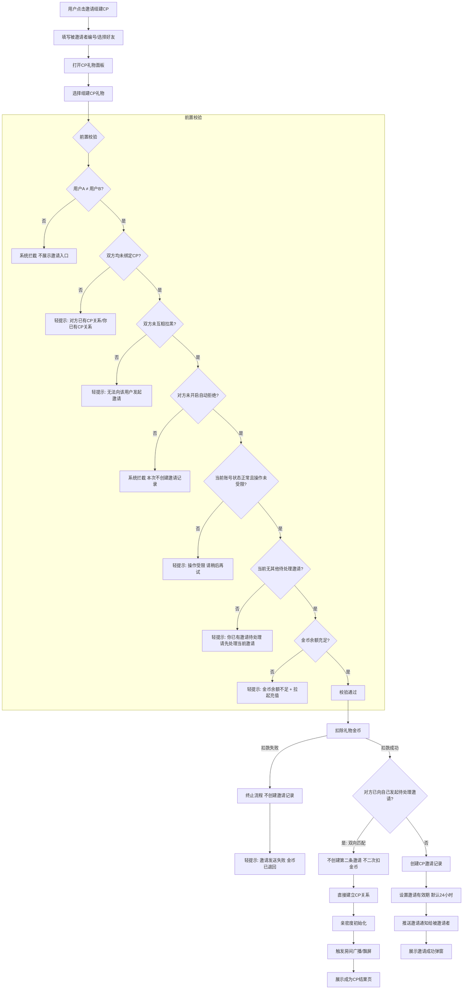

**核心规则确认**：
- 邀请前置校验必须全部通过才能继续
- 扣款成功但邀请创建失败必须回滚金币
- 双向匹配时后发起方不二次扣款

### 二、CP邀请状态流转图
#### 状态枚举
CP邀请统一使用以下3种状态：待处理、已接受、已拒绝。

#### 状态流转
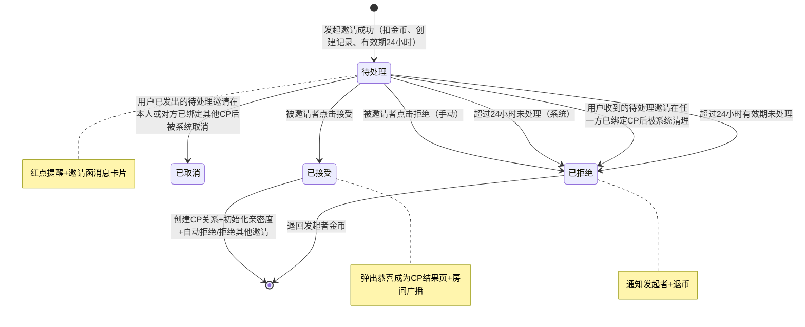

#### 状态约束
| 状态 | 进入条件 | 退出条件 | 退款口径 |
|---|---|---|---|
| 待处理 | 发起邀请成功，扣金币，设置24小时有效期 | 被接受/拒绝 | 不退款 |
| 已接受 | 被邀请者点击接受，校验通过 | 终态，不可逆 | 不退款（金币用于组建CP礼物） |
| 已拒绝 | 手动拒绝或自动拒绝 | 终态，不可逆 | 全额退回发起者 |

#### 关键规则
- 接受某邀请后，系统自动清理双方其他待处理的CP邀请，原邀请金币全额退回原发起者
- 双方互相发起CP邀请时，后发起方自动接受对方的CP邀请（双向匹配）
- 同一时间仅允许1个Outgoing邀请（单主动邀请原则）
- 可同时接收多个Incoming邀请

### 三、接受CP邀请流程
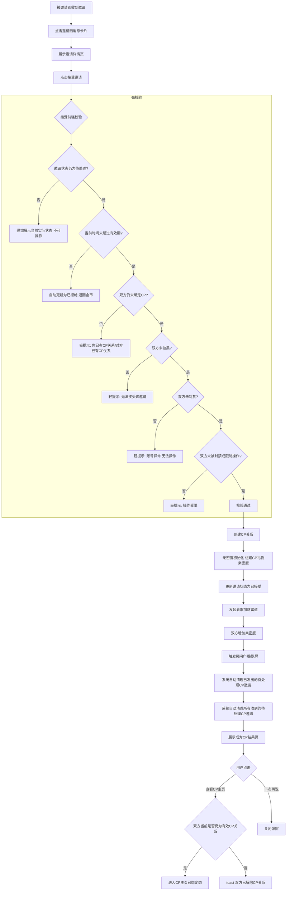

**接受后执行逻辑**：
1. 创建CP关系 → 亲密度初始化为组建CP礼物的亲密度值
2. 更新邀请状态为已接受
3. 发起者增加财富值（1金币=1财富值）
4. 双方增加亲密度（按组建CP礼物后台配置的亲密度数值写入）
5. 触发房间广播/飘屏（按组建CP礼物配置决定是否全服飘屏）
6. **系统自动清理已发出的待处理CP邀请 → 原邀请金币全额退回
7. **系统自动清理所有收到的待处理CP邀请 → 原邀请金币全额退回
8. 展示成为CP结果页

### 四、拒绝CP邀请流程
#### 页面定位
拒绝邀请流程承接被邀请者在邀请详情页点击“狠心拒绝”后的二次确认、退币和状态回流，不是一步直接拒绝。

#### 流程图
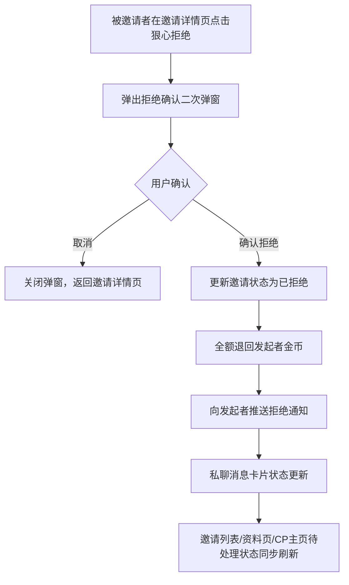

#### 执行逻辑
| 步骤 | 逻辑 |
|---|---|
| 1. 二次确认 | 点击“狠心拒绝”后先弹出确认弹窗，避免误触 |
| 2. 状态更新 | 确认后将邀请状态更新为已拒绝，终态不可逆 |
| 3. 退币 | 全额退回发起者金币，推送退币通知 |
| 4. 通知 | 向发起者推送拒绝结果（私聊消息/系统通知） |
| 5. 状态回流 | 邀请列表、私聊消息卡片、资料页待处理状态同步刷新 |

#### 拒绝原因区分
| 类型 | 说明 |
|---|---|
| 手动拒绝 | 被邀请者主动点击“狠心拒绝”并确认 |

#### 异常与测试关注点
- 覆盖正常拒绝、取消拒绝、邀请邀请已拒绝后重复点击拒绝
- 覆盖退币成功与退币失败补偿
- 覆盖拒绝后发起者侧通知、消息卡片状态、资料页待处理状态同步

### 五、CP解绑流程
> **权威流程索引**：解除关系的完整主流程、成功/失败分支、状态流转、通知补偿及历史记录保留，以“8.4 CP解除关系闭环流程”为准；本节仅保留解绑后的具体业务处理结果。

**解绑处理逻辑**：
- 亲密度清零（非保留）
- 日榜、周榜、总榜立即移出当前CP双方
- 等级重置为等级0
- 当前等级权益失效；纪念型永久权益和历史荣誉记录保留
- 非永久奖励不回收
- 组建CP礼物不退回
- 可随时重新绑定（无固定等待限制）

### 六、亲密度增加业务总流程
#### 模块定位
本模块用于统一 CP 关系内所有“亲密度增加”来源的总流程。CP1.0仅保留送礼型增长：接受邀请初始化、普通礼物、CP专属礼物。

#### 适用入口
| 入口类型 | 是否增加总亲密度 | 是否增加本周期贡献值 | 是否写入亲密度记录 | 说明 |
|---|---|---|---|---|
| 接受 CP 邀请后初始化 | 是 | 是 | 是 | 按组建 CP 礼物后台配置的亲密度数值写入，作为关系建立后的初始亲密度 |
| 普通礼物送礼 | 是 | 是 | 是 | 已绑定关系内的常规付费增长入口；亲密度按礼物后台配置写入 |
| CP 专属礼物送礼 | 是 | 是 | 是 | 亲密度按收取礼物后台配置的亲密度数值写入 |

#### 业务流程图
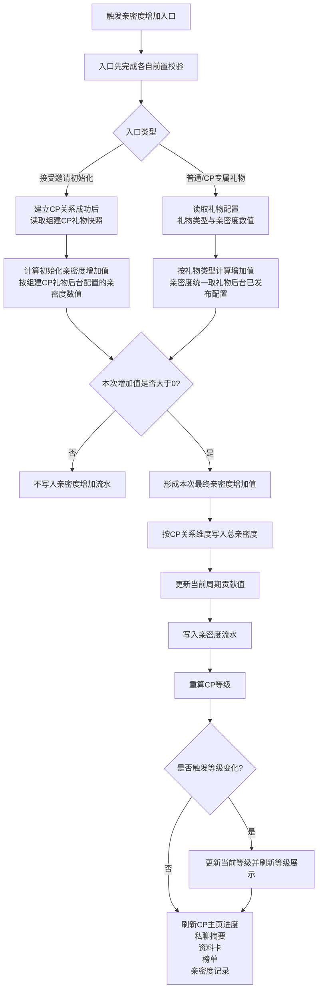

#### 关键业务规则
| 规则项 | 业务规则 | 异常处理 |
|---|---|---|
| 来源分类 | 亲密度增加来源仅分为：接受邀请初始化、礼物送礼 | 不允许把解除、通知提醒或其他非送礼行为误写成增加来源 |
| 初始化规则 | 组建 CP 礼物亲密度仅在邀请被接受、CP 关系正式建立时触发一次 | 未接受或已拒绝都不得写入初始亲密度 |
| 礼物增长规则 | 普通礼物、CP 专属礼物都属于已绑定关系内的礼物型增长 | 礼物结果成立后，亲密度、财富值和榜单贡献按实际规则正常结算 |
| 每日上限 | CP1.0不限制每日亲密度增长，初始化和礼物送礼均按实际结果全额写入 | - |
| 周期贡献 | 初始化和礼物送礼默认计入当前周期贡献 | 榜单按实际写入亲密度统计 |
| 等级联动 | 每次亲密度增加写入后必须立即重算 CP 等级 | 达到新等级时刷新等级展示；未升级时只刷新进度 |
| 记录可追溯 | 所有增长来源都必须生成可追溯的亲密度流水 | 不允许只改总值、不留流水 |

#### 系统后台核心逻辑
- 亲密度增加统一按 CP关系维度入账，不允许绕开主链路直接改总值。
- 初始化和礼物送礼都必须生成可追溯流水。
- 榜单贡献和总亲密度不是同一个口径；CP1.0 中仅礼物型增长进入当前榜单周期统计。
- 等级重算必须在亲密度写入后立即执行，前台展示读取最新结果。

#### 异常与测试关注点
- 覆盖接受邀请初始化、普通礼物、CP专属礼物三类入口。
- 覆盖各类礼物型增长的亲密度、财富值、榜单贡献和等级刷新结果一致性。
- 覆盖多端同时操作时总亲密度、榜单贡献和前台展示的一致性。
- 覆盖非送礼行为不会被计入CP1.0亲密度。

### 八、邀请闭环、关系维护与配置生效流程
#### 8.1 CP邀请闭环流程
##### 流程目标
定义从“入口承接”到“邀请创建”、再到“接受 / 拒绝 ”终态收口的完整邀请闭环，确保金币扣减、邀请状态、关系建立和旧邀请失效口径一致。

##### 参与角色
| 角色 | 职责 |
|---|---|
| 邀请者 | 发起 CP 邀请、支付组建礼物 |
| 被邀请者 | 接收并处理邀请 |
| 系统后台 | 创建邀请记录、管理终态、同步退币与通知 |

##### 触发条件
- 邀请者从礼物面板、资料页或系统提示进入邀请链路。
- 当前存在可用组建礼物，且双方满足邀请条件。

##### 主流程
> **权威流程索引**：邀请创建以“CP邀请发起流程”为准；接受、拒绝分别以“接受CP邀请流程”“拒绝CP邀请流程”为准。本节保留邀请闭环的终态、异常、后台和幂等规则，避免再画一张只复述主链路的摘要图。

##### 分支流程
- 拒绝时：邀请进入已拒绝终态，触发退币和结果通知。
- 取消时：邀请进入已取消终态，触发退币和结果通知。
- 过期 / 取消时：邀请进入终态，触发退币并刷新邀请入口状态。
- 接受后：系统自动关闭双方其他待处理邀请；其中收到的邀请进入已拒绝，主动发出的邀请进入已取消，防止旧邀请继续被处理。

##### 状态流转
| 邀请状态 | 进入条件 | 退出条件 |
|---|---|---|
| 待处理 | 邀请创建成功 | 被接受 / 被拒绝 / 过期 / 取消 |
| 已接受 | 被邀请者点击接受并校验通过 | 终态 |
| 已拒绝 | 被邀请者拒绝 | 终态 |

##### 异常分支
- 旧邀请卡片再次打开时，必须读取最新状态，展示“对方已建立CP / 当前不可处理”等结果态。
- 支付成功但邀请创建失败时，金币扣减与邀请创建必须整体回滚。
- 退币失败时，不回退终态，进入退款补偿任务。

##### 后台处理
- 邀请记录必须保存礼物快照、价格快照、来源场景、有效期和状态。
- 拒绝、过期、取消导致的退币，通过钱包记录和系统消息同步告知原付款方。
- 接受成功后，系统必须同步刷新主页、资料卡、私聊和房间关系展示。

##### 幂等/补偿
- 同一邀请只允许处理一次；接受、拒绝、过期、取消均为终态。
- 并发处理时，以邀请记录和被邀请者维度做幂等锁，防止同一邀请多次生效。

#### 8.2 CP关系成长与等级变更流程
##### 流程目标
##### 参与角色
| 角色 | 职责 |
|---|---|
| CP 双方用户 | 通过送礼维护关系 |
| 系统后台 | 计算亲密度、重算等级、刷新权益 |
| 系统消息模块 | 承接升级通知 |

##### 触发条件
- 送礼导致亲密度增加。

##### 主流程
> **权威流程索引**：送礼、亲密度入账、每日上限截断、周期贡献、等级重算与各展示位刷新，以“六、亲密度增加业务总流程”为准；本节保留关系成长状态与通知承接规则。

##### 分支流程
- 升级分支：亲密度增加后命中新等级，刷新权益并推送升级承接。
- 维持分支：亲密度增加但未升级，仅刷新进度。

##### 状态流转
| 关系成长状态 | 进入条件 | 退出条件 |
|---|---|---|
| 正常维护中 | 发生有效送礼 | 升级 / 维持当前等级 |
| 已升级 | 新等级高于旧等级 | 权益刷新完成 |

##### 后台处理
- 成长值、等级、权益和通知读取同一份最终关系快照。

##### 幂等/补偿
- 同一笔送礼只允许触发一次等级校验和一次升级结果。

#### 8.3 CP榜单结算与历史快照固化流程
##### 流程目标
定义日榜、周榜在周期结束后的快照锁定、历史固化和客服追溯逻辑，并明确总榜仅做当前实时排序展示，确保榜单历史与前台展示读取同一份最终数据。

##### 参与角色
| 角色 | 职责 |
|---|---|
| CP 关系双方 | 作为榜单统计对象 |
| 榜单结算任务 | 生成快照、固化历史结果 |
| 客服 / 后台 | 查询历史榜单快照并做追溯说明 |

##### 触发条件
- 日榜 / 周榜达到周期结束时点。
- 榜单周期数据统计完成，允许生成最终快照。

##### 主流程
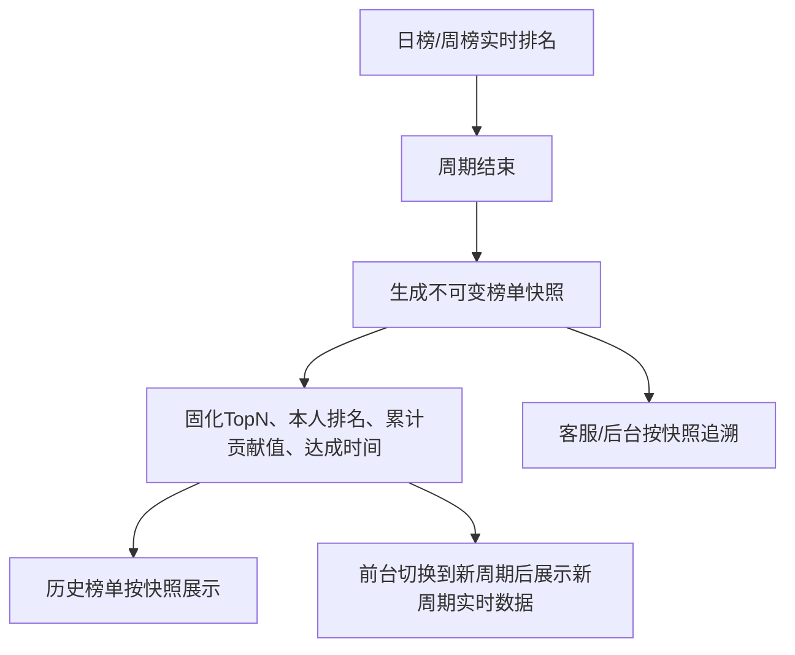

##### 分支流程
- 日榜 / 周榜：周期结束后生成快照并进入历史榜单。
- 总榜：不进入独立结算流程，只读取当前实时排序结果。
- 统计失败或延迟：保留结算中状态，待重试成功后再生成快照。

##### 状态流转
| 结算状态 | 进入条件 | 退出条件 |
|---|---|---|
| 待结算 | 周期结束 | 快照生成成功 |
| 已快照 | 不可变快照生成完成 | 历史结果可查询 |
| 结算处理中 | 统计延迟或任务重试中 | 任务成功或人工终结 |

##### 异常分支
- 快照生成失败时，不展示伪历史结果，需保持结算中状态并重试。
- 统计延迟不影响总榜实时展示，但会延迟日榜 / 周榜历史结果生成。
- 历史查询失败时，前端展示加载失败或空态，不得回退读取实时榜单替代历史结果。

##### 后台处理
- 日榜、周榜周期结束后生成不可变快照，历史榜单和客服追溯均读取同一份快照，不受后续亲密度变化影响。
- 总榜读取当前实时排序结果，不单独生成结算周期。
- 客服和后台查询不得直接用实时榜单替代历史快照结果。

##### 幂等/补偿
- 同一榜单周期 + 榜单类型 + CP关系 只允许生成一次最终快照。
- 重试任务必须复用原周期快照上下文，禁止为同一周期生成多份独立历史结果。
#### 8.4 CP解除关系闭环流程
##### 流程目标
定义 CP 关系从用户发起解除到终态落库、权益失效、通知回流和历史记录保留的完整闭环，避免“关系已解除但展示仍像当前 CP”这种断链。

##### 参与角色
| 角色 | 职责 |
|---|---|
| 发起解除方 | 发起解除关系 |
| 被解除方 | 接收解除结果通知 |
| 系统后台 | 写入终态、失效权益、刷新展示、保留历史记录 |

##### 触发条件
- 用户从 CP设置页或 CP主页发起解除关系。
- 当前关系为可解除的有效 CP 关系。

##### 主流程
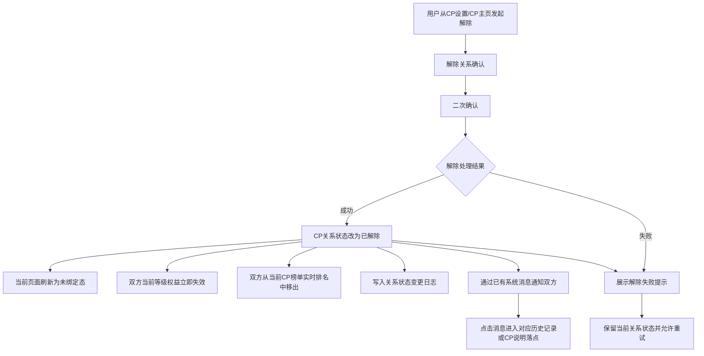

##### 分支流程
- 成功分支：关系改为已解除，刷新前台到未绑定态，双方从当前 CP 榜单实时排名中移出，并失效当前等级权益。
- 失败分支：提示解除失败，保留当前关系状态并允许重试。

##### 状态流转
| 关系状态 | 进入条件 | 退出条件 |
|---|---|---|
| 可解除 | 当前存在有效 CP 关系 | 用户确认解除 |
| 解除处理中 | 已提交解除请求 | 成功 / 失败 |
| 已解除 | 解除落库成功 | 终态 |
| 解除失败 | 解除执行失败 | 允许重试 |

##### 异常分支
- 解除成功不单独新增动态页面，默认落到 CP主页未绑定态或当前页面未绑定态。
- CP 榜单移出失败不得恢复关系状态，必须进入榜单补偿修复，避免前台继续展示为有效 CP 排名。
- 通知发送失败不回滚解除结果，必须进入通知补偿任务。
- 权益失效失败不得恢复关系状态，必须走补偿修复。

##### 后台处理
- 解除关系落库成功后，双方必须从当前实时 CP 榜单中移出，不再参与当前有效 CP 排名展示。
- 已生成的日榜 / 周榜历史快照仍按历史结果保留，不因后续解除关系被物理删除。
- 总榜、日榜、周榜当前实时展示均不得继续把已解除关系作为有效 CP 进行排序或曝光。
- 榜单刷新、权益失效、消息通知读取同一份已解除关系终态，避免一侧已移出、一侧仍在榜的脏数据。

##### 后台处理
- 双方解除通知通过已有系统消息推送，消息文案需明确“关系已解除、当前权益已拒绝、历史记录入口”。
- 解除后历史可见范围必须按历史记录规则处理，不得继续展示为当前 CP 关系。
- 榜单、礼物、亲密度历史记录保留，但不再为旧关系继续增长。

##### 幂等/补偿
- 同一关系解除操作必须按关系ID幂等处理，重复点击只能返回同一最终结果。
- 若前台多端同时发起解除，以首个成功结果为准，其他请求刷新终态。

#### 8.5 后台配置发布、生效与历史快照流程
##### 流程目标
统一后台保存、发布、生效和历史快照保留逻辑。CP1.0以列表页“一键发布配置”作为唯一发布入口，直接执行校验和发布。

##### 参与角色
| 角色 | 职责 |
|---|---|
| 运营 | 新增、编辑草稿、在列表页一键发布配置 |
| 系统后台 | 做字段校验、生成版本并控制生效 |
| 前台业务模块 | 仅读取已发布版本 |

##### 触发条件
- 后台新增或编辑配置。
- 运营在列表页点击“一键发布配置”。

##### 主流程
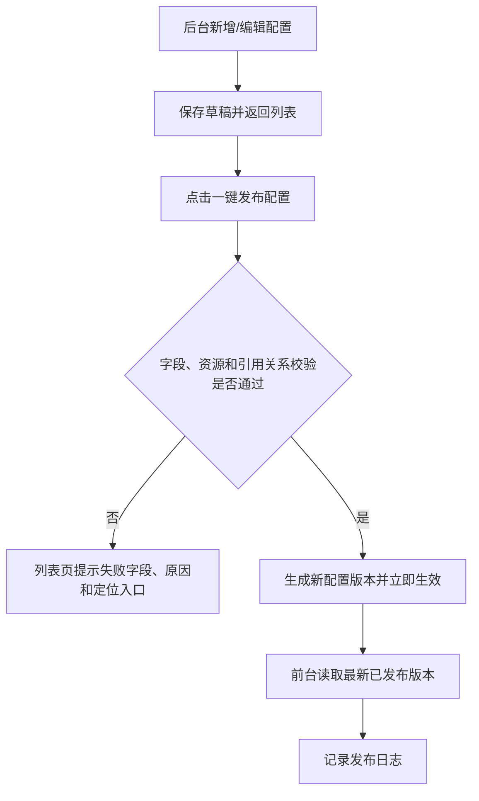

##### 分支流程
- 校验失败：禁止发布，草稿保留供运营修正。
- 发布成功：等级当前值按最新完整等级表实时计算；礼物与建立关系配置仅作用于发布后的新业务行为。

##### 状态流转
| 配置状态 | 进入条件 | 退出条件 |
|---|---|---|
| 草稿 | 保存未发布 | 发布成功 / 删除 |
| 待发布 | 校验通过待发布 | 发布成功 / 继续编辑 |
| 已生效 | 发布成功 | 被新版本覆盖；等级配置不支持单独停用 |

##### 异常分支
- 保存不等于生效，草稿不得影响前台。
- 历史奖励、历史送礼记录和历史榜单快照不追溯重算。
- CP1.0不支持业务回滚；配置错误只能通过发布新版本覆盖旧版本。

##### 后台处理
- 发布记录必须可追溯操作人、版本号、发布时间和影响模块。
- 前台静态规则说明只读取已发布配置对应的规则文案。

##### 幂等/补偿
- 同一配置版本只能成功发布一次，重复点击发布返回同一结果。
- 发布成功后缓存或通知刷新异常不改变已发布版本，由平台通用机制恢复；业务配置不回滚。

#### 8.6 跨入口关系状态实时校验与失效拦截
##### 适用范围
适用于私聊消息结果、系统通知、升级通知、半屏资料卡、全屏资料页、房间快捷入口等所有可跳转至 CP 主页或关系详情的入口。

##### 统一规则
1. 用户点击跳转时，必须重新读取双方当前 CP 关系状态和关系编号；不得以消息、通知、资料卡或房间露出生成时的旧缓存作为跳转依据。
2. 仅按本次读取到的当前关系结果决定是否继续跳转；双方当前已解除 CP 时，必须阻断跳转，并统一 toast 提示：`双方已解除CP关系`。
3. 关系状态校验只决定当前跳转是否可继续；不得倒改既有邀请终态、等级结果、礼物流水、奖励记录或历史榜单快照。
4. 各入口仍需按本模块指定的刷新落点回收展示：消息/通知保留结果态，资料入口刷新 CP 模块，房间入口刷新当前露出状态。

### 九、礼物链路、奖励与后台生效流程
#### 9.1 礼物入口与可送礼物筛选流程
##### 流程目标
定义用户打开礼物面板后，系统如何依据“是否已有 CP 关系、关系是否有效、当前等级是否满足门槛”筛选可送礼物，避免未绑定时混出经营礼物、已绑定时混出无效礼物。

##### 参与角色
| 角色 | 职责 |
|---|---|
| 用户 | 打开礼物面板并选择礼物 |
| 系统后台 | 判断关系状态、读取等级与礼物配置、返回可送礼物集合 |

##### 触发条件
- 用户打开礼物面板。
- 当前存在礼物配置，且 CP 功能已对用户开放。

##### 主流程
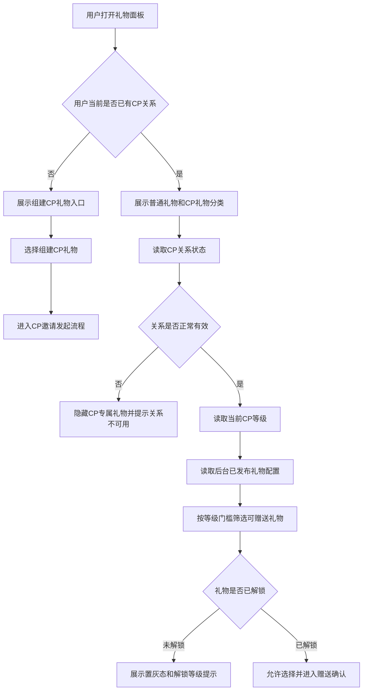

##### 分支流程
- 未绑定 CP：优先展示组建 CP 礼物和组建引导。
- 已绑定 CP：展示 CP 专属礼物等经营类内容。
- 未解锁礼物：允许展示置灰态，但点击只展示解锁条件，不得直接扣费。

##### 状态流转
| 礼物面板状态 | 进入条件 | 退出条件 |
|---|---|---|
| 未绑定引导态 | 当前无有效 CP 关系 | 进入邀请发起流程 |
| 已绑定经营态 | 当前存在有效 CP 关系 | 进入送礼确认 |
| 未解锁态 | 礼物等级门槛未满足 | 提示后返回面板 |
| 不可用态 | 关系无效或礼物下架 | 阻断送礼 |

##### 异常分支
- 奖励说明弹层关闭后，用户必须回到当前礼物面板状态，不得丢分类上下文。
- 草稿配置不得影响前台礼物面板；只有已发布版本可见。
- 关系状态变化或礼物配置失效时，必须在确认前重新校验。

##### 后台处理
- 礼物配置必须读取后台已发布版本。
- 面板内分类切换只切换礼物面板内容，不跳出当前礼物面板。

##### 幂等/补偿
- 该流程本身不产生资产结果，但每次进入赠送确认前都必须读取最新可送集合，避免客户端缓存导致误送。

#### 9.2 组建CP礼物支付、邀请与生效流程
##### 流程目标
定义组建 CP 礼物从扣金币、创建邀请，到关系建立、生效写入亲密度和财富值，再到拒绝 / 过期 / 取消时退币的完整礼物闭环。

##### 参与角色
| 角色 | 职责 |
|---|---|
| 邀请者 | 选择组建礼物并支付 |
| 被邀请者 | 处理邀请 |
| 系统后台 | 创建邀请、写入快照、生效亲密度与财富值、处理退币 |

##### 触发条件
- 用户选择了组建 CP 礼物。
- 双方满足邀请条件，且金币余额充足。

##### 主流程
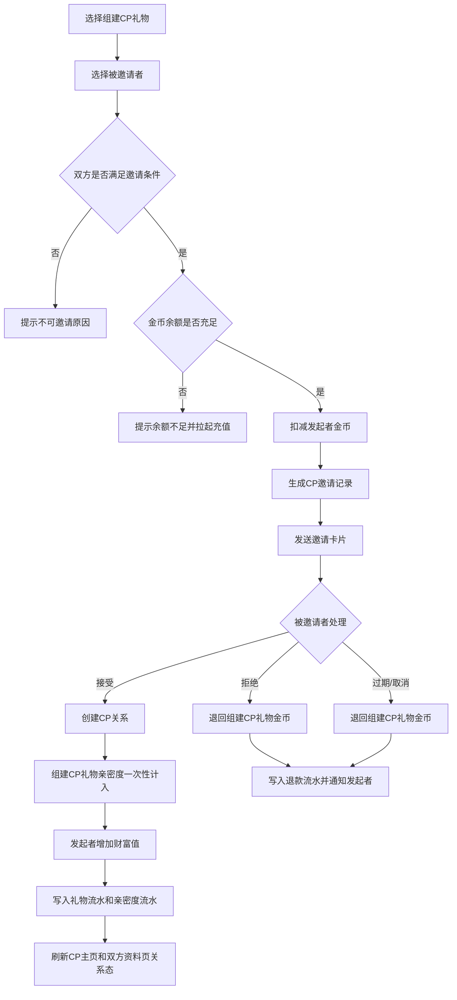

##### 分支流程
- 接受：建立 CP 关系，一次性计入亲密度和财富值，并发放结成奖励和特效。
- 拒绝 / 过期 / 取消：退回组建礼物金币，刷新邀请状态并通知发起者；其中系统因建立其他CP关系触发的关闭结果统一记为已取消。

##### 状态流转
| 礼物邀请状态 | 进入条件 | 退出条件 |
|---|---|---|
| 待支付 | 选择组建礼物后 | 扣费成功 / 失败 |
| 待处理 | 邀请创建成功 | 接受 / 拒绝 / 过期 / 取消 |
| 已生效 | 邀请被接受且关系建立成功 | 终态 |
| 已退款 | 邀请拒绝 / 过期 / 取消后退币成功 | 终态 |
| 退款补偿中 | 退币失败 | 补偿成功或人工终结 |

##### 异常分支
- 组建 CP 礼物在邀请发起时扣金币，但只有邀请被接受、CP关系正式建立时，才一次性计入亲密度。
- 结成奖励发放失败时，不回滚 CP 关系和亲密度结果；必须进入失败补发队列。
- 邀请被接受后，组建 CP 礼物不再退回；后续解除关系也不退回。

##### 后台处理
- 发起邀请时必须写入邀请配置快照，至少包含：建立礼物、礼物价格、结成特效、结成奖励、奖励失效方式、配置版本。
- 组建 CP 礼物亲密度按礼物后台已发布配置的亲密度数值写入；财富值按“金币 × 1”给发起者增加。
- 接受后刷新主页、资料页、房间和私聊关系状态。

##### 幂等/补偿
- 邀请终态及并发处理规则遵循“8.1 CP邀请闭环流程”的“幂等/补偿”；本链路的退币补偿、奖励补发必须复用原邀请记录和原礼物快照，不得新建第二条主记录。

#### 9.3 普通礼物与CP专属礼物送礼增长流程
##### 流程目标
定义普通礼物、CP 专属礼物在已绑定关系下的送礼增长口径，确保扣费、亲密度、榜单贡献、等级校验和超上限提示遵循同一顺序。

##### 参与角色
| 角色 | 职责 |
|---|---|
| 用户 | 选择并赠送礼物 |
| 系统后台 | 校验关系、扣费、写亲密度、更新等级和榜单贡献 |

##### 触发条件
- 当前存在有效 CP 关系。
- 礼物满足等级门槛且金币余额充足。

##### 主流程
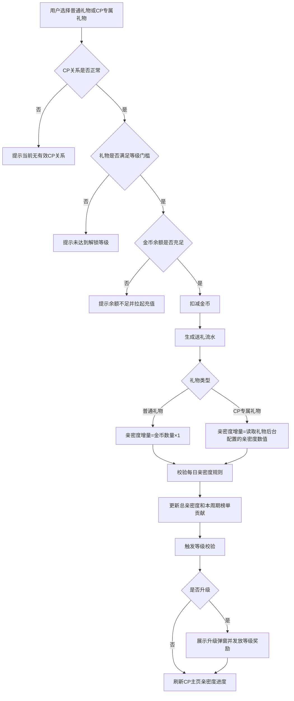

##### 分支流程
- 普通礼物：亲密度按“金币 × 1”计算。
- CP 专属礼物：亲密度直接读取礼物后台已发布配置的亲密度数值。
- 送礼成功后，亲密度、财富值、榜单贡献和礼物展示结果按实际规则正常结算。

##### 状态流转
| 送礼状态 | 进入条件 | 退出条件 |
|---|---|---|
| 待校验 | 用户选礼物后 | 通过 / 失败 |
| 已扣费 | 金币扣减成功 | 写入亲密度 / 进入结果态 |
| 已升级 | 升级条件满足 | 弹窗和奖励处理完成 |

##### 异常分支
- CP1.0不限制每日亲密度增长；送礼成功后需同步刷新亲密度、财富值、榜单贡献和等级结果。
- 礼物或等级配置变化时，确认前以后端最新状态拦截。
- 等级奖励发放失败时，不回滚已写入的送礼和亲密度结果。

##### 后台处理
- 亲密度写入必须同时记录来源：普通礼物、CP专属礼物，方便记录页和客服追溯。
- 榜单贡献更新必须使用最终实际写入值，而不是理论值。
- 升级校验与主页进度刷新都读取同一次送礼后的新总亲密度。

##### 幂等/补偿
- 同一笔送礼记录只能结算一次亲密度、一次榜单贡献、一次等级校验。
- 弱网重试时必须按送礼流水幂等拦截，避免重复写成长值。

#### 9.5 礼物记录、奖励结果与补发流程
##### 流程目标
统一送礼记录和奖励结果逻辑，确保用户记录与客服追溯口径一致。

##### 参与角色
| 角色 | 职责 |
|---|---|
| 用户 | 查看礼物记录、领取奖励或确认结果 |
| 系统后台 | 写送礼记录、生成奖励记录、处理领取和过期 |
| 客服 / 运营 | 追溯和补发异常奖励 |

##### 触发条件
- 送礼成功或奖励命中。
- 奖励为自动发放类型。

##### 主流程
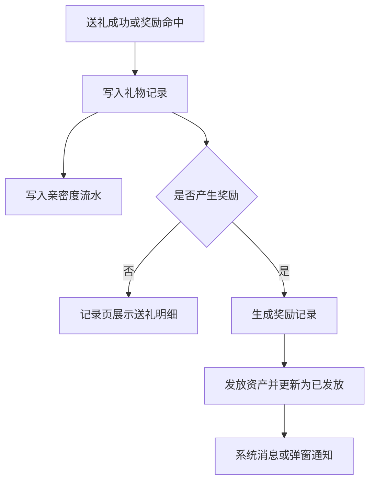

##### 分支流程
- 无奖励：记录页只展示送礼明细。
- 奖励统一自动到账，并更新为已发放。

##### 状态流转
| 奖励记录状态 | 进入条件 | 退出条件 |
|---|---|---|
| 待发放 | 奖励规则命中并生成唯一奖励记录 | 发放成功 / 发放失败 |
| 发放失败待重试 | 自动发放失败 | 重试成功 / 人工终结 |
| 已发放 | 自动发放或重试成功 | 终态 |
| 人工终结 | 重试仍失败且具备人工终结权限 | 终态，保留失败原因、操作人和操作时间 |

##### 异常分支
- 奖励弹窗只是展示和结果确认入口，实际发放以奖励记录为准。
- 自动发放失败后进入“发放失败待重试”；每次尝试记录失败原因、最近尝试时间和重试次数，重试成功后转为“已发放”。
- 人工终结仅可由具备对应权限的人员执行，必须记录终结原因、操作人和操作时间；不允许通过新建奖励记录替代原记录。
- 按天失效奖励以获得奖励当天（东三区）为第1天；有效期N天时，在第N天结束后的00:00:00失效，永久奖励不设置到期时间。

##### 后台处理
- 礼物记录用于用户侧查看；奖励记录用于资产发放、客服追溯和补发，两个对象必须拆开保存。
- 带奖励的 CP 礼物，需要区分邀请者视角和被邀请者视角展示不同文案，但奖励结果都以最终记录为准。
- 奖励说明弹层、中奖弹层、记录页和客服后台都必须回到同一份奖励记录。

##### 幂等/补偿
- 自动发放和失败重试都必须按奖励记录ID幂等处理。
- 同一奖励记录不允许出现重复发放；人工终结后不再自动重试。

#### 9.6 礼物后台配置发布与前台生效流程
##### 流程目标
统一礼物类配置从草稿保存到发布生效的链路，确保礼物类型、价格、倍率、特效和奖励有效期只影响发布后的新行为，不追溯修改历史流水。

##### 参与角色
| 角色 | 职责 |
|---|---|
| 运营 | 新增 / 编辑 / 发布礼物配置 |
| 系统后台 | 做字段校验、生成版本、控制前台生效 |
| 前台礼物模块 | 仅读取已发布版本 |

##### 触发条件
- 后台新增或编辑 CP 礼物配置。
- 运营点击发布礼物配置。

##### 主流程
> **权威流程索引**：保存、校验、列表页一键发布、版本和历史快照，以“8.5 后台配置发布、生效与历史快照流程”为准；本节仅保留礼物配置独有字段、前台影响和历史流水规则。

##### 分支流程
- 校验失败：禁止发布，提示字段错误或资源失效。
- 草稿保存：不影响前台。
- 发布成功：仅影响发布后的新送礼行为。

##### 状态流转
| 配置状态 | 进入条件 | 退出条件 |
|---|---|---|
| 草稿 | 保存未发布 | 发布成功 / 删除 |
| 待发布 | 校验通过待确认 | 发布成功 / 取消 |
| 已生效 | 发布成功 | 被新版本替换或停用 |
| 已停用 | 主动下线 | 终态 |

##### 异常分支
- 已发生送礼、已发奖励、历史亲密度流水默认不因配置变化重算。
- 草稿配置不得影响前台礼物面板、前台送礼和广播判断。

##### 后台处理
- 礼物后台配置至少覆盖：礼物类型、金币价格、亲密度倍率、解锁等级、特效开关、广播条件和奖励有效期。
- 历史送礼流水和历史奖励记录必须保留原配置快照，方便客服追溯。
- 记录操作日志，包含操作人、版本号、发布时间和影响模块。

##### 幂等/补偿
- 同一配置版本只能成功发布一次。
- 发布成功后若缓存刷新失败，不回滚已发布版本，改走缓存补偿任务。

---

> 客户端页面、交互与原型见《CP系统需求文档_v1.0_客户端》。  
> 后台配置与原型见《CP系统需求文档_v1.0_后台》。