# CP系统需求文档

**版本：** 1.0完整重写版  
**生成时间：** 2026-05-15  
**输出目录：** /Users/mac/心音跳动/CP/ai实验室2  
**原型来源：** /Users/mac/心音跳动/CP/ai实验室2/原型图-功能切割  
**编写规范：** 严格按照 BDM系统1.0需求文档 结构模板

---

## 文档说明

本文档基于原型图和xmind核心规则撰写，严格以原型展示内容为准。

材料中出现但原型未展示的逻辑和描述，不在本文档体现。

原型已拆分为独立页面和交互流程图：交互流程图置于功能模块标题下方，独立页面置于功能点标题下方。

用户端仅包含普通用户视角（有CP/无CP两种状态）。

**重要说明：** CP系统为语聊场景下的社交关系绑定系统，核心业务闭环为：邀请 → 绑定 → 送礼 → 亲密度增长 → 等级变化 → 权益/奖励处理 → 榜单变化 → 房间/私聊/资料卡展示 → 再次送礼。

<span style="color: red; font-weight: bold;">**技术规范：** 所有业务数值必须由系统后台返回，禁止用户端硬编码。包括但不限于：CP专属礼物亲密度倍率（由后台配置）、幸运礼物折损比例（0.2）、邀请有效期（默认24小时）、衰减规则（3天-2%/5天-5%/7天+-10%）、等级配置参数、每日亲密度上限等。用户端仅负责展示，所有计算逻辑和配置参数均由系统后台控制。</span>

<span style="color:red"><strong>数据实时性要求：用户端凡展示"当前亲密度""本周贡献值""CP等级"等实时数据，均必须保证实时性。页面进入、送礼完成、等级变更、衰减触发后，必须重新读取或实时计算最新数据；不得读取已过期本地暂存数据或延迟批处理结果。历史亲密度记录按流水快照展示。</strong></span>

---

## 系统角色

| 角色 | 用户端入口 | 后台管理 | 说明 |
|---|---|---|---|
| 普通用户（有CP） | ✔ 查看CP主页/送礼/榜单/设置 | - | 已绑定CP关系的用户 |
| 普通用户（无CP） | ✔ 发起/接受邀请/好友推荐 | - | 未绑定CP关系的用户 |
| 被风控用户 | ✔ 受限的CP操作 | - | 邀请频次受限/CP功能冻结 |
| 运营后台 | - | ✔ 配置等级/礼物/风控/衰减/榜单参数 | 平台运营人员 |

---

## 核心规则定义

以下定义是原型中亲密度、等级、榜单字段的数据计算基础，开发前必须理解。


### CP关系唯一性规则

**（1）每个用户同一时间仅允许绑定1个CP**

限制说明：
- 用户已有CP关系时，不可发起或接受新的CP邀请
- 新的CP邀请前置校验必须检查双方CP关系状态
- 建立CP后，系统自动拒绝所有未处理邀请；发起方和接收方的待处理邀请均进入系统自动拒绝终态，原邀请金币按退款规则退回

**（2）CP关系为双向绑定关系**

绑定说明：
- CP关系一旦建立，双方对称拥有相同的CP标识和等级
- 亲密度、等级、在一起时长为双方共享
- 解绑操作任一方可发起，即时生效，无需对方确认

---

### 货币与换算规则

| 配置项 | 规则 | 备注 |
|---|---|---|
| 汇率 | 1 USD = 10,000 金币 | - |
| 普通礼物亲密度 | 1 金币 = 1 亲密度 | 基础倍率 |
| 组建CP礼物亲密度 | 1 金币 = 1.5 亲密度 | **仅在邀请被接受（CP关系正式建立）时触发一次**；后续送礼走CP专属礼物规则 |
| 组建CP礼物财富值 | 1 金币 = 1 财富值 | **发起者获得**；普通送礼按系统规则给送礼方增加财富值 |
| CP专属礼物（普通） | 后台配置（范围1.2~1.5） | 可后台配置，范围1.2~1.5；需达到对应CP等级才可赠送 |
| CP超级礼物 | CP专属礼物子类 | 当前存在有效CP关系且礼物本身可赠送；赠送后可触发全服特效 |
| CP惊喜礼物 | CP专属礼物子类 | 赠送后可随机获得限定装扮；奖励内容与概率由后台配置 |
| 幸运礼物 | 1 金币 = 0.2 亲密度 | 幸运礼物主要用于惊喜玩法，仅部分计入CP亲密度，防止刷亲密度/刷榜 |

> 原型图中"赠送该CP礼物可加1-5倍增长亲密度"为展示文案，实际倍率以后台配置为准。

---

### 数据分类与统计口径

| 数据类型 | 是否累计 | 是否衰减 | 用途 | 更新时机 |
|---|---|---|---|---|
| 总亲密度 | 是 | 是 | 等级计算、关系强度展示 | 每次有效送礼：同时更新总亲密度+本周贡献值；每次衰减：仅更新总亲密度 |
| 本周贡献值 | 否（周清零） | 否 | 榜单排名 | 每次有效送礼 |
| 财富值 | 是 | 否 | 等级升级双条件之一 | CP关系内送礼方赠送任何有效付费礼物时增加；组建CP礼物在邀请被接受时给发起者增加；后续普通礼物、CP专属礼物、幸运礼物按实际扣减金币给送礼方增加财富值 |

---

### 统一时间口径

| 规则项 | 口径 | 适用范围 |
|---|---|---|
| 系统业务时区 | **东三区时间**（中东区） | 榜单周期、衰减机制、邀请已过期时间、在一起天数、每日亲密度上限、每日风控频次 |
| 自然日 | 00:00:00 - 23:59:59（东三区时间） | 所有"连续X天"按自然日计算，非滚动24小时 |
| 周榜周期 | 每周一 00:00（东三区时间）重置 | - |
| 日榜周期 | 每日 00:00（东三区时间）重置 | - |
| 邀请有效期 | 默认24小时（可后台配置），以系统后台东三区时间时间计算 | **配置变更不影响已发邀请** |

---

### 亲密度计算规则

**有效薪资流水来源（亲密度来源）**：

| 来源 | 计算规则 | 前置条件 | 用户操作→系统反馈 |
|---|---|---|---|
| 普通礼物 | 亲密度 = 金币 × 1.0 | 已绑定CP | 选择礼物 → 点击赠送 → 扣减金币 → 亲密度实时增长 → 进度条动画填充 |
| 组建CP礼物 | 亲密度 = 金币 × 1.5 | **仅在邀请被接受时触发一次** | 被邀请者点击「接受」→ 建立CP关系 → 亲密度一次性计入 |
| CP专属礼物（普通） | 亲密度 = 金币 × 倍率（后台配置，范围1.2~1.5） | CP等级 ≥ 礼物解锁等级 | 点击CP礼物 → 扣减金币 → 亲密度增长 → 展示送礼特效 |
| CP超级礼物 | CP专属礼物子类，倍率按后台配置 | CP等级 ≥ 等级8+（可配置） | 点击赠送 → 扣减金币 → 亲密度增长 → **触发全服特效** |
| CP惊喜礼物 | CP专属礼物子类，倍率按后台配置 | CP等级 ≥ 礼物解锁等级 | 点击赠送 → 扣减金币 → 亲密度增长 → **播放随机奖励动画** |
| 幸运礼物 | 亲密度 = 金币 × 0.2 | 已绑定CP | 选择幸运礼物 → 扣减金币 → 按部分计入规则增加亲密度，用户侧文案表达为“幸运礼物主要用于惊喜玩法，仅部分计入CP亲密度” |

**亲密度写入规则**：

| 规则 | 说明 | 异常处理 |
|---|---|---|
| 写入时机 | 每次有效送礼 | - |
| 写入内容 | 同时更新总亲密度 + 本周贡献值 + 写入亲密度流水 | - |
| 衰减写入 | 仅更新总亲密度，不影响本周贡献值 | - |
| 流水记录 | 记录来源：1-普通礼物 / 2-衰减 / 3-组建CP礼物 / 4-CP专属礼物 / 5-幸运礼物 / 6-风控修正 | - |
| 多端并发送礼 | 必须使用按顺序安全累加写入 | 覆盖写入或数据丢失 → 以系统后台累加结果为准 |
| 送礼与衰减并发 | 优先执行送礼，再执行衰减 | - |
| 每日亲密度上限 | 可配置，按东三区时间自然日统计 | 已达上限仍可送礼，但超出部分不增加亲密度；财富值正常增加；轻提示提示「今日亲密度已达上限」 |

**限制规则**：

| 配置项 | 默认值 | 说明 | 异常处理 |
|---|---|---|---|
| 每日上限 | 可配置 | 按东三区时间自然日统计 | 超出部分不增加亲密度，财富值正常增加 |
| 单次最大值 | 可配置 | 防止异常大额写入溢出 | 超出则提示「单次赠送金额超限」 |
| 并发规则 | 原子累加 | 多次送礼保证累加正确 | 覆盖写入 → 系统后台以累加结果覆盖 |
| 小号/异常账号 | - | 命中风控的送礼不计入亲密度 | 轻提示提示「操作受限」 |
| 数值下限 | 亲密度 ≥ 0 | 不可为负 | 衰减至0时停止衰减 |

---

### 衰减机制规则

#### 页面定位

衰减机制规则用于定义 CP 关系长期未维护时的亲密度扣减、等级联动、提醒节奏和保护规则，是关系生命周期中的核心保活与降级口径。

#### 衰减触发条件

> 连续X天无有效互动后，系统开始进入衰减判断。

| 规则项 | 默认值/口径 | 说明 |
|---|---|---|
| 连续无有效互动天数阈值 | 3天 | 连续超过此天数触发衰减 |
| 新绑定保护期 | 3天 | 保护期内不执行衰减 |
| 执行时间 | 每日东三区时间 00:00 | 每日最多执行一次 |
| 是否开启 | 可配置开关 | 后台可整体关闭衰减功能 |

#### 有效互动定义（1.0正式口径）

| 互动类型 | 是否计入 | 规则说明 |
|---|---|---|
| CP互送有效礼物 | 是 | 当日产生亲密度不少于0才视为一次有效互动 |
| 私聊有效互动 | 是 | 同一自然日内达到后台配置的双向有效消息门槛 |
| 同房上麦互动 | 是 | 双方同房上麦并达到后台配置的有效停留门槛，且未命中挂机/异常判断 |
| 系统定义互动动作 | 可选 | 由后台扩展具体互动类型 |

> 推荐版本策略：1.0版本可退回为“仅送礼计入互动”；正式口径以当前已发布策略为准。

> 有效互动必须达到最低门槛后才重置无互动计时器，避免低价值礼物、刷消息或挂机同房绕过衰减。

#### 衰减规则

| 无互动天数范围 | 每日衰减比例 | 说明 |
|---|---|---|
| 1-2天 | 0% | 不衰减 |
| 3-4天 | -2% | 每日东三区时间 00:00 最多执行一次 |
| 5-6天 | -5% | 每日东三区时间 00:00 最多执行一次 |
| 7天及以上 | -10% | 每日东三区时间 00:00 最多执行一次 |

#### 统计/计算口径

| 口径项 | 规则 |
|---|---|
| 衰减值 | 当前总亲密度 × 衰减比例 |
| 新亲密度 | 当前总亲密度 - 衰减值 |
| 数值下限 | 亲密度不得低于0 |
| 榜单影响 | 衰减仅影响总亲密度，不影响本周贡献值 |
| 送礼并发 | 衰减执行时若发生送礼，优先执行送礼，再按最新状态执行衰减 |

#### 等级联动与保护规则

| 规则项 | 规则 |
|---|---|
| 等级联动 | 衰减后如低于当前等级阈值，按衰减后的真实总亲密度实时重新匹配当前等级 |
| 降级缓冲期 | 当前文档正式口径：不设置独立7天降级缓冲期；衰减写入后直接按真实亲密度匹配等级 |
| 当前等级权益 | 随当前等级变化即时更新 |
| 非永久奖励 | 已发放不回收 |
| 纪念型永久权益 | 保留 |
| 历史荣誉 | 保留 |

#### 用户感知与提示

| 阶段 | 触发条件 | 提示文案 | 用户操作→系统反馈 |
|---|---|---|---|
| 衰减预警 | 连续2天无互动 | `连续X天未互动，将开始衰减` | 点击“去互动”→ 跳转CP主页/私聊 |
| 衰减提醒 | 亲密度发生衰减 | `亲密度 -XXX（等级已按当前亲密度更新）` | 点击“去互动保持关系”→ 跳转CP主页 |
| 降级提醒 | 衰减导致亲密度低于当前等级阈值 | `亲密度已按当前数值更新，当前等级同步调整` | 点击“去互动提升关系”→ 跳转CP主页/私聊 |

#### 交互逻辑

1. 系统每日定时检查所有有效 CP 关系的最近有效互动时间。
2. 若当前关系仍在新绑定保护期内，则本次不执行衰减。
3. 若超过无互动阈值，系统按无互动天数区间计算对应衰减比例，并写入衰减流水。
4. 衰减写入后，系统按新的真实总亲密度重新匹配当前等级，并同步更新当前等级权益展示。
5. 若命中提醒节点，则向双方发送预警、衰减或降级提醒。
6. 用户完成有效互动后，连续无互动计时器重置。

#### 系统后台核心逻辑

- 衰减任务每日最多执行一次，按东三区时间自然日运行。
- 有效互动、衰减流水、等级匹配和提醒推送必须共享同一套时间口径和关系编号口径。
- 同房、私聊、送礼三类互动都必须经过门槛和风控过滤，防止作弊。
- 数值下限固定为0，不按“降级后等级最低值”回填亲密度。
- 当前等级权益随当前等级变化；已到账非永久奖励不回收；纪念型永久权益和历史荣誉记录保留。

#### 边界情况

| 场景 | 处理规则 |
|---|---|
| 新绑定保护期内 | 不执行衰减 |
| 亲密度已为0 | 不再继续扣减 |
| 同时发生送礼与衰减 | 先送礼后衰减，按最新关系状态结算 |
| 互动未达门槛 | 不重置无互动天数 |
| 关系已解除 | 不参与新的衰减计算 |

### CP等级体系规则

### CP等级配置表

#### 页面定位

CP等级配置表是整个 CP 等级体系的唯一正式阈值来源，用于约束客户端展示、后台配置、礼物解锁、升级提示和奖励发放的数值口径。

以下为CP等级体系的完整数值配置，包含亲密度下限、财富值下限和对应消费金额。

| 等级 | 名称 | 亲密度下限 | 财富值下限 | 消费金额（美元） |
|---|---|---|---|---|
| Lv1 | 初识 | 0 | 0 |  |
| Lv2 | 心动 | 10,000 | 10,000 | $1 |
| Lv3 | 亲密 | 50,000 | 50,000 | $5 |
| Lv4 | 暧昧 | 200,000 | 200,000 | $20 |
| Lv5 | 热恋 | 500,000 | 500,000 | $50 |
| Lv6 | 深情 | 1,000,000 | 1,000,000 | $100 |
| Lv7 |  | 3,000,000 | 3,000,000 | $300 |
| Lv8 | 挚爱 | 10,000,000 | 10,000,000 | $1000 |
| Lv9 |  | 30,000,000 | 30,000,000 | $3000 |
| Lv10 | 命定之人 | 100,000,000 | 100,000,000 | $10,000 |
| Lv11 | 传奇CP | 300,000,000 | 300,000,000 | $30,000 |
| Lv12 | 神话CP | 1,000,000,000 | 1,000,000,000 | $100,000 |

#### 等级阶段说明

- **Lv1-Lv4（快速成长阶段）**：新用户低门槛入门，快速获得等级感知和成就反馈
- **Lv5-Lv7（沉淀阶段）**：中等消费用户，强化关系稳定性，引导持续互动
- **Lv8-Lv10（大R阶段）**：高消费用户，强调身份展示和稀缺特权
- **Lv11+（鲸鱼阶段）**：顶级用户，长期运营，特殊定制权益

#### 统计/计算口径

| 口径项 | 规则 |
|---|---|
| 等级阈值来源 | 以上表为唯一正式来源，不再维护第二套阈值表 |
| 等级计算基础 | 使用总亲密度判断等级，用财富值校验高价值关系门槛 |
| 组建CP礼物口径 | 组建CP礼物是独立类别，仅在邀请被接受时触发一次；财富值按 `1金币 = 1财富值` 仅给发起者增加 |
| 奖励维度 | 奖励按“用户+CP关系”维度或用户维度发放，具体由奖励规则配置控制 |

#### 等级计算规则

| 规则 | 说明 | 异常处理 |
|---|---|---|
| 升级条件 | 总亲密度 ≥ 等级下限 | 达到对应等级门槛后升级 |
| 降级条件 | 总亲密度因衰减低于当前等级下限 | 衰减写入后按真实总亲密度实时重新匹配等级 |
| 升级时机 | 亲密度写入后实时检测 | - |
| 降级时机 | 衰减后实时检测 | - |
| 配置版本 | 后台修改等级配置时生成新配置版本；发布时必须选择生效范围：仅新CP关系生效 / 同步存量CP关系等级 | 若选择同步存量，必须先生成影响评估并二次确认，历史已发放奖励和历史榜单快照不追溯 |

#### 升级触发详细规则

| 规则项 | 说明 |
|---|---|
| 升级触发条件 | CP总亲密度达到等级亲密度阈值，且发起方财富值达到对应财富值阈值 |
| 升级方式 | 自动升级（无用户操作） |
| 即时触发 | 亲密度写入后立即检测升级 |
| 延迟触发 | 可在动画队列中延迟执行，避免打断当前体验 |
| 多级升级合并展示 | 如 Lv8→Lv10，一次送礼跨多级时合并展示升级动画和奖励 |

#### 新绑定保护与降级规则

| 规则 | 说明 |
|---|---|
| 新绑定保护 | 绑定后X天内不触发衰减（默认3天），只保护“是否执行衰减”，不保护等级 |
| 降级规则 | 不设置独立降级缓冲期；衰减写入后，如果总亲密度低于当前等级阈值，立即按真实总亲密度重新匹配等级 |
| 权益处理 | 当前等级权益随当前等级变化；已到账非永久奖励不回收；纪念型永久权益和历史荣誉记录保留 |
| 并发处理 | 衰减执行时若发生送礼，以最新关系状态为准，防止数据覆盖 |

#### 降级后奖励处理规则

| 场景 | 处理方案 |
|---|---|
| 降级后重复领奖励（Lv6→Lv5→Lv6） | 奖励仅首次发放，基于历史最高等级记录和去重键判断 |
| 换CP刷奖励（A+B升Lv6→A+C再升Lv6） | 奖励按奖励类型配置去重维度：默认纪念型/高价值奖励按用户维度去重，关系成长型奖励按CP关系维度去重 |
| 多级连升（一次送礼跨多级） | 按等级逐级发放奖励，避免漏发 |

### CP邀请系统规则

**邀请前置校验（必须全部通过）**：

| 校验项 | 不通过时反馈 |
|---|---|
| 用户A ≠ 用户B | 系统拦截，不展示邀请入口 |
| 双方均未绑定CP | 轻提示提示「对方已有CP关系」或「你已有CP关系」 |
| 双方未互相拉黑 | 轻提示提示「无法向该用户发起邀请」 |
| 双方均未开启「自动拒绝CP邀请」 | 邀请直接被系统设为已拒绝，原路退回金币 |
| 发起方未被风控限制 | 轻提示提示「操作受限，请稍后再试」 |
| 不存在重复待处理邀请 | 轻提示提示「你已有邀请待处理」 |
| 金币余额充足 | 轻提示提示「金币余额不足，请充值」+ 拉起半屏充值页面 |

**邀请状态流转**：

| 状态 | 开发枚举对照 | 触发条件 | 是否退款 | 是否创建CP | 被邀请者反馈 |
|---|---|---|---|---|---|
| 待处理 | 待处理 | 发起邀请成功 | 否 | 否 | 红点提醒+邀请函消息卡片 |
| 已接受 | 已接受 | 被邀请者点击「接受」 | 否 | 是 | 弹出恭喜成为CP结果页 |
| 已拒绝 | 已拒绝 | 被邀请者点击「狠心拒绝」/ 自动拒绝开关触发 | 是 | 否 | 轻提示提示「已拒绝」 |
| 已过期 | 已过期 | 超过有效期未处理 | 是 | 否 | 邀请函消息卡片状态更新 |
| 已取消 | 已取消 | 邀请方主动取消 | 是 | 否 | 邀请函消息卡片状态更新 |
| 系统自动拒绝 | 已拒绝 | 系统因任一方已建立CP关系自动拒绝待处理邀请 | 是 | 否 | 邀请函消息卡片状态更新为系统自动拒绝 |

**状态命名规范（强制）**：
- 超时统一为 **已过期**，不归入拒绝类终态
- 自动拒绝开关触发时状态为 **已拒绝**（不是已过期）
- 风控命中时按风控策略处理（冻结/复核），不默认入账

**金币/财富值/亲密度处理表**：

| 场景 | 金币 | 财富值 | 亲密度 | 榜单贡献 |
|---|---|---|---|---|
| 邀请已接受 | 不退款 | 发起者增加 | 双方增加 | 计入 |
| 主动已拒绝 | 原路退回 | 不增加 | 不增加 | 不计入 |
| 已过期 | 原路退回 | 不增加 | 不增加 | 不计入 |
| 已取消 | 原路退回 | 不增加 | 不增加 | 不计入 |
| 风控命中 | 冻结/复核/按策略处理 | 按策略 | 默认不计入 | 默认不计入 |

**用户状态模型**：

| 状态 | 说明 | 可执行操作 |
|---|---|---|
| 空闲态（Idle） | 无CP关系，无待处理邀请 | 可发起邀请 / 可接受邀请 |
| 已发出待处理（Outgoing） | 已发起邀请，等待对方响应 | **同一时间仅允许1个**；不可再次发起 |
| 收到邀请列表（Incoming List） | 收到多个被邀请（队列形式） | 可逐个接受/拒绝/不处理 |
| 互相邀请待合并（Match Ready） | 双方互相邀请 | 后发起方自动接受，直接建立CP |
| 已绑定CP（CP Bound） | 已绑定CP | 不可发起/接受邀请 |

**核心约束规则**：

| 规则 | 说明 | 违反时反馈 |
|---|---|---|
| 单主动邀请原则 | 同一时间仅允许1个主动邀请 | 提示「你已有邀请待处理，请先取消后再发起」 |
| 多被邀请队列 | 可同时接收多个Incoming | 列表展示，按礼物价值降序+剩余时间升序排序 |
| CP关系唯一锁 | 建立CP后系统自动拒绝所有未处理邀请 | 无感知，自动处理并按退款规则退回原邀请金币 |
| 双向匹配优先 | A邀请B且B邀请A时，后发起方不扣款 | 提示「你们互相心动了❤️」，自动建立CP |
| 建立CP后旧邀请操作 | 直接拒绝 | 轻提示「你已建立CP关系」 |

**事件优先级**：最高优先级建立CP > 次高优先级双向匹配 > 普通优先级收到邀请 > 最低优先级发起邀请

**邀请骚扰控制**：

| 策略 | 规则 | 可配置 |
|---|---|---|
| 单用户每日邀请次数 | 限制指定数量次（默认3次） | 是 |
| 同一目标冷却时间 | 24小时 | 是 |
| 被邀请过多 | 列表折叠，展示前列 指定数量；排序：互动频率 > 礼物金额 > 在线状态 | 是 |
| 被标记为骚扰用户 | 不触发系统提示组建CP弹窗 | - |
| 小号限制 | 小号发起的邀请不计入有效邀请 | - |

---

### 风控系统规则

**风控触发场景**：

| 场景 | 检测维度 | 命中后处理 | 用户反馈 |
|---|---|---|---|
| 小号/异常账号 | 账号年龄+活跃度+送礼模式 | 不计入亲密度/榜单/邀请 | 轻提示「操作受限」 |
| 频繁解绑重绑 | 30天内解绑次数 | 限制邀请频次/冻结CP功能 | 轻提示「操作频繁，请稍后再试」 |
| 异常送礼 | 单日/单次送礼金额异常 | 冻结亲密度计入/复核 | 轻提示「操作受限」 |
| 自动拒绝开关 | 用户开启「自动拒绝CP邀请」 | 所有新邀请直接设为已拒绝，退回金币 | 发起者收到退币通知 |
| 轰炸邀请 | 单用户日邀请次数超限 | 拦截新邀请 | 轻提示「今日邀请次数已达上限」 |
| 同目标重复邀请 | 24小时内对同一用户重复邀请 | 拦截 | 轻提示「请24小时后再向该用户发起邀请」 |

**风控策略配置**：

| 配置项 | 默认值 | 可配置 | 说明 |
|---|---|---|---|
| 每日邀请上限 | 3次 | 是 | 按东三区时间自然日 |
| 同目标冷却时间 | 24小时 | 是 | - |
| 解绑监控周期 | 30天 | 是 | - |
| 解绑阈值 | 3次 | 是 | - |
| 单日送礼上限 | 可配置 | 是 | - |
| 小号判定规则 | 账号年龄+活跃度 | 是 | - |

> 风控命中后的金币处理：不默认入账，按风控策略处理（冻结/复核/退回）

---

### 系统提示弹窗规则

**触发条件**：

| 触发场景 | 触发频率 | 展示内容 | 用户操作→系统反馈 |
|---|---|---|---|
| 两人互动频繁但未组建CP | 每日最多1次 | 「你与xxx互动频繁，要组建CP吗？」 | 点击「发起CP」→ 打开CP礼物面板；点击「下次再说」→ 关闭弹窗 |
| 好友列表中无CP好友 | 每次进入好友列表最多1次 | 推荐无CP好友 | 点击「去邀请」→ 跳转邀请流程；点击「关闭」→ 关闭弹窗 |
| 亲密度衰减预警 | 触发时1次 | 「你的CP亲密度在下降...」 | 点击「去互动」→ 跳转CP主页/私聊 |

**防打扰策略**：

| 策略 | 规则 | 说明 |
|---|---|---|
| 频控 | 同一用户每24小时最多1次 | 按东三区时间自然日 |
| 冷却期 | 用户点击「下次再说」后72小时内不再弹 | - |
| 场景限制 | 仅在私聊/好友列表/房间内触发 | 不在直播间榜单等场景弹出 |
| 已有CP | 不触发 | - |
| 已有待处理邀请 | 不触发 | - |
| 已关闭提示 | 用户可在设置中关闭 | 设置路径：CP设置 → 关闭「CP推荐提醒」 |

---

### 榜单规则

#### 榜单类型

CP榜单统一使用三种周期口径：日榜 / 周榜 / 总榜，不再混写其他榜单维度。

| 榜单类型 | 周期 | 统计口径 | 重置时间 | 入口 |
|---|---|---|---|---|
| 日榜 | 自然日 | 当日贡献值 | 每日00:00（UTC+3） | CP主页 → 榜单切换 |
| 周榜 | 自然周 | 本周贡献值（非总亲密度） | 每周一00:00（UTC+3） | CP主页 → 榜单切换 |
| 总榜 | 全周期 | 总亲密度 | 不重置 | CP主页 → 榜单切换 |

#### 统计口径

| 规则项 | 说明 |
|---|---|
| 数据来源 | 日榜=当日有效亲密度贡献；周榜=本周有效亲密度贡献；总榜=当前总亲密度 |
| 贡献值定义 | 贡献值按CP关系维度计算，双方送礼共同累积，不是按单方计算 |
| 衰减影响 | 衰减只影响总亲密度，不影响日榜/周榜已产生的贡献值 |
| 幸运礼物 | 幸运礼物贡献值按后台配置比例计入，默认20% |
| 非送礼互动 | 私聊和同房日常互动亲密度计入榜单，但每日非送礼数值不得超过日常互动总上限 |
| 风控 | 风控命中的送礼不计入榜单 |
| 实时性 | 榜单数据延迟 ≤ 5分钟；榜单可小时级刷新，但“我的累计/进度/排名”在送礼成功后应即时刷新 |

#### 排序规则

| 优先级 | 字段 | 方向 |
|---|---|---|
| 1 | 贡献值/亲密度 | 降序 |
| 2 | 首次达到当前值的时间 | 升序（先达到靠前） |
| 3 | CP关系创建时间 | 升序 |
| 4 | 发起者用户ID | 升序 |

#### 结算与快照

| 规则项 | 说明 |
|---|---|
| 快照生成 | 日榜、周榜在周期结束时按榜单类型+周期ID+分区生成不可变榜单快照，快照含TopN、本人排名、累计贡献值、达成时间、奖励资格；总榜不生成独立结算快照 |
| 前端切换 | 页面切换新周期只改变展示周期，不删除旧周期快照 |
| 历史榜单 | 日榜、周榜历史榜单、奖励发放、客服对账均读取快照；总榜读取当前实时排序结果 |
| 时间窗口 | 日榜 [当天00:00, 次日00:00)；周榜 [周一00:00, 下周一00:00)；总榜不重置 |
| 总榜展示口径 | 总榜仅展示当前 CP状态正常的关系按当前总亲密度的实时排序结果，不单独生成结算周期、不单独发放总榜奖励 |
| 幂等 | 奖励发放幂等键 = CP关系ID + 周期类型 + 周期ID + 分区 + 档位ID + 奖励项ID |

#### 榜单奖励

| 奖励类型 | 触发 | 说明 | 发放维度 |
|---|---|---|---|
| 日榜前列N | 每日结算 | 金币+徽章 | CP关系双方 |
| 周榜前列N | 每周一结算 | 专属头像框/标识/虚拟币 | CP关系双方 |
| 总榜前列N | 不单独结算，仅做长期展示排序 | 限定装扮/称号展示位 | CP关系双方 |


### 解绑规则

**解绑方式**：

| 方式 | 发起方 | 生效条件 | 用户操作→系统反馈 |
|---|---|---|---|
| 主动解绑 | 任一方 | 点击「解除CP」→ 二次确认弹窗 → 确认 → 即时生效 | 轻提示提示「CP关系已解除」→ 双方推送通知 |
| 自动解绑 | 系统 | 任一方账号注销 → 自动解除 | 通知另一方「因对方账号注销，CP关系已自动解除」 |
| 风控解绑 | 系统 | 命中风控策略（频繁解绑重绑/异常送礼） | 通知双方 → 可能附加限制（如冷却期） |

**解绑处理逻辑**：

| 处理项 | 规则 | 说明 |
|---|---|---|
| 当前关系亲密度 | 当前关系失效 | 解绑后当前有效关系不再参与成长和展示；解除前亲密度写入历史关系快照，只读保留 |
| 榜单 | 本周期贡献值保留至周期结束 | 自然结算 |
| 当前等级 | 当前关系失效 | 新关系从等级1重新开始；解除前等级和历史最高等级写入历史关系快照 |
| 当前等级权益 | 解除关系后立即失效 | 纪念型永久权益和历史荣誉记录不回收 |
| 非永久奖励 | **不回收**（已到账的限时奖励、虚拟币等保留） | - |
| 组建CP礼物 | 不退回 | - |
| 重新绑定 | 可随时重新绑定（无固定等待限制） | 频繁解绑重绑由风控策略处理 |

**频繁解绑风控**：

| 策略 | 规则 | 说明 |
|---|---|---|
| 监控维度 | 同一用户30天内解绑次数 | 可配置 |
| 触发阈值 | 默认3次 | 可配置 |
| 处理方式 | 标记为异常用户 → 限制CP邀请频次 → 系统提示弹窗不再展示 | 不设固定等待期，由风控策略动态调整 |
| 升级处理 | 严重违规 → 冻结CP功能 | - |

---

### 隐私设置规则

#### 页面定位

隐私设置规则承接用户对CP邀请、CP关系展示和CP推荐提醒的隐私控制，设置入口位于 `Settings → Privacy`，对应原型中的隐私设置页。

#### 设置结构

`Settings 设置页 → Privacy 隐私设置子页 → 自动拒绝CP邀请开关`

#### 设置项

| 设置项 | 路径 | 选项 | 默认值 | 说明 |
|---|---|---|---|---|
| 自动拒绝CP邀请 | Settings → Privacy | 开 / 关 | 关 | 开启后所有新邀请直接进入已拒绝状态，并退回发起者金币 |
| CP标识可见性 | Settings → Privacy | 所有人可见 / 仅好友可见 / 仅自己可见 | 所有人可见 | 控制CP关系标识在资料卡、房间、榜单等场景的对外展示 |
| CP推荐提醒 | Settings → Privacy | 开 / 关 | 开 | 关闭后系统不再弹出组建CP推荐提示 |

#### 生效策略

| 规则项 | 说明 |
|---|---|
| 生效方式 | 开关切换即保存、即时生效，无额外保存按钮 |
| 历史邀请 | 开启自动拒绝后，已存在的待处理邀请不变更，仅对新邀请生效；关闭后新邀请恢复待处理，历史已拒绝记录不恢复 |
| 返回行为 | 用户点击左上返回回到Settings页，再返回上一级页面，返回动作不影响已切换结果 |

#### 系统后台核心逻辑

| 逻辑项 | 处理规则 |
|---|---|
| 设置存储 | 用户隐私设置独立存储，按用户ID维度读写 |
| 自动拒绝联动 | 开启后新邀请创建时直接写入已拒绝状态，并触发退币流程 |
| 可见性联动 | CP标识可见性影响资料卡、房间麦位、榜单、私聊等所有CP信息展示场景 |
| 推荐联动 | 关闭推荐后，推荐服务不再对该用户下发组建CP推荐 |

#### 异常与测试关注点

- 覆盖开关切换即时生效、开启后新邀请自动拒绝、关闭后新邀请恢复待处理
- 覆盖历史已拒绝邀请不恢复、多端设置同步、切换后返回不影响结果
- 覆盖CP标识可见性切换后各场景展示一致性


### 并发与一致性规则

| 场景 | 策略 | 异常处理 |
|---|---|---|
| 亲密度更新 | 系统后台写入后推送，用户端以系统后台为准 | 用户端本地暂存数据与系统后台冲突 → 系统后台覆盖 |
| 等级变化 | 系统后台计算后推送 | 延迟推送 ≤ 3秒 |
| 邀请状态 | 系统后台状态机驱动 | 用户端操作失败 → 重新加载状态 |
| 榜单数据 | 定时重新加载（延迟 ≤ 5分钟） | - |
| 配置变更 | 系统后台下发新配置 | 旧配置本地暂存数据 → 下次拉取时更新 |
| 多端同时送礼 | 按顺序安全累加写入 | 覆盖写入 → 系统后台累加结果覆盖 |
| 送礼与衰减并发 | 优先执行送礼，再执行衰减 | 以最新关系状态为准 |
| 双向邀请 | 后发起方自动接受，不二次扣款 | - |
| 建立CP时同时有多个邀请 | 按优先级处理（最高优先级建立CP > 次高优先级双向匹配 > 普通优先级收到邀请 > 最低优先级发起邀请） | - |

---

### 配置策略

| 配置项 | 默认值 | 生效策略 | 说明 |
|---|---|---|---|
| 邀请有效期 | 24小时 | 新配置仅影响新发邀请 | 不影响已发邀请 |
| CP专属礼物倍率 | 后台配置 | 新配置即时生效 | 正在进行的送礼使用新倍率 |
| 幸运礼物倍率 | 0.2 | 新配置即时生效 | - |
| 衰减规则 | 3-4天每天2%/5-6天每天5%/7天+每天10% | 新配置即时生效 | 已在衰减中的关系按新规则计算 |
| 等级配置 | 12级阈值表 | 新配置生成新版本，按生效时间重新计算 | 不回溯历史等级 |
| 风控阈值 | 各项可配置 | 新配置即时生效 | - |


---


### 亲密度衰减机制

#### 设计目标

1. 防止关系长期不维护仍保持高亲密度
2. 提升用户持续互动频率
3. 避免榜单被历史数据垄断
4. 构建关系生命周期（建立 → 维系 → 衰减）

#### 衰减触发条件

| 参数 | 默认值 | 说明 |
|---|---|---|
| 无互动天数阈值 | 3天 | 连续超过此天数触发衰减 |
| 衰减执行周期 | 每日东三区时间 00:00执行 | 定时任务执行 |
| 是否开启 | 可配置 | 后台可关闭衰减功能 |

#### 有效互动定义

| 互动类型 | 是否计入 | 说明 |
|---|---|---|
| CP互送礼物 | 是（核心） | 主要维护方式 |
| 同房行为 | 可选 | 后台配置是否计入 |
| 私聊消息 | 可选 | 后台配置是否计入 |

#### 有效互动门槛与新绑定保护

| 规则 | 业务口径 | 测试关注点 |
|---|---|---|
| 有效礼物门槛 | CP关系内任一方赠送有效礼物，且当日产生亲密度不少于100，才视为一次有效互动 | 低于门槛的礼物不重置无互动天数 |
| 双方消息门槛 | 双方在同一自然日内互发有效私聊消息不少于3条，可视为一次有效互动 | 单方刷消息不计入 |
| 同房门槛 | 双方同房累计不少于10分钟，且未命中挂机或异常行为判断，可视为一次有效互动 | 挂机、异常账号不计入 |
| 系统互动动作 | 双方完成一次系统定义的CP互动动作，可视为一次有效互动 | 只完成单方动作不计入 |
| 衰减执行限制 | 衰减任务按东三区时间自然日执行，每日最多执行一次；当日已产生有效互动则不执行衰减 | 同一天不能重复扣减 |
| 新绑定保护 | 新绑定保护期内不触发衰减；保护期结束后，衰减导致等级阈值不足时实时降级 | 测试绑定后3天内不衰减、保护期结束后正常衰减和降级 |
| 权益拆分 | 当前等级权益随当前等级变化；已领取限时权益到期前保留；纪念型永久权益和历史荣誉记录永久保留 | 降级不得回收纪念型永久权益和历史荣誉 |


**1.0正式策略：**
- 送礼、私聊有效互动、同房上麦互动均可计入有效互动。
- 私聊和同房必须受日常互动总上限、有效门槛和风控限制。
- 不再保留“2.0才支持聊天/同房”的口径。

#### 衰减计算规则

**分段衰减策略：**

| 无互动天数范围 | 每日衰减比例 | 说明 |
|---|---|---|
| 3-4天 | 2% | 轻度衰减，每天扣减 |
| 5-6天 | 5% | 中度衰减，每天扣减 |
| 7天及以上 | 10% | 重度衰减，每天扣减 |

**计算公式：**

```
衰减值 = 当前总亲密度 × 衰减比例
新亲密度 = 当前总亲密度 - 衰减值
```

#### 执行流程

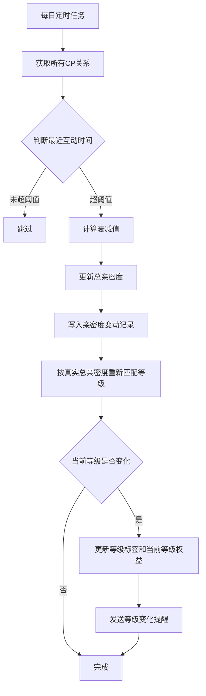

#### 边界规则

| 规则 | 说明 |
|---|---|
| 最低值保护 | 亲密度不得低于等级1最低值（0）|
| 新绑定保护 | 绑定后3天内不触发衰减 |
| 并发处理 | 衰减执行时若发生送礼，以最新状态为准 |

#### 榜单影响

| 数据类型 | 是否受衰减影响 | 说明 |
|---|---|---|
| 总亲密度 | 是 | 等级判断基于此值 |
| 本周贡献值 | 否 | 榜单数据不受影响 |

#### 用户感知

| 触发时机 | 提示内容 |
|---|---|
| 2天无互动 | 「已连续2天未互动，亲密度 即将衰减」 |
| 衰减发生时 | 「亲密度 -XXX（关系冷却中）」 |
| 衰减后 | 「去互动保持关系」 |

---

### 系统提示邀请CP弹窗逻辑

#### 功能背景

在用户高频互动场景下，系统主动提示用户发起CP邀请，提升CP绑定转化率。

#### 适用范围

- 房间内聊天场景
- 私聊聊天场景

#### 触发前置条件（必须全部满足）

| 条件类型 | 具体条件 |
|---|---|
| 用户关系条件 | 双方均未绑定CP |
| 用户关系条件 | 双方未互相拉黑 |
| 用户关系条件 | 双方均未开启「自动拒绝CP邀请」 |
| 用户关系条件 | 双方未存在未处理的CP邀请 |
| 用户状态条件 | 至少一方处于当前会话场景 |
| 用户状态条件 | 对方最近活跃（5分钟内，可配置） |
| 风控条件 | 未命中骚扰限制 |
| 风控条件 | 未在冷却周期内 |

#### 触发行为类型（满足任一）

| 行为类型 | 触发阈值 | 说明 |
|---|---|---|
| 聊天触发 | 连续发送消息 ≥ 5条 | 可配置阈值 |
| 礼物触发 | 向对方送礼 ≥ 1次 | - |
| 综合触发 | T分钟内同时存在聊天+送礼 | 可配置时间窗口 |

**说明：** 所有阈值由后台配置，不写死。

#### 触发时机

| 时机类型 | 说明 |
|---|---|
| 实时触发 | 行为发生后即时判断，满足条件立即弹出 |
| 延迟触发 | 行为结束后延迟3-5秒（可配置）再判断，避免打断用户操作 |

#### 触发优先级

当用户同时满足多个对象的触发条件时，按以下优先级选择展示对象：

| 优先级 | 选择策略 | 说明 |
|---|---|---|
| 第一优先 | 最近互动用户 | 选择最近一次发生互动行为的用户 |
| 第二优先 | 互动强度最高用户 | 当互动时间相近时，选择互动频率或金额更高的用户 |

#### 弹窗展示规则

| 规则项 | 说明 |
|---|---|
| 展示对象 | 仅对「邀请者」展示提示弹窗 |
| 展示内容 | 双方头像 + CP关系icon + 文案提示 + CP权益展示 |
| 文案示例 | 「你们关系不错，可以成为CP」 |

#### 防打扰策略（强制要求）

| 策略类型 | 规则 |
|---|---|
| 用户级频控 | 每个用户每日最多触发 指定数量 次（默认2次） |
| 关系级频控 | 同一对用户24小时内最多触发1次 |
| 冷却机制 | 用户关闭弹窗后，当天不再触发 |
| 不再提示 | 用户勾选后，永久关闭 |
| 高风险用户限制 | 被标记为骚扰用户，不触发该功能 |

#### 用户操作流程

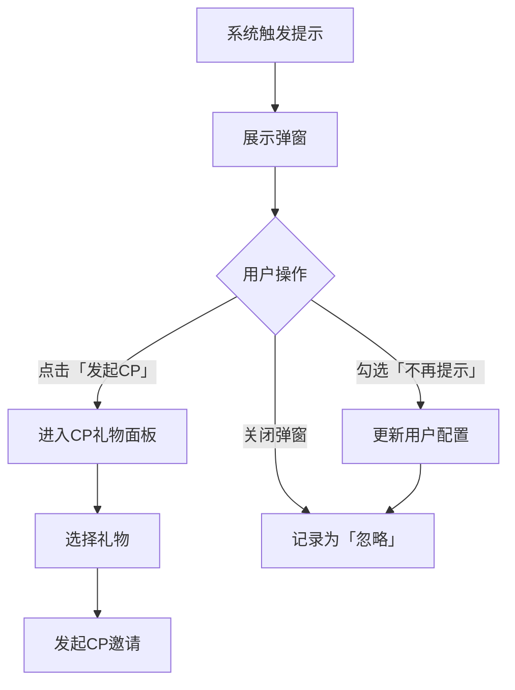

#### 异常处理

| 场景 | 处理方式 |
|---|---|
| 弹窗展示期间任一方已绑定CP | 不允许发起，提示失败原因 |
| 被邀请者离线 | 仍允许发起，延迟触达 |
| 同一用户短时间重复发起 | 拦截或合并 |

#### 运营配置项

| 配置项 | 说明 |
|---|---|
| 触发阈值（聊天次数/礼物） | 控制触发敏感度 |
| 每日触发次数上限 | 控制打扰程度 |
| 冷却时间 | 关闭后多久可再次触发 |
| 文案内容（多语言） | 适配不同区域 |
| 功能开关 | 可全局关闭 |

---

### 汇率换算规则

#### 货币与亲密度换算

| 换算项 | 换算公式 | 说明 |
|---|---|---|
| 金币与美元 | 1 USD = 10,000 金币 | 固定汇率 |
| 普通礼物亲密度 | 1 金币 = 1 亲密度 | 基础换算 |
| CP专属礼物亲密度 | 后台配置（范围1.2~1.5） | 后台配置倍率 |
| 幸运礼物亲密度 | 1 金币 = 0.2 亲密度 | 仅部分计入CP亲密度，用于防刷榜和防异常刷亲密度 |

#### 幸运礼物计入口径

| 规则项 | 说明 |
|---|---|
| 计入比例 | 默认按礼物金币的20%计入亲密度，具体比例以后台配置为准 |
| 计算公式 | 亲密度 = 礼物金币 × 幸运礼物计入比例 |
| 设计目的 | 防止通过幸运礼物刷亲密度 |
| 用户端提示 | 前台统一软表达为“幸运礼物主要用于惊喜玩法，仅部分计入CP亲密度”；20%比例放在规则说明/帮助页，不在送礼强提示中硬怼用户 |

#### 配置管理

| 配置项 | 配置方式 |
|---|---|
| 金币汇率 | 后台全局配置 |
| CP礼物加成倍率 | 礼物级别配置，可针对不同礼物设置不同倍率 |
| 幸运礼物折损系数 | 后台全局配置 |

---

### 冷却机制

#### 解绑冷却期

| 规则项 | 默认值 | 说明 |
|---|---|---|
| 重新绑定限制 | 无固定等待限制 | 解绑后可重新发起/接受CP邀请；不设置固定重绑等待期 |
| 适用范围 | 所有CP关系 | 不限制与原CP或其他用户重新绑定 |
| 设计目的 | 降低关系重建阻力 | 奖励重复领取通过奖励去重规则控制，不通过固定等待期控制 |

#### 邀请冷却期

| 规则项 | 默认值 | 说明 |
|---|---|---|
| 同用户邀请上限 | 每日3次 | 向同一用户每日最多发起3次邀请 |
| 超限处理 | 轻提示提示「今日邀请次数已达上限」 | 不扣费、不创建邀请 |

#### 弹窗冷却期

| 规则项 | 默认值 | 说明 |
|---|---|---|
| 关闭后冷却 | 当天不再触发 | 用户关闭系统提示弹窗后，当天不再展示 |
| 勾选「不再提示」| 永久关闭 | 需用户主动在设置中开启 |


## 业务流程图

以下流程图展示核心业务逻辑的流转路径。


### 一、CP邀请发起流程


**核心规则确认**：
- 邀请前置校验必须全部通过才能继续
- 扣款成功但邀请创建失败必须回滚金币
- 双向匹配时后发起方不二次扣款


### 二、CP邀请状态流转图

#### 状态枚举

CP邀请统一使用以下5种状态：待处理、已接受、已拒绝、已过期、已取消。

#### 状态流转

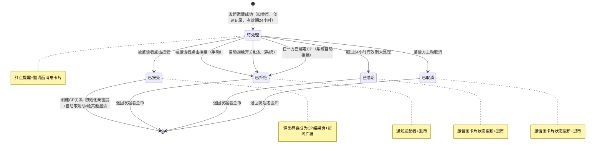

#### 状态约束

| 状态 | 进入条件 | 退出条件 | 退款口径 |
|---|---|---|---|
| 待处理 | 发起邀请成功，扣金币，设置24小时有效期 | 被接受/拒绝/取消/过期 | 不退款 |
| 已接受 | 被邀请者点击接受，校验通过 | 终态，不可逆 | 不退款（金币用于组建CP礼物） |
| 已拒绝 | 手动拒绝或自动拒绝 | 终态，不可逆 | 全额退回发起者 |
| 已过期 | 超过有效期未处理 | 终态，不可逆 | 全额退回发起者 |
| 已取消 | 邀请方主动取消或系统因已绑定自动取消 | 终态，不可逆 | 全额退回发起者 |

#### 关键规则

- 接受某邀请后，系统自动取消已发出的其他CP邀请，并自动拒绝所有待处理的CP邀请，被取消/拒绝的邀请金币全额退回原发起者
- 双方互相发起CP邀请时，后发起方自动接受对方的CP邀请（双向匹配）
- 同一时间仅允许1个Outgoing邀请（单主动邀请原则）
- 可同时接收多个Incoming邀请


### 三、接受CP邀请流程

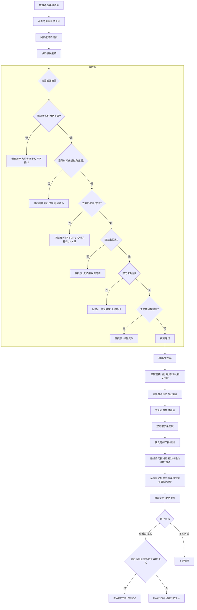

**接受后执行逻辑**：
1. 创建CP关系 → 亲密度初始化为组建CP礼物的亲密度值
2. 更新邀请状态为已接受
3. 发起者增加财富值（1金币=1财富值）
4. 双方增加亲密度（1金币=1.5亲密值）
5. 触发房间广播/飘屏（按组建CP礼物配置决定是否全服飘屏）
6. **系统自动拒绝**已发出的待处理CP邀请 → 原邀请金币全额退回
7. **系统自动拒绝**所有收到的待处理CP邀请 → 原邀请金币全额退回
8. 展示成为CP结果页


### 四、拒绝CP邀请流程

#### 页面定位

拒绝邀请流程承接被邀请者在邀请详情页点击“狠心拒绝”后的二次确认、退币和状态回流，不是一步直接拒绝。

#### 流程图

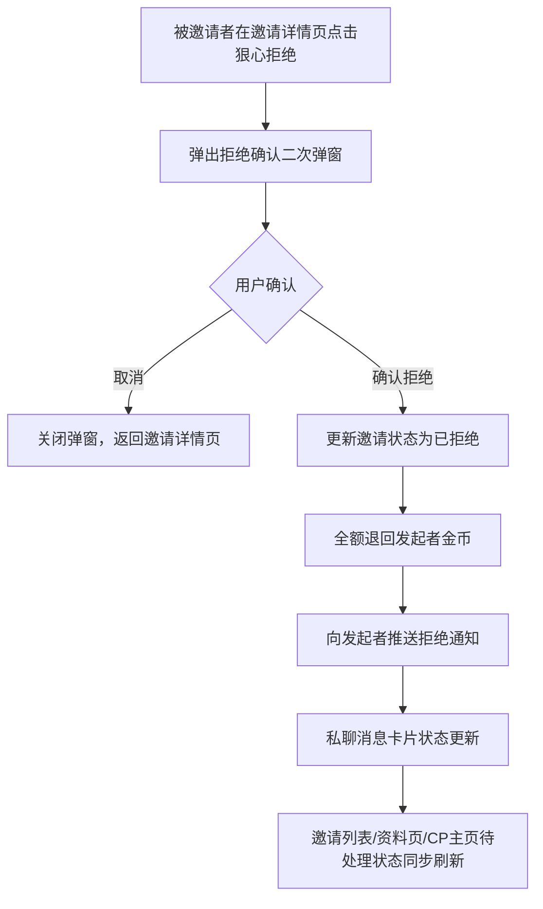

#### 执行逻辑

| 步骤 | 逻辑 |
|---|---|
| 1. 二次确认 | 点击“狠心拒绝”后先弹出确认弹窗，避免误触 |
| 2. 状态更新 | 确认后将邀请状态更新为已拒绝，终态不可逆 |
| 3. 退币 | 全额退回发起者金币，推送退币通知 |
| 4. 通知 | 向发起者推送拒绝结果（私聊消息/系统通知） |
| 5. 状态回流 | 邀请列表、私聊消息卡片、资料页待处理状态同步刷新 |

#### 拒绝原因区分

| 类型 | 说明 |
|---|---|
| 手动拒绝 | 被邀请者主动点击“狠心拒绝”并确认 |
| 系统自动拒绝 | 开启自动拒绝开关后新邀请直接进入已拒绝；或任一方已绑定CP时系统自动拒绝 |

#### 异常与测试关注点

- 覆盖正常拒绝、取消拒绝、邀请已过期后拒绝、重复点击拒绝
- 覆盖退币成功与退币失败补偿
- 覆盖拒绝后发起者侧通知、消息卡片状态、资料页待处理状态同步


### 五、CP解绑流程

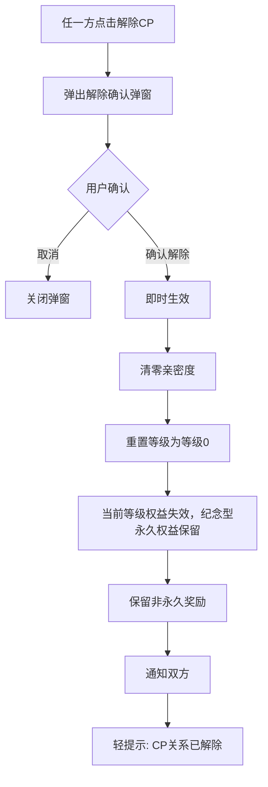

**解绑处理逻辑**：
- 亲密度清零（非保留）
- 榜单本周期贡献值保留至周期结束
- 等级重置为等级0
- 当前等级权益失效；纪念型永久权益和历史荣誉记录保留
- 非永久奖励不回收
- 组建CP礼物不退回
- 可随时重新绑定（无固定等待限制）


### 六、亲密度增加业务总流程

本流程用于统一说明所有会导致 CP 亲密度增加的业务入口，避免“送礼、接受邀请、活动奖励、后台补偿”各写一套口径，最后开发对着文档互相甩锅。

#### 适用入口

| 入口类型 | 是否增加总亲密度 | 是否增加本周期贡献值 | 是否写入亲密度记录 | 说明 |
|---|---|---|---|---|
| 接受 CP 邀请后初始化 | 是 | 是 | 是 | 按组建 CP 礼物的金币与倍率计算，作为关系建立后的初始亲密度 |
| CP 关系内送礼 | 是 | 是 | 是 | 最主要的亲密度增加来源，受每日亲密度上限控制 |
| CP 专属礼物奖励 | 是 | 是 | 是 | 按礼物配置倍率计算，倍率由后台配置决定 |
| 活动奖励补发 | 是 | 按活动规则决定 | 是 | 仅当活动明确奖励亲密度时写入；若只是展示权益，不增加亲密度 |
| 后台人工补偿 | 是 | 默认不计入 | 是 | 用于异常补偿，必须填写原因；默认不影响榜单贡献 |
| 衰减恢复 / 风控修正 | 可能增加 | 否 | 是 | 只修正总亲密度，不追溯影响榜单周期贡献 |

#### 业务流程图

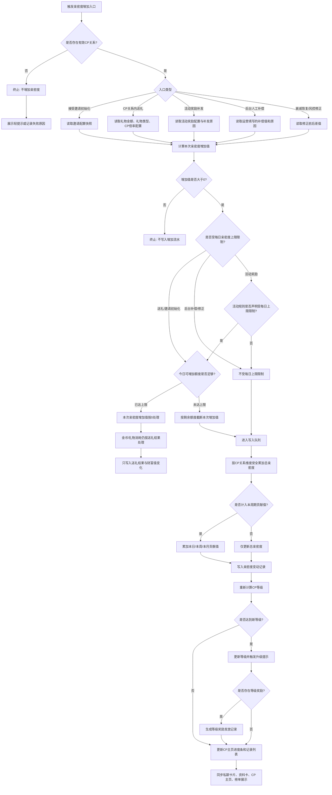

#### 关键业务规则

| 规则项 | 业务规则 | 异常处理 |
|---|---|---|
| CP关系校验 | 只有双方处于有效 CP 关系内，才允许增加关系亲密度 | 关系已解除、已失效、任一方封禁时，不增加亲密度 |
| 入口统一 | 所有增加来源必须统一写入亲密度变动记录 | 不允许只更新总值、不留业务记录 |
| 每日上限 | 送礼和邀请初始化默认受每日亲密度上限控制，按东三区自然日计算 | 达到上限后，礼物消耗和财富值可正常处理，但亲密度不再增加 |
| 周期贡献 | 榜单贡献只统计明确计入周期贡献的增加来源 | 后台补偿、衰减恢复、风控修正默认不影响榜单贡献 |
| 等级联动 | 每次亲密度增加后必须重新计算 CP 等级 | 达到新等级时触发升级提示和奖励发放；未升级只刷新进度 |
| 并发处理 | 多端同时送礼时，按 CP 关系维度顺序写入 | 后到请求必须基于最新亲密度重新计算，避免覆盖 |
| 记录可追溯 | 亲密度记录需展示来源、增加值、时间、操作者或触发用户 | 后台补偿必须填写原因，方便客服解释 |

#### 字段与数据来源

| 字段 | 说明 | 统计或计算方式 | 数据来源 |
|---|---|---|---|
| CP关系 | 当前双方的有效关系 | 读取双方当前唯一有效关系 | CP关系记录 |
| 触发入口 | 本次亲密度增加的来源 | 邀请初始化、送礼、活动奖励、后台补偿、衰减恢复、风控修正 | 业务操作记录 |
| 礼物金额 | 本次送礼或组建 CP 礼物消耗金币 | 按实际成功消耗金币计算 | 钱包流水、礼物配置 |
| 礼物倍率 | 礼物转换亲密度的倍率 | 普通礼物默认1倍；CP专属礼物按后台配置；幸运礼物按规则折算 | CP礼物配置 |
| 本次亲密度增加值 | 本次实际写入的亲密度 | 礼物金额 × 礼物倍率，并受每日上限截断 | 系统计算 |
| 每日剩余额度 | 当天还可增加的亲密度额度 | 每日上限 - 当日已增加亲密度 | 亲密度日统计 |
| 总亲密度 | 当前 CP 关系累计亲密度 | 历史累计增加 - 衰减/扣减 + 修正 | CP关系统计 |
| 周期贡献值 | 当前榜单周期内的贡献 | 仅统计计入周期贡献的亲密度增加来源 | 榜单周期统计 |
| 等级 | 当前 CP 等级 | 按总亲密度匹配等级门槛 | CP等级配置 |
| 亲密度记录 | 用户可查看的亲密度变动明细 | 每次增加、扣减、修正均生成一条记录 | 亲密度流水 |


### 七、CP非送礼亲密度增长方案

CP 亲密度除送礼增长外，新增两类日常互动增长方式：私聊有效互动、同房上麦互动。该能力用于鼓励 CP 双方真实沟通、共同陪伴和房间活跃，但必须有日上限和防刷规则，避免非付费互动把送礼成长体系冲烂。

#### 7.1 增长来源
##### 规则定义
本模块定义 CP 关系在“非送礼场景”下的亲密度增长来源。1.0 版本仅开放两类日常互动增长：私聊有效互动、同房上麦互动。两类增长都属于“日常互动亲密度”，与送礼亲密度并行存在，但不能冲烂送礼主成长体系。

##### 适用范围
| 规则项 | 适用范围 |
|---|---|
| 私聊有效互动增长 | 仅适用于已绑定 CP 关系的双方私聊场景 |
| 同房上麦互动增长 | 仅适用于已绑定 CP 关系的双方处于同一语音房且同时上麦的场景 |
| 送礼亲密度 | 不属于本模块；仅作为并行对照口径 |

##### 口径说明
| 增长方式 | 说明 | 核心目的 | 是否受日常互动总上限控制 | 是否影响送礼亲密度 |
|---|---|---|---|---|
| 私聊有效互动 | CP 双方在私聊中产生双向有效聊天 | 鼓励真实沟通 | 是 | 否 |
| 同房上麦互动 | CP 双方在同一语音房内同时上麦并停留 | 鼓励共同陪伴和房间活跃 | 是 | 否 |

##### 计算公式
- 日常互动总亲密度 = 私聊互动增加值 + 同房上麦增加值（按当日剩余额度截断后）
- 当日日常互动已获得值 = 当日私聊已发放值 + 当日同房已发放值
- 当日剩余额度 = 120 - 当日日常互动已获得值

##### 限制条件
- 私聊和同房属于“日常互动亲密度”，两者合计每日最多增加 120 亲密度。
- 日常互动亲密度计入总亲密度、等级升级和 CP 榜单，但进入榜单的数值同样受日常互动总上限控制。
- 送礼产生的亲密度不受日常互动总上限影响。
- 日常互动亲密度仅在 CP 关系处于有效关系状态时增加；有效关系状态包括已绑定、保护期内、降级后。

##### 状态边界
- 未绑定、邀请中、解除中、已解除状态均不得通过日常互动增加亲密度。
- 降级后仍属于已绑定关系，可继续按当前关系增加日常互动亲密度。
- 解除成功后，历史互动记录仅保留展示和客服追溯作用，不再为旧关系触发成长。

##### 风控规则
- 私聊重复内容、异常高频消息、单方刷屏、系统消息、撤回消息不计入有效互动。
- 同房上麦存在挂机、长时间静音、异常在线、多设备刷时长等行为时，可降权或不计入有效时长。
- 拉黑、封禁、注销、关系已解除后的行为不计入增长。

##### 配置项
| 配置项 | 默认值 | 说明 |
|---|---|---|
| 私聊互动开关 | 开启 | 是否允许私聊增加亲密度 |
| 同房上麦开关 | 开启 | 是否允许同房上麦增加亲密度 |
| 日常互动总上限 | 120 | 私聊 + 同房合计每日上限 |
| 统计时区 | 东三区 | 按中东业务时区统计自然日 |
| 风控开关 | 开启 | 是否启用异常互动过滤 |

#### 7.2 非送礼亲密度增长总流程图
##### 流程目标
定义私聊互动与同房上麦两类非送礼行为，如何在关系状态、风控规则和总上限约束下进入统一增长链路，最终完成亲密度写入、等级重算和前台刷新。

##### 参与角色
| 角色 | 职责 |
|---|---|
| CP 双方用户 | 产生日常互动行为 |
| 系统后台 | 校验关系状态、计算档位、截断上限、写入流水 |
| 榜单/等级模块 | 读取最终生效的亲密度结果 |

##### 触发条件
- 当前存在有效 CP 关系。
- 行为来源为私聊消息或同房上麦。
- 行为未命中风控拦截，且当日日常互动总上限仍有剩余额度。

##### 主流程
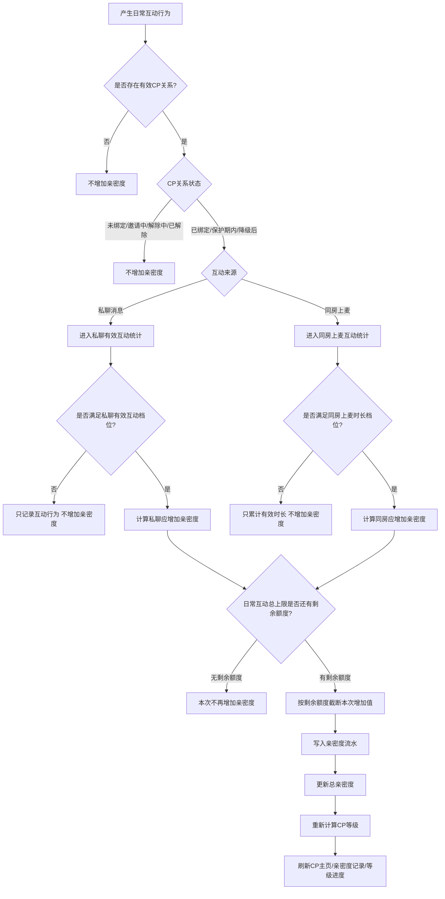

##### 分支流程
- 私聊消息未满足有效互动档位时，仅记录行为，不增加亲密度。
- 同房上麦未达到起算门槛时，仅累计有效时长，不增加亲密度。
- 总上限不足时，按剩余额度截断；无剩余额度时直接结束。

##### 状态流转
| 节点状态 | 进入条件 | 退出条件 |
|---|---|---|
| 待校验 | 产生日常互动行为 | 完成关系状态和来源判断 |
| 可计算 | 命中私聊/同房有效档位 | 进入总上限校验 |
| 已截断 | 剩余额度不足 | 写入实际增加值 |
| 已写入 | 亲密度流水写入成功 | 刷新等级和前台展示 |
| 已拦截 | 关系无效、档位不达标或上限不足 | 结束链路 |

##### 异常分支
- 关系状态已变更为邀请中、解除中或已解除时，整条链路直接终止。
- 风控命中或数据延迟导致有效行为无法确认时，不得先写后回滚。
- 等级重算失败时，不回滚已成功写入的亲密度流水，进入补偿重算任务。

##### 后台处理
- 系统后台统一读取东三区自然日、当前关系状态、当日剩余额度和风控结果。
- 私聊与同房共用同一总上限桶，不按来源拆成两套独立总额度。
- 亲密度流水、等级重算、榜单贡献刷新必须以同一次最终增加值为准。

##### 幂等/补偿
- 同一来源、同一自然日、同一档位重复触发时，只允许按同日最高档位发放一次。
- 晚到补算只允许按服务端有效时间补算，不能突破当日日常互动总上限。

#### 7.3 私聊聊天增加亲密度
##### 规则定义
CP 双方在私聊页面产生双向有效消息后，系统按东三区自然日统计每对 CP 的私聊互动档位，并按当日最高达成档位增加亲密度。

##### 适用范围
- 仅适用于当前有效 CP 关系双方之间的私聊会话。
- 仅统计文本、语音、图片、表情等可计入的有效消息。
- 不适用于系统消息、撤回消息、空消息和关系失效后的聊天行为。

##### 口径说明
| 条件 | 规则 |
|---|---|
| 消息发送方 | 必须为当前 CP 双方之一 |
| 消息接收方 | 必须为当前 CP 对象 |
| 消息类型 | 文本、语音、图片、表情均可计入 |
| 双向要求 | 当日双方都至少发送过有效消息才计入 |
| 防刷要求 | 同一方连续发送多条，仅按有效条数上限计入 |

##### 计算公式
| 私聊互动条件 | 增加亲密度 | 发放规则 |
|---|---|---|
| 双方当日互发有效消息各 ≥ 1 条 | +10 | 每日按最高档位发放一次 |
| 双方当日互发有效消息各 ≥ 3 条 | +30 | 每日按最高档位发放一次 |
| 双方当日互发有效消息各 ≥ 10 条 | +60 | 每日按最高档位发放一次 |

- 同一自然日内，私聊互动只按最高达成档位发放，不叠加。
- 私聊最终发放值 = min(私聊命中档位值, 当日日常互动剩余额度)

##### 限制条件
- 私聊亲密度每日最高 +60。
- 单方有效消息超过对方 3 倍后，超出部分不计入档位判断。
- 重复内容、纯表情刷屏、短时间高频消息不计入有效消息。
- 每日统计口径按东三区自然日重置。

##### 状态边界
- 当日仅有一方发消息、不满足双向互动条件时，不增加亲密度。
- 私聊档位已按更高档发放后，不得因为继续发消息再次发低档或同档奖励。
- 关系解除后，私聊行为不再为旧 CP 关系增加亲密度。

##### 风控规则
- 同一方刷屏、重复文本、异常高频、系统消息、撤回消息均判定为无效消息。
- 多设备异常在线时，以系统后台认定的有效消息状态为准。
- 网络延迟导致的消息晚到，可补算，但不能突破同日最高档位和总上限。

##### 配置项
| 配置项 | 默认值 | 说明 |
|---|---|---|
| 私聊 1 档门槛 | 双方各 1 条 / +10 | 达成后增加 10 亲密度 |
| 私聊 2 档门槛 | 双方各 3 条 / +30 | 达成后增加 30 亲密度 |
| 私聊 3 档门槛 | 双方各 10 条 / +60 | 达成后增加 60 亲密度 |
| 私聊互动开关 | 开启 | 是否允许私聊增加亲密度 |

#### 7.4 同房上麦增加亲密度
##### 规则定义
CP 双方在同一个语音房间内，同时处于上麦状态，并满足有效停留时长后，系统按东三区自然日统计同房上麦累计时长，并按当日最高达成档位增加亲密度。

##### 适用范围
- 仅适用于当前有效 CP 关系双方处于同一房间且同时上麦的场景。
- 仅统计双方同时在线、未断线、未命中挂机规则的有效时长。
- 不适用于单方上麦、不同房间、离房后残留时长冒算等场景。

##### 口径说明
| 条件 | 规则 |
|---|---|
| 房间一致 | 双方必须在同一个房间 |
| 麦位状态 | 双方都处于上麦状态 |
| 同时在线 | 双方同时在线且未断线 |
| 有效时长 | 连续或累计满足门槛 |
| 防挂机 | 长时间静音、无互动、异常停留需降权或不计入 |

##### 计算公式
| 当日同房上麦累计时长 | 增加亲密度 | 发放规则 |
|---|---|---|
| 满 10 分钟 | +20 | 每日按最高档位发放一次 |
| 满 30 分钟 | +50 | 每日按最高档位发放一次 |
| 满 60 分钟 | +100 | 每日按最高档位发放一次 |

- 同房上麦最终发放值 = min(同房命中档位值, 当日日常互动剩余额度)
- 同房上麦同日按最高达成档位发放，不叠加。

##### 限制条件
- 同房上麦亲密度每日最高 +100。
- 累计满 10 分钟才开始计入。
- 离房或下麦后保留当日已累计有效时长；跨日按东三区自然日重新切分。
- 多房间切换时，只统计双方同时在同一房间的上麦时长。

##### 状态边界
- 双方仅同房但并未同时上麦时，不增加亲密度。
- 双方同房上麦未满 10 分钟时，不触发增长。
- 同房档位已按更高档发放后，不得再次按低档或同档重复发放。

##### 风控规则
- 长时间静音、无互动、异常在线、多设备挂机可降权或不计入。
- 服务端必须识别断线重连与真实停留，不得把异常保活当成有效陪伴时长。
- 风控剔除只影响本次可发放时长，不回写篡改历史已生效流水。

##### 配置项
| 配置项 | 默认值 | 说明 |
|---|---|---|
| 同房 1 档门槛 | 10 分钟 / +20 | 达成后增加 20 亲密度 |
| 同房 2 档门槛 | 30 分钟 / +50 | 达成后增加 50 亲密度 |
| 同房 3 档门槛 | 60 分钟 / +100 | 达成后增加 100 亲密度 |
| 同房上麦开关 | 开启 | 是否允许同房上麦增加亲密度 |

#### 7.5 每日总上限
##### 规则定义
为防止非付费互动冲击送礼成长体系，私聊互动与同房上麦共用一套“日常互动总上限”。系统必须先确认当日剩余额度，再决定本次日常互动能够写入多少亲密度。

##### 适用范围
- 仅适用于私聊互动、同房上麦两类日常互动来源。
- 不适用于送礼亲密度、系统补偿亲密度或人工修正亲密度。

##### 口径说明
| 来源 | 每日上限 |
|---|---|
| 私聊聊天 | +60 |
| 同房上麦 | +100 |
| 日常互动总上限 | +120 |

##### 计算公式
- 当日剩余额度 = 120 - 当日日常互动已获得值
- 本次实际增加值 = min(本次档位应增加值, 当日剩余额度)
- 当日剩余额度 ≤ 0 时，本次实际增加值 = 0

##### 限制条件
- 私聊 + 同房合计每日最多 +120。
- 如果私聊已获得 +60，同房最多再获得 +60。
- 如果同房已获得 +100，私聊最多再获得 +20。
- 送礼亲密度不受该总上限影响。

##### 状态边界
- 两个来源在同一自然日内先后达成时，按系统后台记录的达成时间顺序占用剩余额度。
- 如果两个来源在同一秒内同时达到档位，按先写入成功的亲密度流水占用额度，后写入来源按剩余额度截断。
- 当日剩余额度为 0 时，只允许记录行为，不得再写亲密度增长。

##### 风控规则
- 异常并发写入不得突破 +120 的总上限。
- 晚到补算、跨端重试、消息延迟补发都必须受同一个上限桶约束。

##### 配置项
| 配置项 | 默认值 | 说明 |
|---|---|---|
| 日常互动总上限 | 120 | 私聊 + 同房合计每日上限 |
| 统计时区 | 东三区 | 按中东业务时区重置 |

#### 7.6 推荐最终规则
##### 规则定义
本模块是产品和研发都能直接引用的“最终收口规则表”，用于把私聊互动、同房上麦和总上限的最终执行口径压成一张表，避免多个子规则理解漂移。

##### 适用范围
- 适用于产品文档正文、研发实现、测试验收、客服解释。
- 作为 7.3 / 7.4 / 7.5 的汇总结果，不单独引入新口径。

##### 口径说明
| 互动类型 | 门槛 | 亲密度 | 发放规则 |
|---|---|---|---|
| 私聊双向各 ≥ 1 条 | 每日一次 | +10 | 私聊按最高档位发放 |
| 私聊双向各 ≥ 3 条 | 每日一次 | +30 | 私聊按最高档位发放 |
| 私聊双向各 ≥ 10 条 | 每日一次 | +60 | 私聊按最高档位发放 |
| 同房双方上麦满 10 分钟 | 每日一次 | +20 | 同房按最高档位发放 |
| 同房双方上麦满 30 分钟 | 每日一次 | +50 | 同房按最高档位发放 |
| 同房双方上麦满 60 分钟 | 每日一次 | +100 | 同房按最高档位发放 |
| 日常互动总上限 | 私聊 + 同房合计 | +120 | 不影响送礼亲密度 |

##### 计算公式
- 私聊发放值 = min(命中私聊最高档位值, 当日剩余额度)
- 同房发放值 = min(命中同房最高档位值, 当日剩余额度)
- 实际日常互动总值 ≤ 120

##### 限制条件
- 同一来源同日只按最高档发放一次，不叠加。
- 不允许用“多次命中低档 + 一次命中高档”的方式重复累加。

##### 状态边界
- 仅对已绑定 CP 关系有效。
- 解除、邀请中、未绑定状态不适用。

##### 风控规则
- 重复消息、挂机上麦、异常多端行为都不应绕过该最终规则表。

##### 配置项
- 私聊档位配置
- 同房档位配置
- 总上限配置
- 东三区自然日配置

#### 7.7 防刷规则
##### 规则定义
本模块定义私聊互动和同房上麦两类日常互动的防刷过滤条件，目标是保证“真实互动增加亲密度”，而不是让用户用低成本脚本、挂机和重复行为薅成长值。

##### 适用范围
- 适用于 7.3 私聊互动、7.4 同房上麦、7.5 总上限占用链路。
- 不适用于送礼支付本身的风控，但可影响送礼是否计入榜单与成长值。

##### 口径说明
| 风控点 | 规则 |
|---|---|
| 重复消息 | 连续重复内容不计入有效消息 |
| 高频消息 | 短时间异常高频发送不计入 |
| 单方刷屏 | 单方消息量超过对方 3 倍后，超出部分不计入 |
| 挂机上麦 | 长时间静音、无互动、异常在线可不计入 |
| 多设备异常 | 同一用户多端异常在线，以系统后台有效状态为准 |
| 黑名单状态 | 拉黑、封禁、注销、关系已解除后不计入 |
| 补算规则 | 网络延迟导致记录延迟时，可按系统后台时间补算 |

##### 计算公式
- 有效消息数 = 原始消息数 - 风控剔除消息数
- 有效上麦时长 = 原始上麦时长 - 风控剔除时长
- 最终可发放值 = min(档位值, 总上限剩余额度)，前提是风控校验通过

##### 限制条件
- 风控剔除优先于档位判断。
- 同一条消息或同一段时长被判定无效后，不得在补算时再次计入。

##### 状态边界
- 风控命中后，该行为仅可保留审计记录，不进入成长值发放。
- 解除关系、封禁、拉黑状态发生在行为之后但写入之前时，以写入时的最终状态拦截。

##### 风控规则
- 用户频繁解绑/重绑不设置固定等待期，但异常行为应进入风控限制。
- 小号互刷、脚本刷消息、挂机刷时长必须可被风控系统监测并拦截。

##### 配置项
| 配置项 | 默认值 | 说明 |
|---|---|---|
| 高频消息阈值 | 后台配置 | 触发风控的最小阈值 |
| 单方刷屏倍数 | 3 倍 | 单方超出后不再计入 |
| 挂机识别规则 | 开启 | 是否启用异常在线过滤 |
| 风控开关 | 开启 | 是否启用日常互动防刷 |

#### 7.8 关系状态边界
##### 规则定义
本模块定义不同 CP 关系状态下，日常互动亲密度是否允许继续增加，避免邀请中、解除中、已解除等边界状态继续为旧关系写成长值。

##### 适用范围
- 适用于私聊互动、同房上麦、榜单贡献和等级成长的关系状态判断。
- 适用于所有依赖“当前有效 CP 关系”的成长链路。

##### 口径说明
| CP状态 | 是否增加日常互动亲密度 | 说明 |
|---|---|---|
| 未绑定 | 否 | 不存在有效 CP 关系 |
| 邀请中 | 否 | 尚未建立 CP 关系 |
| 已绑定 | 是 | 正常增加 |
| 保护期内 | 是 | 仍视为有效已绑定关系，保护期内可继续增加 |
| 解除中 | 否 | 已进入解除处理，不继续为旧关系增加 |
| 已解除 | 否 | 解除成功后不再为原关系增加 |
| 降级后 | 是 | 仍视为有效已绑定关系，按当前等级继续增加 |

- 保护期内、降级后均属于已绑定关系下的有效子状态，不单独视为解除或失效。

##### 计算公式
- 可增长条件 = 当前关系状态 ∈ {已绑定, 保护期内, 降级后}
- 不可增长条件 = 当前关系状态 ∈ {未绑定, 邀请中, 解除中, 已解除}

##### 限制条件
- 解除成功后，私聊和同房都不能继续给旧 CP 关系增加亲密度。
- 历史互动记录只用于展示和客服查询，不再触发旧关系成长。

##### 状态边界
- 降级只是等级变化，不改变“已绑定关系”本身，因此仍可增长。
- 解除中一旦进入处理，不允许继续按旧关系累计新成长值。

##### 风控规则
- 如果状态切换与行为写入并发发生，以服务端最终确认的关系状态为准。
- 客户端缓存状态不得覆盖服务端实时状态。

##### 配置项
- 关系状态枚举定义
- 解除流程终态定义
- 降级后是否保留已绑定状态定义

#### 7.9 亲密度流水记录
##### 规则定义
每次日常互动增加亲密度，都必须写入亲密度记录页和服务端亲密度流水，用于前台展示、客服追溯、等级校验和榜单回放。

##### 适用范围
- 适用于私聊互动、同房上麦、送礼增长、衰减扣减、人工修正等所有亲密度变动来源。
- 本模块重点约束 7.x 日常互动增长的记录方式。

##### 口径说明
| 字段 | 示例 | 说明 |
|---|---|---|
| 记录来源 | 私聊互动 / 同房上麦 | 展示本次亲密度来源 |
| 增加值 | +30 | 本次实际增加值，可能受总上限截断 |
| 发生时间 | 2026-xx-xx xx:xx | 按东三区时间展示 |
| 触发说明 | 双方当日互发消息各 ≥ 3 条 | 说明本次达成的档位 |
| CP关系编号 | 当前有效 CP 关系 | 用于追溯是哪段关系产生的亲密度 |
| 是否计入升级 | 是 | 日常互动亲密度默认计入等级升级 |
| 是否计入榜单 | 是 | 日常互动亲密度计入 CP 榜单，但每日进入榜单的非送礼数值不得超过总上限 |

##### 计算公式
- 记录增加值 = 本次实际发放值
- 本次实际发放值 = min(命中档位值, 总上限剩余额度)
- 展示时间 = 服务端写入时间按东三区转换后的结果

##### 限制条件
- 记录页展示文案必须与实际发放档位一致，不能展示理论档位值而忽略上限截断。
- 同一条已落库流水不得因前台关闭弹层或刷新页面丢失。

##### 状态边界
- 解除后旧关系流水仍保留，但不得再继续写新增长记录。
- 衰减记录只影响总亲密度，不改变历史周期贡献值展示口径。

##### 风控规则
- 被风控判定为无效的互动行为不写成长值流水，但可保留审计型行为日志。
- 晚到补算写入时必须与原始行为时间、关系编号、来源类型一一对应，避免跨关系串流水。

##### 配置项
- 记录来源枚举
- 触发说明文案模板
- 东三区展示时区
- 是否展示榜单计入口径

#### 7.10 后台配置项
##### 规则定义
后台需增加“日常互动亲密度配置”，用于控制开关、档位、上限、时区和风控策略，且配置修改必须具备生效策略、操作日志和版本追溯能力。

##### 适用范围
- 适用于私聊互动、同房上麦、总上限和风控规则的后台配置。
- 适用于运营修改后次日生效或即时停用的控制链路。

##### 口径说明
| 配置项 | 默认值 | 说明 |
|---|---|---|
| 私聊互动开关 | 开启 | 是否允许私聊增加亲密度 |
| 私聊 1 档门槛 | 双方各 1 条 / +10 | 达成后增加 10 亲密度 |
| 私聊 2 档门槛 | 双方各 3 条 / +30 | 达成后增加 30 亲密度 |
| 私聊 3 档门槛 | 双方各 10 条 / +60 | 达成后增加 60 亲密度 |
| 同房上麦开关 | 开启 | 是否允许同房上麦增加亲密度 |
| 同房 1 档门槛 | 10 分钟 / +20 | 达成后增加 20 亲密度 |
| 同房 2 档门槛 | 30 分钟 / +50 | 达成后增加 50 亲密度 |
| 同房 3 档门槛 | 60 分钟 / +100 | 达成后增加 100 亲密度 |
| 日常互动总上限 | 120 | 私聊 + 同房合计每日上限 |
| 统计时区 | 东三区 | 按中东业务时区统计自然日 |
| 风控开关 | 开启 | 是否启用异常互动过滤 |

##### 计算公式
- 次日生效场景：新规则作用于下一个东三区自然日开始后的新行为
- 即时停用场景：关闭后新产生的互动不再增加亲密度，关闭前已发放记录保留

##### 限制条件
- 当天已发放的私聊/同房亲密度不追溯重算。
- 配置修改必须记录操作人、修改前配置、修改后配置和生效日期。

##### 状态边界
- 关闭私聊/同房开关后，新行为立即停发；历史已写流水不回滚。
- 修改总上限只影响后续可发放链路，不倒改当日已成功落库值。

##### 风控规则
- 风控开关关闭只意味着不再做异常过滤，不代表可以突破总上限和关系状态边界。
- 配置切换过程中必须避免读到“半套旧规则 + 半套新规则”的中间态。

##### 配置项
- 私聊档位配置
- 同房档位配置
- 总上限配置
- 风控开关配置
- 生效日期与操作日志配置

#### 7.11 可直接写入产品说明的规则摘要
##### 规则定义
本模块是对 7.1~7.10 的产品文案级收口，用于直接落到正式 PRD、对外口径稿或说明页文案中。它不是新的规则源，而是已经确认规则的压缩表达。

##### 适用范围
- 正式产品说明
- 规则说明页文案
- 研发、测试、客服统一理解口径

##### 口径说明
CP 亲密度除送礼增长外，支持通过日常互动增长。日常互动包括私聊双向聊天和同房上麦陪伴。系统按东三区自然日统计每对 CP 的有效互动行为，并按达成档位增加亲密度。私聊聊天每日最高增加 60 亲密度，同房上麦每日最高增加 100 亲密度，私聊与同房合计每日最高增加 120 亲密度。送礼产生的亲密度不受日常互动上限影响。

私聊互动要求双方当日均发送有效消息，单方刷屏、重复内容、系统消息、撤回消息不计入。双方各发送 1 条、3 条、10 条有效消息时，分别可获得 10、30、60 亲密度，同日按最高档位发放一次。

同房上麦要求双方同时在同一房间处于上麦状态。双方当日累计同房上麦满 10 分钟、30 分钟、60 分钟时，分别可获得 20、50、100 亲密度，同日按最高档位发放一次。

日常互动亲密度仅在 CP 关系为已绑定、保护期内或降级后状态时增加。CP 关系解除后，不再继续为原关系增加亲密度。所有日常互动增长均写入亲密度流水，并在亲密度记录页展示来源、增加值、触发说明和发生时间。

##### 计算公式
- 私聊或同房的单次实际发放值 = min(命中档位值, 当日日常互动剩余额度)
- 当日日常互动累计值 ≤ 120

##### 限制条件
- 同一来源同日只按最高档发放一次，不叠加。
- 解除后不再继续为原关系增加亲密度。

##### 状态边界
- 仅对有效 CP 关系生效。
- 未绑定、邀请中、解除中、已解除状态不适用。

##### 风控规则
- 重复消息、挂机上麦、多设备异常和小号互刷行为不计入有效增长。

##### 配置项
- 私聊档位配置
- 同房档位配置
- 总上限配置
- 东三区时区配置
- 风控过滤配置


### 八、邀请闭环、关系维护与配置生效流程

#### 8.1 CP邀请闭环流程
##### 流程目标
定义从“入口承接”到“邀请创建”、再到“接受 / 拒绝 / 过期 / 取消”终态收口的完整邀请闭环，确保金币扣减、邀请状态、关系建立和旧邀请失效口径一致。

##### 参与角色
| 角色 | 职责 |
|---|---|
| 邀请者 | 发起 CP 邀请、支付组建礼物 |
| 被邀请者 | 接收并处理邀请 |
| 系统后台 | 创建邀请记录、管理终态、同步退币与通知 |

##### 触发条件
- 邀请者从礼物面板、资料页或系统提示进入邀请链路。
- 当前存在可用组建礼物，且双方满足邀请条件。

##### 主流程
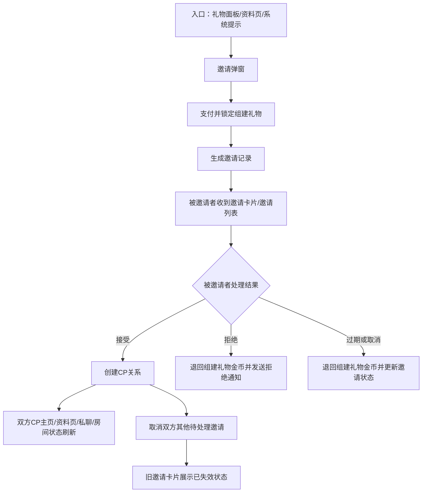

##### 分支流程
- 拒绝时：邀请进入已拒绝终态，触发退币和结果通知。
- 过期 / 取消时：邀请进入终态，触发退币并刷新邀请入口状态。
- 接受后：自动取消双方其他待处理邀请，防止旧邀请继续被处理。

##### 状态流转
| 邀请状态 | 进入条件 | 退出条件 |
|---|---|---|
| 待处理 | 邀请创建成功 | 被接受 / 被拒绝 / 过期 / 取消 |
| 已接受 | 被邀请者点击接受并校验通过 | 终态 |
| 已拒绝 | 被邀请者拒绝 | 终态 |
| 已过期 | 倒计时结束未处理 | 终态 |
| 已取消 | 发起者取消邀请 | 终态 |
| 已失效 | 因对方已建立 CP 等原因自动作废 | 终态 |

##### 异常分支
- 旧邀请卡片再次打开时，必须读取最新状态，展示“邀请已失效 / 对方已建立CP / 当前不可处理”等结果态。
- 支付成功但邀请创建失败时，金币扣减与邀请创建必须整体回滚。
- 退币失败时，不回退终态，进入退款补偿任务。

##### 后台处理
- 邀请记录必须保存礼物快照、价格快照、来源场景、有效期和状态。
- 拒绝、过期、取消导致的退币，通过钱包记录和系统消息同步告知原付款方。
- 接受成功后，系统必须同步刷新主页、资料卡、私聊和房间关系展示。

##### 幂等/补偿
- 同一邀请只允许处理一次；接受、拒绝、过期、取消均为终态。
- 并发处理时，以邀请记录和被邀请者维度做幂等锁，防止同一邀请多次生效。

#### 8.2 CP关系维护、衰减与等级变更流程
##### 流程目标
定义 CP 关系在“正常维护增长”和“长期未互动衰减”两条路径下，如何统一落到等级变化、权益刷新和系统通知链路。

##### 参与角色
| 角色 | 职责 |
|---|---|
| CP 双方用户 | 通过送礼或互动维护关系 |
| 系统后台 | 计算亲密度、执行衰减、重算等级、刷新权益 |
| 系统消息模块 | 承接升级、降级和维护提醒通知 |

##### 触发条件
- 送礼或有效互动导致亲密度增加。
- 或长期未有效互动，达到衰减任务执行条件。

##### 主流程
```mermaid
flowchart TD
    A[送礼/有效互动] --> B[增加亲密度]
    B --> C[匹配CP等级]
    C --> D{是否升级}
    D -->|是| E[更新等级和权益]
    E --> F[展示升级奖励弹窗]
    D -->|否| G[保持当前等级]

    H[长期未有效互动] --> I[衰减任务按东三区时间执行]
    I --> J[扣减总亲密度]
    J --> K{是否低于当前等级阈值}
    K -->|否| L[仅刷新亲密度展示]
    K -->|是| M[按衰减后真实总亲密度重新匹配等级]
    M --> N[更新当前等级标签和当前等级权益]
    N --> O[通过系统消息通知等级变化]
    O --> P[引导双方去互动提升关系]
```

##### 分支流程
- 升级分支：亲密度增加后命中新等级，刷新权益并推送升级承接。
- 维持分支：亲密度增加但未升级，仅刷新进度。
- 衰减分支：长期未维护时执行衰减；如跌破当前等级阈值，立即重算等级。

##### 状态流转
| 关系成长状态 | 进入条件 | 退出条件 |
|---|---|---|
| 正常维护中 | 发生有效送礼或互动 | 升级 / 维持当前等级 |
| 衰减待执行 | 达到长期未互动阈值 | 执行衰减任务 |
| 已升级 | 新等级高于旧等级 | 权益刷新完成 |
| 已降级 | 衰减后低于当前等级阈值 | 通知完成并刷新展示 |

##### 异常分支
- 衰减提醒不单独新增动态页面，以静态规则说明 + 系统消息承接。
- 等级变化通知失败不回滚等级结果，进入通知补偿任务。
- 权益刷新失败时，不回退已重算等级，必须进入修复任务。

##### 后台处理
- 不设置降级缓冲期；衰减写入后如低于当前等级阈值，立即按真实总亲密度重新匹配等级。
- 系统消息必须包含触发原因、当前等级变化、用户可执行动作和点击落点。
- 成长值、等级、权益和通知读取同一份最终关系快照。

##### 幂等/补偿
- 同一衰减周期只允许执行一次衰减任务。
- 晚到互动若发生在衰减前有效窗口内，必须按服务端行为时间参与重算，避免先降后补的顺序错误。

#### 8.3 CP榜单结算与奖励发放流程
##### 流程目标
定义日榜、周榜在周期结束后的快照锁定、奖励资格计算、发奖和补发逻辑，并明确总榜仅做当前实时排序展示，确保榜单历史、奖励发放和客服追溯读取同一份最终数据。

##### 参与角色
| 角色 | 职责 |
|---|---|
| CP 关系双方 | 作为榜单统计对象和奖励接收对象 |
| 榜单结算任务 | 生成快照、计算资格、触发发奖 |
| 资产/通知系统 | 发放奖励并推送结果 |

##### 触发条件
- 日榜 / 周榜达到周期结束时点。
- 当前榜单奖励配置已发布且可用。

##### 主流程
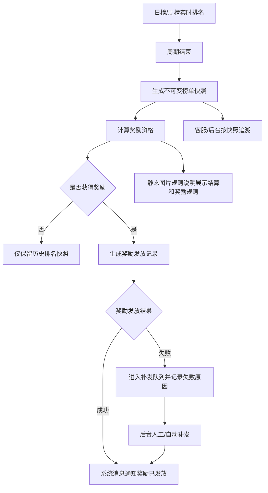

##### 分支流程
- 未获奖：仅保留历史排名快照，不生成发奖流水。
- 获奖成功：写入奖励发放记录并推送通知。
- 发放失败：进入补发队列，补发成功后再推送结果。

##### 状态流转
| 结算状态 | 进入条件 | 退出条件 |
|---|---|---|
| 待结算 | 周期结束 | 快照生成成功 |
| 已快照 | 不可变快照生成完成 | 奖励资格计算完成 |
| 已发奖 | 奖励发放成功 | 通知完成 |
| 补发处理中 | 发奖或通知失败 | 补发成功或人工终结 |

##### 异常分支
- 奖励领取不单独新增动态领取页，以静态规则说明承接奖励规则。
- 发放失败不回滚榜单快照和排名结果。
- 通知失败不影响奖励到账结果，进入通知补偿任务。

##### 后台处理
- 奖励实际发放必须有服务端发放记录，字段至少包含榜单周期、榜单类型、CP关系、排名、奖励内容、发放状态、发放时间、失败原因。
- 日榜、周榜周期结束后生成不可变快照，历史榜单、奖励发放、客服追溯均读取同一份快照，不受后续亲密度变化影响；总榜读取当前实时排序结果。
- 客服和后台查询不得直接用实时榜单替代历史快照结果。

##### 幂等/补偿
- 同一榜单周期 + 榜单类型 + CP关系 + 奖励项只能发放一次。
- 补发任务必须复用原发奖记录，禁止新建第二份独立奖励结果。

#### 8.4 CP解除关系闭环流程
##### 流程目标
定义 CP 关系从用户发起解除到终态落库、权益失效、通知回流和历史记录保留的完整闭环，避免“关系已解除但展示仍像当前 CP”这种断链。

##### 参与角色
| 角色 | 职责 |
|---|---|
| 发起解除方 | 发起解除关系 |
| 被解除方 | 接收解除结果通知 |
| 系统后台 | 写入终态、失效权益、刷新展示、保留历史记录 |

##### 触发条件
- 用户从 CP设置页或 CP主页发起解除关系。
- 当前关系为可解除的有效 CP 关系。

##### 主流程
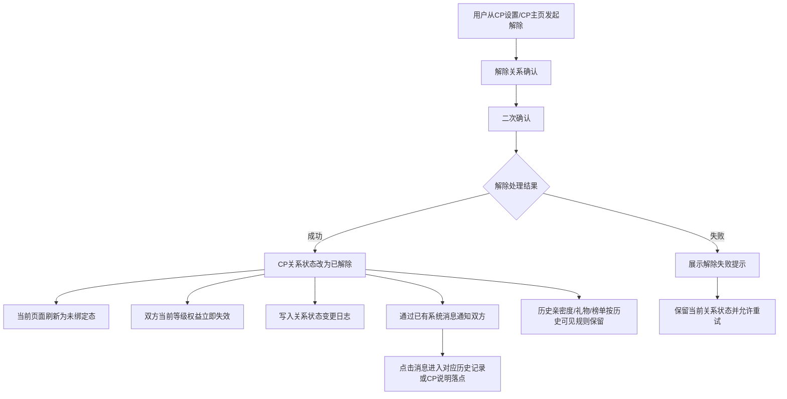

##### 分支流程
- 成功分支：关系改为已解除，刷新前台到未绑定态，并失效当前等级权益。
- 失败分支：提示解除失败，保留当前关系状态并允许重试。

##### 状态流转
| 关系状态 | 进入条件 | 退出条件 |
|---|---|---|
| 可解除 | 当前存在有效 CP 关系 | 用户确认解除 |
| 解除处理中 | 已提交解除请求 | 成功 / 失败 |
| 已解除 | 解除落库成功 | 终态 |
| 解除失败 | 解除执行失败 | 允许重试 |

##### 异常分支
- 解除成功不单独新增动态页面，默认落到 CP主页未绑定态或当前页面未绑定态。
- 通知发送失败不回滚解除结果，必须进入通知补偿任务。
- 权益失效失败不得恢复关系状态，必须走补偿修复。

##### 后台处理
- 双方解除通知通过已有系统消息推送，消息文案需明确“关系已解除、当前权益已失效、历史记录入口”。
- 解除后历史可见范围必须按历史记录规则处理，不得继续展示为当前 CP 关系。
- 榜单、礼物、亲密度历史记录保留，但不再为旧关系继续增长。

##### 幂等/补偿
- 同一关系解除操作必须按关系ID幂等处理，重复点击只能返回同一最终结果。
- 若前台多端同时发起解除，以首个成功结果为准，其他请求刷新终态。

#### 8.5 后台配置发布、生效与历史快照流程
##### 流程目标
统一后台保存、发布、生效、影响评估和历史快照保留逻辑，确保等级、邀请、礼物、榜单等配置模块按同一发布机制运行，不让“草稿配置误伤前台”这种破事发生。

##### 参与角色
| 角色 | 职责 |
|---|---|
| 运营 | 新增 / 编辑 / 发布配置 |
| 系统后台 | 做字段校验、生成版本、控制生效范围 |
| 前台业务模块 | 仅读取已发布版本 |

##### 触发条件
- 后台新增或编辑配置。
- 运营点击发布，进入发布确认链路。

##### 主流程
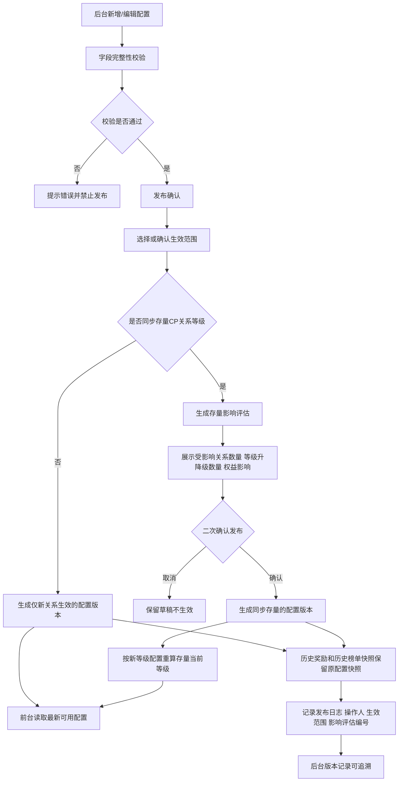

##### 分支流程
- 校验失败：禁止发布，提示失败字段和原因。
- 仅新关系生效：生成新版本，但不影响存量当前等级。
- 同步存量生效：先出影响评估，再二次确认后重算存量当前等级。

##### 状态流转
| 配置状态 | 进入条件 | 退出条件 |
|---|---|---|
| 草稿 | 保存未发布 | 发布成功 / 删除 |
| 待发布 | 校验通过待确认 | 发布成功 / 取消 |
| 已生效 | 发布成功 | 下线或被新版本替换 |
| 已停用 | 主动下线 | 终态 |

##### 异常分支
- 保存不等于生效，必须区分保存、发布、生效三个动作。
- 影响评估失败或数据不完整时，不允许同步存量发布。
- 历史奖励、历史榜单快照不追溯重算。

##### 后台处理
- 发布确认中必须展示：生效时间、生效对象、是否影响历史数据、是否生成新版本、是否支持回滚。
- 前台静态规则说明应读取已发布配置对应的规则文案，不得展示草稿配置。
- 发布日志必须可追溯操作人、生效范围和影响评估编号。

##### 幂等/补偿
- 同一配置版本只能成功发布一次，重复点击发布必须返回同一结果。
- 发布成功后若通知或缓存刷新失败，不回滚已生效版本，走缓存 / 通知补偿任务。

### 九、礼物链路、奖励与后台生效流程

#### 9.1 礼物入口与可送礼物筛选流程
##### 流程目标
定义用户打开礼物面板后，系统如何依据“是否已有 CP 关系、关系是否有效、当前等级是否满足门槛”筛选可送礼物，避免未绑定时混出经营礼物、已绑定时混出无效礼物。

##### 参与角色
| 角色 | 职责 |
|---|---|
| 用户 | 打开礼物面板并选择礼物 |
| 系统后台 | 判断关系状态、读取等级与礼物配置、返回可送礼物集合 |

##### 触发条件
- 用户打开礼物面板。
- 当前存在礼物配置，且 CP 功能已对用户开放。

##### 主流程
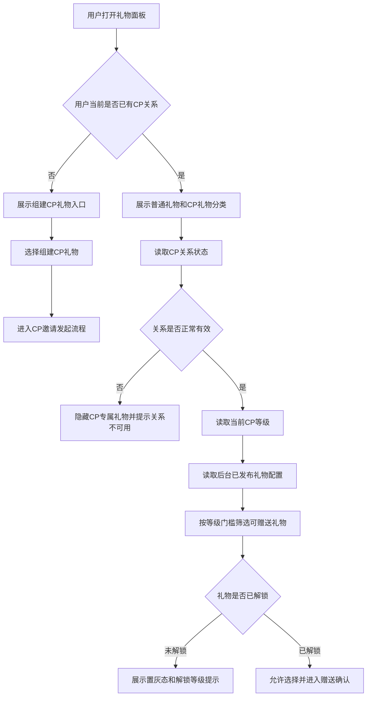

##### 分支流程
- 未绑定 CP：优先展示组建 CP 礼物和组建引导。
- 已绑定 CP：展示 CP 专属礼物、超级礼物、惊喜礼物等经营类内容。
- 未解锁礼物：允许展示置灰态，但点击只展示解锁条件，不得直接扣费。

##### 状态流转
| 礼物面板状态 | 进入条件 | 退出条件 |
|---|---|---|
| 未绑定引导态 | 当前无有效 CP 关系 | 进入邀请发起流程 |
| 已绑定经营态 | 当前存在有效 CP 关系 | 进入送礼确认 |
| 未解锁态 | 礼物等级门槛未满足 | 提示后返回面板 |
| 不可用态 | 关系无效或礼物下架 | 阻断送礼 |

##### 异常分支
- 奖励说明弹层关闭后，用户必须回到当前礼物面板状态，不得丢分类上下文。
- 草稿配置不得影响前台礼物面板；只有已发布版本可见。
- 关系状态变化或礼物配置失效时，必须在确认前重新校验。

##### 后台处理
- 礼物配置必须读取后台已发布版本。
- 筛选规则必须同时受关系状态、礼物状态、等级门槛和风控限制约束。
- 面板内分类切换只切换礼物面板内容，不跳出当前礼物面板。

##### 幂等/补偿
- 该流程本身不产生资产结果，但每次进入赠送确认前都必须读取最新可送集合，避免客户端缓存导致误送。

#### 9.2 组建CP礼物支付、邀请与生效流程
##### 流程目标
定义组建 CP 礼物从扣金币、创建邀请，到关系建立、生效写入亲密度和财富值，再到拒绝 / 过期 / 取消时退币的完整礼物闭环。

##### 参与角色
| 角色 | 职责 |
|---|---|
| 邀请者 | 选择组建礼物并支付 |
| 被邀请者 | 处理邀请 |
| 系统后台 | 创建邀请、写入快照、生效亲密度与财富值、处理退币 |

##### 触发条件
- 用户选择了组建 CP 礼物。
- 双方满足邀请条件，且金币余额充足。

##### 主流程
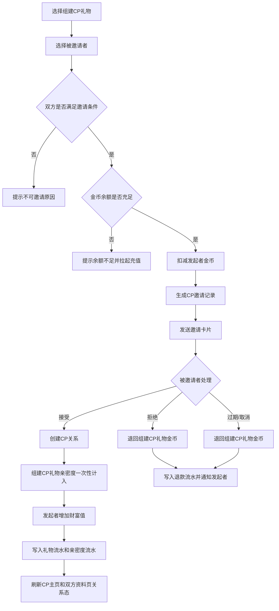

##### 分支流程
- 接受：建立 CP 关系，一次性计入亲密度和财富值，并发放结成奖励和特效。
- 拒绝 / 过期 / 取消：退回组建礼物金币，刷新邀请状态并通知发起者。

##### 状态流转
| 礼物邀请状态 | 进入条件 | 退出条件 |
|---|---|---|
| 待支付 | 选择组建礼物后 | 扣费成功 / 失败 |
| 待处理 | 邀请创建成功 | 接受 / 拒绝 / 过期 / 取消 |
| 已生效 | 邀请被接受且关系建立成功 | 终态 |
| 已退款 | 邀请拒绝 / 过期 / 取消后退币成功 | 终态 |
| 退款补偿中 | 退币失败 | 补偿成功或人工终结 |

##### 异常分支
- 组建 CP 礼物在邀请发起时扣金币，但只有邀请被接受、CP关系正式建立时，才一次性计入亲密度。
- 结成奖励发放失败时，不回滚 CP 关系和亲密度结果；必须进入失败补发队列。
- 邀请被接受后，组建 CP 礼物不再退回；后续解除关系也不退回。

##### 后台处理
- 发起邀请时必须写入邀请配置快照，至少包含：建立礼物、礼物价格、结成特效、结成奖励、奖励失效方式、配置版本。
- 组建 CP 礼物亲密度按“金币 × 1.5”计算；财富值按“金币 × 1”给发起者增加。
- 接受后刷新主页、资料页、房间和私聊关系状态。

##### 幂等/补偿
- 同一邀请只允许处理一次，接受、拒绝、过期、取消均为终态。
- 退币补偿、奖励补发都必须复用原邀请记录和原礼物快照，不得新建第二条主记录。

#### 9.3 普通礼物与CP专属礼物送礼增长流程
##### 流程目标
定义普通礼物、CP 专属礼物、幸运礼物在已绑定关系下的送礼增长口径，确保扣费、亲密度、榜单贡献、等级校验和超上限提示遵循同一顺序。

##### 参与角色
| 角色 | 职责 |
|---|---|
| 用户 | 选择并赠送礼物 |
| 系统后台 | 校验关系、扣费、写亲密度、更新等级和榜单贡献 |

##### 触发条件
- 当前存在有效 CP 关系。
- 礼物满足等级门槛且金币余额充足。

##### 主流程
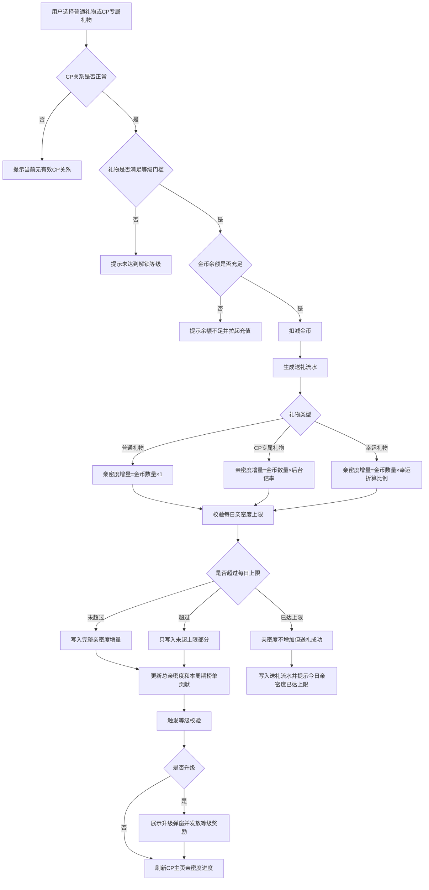

##### 分支流程
- 普通礼物：亲密度按“金币 × 1”计算。
- CP 专属礼物：亲密度倍率读取后台配置，范围 1.2~1.5。
- 幸运礼物：按后台配置折算比例计入，默认可按 0.2 处理。
- 超过上限：不影响金币扣减、送礼流水、财富值和礼物展示结果，但亲密度要截断或归 0。

##### 状态流转
| 送礼状态 | 进入条件 | 退出条件 |
|---|---|---|
| 待校验 | 用户选礼物后 | 通过 / 失败 |
| 已扣费 | 金币扣减成功 | 写入亲密度 / 进入结果态 |
| 已截断 | 命中上限但仍有剩余额度 | 刷新主页和榜单 |
| 已满额 | 当日亲密度已达上限 | 仅保留送礼结果 |
| 已升级 | 升级条件满足 | 弹窗和奖励处理完成 |

##### 异常分支
- 每日亲密度上限只限制亲密度增长，不影响金币扣减、送礼流水、财富值和礼物展示结果；超过上限必须给轻提示。
- 礼物或等级配置变化时，确认前以后端最新状态拦截。
- 等级奖励发放失败时，不回滚已写入的送礼和亲密度结果。

##### 后台处理
- 亲密度写入必须同时记录来源：普通礼物、CP专属礼物、幸运礼物，方便记录页和客服追溯。
- 榜单贡献更新必须使用最终实际写入值，而不是理论值。
- 升级校验与主页进度刷新都读取同一次送礼后的新总亲密度。

##### 幂等/补偿
- 同一笔送礼记录只能结算一次亲密度、一次榜单贡献、一次等级校验。
- 弱网重试时必须按送礼流水幂等拦截，避免重复写成长值。

#### 9.4 CP惊喜礼物随机奖励流程
##### 流程目标
定义惊喜礼物在“先完成送礼、再独立判奖”的链路下，如何处理概率配置、库存、奖励记录和发放失败补偿。

##### 参与角色
| 角色 | 职责 |
|---|---|
| 发送者 | 赠送惊喜礼物并查看结算反馈 |
| 接收者 | 查看奖励提示 |
| 系统后台 | 完成送礼、抽奖、库存锁定、发奖和补偿 |

##### 触发条件
- 用户赠送了 CP 惊喜礼物。
- 惊喜礼物概率配置、奖励池和库存配置有效。

##### 主流程
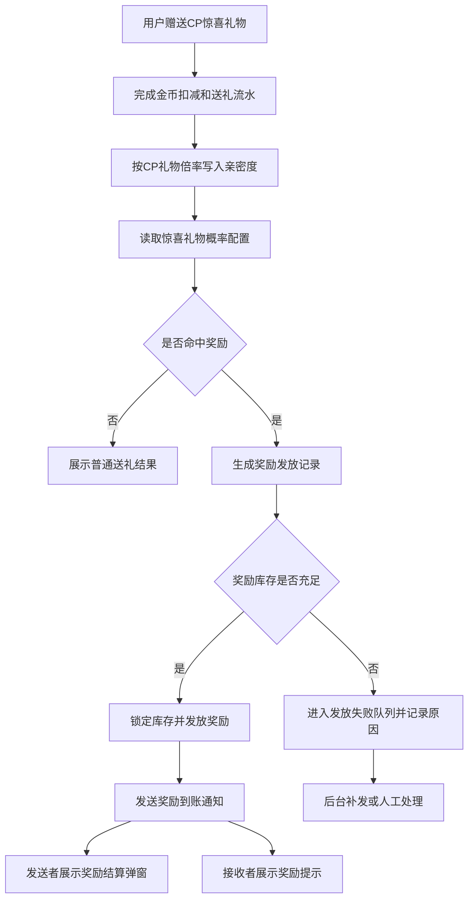

##### 分支流程
- 未中奖：仅保留普通送礼结果。
- 中奖且库存充足：锁定库存并发放奖励。
- 中奖但库存不足或发奖失败：进入补发队列。

##### 状态流转
| 奖励状态 | 进入条件 | 退出条件 |
|---|---|---|
| 待抽奖 | 送礼成功 | 抽奖完成 |
| 未中奖 | 未命中概率 | 终态 |
| 待发奖 | 命中奖励 | 发奖成功 / 失败 |
| 已发放 | 奖励到账成功 | 终态 |
| 补发处理中 | 发奖失败 | 补发成功或人工终结 |

##### 异常分支
- 惊喜礼物先按正常送礼完成扣费、亲密度和流水写入，再独立判断随机奖励。
- 奖励发放失败不回滚送礼结果，应进入失败补发队列并记录失败原因。
- 发送者和接收者展示文案可以不同，但奖励发放记录必须以服务端结果为准。

##### 后台处理
- 概率配置、奖励池、库存、有效期必须读取后台已发布配置。
- 命中奖励后必须生成奖励发放记录，不能只靠前端弹窗展示。
- 库存锁定与发奖要保持一致，防止“发奖成功但库存没扣”或反过来。

##### 幂等/补偿
- 同一笔送礼记录只能抽奖一次，奖励结果唯一。
- 补发任务只能复用原奖励记录，不得新建第二个中奖结果。

#### 9.5 CP超级礼物特效与广播流程
##### 流程目标
定义超级礼物在已绑定关系下如何完成扣费、亲密度增长、奖励发放、房间特效和全服广播，确保展示链路失败时不污染送礼主结果。

##### 参与角色
| 角色 | 职责 |
|---|---|
| 赠送方 | 选择并送出超级礼物 |
| 接收方 | 接收礼物与相关奖励 |
| 系统后台 | 结算送礼、发奖、播放特效、触发广播 |

##### 触发条件
- 当前存在有效 CP 关系。
- 超级礼物本身可赠送，且金币余额充足。

##### 主流程
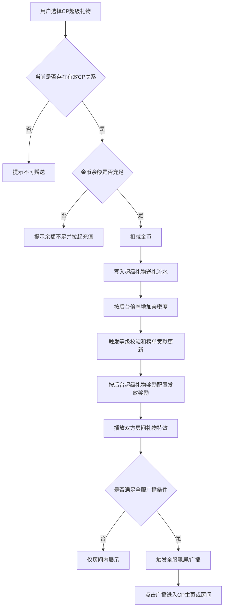

##### 分支流程
- 仅房间展示：播放房间内特效，不触发全服广播。
- 全服广播：在房间特效后追加全服飘屏或广播入口。

##### 状态流转
| 特效 / 广播状态 | 进入条件 | 退出条件 |
|---|---|---|
| 已扣费 | 金币扣减成功 | 写入送礼流水 |
| 已发奖 | 奖励发放成功 | 播放特效 |
| 房间特效中 | 进入房间展示 | 结束或转全服广播 |
| 全服广播中 | 满足广播条件 | 广播结束 |
| 展示失败 | 特效或广播失败 | 记录失败原因 |

##### 异常分支
- 特效播放、全服飘屏、广播跳转不影响扣费和亲密度写入结果；即使广播失败，也不回滚送礼。
- 广播点击落点必须明确：优先进入房间；房间不可进入时落到 CP主页或用户资料页。
- 动画资源无效时，只影响展示，不影响奖励和送礼结果。

##### 后台处理
- 全服广播条件必须来自礼物系统或礼物基础配置，例如礼物ID、礼物价值、广播开关状态。
- 奖励发放记录与动画播放记录必须分开保存，方便排查“奖励成功但广播失败”的场景。
- 超级礼物流程读取已发布配置，不允许草稿配置参与线上判断。

##### 幂等/补偿
- 同一笔超级礼物送礼记录只能触发一次奖励发放、一次主特效链路和一次广播判断。
- 广播失败的补偿只补展示，不重复发奖。

#### 9.6 礼物记录、奖励领取与补发流程
##### 流程目标
统一送礼记录、奖励记录、领取状态和过期补发逻辑，避免把“礼物记录”和“奖励记录”混成一坨屎，导致用户看不懂、客服追不回。

##### 参与角色
| 角色 | 职责 |
|---|---|
| 用户 | 查看礼物记录、领取奖励或确认结果 |
| 系统后台 | 写送礼记录、生成奖励记录、处理领取和过期 |
| 客服 / 运营 | 追溯和补发异常奖励 |

##### 触发条件
- 送礼成功或奖励命中。
- 奖励为自动发放或需用户确认领取的类型。

##### 主流程
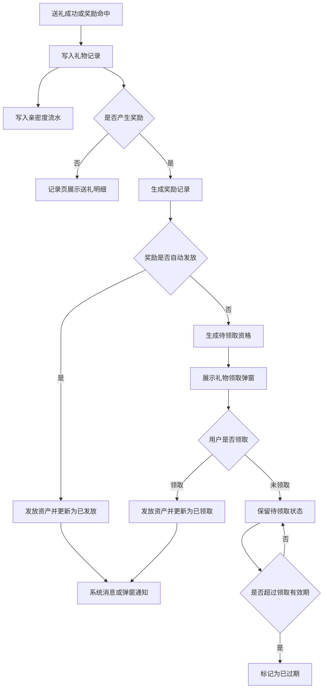

##### 分支流程
- 无奖励：记录页只展示送礼明细。
- 自动发放奖励：直接到账并更新为已发放。
- 需确认领取奖励：生成待领取资格，通过弹窗或记录页承接领取。
- 超时未领：更新为已过期，并保留过期原因。

##### 状态流转
| 奖励记录状态 | 进入条件 | 退出条件 |
|---|---|---|
| 待发放 | 奖励命中 | 自动发放 / 转待领取 |
| 待领取 | 需用户确认领取 | 已领取 / 已过期 |
| 已发放 | 自动发放成功 | 终态 |
| 已领取 | 用户确认领取成功 | 终态 |
| 已过期 | 超过领取有效期 | 终态 |
| 补发处理中 | 发放或领取失败 | 补发成功或人工终结 |

##### 异常分支
- 奖励弹窗只是展示和领取入口，实际发放以服务端奖励记录为准。
- 领取失败必须保留待领取资格，不得因为弹窗关闭或网络失败直接作废。
- 已过期奖励不得继续领取，但需要在记录页保留过期原因和过期时间。

##### 后台处理
- 礼物记录用于用户侧查看；奖励记录用于资产发放、客服追溯和补发，两个对象必须拆开保存。
- 惊喜礼物或带奖励的 CP 礼物，需要区分邀请者视角和被邀请者视角展示不同文案，但奖励结果都以服务端最终落库为准。
- 奖励说明弹层、中奖弹层、记录页和客服后台都必须回到同一份奖励记录。

##### 幂等/补偿
- 自动发放、用户领取和补发操作都必须按奖励记录ID幂等处理。
- 同一奖励记录不允许出现“已发放”和“待领取”双状态并存。

#### 9.7 礼物后台配置发布与前台生效流程
##### 流程目标
统一礼物类配置从草稿保存到发布生效的链路，确保礼物类型、价格、倍率、奖池、库存、特效和有效期只影响发布后的新行为，不追着历史流水瞎改。

##### 参与角色
| 角色 | 职责 |
|---|---|
| 运营 | 新增 / 编辑 / 发布礼物配置 |
| 系统后台 | 做字段校验、生成版本、控制前台生效 |
| 前台礼物模块 | 仅读取已发布版本 |

##### 触发条件
- 后台新增或编辑 CP 礼物配置。
- 运营点击发布礼物配置。

##### 主流程
```mermaid
flowchart TD
    A[后台新增或编辑CP礼物配置] --> B[配置字段校验]
    B --> C{校验是否通过}
    C -->|否| D[提示错误并禁止发布]
    C -->|是| E[保存为草稿]
    E --> F[发布确认]
    F --> G[生成配置版本]
    G --> H[前台礼物面板读取已发布版本]
    G --> I[新送礼行为按新配置计算]
    G --> J[历史送礼流水和历史奖励记录保留原配置快照]
    G --> K[记录操作日志]
```

##### 分支流程
- 校验失败：禁止发布，提示字段错误或资源失效。
- 草稿保存：不影响前台。
- 发布成功：仅影响发布后的新送礼行为。

##### 状态流转
| 配置状态 | 进入条件 | 退出条件 |
|---|---|---|
| 草稿 | 保存未发布 | 发布成功 / 删除 |
| 待发布 | 校验通过待确认 | 发布成功 / 取消 |
| 已生效 | 发布成功 | 被新版本替换或停用 |
| 已停用 | 主动下线 | 终态 |

##### 异常分支
- 已发生送礼、已发奖励、历史亲密度流水默认不因配置变化重算。
- 若运营需要修正历史数据，必须走人工修正 / 风控修正流程，并写入修正流水。
- 草稿配置不得影响前台礼物面板、前台送礼、奖池和广播判断。

##### 后台处理
- 礼物后台配置至少覆盖：礼物类型、金币价格、亲密度倍率、解锁等级、特效开关、广播条件、随机奖励池、概率、库存、奖励有效期。
- 历史送礼流水和历史奖励记录必须保留原配置快照，方便客服追溯。
- 记录操作日志，包含操作人、版本号、发布时间和影响模块。

##### 幂等/补偿
- 同一配置版本只能成功发布一次。
- 发布成功后若缓存刷新失败，不回滚已发布版本，改走缓存补偿任务。


---

## 一、CP邀请与关系建立模块

### 1. 邀请发起与房间建立链路

#### 1.1 礼物面板 CP 分类与组建 CP 礼物
##### 页面定位
该原型主画面展示的是礼物面板送礼页，但已明确露出 `CP` 分类标签、送礼对象切换栏、带 `组建CP` / `CP10` / `CP20` / `随机奖励` 等标记的礼物卡片，以及数量快捷项和 `Send` 按钮。本节据此结合脑图，定义礼物面板中 CP 玩法的入口识别与组建 CP 礼物承接规则。

本页的真实业务含义是：用户从房间礼物面板识别并进入 CP 玩法链路，优先通过带 `组建CP` 标签的礼物发起关系建立；随机奖励、全服特效和奖励结算属于后续送礼结果分流，不在本节承担开奖与结算说明。

##### 功能说明
本模块围绕“礼物面板 CP 分类与组建 CP 礼物”展开，重点定义礼物面板中的 CP 玩法入口、组建礼物识别、送礼对象切换、数量选择与发送动作，是房间内“系统提示/资料卡引导 → 礼物面板 → 组建 CP 邀请确认”的前置承接页。


##### 对应原型


**功能描述：** 该图重点说明礼物面板如何承接 CP 玩法入口，以及用户如何识别可用于组建 CP 的礼物卡片、价格档位和发送动作。

**关键交互：** 用户从对象切换栏选定收礼对象后，选择带 `组建CP` 标签的礼物并点击 `Send`；若未选对象或礼物不属于组建类型，系统必须在提交前拦截并给出明确提示。

##### 前置条件
| 条件项 | 说明 |
|---|---|
| 用户已登录 | 未登录用户点击送礼需先登录 |
| 用户在房间内 | 原型展示的是房间内打开礼物面板后的状态 |
| 礼物面板加载成功 | 可展示礼物分类、礼物卡片、数量选择和发送按钮 |
| CP分类已配置并生效 | 礼物面板分类中展示 `CP` 标签 |
| CP礼物资源可读取 | 可展示 Rings、Basket、Fountain、Tycoon、Treasure box 等礼物卡片 |
| 钱包余额可读取 | 底部展示金币余额并用于送礼校验 |

##### 页面字段定义表
| 字段 | 说明 | 数据来源 |
|---|---|---|
| 礼物分类标签 | Lucky、Customize、Normal、VIP、Backpack、CP 等分类入口 | 礼物分类配置 |
| CP分类 | 礼物面板中的 CP 礼物分类，不是独立页面入口 | CP礼物分类配置 |
| 顶部提示条 | `赠送组建CP礼物可邀请对方组建CP` | CP礼物提示文案配置 |
| 麦上用户选择栏 | 切到 `CP` 分类后，礼物栏顶部展示所有麦上用户（排除本人） | 房间成员信息、麦位状态 |
| 当前收礼对象 | 当前这次组建 CP 邀请对应的唯一收礼对象 | 房间成员信息、预选对象参数 |
| 用户选中态 | 麦上用户默认均为未选中，只允许单选一个 | 客户端交互状态 |
| 礼物图标 | CP分类下每个礼物的图片资源 | 礼物资源配置 |
| 礼物名称 | Rings、Basket、Fountain、Tycoon、Treasure box 等 | 礼物配置 |
| 礼物标签 | `组建CP`、`CP10`、`CP20`、`随机奖励`、`全服特效` | CP礼物规则配置 |
| 礼物价格 | 当前礼物金币价格 | 礼物配置 |
| 赠送数量 | 1、7、21、51、101 等数量快捷选项 | 礼物面板配置 |
| 金币余额 | 当前用户可用金币 | 钱包余额 |
| Send按钮 | 发送当前选中礼物 | 礼物面板交互状态 |
| 关系权益横幅 | 用于展示“组建CP解锁专属权益”等关系转化说明 | CP权益配置 |
| 组建结果承接入口 | 送礼成功后进入邀请确认或关系结果链路的承接能力 | CP邀请流程配置 |

##### 统计/计算口径
| 口径项 | 规则 |
|---|---|
| 组建CP礼物亲密度 | 邀请被接受时按 `1金币 = 1.5亲密值` 触发一次 |
| 组建CP礼物财富值 | 邀请被接受时按 `1金币 = 1财富值` 仅给发起者 |
| 对象选择规则 | 通过礼物面板建立 CP 时，一次只能选择一个收礼对象 |
| 对象范围 | 切到 `CP` 分类后，顶部展示当前房间所有麦上用户（排除本人） |
| 默认状态 | 所有麦上用户默认均为未选中状态 |
| 群发能力 | 组建CP链路不支持 `ALL`，不支持一次向多个对象发送 |
| 未选对象拦截 | 当前未选中对象时，点击 `组建CP` 礼物或发送动作，toast 提示 `请先选择组建CP用户` |
| CP10 / CP20 类标签 | 表示不同亲密度档位或礼物档位，具体换算以配置为准 |
| 随机奖励结果 | 以服务端奖励记录为准 |
| 动画可见性 | 原型强调“仅CP双方可见”，默认按配置限定展示范围 |

##### 交互逻辑
**礼物面板入口与分类切换**
1. 用户在房间内点击礼物入口，打开底部礼物面板。
2. 礼物面板默认展示某个礼物分类，用户点击 `CP` 分类后，面板切换为 CP 礼物列表。
3. `CP` 与 Lucky、Customize、Normal、VIP、Backpack 是同级分类，不承担“跳转 CP主页 / 邀请列表”的入口职责。

**CP对象选择规则**
1. 通过礼物面板建立 CP 时，一次只能选择一个收礼对象，不支持 `ALL`，也不支持群发。
2. 切到 `CP` 分类后，礼物栏顶部直接展示当前房间所有麦上用户，排除用户本人。
3. 所有麦上用户默认均为未选中状态，仅允许单选一个用户。
4. 若用户是从房间系统提示、资料卡或其他已带目标对象的入口进入 `CP` 分类，则当前收礼对象可直接预选完成，但用户仍可在支付前改选为另一位麦上用户。
5. 若当前没有选中任何对象，用户点击 `组建CP` 礼物卡片或尝试发送时，系统直接拦截，并 toast 提示：`请先选择组建CP用户`。
6. 用户点击顶部某位麦上用户后，该用户进入选中态，其他用户自动取消选中，页面进入“已选对象待送礼态”。
7. 选定对象后，当前组建 CP 链路中的收礼对象锁定到本次邀请快照；支付前可重新改单选对象，支付后不得再修改邀请对象。

**CP礼物选择与送出**

1. 用户点击某个 CP 礼物卡片后，该礼物进入选中态。
2. 用户选择赠送数量，如 1、7、21、51、101。
3. 页面底部展示当前金币余额和 `Send` 按钮。
4. 点击 `Send` 后，系统校验金币余额、礼物状态、房间状态、收礼对象状态和 CP 礼物规则。
5. 校验通过后完成送礼扣费，并按礼物标签进入对应业务链路。

**组建CP礼物链路**
1. 若礼物标签为 `组建CP`，送出后用于发起 CP 邀请。
2. 系统创建邀请记录，并把所选礼物、礼物价格、发起者、被邀请者、有效期写入邀请快照。
3. 被邀请者接受后，双方建立 CP 关系；被拒绝、取消或过期时，按邀请规则处理退币或结果通知。

**已绑定CP礼物链路**
1. 若用户已绑定 CP，送出 CP 礼物后增加双方亲密度。
2. 若礼物标签为 `随机奖励`，送礼后触发随机奖励逻辑。
3. 若礼物标签为 `全服特效`，送礼后触发全服或房间范围内的特效展示。

**后续链路分流**
1. 送礼成功后，系统根据礼物标签分流到邀请确认、关系建立、随机奖励或特效展示链路。
2. 本模块只负责定义礼物面板内的入口识别与发送动作；随机奖励动画、双视角奖励弹窗和全服特效的完整规则分别以下游模块为准。

##### 状态定义
| 状态 | 触发条件 | 页面表现 | 后续处理 |
|---|---|---|---|
| CP分类未选中 | 用户未点击 CP 标签 | 礼物面板展示其他分类 | 不展示 CP 礼物列表 |
| CP分类选中 | 用户点击 CP 标签 | 展示 CP 礼物卡片和顶部麦上用户选择栏 | 可选对象或选礼物 |
| 未选对象态 | 当前无任何收礼对象被选中 | 顶部用户列表全部未选中，组建链路不可直发 | 点击用户进入单选 |
| 已选对象待送礼态 | 已选定唯一收礼对象 | 顶部展示唯一选中对象，可继续选礼物和支付 | 等待用户发送 |
| 礼物已选中 | 用户点击某个 CP 礼物 | 礼物卡片高亮，Send 可用 | 等待用户发送 |
| 余额不足 | 用户金币不足 | Send 后提示余额不足 | 不扣费、不送礼 |
| 送礼成功 | 扣费与送礼记录创建成功 | 播放动画或展示结果 | 进入亲密度/邀请/奖励链路 |
| 奖励待查看 | 触发随机奖励或超级礼物奖励 | 展示奖励弹窗 | 用户点击收下关闭 |
| 动画播放失败 | 动效资源加载失败 | 可降级不播放或轻提示 | 不回滚奖励和送礼 |

##### 系统后台核心逻辑
- CP分类是礼物系统分类配置，不是 CP关系状态分流入口。
- 组建 CP 礼物创建邀请前，`recipient_user_id` 必须有值；未选对象时不得创建邀请。
- 通过礼物面板建立 CP 的一次送礼只能绑定一个收礼对象，不支持 `ALL` 和多对象并发邀请。
- 顶部麦上用户选择栏的数据必须由系统后台实时过滤：排除自己、已绑定 CP、已开启自动拒绝、被拉黑/封禁或不可互动的麦上用户。
- CP礼物必须按礼物标签区分业务链路：组建CP、普通CP礼物、随机奖励礼物、全服特效礼物。
- 送礼扣费、亲密度增长、邀请创建、随机奖励、动画触发必须以同一条送礼记录为基础，避免重复结算。
- `组建CP` 礼物创建邀请时必须写入邀请快照，后续礼物改价或下架不影响已创建邀请。
- 随机奖励结果必须记录奖励对象、奖励内容、失效时间、发放状态和触发礼物记录。
- 房间动画展示失败不应回滚送礼扣费、亲密度增长或奖励发放；但需要记录播放失败便于排查。

##### 异常与测试关注点
| 场景 | 页面反馈 | 处理规则 |
|---|---|---|
| 用户未绑定 CP 但送普通 CP 礼物 | 提示需先组建 CP，或仅允许组建CP礼物可送 | 不得误触发亲密度增长 |
| 用户已绑定 CP 但选择组建CP礼物 | 根据规则置灰或提示“你已拥有CP关系” | 不重复创建邀请 |
| 当前无可选麦上用户 | 顶部用户栏空态，提示“当前暂无可邀请的麦上用户” | 不允许直接送组建CP礼物 |
| 未选择对象直接点击组建礼物 | toast `请先选择组建CP用户` | 不允许进入邀请创建 |
| 收礼对象不可互动 | 轻提示“当前用户无法接收CP礼物” | 不扣费 |
| 礼物已下架 | 礼物卡片隐藏或不可送 | 不允许发送 |
| 金币余额不足 | 轻提示余额不足并引导充值 | 不创建送礼记录 |
| 随机奖励发放失败 | 弹窗可展示处理中或稍后补发 | 写入补发队列 |
| 用户关闭奖励弹窗 | 弹窗消失 | 不撤销已发奖励 |
| CP双方之一离开房间 | 动画可不展示给离房方 | 奖励和记录仍按送礼结果处理 |
#### 1.2 通用系统提示组建 CP
##### 页面定位
通用系统提示组建 CP 是系统在识别到用户存在可推荐 CP 对象时，向邀请者展示的轻量级引导弹窗。该弹窗只负责提示用户当前存在可组建 CP 的对象，并引导用户进入后续邀请链路。

本模块描述的是“系统提示组建 CP”的通用触发规则。房间内的具体落地形态、对象预选和礼物面板承接，见 `1.3 房间内系统主动提示组建 CP`；私聊中的同类提示逻辑也应复用本模块的基础触发条件、防打扰策略和状态重校验规则。

##### 功能说明
本模块围绕“通用系统提示组建 CP”展开，该图表示系统命中推荐策略后，向邀请者展示的组建 CP 主提示态，用于告诉用户“你和某个对象关系不错，可以进一步建立 CP”。


##### 对应原型
###### 原型一：系统提示组建 CP 主提示态


**功能描述：** 该图表示系统命中推荐策略后，向邀请者展示的组建 CP 主提示态，用于告诉用户“你和某个对象关系不错，可以进一步建立 CP”。

**关键交互：** 用户可在该弹窗中选择“发起CP”、关闭或勾选“不再提示”；此时还未创建邀请，也未扣金币。

###### 原型二：系统提示绑定 CP 弹窗补充态


**功能描述：** 该图表示系统提示链路中的另一种绑定 CP 弹窗展示态，补充说明系统提示在不同页面层级或弹窗资源下的表现形式。

**关键交互：** 该补充态仍然只服务于“提示+引导发起”，不直接完成 CP 建立，也不替代后续礼物面板与邀请创建链路。

##### 前置条件
| 条件项 | 说明 |
|---|---|
| 当前用户未绑定 CP | 已绑定 CP 用户不展示组建提示 |
| 推荐对象未绑定 CP | 推荐对象必须处于可邀请状态 |
| 双方未互相拉黑 | 任一方把对方拉黑都不触发 |
| 双方均未开启自动拒绝CP邀请 | 任一方开启后都不触发该提示 |
| 双方之间不存在未处理的CP邀请 | 已有待处理邀请时不再重复触发新的系统提示 |
| 双方命中推荐策略 | 如互关好友、亲密度高、近期互动频繁或系统推荐命中 |
| 至少一方处于当前会话场景 | 适用房间内聊天场景和私聊聊天场景 |
| 对方最近活跃 | 活跃窗口按配置判断，例如5分钟内活跃 |
| 当前用户是邀请者侧 | 该弹窗仅对邀请者展示，不对被邀请者展示 |
| CP 功能开启 | 当前版本、地区、用户分层允许使用 |
| 未命中风控拦截 | 未命中骚扰限制，未被系统判定为高风险骚扰用户 |
| 未处于冷却周期内 | 用户关闭过同类提示时，冷却期内不重复弹出 |
| 未被用户设置为不再提示 | 若用户已勾选 `不再提示`，不再弹出 |

##### 页面字段定义表
| 字段/元素 | 说明 | 数据来源 |
|---|---|---|
| 邀请者头像 | 当前用户头像 | 用户资料 |
| 推荐对象头像 | 系统推荐的可组建 CP 对象头像 | 用户资料、推荐结果 |
| CP 连线图标 | 双方之间的心形/心电图连接视觉 | 客户端资源配置 |
| 提示文案 | 例如“你们似乎关系挺不错，成为CP关系可解锁更多亲密体验！” | CP 提示文案配置 |
| 权益预览 | 展示组建 CP 后可能获得的权益 | CP 权益配置、组建礼物配置 |
| 主按钮 `发起CP` | 引导用户进入后续邀请链路 | 客户端按钮配置 |
| 关闭按钮 | 关闭当前提示 | 客户端交互 |
| `不再提示` | 屏蔽或降低后续同类提示 | 用户偏好记录、频控配置 |
| 场景来源 | 房间 / 私聊 等当前触发场景标识 | 客户端场景参数 |
| 冷却状态 | 用户是否处于同类提示的关闭冷却期 | 频控记录 |

##### 统计/计算口径
###### 触发行为与阈值规则
| 触发类型 | 规则 | 说明 |
|---|---|---|
| 聊天触发 | 连续发送消息达到阈值 | 阈值由后台配置，不在前端写死，例如可配置为连续消息 ≥ X 条 |
| 礼物触发 | 向对方送礼达到阈值 | 默认可配置为送礼 ≥ 1 次或更高阈值 |
| 综合触发 | 在 T 分钟内同时存在聊天 + 送礼行为 | T 由后台配置，适用于高互动关系判断 |
| 触发时机 | 实时触发或延迟 3~5 秒触发 | 具体触发时机由后台配置下发 |

###### 推荐优先级规则
| 场景 | 处理规则 |
|---|---|
| 同时命中多个候选对象 | 系统只选一个当前推荐对象，不并发展示多个弹窗 |
| 第一优先级 | 最近互动用户 |
| 第二优先级 | 互动强度最高用户 |
| 同优先级兜底 | 由系统推荐策略继续按后台排序字段裁决 |

###### 频控与冷却规则
| 规则项 | 规则 |
|---|---|
| 关系级频控 | 同一对用户 24 小时内最多触发 1 次 |
| 用户级频控 | 每个用户每日最多触发 N 次，N 由后台配置 |
| 关闭冷却 | 用户关闭弹窗后，当天不再触发 |
| 场景共桶规则 | 房间 / 私聊共用同一套用户级频控、关系级频控和关闭冷却桶，不按场景拆分冷却次数 |
| 场景埋点 | 虽然冷却共桶，但房间 / 私聊来源需单独记录，用于后续分析 |

###### 用户配置规则
| 配置项 | 规则 |
|---|---|
| `不再提示` | 用户勾选后，后续同类提示永久关闭 |
| 恢复方式 | 仅能由用户主动在设置中恢复，不因换设备或换场景自动恢复 |
| 自动拒绝CP邀请 | 任一方开启后，不触发该系统提示，也不进入后续邀请链路 |
| 配置生效方式 | 按用户维度落库，跨设备保持一致 |

##### 交互逻辑
1. 系统先根据推荐策略筛选候选对象，例如互关好友、亲密度高、近期互动频繁的对象。
2. 系统再校验当前用户与候选对象是否满足展示条件：双方未绑定 CP、未互相拉黑、双方都未开启自动拒绝、双方之间无待处理邀请、至少一方处于房间/私聊场景、对方最近活跃、未命中骚扰限制、未处于用户级/关系级频控窗口。
3. 触发行为支持三类：聊天触发、礼物触发、综合触发；具体阈值由后台配置，不在前端写死。
4. 若同一时刻命中多个推荐对象，系统优先选择最近互动用户或互动强度最高用户作为当前推荐对象。
5. 校验通过后，仅对邀请者侧弹出系统提示；被邀请者不会先看到该提示弹窗。
6. 页面弹出后，展示双方头像、CP 连线图标、提示文案、权益预览、`发起CP` 按钮、关闭按钮和 `不再提示` 选项。
7. 用户点击 `发起CP` 后，进入后续 CP 邀请链路；此时仍未创建邀请，也未扣金币。
8. 用户点击关闭按钮，只关闭当前提示，不创建邀请、不扣金币、不改变双方 CP 状态，并写入关闭冷却记录。
9. 用户勾选 `不再提示` 后关闭或继续操作，系统更新用户配置，后续同类提示永久关闭，直到用户主动恢复。
10. 若弹窗展示期间，对方已绑定 CP、离开场景、变为不可邀请或当前用户状态变化，点击 `发起CP` 时必须重新校验，不能按弹窗打开瞬间的旧状态直接进入邀请链路。
11. 用户点击 `发起CP` 并通过后续链路后，被邀请者通过房间浮层、私聊提示或其他结果承接入口感知邀请，而不是直接看到同一个系统提示弹窗。

##### 状态定义
| 状态 | 触发条件 | 页面表现 |
|---|---|---|
| 可展示 | 满足推荐条件且未被频控拦截 | 展示系统提示弹窗 |
| 关系级限频中 | 同一对用户24小时内已触发过 | 当前两人之间不再重复弹出 |
| 用户级限频中 | 当前用户当日触发次数已达上限 | 当天不再弹出新的同类提示 |
| 冷却中 | 用户关闭同类提示后 | 当天不再触发 |
| 不再提示 | 用户勾选 `不再提示` | 后续同类提示永久关闭 |
| 已关闭 | 用户点击关闭 | 弹窗消失，不创建邀请 |
| 不可展示 | 用户已绑定 CP、推荐对象不可邀请或命中拦截 | 不弹出提示 |
| 展示后失效 | 弹窗展示期间对象状态变化 | 点击 `发起CP` 时重校验并阻断失效链路 |

##### 系统后台核心逻辑
- 通用系统提示只记录曝光、点击、关闭、`不再提示`、冷却等行为，不创建 CP 邀请。
- 触发对象必须限定在邀请者侧，避免双方同时弹出引导造成歧义。
- 推荐对象必须来自系统推荐策略，不能客户端随意拼一个目标对象。
- 聊天触发、礼物触发、综合触发三类阈值都由后台配置控制，前端只负责承接结果。
- 同一对用户24小时内最多触发1次；当前用户每日最多触发 N 次；N 和具体阈值由后台配置。
- 房间 / 私聊共用同一套频控和冷却桶，但场景来源需单独记录用于分析。
- 用户关闭弹窗后，当天不再触发；用户勾选 `不再提示` 后，系统按永久关闭处理，直到用户主动恢复该配置。
- 点击 `发起CP` 后必须继续进行关系状态、对象状态、礼物配置和余额校验，不能直接创建邀请。
- 提示文案和权益预览必须读取后台已发布配置，不能客户端写死。
- 冷却策略和 `不再提示` 必须按用户维度落库，跨设备保持一致。
- 弹窗展示期间若对象状态变化，后续点击必须重新校验，不能用旧快照继续发起邀请。

##### 异常与测试关注点
| 场景 | 预期处理 |
|---|---|
| 用户点击 `发起CP` 时对象已绑定 CP | 提示对象不可邀请，不创建邀请 |
| 用户关闭弹窗 | 只关闭当前提示，不改变状态，并进入当日冷却期 |
| 用户勾选 `不再提示` | 后续同类提示永久关闭，直到用户主动恢复 |
| 权益配置为空 | 使用兜底文案或隐藏权益模块 |
| 弹窗展示期间对象离开场景 | 点击 `发起CP` 时重新校验并阻断 |
| 同一对用户24小时内重复触发推荐 | 不重复弹出 |
| 当前用户当日触发次数已达上限 | 不再弹出新提示 |
| 私聊与房间场景来回切换 | 仍按同一套冷却和用户偏好规则控制提示 |
#### 1.3 房间内系统主动提示组建 CP
##### 页面定位
房间内系统主动提示组建 CP 是用户在语音房间内互动时，系统基于房间关系和互动行为主动弹出的组建 CP 推荐。该弹窗的核心职责是：在房间场景中把互动关系转化为 CP 邀请意图。

##### 功能说明
本模块围绕“房间内系统主动提示组建 CP”展开，该图表示房间内系统主动向邀请者侧展示的组建 CP 提示态，用于在高互动房间场景下把用户从聊天/同房互动引导到组建 CP 链路。


##### 对应原型


**功能描述：** 该图表示房间内系统主动向邀请者侧展示的组建 CP 提示态，用于在高互动房间场景下把用户从聊天/同房互动引导到组建 CP 链路。

**关键交互：** 邀请者点击发起后进入房间内的 CP 礼物面板或邀请链路；点击关闭仅关闭本次提示，不直接创建邀请，也不扣金币。

##### 前置条件
| 条件项 | 说明 |
|---|---|
| 用户处于房间内 | 当前页面为语音房间场景 |
| 双方互动满足推荐策略 | 如同房、互动频繁、近期关系活跃等，具体阈值读取系统推荐配置 |
| 双方均未绑定 CP | 任一方已有 CP 时不触发该提示 |
| 房间 CP 功能开启 | 当前房间类型允许展示 CP 推荐 |
| 未命中频控 | 同用户、同对象、同房间短时间内不重复弹出 |

##### 页面字段定义表
| 字段/元素 | 说明 | 数据来源 |
|---|---|---|
| 房间场景标识 | 标记该提示来自房间系统推荐 | 客户端场景参数 |
| 邀请者头像/昵称 | 当前准备发起邀请的用户 | 房间成员信息、用户资料 |
| 被推荐对象头像/昵称 | 系统推荐的房间内用户，也是默认预选的组建 CP 对象 | 房间成员信息、推荐结果 |
| CP 连线 icon | 双方关系推荐的视觉连接 | 客户端资源配置 |
| 推荐文案 | 表达“关系不错，推荐组 CP”的提示 | CP 提示文案配置 |
| 权益展示 | 展示金币价格最高的组建 CP 礼物对应权益奖励 | 礼物配置、权益配置 |
| `发起CP` 按钮 | 房间主动提示的主操作 | 客户端按钮配置 |
| 关闭弹窗 | 关闭当前房间提示 | 客户端交互 |
| `不再提示` | 屏蔽或降低同类房间提示 | 用户偏好、频控记录 |

##### 统计/计算口径
| 口径项 | 规则 |
|---|---|
| 房间提示曝光 | 每次房间内弹出该提示记为曝光 |
| 房间提示点击 | 点击 `发起CP` 记为房间提示转化点击 |
| 来源标识 | 后续链路来源记录为 `房间系统提示` |
| 对象预选规则 | 从系统提示进入时，推荐对象自动成为当前唯一预选收礼对象 |
| 频控口径 | 可按用户、推荐对象、房间、自然日维度限制提示次数 |

##### 交互逻辑
1. 用户在房间内与另一用户产生高频互动或满足系统推荐条件。
2. 系统校验双方 CP 状态、房间状态、推荐策略、频控状态。
3. 校验通过后，在房间内弹出主动提示弹窗。
4. 用户点击 `发起CP` 后，弹窗关闭，打开房间礼物面板，并自动定位到 `CP` 分类。
5. 与普通从礼物面板手动切入不同，从该系统提示进入时，推荐对象已经预选完成，进入 `CP` 分类后直接作为当前唯一收礼对象，不需要再次选择。
6. 在该预选链路中，组建 CP 礼物默认只对这个被推荐对象生效；不支持 `ALL`，也不支持一次选择多个收礼对象。
7. 用户点击关闭按钮，弹窗关闭，本次推荐结束，不创建邀请。
8. 用户勾选 `不再提示` 后，系统记录偏好，后续房间内同类提示不再弹出或降频。

##### 状态定义
| 状态 | 触发条件 | 页面表现 |
|---|---|---|
| 房间可提示 | 双方满足房间互动推荐条件 | 弹出房间主动提示 |
| 已预选对象态 | 用户点击 `发起CP` 进入 `CP` 分类 | 推荐对象作为唯一收礼对象被锁定 |
| 房间已提示 | 已完成一次弹窗曝光 | 进入频控周期 |
| 用户关闭 | 用户主动关闭弹窗 | 当前弹窗消失 |
| 用户不再提示 | 用户勾选 `不再提示` | 后续同类提示屏蔽或降频 |
| 不可提示 | 双方任一方已绑定 CP 或命中拦截 | 不展示弹窗 |

##### 系统后台核心逻辑
- 房间提示必须记录来源场景为 `房间系统提示`，后续转化链路继续携带该来源。
- 点击 `发起CP` 只打开房间礼物面板，不直接创建邀请。
- 从系统提示进入 `CP` 分类时，系统推荐对象必须作为预选 `recipient_user_id` 注入后续链路。
- 房间推荐策略应过滤已绑定 CP、封禁、黑名单、骚扰用户和频控对象。

##### 异常与测试关注点
| 场景 | 预期处理 |
|---|---|
| 用户点击按钮时已离开房间 | 不继续打开房间礼物面板，提示场景已失效 |
| 推荐对象离开房间 | 不继续进入组建链路或进入后提示对象不可邀请 |
| 房间礼物面板加载失败 | 展示加载失败或重试，不创建邀请 |
| 频控周期内重复触发 | 不再弹出提示 |
| 预选对象失效 | 进入 `CP` 分类后提示对象不可邀请，不允许直接发送组建礼物 |
#### 1.4 房间绑定 CP 完整流程
##### 页面定位
房间绑定 CP 完整流程图描述的是从邀请者在房间内看到系统提示，到被邀请者处理 CP 邀请的完整闭环。该图不是单个弹窗，而是房间内组建 CP 的端到端流程说明。

##### 功能说明
本模块围绕“房间绑定 CP 完整流程”展开，该图表示房间场景下从系统提示、礼物面板、邀请确认到被邀请者处理邀请的完整组建 CP 主流程，是房间链路的总览流程图。


##### 对应原型


**功能描述：** 该图表示房间场景下从系统提示、礼物面板、邀请确认到被邀请者处理邀请的完整组建 CP 主流程，是房间链路的总览流程图。

**关键交互：** 邀请者在房间中经由系统提示和 CP 礼物链路发起邀请，被邀请者再通过邀请函、列表和详情页完成接受或拒绝，流程中任一步都需按最新状态重校验。

##### 前置条件
| 条件项 | 说明 |
|---|---|
| 邀请者从房间系统提示进入，或从礼物面板手动切到 `CP` 分类 | 来源必须是房间内系统主动提示或房间内礼物面板入口 |
| 礼物面板 CP 分类可用 | 礼物面板存在 `CP` 分类，可展示组建 CP 礼物 |
| 存在可用组建 CP 礼物 | 至少一个礼物带 `组建CP` 标签 |
| 邀请者金币余额满足所选礼物 | 金币不足时不能创建邀请 |
| 被邀请者可接收邀请 | 未绑定 CP，且未命中封禁、黑名单、自动拒绝等拦截条件 |

##### 页面字段定义表
| 阶段 | 字段/元素 | 说明 | 数据来源 |
|---|---|---|---|
| CP礼物面板 | `CP` 分类 | 房间礼物面板内的 CP 礼物分类 | 礼物配置 |
| CP礼物面板 | 顶部麦上用户选择栏 | 切到 `CP` 分类后直接展示所有麦上用户（排除本人） | 房间成员信息、麦位状态 |
| CP礼物面板 | 当前收礼对象 | 当前这次组建 CP 的唯一收礼对象 | 房间成员信息、预选对象参数 |
| CP礼物面板 | 组建CP礼物 | 可触发 CP 邀请的礼物 | 礼物配置 |
| 邀请确认弹窗 | 邀请组建CP标题 | 确认本次邀请行为 | 客户端文案 |
| 邀请确认弹窗 | 当前选中礼物 | 邀请者在礼物面板选择的组建 CP 礼物 | 礼物配置 |
| 邀请确认弹窗 | 当前收礼对象 | 本次邀请对应的唯一被邀请者 | 房间成员信息、对象选择结果 |
| 邀请确认弹窗 | 价格按钮 | 点击后确认支付/扣费并创建邀请 | 礼物配置、钱包余额 |
| 被邀请者浮层 | CP邀请函 | 房间内收到的邀请提示 | CP邀请记录 |
| 邀请入口 | 心形入口 | 聚合未处理 CP 邀请 | CP邀请记录 |
| 邀请入口 | 数量角标 | 未处理邀请数量，超过99显示 `99+` | CP邀请记录 |
| 邀请列表 | `查看` 按钮 | 进入单条邀请详情 | 客户端配置 |
| 邀请详情 | `接受` / `狠心拒绝` | 处理邀请的主动作 | CP邀请记录 |

##### 统计/计算口径
| 口径项 | 规则 |
|---|---|
| 邀请创建时机 | 仅在邀请者确认组建 CP 礼物并完成支付/扣费后创建 |
| 单对象规则 | 通过礼物面板建立 CP 时，一次只允许对应一个收礼对象 |
| 对象来源优先级 | 系统提示/资料卡进入时使用预选对象；无预选对象时直接在顶部麦上用户栏手动单选 |
| 对象范围 | 默认仅允许选择当前房间内可邀请的麦上用户 |
| 默认状态 | 顶部所有麦上用户默认均为未选中状态 |
| 群发能力 | 组建 CP 链路不支持 `ALL`，不支持多对象并发邀请 |
| 未选对象拦截 | 当前未选中对象时，点击 `组建CP` 礼物或发送动作，toast 提示 `请先选择组建CP用户` |
| 组建CP礼物亲密度 | 邀请被接受时，按 `1金币 = 1.5亲密值` 给 CP 双方增加亲密度 |
| 发起者财富值 | 邀请被接受时，按 `1金币 = 1财富值` 给发起者增加财富值 |
| 待处理数量 | 统计当前被邀请者仍可处理的待处理邀请 |
| 邀请列表排序 | 按礼物价值降序；同价值按剩余时间升序 |

##### 交互逻辑
1. 邀请者从房间系统提示点击 `发起CP`，或在普通礼物面板中手动切到 `CP` 分类。
2. 系统打开房间礼物面板，并定位到 `CP` 分类。
3. 如果是从房间系统提示进入，则推荐对象已经作为当前唯一收礼对象预选完成，顶部麦上用户栏直接以该用户为选中态展示。
4. 如果是用户在当前无 CP 的情况下先打开礼物面板、再手动切到 `CP` 分类，且当前没有预选对象，则顶部麦上用户栏展示当前房间所有麦上用户（排除本人），默认全部未选中。
5. 用户点击顶部某位麦上用户后，该用户进入选中态，其他用户自动取消选中；一次只能有一个对象被选中。
6. 若当前未选中任何对象，用户点击 `组建CP` 礼物卡片或尝试发送时，系统直接拦截，并 toast 提示：`请先选择组建CP用户`。
7. 选中对象后，邀请者选择带 `组建CP` 标签的礼物。
8. 系统弹出 `邀请组建CP` 确认弹窗，展示当前收礼对象、礼物信息和价格按钮。
9. 邀请者点击价格按钮并完成支付/扣费后，系统创建 CP 邀请。
10. 被邀请者在房间内收到 `CP邀请函` 浮层，可点击 `打开` 进入邀请详情或邀请列表。
11. 被邀请者也可以点击房间右下角心形入口进入待处理邀请列表；心形入口展示未处理数量，超过99显示 `99+`。
12. 被邀请者点击某条邀请的 `查看`，进入邀请详情。
13. 被邀请者点击 `接受` 后，系统建立 CP 关系，刷新双方主页、房间展示、资料卡和私聊状态。
14. 被邀请者点击 `狠心拒绝` 后，邀请进入已拒绝状态，并按组建 CP 礼物退款规则处理。
15. 用户点击详情 `X` 只关闭详情，不接受、不拒绝、不取消邀请。
16. 倒计时结束仍未处理时，系统自动拒绝该邀请。

##### 状态定义
| 对象 | 状态 | 触发条件 | 页面表现 |
|---|---|---|---|
| 面板 | 未选对象态 | 无预选对象且尚未选择对象 | 顶部麦上用户栏全部未选中，组建链路不可直发 |
| 面板 | 已选对象待送礼态 | 已选择唯一收礼对象 | 顶部展示唯一选中对象，可继续选礼物和支付 |
| 礼物 | 可用于组建CP | 礼物上架且配置为组建CP礼物 | 礼物卡片显示 `组建CP` 标签 |
| 邀请 | 待处理 | 邀请创建成功但未被处理 | 可查看、可接受、可拒绝 |
| 邀请 | 已接受 | 被邀请者点击接受并校验通过 | 建立 CP 关系 |
| 邀请 | 已拒绝/已过期/已取消 | 终态 | 只读展示终态结果 |
| 关系 | 已绑定CP | 邀请被接受后创建关系 | 房间展示 CP 连线，主页切换已绑定态 |

##### 系统后台核心逻辑
- 礼物面板中的 `CP` 分类与组建 CP 礼物列表必须读取后台已发布配置。
- 创建邀请前必须校验双方 CP 状态、账号状态、黑名单/封禁、自动拒绝、金币余额、礼物上架状态。
- 组建 CP 邀请创建前，`recipient_user_id` 必须有值；未选择对象时不得创建邀请。
- 房间内通过礼物面板建立 CP 的一次送礼，只能绑定一个收礼对象，不支持 `ALL` 和多对象并发邀请。
- 顶部麦上用户栏的数据必须由系统后台实时过滤：排除自己、已绑定 CP、已开启自动拒绝、被拉黑/封禁或不可互动的麦上用户。
- 邀请记录必须保存：邀请者、被邀请者、礼物ID、礼物金币价值、权益快照、来源场景、创建时间、过期时间、状态。
- 被邀请者接受邀请后，系统创建 CP 关系，并基于组建 CP 礼物写入亲密度和财富值。
- 用户接受某个 CP 邀请后，系统自动拒绝其他收到的待处理邀请，并自动取消自己已发出的待处理邀请。

##### 异常与测试关注点
| 场景 | 预期处理 |
|---|---|
| 金币余额不足 | 提示余额不足，不创建邀请 |
| 被邀请者开启自动拒绝 | 新邀请自动拒绝，并向邀请者反馈结果 |
| 当前无可选麦上用户 | 顶部用户栏空态，提示“当前暂无可邀请的麦上用户” |
| 未选择对象直接点击组建礼物 | toast `请先选择组建CP用户` |
| 被邀请者同时存在多条邀请 | 心形入口展示未处理数量，列表按礼物价值和剩余时间排序 |
| 被邀请者点击 `X` | 只关闭详情，不改变邀请状态 |
| 倒计时结束未处理 | 系统自动拒绝并按退款规则处理 |
| 跨设备重复处理同一邀请 | 仅第一笔有效操作成功，其余设备刷新终态 |
| 预选对象在支付前离开房间或变为不可邀请 | 支付前重新校验并阻断创建邀请 |
#### 1.5 邀请弹窗
##### 页面定位
邀请弹窗是发起 CP 邀请的核心操作页面，承载被邀请对象搜索/选择、组建礼物选择、金币消耗展示、发送邀请确认、成功反馈和等待处理状态承接。

##### 功能说明
本模块围绕“邀请弹窗”展开，该图表示邀请者确认发起 CP 邀请的弹窗，展示双方头像、当前组建礼物、可升级礼物、权益预览和支付按钮。


##### 对应原型


**功能描述：** 该图表示邀请者确认发起 CP 邀请的弹窗，展示双方头像、当前组建礼物、可升级礼物、权益预览和支付按钮。

**关键交互：** 邀请者点击底部价格按钮后才正式提交邀请；仅打开弹窗或切换礼物不创建邀请、不通知对方。


##### 前置条件
| 条件项 | 说明 |
|---|---|
| 用户已登录 | 未登录不可发起邀请 |
| 用户未绑定 CP | 已绑定用户不进入邀请弹窗 |
| 目标用户未绑定 CP | 对方已绑定时不可继续邀请 |
| 双方未互相拉黑 | 拉黑状态下不可发起邀请 |
| 双方账号可交互 | 风控、功能开关、地区规则通过 |
| 不存在有效主动邀请 | 发起者已有待处理主动邀请时不可重复创建 |
| 金币余额充足 | 不足时拉起充值页 |
| 钱包与礼物配置可读取 | 用于展示可用礼物和支付金额 |

##### 页面字段定义表
| 字段 | 说明 | 数据来源 |
|---|---|---|
| 被邀请对象确认区 | 当前选中对象的头像、昵称、编号 | 用户资料 |
| 组建礼物列表 | 可选礼物的图标、名称、金币价格 | 礼物配置 |
| 已选礼物 | 当前选中礼物的图标、名称、金币价格 | 用户选择 + 礼物配置 |
| 金币消耗 | 本次邀请需要支付的金币数 | 礼物配置 |
| 金币余额 | 当前用户可支付金币 | 钱包记录 |
| 亲密度预览 | 邀请接受后可获得的亲密度 | 固定系统规则计算 |
| 邀请有效期 | 待处理邀请的过期倒计时 | CP 邀请记录 + 功能配置 |
| 提交结果 | 成功、失败及失败原因 | 邀请创建结果 |
| 状态提示文案 | 邀请已发送、等待对方处理、超时退回说明 | CP 功能配置 |
| 奖励说明区 | 成为 CP 后可获得的奖励与权益说明 | CP 功能配置 |
| 发送邀请按钮 | 发送邀请操作按钮 | CP 功能配置 |
| 取消/返回按钮 | 关闭当前弹窗 | CP 功能配置 |
| 取消邀请按钮 | 仅待处理状态可用 | CP 功能配置 |

##### 统计/计算口径
| 口径项 | 规则 |
|---|---|
| 亲密度预览 | 组建 CP 礼物亲密度 = 礼物金币 × 1.5；该倍率为固定系统规则 |
| 金币消耗 | 直接读取当前选中组建礼物的金币价格 |
| 邀请有效期 | 邀请创建时间 + 后台配置有效期，按东三区时间计算 |
| 待处理剩余时间 | 邀请过期时间 - 当前系统时间 |

##### 交互逻辑
1. 用户可从半屏资料页的 CP 区域 `+` 按钮，或全屏资料页中的 CP 模块 `+` 按钮进入邀请弹窗，两个入口进入的是同一套邀请流程。
2. 弹窗顶部先展示双方头像和 CP 主视觉，帮助用户确认当前邀请对象。
3. 中部展示多个组建 CP 礼物档位或套餐卡片，用户点击任一档位后，当前卡片进入选中态；底部主按钮同步更新为当前档位价格。
4. 用户在弹窗内可先浏览该档位附带的 CP 权益说明，再决定是否继续发起邀请。
5. 点击底部主按钮后，系统执行目标对象状态、余额、礼物档位、风控限制等校验。
6. 校验通过后，扣减金币并创建邀请记录，页面进入“邀请已发出、等待对方处理”的承接态；资料页中的 CP 模块同步从“可邀请”切换为“已发出邀请/待处理”状态。
7. 校验失败时，弹窗停留在当前页，保留已选档位，并展示失败原因，如余额不足、对方已绑定、已有待处理邀请等。
8. 待处理期间，发起者再次进入该对象资料页时，应看到 CP 模块已经变化，避免继续重复发起；进入邀请详情后可查看剩余有效期并在允许时取消邀请。
9. 邀请发送成功后展示心形、连线或关系建立相关视觉反馈，但视觉反馈不等于已成为 CP；真正建立关系仍以后续接受结果为准。

##### 状态定义
| 状态 | 触发条件 | 页面表现 |
|---|---|---|
| 编辑中 | 用户尚未提交邀请 | 可搜索目标、选礼物、查看消耗 |
| 提交校验中 | 点击发送邀请后 | 按钮 loading，防重复提交 |
| 发送成功待处理 | 邀请创建成功 | 展示等待对方回应、倒计时、奖励说明 |
| 校验失败 | 提交失败 | 保留当前输入并展示失败原因 |
| 已取消 | 发起者主动取消邀请 | 展示已取消结果态，不可继续操作 |
| 已过期 | 超过有效期仍未处理 | 展示已过期结果态，提示已退回金币 |
| 已终态 | 对方已接受或已拒绝 | 展示最终结果，不再允许取消 |

##### 系统后台核心逻辑
- 创建邀请前必须同时校验：发起者未绑定、被邀请者未绑定、发起者无有效主动邀请、金币余额充足、礼物可购买、双方账号可交互、风控通过。
- 扣款和邀请创建必须在同一事务中，任一失败则全部回滚。
- 同一发起者同一时刻只能有一个有效主动邀请。
- 邀请创建成功后状态为待处理，倒计时按创建时间 + 配置有效期计算。
- 取消邀请时，金币按原支付记录退回发起者，并记录退币结果。
- 成功动画仅为视觉反馈，不影响邀请记录状态。

##### 异常与测试关注点
- 覆盖余额不足、对方已绑定、已有待处理邀请、搜索无结果、礼物下架、风控拦截。
- 覆盖扣款成功但邀请创建失败的事务回滚。
- 覆盖发送成功后等待状态、取消邀请退币、邀请过期自动更新。
- 覆盖重复点击发送、跨设备并发操作、动画播放中断、网络重试。
### 2. 邀请处理与关系确认链路

#### 2.1 接受邀请
##### 页面定位
接受邀请页承接被邀请者对某条待处理邀请的最终确认动作，用于在真正建立 CP 关系前再次展示关键信息、礼物结果和关系收益，避免误操作。

##### 功能说明
本模块围绕“接受邀请”展开，接受邀请页承接被邀请者对某条待处理邀请的最终确认动作，用于在真正建立 CP 关系前再次展示关键信息、礼物结果和关系收益，避免误操作。


##### 原型引用说明
> 本节使用 `2.4 邀请详情` 的同一组原型画面，相关状态可对照 `被邀请者视角_cp邀请详情.jpg` 理解。

##### 前置条件
| 条件项 | 说明 |
|---|---|
| 当前用户是被邀请者 | 身份确认正确 |
| 邀请仍为待处理 | 邀请状态未过期、未取消、未处理 |
| 双方均未绑定其他 CP | 接受前重新校验 |
| 当前邀请记录存在 | 邀请编号可查询 |

##### 页面字段定义表
| 字段 | 说明 | 数据来源 |
|---|---|---|
| 邀请者资料 | 头像、昵称、等级、基础信息 | 用户资料、等级配置 |
| 组建礼物信息 | 礼物图标、名称、金币价值 | 礼物配置 |
| 邀请说明文案 | 发起者邀请你建立 CP 的说明 | CP 消息模板、功能配置 |
| 权益预览区 | 成为 CP 后可获得的权益 | CP 功能配置 |
| 亲密度预览 | 接受后增加的亲密度 | 礼物配置、计算结果 |
| 接受按钮 | 建立关系主操作 | CP 功能配置 |
| 拒绝按钮 | 拒绝邀请主操作 | CP 功能配置 |
| 剩余有效期 | 邀请过期倒计时 | CP 邀请记录 |

##### 统计/计算口径
| 口径项 | 规则 |
|---|---|
| 接受结果 | 建立关系、初始亲密度、奖励结果都以服务端最终落库为准 |
| 亲密度预览 | 组建礼物亲密度 = 礼物金币 × 1.5 |
| 邀请有效期 | 邀请过期时间 - 当前系统时间 |

##### 交互逻辑
1. 被邀请者从邀请详情、私聊消息卡片或待处理入口进入接受页。
2. 页面先展示邀请者资料、组建礼物、权益预览和接受后的关系收益，帮助用户确认“接受后会发生什么”。
3. 用户点击“接受”后，系统先重新校验邀请状态、双方关系状态和有效期；校验通过才真正建立关系。
4. 接受成功后，系统建立 CP 关系、写入初始亲密度和奖励结果，并将主页、资料卡、房间展示切换为已绑定状态。
5. 用户点击“拒绝”则进入拒绝链路，不直接在当前页 silent close。
6. 若邀请在用户停留期间已过期、已取消或双方任一方已绑定其他 CP，当前页必须刷新为不可处理结果态。

##### 状态定义
| 状态 | 触发条件 | 页面表现 |
|---|---|---|
| 待确认接受态 | 邀请仍可处理 | 展示接受/拒绝按钮 |
| 接受成功态 | 服务端建立关系成功 | 展示成功结果并引导查看 CP 主页 |
| 不可处理态 | 已过期、已取消、已被处理、关系冲突 | 展示终态结果，不再可操作 |

##### 系统后台核心逻辑
- 接受操作必须以被邀请者为并发锁核心，防止同时接受多条邀请。
- 接受成功后，需要：建立 CP 关系、失效双方其他待处理邀请、写入初始亲密度流水、发送双方通知、刷新 CP 主页和资料卡展示。
- 点击接受时不能使用页面打开时的旧状态直接建链，必须再次向服务端取实时状态。

##### 异常与测试关注点
- 覆盖接受成功、已过期后接受、已取消后接受、双方任一方已绑定、重复点击接受、并发接受多条邀请。
- 覆盖成功后主页切换、资料卡刷新、私聊消息更新和奖励结果写入一致性。
- 覆盖网络中断后重新进入、终态页展示和拒绝链路衔接。
#### 2.2 拒绝邀请
##### 页面定位
拒绝邀请页用于承接被邀请者在决定不建立关系时的确认动作，避免误触拒绝，并把退币、状态变化和消息回流结果明确展示出来。

##### 功能说明
本模块围绕“拒绝邀请”展开，拒绝邀请页用于承接被邀请者在决定不建立关系时的确认动作，避免误触拒绝，并把退币、状态变化和消息回流结果明确展示出来。


##### 原型引用说明
> 本节使用 `2.4 邀请详情` 的同一组原型画面，相关状态可对照 `被邀请者视角_cp邀请详情.jpg` 理解。

##### 前置条件
| 条件项 | 说明 |
|---|---|
| 当前用户是被邀请者 | 身份校验正确 |
| 邀请仍为待处理 | 已终态邀请不可再次拒绝 |

##### 页面字段定义表
| 字段 | 说明 | 数据来源 |
|---|---|---|
| 邀请者资料 | 头像、昵称、基础信息 | 用户资料 |
| 拒绝确认文案 | 说明拒绝后的结果 | CP 功能配置 |
| 确认拒绝按钮 | 执行拒绝操作 | CP 功能配置 |
| 返回按钮 | 取消本次拒绝 | CP 功能配置 |
| 退币结果摘要 | 发起者金币退回结果 | 钱包记录、邀请记录 |

##### 统计/计算口径
| 口径项 | 规则 |
|---|---|
| 拒绝结果 | 邀请进入已拒绝终态 |
| 退币规则 | 组建礼物金币按原支付记录退回发起者 |
| 拒绝原因 | 需区分手动拒绝与系统自动拒绝 |

##### 交互逻辑
1. 用户在邀请详情页点击“狠心拒绝”后，进入拒绝确认页或确认弹窗。
2. 页面说明拒绝后当前邀请将结束，发起者礼物金币按规则退回。
3. 用户确认拒绝后，邀请进入已拒绝状态；若取消，则返回上一级邀请详情页。
4. 拒绝后的结果继续通过邀请列表、私聊消息卡片和资料页待处理状态同步回流，避免出现列表已拒绝但聊天流仍像待处理的断链。
5. 拒绝成功后，邀请列表、消息卡片、资料页状态同步刷新。

##### 状态定义
| 状态 | 触发条件 | 页面表现 |
|---|---|---|
| 待确认拒绝态 | 用户刚点击拒绝 | 展示确认文案和双按钮 |
| 已拒绝结果态 | 服务端拒绝成功 | 返回或刷新为已拒绝状态 |
| 不可处理态 | 邀请已过期、已取消或已被处理 | 展示终态，不再允许拒绝 |

##### 系统后台核心逻辑
- 拒绝操作需写入拒绝原因，区分手动拒绝与系统自动拒绝。
- 拒绝成功后触发退币和状态同步，不能留半完成态。
- 同一邀请拒绝动作按邀请ID幂等处理，重复提交只返回同一结果。

##### 异常与测试关注点
- 覆盖正常拒绝、重复拒绝、邀请已过期后拒绝、退币失败补偿。
#### 2.3 邀请列表
##### 页面定位
邀请列表用于承接当前用户与自己相关的 CP 邀请记录，重点展示收到的待处理邀请、历史邀请结果及当前可进入的详情页面；被邀请者视角默认优先展示待处理邀请。

##### 功能说明
本模块围绕“邀请列表”展开，该图表示被邀请者的 CP 邀请列表，集中展示多条待处理邀请、邀请者、礼物价值和自动拒绝倒计时。


##### 对应原型


**功能描述：** 该图表示被邀请者的 CP 邀请列表，集中展示多条待处理邀请、邀请者、礼物价值和自动拒绝倒计时。

**关键交互：** 被邀请者点击某条邀请的 `查看` 后进入该邀请详情；列表只负责选择邀请，不直接接受或拒绝。


##### 前置条件
| 条件项 | 说明 |
|---|---|
| 用户已登录 | 未登录不可进入邀请列表 |
| 存在邀请记录或允许展示空态 | 无记录时展示空列表页 |

##### 页面字段定义表
| 字段 | 说明 | 数据来源 |
|---|---|---|
| 邀请编号 | 邀请记录唯一标识 | CP 邀请记录 |
| 邀请者资料 | 发起者头像、昵称、编号 | 用户资料 |
| 被邀请者资料 | 被邀请者头像、昵称、编号 | 用户资料 |
| 礼物信息 | 组建 CP 礼物图标、名称、金币价值 | 礼物配置 |
| 邀请状态标签 | 待处理、已接受、已拒绝、已过期、已取消 | CP 邀请记录 |
| 创建时间 | 邀请发起时间 | CP 邀请记录 |
| 剩余有效期 | 仅待处理状态展示倒计时 | CP 邀请记录 |
| 接受按钮 | 被邀请者待处理邀请可见 | CP 功能配置 |
| 拒绝按钮 | 被邀请者待处理邀请可见 | CP 功能配置 |
| 列表空态提示 | 当前无邀请记录时展示 | 客户端文案配置 |

##### 统计/计算口径
| 口径项 | 规则 |
|---|---|
| 列表排序 | 待处理邀请优先，其余按创建时间倒序展示 |
| 剩余有效期 | 邀请过期时间 - 当前系统时间 |
| 入口红点统计 | 与待处理邀请数保持同口径，仅统计当前仍可处理的邀请 |

##### 交互逻辑
1. 用户可从 CP 主页待处理入口、系统通知、私聊邀请卡片等入口进入邀请列表。
2. 列表默认优先展示待处理邀请，再展示已接受、已拒绝、已过期、已取消等历史记录。
3. 每张邀请卡片至少展示对方信息、礼物信息、状态和时间；待处理卡片额外展示“查看”或可处理入口。
4. 被邀请者收到多个邀请时，列表作为集中处理页使用；用户先在列表里挑选一条邀请，再进入详情决定接受或拒绝。
5. 发起者进入列表时，重点是查看自己已发出的邀请当前处于等待、已取消还是已终态，而不是直接在列表页重复发起。
6. 点击任意卡片进入邀请详情；处理完成后返回列表，当前卡片状态应立即刷新。

##### 状态定义
| 状态 | 触发条件 | 页面表现 |
|---|---|---|
| 空列表 | 无任何邀请记录 | 展示空态插图或提示 |
| 待处理 | 邀请当前可处理 | 高亮展示状态与倒计时 |
| 已接受 | 邀请已接受 | 展示终态标签，不可处理 |
| 已拒绝 | 邀请已拒绝 | 展示终态标签，不可处理 |
| 已过期 | 超时未处理 | 展示终态标签，不可处理 |
| 已取消 | 发起者主动取消 | 展示终态标签，不可处理 |

##### 系统后台核心逻辑
- 系统后台只返回当前用户有权限查看的邀请记录。
- 过期邀请由系统后台统一转为已过期，并触发退币和通知。
- 被邀请者可同时收到多个待处理邀请，但只能接受一个；接受其中一个后，其他待处理邀请自动失效。
- 自动拒绝开关开启时，新邀请在进入列表前即转为已拒绝状态。
- 列表状态变化后，邀请入口红点、私聊消息卡片、详情页需同步刷新。

##### 异常与测试关注点
- 覆盖空列表、待处理邀请展示、历史邀请展示、分页加载、网络失败重试。
- 覆盖多邀请同时存在、接受一个后其他失效、自动拒绝后的列表展示。
- 覆盖状态变化后列表刷新、倒计时归零、详情返回后列表状态同步。
#### 2.4 邀请详情
##### 页面定位
邀请详情用于展示单条 CP 邀请的完整信息和处理结果；被邀请者可在待处理状态下接受或拒绝邀请，邀请者可在待处理状态下查看等待状态并在允许时取消邀请。

##### 功能说明
本模块围绕“邀请详情”展开，该图表示被邀请者查看单条 CP 邀请详情，展示邀请者、信物礼物、权益预览、倒计时和处理按钮。


##### 对应原型


**功能描述：** 该图表示被邀请者查看单条 CP 邀请详情，展示邀请者、信物礼物、权益预览、倒计时和处理按钮。

**关键交互：** 点击 `接受` 建立 CP 关系；点击 `狠心拒绝` 结束邀请；点击关闭按钮只关闭弹窗，不改变邀请状态。


##### 前置条件
| 条件项 | 说明 |
|---|---|
| 邀请记录存在 | 邀请编号可查询 |
| 当前用户具备查看权限 | 当前用户是发起者或被邀请者 |
| 当前状态可读取 | 进入详情页时必须重新读取系统后台最新状态 |

##### 页面字段定义表
| 字段 | 说明 | 数据来源 |
|---|---|---|
| 邀请编号 | 邀请记录唯一标识 | CP 邀请记录 |
| 发起者信息 | 头像、昵称、等级、编号 | 用户中心、等级表 |
| 被邀请者信息 | 头像、昵称、等级、编号 | 用户中心、等级表 |
| 礼物信息 | 图标、名称、金币价值 | 礼物配置表 |
| 亲密度预览 | 接受后将获得的亲密度 | 固定系统规则计算 |
| 邀请状态 | 待处理、已接受、已拒绝、已过期、已取消 | CP 邀请记录 |
| 创建时间 | 邀请发起时间 | CP 邀请记录 |
| 剩余有效期 | 仅待处理状态展示 | CP 邀请记录 |
| 接受按钮 | 仅被邀请者待处理状态可见 | CP 功能配置 |
| 拒绝按钮 | 仅被邀请者待处理状态可见 | CP 功能配置 |
| 取消邀请按钮 | 仅发起者待处理状态可见 | CP 功能配置 |
| 结果态提示 | 已接受、已拒绝、已过期、已取消说明 | CP 功能配置 |

##### 统计/计算口径
| 口径项 | 规则 |
|---|---|
| 亲密度预览 | 组建 CP 礼物亲密度 = 礼物金币 × 1.5 |
| 剩余有效期 | 邀请过期时间 - 当前系统时间 |
| 详情展示状态 | 以进入详情时读取到的系统后台最新状态为准 |

##### 交互逻辑
1. 用户从邀请列表、私聊消息卡片或资料页中的待处理入口进入邀请详情。
2. 详情页顶部先展示邀请人和被邀请人的关系主视觉、礼物信息和当前状态，确保用户先理解“是谁邀请谁、用什么礼物邀请”。
3. 邀请详情页不是纯说明页，它同时承接奖励预览：页面中需展示“成为CP将获得如下奖励”这类转化内容，帮助用户在决定接受前理解收益。该奖励预览区要与新原型中的权益九宫格/奖励列表保持一致，不能只写一句抽象说明。
4. 被邀请者进入待处理邀请详情后，页面底部展示“接受邀请”和“狠心拒绝”两个主操作按钮；这是处理邀请的主页面，不要求用户再跳第三层页面才能决策。
5. 点击“接受邀请”后，系统先校验邀请是否仍有效、双方是否未绑定其他 CP；校验通过则建立关系、写入亲密度和奖励结果，并将主页状态切换为已绑定 CP。
6. 点击“狠心拒绝”后，先弹出二次确认，再执行拒绝；拒绝成功后该邀请进入已拒绝状态，并触发原路退回金币。
7. 发起者进入待处理邀请详情时，页面重点展示“等待对方处理”的结果态和剩余有效期；如产品允许，发起者可在此取消邀请。
8. 已接受、已拒绝、已过期、已取消等终态详情页仅保留结果展示，不再出现可操作按钮；这类终态也应能从私聊消息卡片回看，而不是只存在列表里。
9. 详情页处理成功后，邀请列表、资料页 CP 状态、私聊消息卡片、CP主页入口需要同步刷新为最新状态。

##### 状态定义
| 状态 | 触发条件 | 页面表现 |
|---|---|---|
| 待处理 | 邀请仍在有效期内且未被处理 | 展示倒计时与可操作按钮 |
| 已接受 | 被邀请者接受邀请 | 展示已接受结果，不可再操作 |
| 已拒绝 | 被邀请者拒绝邀请 | 展示已拒绝结果，不可再操作 |
| 已过期 | 超时未处理 | 展示已过期结果，不可再操作 |
| 已取消 | 发起者取消邀请 | 展示已取消结果，不可再操作 |
| 不可处理异常态 | 双方任一方已绑定其他 CP、记录异常 | 阻断操作并提示当前不可处理原因 |

##### 系统后台核心逻辑
- 邀请详情页每次进入都必须读取系统后台当前状态，不能使用列表缓存状态直接渲染。
- 接受、拒绝、取消操作前必须重新校验：邀请仍为待处理、未过期、双方未绑定其他 CP、双方账号状态有效。
- 同一邀请只能产生一次最终处理结果；跨设备同时处理时，只允许第一笔有效操作成功。
- 拒绝、取消、过期涉及组建礼物消耗时，金币必须按原支付记录退回发起者，并记录退币结果。
- 已接受、已拒绝、已过期、已取消的邀请详情只能展示结果，不再展示可操作按钮。

##### 异常与测试关注点
- 覆盖正常接受、正常拒绝、正常取消、操作后返回列表刷新。
- 覆盖邀请已过期、已取消、记录不存在、双方任一方已绑定其他 CP。
- 覆盖重复点击、跨设备并发处理、退币失败补偿、详情状态与列表状态一致性。
## 二、CP消息与通知模块

### 1. 邀请函与私聊承接

#### 模块边界说明
本组模块必须严格区分四类展示形态，不能再把“邀请函弹窗”“消息卡片”“详情弹窗”“已发送待处理结果页”揉成一坨：

| 形态 | 场景定位 | 是否已创建邀请记录 | 主要按钮 | 业务职责 |
|---|---|---|---|---|
| 系统提示组建 CP 弹窗 | 邀请前的关系引导层 | 否 | `发起CP`、`不再提示` | 提示用户去发起邀请，不直接生成邀请 |
| 私聊邀请函消息卡片 | 私聊消息流中的通知卡片 | 是 | `查看` | 提醒用户有一条邀请，点击后再进入下一层 |
| 被邀请者邀请详情弹窗 | 被邀请者打开消息后的可处理详情层 | 是 | `接受`、`狠心拒绝` | 展示邀请内容并执行接受/拒绝 |
| 邀请者打开后的待处理页 | 邀请者打开已发送消息后的只读页 | 是 | `知道了` | 展示“已发出、等待对方处理”，不允许邀请者改状态 |

#### 1.1 系统提示组建 CP 弹窗
##### 页面定位
系统提示组建 CP 弹窗是邀请前的转化引导层，只在系统判断双方具备组建 CP 条件时主动弹出。它不是邀请函、不是私聊消息卡片，也不是邀请详情页。

##### 功能说明
本模块围绕“系统提示组建 CP 弹窗”展开，重点负责在邀请发起前展示双方关系氛围、可获得权益、以及 `发起CP` 入口，引导用户进入正式邀请流程。该弹窗只负责“提示”和“转化”，不承担创建邀请记录、送达消息卡片、接受/拒绝处理的职责。

##### 对应原型


**功能描述：** 该图展示的是系统检测到双方互动关系较强后主动弹出的 CP 关系引导弹窗，弹窗内展示双方头像、关系提示文案和成为 CP 后可解锁的奖励预览。

**关键交互：** 用户点击 `发起CP` 后进入正式邀请链路；点击关闭或勾选 `不再提示` 只影响后续提示策略，不创建邀请记录。

##### 前置条件
| 条件项 | 说明 |
|---|---|
| 当前用户为邀请发起候选方 | 仅向潜在发起者展示，不向被邀请者展示 |
| 系统命中提示触发条件 | 如私聊互动频繁、礼物互动达阈值、近期关系热度达标 |
| 双方当前均未绑定 CP | 已绑定关系不再展示该提示 |
| 双方无互斥状态 | 如拉黑、封禁、自动拒绝、不可互动等限制未命中 |

##### 页面字段定义表
| 字段 | 说明 | 数据来源 |
|---|---|---|
| 双方头像 | 弹窗顶部展示双方头像 | 用户资料 |
| 关系提示文案 | 如“你们似乎关系挺不错...” | CP功能文案配置 |
| 奖励预览区 | 展示成为 CP 后的权益预览 | CP权益配置 |
| `发起CP` 按钮 | 进入正式邀请发起流程 | 客户端交互 |
| `不再提示` 复选项 | 关闭当前关系提示的重复弹出 | 用户设置、提示策略配置 |

##### 交互逻辑
1. 系统命中提示规则后，在当前房间或私聊场景主动弹出该提示层。
2. 用户点击 `发起CP` 后，进入礼物面板或邀请发起弹窗，由后续流程完成礼物选择、扣费和邀请创建。
3. 用户关闭弹窗时，不创建邀请记录，也不生成消息卡片。
4. 用户勾选 `不再提示` 后，系统记录该关系或该用户的提示屏蔽状态，后续按策略不再重复弹出。

##### 系统后台核心逻辑
- 提示层展示不产生邀请记录、不锁定礼物、不扣费。
- `发起CP` 只是跳转到后续邀请流程；真正的邀请创建必须在后续提交节点完成。
- `不再提示` 只影响提示层，不得误伤已有邀请函消息或邀请列表。

##### 异常与测试关注点
| 场景 | 页面反馈 | 处理规则 |
|---|---|---|
| 触发后双方任一方已绑定 CP | 不再进入邀请流程 | 提示失效并关闭 |
| 点击 `发起CP` 时对象状态变化 | 提示“当前不可邀请” | 不创建邀请 |
| 勾选 `不再提示` 后再次触发 | 默认不再弹出 | 仅在策略重置后恢复 |

#### 1.2 收到邀请函消息卡片
##### 页面定位
收到邀请函消息卡片是被邀请者在私聊消息流中看到的通知型卡片。它属于“消息触达层”，不是弹窗，也不是可直接接受/拒绝的详情操作页。

##### 功能说明
本模块围绕“收到邀请函消息卡片”展开，重点负责在私聊消息流中提醒被邀请者“收到一条待处理 CP 邀请”，并提供 `查看` 入口。卡片本身只承载摘要和跳转，不直接执行接受、拒绝、取消等状态变更。

##### 对应原型


**功能描述：** 该图展示的是私聊消息流中的 CP 邀请函消息卡片。卡片嵌在聊天记录中，展示邀请标题、状态文案和 `查看` 按钮，用于提醒被邀请者有一条待处理邀请。

**关键交互：** 被邀请者点击 `查看` 后，才进入邀请详情弹窗或详情页；消息卡片本身不展示 `接受` / `拒绝` 按钮。

##### 前置条件
| 条件项 | 说明 |
|---|---|
| 邀请记录已创建成功 | 卡片绑定真实有效的邀请记录 |
| 当前用户为被邀请者 | 仅被邀请者看到“收到邀请”消息卡片 |
| 私聊消息链路正常 | 卡片需要成功进入消息流 |

##### 页面字段定义表
| 字段 | 说明 | 数据来源 |
|---|---|---|
| 卡片标题 | `CP邀请函` | 消息模板 |
| 邀请状态文案 | 如“收到CP邀请”“你接受了CP邀请” | 消息模板、邀请状态 |
| 邀请者头像/昵称 | 发起邀请方摘要信息 | 用户资料 |
| 礼物摘要 | 组建礼物图标、名称、价值摘要 | 邀请快照、礼物配置 |
| `查看` 按钮 | 进入下一层详情 | 消息卡片配置 |

##### 统计/计算口径
| 口径项 | 规则 |
|---|---|
| 卡片定位 | 只属于私聊消息流消息卡片 |
| 卡片状态 | 以点击时重新读取的邀请最新状态为准 |
| 终态展示 | 已接受、已拒绝、已过期、已取消均保留历史卡片，但点击后只读查看最新结果 |

##### 交互逻辑
1. 邀请创建成功后，系统向被邀请者会话插入一条 CP 邀请函消息卡片。
2. 卡片在消息流中展示标题、状态摘要和 `查看` 按钮。
3. 被邀请者点击 `查看` 后，系统重新读取邀请最新状态，并进入对应详情层：
   - 待处理：进入可操作详情弹窗；
   - 已接受/已拒绝/已取消/已过期：进入对应结果态只读页。
4. 关闭聊天页、划走消息卡片或不点击 `查看`，都不代表已处理邀请。

##### 系统后台核心逻辑
- 卡片消息生成时固化消息内容，但点击 `查看` 时必须重新读取邀请最新状态。
- 旧卡片不能绕过最新状态校验；邀请已失效时，只能进入终态结果展示。
- 卡片进入消息流后不因邀请终态自动删除，只更新点击后的落点行为。

##### 异常与测试关注点
| 场景 | 页面反馈 | 处理规则 |
|---|---|---|
| 邀请已过期后点击 `查看` | 进入已过期结果态 | 不允许接受/拒绝 |
| 邀请已取消后点击 `查看` | 进入已取消结果态 | 不允许处理 |
| 消息延迟到达 | 卡片仍可展示 | 点击时以最新状态为准 |
| 跨设备查看同一卡片 | 两端状态一致 | 不得因旧设备重复处理 |

#### 1.3 被邀请者邀请详情弹窗
##### 页面定位
被邀请者邀请详情弹窗是被邀请者从消息卡片点击 `查看` 后进入的可处理详情层。它是“操作执行层”，负责展示完整邀请内容，并提供 `接受` / `狠心拒绝` 决策入口。

##### 功能说明
本模块围绕“被邀请者邀请详情弹窗”展开，重点负责在被邀请者真正处理邀请前，展示邀请者资料、礼物信物、奖励预览、剩余有效期和接受/拒绝操作。该层与消息卡片不同：消息卡片只提醒，详情弹窗才真正承载处理动作。

##### 对应原型


**功能描述：** 该图展示的是被邀请者打开消息卡片后的邀请详情弹窗。弹窗内展示邀请者、礼物、成为 CP 的奖励说明和底部 `接受` / `狠心拒绝` 操作，是被邀请者处理邀请的主决策界面。

**关键交互：** 被邀请者在本层才能执行 `接受` 或 `狠心拒绝`；消息卡片层不处理状态。本层超时未处理将自动转入已过期或自动拒绝结果态。

##### 前置条件
| 条件项 | 说明 |
|---|---|
| 当前用户为被邀请者 | 当前用户必须是该邀请记录的接收方 |
| 邀请仍可查询 | 邀请编号存在且状态可读取 |
| 点击消息卡片或邀请列表进入 | 由上一层通知卡片/列表承接 |
| 双方状态可校验 | 用于接受/拒绝前重校验 |

##### 页面字段定义表
| 字段 | 说明 | 数据来源 |
|---|---|---|
| 邀请者头像/昵称 | 发起邀请方信息 | 用户资料 |
| 邀请说明文案 | 如“xxx赠送了信物并邀请您组建CP” | 消息模板、邀请记录 |
| 礼物信息 | 礼物图标、名称、金币价值 | 邀请快照、礼物配置 |
| 奖励预览区 | 成为 CP 后可获得的奖励预览 | CP权益配置 |
| 剩余有效期 | 邀请剩余处理时间 | 邀请创建时间 + 有效期配置 |
| `接受` 按钮 | 接受当前邀请 | 客户端交互 |
| `狠心拒绝` 按钮 | 拒绝当前邀请 | 客户端交互 |

##### 统计/计算口径
| 口径项 | 规则 |
|---|---|
| 页面定位 | 这是打开消息后的详情处理层，不是消息流卡片 |
| 可操作前提 | 仅待处理邀请展示 `接受` / `狠心拒绝` |
| 倒计时 | 邀请过期时间 - 当前系统时间 |
| 终态处理 | 已终态邀请进入时只读展示最新结果，不再保留处理按钮 |

##### 交互逻辑
1. 被邀请者从消息卡片点击 `查看` 后，打开邀请详情弹窗。
2. 弹窗展示邀请者资料、礼物信息、关系奖励预览和剩余有效期。
3. 被邀请者点击 `接受` 时，系统先校验邀请状态、有效期、双方 CP 状态和风控结果，再进入接受流程。
4. 被邀请者点击 `狠心拒绝` 时，进入拒绝确认或直接执行拒绝流程，并把邀请转成已拒绝结果态。
5. 关闭详情弹窗不等于已处理邀请；再次从消息卡片进入时仍按最新状态展示。

##### 系统后台核心逻辑
- 接受/拒绝动作只能在本层或更深结果层执行，消息卡片层不得直接改状态。
- 点击 `接受` / `拒绝` 前必须重新读取邀请当前状态，不能使用弹窗打开时的旧快照直接处理。
- 待处理邀请超时未处理时，由系统统一转为已过期或自动拒绝结果态，并同步刷新消息卡片与邀请列表。

##### 异常与测试关注点
| 场景 | 页面反馈 | 处理规则 |
|---|---|---|
| 弹窗打开期间邀请已过期 | 提示“邀请已过期” | 转只读终态 |
| 任一方已绑定其他 CP | 提示不可处理原因 | 不允许接受 |
| 重复点击 `接受` | 按钮进入处理中 | 后台按邀请 ID 幂等 |
| 网络失败 | 保留当前弹窗态 | 用户可重试 |

#### 1.4 邀请函查看（邀请者已发送待处理页）
##### 页面定位
邀请函查看页是邀请者从私聊消息卡片点击 `查看` 后打开的只读待处理页。它不提供接受/拒绝操作，核心语义是“我已发出邀请，等待对方处理”。

##### 功能说明
本模块围绕“邀请函查看”展开，重点负责让邀请者查看自己已经发送出去的邀请当前状态、礼物信物、奖励预览和倒计时结果。与被邀请者详情弹窗不同，本页只承接查看与状态确认，不承担任何邀请处理决策。

##### 对应原型
###### 原型一：私聊消息流中的邀请者消息卡片


**功能描述：** 该图展示的是邀请者在私聊消息流中看到的已发送邀请卡片，卡片只展示状态摘要和 `查看` 入口。

**关键交互：** 邀请者点击 `查看` 后，进入已发送待处理页或终态结果页，而不是在消息流中直接改变邀请状态。

###### 原型二：打开邀请函后的未处理状态（邀请者视角）


**功能描述：** 该图展示的是邀请者打开消息卡片后的待处理页。页面主文案为“组建CP邀请已发送，请等待对方接受”，说明本层是只读等待页。

**关键交互：** 本层只有 `知道了` 之类的确认关闭动作，不提供 `接受` / `拒绝` / `取消` 决策按钮。

##### 前置条件
| 条件项 | 说明 |
|---|---|
| 当前用户为邀请发起者 | 仅发起者可以看到这条已发送消息和待处理页 |
| 邀请记录存在 | 当前邀请编号可查询 |
| 通过消息卡片或邀请列表进入 | 从上一层消息/列表承接 |

##### 页面字段定义表
| 字段 | 说明 | 数据来源 |
|---|---|---|
| 邀请状态摘要 | 待处理、已接受、已拒绝、已过期、已取消 | 邀请记录 |
| 双方头像与昵称 | 邀请双方关系摘要 | 用户资料 |
| 邀请礼物信息 | 礼物图标、名称、金币价值 | 邀请快照 |
| 奖励预览区 | 成为 CP 后可能获得的奖励预览 | CP权益配置 |
| 倒计时提示 | 如“xx后对方未处理，将退回金币” | 邀请过期策略 |
| `查看` 入口 | 从消息卡片进入该页 | 消息卡片配置 |
| `知道了` 按钮 | 关闭当前页面 | 客户端交互 |

##### 交互逻辑
1. 邀请者在私聊消息流中看到“已发送邀请”的消息卡片。
2. 点击 `查看` 后，打开邀请者已发送待处理页。
3. 页面展示邀请状态、礼物信物、奖励预览和剩余等待时间。
4. 本页只允许关闭或返回，不允许邀请者把待处理邀请改成已接受或已拒绝。
5. 当对方接受、拒绝、取消或超时后，再次打开该页时应自动切换为对应终态结果页。

##### 系统后台核心逻辑
- 邀请者待处理页属于只读承接层，不允许在本层执行接受/拒绝操作。
- 页面进入时必须重新读取邀请最新状态，避免展示旧结果。
- 过期退币、被拒绝退币、系统自动拒绝等结果完成后，再同步刷新邀请者侧消息卡片和待处理页落点。

##### 异常与测试关注点
| 场景 | 页面反馈 | 处理规则 |
|---|---|---|
| 对方已接受后再次打开 | 切换到已接受结果页 | 不再展示待处理文案 |
| 对方已拒绝后再次打开 | 切换到已拒绝结果页 | 不再展示 `知道了` 等待态文案 |
| 邀请已过期 | 展示过期结果与退币结果 | 只读查看 |
| 邀请记录不存在 | 提示记录已失效 | 返回消息流 |

#### 1.5 私聊页绑定 CP 承接流程
##### 页面定位
私聊页绑定 CP 承接流程用于把“系统提示 → 邀请消息卡片 → 邀请详情弹窗 → 邀请结果页 → CP主页回流”串成完整消息链路，是私聊场景下各层状态衔接的总流程模块。

##### 功能说明
本模块围绕“私聊页绑定 CP 承接流程”展开，重点说明不同层级在私聊场景中的串联关系：前置引导层不创建邀请、消息卡片层只提醒、详情层负责处理、结果层负责回流。

##### 对应原型


**功能描述：** 该图表示私聊场景下从关系摘要、提示弹窗、消息卡片、详情处理到结果回流的完整绑定 CP 承接流程。

**关键交互：** 私聊页中的系统提示、消息卡片和详情页共同组成承接链路；用户不能在单个摘要层完成所有步骤，而是逐层进入处理页面。

##### 前置条件
| 条件项 | 说明 |
|---|---|
| 私聊会话中存在 CP 事件 | 如提示、邀请、接受结果、拒绝结果、奖励结果等 |
| 事件状态可读取 | 能返回对应邀请或关系事件当前状态 |
| 用户具备查看权限 | 当前用户是事件相关方 |

##### 页面字段定义表
| 字段 | 说明 | 数据来源 |
|---|---|---|
| 系统提示层 | 邀请前引导弹窗 | 关系热度规则、提示策略 |
| 消息卡片层 | 私聊消息流中的邀请函卡片 | 消息模板、邀请记录 |
| 详情处理层 | 被邀请者打开后的可处理详情弹窗 | 邀请记录、礼物快照、权益配置 |
| 结果回流层 | 已接受/已拒绝/已过期等结果页与结果消息 | 邀请状态、消息模板 |
| 最终跳转目标 | CP主页、关系详情、奖励结果页；若目标为关系主页类入口，进入前需重新校验双方当前关系是否仍有效 | 事件类型配置、CP关系记录 |

##### 交互逻辑
1. 系统命中关系提示条件时，先弹出邀请前的系统提示层。
2. 用户点击 `发起CP` 后进入正式邀请创建流程，邀请创建成功后向私聊消息流写入邀请函卡片。
3. 被邀请者点击消息卡片 `查看` 后进入可处理详情弹窗，在该层执行接受或拒绝。
4. 邀请者点击自己侧消息卡片 `查看` 后进入只读待处理页，等待对方处理。
5. 当邀请进入已接受、已拒绝、已过期、已取消或系统自动拒绝后，消息流继续保留留痕，但点击只展示最新结果页。
6. 建立成功后，结果层继续把用户带回 CP 主页、关系详情或奖励结果页；若目标为 CP 主页或关系详情，则进入前先按双方当前最新 CP 关系重新校验。
7. 若双方当前已经不是 CP，则阻断跳转并 toast 提示：`双方已解除CP关系`。

##### 系统后台核心逻辑
- 提示层、消息卡片层、详情处理层、结果层必须共用同一套邀请状态机，不允许各层各自维护状态。
- 点击历史消息时必须重新读取最新状态，不能按消息送达时的旧状态执行处理动作。
- 私聊消息流只负责留痕和承接，不得通过旧消息重复发起邀请处理。
- 结果层若要进入 CP 主页或关系详情，必须重新读取双方当前关系状态和关系编号；已解除则阻断跳转并 toast 提示 `双方已解除CP关系`。

##### 异常与测试关注点
| 场景 | 预期处理 |
|---|---|
| 历史消息重复点击 | 只展示最新状态，不重复处理 |
| 消息已送达但邀请被系统自动拒绝 | 进入系统自动拒绝结果态 |
| 接受结果消息延迟点击且关系已解除 | toast 提示 `双方已解除CP关系`，不进入旧关系页 |
| 会话刷新或重连 | 卡片状态与系统后台保持一致 |
| 结果页回流后再次打开消息 | 仍按最新结果只读展示 |

### 2. 邀请结果与通知卡片

#### 2.1 邀请被接受通知
##### 页面定位
邀请被接受通知用于在发起者侧承接“对方已接受当前邀请”的结果反馈，帮助用户知道本次建联成功、关系已建立，并把用户带回 CP 主页或关系详情。

##### 功能说明
本模块围绕“邀请被接受通知”展开，该图表示邀请者侧看到“对方已接受邀请”的结果通知页，用于承接邀请成功后的结果反馈和后续进入 CP 主页的跳转。


##### 对应原型


**功能描述：** 该图表示邀请者侧看到“对方已接受邀请”的结果通知页，用于承接邀请成功后的结果反馈和后续进入 CP 主页的跳转。

**关键交互：** 邀请者打开该通知后可查看关系已建立结果，并继续进入 CP 主页或关系详情；该页不再提供重复发起或重新处理邀请的动作。

##### 前置条件
| 条件项 | 说明 |
|---|---|
| 当前邀请已被接受 | 服务端已将邀请状态更新为已接受 |
| 当前用户是发起者 | 仅发起者收到该结果通知 |
| CP关系已成功建立 | 通知必须建立在关系创建成功之后 |

##### 页面字段定义表
| 字段 | 说明 | 数据来源 |
|---|---|---|
| 对方资料 | 头像、昵称、基础信息 | 用户资料 |
| 接受结果文案 | 说明对方已接受邀请并已成为 CP | 消息模板、功能配置 |
| 当前CP等级 | 刚建立后的初始等级或关系标识 | CP等级配置、CP关系记录 |
| 初始亲密度 | 接受后写入的初始亲密度 | 邀请快照、礼物配置、计算结果 |
| 查看主页按钮 | 点击后先校验双方当前是否仍为有效 CP，校验通过才进入 CP 主页 | 页面配置、CP关系记录 |
| 查看关系详情入口 | 点击后先校验双方当前是否仍为有效 CP，校验通过才进入关系详情或等级权益页 | 页面配置、CP关系记录 |

##### 统计/计算口径
| 口径项 | 规则 |
|---|---|
| 通知触发时机 | 仅在关系创建成功后触发 |
| 初始亲密度 | 组建礼物金币 × 1.5 |
| 发起者财富值结果 | 组建礼物金币 × 1 |
| 查看主页跳转校验 | 点击 `查看主页` 时以双方当前最新 CP 关系状态为准 |
| 查看关系详情跳转校验 | 点击 `查看关系详情` 时以双方当前最新 CP 关系状态为准 |
| 消息终态 | 已接受结果为只读终态，不再允许取消或重复邀请 |

##### 交互逻辑
1. 被邀请者接受邀请后，系统向发起者推送“邀请被接受”结果通知。
2. 通知展示对方资料、关系建立结果、初始亲密度或权益摘要。
3. 用户点击 `查看主页` 或 `查看关系详情` 后，系统先校验双方当前是否仍为有效 CP 关系。
4. 若双方当前仍为 CP，则按点击入口分别进入 CP 主页已绑定态或关系详情页，而不是回到旧的待处理邀请页。
5. 若双方当前已经不是 CP，则不跳转，toast 提示：`双方已解除CP关系`。
6. 关闭通知后，资料页中的 CP 模块、邀请列表、私聊消息卡片和房间展示都应同步刷新为当前最新关系状态。

##### 状态定义
| 状态 | 触发条件 | 页面表现 |
|---|---|---|
| 接受结果态 | 对方已接受邀请 | 展示关系建立成功结果 |
| 已查看态 | 用户点击查看或关闭 | 回退主页或原场景 |

##### 系统后台核心逻辑
- 关系创建成功后，服务端需更新邀请状态、写入初始亲密度、增加发起者财富值并向发起者生成接受结果通知。
- 发起者侧通知只展示结果，不允许通过该通知重新进入旧待处理状态。
- 点击 `查看主页` 或 `查看关系详情` 时必须重新读取双方当前关系状态和关系编号，避免旧通知跳到失效主页或失效关系详情页。
- 若双方当前已解除 CP，则阻断跳转并 toast 提示 `双方已解除CP关系`。
- 资料页、邀请列表、消息卡片和主页待处理数量需同步刷新。

##### 异常与测试关注点
- 覆盖通知到达时用户已离开原场景、消息延迟、重复点击通知卡片、主页状态刷新一致性。
- 覆盖点击 `查看主页` 或 `查看关系详情` 时双方已解除 CP，toast 提示 `双方已解除CP关系` 且阻断跳转。
- 覆盖房间内同步展示、双方不在同房间、关系建立成功但特效失败。
#### 2.2 邀请被拒绝通知
##### 页面定位
邀请被拒绝通知用于在发起者侧承接“对方已拒绝当前邀请”的结果反馈，帮助用户知道本次建联失败并同步刷新资料页、邀请列表和待处理状态。

##### 功能说明
本模块围绕“邀请被拒绝通知”展开，该图表示邀请者侧看到“对方已拒绝邀请”的结果通知页，用于反馈邀请终态和后续回流结果。


##### 对应原型


**功能描述：** 该图表示邀请者侧看到“对方已拒绝邀请”的结果通知页，用于反馈邀请终态和后续回流结果。

**关键交互：** 邀请者只能查看拒绝结果和相关退回状态，不应在该页继续强行改写邀请状态；后续如允许重新邀请，需重新走新的邀请链路。

##### 前置条件
| 条件项 | 说明 |
|---|---|
| 当前邀请已被拒绝 | 服务端已将邀请状态更新为已拒绝 |
| 当前用户是发起者 | 仅发起者收到该结果通知 |

##### 页面字段定义表
| 字段 | 说明 | 数据来源 |
|---|---|---|
| 对方资料 | 头像、昵称、基础信息 | 用户资料 |
| 拒绝结果文案 | 说明对方已拒绝本次邀请 | 功能配置、消息模板 |
| 退币说明 | 当前邀请礼物金币退回结果 | 钱包记录、邀请记录 |
| 查看邀请按钮 | 跳回邀请详情或邀请列表 | CP 功能配置 |
| 关闭按钮 | 关闭当前结果页 | 客户端交互 |

##### 统计/计算口径
| 口径项 | 规则 |
|---|---|
| 通知触发时机 | 邀请状态被更新为已拒绝后触发 |
| 退币结果 | 以钱包退回成功或补偿状态为准 |
| 主页回退 | 关闭后资料页 CP 模块回退为可再次邀请态 |

##### 交互逻辑
1. 发起者在对方拒绝邀请后收到结果通知或结果弹层。
2. 页面展示“对方已拒绝”的结果，并同步说明当前邀请已结束。
3. 用户可点击查看按钮回到邀请详情或邀请列表，确认当前状态和退币结果。
4. 关闭通知后，资料页中的 CP 模块应回退为可再次邀请态，而不是继续停留在待处理态。

##### 状态定义
| 状态 | 触发条件 | 页面表现 |
|---|---|---|
| 拒绝结果态 | 对方已拒绝 | 展示拒绝结果和退币说明 |
| 已关闭态 | 用户关闭通知 | 回退原页面或邀请列表 |

##### 系统后台核心逻辑
- 拒绝成功后，服务端需更新邀请状态、处理退币并向发起者生成结果通知。
- 发起者侧通知只展示结果，不允许通过该通知重新进入旧待处理状态。
- 资料页、邀请列表、消息卡片和主页待处理数量需同步刷新。

##### 异常与测试关注点
- 覆盖拒绝通知展示、关闭后状态回退、退币成功与退币补偿、重复点击通知卡片。
- 覆盖结果页与邀请列表、资料页状态一致性。
#### 2.3 邀请通知卡片
##### 页面定位
邀请通知卡片是私聊页或消息流中承接 CP 邀请事件的消息卡片，用于把用户从聊天流带回邀请处理链路。

##### 功能说明
本模块围绕“邀请通知卡片”展开，邀请通知卡片是私聊页或消息流中承接 CP 邀请事件的消息卡片，用于把用户从聊天流带回邀请处理链路。


##### 原型引用说明
> 本节与 `1.2 收到邀请函消息卡片` 使用同一组消息卡片原型，相关画面可对照 `被邀请者视角_cp邀请函.jpg`。

##### 前置条件
| 条件项 | 说明 |
|---|---|
| CP 邀请事件已产生 | 邀请创建成功或状态变化 |
| 当前用户可接收该消息 | 会话权限正常 |

##### 页面字段定义表
| 字段 | 说明 | 数据来源 |
|---|---|---|
| 消息类型 | 邀请、接受、拒绝、取消、过期、解除关系等 | 邀请记录、事件记录 |
| 卡片标题 | 如“CP邀请函” | 消息模板 |
| 消息文案 | 当前邀请状态的提示文案 | 消息模板 |
| 查看按钮 | 点击进入邀请函页或邀请详情页 | 页面配置 |
| 跳转目标 | 邀请函页、邀请详情页、终态页 | 事件类型 |
| 状态摘要 | 当前是否仍可处理 | 邀请记录 |

##### 统计/计算口径
| 口径项 | 规则 |
|---|---|
| 卡片生成时机 | 邀请创建或状态变化后生成 |
| 跳转校验 | 点击时按最新邀请状态重新校验 |
| 历史留痕 | 历史消息保留，但不允许绕过当前状态处理 |

##### 交互逻辑
1. CP 邀请或状态变化发生后，系统在私聊消息流中生成对应卡片。
2. 私聊消息流中的卡片至少应承接：邀请函、接受结果、拒绝结果、过期结果、解除关系结果；它们共同构成关系状态在聊天流中的留痕链。
3. 用户点击卡片后，进入邀请函页或邀请详情页，而不是停留在纯文本通知层。
4. 若消息对应的邀请已终态，则进入时展示最新结果，不允许重复处理。
5. 历史卡片保留在聊天流中，但不能绕过当前状态校验。
6. 邀请通知卡片在产品上承担“消息流中的业务入口”角色，因此字段颗粒度应至少能支撑：谁发起、当前状态、点击去哪里、是否还能处理。

##### 状态定义
| 状态 | 触发条件 | 页面表现 |
|---|---|---|
| 可处理消息态 | 邀请仍待处理 | 点击后进入处理链路 |
| 结果消息态 | 邀请已终态 | 点击后进入结果摘要或详情 |

##### 系统后台核心逻辑
- 消息卡片由服务端事件生成，不由客户端自行拼接关键业务文案。
- 点击消息卡片时必须重新校验当前邀请状态和权限。

##### 异常与测试关注点
- 覆盖待处理、终态、重复点击、历史消息、状态过期后的跳转一致性。
### 3. 成长与关系系统通知

#### 3.1 CP等级升级通知
##### 页面定位
CP等级升级通知模块用于在关系等级提升后向双方同步结果、展示新等级和新解锁权益，是等级变化的结果承接页，不负责重新计算等级。

##### 功能说明
本模块围绕“CP等级升级通知”展开，CP等级升级通知模块用于在关系等级提升后向双方同步结果、展示新等级和新解锁权益，是等级变化的结果承接页，不负责重新计算等级。


##### 前置条件
| 条件项 | 说明 |
|---|---|
| 亲密度发生变化 | 送礼、互动或补偿写入导致亲密度变化 |
| 新等级高于旧等级 | 仅升级时触发，不在等级维持或降级时触发 |
| 通知服务可用 | 用于发送系统消息或结果卡片 |

##### 页面字段定义表
| 字段 | 说明 | 数据来源 |
|---|---|---|
| 新等级图标/名称 | 本次升级后的等级信息 | 等级配置 |
| 旧等级 | 升级前等级 | CP关系记录 |
| 新解锁权益 | 本次升级新增可用权益 | 等级权益配置 |
| 通知文案 | 例如“恭喜！你们的CP等级已升级为等级.X” | 消息模板 |
| 跳转目标 | 点击通知后进入等级详情页 | 页面配置 |
| 房间特效标记 | 若双方都在房间内，是否播放升级特效 | 房间状态、特效配置 |

##### 统计/计算口径
| 口径项 | 规则 |
|---|---|
| 升级判断 | 新等级 > 旧等级 才触发 |
| 通知对象 | 默认双方都收到 |
| 特效触发 | 仅双方同时在房间内且配置允许时触发 |

##### 交互逻辑
1. 亲密度变动后，系统判断当前关系是否升级。
2. 若升级，则向双方推送升级通知，通知卡片展示新等级图标、名称和新解锁权益。
3. 用户点击升级通知后，进入等级详情页查看完整权益。
4. 若双方此时都在房间内，系统可额外播放升级特效；播放失败不影响通知和等级结果。

##### 状态定义
| 状态 | 触发条件 | 页面表现 |
|---|---|---|
| 升级触发态 | 新等级高于旧等级 | 推送升级通知 |
| 特效联动态 | 双方都在房间内 | 房间内额外播放升级特效 |
| 通知已读态 | 用户点击查看后 | 通知进入已读 |

##### 系统后台核心逻辑
| 步骤 | 逻辑 |
|---|---|
| 1. 亲密度变动 | 写入亲密度流水记录 |
| 2. 计算新等级 | 根据累计亲密度匹配等级表 |
| 3. 判断是否升级 | 新等级 > 旧等级 才进入升级链路 |
| 4. 更新等级 | 更新CP关系记录等级字段 |
| 5. 推送通知 | 调用消息服务，向双方推送升级通知 |
| 6. 解锁特权 | 更新当前等级对应可用权益 |
| 7. 房间特效 | 若双方都在房间内，按配置播放升级特效 |

##### 异常与测试关注点
- 覆盖升级/不升级/降级三种情况
- 覆盖通知发送失败、房间特效失败、重复升级通知去重
- 覆盖点击通知后跳转等级详情、通知已读状态同步
#### 3.2 CP升级通知
##### 页面定位
CP升级通知用于在关系等级提升后，向双方展示升级结果、新解锁权益和可回到 CP 主页继续经营的入口。

##### 功能说明
本模块围绕“CP升级通知”展开，CP升级通知用于在关系等级提升后，向双方展示升级结果、新解锁权益和可回到 CP 主页继续经营的入口。


##### 原型引用说明
> 本节与 `1.1 CP等级详情页` 共用同一组等级奖励原型，相关画面见 `cp主页-等级奖励.jpg`。

##### 前置条件
| 条件项 | 说明 |
|---|---|
| 当前关系等级发生提升 | 送礼、互动等行为触发升级 |
| 当前升级结果已写入服务端 | 页面展示以服务端升级结果为准 |

##### 页面字段定义表
| 字段 | 说明 | 数据来源 |
|---|---|---|
| 升级文案 | 恭喜升级到某等级 | 功能配置、等级配置 |
| 双方头像 | 当前关系双方头像 | 用户资料 |
| 新解锁权益 | 本次升级新增权益项 | 权益配置 |
| 查看主页按钮 | 点击后先校验双方当前是否仍为有效 CP，校验通过才返回 CP 主页 | 功能配置、CP关系记录 |

##### 统计/计算口径
| 口径项 | 规则 |
|---|---|
| 通知触发时机 | 等级提升并落库后触发 |
| 展示内容 | 强调新等级和本次新增权益，不重复解释整套等级体系 |
| 查看主页跳转校验 | 点击 `查看主页` 时以双方当前最新 CP 关系状态为准 |
| 回退落点 | 关闭后回原场景或主页，不改变已完成的升级结果 |

##### 交互逻辑
1. 关系升级后，系统向双方推送升级通知或升级弹层。
2. 页面展示新等级结果和新解锁权益；该页重点是“升到了什么等级、解锁了什么”，而不是重新解释整套等级规则。
3. 用户点击 `查看主页` 后，系统先校验双方当前是否仍为有效 CP 关系；仍为 CP 时回到 CP 主页，继续查看最新等级和成长信息。
4. 若双方当前已经不是 CP，则不跳转，toast 提示：`双方已解除CP关系`。
5. 若当前场景在房间或私聊中，通知展示结束后应回退到原场景，而不是打断主链路。

##### 状态定义
| 状态 | 触发条件 | 页面表现 |
|---|---|---|
| 升级结果态 | 服务端确认升级成功 | 展示升级结果和权益 |
| 已查看态 | 用户关闭或确认 | 回退原场景或主页 |

##### 系统后台核心逻辑
- 升级通知只承接展示，不反向改变已完成的等级计算结果。
- 通知内容必须和等级详情页、主页等级区一致。
- 点击 `查看主页` 时必须重新读取双方当前关系状态和关系编号；已解除则阻断跳转并 toast 提示 `双方已解除CP关系`。

##### 异常与测试关注点
- 覆盖单次升级、多级连升、权益展示、关闭后回退原场景。
- 覆盖点击 `查看主页` 时双方已解除 CP 的阻断与 toast 口径。
#### 3.3 CP维护提醒
##### 页面定位
CP维护提醒模块用于在双方长期未维护关系时，通过系统消息提醒用户及时互动，避免亲密度衰减或等级下降。

##### 功能说明
本模块围绕“CP维护提醒”展开，CP维护提醒模块用于在双方长期未维护关系时，通过系统消息提醒用户及时互动，避免亲密度衰减或等级下降。


##### 前置条件
| 条件项 | 说明 |
|---|---|
| 用户已绑定 CP | 未绑定不触发 |
| 超过配置天数未维护 | 默认7天，可配置 |
| 通知功能可用 | 当前用户允许接收相关提醒 |

##### 页面字段定义表
| 字段 | 说明 | 数据来源 |
|---|---|---|
| 关系对象 | 当前 CP 对象信息 | CP关系记录、用户资料 |
| 未维护天数 | 当前连续未互动天数 | 互动记录、系统时间 |
| 提醒文案 | 如“你已X天未与CP互动，亲密度可能会衰减哦” | 消息模板 |
| 跳转目标 | 点击通知后默认进入当前关系的 CP主页；进入前需校验双方当前是否仍为有效 CP | 页面配置、CP关系记录 |
| 提醒状态 | 未触发 / 已触发 / 已读 | 通知服务 |

##### 统计/计算口径
| 口径项 | 规则 |
|---|---|
| 未维护天数 | 按连续无有效互动的自然日计算 |
| 触发阈值 | 默认7天，可后台配置 |
| 提醒频率 | 进入提醒窗口后按配置频率触发，不无限重复轰炸 |
| 关系入口跳转校验 | 点击提醒通知进入关系主页前，以双方当前最新 CP 关系状态为准 |

##### 交互逻辑
1. 系统判断当前关系是否连续多天无有效互动。
2. 达到提醒阈值后，向双方或指定对象发送维护提醒通知。
3. 用户点击通知后，系统先校验双方当前是否仍为有效 CP 关系；仍为 CP 时进入 CP主页查看当前关系和互动入口。
4. 若双方当前已经不是 CP，则不跳转，toast 提示：`双方已解除CP关系`。
5. 用户完成有效互动后，后续提醒根据新互动时间重新计算。

##### 状态定义
| 状态 | 触发条件 | 页面表现 |
|---|---|---|
| 未触发态 | 未达到提醒阈值 | 不发送提醒 |
| 已触发态 | 达到阈值且通知已发出 | 展示系统消息提醒 |
| 已读态 | 用户点击查看 | 通知进入已读 |
| 重置态 | 用户完成有效互动 | 未维护天数清零，重新计时 |

##### 系统后台核心逻辑
- 有效互动的判定口径必须与亲密度增长和衰减模块保持一致。
- 维护提醒只负责触发消息，不直接修改亲密度；真正的衰减由衰减机制模块执行。
- 提醒记录要避免重复轰炸，同一提醒窗口内按频率限制发送。
- 点击提醒通知进入 CP主页前必须重新读取双方当前关系状态；已解除则阻断跳转并 toast 提示 `双方已解除CP关系`。

##### 异常与测试关注点
- 覆盖阈值前/后、连续提醒频率、用户已读/未读
- 覆盖用户完成互动后的重置逻辑
- 覆盖通知失败补偿和关系已解除后不再提醒
- 覆盖提醒发出后关系已解除，点击时 toast 提示 `双方已解除CP关系`。
#### 3.4 CP解体通知
##### 页面定位
CP解体通知用于在关系解除后向双方同步结果，明确说明关系已失效、权益已失效以及后续查看落点。该通知是结果反馈，不是操作入口。

##### 功能说明
本模块围绕“CP解体通知”展开，该图表示 CP 解体后的通知或结果承接页，用于向双方反馈关系已解除的结果和后续状态。


##### 对应原型


**功能描述：** 该图表示 CP 解体后的通知或结果承接页，用于向双方反馈关系已解除的结果和后续状态。

**关键交互：** 用户打开该通知后只能查看解体结果与后续引导，不应继续把已终止关系重新视为可直接恢复的待处理状态。

##### 前置条件
| 条件项 | 说明 |
|---|---|
| CP 关系解除成功 | 通知必须在系统确认关系已解除后发送 |
| 双方账号可接收通知 | 账号封禁、注销按消息规则处理 |
| 解除来源明确 | 需要区分本人主动解除、对方解除、系统解除 |

##### 页面字段定义表
| 字段 | 说明 | 数据来源 |
|---|---|---|
| 解除结果文案 | “你与XX的CP关系已解除”或等价文案 | CP消息模板 |
| 解除发起方 | 本人 / 对方 / 系统 | 解除关系记录 |
| CP主页入口 | 点击通知进入 CP 主页未绑定态 | 消息卡片配置 |
| 权益失效说明 | 等级权益、专属礼物已失效 | CP功能配置 |
| 解除时间 | 关系失效时间 | CP关系记录 |

##### 统计/计算口径
| 口径项 | 规则 |
|---|---|
| 通知发送时机 | 必须在关系解除成功后发送 |
| 历史保留 | 历史亲密度、礼物记录、榜单快照按历史记录保留 |
| 跳转口径 | 点击后进入未绑定态或当前最新关系状态 |

##### 交互逻辑
1. 系统确认关系已解除后，向双方推送解体通知。
2. 通知文案根据解除来源区分，例如“你与[CP昵称]的CP关系已解除”或“[CP昵称]已解除与你的CP关系”。
3. 用户点击通知后，进入 CP 主页未绑定态或当前最新关系状态页，不再进入旧关系页。
4. 原 CP 权益和专属礼物入口同步失效；通知只负责告知，不再允许继续操作旧关系。

##### 状态定义
| 状态 | 触发条件 | 页面表现 |
|---|---|---|
| 解体结果态 | 关系已解除 | 展示解体结果和权益失效说明 |
| 已查看态 | 用户点击查看或关闭 | 回退主页未绑定态或原场景 |

##### 系统后台核心逻辑
| 逻辑项 | 处理规则 |
|---|---|
| 状态先行 | 必须先完成关系解除，再发送解除通知 |
| 权益失效 | 解除后 CP主页、资料卡、私聊CP信息、专属礼物、等级权益同步失效 |
| 历史保留 | 历史亲密度、礼物记录、榜单快照按历史记录保留，不参与当前关系 |
| 通知去重 | 同一次解除只发送一组解除通知，重复解除请求不重复推送 |
| 跳转校验 | 点击解除通知进入 CP主页时，展示未绑定态或当前最新关系状态 |

##### 异常处理
| 异常场景 | 页面处理 | 系统处理 |
|---|---|---|
| 通知发送失败 | 用户进入 CP主页时仍显示未绑定态 | 记录失败并允许补发 |
| 解除后旧入口点击 | 刷新为未绑定态 | 阻断旧关系主页访问 |
| 重复解除请求 | 展示关系已解除 | 不重复写解除记录 |

##### 异常与测试关注点
- 覆盖主动解除、对方解除、系统解除、通知点击跳转、解除后权益失效。
- 覆盖通知重复推送控制、消息延迟、旧关系入口阻断和主页刷新一致性。
#### 3.5 消息通知触发与补偿规则
##### 页面定位
消息通知触发与补偿规则模块负责把 CP邀请、接受、拒绝、超时、取消、升级、维护提醒、解除关系、退币等结果及时告知双方。通知不是装饰，它承接状态变化和资产处理结果，必须与系统后台最终状态一致。

##### 功能说明
本模块围绕“消息通知触发与补偿规则”展开，消息通知触发与补偿规则模块负责把 CP邀请、接受、拒绝、超时、取消、升级、维护提醒、解除关系、退币等结果及时告知双方。


##### 前置条件
| 条件项 | 说明 |
|---|---|
| 对应业务状态已产生 | 邀请、关系、奖励或退币结果已落库 |
| 通知服务可用 | 支持创建、发送、回执和补偿 |
| 消息模板已发布 | 各类通知模板可读取 |

##### 页面字段定义表
| 字段 | 说明 | 统计/计算方式 | 数据来源 |
|---|---|---|---|
| 通知编号 | 通知唯一标识 | 状态变化时生成 | 通知服务 |
| 业务对象编号 | 关联邀请、关系、奖励或退币记录 | 按触发来源绑定 | CP邀请/CP关系/钱包记录 |
| 通知状态 | 已发送、发送失败、已读 | 通知服务回执更新 | 通知服务 |
| 剩余时间 | 邀请待处理剩余时间 | 邀请过期时间 - 当前时间 | CP邀请记录 |
| 退款金额 | 退回金币数量 | 原邀请礼物消耗金币数 | 钱包记录 |
| 模板类型 | 邀请、接受、拒绝、超时、升级、维护、解除、退币等 | 通知模板配置 |

##### 统计/计算口径
| 口径项 | 规则 |
|---|---|
| 通知去重 | 同一状态变化使用业务对象编号 + 状态作为去重口径 |
| 退币通知触发 | 钱包退回成功后发送；补偿处理中则延迟或展示处理中状态 |
| 详情落点校验 | 点击通知卡片时以最新业务状态重新校验 |

##### 交互逻辑
1. 用户收到 CP邀请后，通知卡片展示邀请人、礼物、权益说明和剩余时间。
2. 用户点击通知卡片进入邀请详情页，详情页必须重新校验邀请当前状态。
3. 若邀请已被接受、拒绝、取消或超时，详情页展示最终状态，不再展示可操作按钮。
4. 发生升级、解除、退币等结果时，通知文案必须明确说明发生了什么和用户下一步能做什么。
5. 通知发送失败不应影响主业务状态，但必须记录失败并允许补发或在用户进入页面时展示最新状态。

##### 状态定义
| 状态 | 触发条件 | 页面表现 |
|---|---|---|
| 待发送态 | 业务结果已产生，消息待发出 | 进入通知发送队列 |
| 已发送态 | 通知发送成功 | 用户可看到消息卡片 |
| 发送失败态 | 通知发送失败 | 进入补偿或重试队列 |
| 已读态 | 用户点击查看 | 标记为已读 |
| 补偿处理中 | 钱包退回或通知补发尚未完成 | 展示处理中或延迟投递 |

##### 系统后台核心逻辑
- 通知只能反映系统后台最终状态，不能由页面根据本地倒计时自行改成已过期。
- 退币通知必须在钱包退回成功后发送；如果退币补偿处理中，通知应展示“退回处理中”或延迟发送，避免用户看到已退但余额未变。
- 邀请状态变更与通知发送需要有业务对象编号关联，便于客服追溯。
- 同一状态变化不要重复发送多条相同通知；需要用业务对象编号 + 状态作为去重口径。
- 通知发送失败应进入补偿任务，不回滚主业务状态。

##### 异常与测试关注点
- 覆盖发送成功、发送失败、重试成功、补偿处理中
- 覆盖点击通知后状态已变化、详情页重新校验
- 覆盖退币通知与钱包到账时序不一致、去重口径和重复消息防护
## 三、CP主页与关系展示模块

### 1. 主页入口与主页状态

#### 1.1 CP主页入口
##### 页面定位
CP主页入口用于承接用户从 Mine 页、个人主页、房间、好友列表等场景进入 CP 主页面，是整个 CP 模块的统一总入口。

##### 功能说明
本模块围绕“CP主页入口”展开，CP主页入口用于承接用户从 Mine 页、个人主页、房间、好友列表等场景进入 CP 主页面，是整个 CP 模块的统一总入口。


##### 原型引用说明
> 本节入口状态对应 `1.2 未绑定 CP 主页` 的同一组主页原型，相关画面见 `cp主页_未绑定cp.jpg`。

##### 前置条件
| 条件项 | 说明 |
|---|---|
| 用户已登录 | 未登录不可进入 CP 主页 |
| CP 功能开启 | 当前版本、地区、分层允许使用 |

##### 页面字段定义表
| 字段 | 说明 | 数据来源 |
|---|---|---|
| 入口位置 | Mine 页、个人主页、房间、好友列表等 | 页面配置 |
| CP 状态红点 | 待处理邀请数量提示 | 邀请记录 |
| 入口文案 | CP、我的CP、组建CP等 | CP 功能配置 |

##### 统计/计算口径
| 口径项 | 规则 |
|---|---|
| 入口红点统计 | 仅统计当前仍可处理的邀请 |
| 主页状态分流 | 进入后根据当前关系状态切未绑定或已绑定主页 |
| 待处理优先级 | 存在待处理事项时，优先把用户带到当前待处理事项 |

##### 交互逻辑
1. 用户从各业务入口点击 `CP` 后进入 CP 主页面。
2. 进入后系统立即读取当前状态，并决定展示未绑定主页或已绑定主页。
3. 若有待处理邀请，则入口红点和主页入口摘要需同步展示。
4. 不同入口只影响“从哪里来”，不改变 CP 主页本身的业务规则。
5. 若入口带有待处理红点，则点击进入后应优先把用户带到当前待处理事项，而不是简单回到空白主页。

##### 状态定义
| 状态 | 触发条件 | 页面表现 |
|---|---|---|
| 普通入口态 | 无特殊待处理事项 | 正常进入 CP 主页 |
| 红点提醒态 | 存在待处理邀请 | 展示待处理数量提示 |

##### 系统后台核心逻辑
- 不同入口共用同一套主页状态分流规则。
- 入口红点和主页内待处理状态必须使用同一数据口径。

##### 异常与测试关注点
- 覆盖多入口进入、红点刷新、状态切换后落点一致性。
#### 1.2 未绑定 CP 主页
##### 页面定位
未绑定 CP 主页是用户在“当前无有效 CP 关系”前提下进入的 CP 主入口页。该页用于承接 Mine 页 CP 入口、待处理邀请、主动找人建联和权益展示，是用户从“未绑定”转入“发起邀请 / 处理邀请 / 建立关系”的核心转化页面。

##### 对应原型
###### 原型一：未绑定 CP 主页主状态


**功能描述：** 该图表示未绑定状态下的标准主页结构，包含顶部未绑定关系卡、权益展示区、搜索邀请区和推荐列表区。

**关键交互：** 用户可查看待处理邀请、搜索目标对象、查看推荐对象并点击“邀请组建CP”，也可进入规则说明页。

###### 原型二：未绑定 CP 主页补充状态


**功能描述：** 该图补充说明未绑定主页在不同数据状态下仍围绕“待处理邀请 + 主动邀请 + 推荐转化”展开，不是另一套独立页面。

**关键交互：** 页面状态变化只影响展示内容，不改变入口职责和后续跳转链路。

###### 原型三：状态切换对照图


**功能描述：** 该图用于说明未绑定 CP 主页与已绑定 CP 主页的切换边界：一旦关系建立成功，页面将从“邀请转化页”切换为“关系经营页”。

**关键交互：** 该图不属于未绑定态本身，但用于定义本页最重要的状态切换规则——用户建立关系后，本页不再展示未绑定结构。

##### 功能说明
1. **入口承接功能**：承接 Mine 页 `CP` 入口点击后的首次到达页面，并根据是否存在待处理邀请展示红点和快捷入口。
2. **邀请管理功能**：承接“别人邀请了我”和“我已发出的邀请状态”，让用户从同一页面进入邀请列表和邀请详情。
3. **主动发起功能**：支持通过搜索区和推荐列表快速找到目标对象并进入发起邀请链路。
4. **权益展示功能**：在用户尚未绑定时，提前展示组建 CP 后可获得的核心权益，强化价值感和转化动机。
5. **状态切换功能**：当用户在其他入口完成建联后，再次进入或刷新本页时，系统应改为进入已绑定 CP 主页，而不是继续停留在未绑定状态页。

##### 前置条件
| 条件项 | 说明 |
|---|---|
| 用户已登录 | 游客态不进入 CP 主页 |
| 当前无有效 CP 关系 | 已绑定用户进入的是已绑定 CP 主页，不是本页 |
| CP 功能已开启 | 当前版本、地区和用户分层允许使用 CP 功能 |
| 页面基础数据可读取 | 包括待处理邀请数、权益展示、搜索结果、推荐列表 |

##### 页面字段定义表
| 页面区块 | 字段 | 展示规则 | 数据来源 |
|---|---|---|---|
| Mine页入口 | CP入口红点 | 有待处理邀请时显示红点；超出99显示99+ | CP 邀请记录 |
| 顶部关系卡 | 页面标题 | 固定显示 `CP主页` | 页面配置 |
| 顶部关系卡 | 当前状态 | 显示未绑定状态提示 | 页面文案配置 |
| 顶部关系卡 | 用户A（自己） | 左侧展示本人头像或个人卡位 | 用户资料 |
| 顶部关系卡 | 占位对象 `???` | 右侧展示待绑定占位对象 | 页面资源配置 |
| 顶部关系卡 | CP连接icon | 展示心形/心电图连接样式 | 客户端资源配置 |
| 顶部关系卡 | 初级CP背景板 | 未绑定状态统一展示初级背景板 | 背景板配置 |
| 邀请入口区 | 心形邀请入口 | 进入邀请列表或邀请处理链路 | 页面配置 |
| 邀请入口区 | 邀请红点数量 | 展示待处理邀请数量 | CP 邀请记录 |
| 权益展示区 | 模块标题 | 展示 `组建CP最高可获得如下特权` | 页面文案配置 |
| 权益展示区 | 权益九宫格 | 图标 + 名称形式展示权益预览 | 权益配置、组建礼物配置 |
| 搜索区 | 搜索输入框 | 支持输入用户ID或靓号搜索 | 页面配置 |
| 搜索区 | 搜索结果卡片 | 展示头像、昵称、标签、邀请按钮 | 用户资料、搜索结果 |
| 搜索区 | 搜索空态 | 未命中时展示 `输入ID不存在` | 页面文案配置 |
| 推荐列表区 | 推荐数据源 | 以互关好友为主 | 好友关系、推荐策略 |
| 推荐列表区 | 推荐对象头像 | 展示推荐对象头像 | 用户资料 |
| 推荐列表区 | 推荐对象昵称 | 展示推荐对象昵称 | 用户资料 |
| 推荐列表区 | 财富等级 | 展示财富等级标签 | 用户资料 |
| 推荐列表区 | 魅力等级 | 展示魅力等级标签 | 用户资料 |
| 推荐列表区 | 推荐标签 | 展示推荐原因或推荐标识 | 推荐策略 |
| 推荐列表区 | `邀请组建CP` 按钮 | 点击后进入发起邀请链路 | 页面配置 |
| 帮助入口 | 帮助入口 | 进入 CP 规则说明页 | 页面配置 |

##### 统计/计算口径
| 口径项 | 规则 |
|---|---|
| 页面适用状态 | 当前无有效 CP 关系时进入本页；有待处理邀请仍属于未绑定主页范畴 |
| 待处理邀请数 | 仅统计当前用户仍可处理的 Pending 邀请 |
| 红点显示规则 | 1~99 按真实数量展示；超出99按99+展示 |
| 搜索口径 | 支持通过用户ID或靓号搜索平台用户 |
| 推荐数据源 | 默认以互关好友为主，并叠加推荐策略筛选 |
| 推荐过滤规则 | 已有CP关系、存在任一拉黑关系、封禁用户必须过滤 |
| 推荐排序规则 | 以转化概率优先，综合参考亲密度高、互动频繁、高付费用户等维度 |
| 推荐数量上限 | 最多展示20个推荐用户 |
| 推荐刷新机制 | 每次进入未绑定 CP 主页时实时拉取 |
| 权益展示来源 | 展示后台配置的组建CP礼物中金币价值最高的一组权益 |
| 背景板规则 | 未绑定状态统一显示初级CP背景板 |

##### 交互逻辑
**入口与初始化**
1. 用户从 Mine 页点击 `CP` 入口后，系统先判断当前是否存在待处理邀请；若存在，则在入口和页面内展示红点与快捷入口。
2. 只要当前用户无有效 CP 关系，点击 `CP` 入口后都进入未绑定 CP 主页，而不是直接跳到邀请详情页。
3. 页面初始化时依次加载顶部关系卡、待处理邀请入口、权益展示区、搜索区、推荐列表和帮助入口。
4. 若页面打开时用户已在其他入口完成 CP 绑定，系统应直接切换到已绑定 CP 主页，不再展示未绑定页面骨架。

**邀请入口与待处理链路**
5. 用户点击心形邀请入口后，进入邀请列表，再由邀请列表进入邀请详情，处理接受、拒绝或查看已发邀请结果。
6. 用户从邀请详情返回本页后，待处理数量、入口红点和顶部状态必须按最新结果刷新。

**搜索与主动邀请链路**
7. 用户可在搜索区输入用户ID或靓号搜索目标对象。
8. 搜索无结果时，页面在搜索区下方展示空状态文案 `输入ID不存在`。
9. 搜索命中时，页面展示统一的用户结果卡片，至少包含头像、昵称、标签和 `邀请组建CP` 按钮。
10. 用户点击 `邀请组建CP` 后，进入发起邀请链路；若对方已绑定、开启自动拒绝或命中风控，需提示失败原因并阻断后续流程。

**推荐列表链路**
11. 推荐列表默认展示互关好友，并按推荐策略排序，不要求用户先搜索才能看到可邀请对象。
12. 推荐卡片至少展示头像、昵称、财富等级、魅力等级和 `邀请组建CP` 按钮。
13. 点击推荐卡片时优先进入半屏资料页；点击 `邀请组建CP` 按钮时优先直接进入发起邀请链路。
14. 推荐列表最多展示20个推荐用户；当推荐结果为空时，页面展示兜底空态，但保留搜索区和待处理邀请入口。

**说明与状态切换链路**
15. 用户点击帮助入口后进入 `1.3 CP 规则说明页`；返回后回到未绑定主页原位置。
16. 若用户在本页停留期间通过其他入口成功建立 CP，再次聚焦或刷新本页时，页面必须切换到已绑定 CP 主页。

##### 状态定义
| 状态 | 触发条件 | 页面表现 |
|---|---|---|
| 正常未绑定态 | 无有效 CP 关系，且无待处理邀请 | 展示顶部关系卡、权益展示、搜索区和推荐列表 |
| 待处理邀请态 | 当前存在待处理邀请 | 在未绑定主页中额外展示心形邀请入口和红点数量 |
| 搜索命中态 | 搜索成功命中目标对象 | 在搜索区下方展示结果卡片 |
| 搜索空态 | 搜索无结果 | 展示 `输入ID不存在` 空态文案 |
| 推荐空态 | 推荐结果为空 | 展示兜底空态，但保留搜索与邀请入口 |
| 状态切换态 | 用户已建立 CP 关系 | 页面刷新后切换到已绑定 CP 主页 |

##### 系统后台核心逻辑
- 未绑定 CP 主页是用户状态页，不是静态介绍页；只要用户当前无有效 CP 关系，即使存在待处理邀请，也应优先展示未绑定主页结构。
- Mine 页入口红点、页面心形邀请入口、邀请列表和邀请详情必须共用同一套 Pending 统计口径。
- 推荐列表优先使用互关好友，并叠加推荐策略筛选；已绑定用户、互相拉黑用户、封禁用户必须从推荐池中剔除。
- 推荐排序口径以转化概率优先，综合考虑亲密度高、互动频繁、高付费用户等维度，不允许前端本地随意改序。
- 权益展示区默认展示后台配置中金币价值最高的组建 CP 礼物权益集合，用于强化转化价值感。
- 搜索结果、推荐结果和邀请前校验必须复用同一套对象可邀请性校验口径，避免出现“搜索可邀、推荐不可邀”的冲突。
- 本页只承接“查看邀请、主动找人、快速邀请、查看规则说明”四类动作，不直接完成关系建立；关系建立结果由邀请链路回写。
- 当用户状态在其他入口发生变化时，本页再次展示必须按最新关系状态重判，不能沿用旧缓存继续展示未绑定页面。

##### 异常与测试关注点
| 场景 | 预期处理 |
|---|---|
| 当前无推荐对象 | 展示兜底空态，不影响搜索和待处理入口 |
| 推荐对象刚建立了CP关系 | 刷新列表后自动剔除，不允许继续邀请 |
| 推荐对象与当前用户产生拉黑关系 | 刷新后从推荐池移除 |
| 待处理邀请数超过99 | Mine页红点和页面心形入口统一按99+展示 |
| 搜索对象不存在 | 展示 `输入ID不存在` |
| 页面打开期间用户在其他入口建立CP | 页面返回或刷新后切换到已绑定 CP 主页 |
| 邀请列表状态已变化 | 心形入口数量、列表和详情保持一致 |
| 入口红点与页面无邀请 | 视为状态不一致缺陷，必须排查同一口径读取是否失效 |

#### 1.3 CP 规则说明页
##### 页面定位
CP 规则说明页用于解释 CP 关系、亲密度、等级、权益、榜单或解除规则，是纯信息展示页，不直接改变业务状态。

##### 功能说明
本模块围绕“CP 规则说明页”展开，该图表示 CP 规则说明页，用于集中展示玩法规则、等级规则、礼物规则和其他帮助说明。


##### 对应原型


**功能描述：** 该图表示 CP 规则说明页，用于集中展示玩法规则、等级规则、礼物规则和其他帮助说明。

**关键交互：** 用户从主页右上角帮助入口进入该页，浏览规则后原路返回主页；该页本身不直接发起邀请或修改关系状态。

##### 前置条件
| 条件项 | 说明 |
|---|---|
| 用户已进入 CP 模块 | 一般从 CP 主页点击帮助入口进入 |
| 规则文案已发布 | 后台存在当前版本的说明内容 |

##### 页面字段定义表
| 字段 | 说明 | 数据来源 |
|---|---|---|
| 规则标题 | 说明页标题 | 玩法说明配置 |
| 规则分组 | 亲密度、等级、权益、榜单、解除等分组说明 | 玩法说明配置 |
| 文案内容 | 每条规则的详细文字说明 | 运营文案配置 |
| 关闭/返回入口 | 返回上一页 | 客户端交互 |

##### 统计/计算口径
| 口径项 | 规则 |
|---|---|
| 规则版本 | 展示当前已发布版本，不展示历史废弃口径 |
| 返回落点 | 返回进入前的主页状态，不重置业务状态 |

##### 交互逻辑
1. 用户从未绑定主页或已绑定主页点击帮助入口进入说明页。
2. 说明页按分组展示 CP 规则、亲密度规则、等级权益、榜单或解除规则。
3. 用户阅读完成后点击关闭或返回，回到进入前的主页状态。
4. 说明页本身不触发邀请、送礼、解除、升级等业务动作。

##### 状态定义
| 状态 | 触发条件 | 页面表现 |
|---|---|---|
| 正常展示 | 文案加载成功 | 正常显示规则内容 |
| 加载失败 | 配置拉取失败 | 展示失败提示或兜底文案 |
| 返回态 | 用户关闭说明页 | 返回原主页状态 |

##### 系统后台核心逻辑
- 说明页文案必须与当前已发布 CP 配置版本一致，避免页面规则和实际结算口径不一致。
- 说明页仅作展示，不写入邀请、关系、送礼或榜单状态。

##### 异常与测试关注点
| 场景 | 预期处理 |
|---|---|
| 文案加载失败 | 使用兜底说明或失败提示 |
| 返回后主页状态变化 | 回到最新主页状态，不保留旧缓存 |
| 运营文案更新 | 页面读取新版本，不展示旧口径 |
### 2. 资料卡、全屏资料与房间露出

#### 2.1 半屏资料卡 CP 入口
##### 页面定位
半屏资料卡 CP 入口用于用户在弹起式资料卡场景中快速查看当前关系状态，并在未绑定时发起 CP 邀请，在已绑定时进入 CP 主页或关系详情。

##### 功能说明
本模块围绕“半屏资料卡 CP 入口”展开，该图表示资料卡中的 CP 关系承接区，强调在用户资料卡里直接展示 CP 关系、等级、VIP信息和入口。


##### 对应原型
###### 原型一：用户资料卡 CP 展示态


**功能描述：** 该图表示资料卡中的 CP 关系承接区，强调在用户资料卡里直接展示 CP 关系、等级、VIP信息和入口。

**关键交互：** 未绑定时点击 `+` 发起邀请；已绑定时进入 CP 主页或关系详情；待处理时优先进入待处理链路。

###### 原型二：半屏资料页绑定 CP 入口态


**功能描述：** 该图表示半屏资料页下更完整的绑定 CP 入口状态，是从房间或资料弹层中发起建联的主落点之一。

**关键交互：** 用户在半屏资料页中查看对象信息后，继续点击 CP 区域或 `+` 进入邀请链路，而不是先跳到独立搜索页。

###### 原型三：资料卡绑定 CP 流程补充图


**功能描述：** 该图补充了资料卡视角下从查看资料、发起 CP 到后续关系处理的流程承接，说明资料卡不是孤立卡片，而是完整建联链路的一环。

**关键交互：** 资料卡只负责入口和对象承接；后续支付、邀请处理和结果回流仍由邀请弹窗、邀请详情、私聊/房间链路继续完成。

##### 前置条件
| 条件项 | 说明 |
|---|---|
| 用户已登录 | 游客态不展示可操作 CP 入口 |
| 资料卡可正常打开 | 当前对象资料可见且未被权限拦截 |
| CP 功能已开启 | 当前地区、版本和用户分层允许使用 CP 功能 |

##### 页面字段定义表
| 字段 | 说明 | 数据来源 |
|---|---|---|
| CP 卡片区 | 资料卡中的 CP 关系承接区域 | 资料卡布局配置 |
| 对方头像 | 当前资料卡对象头像 | 用户资料 |
| VIP标识 | 对象资料卡中的 VIP 信息 | 用户资料、VIP配置 |
| CP 连线 icon | 心形/心电图关系标识 | 客户端资源 |
| CP 等级标签 | 如 LV23 等关系等级展示 | CP关系记录、等级配置 |
| `+` 按钮 | 未绑定态发起邀请的主入口 | 页面配置 |
| 关系摘要 | 已绑定态下展示的 CP 对象、等级、在一起时长等摘要 | CP 关系记录、等级配置 |
| Gift Wall 入口 | 礼物墙入口或礼物展示区 | 礼物墙记录 |
| 待处理提示 | 存在待处理邀请时的入口提示 | CP 邀请记录 |

##### 统计/计算口径
| 口径项 | 规则 |
|---|---|
| 关系状态 | 以系统后台实时返回的关系状态为准 |
| 关系建立时间 | 使用 CP 绑定成功时间，不使用邀请创建时间 |
| 等级摘要 | 使用当前亲密度匹配 CP 等级 |
| 关系入口跳转校验 | 已绑定态点击 CP 卡片区进入关系主页类页面前，以双方当前最新 CP 关系状态为准 |

##### 交互逻辑
1. 用户在半屏资料卡中看到 CP 卡片区。
2. 当前为未绑定态时，点击右侧 `+` 按钮，直接拉起邀请 CP 弹窗，不先跳新页面。
3. 当前为已绑定态时，点击 CP 卡片区后，系统先校验双方当前是否仍为有效 CP 关系；仍为 CP 时进入 CP 主页或关系详情，不再进入发起邀请链路。
4. 若双方当前已经不是 CP，则不跳转，toast 提示：`双方已解除CP关系`，并把资料卡刷新为未绑定态或当前最新状态。
5. 当前存在待处理邀请时，点击卡片优先进入邀请查看或处理链路，而不是重复发起邀请。
6. Gift Wall 入口仍按资料卡原有链路进入礼物墙或全屏资料页，不与 CP 主入口串线。
7. 用户关闭资料卡后，本次入口态结束；再次打开资料卡时重新拉取关系状态。

##### 状态定义
| 状态 | 触发条件 | 页面表现 |
|---|---|---|
| 未绑定 | 无有效 CP 关系 | 展示 `+` 按钮，可发起邀请 |
| 已绑定 | 存在有效 CP 关系 | 展示关系摘要、等级标签和入口 |
| 待处理邀请 | 存在待处理邀请 | 展示待处理入口或提醒态 |
| 不可用 | 对象不可见、功能关闭或权限受限 | 隐藏入口或仅展示不可操作态 |

##### 系统后台核心逻辑
- 半屏资料卡展示必须读取当前真实 CP 状态，不能使用本地旧缓存。
- 发起邀请前仍需继续做双方状态、自动拒绝、黑名单、封禁和待处理邀请校验。
- 资料卡入口不可绕过当前权限直接进入失效关系页或不可访问对象页。
- 已绑定态入口进入 CP 主页或关系详情前必须重新读取双方当前关系状态和关系编号；已解除则阻断跳转、toast 提示 `双方已解除CP关系` 并刷新资料卡。

##### 异常与测试关注点
| 场景 | 预期处理 |
|---|---|
| 当前对象已绑定 CP | 不进入邀请链路，提示不可邀请 |
| 当前对象资料不可见 | 不展示可操作入口 |
| 关系刚解除 | 再次打开资料卡时回到未绑定态 |
| 点击时关系刚解除 | toast 提示 `双方已解除CP关系`，资料卡刷新为未绑定态或最新状态 |
| 邀请状态刚变化 | 入口状态跟随刷新，不串旧状态 |
#### 2.2 全屏资料页 CP 入口
##### 页面定位
全屏资料页 CP 入口用于用户在完整浏览他人资料后发起 CP 邀请或查看已建立关系，是资料页视角下的主入口。

##### 功能说明
本模块围绕“全屏资料页 CP 入口”展开，该图表示全屏资料页中的 CP 入口态，是用户在完整资料页中查看对象后发起建联或查看已有关系的核心入口。


##### 对应原型


**功能描述：** 该图表示全屏资料页中的 CP 入口态，是用户在完整资料页中查看对象后发起建联或查看已有关系的核心入口。

**关键交互：** 未绑定时点击 CP 区域或 `+` 进入邀请链路；已绑定时点击进入 CP 主页或关系详情；待处理时优先进入邀请处理页。

##### 前置条件
| 条件项 | 说明 |
|---|---|
| 用户已登录 | 游客态不展示可操作入口 |
| 当前对象资料可访问 | 未被拉黑、封禁或隐私限制完全拦截 |
| CP 功能已开启 | 当前版本、地区和分层允许使用 |

##### 页面字段定义表
| 字段 | 说明 | 数据来源 |
|---|---|---|
| 全屏资料页 CP 模块 | 资料页中的关系入口区块 | 页面布局配置 |
| 对方头像/昵称 | 当前资料页对象信息 | 用户资料 |
| 用户头像+CP展示 | 原型中的资料页强化露出区域 | 用户资料、CP关系记录 |
| CP 标识 | 关系 icon / 等级标签 / 关系摘要 | CP 关系记录、等级配置 |
| `+` 按钮 | 未绑定态主操作入口 | 页面配置 |
| 资料页上下文信息 | 房间入口、Profile、Posts、Gift wall 等完整资料信息 | 用户资料、页面配置 |

##### 统计/计算口径
| 口径项 | 规则 |
|---|---|
| 入口状态 | 由当前关系状态实时决定 |
| 关系摘要 | 使用当前有效关系数据，不沿用历史失效关系 |
| 跳转目标 | 已绑定进入主页，未绑定进入邀请弹窗 |
| 关系入口跳转校验 | 已绑定态点击 CP 模块进入关系主页类页面前，以双方当前最新 CP 关系状态为准 |

##### 交互逻辑
1. 用户进入全屏资料页后，页面中部展示 CP 模块。
2. 未绑定时，点击 `+` 按钮进入邀请 CP 弹窗；全屏资料页和半屏资料卡进入的是同一套邀请流程。
3. 已绑定时，点击 CP 模块后，系统先校验双方当前是否仍为有效 CP 关系；仍为 CP 时进入 CP 主页或关系详情。
4. 若双方当前已经不是 CP，则不跳转，toast 提示：`双方已解除CP关系`，并把资料页 CP 模块刷新为未绑定态或当前最新状态。
5. 若当前存在待处理邀请，则 CP 模块优先承接邀请查看或处理，不重复触发发起邀请。
6. 全屏资料页中的用户头像区与 CP 展示区应作为一个完整关系露出区理解，而不是两块完全无关的信息区。
7. 用户从邀请链路返回资料页时，资料页 CP 模块需按最新状态刷新。

##### 状态定义
| 状态 | 触发条件 | 页面表现 |
|---|---|---|
| 未绑定 | 无有效关系 | 展示 `+` 按钮 |
| 已绑定 | 存在有效关系 | 展示关系摘要和等级标识 |
| 待处理 | 存在待处理邀请 | 展示待处理入口或状态提示 |
| 不可邀请 | 对方已绑定、开启自动拒绝或命中拦截 | 保留资料页，不进入邀请弹窗 |

##### 系统后台核心逻辑
- 全屏资料页的 CP 模块与半屏资料卡共用同一套关系状态分流规则。
- 点击发起前必须校验双方 CP 状态、互相关系、自动拒绝、黑名单和待处理邀请规则。
- 页面返回后需重新拉取关系状态，避免展示过期关系。
- 已绑定态入口进入 CP 主页或关系详情前必须重新读取双方当前关系状态和关系编号；已解除则阻断跳转、toast 提示 `双方已解除CP关系` 并刷新资料页 CP 模块。

##### 异常与测试关注点
| 场景 | 预期处理 |
|---|---|
| 发起前对象已被邀请他人绑定 | 提示不可邀请或已有待处理邀请 |
| 返回资料页时状态已变化 | CP 模块及时刷新 |
| 点击时关系刚解除 | toast 提示 `双方已解除CP关系`，CP 模块刷新为未绑定态或最新状态 |
| 资料页加载失败 | CP 模块不单独假成功，跟随页面错误态 |
| 对方资料权限变化 | 不展示越权入口 |
#### 2.3 房间场景 CP 露出
##### 页面定位
房间场景 CP 露出用于在房间内展示当前关系状态或快速进入 CP 链路，它不是完整资料页，而是房间上下文中的轻量承接入口。

##### 功能说明
本模块围绕“房间场景 CP 露出”展开，该图表示房间场景中的 CP 露出位置和关系展示形态，用于说明用户在房间内如何看到 CP 关系、入口和互动结果。


##### 对应原型


**功能描述：** 该图表示房间场景中的 CP 露出位置和关系展示形态，用于说明用户在房间内如何看到 CP 关系、入口和互动结果。

**关键交互：** 房间内的 CP 露出只负责展示和入口承接；真正的邀请发起、礼物发送和结果处理仍需下钻到资料卡、礼物面板或邀请详情页。

##### 前置条件
| 条件项 | 说明 |
|---|---|
| 用户处于房间场景 | 当前页面为房间主界面或房间成员露出区 |
| 房间允许展示 CP 功能 | 当前房型与配置支持 CP 露出 |
| 关系状态可读取 | 能获取当前用户与目标对象的关系或邀请状态 |

##### 页面字段定义表
| 字段 | 说明 | 数据来源 |
|---|---|---|
| 房间 CP 标识 | 房间内的关系露出 icon 或标识 | 房间展示配置、CP 关系记录 |
| CP 连线展示 | 双方头像连线或关系强化效果 | 房间展示配置、CP 关系记录 |
| 等级样式 | 不同 CP 等级对应不同样式/动效 | 等级配置、房间资源配置 |
| 房间浮层/气泡消息 | 建立CP或高价值CP礼物后的房间内提示 | 房间消息配置、特效配置 |
| 目标对象摘要 | 当前关联对象头像、昵称、关系摘要 | 用户资料、房间成员信息 |
| 快捷入口 | 进入 CP 主页、关系摘要或房间组建链路的入口 | 页面配置 |
| 房间上下文 | 房间成员、麦位、礼物、互动上下文 | 房间状态服务 |

##### 统计/计算口径
| 口径项 | 规则 |
|---|---|
| 房间关系展示 | 以当前有效关系为准 |
| CP连线展示 | 仅在满足展示条件时露出 |
| 等级样式 | 随当前等级变化实时更新 |
| 房间邀请入口 | 若未绑定则按房间组建 CP 链路承接 |
| 关系入口跳转校验 | 已绑定态点击房间快捷入口进入关系主页类页面前，以双方当前最新 CP 关系状态为准 |
| 返回刷新 | 用户离房再进房后重新读取状态 |

##### 交互逻辑
1. 用户在房间场景中看到 CP 露出标识、CP 连线或轻量入口。
2. 已绑定关系时，点击入口后，系统先校验双方当前是否仍为有效 CP 关系；仍为 CP 时进入 CP 主页或关系摘要，不重新走邀请流程。
3. 若双方当前已经不是 CP，则不跳转，toast 提示：`双方已解除CP关系`，并把房间 CP 露出刷新为未绑定态或直接消失。
4. 未绑定时，入口只作为房间组建 CP 的承接点，后续需进入房间系统提示、CP 礼物面板或邀请链路。
5. 房间中的 CP 露出不承担完整资料展示功能，复杂信息仍以资料页或 CP 主页为准。
6. 若房间内存在建立CP浮层、CP气泡消息或高级礼物飘屏，它们属于房间结果反馈，不等于新的独立业务页。
7. 用户离房、换房或关系状态变化后，再次进入房间时需刷新露出状态。

##### 状态定义
| 状态 | 触发条件 | 页面表现 |
|---|---|---|
| 已绑定露出 | 有效关系存在 | 展示关系标识、CP连线或快捷入口 |
| 未绑定露出 | 无有效关系但功能开放 | 展示轻量入口 |
| 不展示 | 功能关闭、房型不支持或对象不可见 | 不显示 CP 露出 |

##### 系统后台核心逻辑
- 房间内 CP 展示必须随关系建立、解除、等级变化实时刷新。
- 房间场景入口不能单独维护一套状态，需与 CP 主页、资料页、私聊页共用同一关系口径。
- 房间露出只承接入口，不直接完成关系建立。
- 已绑定态房间快捷入口进入 CP 主页或关系摘要前必须重新读取双方当前关系状态和关系编号；已解除则阻断跳转并 toast 提示 `双方已解除CP关系`。

##### 异常与测试关注点
| 场景 | 预期处理 |
|---|---|
| 离房再回房 | 重新拉取状态，不展示旧缓存 |
| 房间上下文失效 | 不强行展示入口 |
| 关系刚解除 | 房间 CP 露出立即消失或回未绑定态 |
| 点击时关系刚解除 | toast 提示 `双方已解除CP关系`，房间 CP 露出刷新为未绑定态或消失 |
| 对象离开房间 | 房间快捷入口失效，不绕到旧对象页 |
### 3. 私聊关系展示

#### 3.1 私聊页 CP 关系摘要区
##### 页面定位
私聊页 CP 关系摘要区用于在聊天过程中展示当前关系状态、亲密度摘要和主页入口，让用户在聊天场景中快速回到关系经营主链。

##### 功能说明
本模块围绕“私聊页 CP 关系摘要区”展开，该图表示私聊页顶部的 CP 关系摘要区，用于在聊天场景中持续展示双方关系、等级和关系入口。


##### 对应原型


**功能描述：** 该图表示私聊页顶部的 CP 关系摘要区，用于在聊天场景中持续展示双方关系、等级和关系入口。

**关键交互：** 用户可在私聊页展开或点击该摘要区查看更完整的关系信息，并继续进入 CP 主页、邀请结果页或相关功能页。

##### 前置条件
| 条件项 | 说明 |
|---|---|
| 私聊会话可访问 | 当前与目标对象的会话有效 |
| CP 功能已开启 | 当前地区、版本、分层允许使用 |
| 关系信息可读取 | 能返回双方当前 CP 状态或摘要信息 |

##### 页面字段定义表
| 字段 | 说明 | 数据来源 |
|---|---|---|
| 顶部 CP 关系标识 | 私聊页顶部的 CP 状态标识 | 页面布局配置、CP关系记录 |
| CP 等级 | 当前关系等级标签 | CP关系记录、等级配置 |
| 在一起天数 | 当前关系持续天数 | 绑定成功时间 |
| 对方照片 | 展开态展示的对方资料图片 | 用户资料 |
| 双方头像 | 展开态展示双方头像 | 用户资料 |
| 关系摘要 | 当前 CP 状态、等级、在一起天数、亲密度摘要 | CP 关系记录、等级配置 |
| 展开/收起入口 | 控制信息区展开或收起 | 客户端界面状态 |
| 主页入口 | 点击后默认进入 CP 主页；进入前需校验双方当前是否仍为有效 CP | 页面配置、CP关系记录 |

##### 统计/计算口径
| 口径项 | 规则 |
|---|---|
| 展开/收起状态 | 仅为当前界面展示状态，不写回关系数据 |
| 关系摘要 | 读取当前有效关系，不显示失效历史关系 |
| 在一起天数 | 按绑定成功时间和东三区自然日计算 |
| 关系入口跳转校验 | 点击关系摘要区或主页入口进入关系主页类页面前，以双方当前最新 CP 关系状态为准 |

##### 交互逻辑
1. 用户进入私聊会话后，顶部或会话内展示 CP 关系摘要区。
2. 已绑定 CP 时，顶部显示 CP 关系标识、CP 等级和快捷进入 CP 主页入口；未绑定时不展示完整关系摘要区。
3. 用户点击展开入口后，显示双方头像、对方照片、等级和更完整的关系摘要；再次点击可收起，释放聊天空间。
4. 收起态下仅保留精简的关系信息和主页入口，不展示完整资料内容。
5. 展开态和收起态都可以点击关系摘要区进入 CP 主页，但进入前需重新校验关系是否仍有效。
6. 若双方当前已经不是 CP，则不跳转，toast 提示：`双方已解除CP关系`，并把摘要区刷新为未绑定态或当前最新状态。
7. 展开/收起只影响展示，不改变会话输入、消息收发和关系状态。
8. 当关系状态变化后，摘要区在会话内随之刷新。

##### 状态定义
| 状态 | 触发条件 | 页面表现 |
|---|---|---|
| 展开态 | 用户主动展开 | 显示双方头像、对方照片和完整摘要 |
| 收起态 | 默认紧凑或用户收起 | 保留关系标识、等级和主页入口 |
| 未绑定态 | 当前无有效 CP 关系 | 不展示完整 CP 摘要区 |
| 失效态 | 关系解除或数据失效 | 刷新为未绑定或隐藏摘要 |

##### 系统后台核心逻辑
- 私聊摘要区必须与 CP 主页、资料页共用同一关系状态口径。
- 展开/收起属于前端展示状态，不回写系统后台。
- 点击关系摘要区或主页入口前必须重新校验关系当前状态；已解除则阻断跳转并 toast 提示 `双方已解除CP关系`，同时刷新摘要区为未绑定或最新状态，防止历史会话入口进入失效关系页。

##### 异常与测试关注点
| 场景 | 预期处理 |
|---|---|
| 对方照片加载失败 | 使用默认头像或兜底样式 |
| 关系刚解除 | 摘要区及时回退未绑定态 |
| 点击时关系刚解除 | toast 提示 `双方已解除CP关系`，摘要区刷新为未绑定态或最新状态 |
| 会话切换 | 不串台，不沿用上个会话的展开状态 |
| 反复展开收起 | 不影响消息输入和滚动位置 |
### 4. 亲密度与关系维护

#### 4.1 CP亲密度展示
##### 页面定位
CP亲密度展示模块用于在主页、资料卡或关系页中展示当前关系的亲密度总值、当前等级、升级进度和下一等级差值，是关系成长的核心信息区。

##### 功能说明
本模块围绕“CP亲密度展示”展开，该图表示已绑定 CP 主页中的亲密度展示区域，说明当前关系等级、亲密度进度和成长状态。


##### 对应原型


**功能描述：** 该图表示已绑定 CP 主页中的亲密度展示区域，说明当前关系等级、亲密度进度和成长状态。

**关键交互：** 用户查看亲密度进度后可进入亲密度记录或等级权益说明；送礼、互动、衰减等变化应实时影响该区域展示。


##### 前置条件
| 条件项 | 说明 |
|---|---|
| 当前存在有效 CP 关系 | 未绑定不展示关系成长结果 |
| 当前等级配置有效 | 可匹配到等级区间 |

##### 页面字段定义表
| 字段 | 说明 | 数据来源 |
|---|---|---|
| 当前亲密度 | 当前累计亲密度总值 | 亲密度流水、衰减记录 |
| 当前等级 | 当前关系等级 | 等级配置 |
| 升级进度条 | 当前等级内进度 | 计算结果 |
| 下一等级差值 | 距离下一等级差多少亲密度 | 等级配置 |
| 在一起天数 | 当前关系持续时长 | 关系记录 |

##### 统计/计算口径
| 口径项 | 规则 |
|---|---|
| 当前亲密度 | 有效亲密度流水累加并扣除衰减 |
| 当前等级 | 按总亲密度命中等级配置 |
| 升级进度 | 当前等级区间内进度百分比 |
| 下一等级差值 | 下一等级门槛 - 当前亲密度 |

##### 交互逻辑
1. 用户进入已绑定 CP 主页后，优先看到亲密度展示区。
2. 新原型中亲密度展示区不只是看数值，还承接“送礼增加亲密度”这一明确经营动作，因此该区块同时承担结果展示和行为引导。
3. 点击亲密度进度区或等级入口后，进入等级详情页或权益页，查看更多成长信息。
4. 亲密度变化后，当前值、等级和进度条同步刷新，不需要用户手动刷新页面。

##### 状态定义
| 状态 | 触发条件 | 页面表现 |
|---|---|---|
| 正常成长态 | 存在有效关系且未满级 | 展示等级、亲密度和升级差值 |
| 满级态 | 达到最高等级 | 展示满级结果，不再展示下一等级差值 |
| 降级后刷新态 | 因衰减导致等级变化 | 展示最新等级和最新进度 |

##### 系统后台核心逻辑
- 亲密度展示区与等级详情页必须使用同一套等级匹配和亲密度计算口径。
- 衰减、风控修正、送礼增长都应实时反映到展示区。

##### 异常与测试关注点
- 覆盖送礼增长、衰减降级、满级态、等级变化后刷新一致性。
#### 4.2 CP亲密度变动记录
##### 页面定位
亲密度变动记录页用于展示当前 CP 关系下每次亲密度增加、扣减、维护和系统调整记录，供用户追溯亲密度变化来源和变化后总额。

##### 功能说明
本模块围绕“CP亲密度变动记录”展开，亲密度变动记录页用于展示当前 CP 关系下每次亲密度增加、扣减、维护和系统调整记录，供用户追溯亲密度变化来源和变化后总额。


##### 原型引用说明
> 本节与 `4.1 CP亲密度展示` 共用同一组亲密度记录原型，相关画面见 `cp主页-亲密度.jpg`。

##### 前置条件
| 条件项 | 说明 |
|---|---|
| 用户已绑定 CP | 未绑定不展示当前关系记录 |
| CP 关系有效或允许查看历史记录 | 当前关系编号可查询 |

##### 页面字段定义表
| 字段 | 说明 | 数据来源 |
|---|---|---|
| 己方头像与昵称 | 页面顶部左侧展示 | 用户资料 |
| 对方头像与昵称 | 页面顶部右侧展示 | 用户资料 |
| 在一起天数 | 当前关系持续天数 | CP 关系建立时间 |
| CP等级 | 当前关系等级 | CP 等级配置 |
| 当前亲密度 | 当前累计亲密度 | CP 关系记录 |
| 升级差值文字 | 距离下一等级所差亲密度 | CP 等级配置 + 当前亲密度 |
| 进度条 | 当前等级内的进度展示 | 计算得出 |
| 记录时间 | 每条记录发生时间 | 亲密度流水记录 |
| 操作类型 | 送给、收到、衰减、维护、系统修正等 | 亲密度流水记录 |
| 目标对象 | 对方名称或相关对象 | 用户资料 |
| 物品名称 | 礼物名称或来源说明 | 礼物配置、流水记录 |
| 变动值 | 本次亲密度增加或减少的值 | 亲密度流水记录 |
| 变动后总额 | 该条记录后的亲密度总值 | 亲密度流水记录 |
| 记录来源 | 送礼、衰减、维护、系统调整、风控调整 | 亲密度流水记录 |

##### 统计/计算口径
| 口径项 | 规则 |
|---|---|
| 当前亲密度 | 有效亲密度流水累加后，扣除衰减得到当前值 |
| 变动后总额 | 每条流水落库时记录该次变动后的累计总额 |
| 升级差值 | 下一等级门槛 - 当前亲密度；满级时展示满级态 |
| 进度条 | 当前等级区间内亲密度进度百分比 |

##### 交互逻辑
1. 用户从 CP 主页点击亲密度记录入口进入。
2. 页面顶部展示双方关系卡片、当前等级和亲密度进度。
3. 下方列表按时间倒序展示亲密度变动记录。
4. 每条记录展示时间、来源、目标对象、礼物/操作说明、变动值和变动后总额。
5. 若原型支持点击明细，则进入来源详情；若未展示点击态，不额外扩展独立详情页能力。

##### 状态定义
| 状态 | 触发条件 | 页面表现 |
|---|---|---|
| 有记录 | 存在亲密度流水 | 展示顶部关系卡片和流水列表 |
| 空记录 | 暂无可展示记录 | 展示空态提示 |
| 历史查看态 | 当前关系已解除但允许查看历史 | 仅展示历史记录，不参与当前关系经营 |

##### 系统后台核心逻辑
- 亲密度记录必须按 CP 关系编号查询，避免历史关系串数据。
- 记录页与 CP 主页亲密度总额必须使用同一套流水口径。
- 任何亲密度变化都必须生成可追溯明细；衰减记录需标注原因和计算周期。
- 分页加载属于系统实现，但页面需保证倒序口径一致。

##### 异常与测试关注点
- 覆盖送礼增加、衰减扣减、系统调整、空记录、分页加载。
- 覆盖关系解除后查看历史记录、顶部信息与当前主页总额一致性。
- 覆盖来源文案生成、礼物信息缺失兜底、异常流水展示。
#### 4.3 CP维护记录
##### 页面定位
CP维护记录用于承接关系维护过程中的关键留痕，如送礼、互动、系统提醒和维护行为对应的亲密度变化结果。它本质上是亲密度记录页中的维护视角子模块，而不是独立大页面。

##### 功能说明
本模块围绕“CP维护记录”展开，CP维护记录用于承接关系维护过程中的关键留痕，如送礼、互动、系统提醒和维护行为对应的亲密度变化结果。


##### 原型引用说明
> 原型引用说明：维护记录没有单独切出的页面图，当前说明按 `4.2 CP亲密度变动记录` 的记录页结构整理为维护视角子视图。

##### 前置条件
| 条件项 | 说明 |
|---|---|
| 用户已绑定CP | 未绑定用户不展示维护记录 |
| 亲密度流水可查询 | 维护行为需要能追溯到亲密度记录 |

##### 页面字段定义表
| 字段 | 说明 | 数据来源 |
|---|---|---|
| 维护来源 | 送礼 / 互动 / 系统提醒 / 其他维护动作 | 亲密度流水记录 |
| 维护时间 | 维护操作发生时间 | 亲密度流水记录 |
| 亲密度变化 | 本次维护获得的亲密度 | 亲密度流水记录 |
| 关联礼物/互动 | 礼物名称或互动类型 | 礼物配置 / 互动配置 |
| 记录方向 | 谁发起了这次维护行为 | 亲密度流水记录 |

##### 统计/计算口径
| 口径项 | 规则 |
|---|---|
| 维护记录来源 | 与亲密度流水共用一套来源字段区分 |
| 维护亲密度 | 只展示实际记入系统的亲密度变化 |
| 不产生亲密度的提醒 | 只记录提醒，不伪造亲密度增长 |

##### 交互逻辑
1. 用户在亲密度记录页中切换到维护相关记录视角，查看维护行为留痕。
2. 列表展示维护来源、时间、亲密度变化和关联动作。
3. 用户点击单条记录后，可查看该次维护行为的来源详情，如送礼、互动或系统提醒说明。
4. 维护记录只承接留痕查看，不提供再次维护的直接操作按钮。

##### 状态定义
| 状态 | 触发条件 | 页面表现 |
|---|---|---|
| 正常记录态 | 存在维护记录 | 展示维护列表 |
| 空态 | 当前无维护记录 | 展示空状态文案 |
| 详情查看态 | 用户点击某条维护记录 | 展示来源详情 |

##### 系统后台核心逻辑
- 维护记录与亲密度流水必须能追溯到 CP关系编号。
- 若维护行为触发亲密度变化，应同步写入亲密度流水。
- 若维护行为只触发提醒，不产生亲密度变化，不应伪造亲密度记录。

##### 异常与测试关注点
- 覆盖送礼维护、互动维护、系统提醒三类来源。
- 覆盖维护记录与衰减记录混合展示、空态、点击详情和数据缺失兜底。
#### 4.4 CP解除关系
##### 页面定位
CP解除关系用于已绑定双方结束当前 CP 关系。该链路不是一步解绑，而是从 CP主页更多菜单进入，经解除确认/挽回页后产生最终关系结果。

##### 功能说明
本模块围绕“CP解除关系”展开，该图表示 CP 主页中发起解除关系后的确认页或确认弹窗，是关系终止前的风险提示和最终确认页面。


##### 对应原型


**功能描述：** 该图表示 CP 主页中发起解除关系后的确认页或确认弹窗，是关系终止前的风险提示和最终确认页面。

**关键交互：** 用户需要在这里再次确认解除关系；确认后系统进入解体链路并回收/保留相应状态，取消则返回已绑定 CP 主页。

##### 前置条件
| 条件项 | 说明 |
|---|---|
| 当前用户已绑定 CP | 未绑定用户不展示解除入口 |
| 当前关系状态有效 | 已解除或解除中关系不重复发起 |
| 用户具备操作资格 | 当前用户是关系双方之一 |
| 解除规则可读取 | 用于展示解除影响和结果提示 |

##### 页面字段定义表
| 字段 | 说明 | 数据来源 |
|---|---|---|
| 当前CP对象 | 对方头像、昵称、UID | CP关系记录 + 用户资料 |
| 关系ID | 当前 CP 关系唯一记录 | CP关系记录 |
| 在一起天数 | 当前关系持续天数 | 绑定时间计算 |
| 当前亲密度 | 关系当前亲密度 | CP亲密度记录 |
| 解除影响说明 | 解除后权益、榜单、等级、记录影响 | CP解除规则配置 |
| 挽回按钮 | 返回上一页或取消解除 | 客户端交互 |
| 确认解除按钮 | 最终提交解除关系 | CP关系状态 |
| 解除结果 | 已解除、失败、处理中 | 解除提交结果 |

##### 统计/计算口径
| 口径项 | 规则 |
|---|---|
| 解除生效时点 | 以系统后台确认关系解除成功时间为准 |
| 历史保留 | 历史亲密度、礼物记录、榜单快照保留，不再参与当前关系 |
| 权益失效 | 当前等级权益和专属入口按解除结果失效 |

##### 交互逻辑
**入口与确认**
1. 用户在 CP主页点击更多菜单。
2. 选择解除关系后进入解除确认页，页面展示对方信息和解除影响。
3. 用户点击“我再想想”返回 CP主页，不改变关系状态；该按钮文案必须按原型保留为“我再想想”，不能泛化成普通取消。
4. 用户点击“确认解除”后进入提交中状态，按钮防重复点击。

**结果处理**
1. 提交成功后，双方 CP关系状态变为已解除。
2. 双方 CP主页入口切换为未绑定状态。
3. 私聊、资料卡、礼物面板中的 CP 状态同步刷新。
4. 系统向双方发送解除关系通知。

##### 状态定义
| 状态 | 触发条件 | 页面表现 |
|---|---|---|
| 待确认解除态 | 用户刚进入解除页 | 展示解除影响和双按钮 |
| 提交中态 | 用户点击确认解除 | 按钮防重，等待结果 |
| 已解除结果态 | 服务端解除成功 | 页面和入口切到未绑定态 |
| 失败态 | 解除提交失败 | 提示失败并允许重试 |

##### 系统后台核心逻辑
- 解除关系必须按关系ID幂等处理，重复提交只返回同一解除结果。
- 解除后停止新增亲密度，但历史亲密度记录、历史礼物记录、历史奖励记录保留。
- 未领取但已达成的奖励是否保留，以等级奖励规则为准；不得因解除关系重复发放。
- 解除后无固定等待限制，异常频繁解绑重绑交由风控处理。

##### 异常与测试关注点
| 场景 | 页面反馈 | 处理规则 |
|---|---|---|
| 对方已先解除 | 展示“关系已解除” | 本次操作不重复处理 |
| 提交中网络失败 | 提示“提交失败，请重试” | 后台可能已成功，重试按关系ID幂等返回 |
| 解除后再次进入旧页面 | 自动刷新为未绑定状态 | 不展示旧关系操作 |
| 频繁解除/重绑 | 可触发风控提示 | 不使用固定等待限制 |
## 四、CP礼物与奖励模块

### 1. 邀请链路礼物奖励

#### 1.1 礼物奖励
##### 页面定位
邀请者视角下的 CP 礼物奖励反馈页，用于展示“我送出礼物后，我这边看到的结果”。重点是确认本次送礼带来了哪些亲密度和奖励回报。

##### 功能说明
本模块围绕“礼物奖励”展开，邀请者视角下的 CP 礼物奖励反馈页，用于展示“我送出礼物后，我这边看到的结果”。


##### 原型引用说明
> 本节与 `3.1 CP礼物随机奖励系统` 共用同一组原型，相关奖励弹窗画面见 `赠送cp随机奖励礼物.jpg` 右侧双视角结果区。

##### 前置条件
| 条件项 | 说明 |
|---|---|
| 本次 CP 礼物赠送成功 | 奖励反馈在支付成功后触发 |
| 当前礼物存在奖励规则 | 奖励配置有效 |

##### 页面字段定义表
| 字段 | 说明 | 数据来源 |
|---|---|---|
| 送礼者头像 | 当前用户头像 | 用户资料 |
| 收礼者头像 | 对方头像 | 用户资料 |
| CP 连接 icon | 强调双方关系 | 客户端资源 |
| 赠送结果文案 | 如“您给 xxx 赠送了 1 个某礼物” | 系统拼接 |
| 礼物信息 | 图标、名称、价格 | 礼物配置 |
| 亲密度增加 | 本次增加的亲密度 | 礼物配置、计算结果 |
| 奖励内容 | 装扮、权益、时长等奖励 | 奖励配置 |
| 收下按钮 | 结果确认按钮 | CP 功能配置 |

##### 统计/计算口径
| 口径项 | 规则 |
|---|---|
| 奖励结果 | 以前台展示时服务端返回结果为准 |
| 亲密度展示 | 展示本次送礼实际计入的亲密度结果 |

##### 交互逻辑
1. 邀请者送礼成功后，先看到送礼结果和礼物主反馈。
2. 若该礼物触发奖励反馈，则邀请者侧弹出奖励结果页，展示“我送出后获得了什么”。
3. 用户点击“收下”后关闭结果页；关闭或确认都不应导致奖励丢失。
4. 该页只负责结果展示，不承担再次选择礼物或重复发放奖励的功能。

##### 状态定义
| 状态 | 触发条件 | 页面表现 |
|---|---|---|
| 首次反馈态 | 奖励首次展示 | 展示完整结果弹窗 |
| 已确认态 | 用户点击收下 | 关闭弹窗或标记为已查看 |

##### 系统后台核心逻辑
- 奖励在送礼成功后按服务端规则计算并落库；邀请者侧弹窗只负责结果展示。
- 同一送礼记录的奖励只能结算一次，不能因重复打开页面再次发放。

##### 异常与测试关注点
- 覆盖结果展示、点击收下、关闭弹窗、重复点击、奖励补偿到账。
- 覆盖邀请者视角文案与被邀请者视角文案差异，但服务端记录一致。
#### 1.2 礼物奖励
##### 页面定位
被邀请者视角下的 CP 礼物奖励反馈页，用于展示“对方给我送礼后，我这边看到的结果”。重点是确认自己获得了哪些亲密度和奖励内容。

##### 功能说明
本模块围绕“礼物奖励”展开，被邀请者视角下的 CP 礼物奖励反馈页，用于展示“对方给我送礼后，我这边看到的结果”。


##### 原型引用说明
> 本节与 `3.1 CP礼物随机奖励系统` 共用同一组原型，相关奖励弹窗画面见 `赠送cp随机奖励礼物.jpg` 右侧双视角结果区。

##### 前置条件
| 条件项 | 说明 |
|---|---|
| 对方 CP 礼物赠送成功 | 当前反馈由对方送礼触发 |
| 奖励配置对收礼方有效 | 当前礼物存在收礼方奖励规则 |

##### 页面字段定义表
| 字段 | 说明 | 数据来源 |
|---|---|---|
| 送礼者头像 | 对方头像 | 用户资料 |
| 收礼者头像 | 己方头像 | 用户资料 |
| CP 连接 icon | 强调双方关系 | 客户端资源 |
| 赠送结果文案 | 如“xxx 给您赠送了 10 个某礼物” | 系统拼接 |
| 礼物信息 | 图标、名称、价格 | 礼物配置 |
| 获得亲密度 | 本次关系增加的亲密度 | 礼物配置、计算结果 |
| 奖励内容列表 | 多项装扮、权益、时长等奖励 | 奖励配置 |
| 收下按钮 | 结果确认按钮 | CP 功能配置 |

##### 统计/计算口径
| 口径项 | 规则 |
|---|---|
| 奖励结果 | 以前台展示时服务端返回结果为准 |
| 双方视角 | 邀请者与被邀请者可展示不同文案，但底层奖励结算只能执行一次 |

##### 交互逻辑
1. 对方送礼成功后，被邀请者侧接收奖励反馈消息或弹窗。
2. 页面展示“对方给我送了什么”“我因此获得了什么”，包括亲密度增长和奖励内容。
3. 用户点击“收下”后关闭结果页；关闭或确认都不影响已产生的奖励结果。
4. 若双方展示内容不同，以当前收礼方应见的结果为准，但不能再触发第二次奖励结算。

##### 状态定义
| 状态 | 触发条件 | 页面表现 |
|---|---|---|
| 首次反馈态 | 奖励首次展示 | 展示完整结果弹窗 |
| 已确认态 | 用户点击收下 | 关闭弹窗或标记为已查看 |

##### 系统后台核心逻辑
- 双方视角展示可不同，但奖励结算只能按同一笔 CP 礼物结果执行一次。
- 关闭弹窗不回滚奖励，重复打开页面不重复发放奖励。

##### 异常与测试关注点
- 覆盖收礼方奖励展示、双方文案差异、奖励只发放一次、消息延迟、补偿到账。
- 覆盖关闭后再次进入、重复点击、服务端结果与前台展示一致性。
### 2. CP礼物功能与规则

#### 2.1 CP礼物功能模块
##### 页面定位
CP礼物功能模块是 CP 系统的核心商业化与关系经营模块，承担四条主链路：发起关系、增长亲密度、触发特效、获得奖励。该模块统一约束礼物面板中的 `CP` 分类、礼物类型分层、奖励入口和关系联动口径。

##### 功能说明
本模块围绕“CP礼物功能模块”展开，CP礼物功能模块是 CP 系统的核心商业化与关系经营模块，承担四条主链路：发起关系、增长亲密度、触发特效、获得奖励。


##### 前置条件
| 条件项 | 说明 |
|---|---|
| 用户已登录 | 游客态不可送礼 |
| 礼物面板可正常打开 | 当前场景支持礼物面板 |
| CP 功能已开启 | 当前地区、版本、分层允许使用 |
| 钱包余额可读取 | 用于支付和余额校验 |
| 当前关系状态可读取 | 用于区分未绑定、已绑定、待处理等状态 |

##### 页面字段定义表
| 字段 | 说明 | 数据来源 |
|---|---|---|
| `CP` 分类入口 | 礼物面板内的独立分类 | 礼物面板配置 |
| 礼物分类卡片 | 组建CP礼物、CP专属礼物、超级礼物、惊喜礼物、普通礼物、幸运礼物 | 礼物配置 |
| 金币价格 | 单礼物售价 | 礼物配置 |
| 礼物标签 | `组建CP`、`CP专属`、`全服特效`、`随机奖励` 等 | 礼物配置 |
| 等级门槛 | 最低使用CP等级 | 等级权益配置 |
| 亲密度倍率 | 送礼后记入的亲密度倍率 | 礼物配置 |
| 奖励说明入口 | 查看奖池、概率、权益说明 | 页面配置、礼物配置 |
| 赠送同款入口 | 围观用户快速打开同款礼物 | 礼物配置 |

##### 统计/计算口径
| 口径项 | 规则 |
|---|---|
| 组建CP礼物亲密度 | 邀请被接受时按 `1金币 = 1.5亲密值` 触发一次 |
| 组建CP礼物财富值 | 邀请被接受时按 `1金币 = 1财富值` 仅给发起者 |
| CP专属礼物倍率 | 后台配置，范围1.2~1.5 |
| 幸运礼物倍率 | `1金币 = 0.2亲密值` |
| 惊喜礼物奖励 | 以奖池配置和服务端抽取结果为准 |
| 榜单贡献口径 | 风控异常送礼不计入榜单；非送礼互动按独立上限处理 |

##### 交互逻辑
1. 用户打开礼物面板后，可在顶部分类区切换到 `CP` 分类；该切换发生在礼物面板内，不跳新页。
2. 未绑定 CP 时，`CP` 分类优先展示组建CP礼物和组建引导；已绑定 CP 时，展示 CP 专属礼物、超级礼物、惊喜礼物及普通/幸运礼物的 CP 口径。
3. 用户点击礼物卡片后，系统先校验当前关系状态、礼物可用性、等级门槛和金币余额。
4. 礼物具备奖励说明时，用户可先点“查看”进入奖励说明弹层，再决定是否赠送；关闭弹层后回到当前礼物面板状态。
5. 送礼成功后，根据礼物类型分别进入关系建立、亲密度增长、特效播放或随机奖励反馈链路。
6. 围观用户若看到“赠送同款”入口，点击后直接打开礼物面板并定位对应礼物，不单独创建额外业务页。

##### 状态定义
| 状态 | 触发条件 | 页面表现 |
|---|---|---|
| 未绑定引导态 | 当前无有效 CP 关系 | 展示组建CP礼物和引导文案 |
| 已绑定经营态 | 当前存在有效 CP 关系 | 展示 CP 专属礼物体系 |
| 未解锁态 | 等级未达礼物门槛 | 礼物置灰，点击提示解锁条件 |
| 余额不足态 | 支付前余额不足 | 阻断送礼并提示充值 |
| 奖励反馈态 | 惊喜礼物或高价值礼物触发奖励/特效 | 进入奖励反馈或特效承接 |

##### 系统后台核心逻辑
- 礼物类型与当前 CP 关系强绑定：组建礼物只在未绑定态可送；CP 专属礼物、超级礼物、惊喜礼物只在已绑定态可送。
- 礼物倍率、等级门槛、奖池、特效、赠送同款入口、展示范围均从后台已发布配置读取。
- 礼物支付成功后才能触发亲密度增长、特效播放和随机奖励；支付失败不生成任何后续记录。
- 风控异常送礼不计入榜单和成长值，必要时进入风控复核链路。

##### 异常与测试关注点
- 覆盖未绑定/已绑定两种分类展示状态
- 覆盖未解锁礼物置灰、点击提示、不可扣费
- 覆盖礼物配置缺失、奖池缺失、特效资源异常、赠送同款不可用
- 覆盖支付成功但后续特效失败、奖励反馈失败、关系状态变化导致拦截
#### 2.2 CP礼物入口
##### 页面定位
CP礼物入口承接房间礼物面板和私聊礼物面板中的 `CP` 分类。对房间组建 CP 链路来说，本页不是普通礼物分类说明，而是 `房间系统提示 → 发起CP → CP礼物面板 → 邀请组建CP弹窗` 的中间承接页。用户只有选择带 `组建CP` 标签的 CP 礼物并确认后，才会向对方发送 CP 邀请。

##### 功能说明
本模块围绕“CP礼物入口”展开，该图表示邀请者在房间内进入 CP 礼物面板后的状态，是房间组建 CP 流程中从系统提示承接到邀请确认的中间页面。


##### 原型引用说明
> 原型引用说明：本节不重复粘贴 `礼物面板_CP玩法入口_2.jpg`；完整礼物面板入口画面见 `1.1 礼物面板 CP 分类与组建 CP 礼物`。


**功能描述：** 该图表示邀请者在房间内进入 CP 礼物面板后的状态，是房间组建 CP 流程中从系统提示承接到邀请确认的中间页面。

**关键交互：** 邀请者选择带 `组建CP` 标签的礼物后，系统弹出邀请确认弹窗；选择非组建类 CP 礼物时，按已绑定 CP 送礼规则处理或提示不可用。


> 房间完整组建 CP 流程图见 `1.2 系统提示邀请` 中的 `房间绑定cp流程.jpg`，本节只展开礼物面板承接规则，不重复粘贴流程总图。

##### 前置条件
| 条件项 | 说明 |
|---|---|
| 用户已登录且在房间内 | 原型流程发生在房间场景，礼物面板从房间内打开 |
| CP 功能可用 | 当前版本、地区、用户分层允许使用 CP |
| CP 礼物配置已发布 | `组建CP` 礼物、CP10、CP20、CP30、CP40 等配置可读取 |
| 存在可邀请对象 | 由系统主动提示或上下文带入目标对象 |
| 当前无有效 CP 关系 | 已绑定 CP 时进入已绑定 CP 礼物赠送逻辑，不再发起组建邀请 |

##### 页面字段定义表
| 字段 | 说明 | 数据来源 |
|---|---|---|
| CP 分类标签 | 礼物面板中的 `CP` 分类入口，点击后仅切换礼物面板内容 | 客户端礼物面板配置 |
| 收礼对象头像 | 当前准备发送 CP 礼物的对象；房间系统提示链路中由推荐对象带入 | 房间成员信息、CP推荐结果 |
| 权益横幅 | `组建CP解锁专属权益` 及权益占位 | CP 权益配置 |
| `Rings` 礼物 | 原型中带 `组建CP` 标签的组建 CP 礼物 | 礼物配置 |
| CP10/CP20/CP30/CP40 礼物 | 更高价值 CP 礼物，可能用于弹窗升级选择或已绑定后赠送 | 礼物配置、CP等级/价值配置 |
| 礼物价格 | 礼物对应金币消耗，如 11111、55555、66666、88888 | 礼物价格配置 |
| 数量选择 | 1、7、21、51、101 等礼物数量快捷项 | 礼物面板通用配置 |
| `Send` 按钮 | 在 CP 分类下发起后续送礼/邀请确认动作 | 客户端交互 |

##### 统计/计算口径
| 口径项 | 规则 |
|---|---|
| 分类展示 | 点击 `CP` 分类后，只切换礼物面板内容，不跳离当前房间 |
| 组建礼物识别 | 只有带 `组建CP` 标签或后台标记为组建 CP 类型的礼物，才能触发组建邀请弹窗 |
| 弹窗礼物过滤 | 通过礼物栏 CP 触发的邀请弹窗，仅展示当前选中礼物和比当前礼物价值更高的礼物 |
| 已绑定礼物过滤 | 已绑定 CP 后按 CP 等级、关系状态和礼物发布状态筛选可赠送礼物 |
| 亲密度生效 | 组建 CP 礼物只有在被邀请者接受、关系正式建立后，才按组建 CP 规则计入亲密度 |

##### 交互逻辑
**入口与初始化**
1. 邀请者在房间内点击系统提示弹窗的 `发起CP` 后，页面打开礼物面板。
2. 礼物面板自动切换到 `CP` 分类，并带入系统推荐的被邀请对象。
3. 如果用户手动从礼物入口进入 `CP` 分类，也应按当前 CP 状态展示未绑定引导态或已绑定送礼态。

**组建 CP 礼物选择**
1. 未绑定状态下，用户可选择带 `组建CP` 标签的礼物，例如原型中的 `Rings`。
2. 用户切换到 CP10、CP20、CP30、CP40 等更高价值礼物时，系统同步更新选中态、价格和后续邀请弹窗展示内容。
3. 如果选中的礼物不是组建 CP 类型，只能走普通 CP 礼物赠送或置灰提示，不能创建组建邀请。

**邀请确认承接**
1. 用户点击 `Send` 或选中组建 CP 礼物后的确认动作后，系统弹出 `邀请组建CP` 弹窗。
2. 弹窗展示双方头像、当前礼物、比当前礼物价值更高的礼物、成为 CP 后可获得的权益和底部价格按钮。
3. 用户点击价格按钮后，系统才正式提交 CP 邀请；仅打开 CP 分类或仅选中礼物，不算发起邀请。
4. 邀请提交成功后，被邀请者在房间内收到 CP 邀请函，并可通过房间心形入口进入邀请列表。

**已绑定送礼承接**
1. 如果双方已经是 CP，`CP` 分类展示 CP 专属礼物、超级礼物、惊喜礼物等。
2. 已绑定送礼不会再弹出组建 CP 邀请弹窗，而是进入送礼、亲密度增长、房间动效和奖励反馈链路。

##### 状态定义
| 状态 | 触发条件 | 页面表现 |
|---|---|---|
| 房间组建引导态 | 从房间系统提示点击 `发起CP` 进入 | 打开礼物面板并定位 `CP` 分类，带入推荐对象 |
| 未绑定组建态 | 当前无有效 CP 关系且存在可邀请对象 | 展示带 `组建CP` 标签的礼物，选择后可弹出邀请确认 |
| 邀请确认态 | 用户选择组建 CP 礼物并触发确认 | 展示 `邀请组建CP` 弹窗和可升级礼物 |
| 已绑定送礼态 | 当前存在有效 CP 关系 | 展示 CP 专属礼物和奖励说明，不再发起组建邀请 |
| 不可用态 | 礼物下架、对象不可邀请、余额不足或功能关闭 | 礼物置灰、轻提示或隐藏入口 |

##### 系统后台核心逻辑
- `CP` 分类礼物列表必须按当前关系状态、CP 等级、礼物状态、组建 CP 标记和后台已发布配置实时计算。
- 房间系统提示带入的推荐对象必须透传到礼物面板和邀请确认弹窗；若对象状态变化，提交前以后端最新状态拦截。
- 通过礼物栏 CP 触发的邀请弹窗，只展示当前选中礼物及更高价值礼物，不展示低价值礼物，避免用户在确认阶段降级支付。
- 组建 CP 礼物的扣费、邀请创建、接受后亲密度写入、拒绝/过期退款必须形成同一业务链路，不能拆成普通送礼和普通邀请两条互不关联的记录。
- 已绑定状态下送 CP 礼物只产生送礼与亲密度增长，不得重复创建组建邀请。

##### 异常与测试关注点
| 场景 | 页面反馈 | 处理规则 |
|---|---|---|
| 从房间提示进入后对象失效 | 轻提示“对方当前不可邀请” | 返回礼物面板或关闭邀请确认，不扣费 |
| 用户只打开 CP 分类未点击确认 | 无邀请状态变化 | 不创建邀请记录 |
| 选中礼物下架 | 礼物置灰或提示“该礼物暂不可用” | 不允许继续提交邀请 |
| 金币余额不足 | 价格按钮处提示余额不足 | 不创建邀请，不通知被邀请者 |
| 当前已有待处理邀请 | 提示“已有待处理CP邀请，请等待对方处理”或进入等待态 | 防止同对象重复创建邀请 |
| 已绑定用户进入 CP 分类 | 展示已绑定 CP 礼物 | 不展示组建邀请弹窗 |
#### 2.3 CP礼物类型设计
##### 页面定位
CP礼物类型设计模块定义 CP 分类下不同礼物类型的业务定位、使用条件和页面标签，是礼物面板分类展示、筛选逻辑和后续送礼分流的基础结构。

##### 功能说明
本模块围绕“CP礼物类型设计”展开，该图表示 CP 礼物体系中的专属表情/专属互动资源，用于补充说明 CP 礼物体系不仅包含礼物，还包括关系解锁型表情权益。


##### 对应原型


**功能描述：** 该图表示 CP 礼物体系中的专属表情/专属互动资源，用于补充说明 CP 礼物体系不仅包含礼物，还包括关系解锁型表情权益。

**关键交互：** 用户满足对应 CP 等级或关系条件后才能解锁并使用该类专属表情；未解锁时应展示不可用或引导升级状态。

##### 前置条件
| 条件项 | 说明 |
|---|---|
| 用户已进入礼物面板 `CP` 分类 | 只描述 CP 分类内礼物结构 |
| 礼物配置已发布 | 礼物类型、标签、价格、等级门槛已配置 |

##### 页面字段定义表
| 字段 | 说明 | 数据来源 |
|---|---|---|
| 礼物图标 | 礼物展示图片 | 礼物配置 |
| 礼物名称 | 礼物名称 | 礼物配置 |
| 金币价格 | 礼物售价 | 礼物配置 |
| 礼物类型 | 组建CP / 普通CP / 高级CP / 惊喜礼物 | 礼物配置 |
| 礼物标签 | `组建CP`、`全服特效`、`随机奖励`、`CP专属` | 礼物配置 |
| 等级门槛 | 最低使用 CP 等级 | 等级权益配置 |
| 亲密度倍率 | 赠送后获得的亲密度倍率 | 礼物配置 |

##### 统计/计算口径
| 口径项 | 规则 |
|---|---|
| 组建CP礼物 | 用于未绑定关系的邀请链路，不进入日常经营送礼 |
| 普通CP礼物 | 作为关系经营的基础送礼类型 |
| 高级CP礼物 | 以高价值动效和曝光为主 |
| 惊喜礼物 | 以奖池抽取和奖励反馈为主 |

##### 交互逻辑
1. 用户进入 `CP` 分类后，看到按类型组织的 CP 礼物卡片。
2. 非 CP 用户点击普通/高级/惊喜礼物时，系统触发拦截提示，引导先组建 CP。
3. 非 CP 用户点击组建CP礼物时，进入组建邀请链路。
4. 已绑定 CP 用户点击组建CP礼物时，不再允许用其建立新关系；应根据产品规则隐藏或阻断。
5. 点击礼物卡片时，系统根据礼物类型决定后续是建立关系、增长亲密度、播放特效还是触发随机奖励链路。

##### 状态定义
| 状态 | 触发条件 | 页面表现 |
|---|---|---|
| 可送礼态 | 关系状态和等级条件满足 | 可正常点击和赠送 |
| 未绑定拦截态 | 用户未绑定 CP 但点击经营类礼物 | 提示先组建 CP |
| 未解锁态 | 等级门槛未满足 | 礼物置灰并提示解锁条件 |
| 不可展示态 | 礼物下架或配置不可用 | 礼物不展示 |

##### 系统后台核心逻辑
- 礼物类型决定送礼主分流，不能由客户端仅凭文案判断。
- 礼物标签、等级门槛、倍率和是否支持特效/奖池均从后台配置读取。
- 未绑定/已绑定态的可见礼物集合允许不同，需由系统后台返回或按配置筛选。

##### 异常与测试关注点
- 覆盖类型标签展示、未绑定拦截、已绑定后组建礼物处理
- 覆盖礼物下架、配置缺失、等级门槛错误
- 覆盖同一礼物多标签组合时的展示优先级
#### 2.4 CP礼物规则说明
##### 页面定位
CP礼物规则说明模块用于定义 CP 礼物的倍率、等级门槛、特效、奖池和说明入口规则，是礼物面板、奖励说明弹层、特效承接和随机奖励发放的统一口径来源。

##### 功能说明
本模块围绕“CP礼物规则说明”展开，CP礼物规则说明模块用于定义 CP 礼物的倍率、等级门槛、特效、奖池和说明入口规则，是礼物面板、奖励说明弹层、特效承接和随机奖励发放的统一口径来源。


##### 前置条件
| 条件项 | 说明 |
|---|---|
| 用户已进入 `CP` 礼物分类 | 规则说明围绕 CP 分类礼物生效 |
| 礼物配置已发布 | 礼物倍率、奖池、等级门槛、特效等配置存在 |
| 当前关系状态可读取 | 用于判断未绑定、已绑定和等级门槛 |

##### 页面字段定义表
| 字段 | 说明 | 数据来源 |
|---|---|---|
| CP专属礼物亲密度倍率 | 后台配置倍率，范围1.2~1.5 | 礼物配置 |
| 每日亲密度上限 | 单日可计入的亲密度上限 | 礼物配置、风控配置 |
| 等级门槛标识 | 礼物需要的最低 CP 等级 | 等级权益配置 |
| 组建CP礼物档位 | 按金币价值划分的礼物档位 | 礼物配置 |
| 奖池机制 | 惊喜礼物绑定的奖池 | 奖池配置 |
| 展示范围 | 房间内可见 / 全服广播 / 仅双方可见等范围控制 | 礼物配置、特效配置 |
| 说明入口 | 礼物面板顶部提示条或礼物卡片 `查看` 按钮 | 页面配置 |

##### 统计/计算口径
| 口径项 | 规则 |
|---|---|
| CP专属礼物倍率 | 后台配置（范围1.2~1.5） |
| 组建CP礼物触发 | 被邀请者接受后，双方增加亲密度；发起者增加财富值 |
| 超级礼物展示范围 | 房间内动效，是否全服广播由礼物配置决定 |
| 惊喜礼物抽奖方式 | 单次抽奖 |
| 奖励结果一致性 | 邀请者和被邀请者看到的文案可不同，但共享同一笔服务端奖励结果 |
| 风控限制 | 异常送礼不计入榜单和成长值 |

##### 交互逻辑
1. 用户在礼物面板中点击说明入口后，打开奖励说明弹层，查看倍率、奖池、概率和权益说明。
2. 用户关闭说明弹层后，返回当前礼物面板状态，不丢失当前 `CP` 分类和礼物上下文。
3. 用户点击未解锁礼物时，系统优先提示等级门槛，而不是直接进入支付链路。
4. 用户点击具备超级特效或随机奖励能力的礼物时，系统在支付前提示其规则和可能结果，帮助用户理解送礼收益。
5. 说明模块只负责解释规则，不直接创建邀请、不直接触发奖励发放。

##### 状态定义
| 状态 | 触发条件 | 页面表现 |
|---|---|---|
| 正常说明态 | 配置加载成功 | 展示倍率、门槛、奖池、概率 |
| 未解锁提示态 | 用户点击未解锁礼物 | 展示等级门槛说明 |
| 说明弹层关闭态 | 用户关闭说明 | 返回原礼物面板状态 |
| 配置异常态 | 配置缺失或加载失败 | 展示兜底说明或失败提示 |

##### 系统后台核心逻辑
| 逻辑项 | 处理规则 |
|---|---|
| 礼物配置 | 礼物倍率、奖池、特效、等级门槛从后台已发布配置读取 |
| 奖励结算 | 随机奖励按奖池抽取；不同前端视角共享同一笔服务端奖励结果 |
| 特效控制 | 房间动效、全服特效、赠送同款入口均由礼物配置控制 |
| 风控限制 | 异常送礼不计入榜单和成长值 |

##### 异常与测试关注点
- 覆盖倍率配置、等级门槛、未解锁礼物置灰提示
- 覆盖超级礼物全服/房间特效、赠送同款、动效队列
- 覆盖惊喜礼物奖池、概率展示、双视角奖励反馈
- 覆盖说明弹层关闭后回到原面板、配置缺失兜底
#### 2.5 CP礼物与关系绑定逻辑
##### 页面定位
CP礼物与关系绑定逻辑模块用于定义“礼物如何影响关系建立、关系成长和权益展示”，尤其是组建CP礼物与邀请链路、等级解锁和权益口径之间的绑定关系。

##### 功能说明
本模块围绕“CP礼物与关系绑定逻辑”展开，CP礼物与关系绑定逻辑模块用于定义“礼物如何影响关系建立、关系成长和权益展示”，尤其是组建CP礼物与邀请链路、等级解锁和权益口径之间的绑定关系。


##### 前置条件
| 条件项 | 说明 |
|---|---|
| 当前礼物可识别类型 | 礼物已配置为组建CP、经营类或奖励类 |
| 当前关系状态可读取 | 用于判断未绑定/已绑定和礼物分流 |
| 礼物配置已发布 | 档位、权益、等级门槛等规则已存在 |

##### 页面字段定义表
| 字段 | 说明 | 数据来源 |
|---|---|---|
| 礼物档位 | 根据金币价格划分的档位 | 礼物配置 |
| 邀请文案 | 根据礼物档位匹配的邀请文案 | CP功能配置 |
| 权益奖励 | 对应组建CP礼物的权益展示 | CP权益配置 |
| 解锁条件 | 普通CP礼物、高级礼物、超级礼物、惊喜礼物的等级门槛 | 等级权益配置 |
| 关系状态 | 当前是否已绑定 CP | CP关系记录 |

##### 统计/计算口径
| 口径项 | 规则 |
|---|---|
| 组建CP礼物 | 作为发起邀请的唯一礼物入口 |
| 权益默认展示 | 使用金币价格最高的组建CP礼物对应权益 |
| 礼物排序 | 按礼物价值降序排列 |
| 解锁校验 | 以当前 CP 等级和有效关系状态为准 |

##### 交互逻辑
1. 用户在 `CP` 礼物分类中选择组建CP礼物时，进入关系建立链路；选择经营类礼物时，进入已绑定关系经营链路。
2. 组建CP礼物用于未绑定关系下的邀请发起，不用于已绑定关系的日常经营。
3. 当前礼物档位不同，会影响邀请文案和权益展示，但不改变邀请主链结构。
4. 已绑定关系下，普通CP礼物、高级礼物、超级礼物和惊喜礼物都必须经过等级门槛和关系状态校验。
5. 礼物与关系的绑定逻辑决定后续是关系建立、亲密度增长、特效播放还是随机奖励反馈，不允许一个礼物同时走互斥链路。

##### 状态定义
| 状态 | 触发条件 | 页面表现 |
|---|---|---|
| 建联礼物态 | 礼物配置为组建CP礼物 | 进入邀请链路 |
| 经营礼物态 | 礼物配置为经营类礼物 | 进入亲密度增长/特效/奖励链路 |
| 未解锁态 | 等级或关系状态不满足 | 阻断赠送并提示原因 |

##### 系统后台核心逻辑
- 组建CP礼物是发起CP邀请的唯一礼物入口，不能被普通经营礼物替代。
- 礼物档位决定邀请文案和权益预览，但关系建立的状态机保持一致。
- CP专属礼物解锁条件由等级权益配置和当前关系状态共同决定。
- 同一礼物的后续链路由系统后台类型配置决定，前端不可仅凭标签字符串自由推断。

##### 异常与测试关注点
- 覆盖未绑定误点经营类礼物、已绑定误点组建礼物、等级不足、礼物档位切换
- 覆盖邀请文案与权益展示跟随礼物档位变化
- 覆盖关系状态变化后礼物可用性刷新
#### 2.6 CP礼物记录
##### 页面定位
CP礼物记录页用于沉淀关系经营中的送礼历史、奖励反馈结果和亲密度变化线索，是用户回看“送过什么、得到什么、关系怎么涨上来的”的结果页。

##### 功能说明
本模块围绕“CP礼物记录”展开，CP礼物记录页用于沉淀关系经营中的送礼历史、奖励反馈结果和亲密度变化线索，是用户回看“送过什么、得到什么、关系怎么涨上来的”的结果页。


##### 前置条件
| 条件项 | 说明 |
|---|---|
| 用户已登录 | 游客不可查看礼物记录 |
| 当前用户已进入 CP 模块 | 从 CP 主页或礼物结果链路下钻进入 |
| 礼物记录服务可读取 | 至少能返回发出 / 收到 记录 |

##### 页面字段定义表
| 字段 | 说明 | 数据来源 |
|---|---|---|
| 赠送人 | 赠送方头像和昵称 | 用户信息 |
| 接收人 | 接收方头像和昵称 | 用户信息 |
| 礼物信息 | 礼物图标、名称、数量、礼物类型 | 礼物记录 |
| 亲密度变化 | 本次赠送增加的亲密度 | 计算结果 |
| 奖励结果 | 是否中奖、奖励项、奖励状态 | 奖励记录 |
| 赠送时间 | 记录时间 | 系统时间 |
| 记录类型 | 发出 / 收到 | 记录方向 |
| 可见范围 | 仅自己可见或CP双方可见 | 配置规则 |

##### 统计/计算口径
| 口径项 | 规则 |
|---|---|
| 排序 | 按时间倒序排列 |
| 类型区分 | 支持发出 / 收到 两种记录方向 |
| 奖励结果 | 以服务端奖励记录为准；同一送礼结果只记一条主奖励结果 |
| 亲密度变化 | 展示单次礼物实际计入的亲密度 |

##### 交互逻辑
1. 用户进入礼物记录页后，默认按时间倒序展示最新记录。
2. 用户可切换“发出 / 收到”两种记录视角，分别查看自己送出的礼物和收到的礼物；该切换只改变记录方向，不改变奖励结果本身。
3. 点击单条记录后，查看该次礼物的详情、奖励结果和亲密度变化。
4. 若该礼物触发随机奖励，则详情中展示奖励结果；若该礼物只触发房间动效，则详情中保留礼物信息和亲密度变化。
5. 记录页只承接结果，不承担再次送礼或修改关系状态。

##### 状态定义
| 状态 | 触发条件 | 页面表现 |
|---|---|---|
| 正常记录态 | 有送礼记录 | 展示列表和详情入口 |
| 空态 | 当前没有记录 | 展示空状态文案 |
| 奖励结果态 | 记录关联奖励 | 在详情中展示奖励结果 |

##### 系统后台核心逻辑
| 逻辑项 | 处理规则 |
|---|---|
| 记录生成 | 送礼成功后生成礼物记录；中奖则额外关联奖励记录 |
| 视角隔离 | 发出 / 收到 根据当前登录用户ID判断 |
| 奖励一致性 | 不同视角看到的文案可不同，但同一笔礼物共用同一奖励结果 |
| 删除策略 | 历史记录保留，不因奖励确认而删除 |

##### 异常与测试关注点
- 覆盖发出/收到切换、空态、详情展开、奖励结果存在与不存在两种情况
- 覆盖随机奖励记录、双视角文案差异、关闭详情后返回列表
- 覆盖记录服务异常、时间排序错误、重复记录去重
#### 2.7 CP礼物领取弹窗
##### 页面定位
CP礼物领取弹窗用于承接送礼成功后的奖励反馈，展示礼物结果、亲密度增长、奖励内容和领取状态，是礼物奖励结果页，不是再次送礼页。

##### 功能说明
本模块围绕“CP礼物领取弹窗”展开，该图表示 CP 礼物奖励说明或领取承接弹窗，用于向用户展示礼物奖励内容、概率或结果说明。


##### 对应原型


**功能描述：** 该图表示 CP 礼物奖励说明或领取承接弹窗，用于向用户展示礼物奖励内容、概率或结果说明。

**关键交互：** 用户可在该弹窗中查看奖励构成、关闭说明，或在结果态下确认奖励；关闭弹窗不应影响已写入的奖励结果。

##### 前置条件
| 条件项 | 说明 |
|---|---|
| 本次 CP 礼物赠送成功 | 弹窗在支付成功后触发 |
| 奖励配置有效 | 当前礼物存在奖励规则 |
| 奖励结果需前台反馈 | 同一笔送礼结果只展示一次主弹层 |

##### 页面字段定义表
| 字段 | 说明 | 数据来源 |
|---|---|---|
| 礼物信息 | 本次赠送礼物的图标、名称、价格 | 礼物配置 |
| 发送者视角结果 | 发送者看到的单个奖励或结果文案 | 奖励记录、消息模板 |
| 接收者视角结果 | 接收者看到的多个奖励或不同排布文案 | 奖励记录、消息模板 |
| 奖励内容 | 亲密度奖励、物品奖励、等级进度 | 奖励配置、计算结果 |
| 奖励名称 | 如 `CP个人主页装扮*30天` 这类结果展示名 | 奖励配置 |
| 领取按钮 | 如“领取”或“收下” | CP 功能配置 |
| 关闭按钮 | 右上角关闭 | 客户端交互 |
| 领取状态 | 待领取、已领取、已过期 | 奖励记录 |
| 动画承接区 | 中奖或奖励反馈动画展示位 | 客户端资源 |

##### 统计/计算口径
| 口径项 | 规则 |
|---|---|
| 奖励展示 | 前台展示以服务端奖励记录为准 |
| 发送者结果 | 单次赠送默认展示单个主奖励结果 |
| 接收者结果 | 可按配置展示多个奖励结果 |
| 连送结果 | 多次赠送可按配置触发额外奖励、奖励数量提升或概率倾斜 |
| 领取状态 | 只改变前台结果态，不反向改变已结算的服务端结果 |
| 单次弹层 | 同一送礼记录只触发一次主奖励弹层 |

##### 交互逻辑
1. 用户送礼成功后，若该礼物存在奖励反馈，系统先展示礼物结果动画，再进入奖励领取弹窗。
2. 奖励反馈区分邀请者视角和被邀请者视角：两边的展示文案、奖励排布和感知重点可以不同，但都对应同一笔服务端奖励结果。
3. 发送者视角默认展示单个主奖励结果，即“我送出后获得了什么”；接收者视角可展示多个奖励结果，即“我收到后获得了什么”。
4. 若是多次赠送或连续赠送，页面可按配置展示额外奖励、奖励数量提升或概率倾斜结果。
5. 弹窗中展示本次礼物、亲密度增长和奖励内容，用户点击“领取/收下”后更新前台领取状态。
6. 若奖励本身已在送礼成功时发放到账，弹窗的“领取/收下”只是结果确认动作，不代表再次发放资产。
7. 用户关闭弹窗不影响奖励结果；关闭后，页面应恢复到原送礼场景或原礼物动效结束态。

##### 状态定义
| 状态 | 触发条件 | 页面表现 |
|---|---|---|
| 待确认态 | 奖励刚生成，需要前台展示 | 展示完整奖励弹窗 |
| 已确认态 | 用户点击领取/收下 | 弹窗关闭或进入已确认结果 |
| 已过期态 | 超过有效期未确认 | 展示过期结果，不可继续领取 |

##### 系统后台核心逻辑
- 奖励是否已入账、是否待领取、是否需要补发，都以服务端奖励记录为准。
- 弹窗只是展示和确认入口，不负责重新生成奖励。
- 发放失败时需保留补偿任务和失败原因，避免用户误以为奖励消失。
- 连续赠送的额外奖励、数量提升或概率倾斜全部由服务端规则决定，前端只承接展示。

##### 异常与测试关注点
- 覆盖奖励弹窗展示、点击领取、关闭弹窗、奖励发放失败补偿。
- 覆盖双方视角奖励内容不同但服务端结果唯一、重复点击领取、过期态展示。
- 覆盖奖励弹层关闭后页面恢复、动效承接、连续赠送的展示差异。
### 3. 随机奖励与特效表现

#### 3.1 CP礼物随机奖励系统
##### 页面定位
`赠送cp随机奖励礼物.jpg` 展示的是已绑定 CP 后，在礼物面板中赠送带 `随机奖励` 标签的 CP 礼物，并串联房间内随机奖励动画、发送者奖励结算弹窗、接收者奖励结算弹窗的完整业务链路。它不是单纯的礼物入口图，也不是后台概率配置页，而是前台“送礼 → 开奖 → 双视角结果确认”的主承接模块。

##### 功能说明
本模块围绕“CP礼物随机奖励系统”展开，重点定义随机奖励类 CP 礼物的触发门槛、送礼成功后的开奖流程、双视角奖励展示、奖池与概率口径，以及动画兼容策略。该链路承担 CP 礼物体系中的核心商业化目标：让用户通过高价值送礼追逐稀有装扮、特效和功能型奖励，同时保持房间体验连续、不被开奖流程打断。

##### 对应原型


**功能描述：** 该图左侧展示礼物面板中的随机奖励礼物发送态，中间展示房间内随机奖励动画，右侧展示发送者与接收者两种奖励结算弹窗，是同一笔随机奖励 CP 礼物从送出到结果确认的完整原型链路。

**关键交互：** 用户选择带 `随机奖励` 标签的 CP 礼物并成功送出后，系统先播放随机奖励动画，再分别向发送者和接收者展示结果弹窗；点击 `收下` 或自动关闭只确认已查看结果，不得再次触发开奖或重复发奖。

##### 前置条件
| 条件项 | 说明 |
|---|---|
| 用户已绑定 CP | 随机奖励礼物属于已绑定关系后的经营玩法 |
| 当前礼物配置为随机奖励类 CP 礼物 | 礼物卡片带 `随机奖励` 标签，且后台已绑定奖池 |
| 达到最小赠送数量 | 若该礼物配置了最小开奖数量门槛，需满足后才触发随机奖励链路 |
| 礼物支付成功 | 金币扣减和送礼流水成功后才进入开奖链路 |
| 奖池与概率配置已发布 | 奖励项、概率层级、多抽策略和展示文案可正常读取 |

##### 页面字段定义表
| 字段 | 说明 | 数据来源 |
|---|---|---|
| `CP` 分类标签 | 礼物面板中的 CP 礼物分类入口 | 礼物面板配置 |
| 随机奖励礼物卡片 | 带 `随机奖励` 标签的 CP 礼物卡片 | 礼物配置 |
| 礼物名称 | 如 `Tycoon`、`Treasure box` 等随机奖励类礼物名称 | 礼物配置 |
| 礼物价格 | 当前礼物的金币价值 | 礼物价格配置 |
| 数量快捷项 | `1`、`7`、`21`、`51`、`101` 等快捷数量 | 礼物面板通用配置 |
| `Send` 按钮 | 提交当前随机奖励礼物的送礼动作 | 客户端交互 |
| 房间随机奖励动画 | 送礼成功后在房间内播放的奖励动画 | 动效资源配置 |
| 发送者结果文案 | 如“您给 xxx 赠送了 X 个礼物” | 系统拼接 |
| 接收者结果文案 | 如“xxx 给您赠送了 X 个礼物” | 系统拼接 |
| 奖励展示区 | 奖励图标、奖励名称、时长/数量等结果区 | 奖励配置、结算结果 |
| `收下` 按钮 | 结果弹窗确认按钮 | 客户端交互 |
| 奖池说明入口 | 用于查看当前礼物可能掉落的奖励项与概率 | 奖池配置、礼物配置 |

##### 统计/计算口径
| 口径项 | 规则 |
|---|---|
| 触发行为 | 用户赠送随机奖励类 CP 礼物 |
| 触发条件 | 礼物类型为随机奖励类 CP 礼物，且满足最小赠送数量 |
| 单次开奖 | 单次赠送默认触发一次抽奖 |
| 多抽机制 | 连续赠送可进入多抽模式，如 10 连抽 |
| 发送者奖励口径 | 单次赠送默认开出 1 个奖励；多次赠送可触发额外奖励 |
| 接收者奖励口径 | 单次赠送可按配置开出多个奖励；多次赠送可提升奖励数量和质量 |
| 奖池机制 | 不同礼物绑定不同奖池，不可跨礼物共用未授权奖池 |
| 奖励分层 | 普通奖励 / 稀有奖励 / 限定奖励 |
| 概率策略 | 每个奖励有独立概率；多次赠送可按配置提升高价值掉落概率 |
| 结果一致性 | 发送者与接收者文案可不同，但底层共享同一笔服务端奖励结果 |
| 查看确认 | 点击 `收下` 或结果弹窗自动关闭，只确认已查看，不影响奖励结果 |

##### 交互逻辑
**礼物发送与触发**
1. 用户在 `CP` 分类中选择带 `随机奖励` 标签的礼物卡片，并选择赠送数量。
2. 点击 `Send` 后，系统依次校验关系状态、礼物状态、等级门槛、金币余额、最小赠送数量和奖池配置。
3. 校验通过后完成扣费，写入送礼流水，并生成对应的随机奖励待结算记录。
4. 若礼物不属于随机奖励类，或未满足最小赠送数量，则只走普通 CP 送礼链路，不进入开奖流程。

**开奖动画与房间承接**
1. 随机奖励链路触发后，系统先播放随机奖励动画。
2. 若当前房间内已有礼物动画正在播放，礼物动画需缩小为左下角浮窗持续播放，把主视觉切换给中奖动画。
3. 中奖动画展示时长默认 2~3 秒，结束后进入奖励结算弹窗。

**双视角奖励结算**
1. 发送者侧弹窗展示双方头像、礼物信息和单个主奖励结果，文案为“您给 xxx 赠送了 X 个礼物”。
2. 接收者侧弹窗展示双方头像、礼物信息和多奖励结果列表，文案为“xxx 给您赠送了 X 个礼物”。
3. 用户点击 `收下` 后关闭弹窗；若用户未主动点击，系统可在配置时间后自动关闭结果弹窗。
4. 关闭或确认只影响展示态，不得再次触发抽奖、补发或奖励刷新。

**连续触发与恢复**
1. 同一时间窗口内连续触发多次中奖时，系统按合并策略展示，不无限叠加完整中奖动画。
2. 中奖弹窗消失后，系统自动恢复礼物动画为主视角，恢复过程需平滑过渡。
3. 整个随机奖励链路不得阻断用户继续送礼、切换礼物数量或继续浏览房间。

##### 状态定义
| 状态 | 触发条件 | 页面表现 |
|---|---|---|
| 待开奖态 | 支付成功、随机奖励待结算记录已生成 | 尚未展示结果，等待触发动画 |
| 奖励动画态 | 随机奖励动画正在播放 | 主视觉播放中奖动画，原礼物动画缩小到左下角 |
| 发送者结算态 | 动画结束后打开发送者结果页 | 展示单个主奖励和 `收下` 按钮 |
| 接收者结算态 | 动画结束后打开接收者结果页 | 展示多奖励列表和 `收下` 按钮 |
| 合并展示态 | 3 秒内连续触发多次中奖 | 合并中奖结果，限制完整动画次数 |
| 已确认态 | 用户点击 `收下` 或自动关闭 | 关闭弹窗，仅保留已发放结果 |
| 补偿态 | 发奖成功但动画/消息展示失败 | 通过结果页、消息或补偿任务兜底展示 |

##### 系统后台核心逻辑
- 礼物是否进入随机奖励链路，必须由后台礼物类型和奖池绑定关系决定，前端不得仅凭标签文案自行判断。
- 同一笔送礼流水先生成唯一奖励记录，再基于奖励记录 ID 执行开奖、发奖、弹窗展示和消息通知幂等，避免重复发奖。
- 发送者与接收者看到的奖励数量和文案可以不同，但底层必须引用同一笔奖励结果，不允许双端各抽一次。
- 多抽机制、概率提升、奖池分层、奖励时长/数量等规则均从已发布配置读取；修改配置只影响新送礼，不回溯已生成的奖励记录。
- 动画播放失败、弹窗展示失败或房间场景切换，不回滚已结算奖励；系统需保留补偿任务和失败原因，确保用户后续仍能看到结果。

##### 异常与测试关注点
| 场景 | 页面反馈 | 处理规则 |
|---|---|---|
| 奖池未配置或奖池为空 | 提示“当前奖励暂不可用”或走普通送礼结果页 | 不进入随机奖励开奖 |
| 未达到最小赠送数量 | 提示未满足开奖门槛 | 不生成随机奖励记录 |
| 发送者和接收者展示不一致 | 两端文案可不同，但奖励记录 ID 必须一致 | 以服务端唯一结果为准 |
| 动画播放失败 | 直接进入结果弹窗或消息补偿 | 不影响奖励发放 |
| 用户关闭弹窗后再次进入 | 只展示已结算结果 | 不重复发奖 |
| 3 秒内多次中奖 | 按合并策略展示 | 不无限叠加完整中奖动画 |
| 弱网或消息延迟 | 奖励可晚到达展示 | 奖励记录必须可补偿拉起 |

#### 3.2 组成 CP 成功特效
##### 页面定位
组成 CP 成功特效用于在邀请被接受、CP 关系建立成功后，向房间内或配置允许的更大范围用户展示关系建立结果，强化仪式感和围观曝光。

##### 功能说明
本模块围绕“组成 CP 成功特效”展开，该图表示双方成功组成 CP 后触发的全房或全服成功动画效果，是关系建立成功的高感知反馈特效。


##### 对应原型


**功能描述：** 该图表示双方成功组成 CP 后触发的全房或全服成功动画效果，是关系建立成功的高感知反馈特效。

**关键交互：** 当邀请被接受并成功建立关系后，系统按配置播放该成功特效；特效播放结束后回到正常房间或主页状态，不应影响关系已建立结果。

##### 前置条件
| 条件项 | 说明 |
|---|---|
| CP 邀请已被接受 | 必须已经建立成功关系 |
| 组建 CP 礼物允许触发特效 | 当前礼物配置支持成功特效 |
| 当前场景允许播放 | 房间或全服场景允许展示该类动效 |

##### 页面字段定义表
| 字段 | 说明 | 数据来源 |
|---|---|---|
| 双方头像/昵称 | 当前组成 CP 的双方信息 | 用户资料、CP 关系记录 |
| CP 标识 | 心电图 / 心形关系 icon | 动效资源配置 |
| CP 关系主文案 | 说明双方已成功组成 CP，如 `恭喜xxx与xxx成为超级CP` | 文案配置 |
| 特效资源 | 全屏或房间级动画资源 | 动效资源配置 |
| 展示形态 | 全屏动画、中央浮层卡片、弱化浮窗 | 动效资源配置 |
| 展示范围 | 默认全房间可见；是否追加全服广播由组建 CP 礼物和特效配置决定 | 礼物配置、特效配置 |
| 展示时长 | 主动画固定播放时长，支持后台配置 | 特效配置 |

##### 统计/计算口径
| 口径项 | 规则 |
|---|---|
| 触发时机 | 邀请被接受且关系创建成功后触发 |
| 展示范围 | 默认全房间可见；是否追加全服广播由组建 CP 礼物和特效配置决定 |
| 展示内容组合 | 双方头像 + CP 标识（心电图 / 心形 icon）+ 成功文案 + 成功特效资源 |
| 展示时长 | 主动画固定时长播放，支持后台配置 |
| 动画优先级 | 高于普通消息展示；若遇礼物动画队列，则插入下一个可播放位，不打断当前已在播礼物主动画 |
| 弱化展示 | 主动画结束后可进入弱化浮窗态 |

##### 交互逻辑
1. 被邀请者接受邀请并通过校验后，系统建立 CP 关系。
2. 关系建立成功后，触发组成 CP 成功特效。
3. 主动画默认以全屏动画 + 中央浮层卡片组合展示，内容包含双方头像、CP 标识（心电图 / 心形 icon）和成功文案，如 `恭喜xxx与xxx成为超级CP`。
4. 默认全房间可见；若组建 CP 礼物配置开启全服广播，则在房间曝光之外追加全服广播展示。
5. 若当前存在礼物动画队列，组成 CP 成功特效插入下一个可播放位，不打断当前已在播礼物主动画。
6. 主动画按配置时长播放结束后，可缩小为角落浮窗继续短暂展示。
7. 用户关闭或等待特效结束后，页面恢复常规房间态。

##### 状态定义
| 状态 | 触发条件 | 页面表现 |
|---|---|---|
| 主特效态 | 关系刚建立成功 | 主视觉区域展示成功动画 |
| 弱化浮窗态 | 主动画结束但仍需短暂提示 | 角落小浮窗继续展示 |
| 结束态 | 动画结束或用户关闭 | 返回常规房间态 |

##### 系统后台核心逻辑
- 成功特效只在关系建立成功后触发，不能在仅发起邀请或仅支付成功时提前播放。
- 组成 CP 成功特效默认全房间可见；是否追加全服广播、展示时长、展示形态均由已发布配置控制，不得客户端写死。
- 成功特效高于普通消息展示，但不得粗暴打断当前已在播礼物主动画；若遇礼物动画队列，则插入下一个可播放位。
- 动画播放失败不回滚关系建立和亲密度写入结果。

##### 异常与测试关注点
| 场景 | 预期处理 |
|---|---|
| 动效资源缺失 | 不回滚关系结果，使用兜底表现 |
| 全服广播关闭 | 仅房间内展示成功特效 |
| 当前存在礼物动画队列 | 当前礼物主动画正常结束，组成 CP 成功特效插入下一个播放位 |
| 展示时长配置变更 | 主动画与弱化浮窗按最新发布时长执行 |
| 用户中途切房 | 不影响已建立关系 |
| 弱网导致动画失败 | 仅影响展示，不影响业务主结果 |
| 连续多次建立成功 | 队列化处理或限流展示 |
#### 3.3 超级礼物全房/全服特效
##### 页面定位
超级礼物全房/全服特效用于在已绑定 CP 后赠送高价值礼物时，向房间内或全服展示礼物曝光效果，并为围观用户提供“赠送同款”等转化入口。

##### 功能说明
本模块围绕“超级礼物全房/全服特效”展开，该图表示赠送 CP 超级礼物后触发的高规格礼物特效，是已绑定关系中的强化互动表现。


##### 对应原型


**功能描述：** 该图表示赠送 CP 超级礼物后触发的高规格礼物特效，是已绑定关系中的强化互动表现。

**关键交互：** 用户满足等级与礼物解锁条件后才能发送超级礼物；发送成功后按配置触发全房或全服特效，并同步写入亲密度与奖励结果。

##### 前置条件
| 条件项 | 说明 |
|---|---|
| 礼物支付成功 | 送礼链路已完成扣费 |
| 礼物具备超级特效能力 | 当前礼物被配置为高级/超级礼物 |
| 当前房间允许展示 | 房间内或全服特效开关已开启 |

##### 页面字段定义表
| 字段 | 说明 | 数据来源 |
|---|---|---|
| 礼物主卡片 | 展示双方头像、礼物名称和主文案 | 礼物配置、用户资料 |
| 赠送人/接收人 | 谁给谁送礼 | 礼物流水、CP 关系记录 |
| CP 标识 | 双方关系标识 icon | 动效资源配置 |
| 礼物价值 | 当前超级礼物的金币价格与价值 | 礼物配置 |
| 特效资源 | 礼物专属动画（粒子/特效），用于全房/全服超级礼物展示 | 动效资源配置 |
| 赠送同款按钮 | 围观用户快速打开同款礼物入口 | 礼物配置、页面配置 |
| 同款礼物定位结果 | 打开礼物面板后自动定位 CP 分类并高亮当前同款礼物 | 礼物配置、页面配置 |
| 默认数量档位 | 同款入口拉起后默认选中的数量档位 | 礼物配置、页面配置 |

##### 统计/计算口径
| 口径项 | 规则 |
|---|---|
| 特效优先级 | 超级礼物高于普通礼物；遇到礼物动画队列时插入下一个播放位 |
| 同款入口 | 点击后仅打开礼物面板并定位礼物，不创建额外业务对象 |
| 同款联动 | 打开面板后自动定位 CP 分类、当前同款礼物高亮、默认数量选中并展示金币价格 |
| 展示范围 | 默认当前房间展示；仅命中高等级/超级礼物配置时才允许追加全服广播 |
| 动画弱化 | 点击 `赠送同款` 或主动画结束后，原特效可自动缩小至左下角弱化继续播放 |
| 动画与性能控制 | 多动画排队播放、同时播放数量限制、弱化模式均按已发布配置执行 |

##### 交互逻辑
1. 用户送出配置为超级礼物的 CP 礼物后，系统播放对应特效。
2. 特效展示赠送人头像、接收人头像、礼物名称、CP 标识和主文案，突出高价值送礼行为。
3. 默认在当前房间展示；仅命中高等级/超级礼物配置时，才追加全服广播展示。
4. 若当前礼物支持 `赠送同款`，围观用户点击后直接打开礼物面板，自动定位到 CP 分类并高亮同款礼物，同时默认选中数量档位并展示当前金币价格。
5. 围观用户通过 `赠送同款` 打开礼物面板时，原特效自动缩小至左下角弱化继续播放，不阻断后续送礼操作。
6. 若同一时间存在多份高价值礼物触发，按队列、同时播放数量限制和优先级规则展示。
7. 主动画播放结束后，页面恢复房间常规操作态；若配置允许，可短暂保留弱展示浮窗。

##### 状态定义
| 状态 | 触发条件 | 页面表现 |
|---|---|---|
| 主特效态 | 超级礼物刚送出成功 | 主视觉区域展示特效 |
| 弱展示态 | 主动画结束但仍需保留提示 | 浮窗或角落展示 |
| 结束态 | 动画结束或用户关闭 | 返回常规房间态 |

##### 系统后台核心逻辑
- 超级礼物特效只影响展示和曝光，不改变已完成的送礼结果。
- 是否全房可见、是否全服可见、是否允许 `赠送同款`、是否自动定位 CP 分类、默认数量档位、金币价格展示，全部读取礼物配置。
- 仅命中高等级/超级礼物阈值的礼物允许追加全服广播；部分动画仅在有效 CP 关系和允许场景下触发。
- 动画队列、同时播放数量限制、超级礼物 > 普通礼物的优先级和可缩小弱化模式必须统一由配置与客户端队列规则控制，避免房间连续刷屏。
- 超级礼物特效进入队列后不得粗暴打断当前已在播礼物主动画；应插入下一个可播放位。

##### 异常与测试关注点
| 场景 | 预期处理 |
|---|---|
| 超级礼物配置失效 | 不播放错误特效，阻断或使用兜底表现 |
| 全服广播开关关闭 | 仅当前房间展示特效 |
| 同时多份高价值礼物触发 | 按优先级、队列规则和同时播放数量限制展示 |
| 点击 `赠送同款` 时礼物已下架 | 打开面板后提示不可赠送 |
| 点击 `赠送同款` 后原特效处理 | 原特效自动缩小至左下角弱化继续播放，不阻断面板操作 |
| 自动定位同款失败 | 打开礼物面板后给出兜底提示，不创建额外业务对象 |
| 用户切房或关闭特效 | 不影响已成功送礼结果 |
## 五、CP成长体系与榜单模块

### 1. 等级详情与特权

#### 1.1 CP等级详情页
##### 页面定位
CP等级详情页用于展示当前等级、升级进度、各等级可解锁权益和当前已获得权益，帮助用户理解继续提升亲密度后的收益。

##### 功能说明
本模块围绕“CP等级详情页”展开，该图表示 CP 主页中的等级权益/等级奖励区域，用于展示当前等级可享权益、已解锁奖励和下一等级目标。


##### 对应原型


**功能描述：** 该图表示 CP 主页中的等级权益/等级奖励区域，用于展示当前等级可享权益、已解锁奖励和下一等级目标。

**关键交互：** 用户切换到等级奖励页签后查看权益；系统按当前 CP 等级和历史领取状态展示可用、已获得或未解锁状态。


##### 前置条件
| 条件项 | 说明 |
|---|---|
| 用户存在有效 CP 关系 | 未绑定不展示当前关系权益 |
| 等级配置有效 | 当前亲密度可匹配等级 |
| 权益资源已配置 | 资源未下架 |

##### 页面字段定义表
| 字段 | 说明 | 数据来源 |
|---|---|---|
| 当前等级 | 当前 CP 等级编号和名称 | CP 等级配置 |
| 等级图标 | 当前等级徽章 | CP 等级配置 |
| 当前亲密度 | 当前累计亲密度 | CP 关系记录 |
| 下一等级门槛 | 升级所需亲密度 | CP 等级配置 |
| 升级进度 | 当前等级区间内的进度百分比 | CP 关系记录 + CP 等级配置 |
| 等级列表 | 各等级节点与解锁状态 | CP 等级配置 |
| 权益列表 | 当前等级和后续等级可解锁权益 | CP 等级权益配置 |
| 权益描述区 | 当前选中权益的详细说明 | CP 等级权益配置 |
| 已解锁标识 | 当前等级可用权益 | CP 等级和权益配置 |
| 未解锁标识 | 更高等级权益及所需等级 | CP 等级权益配置 |
| 升级引导文案 | 如“赠送礼物可快速提升亲密度” | CP 功能配置 |

##### 统计/计算口径
| 口径项 | 规则 |
|---|---|
| 当前等级 | 当前亲密度 ≥ 该等级门槛 且 < 下一等级门槛时命中该等级 |
| 升级进度 | （当前亲密度 - 当前等级门槛）÷（下一等级门槛 - 当前等级门槛） |
| 下一等级差值 | 下一等级门槛 - 当前亲密度；满级时展示满级态 |
| 权益解锁状态 | 按当前等级和权益类型实时计算 |

##### 交互逻辑
1. 用户从 CP 主页点击等级图标、进度条或升级通知进入等级详情页。
2. 页面顶部展示当前等级、当前亲密度和升级进度。
3. 中部展示等级列表；当前等级高亮，未达到等级置灰。
4. 用户点击某个等级或权益卡片后，查看该等级权益详情。
5. 底部展示升级引导文案，用于引导继续提升亲密度。

##### 状态定义
| 状态 | 触发条件 | 页面表现 |
|---|---|---|
| 已解锁权益 | 当前等级已满足权益解锁条件 | 展示可用态 |
| 未解锁权益 | 当前等级未满足解锁条件 | 展示锁定态和所需等级 |
| 满级态 | 当前已达最高等级 | 不展示下一等级差值，展示满级说明 |

##### 系统后台核心逻辑
- 查询 CP 等级配置，获取完整等级列表和权益配置。
- 查询当前 CP 关系记录，按当前亲密度匹配当前等级。
- 等级变化后，权益列表和解锁状态需实时刷新。
- 当前等级权益、限时权益、纪念型永久权益和历史荣誉需按不同口径处理，避免混用。

##### 异常与测试关注点
- 覆盖已解锁、未解锁、满级、等级变化后刷新。
- 覆盖限时权益到期、正式降级、纪念型永久权益保留。
- 覆盖资源缺失、等级配置异常、页面入口多来源一致性。
#### 1.2 CP等级权益与奖励规则
##### 页面定位
CP等级权益与奖励规则模块用于统一等级权益、等级奖励、升级解锁、降级处理和重复领奖口径，避免在等级详情页、等级特权页和升级通知中出现多套解释。

##### 功能说明
本模块围绕“CP等级权益与奖励规则”展开，CP等级权益与奖励规则模块用于统一等级权益、等级奖励、升级解锁、降级处理和重复领奖口径，避免在等级详情页、等级特权页和升级通知中出现多套解释。


##### 前置条件
| 条件项 | 说明 |
|---|---|
| 存在有效 CP 关系 | 等级、权益和奖励均以关系维度生效 |
| 等级配置已发布 | 当前等级门槛、权益和奖励配置可读取 |
| 当前亲密度可计算 | 亲密度汇总与衰减结果可用 |

##### 页面字段定义表
| 字段 | 说明 | 数据来源 |
|---|---|---|
| 当前等级 | 关系当前等级 | CP关系记录、等级配置 |
| 历史最高等级 | 当前关系曾达到的最高等级 | 等级历史记录 |
| 当前等级权益 | 背景板、连线、气泡框、展示样式等 | 等级权益配置 |
| 当前等级功能权限 | CP专属礼物、表情、超级礼物等使用权限 | 等级权益配置 |
| 非永久奖励 | 金币、礼物、限时装扮、道具等奖励 | 奖励配置 |
| 奖励去重键 | 控制同一关系是否重复领奖 | 奖励发放记录 |
| 奖励维度 | 用户维度 / CP关系维度 | 奖励规则配置 |

##### 统计/计算口径
| 口径项 | 规则 |
|---|---|
| 等级计算维度 | 以 CP关系编号 为维度，而不是单个用户维度 |
| 奖励发放维度 | 奖励按“用户+CP关系”维度发放；具体奖励按配置区分用户维度或关系维度 |
| 关系维度奖励去重 | 使用“CP关系编号 + 等级 + 奖励项” |
| 用户维度奖励去重 | 使用“用户编号 + 等级 + 奖励项” |
| 非永久奖励 | 当前 CP关系首次达到奖励等级时发放；已发放不因降级回收 |
| 历史最高等级 | 降级不回退，只用于展示/纪念，不参与重复领奖 |
| 组建CP礼物口径 | 组建CP礼物是独立类别，仅在邀请被接受时触发一次；发起者财富值按 `1金币 = 1财富值` 增加 |
| 重绑奖励规则 | 解绑后重新绑定视为新CP关系；是否可再次领奖按奖励维度和防刷规则共同判断 |
| 防刷规则 | 不设置固定奖励等待窗口；同一对用户频繁解绑→重绑时，由奖励去重规则与风控策略共同拦截异常重复领奖 |

##### 交互逻辑
1. 用户在等级详情页、等级特权页或升级通知中看到的等级权益和奖励，都应引用本模块统一口径。
2. 当前等级权益随当前等级实时变化；等级下降后，当前等级权益按规则降级或进入保护期处理。
3. 非永久奖励在当前关系首次达到指定等级时发放；同一段CP关系内，每个等级奖励仅获得1次；再次降级后重新升回同等级，不重复发放同一奖励。
4. 关系维度奖励重点反映“这段CP关系达成了什么”；用户维度奖励重点防止换人刷奖励。
5. 解绑后重新绑定同一人或不同人时，是否再发同等级奖励，必须先看奖励维度，再看奖励去重规则和风控策略，不允许统一口头写成“都能领”或“都不能领”。
6. 历史最高等级用于纪念和展示，不影响当前等级权益的实际可用范围。

##### 状态定义
| 状态 | 触发条件 | 页面表现 |
|---|---|---|
| 升级解锁态 | 当前等级首次达到新门槛 | 展示新权益、新奖励 |
| 当前等级维持态 | 亲密度仍在当前等级范围 | 权益保持不变 |
| 降级态 | 亲密度衰减至更低等级 | 当前等级权益下降或进入保护期 |
| 历史纪念态 | 曾达到更高等级但当前已下降 | 展示历史最高等级标识，不恢复旧权益 |
| 风控拦截态 | 命中重绑异常风控策略 | 阻断重复等级奖励资格 |

##### 系统后台核心逻辑
- 等级计算必须以 CP关系编号 为维度，不能只按单个用户维度计算。
- 当前等级权益随当前等级变化；非永久奖励一经发放不因降级回收。
- 等级配置修改后，是否影响已绑定 CP关系必须以配置生效策略为准；已发放奖励不得因配置变更自动重算。
- 奖励发放前先按奖励维度做去重，再按风控策略校验，避免通过解绑重绑重复领取高价值奖励。
- 衰减造成等级下降时，涉及公开展示权益的变化必须走保护期/提醒策略，避免用户感知为系统突然惩罚。

##### 异常与测试关注点
- 覆盖升级首次达成、重复升回、降级回退、历史最高等级保留
- 覆盖关系维度奖励和用户维度奖励的去重差异
- 覆盖同一人重绑、换人重绑、异常频繁重绑的奖励资格判断
- 覆盖配置变更后旧关系展示、奖励不追溯重算
#### 1.3 CP等级特权
##### 页面定位
CP等级特权页用于集中展示不同等级可解锁的权益、当前已解锁状态及未解锁预告，是等级详情页的权益子视图。

##### 功能说明
本模块围绕“CP等级特权”展开，该图表示 CP 等级与特权页，用于展示不同等级解锁的关系权益、礼物权限、表情资源或外显效果。


##### 对应原型


**功能描述：** 该图表示 CP 等级与特权页，用于展示不同等级解锁的关系权益、礼物权限、表情资源或外显效果。

**关键交互：** 用户进入该页后可查看当前等级、下一等级门槛和已解锁权益；该页是说明页，不直接修改等级结果。

##### 前置条件
| 条件项 | 说明 |
|---|---|
| 当前存在有效 CP 关系 | 未绑定不展示当前关系权益 |
| 权益配置有效 | 等级和权益资源可正确匹配 |

##### 页面字段定义表
| 字段 | 说明 | 数据来源 |
|---|---|---|
| 等级区间标题 | 当前等级段权益标题 | 等级配置 |
| 权益图标列表 | 各等级权益项 | 权益配置 |
| 已解锁标识 | 当前可用权益 | 权益配置、当前等级 |
| 未解锁标识 | 更高等级权益及门槛 | 权益配置 |
| 权益描述 | 当前选中权益详细说明 | 权益配置 |

##### 统计/计算口径
| 口径项 | 规则 |
|---|---|
| 已解锁判定 | 当前等级已满足对应门槛 |
| 未解锁判定 | 当前等级不足，展示门槛和锁定态 |
| 权益刷新 | 当前等级变更后实时刷新 |

##### 交互逻辑
1. 用户从等级详情页或主页“等级奖励”入口进入特权页。
2. 页面按等级区间展示权益列表，用户点击某项后查看其描述。
3. 当前已解锁权益突出展示，未解锁权益展示门槛和锁定态。
4. 页面只负责解释和展示，不在该页内直接触发新的关系动作。

##### 状态定义
| 状态 | 触发条件 | 页面表现 |
|---|---|---|
| 已解锁态 | 当前等级已满足 | 展示可用效果 |
| 未解锁态 | 当前等级不足 | 展示锁定说明 |

##### 系统后台核心逻辑
- 权益解锁态必须按当前等级实时判断，不允许使用静态写死状态。
- 当前等级变更后，特权页内容需同步刷新。

##### 异常与测试关注点
- 覆盖已解锁、未解锁、等级变化后刷新、资源缺失兜底。
### 2. 榜单、排名与结算

#### 2.1 CP榜单
##### 页面定位
CP榜单用于展示 CP 关系在不同周期内的亲密度或贡献排名。原型中存在“榜单 / 等级奖励”主切换，以及日榜、周榜、总榜等周期切换，底部固定展示“我的排名”区域。

##### 功能说明
本模块围绕“CP榜单”展开，该图表示 CP 榜单页，是用户查看日榜、周榜、总榜排名、自己位置和他人关系热度的主要页面。


##### 对应原型


**功能描述：** 该图表示 CP 榜单页，是用户查看日榜、周榜、总榜排名、自己位置和他人关系热度的主要页面。

**关键交互：** 用户可在不同榜单周期之间切换查看排名，点击榜单卡片或关系入口后再下钻到对应 CP 主页或详情。

##### 前置条件
| 条件项 | 说明 |
|---|---|
| 用户已登录 | 未登录不可查看个性化排名 |
| 榜单功能开启 | 后台配置当前周期榜单可见 |
| 榜单数据可读取 | 当前周期或历史周期存在排行数据 |
| 用户CP状态可读取 | 用于判断底部“我的排名”展示 |

##### 页面字段定义表
| 字段 | 说明 | 数据来源 |
|---|---|---|
| 主切换标签 | 榜单 / 等级奖励 | CP主页配置 |
| 周期切换标签 | 日榜、周榜、总榜等周期 | CP榜单配置 |
| 榜单排名 | CP关系在当前周期内的排名 | 榜单统计结果 |
| CP双方头像 | 榜单行展示双方头像 | CP关系记录 + 用户资料 |
| CP双方昵称 | 榜单行展示双方昵称 | 用户资料 |
| 榜单分值 | 当前周期亲密度、贡献值或榜单积分 | CP亲密度/礼物统计 |
| TOP样式 | 前三名特殊样式 | 客户端样式配置 |
| 我的排名 | 当前用户 CP 关系在当前周期排名 | 榜单统计结果 + 当前关系ID |
| 距上一名差距 | 与上一名榜单分值差值 | 榜单统计计算 |
| 榜单更新时间 | 当前榜单最后统计时间 | 榜单任务记录 |

##### 统计/计算口径
| 口径项 | 规则 |
|---|---|
| 周期口径 | 支持日榜 / 周榜 / 总榜三种周期 |
| 排名口径 | 按当前周期内有效亲密度或贡献值排序 |
| 我的排名 | 以当前关系ID查询，不按用户历史关系串榜 |
| 未上榜判定 | 根据展示榜单阈值判断，不拿上一周期冒充当前结果 |

##### 交互逻辑
**入口与切换**
1. 用户从 CP主页进入榜单区域。
2. 默认展示当前配置的默认周期，如日榜或周榜。
3. 点击“榜单 / 等级奖励”主切换时，页面在排行内容和等级奖励内容之间切换。
4. 点击日榜、周榜、总榜时，榜单列表和我的排名同步刷新。

**列表展示**
1. TOP1-3 使用强化视觉展示，TOP4以后按列表展示。
2. 用户自己的 CP 关系不在可见榜单范围内时，底部展示“未上榜”及距上榜差值。
3. 点击榜单行可查看对应 CP 主页或资料卡，具体开放范围受隐私规则控制。

##### 状态定义
| 状态 | 触发条件 | 页面表现 |
|---|---|---|
| 正常榜单态 | 榜单数据存在 | 展示榜单列表 |
| 空榜单态 | 当前周期暂无数据 | 展示空态文案 |
| 未绑定引导态 | 当前用户未绑定 CP | 我的排名区域展示组建引导 |
| 未上榜态 | 当前关系未进入展示榜单 | 我的排名区域展示未上榜 |

##### 系统后台核心逻辑
- 榜单按 CP关系维度统计，不按单个用户维度统计。
- 日榜、周榜必须使用各自周期边界并在周期结束后生成固定结果；总榜按当前 CP状态正常的关系实时排序展示，不单独结算。
- 同分排序需要兜底规则，默认按先达到该分值的时间靠前；仍相同按关系ID稳定排序。
- 日榜、周榜奖励发放必须按“周期 + 榜单类型 + CP关系ID + 奖励档位”去重。

##### 异常与测试关注点
| 场景 | 页面反馈 | 处理规则 |
|---|---|---|
| 榜单暂无数据 | 展示空态文案 | 不展示假排名 |
| 当前用户未绑定 CP | 我的排名展示未绑定引导 | 不参与关系榜单 |
| 榜单统计延迟 | 展示最近更新时间 | 不用客户端本地估算排名 |
| CP关系已解除 | 历史周期可保留，当前周期停止新增分值 | 按周期规则处理 |
| 同分排名 | 先达到者靠前 | 记录达成时间作为排序依据 |
#### 2.2 CP榜单结算
##### 页面定位
CP榜单结算模块用于在日榜、周榜周期结束时，根据榜单快照向前列 CP 发放奖励，并向双方推送结算结果。该模块是榜单展示与奖励发放之间的桥梁，不直接暴露给前端作为独立页面操作。

##### 功能说明
本模块围绕“CP榜单结算”展开，CP榜单结算模块用于在日榜、周榜周期结束时，根据榜单快照向前列 CP 发放奖励，并向双方推送结算结果。


##### 前置条件
| 条件项 | 说明 |
|---|---|
| 榜单周期已结束 | 到达日榜/周榜的结算时点 |
| 榜单快照已生成 | 结算以不可变快照为唯一依据 |
| 奖励配置已发布 | 当前榜单类型存在奖励范围和奖励内容配置 |
| 资产服务可用 | 用于向双方发放奖励 |

##### 页面字段定义表
| 字段 | 说明 | 数据来源 |
|---|---|---|
| 榜单类型 | 日榜 / 周榜 | 榜单配置 |
| 奖励范围 | 需要发奖的名次区间 | 榜单奖励配置 |
| 奖励内容 | 金币、徽章、限定礼物、称号、装扮等 | 奖励配置 |
| 发放对象 | CP关系双方 | CP关系记录 |
| 周期快照 | 当前结算周期的最终榜单快照 | 榜单快照记录 |
| 幂等键 | 控制重复发放的唯一键 | 结算记录 |
| 通知结果 | 是否成功推送结果通知 | 通知服务 |

##### 统计/计算口径
| 口径项 | 规则 |
|---|---|
| 快照不可变 | 结算后使用快照作为唯一奖励依据 |
| 幂等键 | `CP关系ID + 周期类型 + 周期ID + 分区 + 奖励项ID` |
| 退款窗口 | 快照锁定后的退款不回滚已结算奖励，除非人工重算 |
| 排名并列 | 使用榜单排序规则中的兜底字段（达成时间、关系创建时间、用户ID） |

##### 交互逻辑
1. 周期结束时，系统触发日榜或周榜的结算任务。
2. 系统读取该周期最终榜单，生成不可变快照并锁定排名。
3. 根据配置判断需要发放奖励的名次区间。
4. 调用资产服务向上榜 CP 关系双方发放奖励，并写入发放流水。
5. 发放完成后，向双方推送获奖结果通知；若产品存在奖励结果页，则通知卡片可进入查看详情。
6. 榜单页在新周期开始后刷新为新周期数据；日榜、周榜历史榜单通过快照读取；总榜始终读取当前实时排序结果。

##### 状态定义
| 状态 | 触发条件 | 页面表现 |
|---|---|---|
| 待结算态 | 周期结束但任务尚未执行完成 | 进入结算任务队列 |
| 已快照态 | 快照生成成功 | 固定该周期榜单结果 |
| 已发奖态 | 奖励发放成功 | 用户可通过通知查看结果 |
| 补偿处理中 | 发奖或通知部分失败 | 进入补偿任务，不回滚快照 |

##### 系统后台核心逻辑
| 步骤 | 逻辑 |
|---|---|
| 1. 触发结算任务 | 日榜/周榜周期结束时的定时任务触发 |
| 2. 生成快照 | 读取该周期最终榜单，生成不可变快照 |
| 3. 锁定排名 | 记录 TopN、本人排名、累计贡献值、达成时间 |
| 4. 判断奖励范围 | 根据配置获取需发放的名次区间 |
| 5. 发放奖励 | 调用资产服务向 CP关系双方发放奖励 |
| 6. 写入流水 | 记录奖励发放记录和榜单结算流水 |
| 7. 推送通知 | 向上榜 CP 推送获奖通知和结果页入口 |

##### 异常与测试关注点
- 覆盖日榜/周榜两种结算任务，总榜不进入独立结算
- 覆盖奖励发放重试幂等、榜单并列兜底、快照锁定后重算策略
- 覆盖通知推送成功/失败、历史榜单读取快照一致性
- 覆盖资产发放失败后补偿、部分用户发奖成功/失败的分裂场景
#### 2.3 我的排名
##### 页面定位
“我的排名”区域是 CP 榜单页底部固定展示区，用于向当前用户持续反馈自己的关系名次、贡献值和上榜差距，不随榜单列表滚动而消失。

##### 功能说明
本模块围绕“我的排名”展开，“我的排名”区域是 CP 榜单页底部固定展示区，用于向当前用户持续反馈自己的关系名次、贡献值和上榜差距，不随榜单列表滚动而消失。


##### 原型引用说明
> 本节与 `2.1 CP榜单` 使用同一组榜单页面原型，相关画面见 `cp主页-榜单.jpg`。

##### 前置条件
| 条件项 | 说明 |
|---|---|
| 用户已进入 CP榜单页 | 作为榜单页底部固定区域存在 |
| 用户CP状态可读取 | 用于判断已绑定 / 未绑定 |
| 当前周期榜单结果可查询 | 用于计算排名和差值 |

##### 页面字段定义表
| 字段 | 说明 | 数据来源 |
|---|---|---|
| 我的排名 | 当前名次；未上榜展示“未上榜” | 榜单计算结果 |
| CP对象头像 | 对方头像 | 用户资料 |
| 我的贡献值 | 当前周期累计贡献亲密度 | 亲密度流水+榜单计算 |
| 距上一名差距 | 亲密度差值 | 榜单计算结果 |
| 未绑定引导 | “组建CP上榜单” | CP 功能配置 |

##### 统计/计算口径
| 口径项 | 规则 |
|---|---|
| 查询口径 | 我的排名按当前 CP 关系编号查询 |
| 周期一致 | 我的排名与榜单列表使用同一榜单类型和同一周期 |
| 未上榜判定 | 未进入展示名次时展示未上榜或超过九十九 |
| 未绑定处理 | 未绑定 CP 用户展示组建引导，不查询历史关系排名 |

##### 交互逻辑
1. 若用户未绑定 CP，则底部区域展示组建引导，不展示历史关系的当前榜单数据。
2. 若用户已绑定但未上榜，展示“未上榜”、当前贡献值和距上榜差值。
3. 若用户已上榜，展示当前排名、当前贡献值和距上一名差距。
4. 切换日榜、周榜、总榜时，“我的排名”区域必须同步刷新，而不是保留旧周期数据。

##### 状态定义
| 状态 | 触发条件 | 页面表现 |
|---|---|---|
| 已上榜态 | 当前关系进入榜单展示区 | 展示排名和贡献值 |
| 未上榜态 | 当前关系有贡献但未进入榜单展示区 | 展示未上榜和差距 |
| 未绑定态 | 当前用户无有效 CP 关系 | 展示组建引导 |
| 结算中态 | 榜单结算或统计延迟 | 展示最近更新时间或结算中提示 |

##### 系统后台核心逻辑
| 逻辑项 | 处理规则 |
|---|---|
| 查询口径 | 我的排名按当前 CP 关系编号查询，不能只按用户编号查询，避免历史关系串榜 |
| 周期一致 | 我的排名与榜单列表必须使用同一榜单类型和同一周期 |
| 数据延迟 | 榜单计算延迟时展示加载中或更新时间，不允许客户端自行排序 |

##### 异常与测试关注点
| 场景 | 处理规则 |
|---|---|
| 当前 CP 无贡献 | 展示未上榜或贡献为 0 |
| 周期切换 | 重新查询对应周期我的排名 |
| 关系解除 | 不展示旧关系的当前榜单身份 |
| 榜单结算中 | 展示结算中提示或最近更新时间 |
#### 2.4 CP榜单周期与结算规则
##### 页面定位
CP榜单周期与结算规则模块用于定义日榜、周榜、总榜三种榜单口径的统计边界、快照生成和历史读取规则，是榜单页、我的排名和榜单结算任务的统一依据。

##### 功能说明
本模块围绕“CP榜单周期与结算规则”展开，CP榜单周期与结算规则模块用于定义日榜、周榜、总榜三种榜单口径的统计边界、快照生成和历史读取规则，是榜单页、我的排名和榜单结算任务的统一依据。


##### 前置条件
| 条件项 | 说明 |
|---|---|
| 榜单配置已发布 | 周期类型、快照策略和结算配置存在 |
| 榜单计算服务可用 | 能按周期聚合有效亲密度贡献 |
| 系统时间服务可用 | 日榜、周榜按东三区时间切分 |

##### 页面字段定义表
| 字段 | 说明 | 数据来源 |
|---|---|---|
| 榜单类型 | 日榜 / 周榜 / 总榜 | 榜单配置 |
| 周期标识 | 日榜、周榜的周期键；总榜固定标识 | 系统时间服务 |
| 排名 | 当前榜单口径下的关系排名 | 榜单计算结果 |
| 榜单贡献值 | 日榜/周榜为当前周期有效亲密度；总榜为当前总亲密度 | 亲密度流水、风控结果 |
| 我的排名 | 当前用户关系在榜单中的名次 | 榜单计算结果 |
| 上榜状态 | 是否进入展示榜单或未上榜 | 榜单计算结果 |
| 历史快照 | 日榜、周榜周期结束后的固定榜单结果 | 榜单快照记录 |

##### 统计/计算口径
| 榜单类型 | 周期口径 | 数据来源 | 默认定位 | 是否需要快照 |
|---|---|---|---|---|
| 日榜 | 东三区时间自然日 | 当日有效亲密度贡献 | 默认日榜或按产品配置 | 是 |
| 周榜 | 东三区时间自然周 | 本周有效亲密度贡献 | 核心主榜 | 是 |
| 总榜 | 全周期累计 | 当前总亲密度 | 长期关系竞争 | 否 |

##### 交互逻辑
1. 用户从 CP主页点击榜单入口进入 CP榜单页。
2. 页面展示榜单/等级奖励主切换，并支持日榜、周榜、总榜切换。
3. 切换周期时，系统重新加载对应周期榜单数据和“我的排名”区域。
4. 前列1 使用重点展示卡片，前列2-3 使用并列卡片，前列4及以后使用列表展示。
5. 用户未组建 CP 时，底部“我的排名”区域展示未组建 CP 占位态；已组建但未上榜时展示当前关系信息和未上榜状态。
6. 榜单为空时展示空状态，不允许展示上一周期本地暂存数据冒充当前榜单。

##### 状态定义
| 状态 | 触发条件 | 页面表现 |
|---|---|---|
| 当前周期展示态 | 当前周期榜单数据正常 | 展示榜单列表和我的排名 |
| 历史快照读取态 | 查看历史周期结果 | 读取不可变快照 |
| 未组建占位态 | 当前用户无有效 CP 关系 | 展示未组建 CP 引导 |
| 未上榜态 | 有关系但未进入展示榜单 | 展示当前关系信息和未上榜状态 |
| 空榜单态 | 当前周期无数据 | 展示空状态 |

##### 系统后台核心逻辑
- 榜单贡献值必须来自有效亲密度流水；送礼亲密度、私聊有效互动、同房上麦互动均可计入榜单，其中非送礼互动每日计入榜单的数值不得超过日常互动总上限。
- 超出每日亲密度上限、风控异常、关系已解除后的增长不计入榜单。
- 排序规则：贡献值高者在前；贡献值相同时按首次达到该贡献值时间早者在前；仍相同时按 CP关系编号 做稳定兜底排序。
- 日榜、周榜周期结束时应生成不可变榜单快照，历史榜单、奖励结算、客服追溯均读取快照，不被后续流水回滚随意影响；总榜不生成独立结算快照，仅展示当前实时排序结果。
- 我的排名必须以当前 CP关系编号 查询，不能只按用户编号查，否则同一用户历史关系会串榜。

##### 异常与测试关注点
- 覆盖东三区跨日、跨周边界
- 覆盖历史快照读取、未上榜状态、空榜单态
- 覆盖风控剔除后重新排序、同分兜底排序
- 覆盖周期切换时“我的排名”区域同步刷新
## 六、CP设置与隐私模块

### 1. 隐私与邀请防打扰

#### 1.1 自动拒绝设置
##### 页面定位
自动拒绝设置位于 `Settings → Privacy → Automatically reject CP invitations`，用于让用户主动关闭 CP 邀请接收能力。开启后，新收到的 CP 邀请自动拒绝，不再进入人工处理队列。

##### 功能说明
本模块围绕“自动拒绝设置”展开，该图表示 CP 设置中的隐私页，用于控制自动拒绝 CP 邀请、可见范围和相关防打扰策略。


##### 对应原型


**功能描述：** 该图表示 CP 设置中的隐私页，用于控制自动拒绝 CP 邀请、可见范围和相关防打扰策略。

**关键交互：** 用户进入隐私设置后直接切换对应开关即生效；返回上一级设置页时保持最新状态，不需要额外提交按钮。

##### 前置条件
| 条件项 | 说明 |
|---|---|
| 用户已登录 | 设置归属当前用户账号 |
| 隐私设置页可访问 | 从 Settings / Privacy 进入 |
| CP邀请功能对用户开放 | 功能关闭时该设置可隐藏或置灰 |

##### 页面字段定义表
| 字段 | 说明 | 数据来源 |
|---|---|---|
| Automatically reject CP invitations | 自动拒绝 CP 邀请开关 | 用户隐私设置 |
| 当前开关状态 | 开启/关闭 | 用户隐私设置 |
| 生效说明 | 开启后自动拒绝新邀请 | CP隐私配置文案 |
| 更新时间 | 最近一次修改时间 | 用户设置记录 |
| 保存结果 | 修改成功或失败提示 | 设置保存结果 |

##### 统计/计算口径
| 口径项 | 规则 |
|---|---|
| 自动拒绝生效边界 | 只作用于设置变更后的新邀请 |
| 历史邀请处理 | 已经存在的待处理邀请不因开关开启自动批量拒绝 |
| 结果口径 | 自动拒绝与手动拒绝使用同一邀请终态口径，但拒绝原因不同 |

##### 交互逻辑
**入口与初始化**
1. 用户进入 Settings 页面后点击 Privacy。
2. Privacy 页面加载当前自动拒绝 CP 邀请开关状态。

**开关操作**
1. 用户打开开关后，系统立即保存并生效。
2. 用户关闭开关后，系统立即恢复接收新邀请能力。
3. 保存成功后开关保持新状态；保存失败时回滚为原状态并提示“设置保存失败，请稍后重试”。

**邀请处理联动**
1. 开启后，新到达邀请不进入待处理列表，系统自动拒绝。
2. 已经存在的待处理邀请不因开关开启自动批量拒绝，除非产品另行配置。
3. 自动拒绝产生拒绝通知和退币逻辑，与用户手动拒绝使用同一拒绝结果口径。

##### 状态定义
| 状态 | 触发条件 | 页面表现 |
|---|---|---|
| 关闭态 | 开关关闭 | 正常接收新邀请 |
| 开启态 | 开关开启 | 新邀请自动拒绝 |
| 保存中 | 用户切换开关 | 显示保存中或轻提示 |
| 保存失败 | 服务端保存失败 | 回滚为旧状态 |

##### 系统后台核心逻辑
- 开关状态保存到用户隐私设置，按用户维度生效。
- 新邀请创建前检查被邀请者自动拒绝开关；若开启，则不创建待处理邀请，直接返回自动拒绝结果。
- 若发起方已扣费，系统需按自动拒绝规则原路退回金币并推送退币通知。

##### 异常与测试关注点
| 场景 | 页面反馈 | 处理规则 |
|---|---|---|
| 保存失败 | 开关回滚并提示失败 | 不改变后台设置 |
| 开启后收到邀请 | 被邀请者无感或收到轻量提示 | 发起者收到拒绝/退币结果 |
| 已有待处理邀请 | 保持原待处理状态 | 用户仍可手动处理 |
| 多设备同时修改 | 以后端最新状态为准 | 其他设备下次进入刷新 |
### 2. 通用设置入口与变更规则

#### 2.1 CP设置
##### 页面定位
CP设置页承接与当前用户 CP 关系相关的设置能力，包括隐私设置入口、自动拒绝 CP 邀请开关承接、关系维护相关入口和通用设置联动。

##### 功能说明
本模块围绕“CP设置”展开，CP设置页承接与当前用户 CP 关系相关的设置能力，包括隐私设置入口、自动拒绝 CP 邀请开关承接、关系维护相关入口和通用设置联动。


##### 原型引用说明
> 本节与 `1.1 自动拒绝设置` 共用同一组设置页原型，相关画面见 `隐私设置.jpg`。

##### 前置条件
| 条件项 | 说明 |
|---|---|
| 用户已登录 | 未登录不可进入设置 |
| 设置页可访问 | CP 功能可用 |

##### 页面字段定义表
| 字段 | 说明 | 数据来源 |
|---|---|---|
| 返回按钮 | 导航栏左侧返回入口 | 客户端交互 |
| 页面标题 | Settings | 客户端样式 |
| Privacy 入口 | CP 隐私设置子页面入口 | 客户端交互 |
| 自动拒绝设置入口 | 进入自动拒绝开关配置 | 用户 CP 设置记录 |
| Message notification | 消息通知开关 | 用户设置记录 |
| Blocklist | 黑名单入口 | 客户端交互 |
| Clear cache | 清除缓存入口及缓存大小 | 客户端计算 |
| About Us | 关于我们入口 | 客户端交互 |
| Versions | 版本信息 | 客户端版本 |
| Log out | 退出登录按钮 | 客户端交互 |

##### 统计/计算口径
| 口径项 | 规则 |
|---|---|
| 设置真实状态 | 页面读取系统保存值，不以本地缓存为准 |
| 自动拒绝生效范围 | 仅影响新邀请，不追溯历史待处理邀请 |
| 跨设备同步 | 以系统保存值为准 |

##### 交互逻辑
1. 用户从 CP 主页或个人中心进入 `Settings` 设置页。
2. 设置页保留通用设置结构，但新增 `Privacy` 入口，作为 CP 隐私能力的唯一显式入口。
3. 用户点击 `Privacy` 后进入隐私设置子页面，在该页切换“自动拒绝 CP 邀请”开关。
4. 原型未展示单独保存按钮，因此开关切换即触发保存；保存成功后返回设置页时继续展示最新状态。
5. 其他设置项如消息通知、黑名单、缓存、关于我们、版本信息仍按通用设置页逻辑处理，不在当前文档中额外延展新交互分支。

##### 状态定义
| 状态 | 触发条件 | 页面表现 |
|---|---|---|
| 正常可编辑态 | 设置读取成功 | 展示真实状态并允许修改 |
| 读取失败态 | 设置拉取失败 | 展示降级页面或重试提示 |
| 保存中 | 提交设置变更后 | 禁止重复提交 |
| 保存失败 | 设置保存失败 | 回滚到保存前状态 |

##### 系统后台核心逻辑
- 设置项必须读取系统保存状态，并与隐私设置子页面保持一致。
- 自动拒绝只影响开启后的新邀请，不追溯历史待处理邀请。
- 设置变更需要写入操作日志，并保证跨设备同步。

##### 异常与测试关注点
- 覆盖设置读取失败、自动拒绝设置保存失败、不同设备状态同步。
- 覆盖从设置页进入隐私子页面后的状态一致性。
- 覆盖退出登录前后设置状态刷新。
#### 2.2 CP设置入口
##### 页面定位
CP设置入口用于承接已绑定用户从CP主页或个人中心进入设置与隐私控制页，是CP设置体系的一级入口，而非具体设置项本身。

##### 功能说明
从CP主页或个人主页进入CP设置页，继续下钻到隐私设置、自动拒绝CP邀请、CP标识可见性、提醒开关等子功能。

##### 前置条件
- 用户已登录
- CP功能已开启

##### 触发方式
| 入口 | 触发方式 | 落点 |
|---|---|---|
| CP主页右上更多/设置入口 | 点击进入 | CP设置页 |
| 个人主页CP相关设置入口 | 点击进入 | CP设置页 |
| Settings → Privacy | 通过全局设置进入 | Privacy隐私页 |

##### 页面字段定义表
| 字段 | 说明 | 数据来源 |
|---|---|---|
| 设置入口标题 | 如“设置”“隐私设置” | 页面配置 |
| 自动拒绝CP邀请 | 开关项 | 用户设置记录 |
| CP标识可见性 | 可见性选项 | 用户设置记录 |
| CP升级通知 | 开关项 | 用户设置记录 |
| CP维护提醒 | 开关项 | 用户设置记录 |

##### 统计/计算口径
| 口径项 | 规则 |
|---|---|
| 入口落点 | 所有入口最终进入同一套 CP 设置体系 |
| 设置状态来源 | 以系统后台已保存状态为准 |
| 生效范围 | 影响邀请创建、资料展示、通知推送等下游链路 |

##### 交互逻辑
1. 用户从CP主页或个人中心点击设置入口进入CP设置页。
2. 设置页展示多个CP相关开关项；若用户需要隐私类控制，则继续下钻到 Privacy 页面。
3. 用户切换开关后即时保存；自动拒绝开启后，新邀请自动拒绝，已存在待处理邀请不变。
4. 用户返回时，设置结果应在主页、资料卡、邀请链中即时生效。

##### 状态定义
| 状态 | 触发条件 | 页面表现 |
|---|---|---|
| 正常态 | 设置读取成功 | 展示当前开关状态 |
| 保存中 | 用户切换开关 | 展示加载或轻提示 |
| 保存成功 | 服务端返回成功 | 更新开关状态 |
| 保存失败 | 服务端返回失败 | 回滚并提示重试 |

##### 系统后台核心逻辑
| 步骤 | 逻辑 |
|---|---|
| 1. 读取配置 | 查询用户设置记录 |
| 2. 更新配置 | 更新用户设置记录 |
| 3. 联动生效 | 影响邀请创建、资料展示、通知推送 |
| 4. 返回结果 | 返回成功/失败状态 |

##### 异常与测试关注点
- 覆盖多入口进入、一键切换即保存、保存失败回滚、退出后再次进入状态一致
- 覆盖自动拒绝联动邀请链、可见性联动资料卡/房间/榜单展示
#### 2.3 CP设置变更规则
##### 页面定位
CP设置变更规则模块用于统一 CP设置页中自动拒绝、解除关系、邀请提醒和风控提示的生效边界，确保设置项的保存、回滚和业务生效范围一致。

##### 功能说明
本模块围绕“CP设置变更规则”展开，CP设置变更规则模块用于统一 CP设置页中自动拒绝、解除关系、邀请提醒和风控提示的生效边界，确保设置项的保存、回滚和业务生效范围一致。


##### 前置条件
| 条件项 | 说明 |
|---|---|
| 用户已登录 | 未登录不可修改设置 |
| 设置页可访问 | 当前用户可进入 CP设置页 |
| 系统后台可读取/写入配置 | 用于加载和保存真实设置状态 |

##### 页面字段定义表
| 字段 | 说明 | 生效范围 | 默认值 | 是否系统保存 |
|---|---|---|---|---|
| 自动拒绝CP邀请 | 开启后自动拒绝他人发来的 CP邀请 | 仅影响新收到的邀请；不追溯已存在待处理邀请 | 关闭 | 是 |
| 解除CP关系 | 主动结束当前 CP关系 | 当前有效 CP关系 | 无 | 是 |
| CP邀请提醒 | 是否接收 CP邀请类通知 | 影响通知展示，不影响邀请记录创建 | 开启 | 是 |
| 风控限制提示 | 频繁邀请、频繁解绑重绑时展示限制原因 | 当前用户 | 系统判断 | 是 |

##### 统计/计算口径
| 口径项 | 规则 |
|---|---|
| 自动拒绝生效边界 | 只作用于设置变更后的新邀请 |
| 历史邀请处理 | 历史已拒绝邀请不自动恢复 |
| 解除重绑限制 | 无固定重绑等待限制；异常频繁解绑/重绑交由风控处理 |

##### 交互逻辑
1. 用户进入 CP设置页，系统加载当前设置状态和当前关系状态。
2. 用户开启自动拒绝后，新收到的 CP邀请自动进入已拒绝状态，并通知发起者。
3. 用户关闭自动拒绝后，新邀请恢复正常待处理；历史已拒绝邀请不自动恢复。
4. 用户点击解除关系时，进入解除关系确认流程，而不是在设置页中直接完成解绑。
5. 设置保存失败时，页面回滚到系统保存的原状态，并提示保存失败。

##### 状态定义
| 状态 | 触发条件 | 页面表现 |
|---|---|---|
| 正常设置态 | 设置加载成功 | 展示当前开关和设置值 |
| 保存成功态 | 写入系统后台成功 | 页面保持新值 |
| 保存失败态 | 写入失败 | 回滚为旧值并提示失败 |
| 风控限制态 | 命中邀请/解绑频控 | 展示限制原因，不允许相关动作继续 |

##### 系统后台核心逻辑
- 设置变更必须写入操作日志，包含用户、设置项、旧值、新值和修改时间。
- 自动拒绝开关必须由系统保存并参与邀请创建前校验，不能只做本地开关。
- 自动拒绝触发的拒绝状态必须和用户手动拒绝区分原因，便于客服追溯。
- 设置页展示必须读取系统真实状态，不能只用本地暂存数据。
- 解除关系动作与设置保存动作分离处理，避免误把“设置页开关保存”写成“直接解除关系”。

##### 异常与测试关注点
- 覆盖自动拒绝开关开启/关闭、历史邀请不追溯恢复
- 覆盖保存失败回滚、系统状态与本地状态不一致
- 覆盖风控限制提示和解除关系跳转流程
## 七、客户端通用实现约束

### 1. 一致性、时区与风控约束

#### 1.1 并发与数据一致性
| 问题 | 说明 | 解决方案 |
|---|---|---|
| 同时接受多个邀请 | 用户同时收到多个邀请，可能并发接受 | 使用分布式锁（以用户编号作为并发控制依据），仅第一个成功 |
| 双方同时互相邀请 | A邀请B和B邀请A同时存在 | 后发起方自动接受对方邀请，不重复扣款 |
| 金币扣减与邀请创建 | 金币扣减成功但邀请创建失败 | 使用数据存储事务，失败则回滚金币 |
| 亲密度 变动与等级计算 | 并发增加亲密度 可能导致等级判断错误 | 使用原子操作更新亲密度，变动后重新计算等级 |

#### 1.2 时区处理
| 问题 | 说明 | 解决方案 |
|---|---|---|
| 中东区时区 | 中东区使用东三区时间，所有时间计算基于东三区时间 | 系统后台统一使用东三区时间计算，用户端展示时转换 |
| 榜单周期 | 日榜/周榜/总榜的时间范围基于东三区时间 | 定时任务使用东三区时间时区触发 |
| 邀请已过期 | 已过期时间基于东三区时间 | 创建邀请时计算已过期时间=当前东三区时间时间+有效期 |

#### 1.3 衰减机制
| 问题 | 说明 | 解决方案 |
|---|---|---|
| 亲密度 衰减 | 长期未维护CP关系导致亲密度 衰减 | 每日定时任务检查维护记录，超期则按配置衰减 |
| 衰减精度 | 亲密度衰减后可能低于当前等级门槛 | 衰减后按真实总亲密度实时重新计算等级，可能降级 |
| 衰减下限 | 亲密度 衰减是否允许降为0 | 配置衰减下限，默认不低于0 |

#### 1.4 安全与风控
| 问题 | 说明 | 解决方案 |
|---|---|---|
| 刷亲密度 | 用户通过反复解除再绑定刷亲密度 | 不设置固定重绑等待期；通过等级奖励去重、历史快照和异常行为监控防止重复套利 |
| 小号互刷 | 用户注册小号互送礼物刷亲密度 | 风控系统监测异常赠送行为，限制频率 |
| 邀请骚扰 | 用户频繁向同一人发送邀请 | 每日向同一用户最多发起X次邀请（可配置） |

#### 1.5 性能优化
| 问题 | 说明 | 解决方案 |
|---|---|---|
| 榜单查询 | 实时统计亲密度排名压力大 | 使用本地暂存数据；重新加载频率按系统后台配置执行 |
| 亲密度 变动记录 | 记录量大，查询慢 | 分表存储，按月分表，支持分页查询 |
| 原型图加载 | 页面内嵌大量图片 | 使用CD指定数量加速，图片懒加载 |

#### 1.6 幂等性
| 操作 | 幂等键 | 说明 |
|---|---|---|
| 创建邀请 | 发起者编号 + 被邀请者编号 + 创建时间戳 | 防止重复创建邀请 |
| 接受邀请 | 邀请编号 | 防止重复接受 |
| 拒绝邀请 | 邀请编号 | 防止重复拒绝 |
| 金币退回 | 邀请编号 + 退回类型 | 防止重复退回 |
| 亲密度 变动 | 变动来源编号 + 变动类型 | 防止重复增加亲密度 |

---


---

## 八、平台后台
> 本章节只描述后台原型中已经体现的页面能力、字段和交互。服务端计算、礼物系统基础字段、广播播放、风控频控等非页面能力，只放在“系统后台逻辑/规则约束”中，不写成页面可见字段。

### 1. CP等级配置模块

#### 模块背景

CP等级配置用于维护关系等级、升级门槛、等级权益和等级奖励。当前素材里没有单独的后台配置页面图，因此本模块直接按 CP 等级业务模型和前台展示口径整理后台配置规则。

#### 原型引用说明

本模块没有单独的后台配置页面截图；相关展示效果可对照 `1.1 CP等级详情页` 与 `1.3 CP等级特权` 理解，后台字段和生效规则以本模块定义为准。

#### 1.1 等级列表
##### 页面定位
等级列表是平台后台中的页面级配置单元，用于承接运营对该模块的查看、维护、发布与状态管理动作。 当前页面的核心职责是：等级列表用于让运营查看所有 CP 等级的启用状态、亲密度门槛、权益数量和奖励配置完整性。

##### 功能说明
等级列表用于让运营查看所有 CP 等级的启用状态、亲密度门槛、权益数量和奖励配置完整性。列表不是前台展示页，而是后台配置入口。

##### 前置条件
| 条件项 | 说明 |
|---|---|
| 运营已登录后台 | 具备 CP 等级配置查看权限 |
| 等级配置模块已开启 | 后台菜单展示 CP 等级配置入口 |
| 资源库可读取 | 用于校验头像框、资料卡、连线效果、表情包、入场特效等权益资源 |

##### 页面字段定义表
| 字段 | 说明 | 数据来源 |
|---|---|---|
| 等级 | CP 等级数字或等级标识，前台按此顺序展示 | CP 等级配置 |
| 等级名称 | 前台展示的等级名称 | CP 等级配置 |
| 亲密度阈值 | 达到该等级需要的最低亲密度 | CP 等级配置 |
| 权益数量 | 当前等级绑定的权益资源数量 | 等级权益配置统计 |
| 奖励数量 | 当前等级首次达成可发放的奖励项数量 | 等级奖励配置统计 |
| 配置状态 | 草稿、待发布、已生效、已停用 | 发布状态 |
| 最后更新时间 | 最近一次保存或发布配置的时间 | 后台操作记录 |
| 操作 | 查看、编辑、复制、停用、发布 | 权限配置 + 配置状态 |

##### 统计/计算口径
| 口径项 | 规则 |
|---|---|
| 列表排序 | 默认按等级从低到高展示 |
| 权益数量 | 统计当前等级挂载的有效权益资源数 |
| 奖励数量 | 统计当前等级首次达成奖励项数 |
| 配置状态 | 以当前后台版本状态为准，不使用前台运行时状态 |

##### 交互逻辑
**入口与初始化**
1. 运营进入 CP 等级配置列表后，系统按等级从低到高加载当前配置。
2. 若存在草稿版本，列表同时提示“存在未发布修改”，避免运营误以为已在线生效。

**页面交互**
1. 点击“新增等级”进入等级编辑页。
2. 点击“编辑”进入对应等级配置页，编辑对象按配置版本加载。
3. 点击“复制”时复制等级基础字段和权益字段，但等级编号、阈值、发布状态必须重新校验。
4. 点击“停用”前必须展示影响范围，提示可能影响新绑定关系的等级成长展示。

**提交与结果**
1. 保存草稿只写入后台草稿版本，不影响前台正在生效的等级配置。
2. 发布时系统校验等级连续、阈值递增、权益资源有效、奖励资源有效。
3. 发布成功后，新进入 CP 主页、等级页、升级弹窗读取最新生效配置；历史已发奖励不追溯重算。

##### 状态定义
| 状态 | 触发条件 | 页面表现 |
|---|---|---|
| 草稿态 | 配置已保存但未发布 | 展示草稿状态和未发布提示 |
| 待发布态 | 已完成编辑等待发布 | 可执行发布 |
| 已生效态 | 当前线上版本 | 作为前台读取源 |
| 已停用态 | 配置已下线 | 不再命中新关系 |

##### 系统后台核心逻辑
- 等级配置必须有版本号，前台展示读取已发布版本，后台编辑读取草稿或指定版本。
- 等级阈值必须严格递增，不允许两个等级使用同一亲密度门槛。
- 已绑定 CP 关系的当前等级按亲密度实时计算，但历史已领取等级奖励按领取记录防重复。
- 停用等级不能删除历史等级记录，只能禁止后续新配置命中。

##### 异常与测试关注点
| 场景 | 处理规则 |
|---|---|
| 阈值未递增 | 保存失败，提示“后一级亲密度门槛必须高于前一级” |
| 权益资源已下架 | 发布失败，提示具体失效资源名称 |
| 删除中间等级 | 不允许直接删除；需先调整后续等级连续性 |
| 发布中并发编辑 | 后提交版本提示配置已变更，要求刷新后重试 |
| 历史奖励已发放 | 不因配置修改追回或重复发放 |
#### 1.2 等级编辑
##### 页面定位
等级编辑是平台后台中的页面级配置单元，用于承接运营对该模块的查看、维护、发布与状态管理动作。 当前页面的核心职责是：等级编辑页用于维护单个等级的基础信息、升级门槛、等级权益、首次达成奖励和前台展示文案。

##### 功能说明
等级编辑页用于维护单个等级的基础信息、升级门槛、等级权益、首次达成奖励和前台展示文案。

##### 前置条件
| 条件项 | 说明 |
|---|---|
| 运营具备编辑权限 | 无权限仅可查看 |
| 等级编号可用 | 新增等级时不得与已有等级冲突 |
| 权益资源可选 | 资源库中存在可配置资源 |

##### 页面字段定义表
| 字段 | 说明 | 类型 | 必填 |
|---|---|---|---|
| 等级 | CP 等级序号或等级标识 | 数字/文本 | 是 |
| 等级名称 | 前台等级页展示名称 | 文本 | 是 |
| 亲密度阈值 | 升到该等级需要达到的最低亲密度 | 数字 | 是 |
| 等级图标 | 前台展示的等级图标 | 资源选择 | 否 |
| 权益说明 | 前台等级权益说明文案 | 多行文本 | 是 |
| 权益资源 | 头像框、资料卡、连线效果、表情包、入场特效、专属道具等 | 资源多选 | 否 |
| 奖励资源 | 首次达成该等级后发放的奖励 | 奖励配置表 | 否 |
| 奖励失效方式 | 永久或按天失效 | 单选 | 奖励存在时必填 |
| 奖励失效数量 | 按天失效时填写天数 | 数字 | 条件必填 |
| 生效状态 | 草稿、待发布、已生效、已停用 | 系统状态 | 是 |

##### 统计/计算口径
| 口径项 | 规则 |
|---|---|
| 阈值规则 | 必须大于上一级，小于下一级 |
| 奖励失效数量 | 仅在按天失效时生效 |
| 草稿与生效版本 | 草稿不影响线上版本 |

##### 交互逻辑
**字段填写**
1. 运营填写等级、等级名称、亲密度阈值后，页面即时校验等级是否重复。
2. 当选择奖励失效方式为“永久”时，失效数量置灰并清空。
3. 当选择失效方式为“按天失效”时，失效数量必须大于 0。

**保存校验**
1. 点击“保存草稿”时，系统校验必填字段、阈值递增、资源有效性。
2. 若阈值低于上一级，轻提示“当前等级门槛必须高于上一级亲密度门槛”。
3. 若阈值高于下一级，轻提示“当前等级门槛必须低于下一级亲密度门槛”。
4. 若奖励资源失效，弹窗列出失效资源并阻止保存。

**发布结果**
1. 草稿保存成功后停留当前页，显示“已保存草稿，发布后前台生效”。
2. 发布成功后返回列表，并刷新配置状态为已生效。

##### 状态定义
| 状态 | 触发条件 | 页面表现 |
|---|---|---|
| 编辑中 | 运营修改字段 | 展示未保存状态 |
| 草稿已保存 | 保存草稿成功 | 提示草稿已保存 |
| 可发布 | 校验通过且存在草稿 | 可执行发布 |
| 发布成功 | 新版本生效 | 返回列表并更新状态 |

##### 系统后台核心逻辑
- 等级编辑保存草稿不影响前台配置；发布后生成新的生效版本。
- 奖励发放按“CP关系 + 等级 + 奖励资源”去重，避免重复领取。
- 等级权益展示按当前生效配置读取，奖励领取按达成时的奖励配置快照记录。

##### 异常与测试关注点
| 场景 | 处理规则 |
|---|---|
| 等级重复 | 阻止保存，并提示“该等级已存在” |
| 阈值为空或非数字 | 阻止保存，并提示“亲密度门槛必须填写有效数字” |
| 奖励失效方式与数量冲突 | 阻止保存，并提示具体错误项 |
| 保存后未发布 | 前台仍使用旧配置 |
| 发布失败 | 保留草稿，允许运营修正后重试 |
### 2. CP建立关系配置模块

#### 模块背景

CP建立关系配置用于维护组建 CP 礼物、结成特效和结成奖励，决定邀请弹窗中的建联档位，以及建立成功后的关系权益发放结果。

#### 原型引用说明

本模块没有单独的后台配置页面截图；相关前台承接效果可对照 `1.5 邀请弹窗`、`1.4 房间绑定 CP 完整流程`、`1.1 礼物奖励` 与 `1.2 礼物奖励` 理解，后台字段和生效规则以本模块定义为准。

#### 2.1 配置列表
##### 页面定位
配置列表是平台后台中的页面级配置单元，用于承接运营对该模块的查看、维护、发布与状态管理动作。 当前页面的核心职责是：配置列表用于查看所有 CP 建立礼物配置，确保一个建立礼物只绑定一套建立规则，避免同一礼物同时被惊喜礼物或超级礼物复用。

##### 功能说明
配置列表用于查看所有 CP 建立礼物配置，确保一个建立礼物只绑定一套建立规则，避免同一礼物同时被惊喜礼物或超级礼物复用。

##### 前置条件
| 条件项 | 说明 |
|---|---|
| 运营具备配置查看权限 | 无权限不展示菜单 |
| 礼物系统可读取 | 用于展示礼物名称、价格、状态 |
| 奖励资源可读取 | 用于展示结成奖励摘要 |

##### 页面字段定义表
| 字段 | 说明 | 数据来源 |
|---|---|---|
| 配置名称 | 建立配置的后台识别名称 | CP 建立配置 |
| CP建立礼物 | 建立 CP 时可选择的礼物名称和编号 | 礼物配置 |
| 礼物价格 | 建立礼物当前金币价格 | 礼物配置快照 |
| 结成特效 | 接受邀请成功后播放的特效资源 | 特效资源配置 |
| 结成奖励数 | 建立成功后发放的奖励项数量 | CP 建立奖励配置统计 |
| 奖励摘要 | 奖励内容简述，如头像框、连线效果、表情包 | CP 建立奖励配置 |
| 占用状态 | 礼物是否被建立、惊喜、超级礼物规则占用 | 礼物占用关系 |
| 配置状态 | 草稿、待发布、已生效、已停用 | 发布状态 |
| 操作 | 新增、编辑、复制、删除、发布 | 后台权限 + 配置状态 |

##### 统计/计算口径
| 口径项 | 规则 |
|---|---|
| 列表排序 | 默认按创建时间或配置优先级排序 |
| 奖励项数量 | 统计当前配置下可发放奖励项数 |
| 占用状态 | 以礼物互斥规则计算当前占用来源 |
| 生效边界 | 新配置仅影响新发起邀请，不追溯历史待处理邀请 |

##### 交互逻辑
**入口与初始化**
1. 运营进入列表后，系统加载所有建立配置，并同步读取礼物占用状态。
2. 已被其他模块占用的礼物在列表中展示占用来源，避免重复配置。

**页面交互**
1. 点击“新增配置”进入配置编辑页。
2. 点击“编辑”进入当前配置编辑页。
3. 点击“删除”弹出二次确认；已生效且被历史邀请引用的配置只能停用，不能物理删除。
4. 点击“发布”前展示影响说明：新配置仅影响新发起邀请，不追溯历史待处理邀请。

##### 状态定义
| 状态 | 触发条件 | 页面表现 |
|---|---|---|
| 草稿态 | 已保存未发布 | 可继续编辑 |
| 待发布态 | 草稿通过基础校验 | 可执行发布 |
| 已生效态 | 当前线上版本 | 前台读取源 |
| 已停用态 | 配置已下线 | 不再命中新邀请 |

##### 系统后台核心逻辑
- 发起邀请时写入建立配置快照，包含礼物、价格、特效、奖励、失效方式和配置版本。
- 接受邀请时按邀请快照发放奖励和播放结成特效，不因后台后续配置变更追溯修改。
- 同一礼物不能同时作为建立礼物、惊喜礼物或超级礼物。

##### 异常与测试关注点
| 场景 | 处理规则 |
|---|---|
| 礼物已被其他配置占用 | 禁止选择，提示占用模块 |
| 礼物已下架 | 禁止发布，提示礼物不可用 |
| 已有待处理邀请引用旧配置 | 旧邀请继续使用旧快照 |
| 删除已生效配置 | 改为停用，不删除历史记录 |
#### 2.2 配置编辑
##### 页面定位
配置编辑是平台后台中的页面级配置单元，用于承接运营对该模块的查看、维护、发布与状态管理动作。 当前页面的核心职责是：配置编辑页用于维护建立礼物、结成特效和结成奖励，决定邀请弹窗中用户实际看到的组建档位与建立成功后的权益结果。

##### 功能说明
配置编辑页用于维护建立礼物、结成特效和结成奖励，决定邀请弹窗中用户实际看到的组建档位与建立成功后的权益结果。

##### 前置条件
| 条件项 | 说明 |
|---|---|
| 运营具备编辑权限 | 无权限不能保存 |
| 礼物资源可选 | 至少存在未被占用且有效的 CP 礼物 |
| 特效资源可选 | 如启用结成特效，必须存在有效特效资源 |

##### 页面字段定义表
| 字段 | 说明 | 类型 | 必填 |
|---|---|---|---|
| 配置名称 | 后台识别名称，不直接给用户展示 | 文本 | 是 |
| CP建立礼物 | 建立 CP 时消耗的礼物，单选 | 礼物单选 | 是 |
| 礼物价格 | 所选礼物当前金币价格，只读展示 | 只读数字 | 是 |
| 是否触发CP结成特效 | 控制接受成功后是否播放结成动画 | 单选 | 是 |
| CP结成特效 | 选择具体结成特效资源 | 特效单选 | 条件必填 |
| CP结成奖励 | 建立成功后发放给双方的奖励列表 | 表格配置 | 否 |
| 奖励对象 | 发起者、被邀请者、双方 | 单选 | 奖励存在时必填 |
| 物料类型 | 头像框、资料卡、连线效果、表情包、入场特效、专属道具 | 单选 | 奖励存在时必填 |
| 物料列表 | 选择具体奖励资源 | 资源单选 | 奖励存在时必填 |
| 失效方式 | 永久或按天失效 | 单选 | 奖励存在时必填 |
| 失效数量 | 按天失效时填写天数 | 数字 | 条件必填 |

##### 统计/计算口径
| 口径项 | 规则 |
|---|---|
| 礼物唯一占用 | 同一礼物不可被多个互斥模块复用 |
| 奖励失效规则 | 永久不写天数；按天失效必须填写有效天数 |
| 草稿与生效边界 | 草稿不影响现网邀请结果 |

##### 交互逻辑
**字段联动**
1. 运营选择 CP 建立礼物后，页面展示礼物价格、礼物状态和占用状态。
2. 礼物已被其他配置占用时不可选，悬浮说明占用来源。
3. 关闭“是否触发CP结成特效”后，CP结成特效字段置灰并清空。
4. 添加奖励行时，系统要求先选择奖励对象，再选择物料类型和物料资源。

**保存与发布**
1. 点击保存草稿时校验礼物唯一占用、奖励资源有效、失效方式合法。
2. 点击发布时再次校验礼物仍未被其他配置占用。
3. 发布成功后，新发起邀请读取新配置；已创建邀请继续使用邀请快照。

##### 状态定义
| 状态 | 触发条件 | 页面表现 |
|---|---|---|
| 编辑中 | 运营修改字段 | 展示未保存状态 |
| 草稿已保存 | 保存草稿成功 | 停留当前页并提示 |
| 可发布 | 校验通过 | 发布按钮可用 |
| 发布成功 | 新版本生效 | 返回列表并刷新状态 |

##### 系统后台核心逻辑
- 礼物占用校验必须在保存和发布两个阶段都执行，避免并发配置冲突。
- 邀请创建时冻结配置快照；接受邀请时读取快照发放奖励。
- 奖励发放需按“邀请ID + 奖励对象 + 奖励资源”去重。

##### 异常与测试关注点
| 场景 | 处理规则 |
|---|---|
| 发布前礼物被其他配置占用 | 发布失败，提示最新占用来源 |
| 奖励资源被下架 | 发布失败，列出失效资源 |
| 接受邀请时奖励发放失败 | CP关系仍建立，奖励进入补发队列 |
| 特效播放失败 | 不影响关系建立和奖励发放 |
### 3. CP惊喜礼物配置模块

#### 模块背景

CP惊喜礼物配置用于维护哪些 CP 礼物会命中“惊喜奖励”玩法，以及这些礼物与概率规则之间的绑定关系。

#### 原型引用说明

当前素材没有独立后台截图；相关前台结果页可对照 `3.1 CP礼物随机奖励系统` 与 `2.7 CP礼物领取弹窗` 理解，后台配置字段和生效边界以本模块定义为准。

#### 3.1 配置列表
##### 页面定位
配置列表是平台后台中的页面级配置单元，用于承接运营对该模块的查看、维护、发布与状态管理动作。 当前页面的核心职责是：配置列表用于查看惊喜礼物配置组，每组配置绑定多个惊喜礼物和一个概率规则。

##### 功能说明
配置列表用于查看惊喜礼物配置组，每组配置绑定多个惊喜礼物和一个概率规则。

##### 前置条件
| 条件项 | 说明 |
|---|---|
| 运营具备查看权限 | 无权限不展示列表 |
| 礼物系统可读取 | 用于展示已绑定礼物状态 |
| 概率规则存在 | 用于绑定抽奖概率规则 |

##### 页面字段定义表
| 字段 | 说明 | 数据来源 |
|---|---|---|
| 配置名称 | 惊喜礼物配置名称 | CP 惊喜礼物配置 |
| 绑定礼物数 | 当前配置绑定的礼物数量 | 配置统计 |
| 绑定礼物 | 礼物名称、编号、价格摘要 | 礼物配置 + 惊喜礼物配置 |
| 概率规则 | 当前配置绑定的概率规则名称和编号 | CP 惊喜礼物概率配置 |
| 规则状态 | 概率规则是否可用、是否已发布 | 概率规则发布状态 |
| 配置状态 | 草稿、待发布、已生效、已停用 | 发布状态 |
| 操作 | 新增、编辑、删除、发布 | 后台权限 + 状态 |

##### 统计/计算口径
| 口径项 | 规则 |
|---|---|
| 绑定礼物数 | 统计当前配置下绑定的礼物总数 |
| 配置引用关系 | 一个配置绑定多个礼物，但同一礼物不能出现在多个惊喜配置中 |
| 生效边界 | 发布后只影响新送礼，不影响历史中奖记录 |

##### 交互逻辑
1. 运营进入列表后，系统加载配置组和每组绑定礼物数量。
2. 点击配置名称可查看绑定礼物明细。
3. 点击编辑进入配置编辑页。
4. 删除配置前必须二次确认；已生效且有历史中奖记录的配置只能停用。

##### 状态定义
| 状态 | 触发条件 | 页面表现 |
|---|---|---|
| 草稿态 | 配置已保存未发布 | 可继续编辑 |
| 待发布态 | 已完成基本校验 | 可执行发布 |
| 已生效态 | 当前线上生效版本 | 抽奖读取源 |
| 已停用态 | 停止用于新送礼 | 历史中奖记录仍保留 |

##### 系统后台核心逻辑
- 送礼命中惊喜礼物后，系统读取该礼物当前生效的惊喜配置，再读取绑定概率规则执行抽奖。
- 惊喜礼物配置发布后只影响新送礼，不影响历史中奖记录。
- 同一礼物不能同时绑定多个惊喜配置。

##### 异常与测试关注点
| 场景 | 处理规则 |
|---|---|
| 概率规则未发布 | 配置不可发布 |
| 礼物被其他模块占用 | 禁止选择并展示占用来源 |
| 礼物已下架 | 发布失败或从新配置中移除 |
| 已有历史中奖记录 | 配置可停用，不物理删除历史记录 |
#### 3.2 配置编辑
##### 页面定位
配置编辑是平台后台中的页面级配置单元，用于承接运营对该模块的查看、维护、发布与状态管理动作。 当前页面的核心职责是：配置编辑页用于选择惊喜礼物集合，并为该集合绑定唯一概率规则。

##### 功能说明
配置编辑页用于选择惊喜礼物集合，并为该集合绑定唯一概率规则。

##### 前置条件
| 条件项 | 说明 |
|---|---|
| 运营具备编辑权限 | 无权限不可保存 |
| 存在可选 CP 礼物 | 礼物未被互斥配置占用 |
| 存在可用概率规则 | 概率规则已通过概率合计校验 |

##### 页面字段定义表
| 字段 | 说明 | 类型 | 必填 |
|---|---|---|---|
| 配置名称 | 惊喜礼物配置名称 | 文本 | 是 |
| 概率配置规则 | 绑定一个概率规则 | 规则单选 | 是 |
| 选择礼物 | 选择一个或多个惊喜礼物 | 礼物多选 | 是 |
| 礼物占用状态 | 展示礼物是否已被建立配置、惊喜配置或超级规则占用 | 只读提示 | 否 |
| 礼物状态 | 上架、下架、不可用 | 只读提示 | 否 |

##### 统计/计算口径
| 口径项 | 规则 |
|---|---|
| 礼物选择下限 | 至少选择一个礼物后才允许保存 |
| 概率规则合法性 | 绑定规则必须满足概率合计 100% |
| 多礼物共用 | 多个礼物可以共用同一概率规则 |

##### 交互逻辑
1. 运营选择概率规则后，页面展示规则名称、规则编号、概率合计和奖励摘要。
2. 运营选择礼物时，已占用礼物置灰并展示占用来源。
3. 至少选择一个礼物后才允许保存。
4. 点击保存草稿时仅保存后台草稿；点击发布时校验概率规则和礼物占用最新状态。

##### 状态定义
| 状态 | 触发条件 | 页面表现 |
|---|---|---|
| 编辑中 | 运营修改字段 | 展示未保存状态 |
| 草稿已保存 | 保存成功 | 停留当前页并提示 |
| 可发布 | 规则和礼物选择通过校验 | 发布按钮可用 |
| 发布成功 | 新版本生效 | 返回列表并更新状态 |

##### 系统后台核心逻辑
- 一个惊喜礼物配置只能绑定一个概率规则。
- 多个礼物可以共用同一概率规则，但同一礼物不能出现在多个惊喜配置中。
- 发布时写入配置版本，送礼抽奖记录记录命中的配置版本和概率规则版本。

##### 异常与测试关注点
| 场景 | 处理规则 |
|---|---|
| 未选择礼物 | 保存失败，提示“至少选择一个惊喜礼物” |
| 未选择概率规则 | 保存失败，提示“请选择概率配置规则” |
| 概率规则合计不为 100% | 禁止发布 |
| 礼物发布前被占用 | 禁止发布，提示最新占用来源 |
### 4. CP惊喜礼物概率规则模块

#### 模块背景

概率规则模块用于维护惊喜礼物奖励池、每个奖励项的概率、奖励对象和失效方式，是惊喜礼物抽奖结果的核心规则来源。

#### 原型引用说明

本模块主要服务于 `3.1 CP礼物随机奖励系统` 的前台结果和奖励弹窗展示，不直接对应独立前台页面，后台字段与抽奖口径以本模块定义为准。

#### 4.1 概率规则列表
##### 页面定位
概率规则列表是平台后台中的页面级配置单元，用于承接运营对该模块的查看、维护、发布与状态管理动作。 当前页面的核心职责是：概率规则列表用于维护抽奖规则版本，运营可查看奖励池数量、概率合计、引用状态和发布状态。

##### 功能说明
概率规则列表用于维护抽奖规则版本，运营可查看奖励池数量、概率合计、引用状态和发布状态。

##### 前置条件
| 条件项 | 说明 |
|---|---|
| 运营具备查看权限 | 无权限不展示列表 |
| 奖励资源可读取 | 用于展示奖励摘要 |
| 概率规则服务可用 | 用于读取概率合计和引用状态 |

##### 页面字段定义表
| 字段 | 说明 | 数据来源 |
|---|---|---|
| 规则名称 | 概率规则后台名称 | CP 惊喜概率配置 |
| 规则编号 | 概率规则唯一编号 | 系统生成 |
| 奖励数量 | 当前规则下奖励项数量 | 奖励配置统计 |
| 概率合计 | 所有奖励概率之和 | 系统计算 |
| 奖励摘要 | 奖励内容简述 | 概率奖励配置 |
| 引用配置数 | 当前规则被多少惊喜礼物配置引用 | 配置引用关系 |
| 配置状态 | 草稿、待发布、已生效、已停用 | 发布状态 |
| 操作 | 新增、编辑、复制、删除、发布 | 后台权限 + 状态 |

##### 统计/计算口径
| 口径项 | 规则 |
|---|---|
| 概率合计 | 合法规则必须等于 100% |
| 奖励数量 | 统计当前概率池中的有效奖励项数 |
| 引用配置数 | 统计被多少惊喜礼物配置组引用 |

##### 交互逻辑
1. 列表默认展示全部概率规则，运营可按状态筛选。
2. 概率合计不等于 100% 的规则展示异常标识，不允许发布。
3. 被引用且已生效的规则不允许物理删除，只能复制新版本或停用未引用版本。

##### 状态定义
| 状态 | 触发条件 | 页面表现 |
|---|---|---|
| 草稿态 | 已保存未发布 | 可编辑 |
| 待发布态 | 合法但未发布 | 可执行发布 |
| 已生效态 | 当前线上规则 | 被抽奖服务读取 |
| 已停用态 | 停止用于新抽奖 | 历史记录保留 |
| 异常态 | 概率合计不合法或资源失效 | 标红并禁止发布 |

##### 系统后台核心逻辑
- 概率规则必须带版本号，抽奖记录写入命中的规则版本和奖励项。
- 概率合计必须等于 100%，否则不允许发布。
- 规则被惊喜礼物配置引用后，修改需生成新草稿版本，不直接覆盖线上版本。

##### 异常与测试关注点
| 场景 | 处理规则 |
|---|---|
| 概率合计不足或超过 100% | 禁止发布，并展示当前合计值 |
| 奖励资源下架 | 禁止发布，提示失效奖励项 |
| 规则被线上配置引用 | 禁止物理删除 |
| 发布失败 | 保留草稿并提示失败原因 |
#### 4.2 概率规则编辑
##### 页面定位
概率规则编辑是平台后台中的页面级配置单元，用于承接运营对该模块的查看、维护、发布与状态管理动作。 当前页面的核心职责是：概率规则编辑页用于配置奖励池明细，包括奖励资源、失效方式、概率和展示摘要。

##### 功能说明
概率规则编辑页用于配置奖励池明细，包括奖励资源、失效方式、概率和展示摘要。

##### 前置条件
| 条件项 | 说明 |
|---|---|
| 运营具备编辑权限 | 无权限不可保存 |
| 奖励资源可选 | 资源库存在有效奖励资源 |
| 当前规则未被锁定 | 已发布版本需复制为草稿后编辑 |

##### 页面字段定义表
| 字段 | 说明 | 类型 | 必填 |
|---|---|---|---|
| 规则名称 | 概率规则名称 | 文本 | 是 |
| 规则编号 | 系统生成或后台唯一标识 | 文本/系统生成 | 是 |
| 奖励配置 | 当前规则下的奖励明细表 | 表格配置 | 是 |
| 奖励对象 | 发起者、接收者、双方 | 单选 | 是 |
| 物料类型 | 头像框、资料卡、连线效果、表情包、入场特效、专属道具等 | 单选 | 是 |
| 物料列表 | 具体物料资源 | 资源单选 | 是 |
| 失效方式 | 永久或按天失效 | 单选 | 是 |
| 失效数量 | 按天失效时填写天数 | 数字 | 条件必填 |
| 概率 | 当前奖励项命中概率 | 百分比 | 是 |
| 奖励文案 | 前台中奖弹窗展示文案 | 文本 | 否 |

##### 统计/计算口径
| 口径项 | 规则 |
|---|---|
| 概率合计 | 所有奖励项概率合计必须等于 100% |
| 奖励池下限 | 奖励池不能为空 |
| 奖励重复 | 默认同一规则内同一资源不可重复配置 |

##### 交互逻辑
1. 点击“增加奖励”新增一行奖励配置。
2. 删除奖励行时，系统实时重新计算概率合计。
3. 概率输入后页面展示当前合计；合计不等于 100% 时发布按钮不可用。
4. 选择永久失效时，失效数量清空并置灰。
5. 点击保存草稿后保留当前配置，点击发布时执行资源有效性和概率合计校验。

##### 状态定义
| 状态 | 触发条件 | 页面表现 |
|---|---|---|
| 编辑中 | 运营修改奖励池 | 展示未保存状态 |
| 草稿已保存 | 保存成功 | 可继续编辑 |
| 可发布 | 概率合计和资源校验通过 | 发布按钮可用 |
| 发布成功 | 线上规则生效 | 返回列表更新状态 |
| 异常态 | 概率合计错误或资源失效 | 禁止发布 |

##### 系统后台核心逻辑
- 抽奖时按规则版本读取奖励池，基于概率配置返回唯一奖励结果。
- 中奖后按“送礼记录ID + 概率规则版本 + 奖励项ID”写入中奖记录，防止重复发奖。
- 奖励发放失败时进入补发队列，中奖记录保留待补发状态。

##### 异常与测试关注点
| 场景 | 处理规则 |
|---|---|
| 概率合计不为 100% | 禁止发布，提示“当前概率合计为 X%，请调整为 100%” |
| 奖励池为空 | 禁止保存或发布 |
| 奖励资源重复 | 默认不允许 |
| 抽奖成功但发奖失败 | 记录中奖结果，进入补发队列 |
### 5. CP超级礼物配置模块

#### 模块背景

CP超级礼物配置用于维护触发高规格动画和额外奖励的超级礼物规则，包括礼物绑定、奖励资源、播放范围和结果文案。

#### 原型引用说明

当前素材没有独立后台截图；相关前台展示效果可对照 `3.3 超级礼物全房/全服特效` 理解，后台配置字段与生效边界以本模块定义为准。

#### 5.1 配置列表
##### 页面定位
配置列表是平台后台中的页面级配置单元，用于承接运营对该模块的查看、维护、发布与状态管理动作。 当前页面的核心职责是：配置列表用于维护超级礼物规则，查看超级礼物、奖励配置、动画配置、状态和发布情况。

##### 功能说明
配置列表用于维护超级礼物规则，查看超级礼物、奖励配置、动画配置、状态和发布情况。

##### 前置条件
| 条件项 | 说明 |
|---|---|
| 运营具备查看权限 | 无权限不展示列表 |
| 礼物资源可读取 | 用于展示超级礼物名称和价格 |
| 奖励资源可读取 | 用于展示奖励摘要 |

##### 页面字段定义表
| 字段 | 说明 | 数据来源 |
|---|---|---|
| 配置名称 | 超级礼物规则名称 | 超级礼物规则配置 |
| 超级礼物 | 触发该规则的礼物名称和编号 | 礼物配置 |
| 礼物价格 | 超级礼物金币价格 | 礼物配置快照 |
| 奖励数量 | 命中后发放的奖励项数量 | 奖励配置统计 |
| 动画资源 | 命中后播放的全服或房间动画 | 特效资源配置 |
| 播放范围 | 房间内、全服、双方私聊等 | 超级礼物规则配置 |
| 配置状态 | 草稿、待发布、已生效、已停用 | 发布状态 |
| 操作 | 新增、编辑、删除、发布 | 后台权限 + 状态 |

##### 统计/计算口径
| 口径项 | 规则 |
|---|---|
| 奖励数量 | 统计当前规则下配置的奖励项数 |
| 播放范围 | 以规则配置为准，不由前台硬编码 |
| 生效边界 | 新送礼读取新规则，历史送礼结果不追溯 |

##### 交互逻辑
1. 运营进入列表后，系统展示所有超级礼物规则。
2. 点击“新增规则”进入编辑页。
3. 点击“编辑”进入当前规则草稿页。
4. 点击“删除”前二次确认；已有历史触发记录的规则只能停用。

##### 状态定义
| 状态 | 触发条件 | 页面表现 |
|---|---|---|
| 草稿态 | 规则已保存未发布 | 可继续编辑 |
| 待发布态 | 校验通过 | 可执行发布 |
| 已生效态 | 当前线上规则 | 新送礼读取源 |
| 已停用态 | 规则下线 | 不再触发新奖励 |

##### 系统后台核心逻辑
- 超级礼物与建立礼物、惊喜礼物互斥，不能重复占用同一礼物。
- 送出超级礼物后，系统按礼物编号命中超级礼物规则，发放奖励并触发动画。
- 奖励发放和动画播放结果需分别记录，动画失败不影响奖励发放。

##### 异常与测试关注点
| 场景 | 处理规则 |
|---|---|
| 超级礼物已被其他规则占用 | 禁止选择 |
| 动画资源下架 | 禁止发布 |
| 奖励发放失败 | 进入补发队列，动画可正常播放 |
| 动画播放失败 | 记录播放失败，不回滚送礼或奖励 |
#### 5.2 配置编辑
##### 页面定位
配置编辑是平台后台中的页面级配置单元，用于承接运营对该模块的查看、维护、发布与状态管理动作。 当前页面的核心职责是：配置编辑页用于绑定超级礼物、奖励资源、动画资源、播放范围和前台反馈文案。

##### 功能说明
配置编辑页用于绑定超级礼物、奖励资源、动画资源、播放范围和前台反馈文案。

##### 前置条件
| 条件项 | 说明 |
|---|---|
| 运营具备编辑权限 | 无权限不可保存 |
| 存在未占用 CP 礼物 | 可作为超级礼物触发物 |
| 动画资源有效 | 播放资源可被客户端识别 |

##### 页面字段定义表
| 字段 | 说明 | 类型 | 必填 |
|---|---|---|---|
| 配置名称 | 超级礼物规则名称 | 文本 | 是 |
| 超级礼物 | 触发规则的礼物，单选 | 礼物单选 | 是 |
| 奖励配置 | 送出超级礼物后发放的奖励列表 | 表格配置 | 否 |
| 奖励对象 | 发起者、接收者、双方 | 单选 | 奖励存在时必填 |
| 动画资源 | 房间或全服动画资源 | 特效单选 | 否 |
| 播放范围 | 房间内、全服、私聊卡片等 | 单选 | 动画存在时必填 |
| 频控规则 | 动画播放频率控制 | 数字/规则 | 否 |
| 结果文案 | 奖励弹窗或系统提示文案 | 文本 | 否 |

##### 统计/计算口径
| 口径项 | 规则 |
|---|---|
| 奖励去重 | 一笔送礼记录只生成一条奖励记录；奖励发放、补发、通知均按奖励记录ID幂等处理 |
| 动画播放频控 | 无配置时使用默认频控 |
| 规则生效边界 | 发布后仅作用于新送礼记录 |

##### 交互逻辑
1. 选择超级礼物后，系统展示礼物价格和占用状态。
2. 已被建立配置或惊喜配置占用的礼物不可选择。
3. 添加奖励时按奖励对象、物料类型、物料资源、失效方式逐项配置。
4. 启用动画资源后必须选择播放范围。
5. 保存草稿不影响线上；发布后新送礼记录读取新规则。

##### 状态定义
| 状态 | 触发条件 | 页面表现 |
|---|---|---|
| 编辑中 | 运营修改字段 | 展示未保存状态 |
| 草稿已保存 | 保存成功 | 保留当前页继续编辑 |
| 可发布 | 校验通过 | 发布按钮可用 |
| 发布成功 | 新版本生效 | 返回列表并刷新状态 |

##### 系统后台核心逻辑
- 送礼触发超级礼物规则时，系统先完成送礼扣费和亲密度增长，再执行超级奖励和动画反馈。
- 送礼成功后先按送礼记录生成唯一奖励记录；后续奖励发放、补发和通知重试均复用该奖励记录，并按奖励记录ID幂等处理。
- 动画播放记录独立于奖励发放记录，便于排查播放失败但奖励成功的情况。

##### 异常与测试关注点
| 场景 | 处理规则 |
|---|---|
| 礼物已占用 | 禁止保存，提示占用模块 |
| 奖励资源失效 | 禁止发布，列出失效资源 |
| 频控未配置 | 使用默认播放频控 |
| 发布后礼物下架 | 新送礼不再触发，历史记录保留 |
### 6. CP配置发布与生效管理模块

#### 模块背景

本模块用于统一约束 CP 后台各类配置的状态、发布、校验、生效边界和删除规则，确保等级、建立关系、惊喜礼物和超级礼物等模块按同一套发布机制运行。

#### 原型引用说明

本模块不对应单一前台页面，而是作用于等级、邀请、礼物奖励、榜单和通知等多个前台结果页；前台表现均通过已发布版本承接。

#### 状态定义
后台配置状态分为“发布状态”和“业务状态”两层，不能混用。

| 状态类型 | 状态 | 说明 | 可操作 |
|---|---|---|---|
| 发布状态 | 待发布 | 已保存但未生效，系统业务不读取 | 编辑、删除、发布 |
| 发布状态 | 已生效 | 已发布，系统后台业务读取该版本 | 编辑（另存待发布版本）、下线 |
| 业务状态 | 启用 | 当前配置允许被新业务使用 | 可随发布版本生效 |
| 业务状态 | 停用/下线 | 当前配置不再允许被新业务使用 | 不影响历史已产生记录 |

#### 发布承接说明
当前后台原型只展示「待发布 3 项」和「一键发布配置」入口。1.0版本以列表页直接发布为准，发布结果和错误信息在列表页提示中反馈。

| 承接场景 | 展示方式 | 必须展示内容 |
|---|---|---|
| 点击一键发布配置 | 列表页直接执行发布 | 待发布配置数量、涉及模块、主要影响范围 |
| 发布校验失败 | 列表页错误提示 | 失败模块、失败字段、失败原因、定位入口 |
| 发布成功 | 列表页成功提示 | 发布版本号、发布时间、发布人、生效范围 |
| 查看发布记录 | 配置版本记录 | 发布前后版本、操作人、操作时间、影响模块 |

如果后续需要独立发布日志页面，可作为后续扩展能力补充原型。

#### 发布流程
```mermaid
flowchart TD
    A[运营编辑配置] --> B[保存并返回列表]
    B --> C[配置进入待发布]
    C --> D[点击一键发布配置]
    D --> E[校验引用关系和字段完整性]
    E -->|校验通过| F[生成配置版本]
    F --> G[发布成功]
    G --> H[系统读取新版本配置]
    E -->|校验失败| I[展示失败原因和定位入口]
```

#### 发布校验
| 校验项 | 说明 |
|---|---|
| 引用关系有效 | 所有关联的礼物、特效、奖励资源必须存在 |
| 概率规则合法 | 概率总和=100% |
| 奖励资源存在 | 奖励资源编号在资源库中存在 |
| 礼物未被其他配置使用 | 礼物不可跨模块复用 |

#### 配置生效边界规则
| 场景 | 规则 |
|---|---|
| 新建CP关系 | 使用发布时刻的最新已生效配置 |
| 已绑定CP等级 | 由发布时选择的生效范围决定：仅新关系生效时不影响存量；同步存量时按新阈值重新计算当前等级 |
| 存量同步评估 | 等级阈值修改选择同步存量前，必须展示受影响CP数量、升级数量、降级数量、权益变化和预计通知量 |
| 已绑定CP奖励 | 已发放奖励不追溯；同步存量只影响当前等级和当前等级权益，不追回历史奖励 |
| 奖励配置修改 | 仅影响发布后新达标等级或新触发送礼行为，已发放奖励不追溯 |
| 历史榜单快照 | 不因配置发布而重算 |

> **设计原则：** 默认避免配置修改导致用户等级无感跳变；如业务需要同步存量等级，必须通过影响评估、二次确认、发布日志和用户通知闭环处理。

#### 删除规则
| 规则 | 说明 |
|---|---|
| 待发布状态可删除 | 未生效配置可删除 |
| 已生效状态不可删除 | 只能下线，不可删除 |
| 被引用配置不可删除 | 其他配置引用时不可删除 |

## 九、附录

### 1. 原型图映射表

| 序号 | 原型图文件名 | 对应功能模块 | 对应功能点 |
|---|---|---|---|
| 1 | CP主页.jpg | CP主页模块 | CP主页入口 |
| 2 | CP主页_已绑定.jpg | CP主页模块 | CP主页入口 |
| 3 | 已绑定CP_CP主页.jpg | CP主页模块 | CP主页状态展示 |
| 4 | 未绑定CP_CP主页.jpg | CP主页模块 | CP主页状态展示 |
| 5 | CP主页导航.jpg | CP主页模块 | CP主页入口 |
| 6 | CP亲密度展示.jpg | CP主页模块 | CP亲密度展示 |
| 7 | CP亲密度记录.jpg | CP主页模块 | CP亲密度变动记录 |
| 8 | CP亲密度变动记录.jpg | CP主页模块 | CP亲密度变动记录 |
| 9 | CP维护记录.jpg | CP主页模块 | CP维护记录 |
| 10 | 邀请CP弹窗.jpg | CP邀请模块 | CP邀请发起入口 |
| 11 | 邀请者视角_邀请CP弹窗.jpg | CP邀请模块 | CP邀请发起入口 |
| 12 | CP邀请弹窗_邀请者视角.jpg | CP邀请模块 | CP邀请发起入口 |
| 13 | CP邀请弹窗_被邀请者视角.jpg | CP邀请模块 | CP邀请发起入口 |
| 14 | CP邀请函_被邀请者视角.jpg | CP邀请模块 | CP邀请接受 |
| 15 | CP邀请函_邀请者视角.jpg | CP邀请模块 | CP邀请接受 |
| 16 | CP邀请接受弹窗_被邀请者视角.jpg | CP邀请模块 | CP邀请接受 |
| 17 | 被邀请者视角_CP邀请信函.jpg | CP邀请模块 | 消息通知-邀请通知 |
| 18 | CP邀请拒绝弹窗_被邀请者视角.jpg | CP邀请模块 | CP邀请拒绝 |
| 19 | CP邀请拒绝弹窗_邀请者视角.jpg | CP邀请模块 | CP邀请拒绝 |
| 20 | CP邀请列表.jpg | CP邀请模块 | CP邀请列表 |
| 21 | 被邀请者视角_CP邀请列表.jpg | CP邀请模块 | CP邀请列表 |
| 22 | CP邀请详情.jpg | CP邀请模块 | CP邀请详情 |
| 23 | 被邀请者视角_CP邀请详情.jpg | CP邀请模块 | CP邀请详情 |
| 24 | 礼物面板_CP玩法入口.jpg | CP邀请模块 | CP邀请发起入口 |
| 25 | 礼物面板_CP玩法入口_2.jpg | CP邀请模块 | CP邀请发起入口 |
| 26 | 系统提示组建CP_邀请者视角.jpg | CP邀请模块 | CP邀请发起入口 |
| 27 | 邀请者视角_系统主动提示组建CP.jpg | CP邀请模块 | CP邀请发起入口 |
| 28 | 邀请者视角_房间内绑定CP.jpg | CP礼物模块 | 房间组建CP礼物面板 |
| 29 | CP邀请通知卡片.jpg | 消息通知模块 | CP邀请通知卡片 |
| 30 | CP升级通知.jpg | 消息通知模块 | CP升级通知 |
| 31 | CP解体通知.jpg | 消息通知模块 | CP解体通知 |
| 32 | 礼物面板_CP礼物分类.jpg | CP礼物模块 | CP礼物赠送入口 |
| 33 | 礼物面板_赠送CP礼物.jpg | CP礼物模块 | CP礼物赠送入口 |
| 34 | CP礼物记录.jpg | CP礼物模块 | CP礼物记录 |
| 35 | CP礼物记录列表.jpg | CP礼物模块 | CP礼物记录 |
| 36 | CP礼物特效.jpg | CP礼物模块 | CP礼物特效 |
| 37 | CP礼物奖励被邀请者视角.jpg | CP礼物奖励模块 | CP礼物奖励弹窗 |
| 38 | CP礼物奖励邀请者视角.jpg | CP礼物奖励模块 | CP礼物奖励弹窗 |
| 39 | CP礼物领取弹窗.jpg | CP礼物奖励模块 | CP礼物奖励弹窗 |
| 40 | 该CP礼物可加亲密度.jpg | CP礼物奖励模块 | CP礼物亲密度提示 |
| 41 | 增加CP专属礼物.jpg | CP表情与专属礼物 | CP专属礼物 |
| 42 | 增加CP表情.jpg | CP表情与专属礼物 | CP专属表情 |
| 43 | CP等级体系.jpg | CP等级模块 | CP等级详情页 |
| 44 | CP等级详情.jpg | CP等级模块 | CP等级详情页 |
| 45 | CP等级详情页.jpg | CP等级模块 | CP等级详情页 |
| 46 | CP等级权益.jpg | CP等级模块 | CP等级权益展示 |
| 47 | CP等级特权列表.jpg | CP等级模块 | CP等级特权 |
| 48 | CP升级触发奖励弹窗.jpg | CP等级模块 | CP升级奖励弹窗 |
| 49 | CP榜单.jpg | CP榜单模块 | CP榜单列表 |
| 50 | CP榜单列表.jpg | CP榜单模块 | CP榜单列表 |
| 51 | CP榜单_我的排名.jpg | CP榜单模块 | 我的排名 |
| 52 | CP说明.jpg | CP入口与展示模块 | CP功能说明页 |
| 53 | 个人主页.jpg | CP入口与展示模块 | 个人主页CP入口 |
| 54 | 个人主页_私聊跳转.jpg | CP入口与展示模块 | 个人主页CP入口 |
| 55 | 全屏资料页_绑定CP.jpg | CP入口与展示模块 | 用户资料卡CP入口 |
| 56 | 全屏资料页_绑定CP入口.jpg | CP入口与展示模块 | 用户资料卡CP入口 |
| 57 | 半屏资料页.jpg | CP入口与展示模块 | 用户资料卡CP入口 |
| 58 | 非资料页_绑定CP入口.jpg | CP入口与展示模块 | 用户资料卡CP入口 |
| 59 | 用户资料卡_已绑定CP.jpg | CP入口与展示模块 | 用户资料卡CP入口 |
| 60 | 私聊页面_CP信息展开_对方照片.jpg | CP入口与展示模块 | 私聊页CP信息展示 |
| 61 | 私聊页面_CP信息隐藏_对方照片.jpg | CP入口与展示模块 | 私聊页CP信息展示 |
| 62 | 私聊页面_收到CP消息.jpg | CP入口与展示模块 | 私聊页CP信息展示 |
| 63 | 房间_CP组全服特效.jpg | CP入口与展示模块 | 房间内CP展示 |
| 64 | CP组全服特效_礼物面板.jpg | CP礼物奖励模块 | CP全服礼物特效 |
| 65 | 赠送超级礼物全服特效_礼物面板.jpg | CP礼物奖励模块 | CP全服礼物特效 |
| 66 | 赠送超级礼物全服特效动画.jpg | CP礼物奖励模块 | CP全服礼物特效 |
| 67 | 解除关系确认弹窗.jpg | CP解除模块 | 解除关系确认 |
| 68 | 解除失败提示页.jpg | CP解除模块 | 解除失败提示 |
| 69 | 设置.jpg | CP设置模块 | CP设置入口 |
| 70 | 设置_自动拒绝CP邀请.jpg | CP设置模块 | 自动拒绝CP邀请 |

### 2. 配置项清单

| 配置项 | 说明 | 默认值 | 所属模块 | 生效边界 |
|---|---|---|---|---|
| 邀请有效期 | CP邀请发出后允许对方处理的时间 | 24小时 | CP邀请模块 | 只影响新发出的邀请，已经发出的邀请不追溯改变 |
| CP礼物亲密度加成倍率 | 赠送CP专属礼物时亲密度增长倍率 | 后台配置 | CP礼物模块 | 新产生的送礼记录按当前配置计算 |
| 维护提醒触发天数 | 连续未互动达到该天数后提醒用户维护关系 | 7天 | 消息通知模块 | 只影响新触发的提醒 |
| 单方解除确认等待时间 | 发起解除后等待对方确认或自动生效的时间 | 0（即时生效） | CP解除模块 | 只影响新发起的解除申请 |
| 榜单更新间隔 | 榜单数据重新计算的间隔 | 60分钟 | CP榜单模块 | 新一轮榜单计算时生效 |
| 榜单奖励名次范围 | 日榜、周榜可获得榜单奖励的名次范围 | 前3/前10/前20 | CP榜单模块 | 按榜单周期结算时使用 |
| 每日同对象邀请上限 | 同一用户每天可向同一对象发起CP邀请的次数 | 3次 | 安全风控 | 按东三区自然日统计 |
| 解除后重绑限制 | 用户解除CP后再次组建CP前的固定等待限制 | 无固定等待限制 | 安全风控 | 不设置固定等待期，异常频繁解绑/重绑交由风控处理 |
| 是否开启亲密度衰减 | 控制长期不互动是否扣减亲密度 | 开启 | 衰减机制 | 关闭后不再产生新的衰减 |
| 分档衰减比例 | 满足衰减条件后按无互动天数范围扣减的比例 | 1-2天0%；3-4天每天2%；5-6天每天5%；7天及以上每天10% | 衰减机制 | 每次衰减计算时读取当前配置；已执行衰减不回溯重算 |
| 衰减下限 | 亲密度最低可被扣减到的数值 | 0 | 衰减机制 | 不允许扣成负数 |