# CP系统需求文档

**版本：** 1.0完整重写版  
**生成时间：** 2026-05-15  
**输出目录：** /Users/mac/心音跳动/CP/ai实验室2  
**原型来源：** /Users/mac/心音跳动/CP/ai实验室2/原型图-功能切割  
**编写规范：** 严格按照 BDM系统1.0需求文档 结构模板

---

## 文档说明

本文档基于原型图和xmind核心规则撰写，严格以原型展示内容为准。

材料中出现但原型未展示的逻辑和描述，不在本文档体现。

原型已拆分为独立页面和交互流程图：交互流程图置于功能模块标题下方，独立页面置于功能点标题下方。

客户端仅包含普通用户视角（有CP/无CP两种状态）。

**重要说明：** CP系统为语聊场景下的社交关系绑定系统，核心业务闭环为：邀请 → 绑定 → 送礼 → 亲密度增长 → 等级变化 → 权益/奖励处理 → 榜单变化 → 房间/私聊/资料卡展示 → 再次送礼。

<span style="color: red; font-weight: bold;">**技术规范：** 所有业务数值必须由服务端返回，禁止客户端硬编码。包括但不限于：CP专属礼物亲密度倍率（默认1.3）、幸运礼物折损比例（0.2）、邀请有效期（默认24小时）、衰减规则（3天-2%/5天-5%/7天+-10%）、等级配置参数、每日亲密度上限等。客户端仅负责展示，所有计算逻辑和配置参数均由服务端控制。</span>

<span style="color:red"><strong>数据实时性要求：APP端凡展示"当前亲密度""本周贡献值""CP等级"等实时数据，均必须保证实时性。页面进入、送礼完成、等级变更、衰减触发后，必须重新读取或实时计算最新数据；不得读取已过期缓存或延迟批处理结果。历史亲密度记录按流水快照展示。</strong></span>

---

## 系统角色

| 角色 | 客户端入口 | 后台管理 | 说明 |
|---|---|---|---|
| 普通用户（有CP） | ✔ 查看CP主页/送礼/榜单/设置 | - | 已绑定CP关系的用户 |
| 普通用户（无CP） | ✔ 发起/接受邀请/好友推荐 | - | 未绑定CP关系的用户 |
| 被风控用户 | ✔ 受限的CP操作 | - | 邀请频次受限/CP功能冻结 |
| 运营后台 | - | ✔ 配置等级/礼物/风控/衰减/榜单参数 | 平台运营人员 |

---

## 核心规则定义

以下定义是原型中亲密度、等级、榜单字段的数据计算基础，开发前必须理解。


### CP关系唯一性规则

**（1）每个用户同一时间仅允许绑定1个CP**

限制说明：
- 用户已有CP关系时，不可发起或接受新的CP邀请
- 新的CP邀请前置校验必须检查双方CP关系状态
- 建立CP后，系统自动取消所有未处理的Outgoing邀请和自动拒绝所有Incoming邀请

**（2）CP关系为双向绑定关系**

绑定说明：
- CP关系一旦建立，双方对称拥有相同的CP标识和等级
- 亲密度、等级、在一起时长为双方共享
- 解绑操作任一方可发起，即时生效，无需对方确认

---

### 货币与换算规则

| 配置项 | 规则 | 备注 |
|--------|------|------|
| 汇率 | 1 USD = 10,000 金币 | - |
| 普通礼物亲密度 | 1 金币 = 1 亲密度 | 基础倍率 |
| 组建CP礼物亲密度 | 1 金币 = 1.5 亲密度 | **仅在邀请被接受（CP关系正式建立）时触发一次**；后续送礼走CP专属礼物规则 |
| 组建CP礼物财富值 | 1 金币 = 1 财富值 | **仅发起者获得**；被邀请者未消耗金币，不增加财富值 |
| CP专属礼物（普通） | 1 金币 = 1.3 亲密度 | 可后台配置，范围1.2~1.5；需达到对应CP等级才可赠送 |
| CP超级礼物 | CP专属礼物子类 | 需满足CP等级门槛（默认Lv8+，后台可配置）；赠送后可触发全服特效 |
| CP惊喜礼物 | CP专属礼物子类 | 赠送后可随机获得限定装扮；奖励内容与概率由后台配置 |
| 幸运礼物 | 1 金币 = 0.2 亲密度（折损80%） | 防止幸运礼物刷亲密度/刷榜 |

> 原型图中"赠送该CP礼物可加1-5倍增长亲密度"为展示文案，实际倍率以后台配置为准。

---

### 数据分类与统计口径

| 数据类型 | 是否累计 | 是否衰减 | 用途 | 更新时机 |
|----------|----------|----------|------|----------|
| 总亲密度（total_intimacy） | 是 | 是 | 等级计算、关系强度展示 | 每次有效送礼：同时更新总亲密度+本周贡献值；每次衰减：仅更新总亲密度 |
| 本周贡献值（weekly_contribution） | 否（周清零） | 否 | 榜单排名 | 每次有效送礼 |
| 财富值（wealth） | 是 | 否 | 等级升级双条件之一 | 仅组建CP礼物赠送时，发起者增加 |

---

### 统一时间口径

| 规则项 | 口径 | 适用范围 |
|--------|------|----------|
| 系统业务时区 | **UTC+3**（中东区） | 榜单周期、衰减机制、邀请已过期时间、在一起天数、每日亲密度上限、每日风控频次 |
| 自然日 | 00:00:00 - 23:59:59（UTC+3） | 所有"连续X天"按自然日计算，非滚动24小时 |
| 周榜周期 | 每周一 00:00（UTC+3）重置 | - |
| 日榜周期 | 每日 00:00（UTC+3）重置 | - |
| 邀请有效期 | 默认24小时（可后台配置），以服务端UTC+3时间计算 | **配置变更不影响已发邀请** |

---

### 亲密度计算规则

**有效薪资流水来源（亲密度来源）**：

| 来源 | 计算规则 | 前置条件 | 用户操作→系统反馈 |
|------|----------|----------|-------------------|
| 普通礼物 | 亲密度 = 金币 × 1.0 | 已绑定CP | 选择礼物 → 点击赠送 → 扣减金币 → 亲密度实时增长 → 进度条动画填充 |
| 组建CP礼物 | 亲密度 = 金币 × 1.5 | **仅在邀请被接受时触发一次** | 被邀请者点击「接受」→ 建立CP关系 → 亲密度一次性计入 |
| CP专属礼物（普通） | 亲密度 = 金币 × 1.3（可配置1.2~1.5） | CP等级 ≥ 礼物解锁等级 | 点击CP礼物 → 扣减金币 → 亲密度增长 → 展示送礼特效 |
| CP超级礼物 | CP专属礼物子类，倍率按后台配置 | CP等级 ≥ Lv8+（可配置） | 点击赠送 → 扣减金币 → 亲密度增长 → **触发全服特效** |
| CP惊喜礼物 | CP专属礼物子类，倍率按后台配置 | CP等级 ≥ 礼物解锁等级 | 点击赠送 → 扣减金币 → 亲密度增长 → **播放随机奖励动画** |
| 幸运礼物 | 亲密度 = 金币 × 0.2（折损80%） | 已绑定CP | 选择幸运礼物 → 扣减金币 → 亲密度按20%计入 |

**亲密度写入规则**：

| 规则 | 说明 | 异常处理 |
|------|------|----------|
| 写入时机 | 每次有效送礼 | - |
| 写入内容 | 同时更新总亲密度 + 本周贡献值 + 写入亲密度流水 | - |
| 衰减写入 | 仅更新总亲密度，不影响本周贡献值 | - |
| 流水记录 | 记录来源：1-普通礼物 / 2-衰减 / 3-组建CP礼物 / 4-CP专属礼物 / 5-幸运礼物 / 6-风控修正 | - |
| 多端并发送礼 | 必须使用原子累加/事务写入 | 覆盖写入或数据丢失 → 以服务端累加结果为准 |
| 送礼与衰减并发 | 优先执行送礼，再执行衰减 | - |
| 每日亲密度上限 | 可配置，按UTC+3自然日统计 | 已达上限仍可送礼，但超出部分不增加亲密度；财富值正常增加；toast提示「今日亲密度已达上限」 |

**限制规则**：

| 配置项 | 默认值 | 说明 | 异常处理 |
|--------|--------|------|----------|
| 每日上限 | 可配置 | 按UTC+3自然日统计 | 超出部分不增加亲密度，财富值正常增加 |
| 单次最大值 | 可配置 | 防止异常大额写入溢出 | 超出则提示「单次赠送金额超限」 |
| 并发规则 | 原子累加 | 多次送礼保证累加正确 | 覆盖写入 → 服务端以累加结果覆盖 |
| 小号/异常账号 | - | 命中风控的送礼不计入亲密度 | toast提示「操作受限」 |
| 数值下限 | 亲密度 ≥ 0 | 不可为负 | 衰减至0时停止衰减 |

---

### 衰减机制规则

**衰减规则**：

| 无互动天数 | 衰减比例 | 说明 |
|------------|----------|------|
| 3天 | -2% | 开始衰减 |
| 5天 | -5% | 加速衰减 |
| 7天+ | -10% | 强衰减 |

**有效互动定义**：
- CP互送礼物（核心，无门槛限制）
- 同房行为（可选，需设置有效行为阈值防止挂机刷互动）
- 私聊消息（可选，需设置有效行为阈值防止刷消息规避衰减）

> 有效互动 → 重置无互动计时器

**边界规则**：

| 规则 | 说明 | 异常处理 |
|------|------|----------|
| 新绑定保护期（降级缓冲期） | 绑定后3天内不触发衰减 | - |
| 衰减范围 | 仅影响总亲密度，不影响本周贡献值 | 榜单数据不受衰减影响 |
| 数值下限 | 衰减后亲密度不得低于0 | 降至0时停止衰减 |
| 等级联动 | 衰减后如低于当前等级阈值 → 等级实时降级 → 永久属性物料跟随降级 → 非永久奖励不回收 | 有效互动→亲密度恢复→等级恢复→永久属性物料恢复 |
| 送礼并发 | 衰减执行时若发生送礼 → 优先执行送礼，再执行衰减 | 以最新关系状态为准 |
| 降级后亲密度下限 | 降级后亲密度最低值为降级后等级的最低阈值 | - |

**用户感知与提示**：

| 阶段 | 触发条件 | 提示文案 | 用户操作→系统反馈 |
|------|----------|----------|-------------------|
| 衰减预警 | 连续2天无互动 | 「连续X天未互动，将开始衰减」 | 点击「去互动」→ 跳转CP主页/私聊 |
| 衰减提醒 | 亲密度发生衰减 | 「亲密度 -XXX（等级已按当前亲密度更新）」 | 点击「去互动保持关系」→ 跳转CP主页 |
| 等级降级 | 衰减导致等级变化 | CP等级标签实时更新 + 永久属性物料切换 | 无需操作，自动更新 |

---

### CP等级体系规则

**等级配置表**：

| 等级 | 亲密度下限 | 财富值下限 | 解锁内容 | 等级奖励 |
|------|-----------|-----------|----------|----------|
| Lv1 | 0 | 0 | 基础CP标识 | CP标识Lv1 |
| Lv2 | 5,000 | 3,000 | 基础CP礼物 | CP标识Lv2 |
| Lv3 | 15,000 | 10,000 | CP头像框 | CP头像框 |
| Lv4 | 30,000 | 20,000 | CP主页装扮 | CP主页装扮 |
| Lv5 | 50,000 | 35,000 | 进阶CP礼物 | CP标识Lv5 |
| Lv6 | 80,000 | 50,000 | CP连线特效 | CP连线特效 |
| Lv7 | 120,000 | 80,000 | CP进场动画 | CP进场动画 |
| Lv8 | 180,000 | 120,000 | CP超级礼物 | CP标识Lv8 |
| Lv9 | 250,000 | 180,000 | CP专属表情 | CP专属表情 |
| Lv10 | 350,000 | 250,000 | CP聊天卡 | CP聊天卡 |
| Lv11 | 500,000 | 350,000 | 高级CP装扮 | 高级CP装扮 |
| Lv12 | 700,000 | 500,000 | 满级标识+全解锁 | 满级标识 |

> 具体等级阈值、解锁内容、奖励配置均由后台管理

**等级计算规则**：

| 规则 | 说明 | 异常处理 |
|------|------|----------|
| 升级条件 | 总亲密度 ≥ 等级下限 **且** 发起方财富值 ≥ 等级下限 | 双条件同时满足才升级 |
| 降级条件 | 总亲密度低于当前等级下限（因衰减） | 实时降级，非次日生效 |
| 升级时机 | 亲密度写入后实时检测 | - |
| 降级时机 | 衰减后实时检测 | - |
| 配置版本 | 后台修改等级配置时生成新配置版本，按生效时间重新计算 | 新配置仅对新产生数据生效，不回溯历史等级 |

---

### CP邀请系统规则

**邀请前置校验（必须全部通过）**：

| 校验项 | 不通过时反馈 |
|--------|--------------|
| 用户A ≠ 用户B | 系统拦截，不展示邀请入口 |
| 双方均未绑定CP | toast提示「对方已有CP关系」或「你已有CP关系」 |
| 双方未互相拉黑 | toast提示「无法向该用户发起邀请」 |
| 双方均未开启「自动拒绝CP邀请」 | 邀请直接被系统设为Rejected，原路退回金币 |
| 发起方未被风控限制 | toast提示「操作受限，请稍后再试」 |
| 不存在重复Pending邀请 | toast提示「你已有邀请待处理」 |
| 金币余额充足 | toast提示「金币余额不足，请充值」+ 拉起半屏充值页面 |

**邀请状态流转**：

| 状态 | 英文 | 触发条件 | 是否退款 | 是否创建CP | 被邀请者反馈 |
|------|------|----------|----------|------------|--------------|
| 待处理 | Pending | 发起邀请成功 | 否 | 否 | 红点提醒+邀请函消息卡片 |
| 已接受 | Accepted | 被邀请者点击「接受」 | 否 | 是 | 弹出恭喜成为CP结果页 |
| 已拒绝 | Rejected | 被邀请者点击「狠心拒绝」/ 自动拒绝开关触发 | 是 | 否 | toast提示「已拒绝」 |
| 已过期 | Expired | 超过有效期未处理 | 是 | 否 | 邀请函消息卡片状态更新 |
| 已取消 | Canceled | 邀请方主动取消 / 系统因任一方已绑定CP自动取消 | 是 | 否 | 邀请函消息卡片状态更新 |

**状态命名规范（强制）**：
- 超时统一为 **Expired**，**不叫**"自动拒绝"或"自动取消"
- 自动拒绝开关触发时状态为 **Rejected**（不是Expired）
- 风控命中时按风控策略处理（冻结/复核），不默认入账

**金币/财富值/亲密度处理表**：

| 场景 | 金币 | 财富值 | 亲密度 | 榜单贡献 |
|------|------|--------|--------|----------|
| 邀请Accepted | 不退款 | 发起者增加 | 双方增加 | 计入 |
| 主动Rejected | 原路退回 | 不增加 | 不增加 | 不计入 |
| Expired | 原路退回 | 不增加 | 不增加 | 不计入 |
| Canceled | 原路退回 | 不增加 | 不增加 | 不计入 |
| 风控命中 | 冻结/复核/按策略处理 | 按策略 | 默认不计入 | 默认不计入 |

**用户状态模型**：

| 状态 | 说明 | 可执行操作 |
|------|------|------------|
| Idle（空闲态） | 无CP关系，无待处理邀请 | 可发起邀请 / 可接受邀请 |
| Outgoing Pending | 已发起邀请，等待对方响应 | **同一时间仅允许1个**；不可再次发起 |
| Incoming List | 收到多个被邀请（队列形式） | 可逐个接受/拒绝/不处理 |
| Match Ready | 双方互相邀请 | 后发起方自动接受，直接建立CP |
| CP Bound | 已绑定CP | 不可发起/接受邀请 |

**核心约束规则**：

| 规则 | 说明 | 违反时反馈 |
|------|------|------------|
| 单主动邀请原则 | 同一时间仅允许1个Outgoing | 提示「已有邀请待处理，是否继续？」 |
| 多被邀请队列 | 可同时接收多个Incoming | 列表展示，按礼物价值降序+剩余时间升序排序 |
| CP关系唯一锁 | 建立CP后清空所有未处理邀请 | 无感知，自动处理 |
| 双向匹配优先 | A邀请B且B邀请A时，后发起方不扣款 | 提示「你们互相心动了❤️」，自动建立CP |
| 建立CP后旧邀请操作 | 直接拒绝 | toast「你已建立CP关系」 |

**事件优先级**：P0建立CP > P1双向匹配 > P2收到邀请 > P3发起邀请

**邀请骚扰控制**：

| 策略 | 规则 | 可配置 |
|------|------|--------|
| 单用户每日邀请次数 | 限制N次（默认3次） | 是 |
| 同一目标冷却时间 | 24小时 | 是 |
| 被邀请过多 | 列表折叠，展示Top N；排序：互动频率 > 礼物金额 > 在线状态 | 是 |
| 被标记为骚扰用户 | 不触发系统提示组建CP弹窗 | - |
| 小号限制 | 小号发起的邀请不计入有效邀请 | - |

---

### 风控系统规则

**风控触发场景**：

| 场景 | 检测维度 | 命中后处理 | 用户反馈 |
|------|----------|------------|----------|
| 小号/异常账号 | 账号年龄+活跃度+送礼模式 | 不计入亲密度/榜单/邀请 | toast「操作受限」 |
| 频繁解绑重绑 | 30天内解绑次数 | 限制邀请频次/冻结CP功能 | toast「操作频繁，请稍后再试」 |
| 异常送礼 | 单日/单次送礼金额异常 | 冻结亲密度计入/复核 | toast「操作受限」 |
| 自动拒绝开关 | 用户开启「自动拒绝CP邀请」 | 所有新邀请直接设为Rejected，退回金币 | 发起者收到退币通知 |
| 轰炸邀请 | 单用户日邀请次数超限 | 拦截新邀请 | toast「今日邀请次数已达上限」 |
| 同目标重复邀请 | 24小时内对同一用户重复邀请 | 拦截 | toast「请24小时后再向该用户发起邀请」 |

**风控策略配置**：

| 配置项 | 默认值 | 可配置 | 说明 |
|--------|--------|--------|------|
| 每日邀请上限 | 3次 | 是 | 按UTC+3自然日 |
| 同目标冷却时间 | 24小时 | 是 | - |
| 解绑监控周期 | 30天 | 是 | - |
| 解绑阈值 | 3次 | 是 | - |
| 单日送礼上限 | 可配置 | 是 | - |
| 小号判定规则 | 账号年龄+活跃度 | 是 | - |

> 风控命中后的金币处理：不默认入账，按风控策略处理（冻结/复核/退回）

---

### 系统提示弹窗规则

**触发条件**：

| 触发场景 | 触发频率 | 展示内容 | 用户操作→系统反馈 |
|----------|----------|----------|-------------------|
| 两人互动频繁但未组建CP | 每日最多1次 | 「你与xxx互动频繁，要组建CP吗？」 | 点击「发起CP」→ 打开CP礼物面板；点击「下次再说」→ 关闭弹窗 |
| 好友列表中无CP好友 | 每次进入好友列表最多1次 | 推荐无CP好友 | 点击「去邀请」→ 跳转邀请流程；点击「关闭」→ 关闭弹窗 |
| 亲密度衰减预警 | 触发时1次 | 「你的CP亲密度在下降...」 | 点击「去互动」→ 跳转CP主页/私聊 |

**防打扰策略**：

| 策略 | 规则 | 说明 |
|------|------|------|
| 频控 | 同一用户每24小时最多1次 | 按UTC+3自然日 |
| 冷却期 | 用户点击「下次再说」后72小时内不再弹 | - |
| 场景限制 | 仅在私聊/好友列表/房间内触发 | 不在直播间榜单等场景弹出 |
| 已有CP | 不触发 | - |
| 已有Pending邀请 | 不触发 | - |
| 已关闭提示 | 用户可在设置中关闭 | 设置路径：CP设置 → 关闭「CP推荐提醒」 |

---

### 榜单规则

**榜单类型**：

| 榜单类型 | 周期 | 统计口径 | 重置时间 | 入口 |
|----------|------|----------|----------|------|
| 周榜 | 自然周 | 本周贡献值（非总亲密度） | 每周一00:00（UTC+3） | CP主页 → 点击榜单Tab |
| 日榜 | 自然日 | 当日贡献值 | 每日00:00（UTC+3） | CP主页 → 点击榜单Tab |
| 总榜 | 全周期 | 总亲密度 | 不重置 | CP主页 → 点击榜单Tab |

**榜单数据口径**：

| 规则 | 说明 |
|------|------|
| 数据来源 | 本周贡献值（周榜）/ 当日贡献值（日榜）/ 总亲密度（总榜） |
| 衰减影响 | 衰减不影响榜单贡献值（仅影响总亲密度） |
| 幸运礼物 | 幸运礼物贡献值按20%计入 |
| 风控 | 风控命中的送礼不计入榜单 |
| 实时性 | 榜单数据延迟 ≤ 5分钟 |

**榜单奖励**：

| 奖励类型 | 触发 | 说明 | 发放维度 |
|----------|------|------|----------|
| 周榜Top3 | 每周一结算 | 专属头像框/标识/虚拟币 | 用户+CP关系 |
| 日榜Top1 | 每日结算 | 小额虚拟币/碎片 | 用户+CP关系 |

> 非永久奖励（限时/可消耗）发放维度为「用户+CP关系」，降级不回收

---

### 解绑规则

**解绑方式**：

| 方式 | 发起方 | 生效条件 | 用户操作→系统反馈 |
|------|--------|----------|-------------------|
| 主动解绑 | 任一方 | 点击「解除CP」→ 二次确认弹窗 → 确认 → 即时生效 | toast提示「CP关系已解除」→ 双方推送通知 |
| 自动解绑 | 系统 | 任一方账号注销 → 自动解除 | 通知另一方「因对方账号注销，CP关系已自动解除」 |
| 风控解绑 | 系统 | 命中风控策略（频繁解绑重绑/异常送礼） | 通知双方 → 可能附加限制（如冷却期） |

**解绑处理逻辑**：

| 处理项 | 规则 | 说明 |
|--------|------|------|
| 亲密度 | 清零（非保留） | 解绑后双方亲密度归零 |
| 榜单 | 本周期贡献值保留至周期结束 | 自然结算 |
| 等级 | 重置为Lv0 | - |
| 永久属性物料 | 降级至Lv0对应物料（即移除） | - |
| 非永久奖励 | **不回收**（已到账的限时奖励、虚拟币等保留） | - |
| 组建CP礼物 | 不退回 | - |
| 重新绑定 | 可随时重新绑定（无固定冷静期） | 频繁解绑重绑由风控策略处理 |

**频繁解绑风控**：

| 策略 | 规则 | 说明 |
|------|------|------|
| 监控维度 | 同一用户30天内解绑次数 | 可配置 |
| 触发阈值 | 默认3次 | 可配置 |
| 处理方式 | 标记为异常用户 → 限制CP邀请频次 → 系统提示弹窗不再展示 | 不设固定冷静期，由风控策略动态调整 |
| 升级处理 | 严重违规 → 冻结CP功能 | - |

---

### 隐私设置规则

| 设置项 | 路径 | 选项 | 说明 |
|--------|------|------|------|
| CP标识可见性 | CP设置 → 隐私设置 | 所有人可见 / 仅好友可见 / 仅自己可见 | - |
| 自动拒绝CP邀请 | CP设置 → 隐私设置 | 开 / 关 | 开启后所有新邀请直接Rejected |
| CP推荐提醒 | CP设置 → 隐私设置 | 开 / 关 | 关闭后不弹出系统提示 |

---

### 并发与一致性规则

| 场景 | 策略 | 异常处理 |
|------|------|----------|
| 亲密度更新 | 服务端写入后推送，客户端以服务端为准 | 客户端缓存与服务端冲突 → 服务端覆盖 |
| 等级变化 | 服务端计算后推送 | 延迟推送 ≤ 3秒 |
| 邀请状态 | 服务端状态机驱动 | 客户端操作失败 → 刷新状态 |
| 榜单数据 | 定时刷新（延迟 ≤ 5分钟） | - |
| 配置变更 | 服务端下发新配置 | 旧配置缓存 → 下次拉取时更新 |
| 多端同时送礼 | 原子累加/事务写入 | 覆盖写入 → 服务端累加结果覆盖 |
| 送礼与衰减并发 | 优先执行送礼，再执行衰减 | 以最新关系状态为准 |
| 双向邀请 | 后发起方自动接受，不二次扣款 | - |
| 建立CP时同时有多个邀请 | 按优先级处理（P0建立CP > P1双向匹配 > P2收到邀请 > P3发起邀请） | - |

---

### 配置策略

| 配置项 | 默认值 | 生效策略 | 说明 |
|--------|--------|----------|------|
| 邀请有效期 | 24小时 | 新配置仅影响新发邀请 | 不影响已发邀请 |
| CP专属礼物倍率 | 1.3 | 新配置即时生效 | 正在进行的送礼使用新倍率 |
| 幸运礼物倍率 | 0.2 | 新配置即时生效 | - |
| 衰减规则 | 3天-2%/5天-5%/7天+-10% | 新配置即时生效 | 已在衰减中的关系按新规则计算 |
| 等级配置 | 12级阈值表 | 新配置生成新版本，按生效时间重新计算 | 不回溯历史等级 |
| 风控阈值 | 各项可配置 | 新配置即时生效 | - |


---


### 亲密度衰减机制

#### 设计目标

1. 防止关系长期不维护仍保持高亲密度
2. 提升用户持续互动频率
3. 避免榜单被历史数据垄断
4. 构建关系生命周期（建立 → 维系 → 衰减）

#### 衰减触发条件

| 参数 | 默认值 | 说明 |
|---|---|---|
| 无互动天数阈值 | 3天 | 连续超过此天数触发衰减 |
| 衰减执行周期 | 每日UTC+3 00:00执行 | 定时任务执行 |
| 是否开启 | 可配置 | 后台可关闭衰减功能 |

#### 有效互动定义

| 互动类型 | 是否计入 | 说明 |
|---|---|---|
| CP互送礼物 | 是（核心） | 主要维护方式 |
| 同房行为 | 可选 | 后台配置是否计入 |
| 私聊消息 | 可选 | 后台配置是否计入 |

**推荐策略：**
- 1.0版本：仅送礼计入互动
- 2.0版本：送礼 + 同房 + 聊天

#### 衰减计算规则

**分段衰减策略：**

| 无互动天数 | 衰减比例 | 说明 |
|---|---|---|
| 3天 | 2% | 轻度衰减 |
| 5天 | 5% | 中度衰减 |
| 7天 | 10% | 重度衰减 |
| 14天+ | 15% | 深度衰减 |

**计算公式：**

```
衰减值 = 当前总亲密度 × 衰减比例
新亲密度 = 当前总亲密度 - 衰减值
```

#### 执行流程

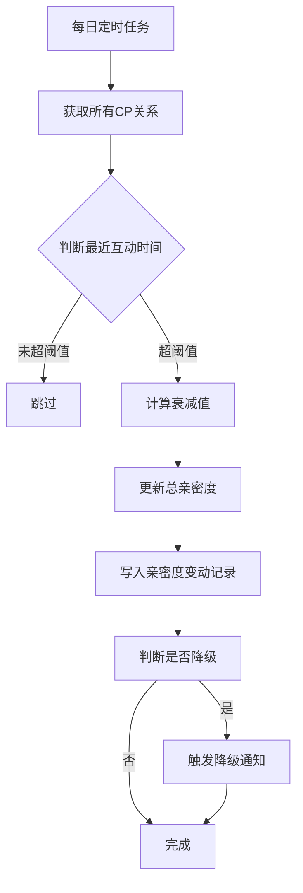

#### 边界规则

| 规则 | 说明 |
|---|---|
| 最低值保护 | 亲密度不得低于当前等级最低值 |
| 降级缓冲期 | 连续3天衰减后才触发降级 |
| 新绑定保护 | 绑定后3天内不触发衰减 |
| 并发处理 | 衰减执行时若发生送礼，以最新状态为准 |

#### 榜单影响

| 数据类型 | 是否受衰减影响 | 说明 |
|---|---|---|
| 总亲密度 | 是 | 等级判断基于此值 |
| 本周贡献值 | 否 | 榜单数据不受影响 |

#### 用户感知

| 触发时机 | 提示内容 |
|---|---|
| 2天无互动 | 「已连续2天未互动，亲密度 即将衰减」 |
| 衰减发生时 | 「亲密度 -XXX（关系冷却中）」 |
| 衰减后 | 「去互动保持关系」 |

---

### 系统提示邀请CP弹窗逻辑

#### 功能背景

在用户高频互动场景下，系统主动提示用户发起CP邀请，提升CP绑定转化率。

#### 适用范围

- 房间内聊天场景
- 私聊聊天场景

#### 触发前置条件（必须全部满足）

| 条件类型 | 具体条件 |
|---|---|
| 用户关系条件 | 双方均未绑定CP |
| 用户关系条件 | 双方未互相拉黑 |
| 用户关系条件 | 双方均未开启「自动拒绝CP邀请」 |
| 用户关系条件 | 双方未存在未处理的CP邀请 |
| 用户状态条件 | 至少一方处于当前会话场景 |
| 用户状态条件 | 对方最近活跃（5分钟内，可配置） |
| 风控条件 | 未命中骚扰限制 |
| 风控条件 | 未在冷却周期内 |

#### 触发行为类型（满足任一）

| 行为类型 | 触发阈值 | 说明 |
|---|---|---|
| 聊天触发 | 连续发送消息 ≥ 5条 | 可配置阈值 |
| 礼物触发 | 向对方送礼 ≥ 1次 | - |
| 综合触发 | T分钟内同时存在聊天+送礼 | 可配置时间窗口 |

**说明：** 所有阈值由后台配置，不写死。

#### 弹窗展示规则

| 规则项 | 说明 |
|---|---|
| 展示对象 | 仅对「邀请者」展示提示弹窗 |
| 展示内容 | 双方头像 + CP关系icon + 文案提示 + CP权益展示 |
| 文案示例 | 「你们关系不错，可以成为CP」 |

#### 防打扰策略（强制要求）

| 策略类型 | 规则 |
|---|---|
| 用户级频控 | 每个用户每日最多触发 N 次（默认2次） |
| 关系级频控 | 同一对用户24小时内最多触发1次 |
| 冷却机制 | 用户关闭弹窗后，当天不再触发 |
| 不再提示 | 用户勾选后，永久关闭 |
| 高风险用户限制 | 被标记为骚扰用户，不触发该功能 |

#### 用户操作流程

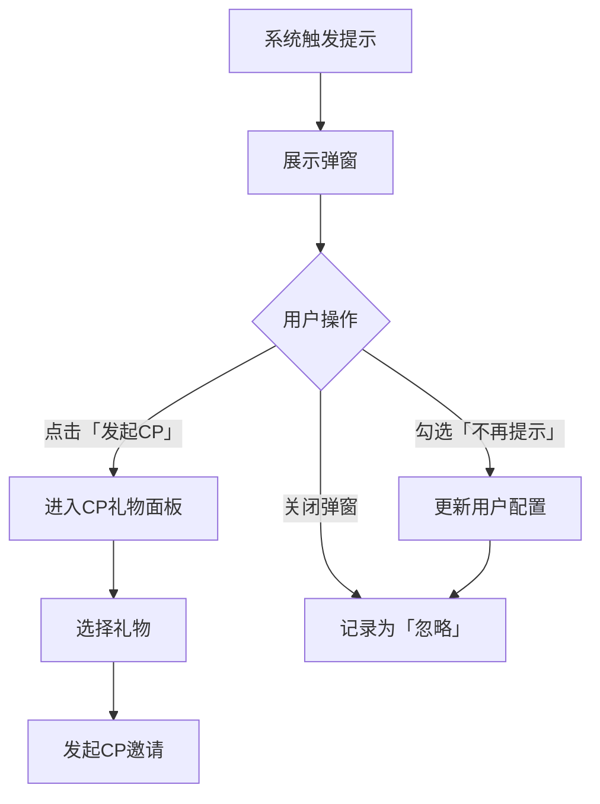

#### 异常处理

| 场景 | 处理方式 |
|---|---|
| 弹窗展示期间任一方已绑定CP | 不允许发起，提示失败原因 |
| 被邀请者离线 | 仍允许发起，延迟触达 |
| 同一用户短时间重复发起 | 拦截或合并 |

#### 运营配置项

| 配置项 | 说明 |
|---|---|
| 触发阈值（聊天次数/礼物） | 控制触发敏感度 |
| 每日触发次数上限 | 控制打扰程度 |
| 冷却时间 | 关闭后多久可再次触发 |
| 文案内容（多语言） | 适配不同区域 |
| 功能开关 | 可全局关闭 |

---

### 汇率换算规则

#### 货币与亲密度换算

| 换算项 | 换算公式 | 说明 |
|---|---|---|
| 金币与美元 | 1 USD = 10,000 金币 | 固定汇率 |
| 普通礼物亲密度 | 1 金币 = 1 亲密度 | 基础换算 |
| CP专属礼物亲密度 | 1 金币 = 1.3 亲密度 | 1.3倍加成（可配置） |
| 幸运礼物亲密度 | 1 金币 = 0.2 亲密度 | 折损80%（风控） |

#### 幸运礼物折损规则

| 规则项 | 说明 |
|---|---|
| 折损比例 | 仅20%计入亲密度 |
| 计算公式 | 亲密度 = 礼物金币 × 0.2 |
| 设计目的 | 防止通过幸运礼物刷亲密度 |
| 客户端提示 | 赠送幸运礼物时必须展示「亲密度按20%计入」提示，避免用户投诉 |

#### 配置管理

| 配置项 | 配置方式 |
|---|---|
| 金币汇率 | 后台全局配置 |
| CP礼物加成倍率 | 礼物级别配置，可针对不同礼物设置不同倍率 |
| 幸运礼物折损系数 | 后台全局配置 |

---

### 冷却机制

#### 解绑冷却期

| 规则项 | 默认值 | 说明 |
|---|---|---|
| 冷却期时长 | 7天 | 解绑后7天内不可与同一用户再次绑定 |
| 适用范围 | 同一CP对 | 仅限制与原CP绑定，不限制与他人绑定 |
| 设计目的 | 防止反复解绑刷奖励 |

#### 邀请冷却期

| 规则项 | 默认值 | 说明 |
|---|---|---|
| 同用户邀请上限 | 每日3次 | 向同一用户每日最多发起3次邀请 |
| 超限处理 | toast提示「今日邀请次数已达上限」 |

#### 弹窗冷却期

| 规则项 | 默认值 | 说明 |
|---|---|---|
| 关闭后冷却 | 当天不再触发 | 用户关闭系统提示弹窗后，当天不再展示 |
| 勾选「不再提示」| 永久关闭 | 需用户主动在设置中开启 |


## 业务流程图

以下流程图展示核心业务逻辑的流转路径。


### 一、CP邀请发起流程

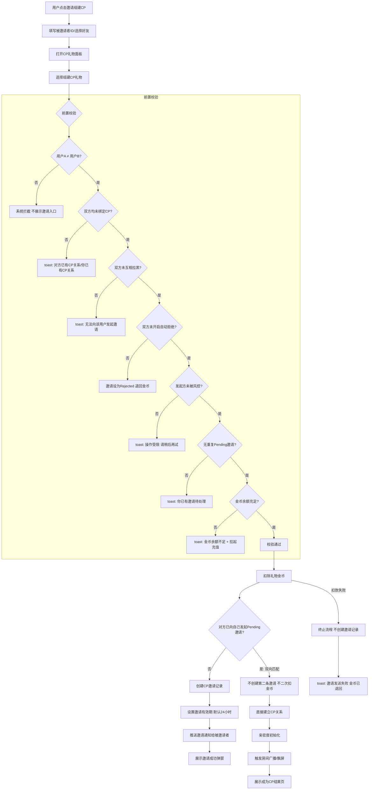

**核心规则确认**：
- 邀请前置校验必须全部通过才能继续
- 扣款成功但邀请创建失败必须回滚金币
- 双向匹配时后发起方不二次扣款


### 二、CP邀请状态流转图

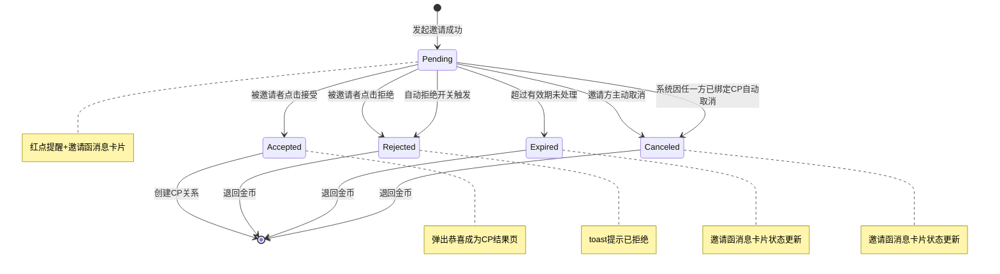


### 三、接受CP邀请流程

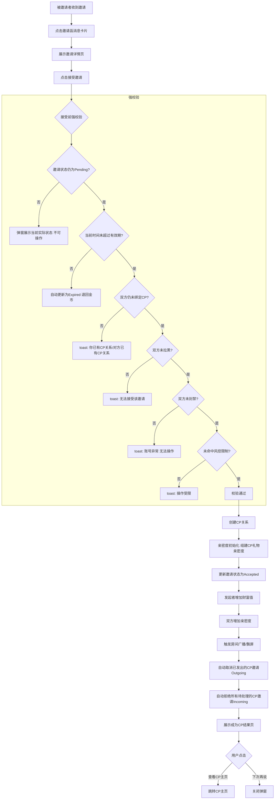

**接受后执行逻辑**：
1. 创建CP关系 → 亲密度初始化为组建CP礼物的亲密度值
2. 更新邀请状态为Accepted
3. 发起者增加财富值（1金币=1财富值）
4. 双方增加亲密度（1金币=1.5亲密值）
5. 触发房间广播/飘屏（按组建CP礼物配置决定是否全服飘屏）
6. **自动取消**已发出的CP邀请（Outgoing）→ 原邀请金币全额退回
7. **自动拒绝**所有待处理的CP邀请（Incoming）→ 原邀请金币全额退回
8. 展示成为CP结果页


### 四、拒绝CP邀请流程

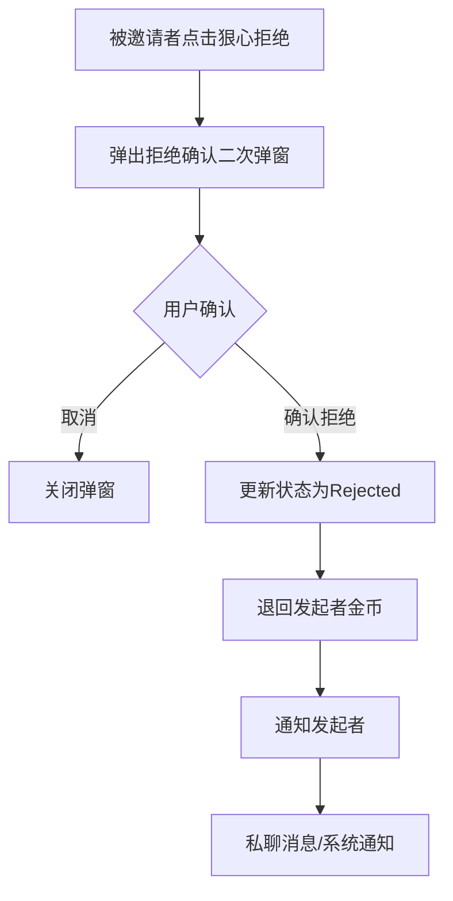

**拒绝后执行逻辑**：
- 更新状态为Rejected
- 退回发起者金币
- 通知发起者（私聊消息/系统通知）


### 五、CP解绑流程

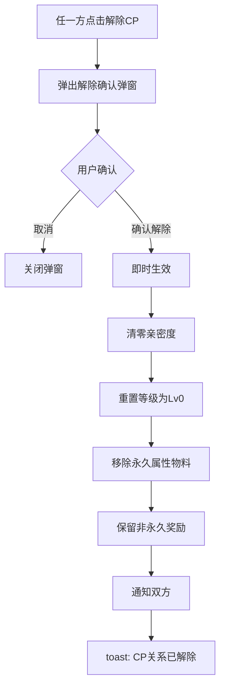

**解绑处理逻辑**：
- 亲密度清零（非保留）
- 榜单本周期贡献值保留至周期结束
- 等级重置为Lv0
- 永久属性物料降级至Lv0对应物料
- 非永久奖励不回收
- 组建CP礼物不退回
- 可随时重新绑定（无固定冷静期）


### 六、CP送礼亲密度增长流程

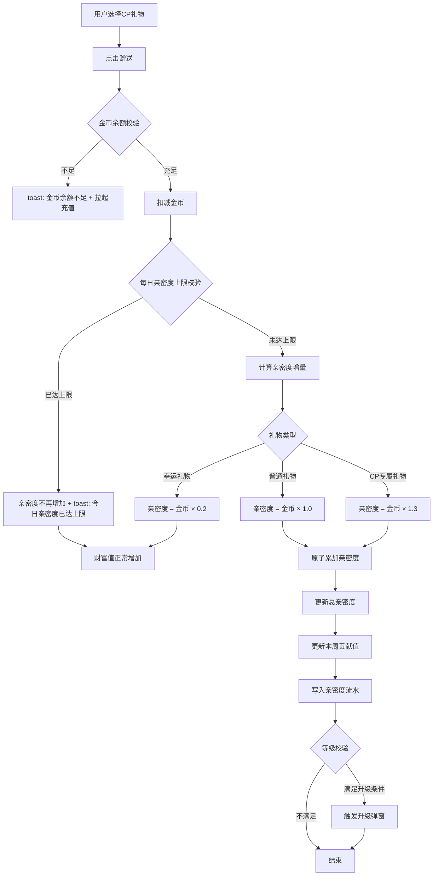

**亲密度写入规则**：
- 写入时机：每次有效送礼
- 写入内容：同时更新总亲密度 + 本周贡献值 + 写入亲密度流水
- 衰减写入：仅更新总亲密度，不影响本周贡献值
- 多端并发送礼：必须使用原子累加/事务写入
- 每日亲密度上限：按UTC+3自然日统计


### 七、衰减机制流程

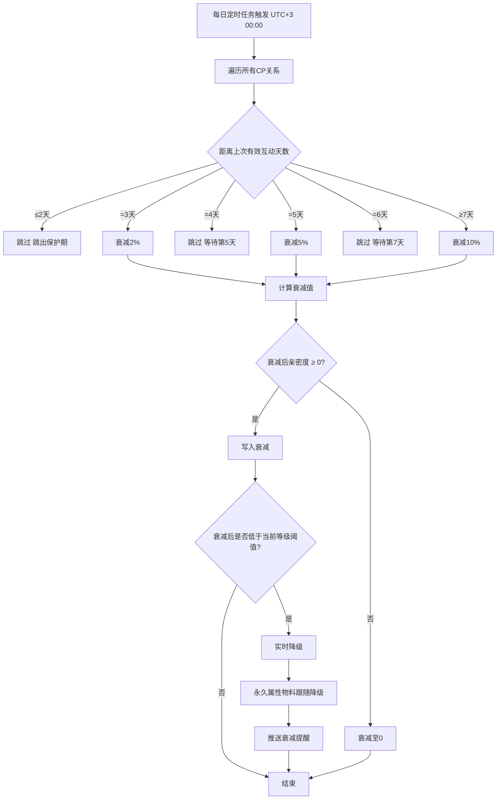

**衰减规则确认**：
- 新绑定保护期（降级缓冲期）：绑定后3天内不触发衰减
- 衰减范围：仅影响总亲密度，不影响本周贡献值
- 数值下限：衰减后亲密度不得低于0，降至0时停止衰减
- 等级联动：衰减后如低于当前等级阈值 → 等级实时降级


### 八、CP等级升降级流程

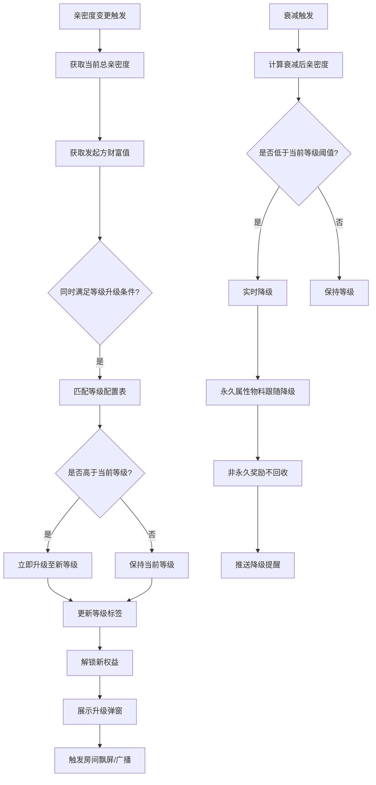

**等级计算规则**：
- 升级条件：总亲密度 ≥ 等级下限 **且** 发起方财富值 ≥ 等级下限
- 降级条件：总亲密度低于当前等级下限（因衰减）
- 升级时机：亲密度写入后实时检测
- 降级时机：衰减后实时检测
- 新CP初始等级：Lv1


### 九、系统提示弹窗触发流程

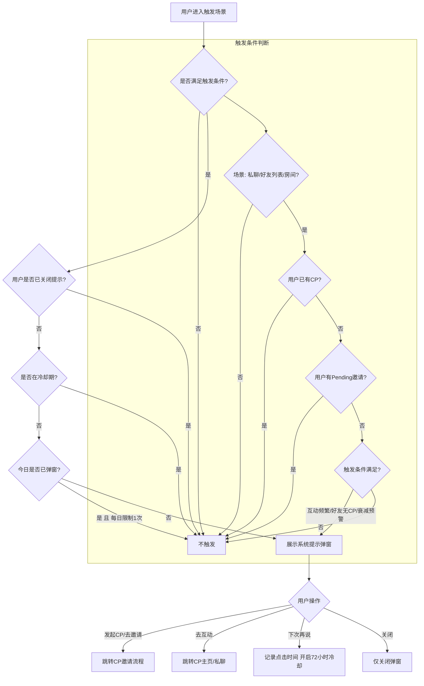


---

## 一、客户端（APP端）

### 1. CP邀请模块

#### 模块背景

CP邀请模块是用户建立CP关系入口，包含发起邀请、接受邀请、拒绝邀请、邀请列表和邀请详情等功能。用户可通过多种入口发起CP邀请，被邀请者收到邀请后可接受或拒绝。

#### 用户场景

1. 用户A在个人主页或好友列表看到心仪对象，发起CP邀请
2. 用户B收到CP邀请通知，点击查看邀请详情，选择接受或拒绝
3. 用户A查看自己发出的邀请状态（待处理/已接受/已拒绝/已过期）

#### 对应原型


---

### 1.1 CP邀请发起入口

#### 功能说明

用户通过多种入口发起CP邀请，选择组建CP礼物后发送邀请给目标用户。

#### 对应原型


#### 前置条件

| 条件 | 说明 |
|---|---|
| 用户已登录 | 未登录用户不可见CP入口 |
| 用户未绑定CP | 已绑定CP用户发起邀请时toast提示「你已有CP关系」 |
| 目标用户未绑定CP | 目标用户已绑定CP时toast提示「对方已有CP关系」 |
| 双方未互相拉黑 | 拉黑状态下toast提示「无法向该用户发起邀请」 |
| 双方未开启自动拒绝 | 目标用户开启自动拒绝时邀请直接被设为Rejected，原路退回金币 |
| 金币余额充足 | 余额不足时拉起充值页 |
| 不存在重复Pending邀请 | 存在待处理邀请时toast提示「你已有邀请待处理」 |

#### 触发方式

| 入口 | 触发方式 |
|---|---|
| CP主页邀请输入框 | 输入用户ID/靓号 → 点击搜索 → 点击「邀请组建CP」 |
| 好友推荐列表卡片 | 点击「邀请组建CP」按钮 |
| 用户资料卡「+」按钮 | 点击他人资料页「+」按钮 |
| 系统自动提示弹窗 | 点击「发起CP」按钮 |
| 房间礼物面板CP分类 | 选择组建CP礼物 → 点击赠送 |

#### 字段与数据来源

| 字段 | 说明 | 统计方式 | 数据来源 |
|---|---|---|---|
| 目标用户ID | 被邀请者唯一标识 | 直接输入或选择 | 用户输入/好友列表 |
| 目标用户昵称 | 被邀请者显示名称 | 直接读取 | 用户中心 |
| 目标用户头像 | 被邀请者头像URL | 直接读取 | 用户中心 |
| 目标用户等级 | 财富/魅力等级 | 直接读取 | 用户等级表 |
| 组建CP礼物列表 | 可选礼物清单 | 读取配置 | 礼物配置表，筛选type=组建CP |
| 礼物金币价值 | 单个礼物价值 | 直接读取 | 礼物配置表 |
| 礼物亲密度加成 | 组建CP礼物倍率 | 读取配置 | 礼物配置表，默认1.5倍 |
| 发起者金币余额 | 当前可用金币 | 实时读取 | 用户资产表 |
| 邀请有效期 | 邀请已过期时间 | 读取配置+计算 | 配置表默认24小时，服务端UTC+3时间计算 |

#### 交互逻辑

**发起流程：**

1. 用户点击CP入口（资料卡「+」/好友列表「邀请组建CP」/礼物面板CP分类）
2. 系统弹出CP邀请弹窗，展示目标用户信息和组建CP礼物列表
3. 用户选择礼物 → 底部实时显示总价和亲密度预览
4. 用户点击「发起CP邀请（X金币）」按钮
5. 系统执行前置校验（见上表）
6. 若校验通过：扣减金币 → 创建邀请记录 → 发送通知给被邀请者 → 展示邀请成功弹窗
7. 若校验不通过：toast提示对应错误信息

**扣费失败处理：**

1. 金币余额不足 → toast提示「金币余额不足，请充值」→ 拉起半屏充值页面
2. 扣费成功但邀请创建失败 → 回滚金币 → toast提示「邀请发送失败，请稍后重试」

#### 服务端核心逻辑

| 步骤 | 逻辑 |
|---|---|
| 1. 身份校验 | 验证用户token有效，查询用户状态 |
| 2. 关系校验 | 查询cp_relation表，确认发起者和目标用户均未绑定CP |
| 3. 黑名单校验 | 查询黑名单表，确认双方未互相拉黑 |
| 4. 自动拒绝校验 | 查询目标用户配置，若开启自动拒绝则直接返回Rejected状态 |
| 5. 重复邀请校验 | 查询cp_invite表，确认无相同用户对的Pending状态邀请 |
| 6. 风控校验 | 查询风控表，确认发起者未被限制CP功能 |
| 7. 金币扣减 | 调用资产服务扣减礼物对应金币数量 |
| 8. 创建邀请记录 | 写入cp_invite表，状态为Pending，设置已过期时间（UTC+3） |
| 9. 推送通知 | 调用消息服务，向被邀请者推送邀请通知卡片 |
| 10. 返回结果 | 返回成功或失败信息 |

**幂等性保证：**

- 邀请记录使用唯一索引（发起者ID + 被邀请者ID + 创建时间戳）
- 金币扣减使用事务，失败则回滚

#### 权限控制

| 权限 | 说明 |
|---|---|
| 普通用户 | 可发起CP邀请 |
| 封禁用户 | 不可发起CP邀请 |
| 风控限制用户 | 限制发起频率或禁止发起 |

#### 状态设计

| 状态 | 英文 | 触发条件 | 说明 |
|---|---|---|---|
| 待处理 | Pending | 邀请创建成功 | 等待被邀请者响应 |
| 已接受 | Accepted | 被邀请者点击接受 | CP关系建立成功 |
| 已拒绝 | Rejected | 被邀请者点击拒绝 / 目标用户开启自动拒绝 | 金币退回发起者 |
| 已过期 | Expired | 超过有效期未响应 | 金币自动退回 |
| 已取消 | Canceled | 发起者建立其他CP关系后自动取消 | 金币退回 |

#### 边界情况

| 场景 | 处理方式 |
|---|---|
| 发起过程中目标用户绑定CP | 邀请创建失败，toast提示「对方已有CP关系」 |
| 发起过程中发起者绑定CP | 邀请创建失败，toast提示「你已有CP关系」 |
| 网络中断 | 显示loading，重试3次，失败则toast提示网络错误 |
| 服务端超时 | 超时5秒后toast提示「请求超时，请稍后重试」 |

---

### 1.2 CP邀请接受

#### 功能说明

被邀请者收到CP邀请后，查看邀请详情并选择接受，建立CP关系。

#### 对应原型


#### 前置条件

| 条件 | 说明 |
|---|---|
| 邀请状态为Pending | 已过期/已取消/已拒绝的邀请不可接受 |
| 当前时间未超过有效期 | 超时自动变更为Expired |
| 双方仍未绑定CP | 任一方已绑定CP则接受失败 |
| 邀请未被风控拦截 | 风控拦截的邀请不可接受 |

#### 触发方式

| 入口 | 触发方式 |
|---|---|
| 私聊邀请函消息卡片 | 点击「接受邀请」按钮 |
| 邀请详情页 | 点击「接受邀请」按钮 |
| CP主页邀请列表 | 点击待处理邀请 → 点击「接受」 |

#### 字段与数据来源

| 字段 | 说明 | 统计方式 | 数据来源 |
|---|---|---|---|
| 邀请ID | 唯一标识 | 直接读取 | cp_invite表 |
| 发起者ID | 邀请者用户ID | 直接读取 | cp_invite表 |
| 发起者昵称 | 邀请者显示名称 | 关联查询 | 用户中心 |
| 发起者头像 | 邀请者头像URL | 关联查询 | 用户中心 |
| 礼物信息 | 礼物图标+名称+价值 | 直接读取 | cp_invite表关联礼物配置 |
| 邀请创建时间 | 邀请发起时间 | 直接读取 | cp_invite表 |
| 邀请已过期时间 | 倒计时显示 | 计算：已过期时间-当前时间 | cp_invite表 |
| 亲密度预览 | 接受后初始亲密度 | 计算：礼物金币×1.5 | 礼物配置+计算 |

#### 交互逻辑

**接受流程：**

1. 被邀请者收到邀请通知卡片（私聊消息卡片形式）
2. 点击卡片展开邀请详情弹窗
3. 弹窗展示：发起者头像+昵称、礼物信息、亲密度预览、剩余时间
4. 用户点击「接受邀请」按钮
5. 系统执行校验：邀请状态、已过期时间、双方CP状态
6. 若校验通过：
   - 创建CP关系记录
   - 初始化亲密度（礼物金币×1.5）
   - 更新邀请状态为Accepted
   - 触发房间广播（如在房间内）
   - 自动取消用户发出的其他Pending邀请
   - 自动拒绝用户收到的其他Pending邀请
   - 给发起者增加财富值（礼物金币×1）
7. 弹出「恭喜成为CP」结果页
8. 若校验不通过：toast提示对应错误

#### 服务端核心逻辑

| 步骤 | 逻辑 |
|---|---|
| 1. 邀请状态校验 | 查询cp_invite表，确认状态为Pending |
| 2. 有效期校验 | 确认当前时间 < 已过期时间（UTC+3） |
| 3. 双方CP状态校验 | 查询cp_relation表，确认双方均未绑定 |
| 4. 创建CP关系 | 写入cp_relation表，状态为已绑定 |
| 5. 初始化亲密度 | 写入intimacy_log表，类型为组建CP礼物 |
| 6. 更新邀请状态 | 更新cp_invite表状态为Accepted |
| 7. 增加发起者财富值 | 更新发起者用户资产表 |
| 8. 清空其他邀请 | 更新用户发出的其他Pending邀请为Canceled |
| 9. 拒绝其他收到的邀请 | 更新用户收到的其他Pending邀请为Rejected |
| 10. 推送通知 | 向发起者推送「邀请被接受」通知 |
| 11. 触发广播 | 若双方在同一房间，触发房间CP广播 |

**并发处理：**

- CP关系创建使用分布式锁（用户ID为key）
- 同时接受多个邀请时，仅第一个成功，后续返回「你已有CP关系」

#### 权限控制

| 权限 | 说明 |
|---|---|
| 被邀请者 | 仅被邀请者可接受该邀请 |
| 非被邀请者访问邀请详情 | 仅可查看，不可操作 |

#### 状态设计

接受成功后邀请状态变更为Accepted，CP关系状态为已绑定。

#### 边界情况

| 场景 | 处理方式 |
|---|---|
| 点击接受时邀请已过期 | toast提示「邀请已过期」，刷新状态为Expired |
| 点击接受时对方已绑定CP | toast提示「对方已有CP关系」，邀请自动变更为Canceled |
| 双方同时互相发起邀请 | 后发起方自动接受对方邀请，不重复扣款 |

---

### 1.3 CP邀请拒绝

#### 功能说明

被邀请者选择拒绝CP邀请，金币退回发起者。

#### 对应原型


#### 前置条件

| 条件 | 说明 |
|---|---|
| 邀请状态为Pending | 已过期/已取消的邀请不可拒绝 |

#### 触发方式

| 入口 | 触发方式 |
|---|---|
| 邀请详情弹窗 | 点击「狠心拒绝」按钮 → 弹出二次确认弹窗 → 点击确认 |
| 邀请列表 | 左滑删除/点击拒绝按钮 |

#### 字段与数据来源

| 字段 | 说明 | 统计方式 | 数据来源 |
|---|---|---|---|
| 邀请ID | 唯一标识 | 直接读取 | cp_invite表 |
| 发起者ID | 邀请者用户ID | 直接读取 | cp_invite表 |
| 礼物金币价值 | 待退回金额 | 直接读取 | cp_invite表关联礼物配置 |

#### 交互逻辑

**拒绝流程：**

1. 用户在邀请详情弹窗点击「狠心拒绝」
2. 弹出二次确认弹窗：「确定拒绝该邀请？拒绝后金币将退回对方」
3. 用户点击「确认拒绝」
4. 系统更新邀请状态为Rejected
5. 金币原路退回发起者
6. 向发起者推送「邀请被拒绝」通知
7. toast提示「已拒绝」，弹窗关闭

#### 服务端核心逻辑

| 步骤 | 逻辑 |
|---|---|
| 1. 邀请状态校验 | 确认状态为Pending |
| 2. 更新邀请状态 | 更新cp_invite表状态为Rejected |
| 3. 退回金币 | 调用资产服务，给发起者增加对应金币 |
| 4. 推送通知 | 向发起者推送拒绝通知 |
| 5. 写入流水 | 记录金币退回流水 |

#### 边界情况

| 场景 | 处理方式 |
|---|---|
| 用户接受某邀请后 | 自动拒绝其他Pending邀请，金币退回各发起者 |
| 拒绝时网络中断 | 重试3次，失败则toast提示网络错误 |
| 拒绝后再次邀请 | 被拒绝后可再次发起邀请，不受限制（每次邀请独立扣款） |

---

### 1.4 CP邀请列表

#### 功能说明

展示用户收到和发出的所有CP邀请记录，支持按状态筛选。

#### 对应原型


#### 前置条件

- 用户已登录

#### 触发方式

- 从CP主页「邀请记录」入口进入
- 从消息中心「CP邀请」入口进入

#### 字段与数据来源

| 字段 | 说明 | 统计方式 | 数据来源 |
|---|---|---|---|
| 邀请ID | 唯一标识 | 直接读取 | cp_invite表 |
| 对方用户ID | 发起者或被邀请者ID | 直接读取 | cp_invite表 |
| 对方昵称 | 显示名称 | 关联查询 | 用户中心 |
| 对方头像 | 头像URL | 关联查询 | 用户中心 |
| 礼物信息 | 图标+名称 | 关联查询 | 礼物配置表 |
| 邀请状态 | Pending/Accepted/Rejected/Expired/Canceled | 直接读取 | cp_invite表 |
| 创建时间 | 邀请发起时间 | 直接读取 | cp_invite表 |
| 剩余时间 | 仅Pending显示 | 计算：已过期时间-当前时间 | cp_invite表 |

#### 交互逻辑

1. 用户进入邀请列表页
2. 默认展示「收到的邀请」Tab，列出所有邀请记录
3. 支持切换「发出的邀请」Tab
4. 支持按状态筛选：全部/待处理/已完成
5. 点击某条邀请 → 跳转邀请详情页
6. Pending状态邀请：显示接受/拒绝按钮
7. 非Pending状态邀请：仅展示状态标签

#### 服务端核心逻辑

- 分页查询cp_invite表
- 根据用户ID筛选收到的或发出的邀请
- 关联查询用户信息和礼物信息

---

### 1.5 CP邀请详情

#### 功能说明

展示单条邀请的详细信息，Pending状态可进行接受/拒绝操作。

#### 对应原型


#### 前置条件

- 存在该邀请记录

#### 触发方式

- 从邀请列表点击某条邀请进入
- 从私聊邀请函消息卡片点击进入

#### 字段与数据来源

| 字段 | 说明 | 统计方式 | 数据来源 |
|---|---|---|---|
| 邀请ID | 唯一标识 | 直接读取 | cp_invite表 |
| 发起者信息 | 头像+昵称+等级 | 关联查询 | 用户中心+等级表 |
| 被邀请者信息 | 头像+昵称+等级 | 关联查询 | 用户中心+等级表 |
| 礼物信息 | 图标+名称+价值 | 关联查询 | 礼物配置表 |
| 邀请状态 | 状态标签 | 直接读取 | cp_invite表 |
| 创建时间 | 格式化时间 | 直接读取 | cp_invite表 |
| 已过期时间 | 倒计时 | 计算 | cp_invite表 |
| 亲密度预览 | 接受后获得 | 计算：金币×1.5 | 礼物配置+计算 |

#### 交互逻辑

**Pending状态：**

1. 展示双方信息、礼物信息、倒计时
2. 底部显示「接受邀请」和「狠心拒绝」两个按钮
3. 点击「接受邀请」→ 执行接受流程
4. 点击「狠心拒绝」→ 弹出二次确认 → 执行拒绝流程

**非Pending状态：**

1. 展示双方信息、礼物信息、状态标签
2. 底部无操作按钮
3. 状态标签：Accepted（已接受）、Rejected（已拒绝）、Expired（已过期）、Canceled（已取消）


---

### 2. CP主页模块

#### 模块背景

CP主页是用户查看自己CP关系状态、亲密度、等级、礼物记录等信息的核心页面。未绑定CP的用户可在此发起邀请，已绑定CP的用户可查看CP详情、维护记录、礼物记录等。

#### 用户场景

1. 未绑定用户：查看CP入口、发起邀请输入框、邀请记录
2. 已绑定用户：查看CP头像、亲密度、等级、亲密度变动记录、维护记录
3. 查看CP礼物记录：互相赠送的礼物列表
4. 查看CP等级详情：等级规则、特权、进度

#### 对应原型


---

### 2.1 CP主页入口

#### 功能说明

从多个入口访问CP主页，根据用户绑定状态展示不同内容。

#### 对应原型


#### 前置条件

- 用户已登录

#### 触发方式

| 入口 | 触发方式 |
|---|---|
| 底部导航栏「CP」Tab | 点击直接进入 |
| 个人主页「我的CP」卡片 | 点击进入 |
| 房间内CP头像 | 点击进入 |
| 好友列表CP入口 | 点击进入 |

#### 字段与数据来源

| 字段 | 说明 | 统计方式 | 数据来源 |
|---|---|---|---|
| 用户CP状态 | 已绑定/未绑定 | 查询 | cp_relation表 |
| CP对象信息 | 头像+昵称+ID | 关联查询 | 用户中心 |
| CP亲密度 | 当前值 | 直接读取 | cp_relation表 |
| CP等级 | 当前等级 | 计算：根据亲密度匹配等级表 | cp_level_config表 |
| CP绑定时间 | 建立时间 | 直接读取 | cp_relation表 |

#### 交互逻辑

**未绑定用户：**

1. 展示「寻找你的CP」引导页
2. 顶部显示邀请输入框（搜索用户ID/靓号）
3. 下方展示「邀请记录」入口
4. 底部展示CP功能介绍卡片

**已绑定用户：**

1. 顶部展示双方头像（CP头像区）
2. 显示CP昵称、ID、亲密度、等级
3. 下方展示：亲密度变动记录、维护记录、礼物记录、等级详情入口
4. 底部显示「解除CP」入口（弱化按钮）

#### 服务端核心逻辑

- 查询cp_relation表，判断用户CP状态
- 若已绑定，关联查询CP对象信息和亲密度_log 表
- 若未绑定，查询是否有待处理邀请（展示红点）

---

### 2.2 CP亲密度展示

#### 功能说明

展示当前亲密度值、等级进度条、距离下一等级所需亲密度。

#### 对应原型


#### 字段与数据来源

| 字段 | 说明 | 统计方式 | 数据来源 |
|---|---|---|---|
| 当前亲密度 | 总值 | 直接读取 | cp_relation表 |
| 当前等级 | 等级数字 | 匹配计算 | cp_level_config表 |
| 等级图标 | 等级徽章URL | 直接读取 | cp_level_config表 |
| 下一等级亲密度 | 升级所需值 | 直接读取 | cp_level_config表 |
| 进度百分比 | 当前进度 | 计算：(当前-本级起点)/(下一级-本级起点)×100% | 计算得出 |

#### 交互逻辑

1. 展示亲密度 数字（如：12,580）
2. 展示等级图标和等级名称（如：Lv.5 默契CP）
3. 展示进度条（当前亲密度 到下一级的进度）
4. 点击进度条 → 跳转等级详情页

---

### 2.3 CP亲密度变动记录

#### 对应原型


#### 对应原型


#### 功能说明

展示近期亲密度变动明细，包含变动类型、时间、数值变化。

#### 对应原型


#### 前置条件

- 用户已绑定CP

#### 触发方式

- 从CP主页点击「亲密度变动记录」入口

#### 字段与数据来源

| 字段 | 说明 | 统计方式 | 数据来源 |
|---|---|---|---|
| 记录ID | 唯一标识 | 直接读取 | intimacy_log表 |
| 变动类型 | 赠送礼物/维护奖励/首次绑定/系统补偿 | 直接读取 | intimacy_log表 |
| 变动值 | 正数或负数 | 直接读取 | intimacy_log表 |
| 变动后总额 | 该记录后的亲密度总值 | 直接读取 | intimacy_log表 |
| 时间 | 记录时间 | 直接读取 | intimacy_log表 |
| 关联礼物 | 若为礼物赠送，展示礼物图标 | 关联查询 | 礼物配置表 |

#### 交互逻辑

1. 列表展示亲密度 变动记录
2. 支持按类型筛选：全部/礼物赠送/维护奖励/其他
3. 每条记录展示：类型图标+描述+数值（+/-）+时间
4. 点击某条礼物记录 → 跳转礼物详情

---

### 2.4 CP维护记录

#### 功能说明

展示CP日常维护记录，包含维护方式、时间、获得亲密度。

#### 对应原型


#### 前置条件

- 用户已绑定CP

#### 触发方式

- 从CP主页点击「维护记录」入口

#### 字段与数据来源

| 字段 | 说明 | 统计方式 | 数据来源 |
|---|---|---|---|
| 记录ID | 唯一标识 | 直接读取 | maintenance_log表 |
| 维护方式 | 房间连麦/发送消息/共同直播/赠送礼物 | 直接读取 | maintenance_log表 |
| 获得亲密度 | 本次维护获得的值 | 直接读取 | maintenance_log表 |
| 时间 | 维护时间 | 直接读取 | maintenance_log表 |

#### 交互逻辑

1. 列表展示维护记录
2. 支持按维护方式筛选
3. 每条记录展示：方式图标+描述+亲密度值+时间
4. 支持分页加载（每页20条）

---

### 2.5 CP解除入口

#### 功能说明

已绑定CP用户可选择解除CP关系，解除后亲密度 清零，双方恢复单身状态。

#### 前置条件

| 条件 | 说明 |
|---|---|
| 用户已绑定CP | 未绑定用户无此入口 |
| 无待处理的解除申请 | 已发起解除待确认时不可重复发起 |

#### 触发方式

- 从CP主页「设置」→「解除CP」
- 从CP主页底部弱化按钮

#### 交互逻辑

1. 用户点击「解除CP」
2. 弹出二次确认弹窗：「确定解除CP关系？解除后亲密度将清零，无法恢复」
3. 用户点击「确认解除」
4. 若为单方解除：写入解除申请记录，对方收到通知，24小时内确认后生效
5. 若为双方确认：双方确认后立即生效
6. 解除成功：toast提示「CP关系已解除」，返回CP主页（未绑定态）

#### 服务端核心逻辑

| 步骤 | 逻辑 |
|---|---|
| 1. 校验CP状态 | 确认用户已绑定CP |
| 2. 写入解除申请 | 写入cp_dissolution表，状态为Pending |
| 3. 推送通知 | 向对方推送解除申请通知 |
| 4. 24小时后自动生效 | 若对方无响应，24小时后自动解除 |
| 5. 若对方确认 | 立即生效 |
| 6. 清除CP关系 | 更新cp_relation表状态为已解除 |
| 7. 清零亲密度 | 更新亲密度 为0 |
| 8. 写入流水 | 记录解除原因和时间 |


---

### 3. CP礼物模块

#### 模块背景

CP礼物模块是用户通过赠送礼物增加亲密度 的核心功能。包含CP礼物列表、赠送流程、礼物记录、礼物特效等。

#### 用户场景

1. 用户在房间礼物面板选择CP礼物，赠送给对方
2. 用户查看赠送礼物获得的亲密度 加成
3. 用户查看双方互相赠送的礼物记录

#### 对应原型


---

### 3.1 CP礼物赠送入口

#### 功能说明

用户通过礼物面板选择CP礼物，赠送给CP对象或任意用户。

#### 对应原型


#### 前置条件

| 条件 | 说明 |
|---|---|
| 用户已登录 | 未登录不可赠送礼物 |
| 金币余额充足 | 余额不足时拉起充值 |
| 目标用户存在 | 用户ID有效 |

#### 触发方式

| 入口 | 触发方式 |
|---|---|
| 房间礼物面板CP分类 | 选择礼物 → 点击赠送 |
| 私聊礼物面板 | 点击「赠送礼物」→ 选择CP礼物 |
| 用户资料页礼物按钮 | 点击「+」→ 选择CP礼物 |
| CP主页礼物入口 | 点击「赠送礼物」→ 选择礼物 |

#### 字段与数据来源

| 字段 | 说明 | 统计方式 | 数据来源 |
|---|---|---|---|
| 礼物ID | 唯一标识 | 直接读取 | gift_config表 |
| 礼物名称 | 显示名称 | 直接读取 | gift_config表 |
| 礼物图标 | 图片URL | 直接读取 | gift_config表 |
| 礼物金币价值 | 单价 | 直接读取 | gift_config表 |
| 亲密度 加成倍率 | CP礼物专属倍率 | 直接读取 | gift_config表，type=CP_gift |
| 礼物特效 | 动效配置 | 直接读取 | gift_config表 |
| 是否双人礼物 | 是否同时展示双方头像 | 直接读取 | gift_config表 |

#### 交互逻辑

**赠送流程：**

1. 用户进入礼物面板，选择「CP礼物」分类
2. 展示CP礼物列表（仅CP礼物，按金币价值排序）
3. 用户选择礼物 → 底部显示总价和亲密度 预览
4. 若用户已绑定CP：
   - 默认赠送对象为CP
   - 可切换赠送其他用户（亲密度 加成降低）
5. 若用户未绑定CP：
   - 选择赠送对象
   - 若赠送组建CP礼物 → 触发CP邀请流程
6. 点击「赠送」按钮
7. 执行金币扣减 → 创建礼物记录 → 增加亲密度 → 触发房间特效
8. toast提示「赠送成功，获得X亲密度」

#### 服务端核心逻辑

| 步骤 | 逻辑 |
|---|---|
| 1. 金币扣减 | 调用资产服务，扣减礼物金币价值 |
| 2. 写入礼物记录 | 写入gift_log表 |
| 3. 增加亲密度 | 若赠送对象为CP，写入intimacy_log表，计算加成值 |
| 4. 触发特效 | 调用房间服务，播放礼物特效 |
| 5. 增加财富值 | 给接收者增加财富值（金币×1） |
| 6. 推送通知 | 向接收者推送礼物通知 |

**亲密度 加成计算：**

| 场景 | 加成倍率 |
|---|---|---|
| 赠送给CP | 配置倍率（默认1.5倍） |
| 赠送给非CP | 1倍（不加成） |
| 组建CP礼物 | 1.5倍（首次绑定） |

---

### 3.2 CP礼物记录

#### 功能说明

展示双方互相赠送的礼物记录，包含礼物信息、时间、亲密度 获得。

#### 对应原型


#### 前置条件

- 用户已绑定CP

#### 触发方式

- 从CP主页点击「礼物记录」入口

#### 字段与数据来源

| 字段 | 说明 | 统计方式 | 数据来源 |
|---|---|---|---|
| 记录ID | 唯一标识 | 直接读取 | gift_log表 |
| 礼物信息 | 图标+名称+价值 | 关联查询 | gift_config表 |
| 赠送者ID | 赠送用户ID | 直接读取 | gift_log表 |
| 接收者ID | 接收用户ID | 直接读取 | gift_log表 |
| 获得亲密度 | 本次获得值 | 直接读取 | intimacy_log表 |
| 时间 | 赠送时间 | 直接读取 | gift_log表 |

#### 交互逻辑

1. 列表展示礼物记录，按时间倒序
2. 支持按赠送方筛选：「我送的」/「TA送的」/「全部」
3. 每条记录展示：礼物图标+名称+金币+亲密度+时间
4. 支持分页加载（每页20条）

---

### 3.3 CP礼物特效

#### 功能说明

赠送CP礼物时在房间内播放专属特效，包含双人头像展示、亲密度 数值飘字等。

#### 对应原型


#### 字段与数据来源

| 字段 | 说明 | 统计方式 | 数据来源 |
|---|---|---|---|
| 特效类型 | 全屏/局部/飘字 | 直接读取 | gift_config表 |
| 特效时长 | 播放时长（秒） | 直接读取 | gift_config表 |
| 双人头像 | 是否展示双方头像 | 直接读取 | gift_config表 |
| 亲密度 飘字 | 是否展示获得值 | 直接读取 | gift_config表 |

#### 交互逻辑

1. 赠送CP礼物成功后
2. 房间内播放礼物特效（全屏动画）
3. 若为双人礼物：展示双方头像环绕动画
4. 飘字显示：「亲密度 +X」
5. 特效播放完毕后消失


---

### 4. CP等级模块

#### 模块背景

CP等级模块定义了CP关系的等级体系，根据累计亲密度自动升级。不同等级享有不同特权，等级越高特权越丰富。等级是CP关系深度的可视化表达。

#### 用户场景

1. 用户查看当前CP等级和升级进度
2. 用户了解各等级特权和升级条件
3. 等级提升时收到升级通知和特权解锁提示

#### 对应原型


---

### 4.1 CP等级详情页

#### 功能说明

展示CP等级列表、各等级条件、当前等级进度、特权说明。

#### 对应原型


#### 前置条件

- 用户已绑定CP

#### 触发方式

| 入口 | 触发方式 |
|---|---|
| CP主页等级图标 | 点击等级图标 |
| CP主页进度条 | 点击进度条 |
| 消息中心升级通知 | 点击通知 |

#### 字段与数据来源

| 字段 | 说明 | 统计方式 | 数据来源 |
|---|---|---|---|
| 等级ID | 唯一标识 | 直接读取 | cp_level_config表 |
| 等级名称 | 显示名称 | 直接读取 | cp_level_config表 |
| 等级图标 | 徽章URL | 直接读取 | cp_level_config表 |
| 升级所需亲密度 | 门槛值 | 直接读取 | cp_level_config表 |
| 特权列表 | 该等级可用特权 | 关联查询 | cp_level_privilege表 |
| 当前亲密度 | 总值 | 直接读取 | cp_relation表 |
| 当前等级 | 等级数字 | 匹配计算 | cp_level_config表 |
| 升级进度 | 百分比 | 计算 | cp_relation表+cp_level_config表 |

#### 交互逻辑

1. 页面顶部展示当前等级信息（图标+名称+亲密度 值）
2. 中部展示等级列表（纵向排列）
3. 当前等级高亮，未达到等级灰色
4. 点击某等级 → 展开该等级特权详情
5. 底部展示升级攻略：「赠送礼物可快速提升亲密度」

#### 服务端核心逻辑

- 查询cp_level_config表，获取所有等级配置
- 查询cp_relation表，获取当前亲密度
- 根据亲密度 匹配当前等级
- 关联查询各等级特权列表

**等级升级判断逻辑：**

```
当前亲密度 >= 该等级最低亲密度 且 < 下一等级最低亲密度 → 该等级
```

**升级触发时机：**

- 亲密度 变动后实时判断
- 若超过下一等级门槛 → 触发升级事件
- 升级事件：推送通知、更新等级图标、解锁特权

---

### 4.2 CP等级特权

#### 功能说明

各等级对应的特权功能，包含专属标识、进场特效、专属礼物、房间特权等。

#### 对应原型


#### 字段与数据来源

| 字段 | 说明 | 统计方式 | 数据来源 |
|---|---|---|---|
| 特权ID | 唯一标识 | 直接读取 | cp_level_privilege表 |
| 特权名称 | 显示名称 | 直接读取 | cp_level_privilege表 |
| 特权图标 | 图标URL | 直接读取 | cp_level_privilege表 |
| 特权描述 | 功能说明 | 直接读取 | cp_level_privilege表 |
| 最低等级 | 解锁等级 | 直接读取 | cp_level_privilege表 |

#### 等级特权列表（示例配置）

| 等级 | 亲密度 门槛 | 特权 |
|---|---|---|
| Lv.1 初识CP | 0 | CP头像框 |
| Lv.2 相识CP | 500 | 进场提示 |
| Lv.3 暧昧CP | 2,000 | 专属聊天气泡 |
| Lv.4 甜蜜CP | 5,000 | 专属礼物特效 |
| Lv.5 默契CP | 12,000 | 双人进场特效 |
| Lv.6 甜蜜CP | 30,000 | 专属头像框+进场特效+房间特权 |
| Lv.7 灵魂CP | 60,000 | 全部特权+专属称号 |

**注意：** 以上为示例配置，实际等级和门槛以后台配置表为准。

#### 交互逻辑

1. 用户点击某等级 → 展开特权列表
2. 已解锁特权：正常显示
3. 未解锁特权：灰色+锁图标，标注「Lv.X解锁」
4. 点击某特权 → 展示特权详情和效果预览

---

### 4.3 CP等级升级通知

#### 功能说明

CP等级提升时，向双方推送升级通知。

#### 触发方式

- 亲密度 达到升级门槛时自动触发

#### 交互逻辑

1. 亲密度 变动后判断是否升级
2. 若升级 → 推送通知给双方：「恭喜！你们的CP等级已升级为Lv.X」
3. 通知卡片展示：新等级图标+名称+新解锁特权
4. 点击通知 → 跳转等级详情页
5. 房间内展示升级特效（若双方在房间内）

#### 服务端核心逻辑

| 步骤 | 逻辑 |
|---|---|
| 1. 亲密度 变动 | 写入intimacy_log表 |
| 2. 计算新等级 | 根据累计亲密度 匹配等级表 |
| 3. 判断是否升级 | 新等级 > 旧等级 → 升级 |
| 4. 更新等级 | 更新cp_relation表等级字段 |
| 5. 推送通知 | 调用消息服务，向双方推送升级通知 |
| 6. 解锁特权 | 更新用户特权表 |
| 7. 触发房间特效 | 若双方在房间内，播放升级特效 |


---

### 5. CP榜单模块

#### 模块背景

CP榜单模块展示全站CP亲密度 排名，包含日榜、周榜、月榜、总榜。上榜CP可获得额外曝光和特权奖励。榜单是CP系统的社交竞争元素。

#### 用户场景

1. 用户浏览CP榜单，查看当前热门CP
2. 用户查看自己和CP的排名和亲密度
3. 榜单结算时上榜CP获得奖励

#### 对应原型


---

### 5.1 CP榜单列表

#### 功能说明

展示各周期CP亲密度 排名，支持切换周期查看。

#### 对应原型


#### 前置条件

- 用户已登录

#### 触发方式

| 入口 | 触发方式 |
|---|---|
| 首页榜单入口 | 点击「CP榜」|
| 发现页榜单入口 | 点击「CP榜单」|

#### 字段与数据来源

| 字段 | 说明 | 统计方式 | 数据来源 |
|---|---|---|---|
| 排名 | 名次 | 直接读取 | cp_rank表 |
| CP信息 | 双方头像+昵称 | 关联查询 | 用户中心 |
| 亲密度 | 周期累计值 | 统计计算 | intimacy_log表 |
| 时间 | 榜单时间范围 | 直接读取 | 榜单配置 |

#### 交互逻辑

1. 默认展示日榜（当日亲密度 排名）
2. 支持切换：日榜/周榜/月榜/总榜
3. 列表展示Top100
4. 若用户已绑定CP，展示「我的排名」卡片（固定在顶部或列表中高亮）
5. 点击某CP → 跳转CP详情页（可查看头像、亲密度、等级等）
6. 榜单每小时更新一次

#### 服务端核心逻辑

**榜单数据生成：**

| 周期 | 统计范围 | 更新频率 |
|---|---|---|
| 日榜 | 当日00:00-23:59（UTC+3）亲密度 累计 | 每小时 |
| 周榜 | 本周一00:00-周日23:59（UTC+3）亲密度 累计 | 每小时 |
| 月榜 | 本月1日00:00-月末23:59（UTC+3）亲密度 累计 | 每小时 |
| 总榜 | 累计亲密度 | 每小时 |

**统计逻辑：**

```
周期亲密度 = SUM(intimacy_log表中该周期内intimacy_change)
```

---

### 5.2 CP榜单结算

#### 功能说明

榜单周期结束时，向Top N名CP发放奖励。

#### 奖励规则（示例配置）

| 榜单类型 | 奖励范围 | 奖励内容 |
|---|---|---|
| 日榜Top3 | 第1-3名 | 金币奖励+专属徽章 |
| 周榜Top10 | 第1-10名 | 金币奖励+限定礼物 |
| 月榜Top20 | 第1-20名 | 金币奖励+特权体验卡 |

**注意：** 实际奖励以后台配置为准。

#### 服务端核心逻辑

| 步骤 | 逻辑 |
|---|---|
| 1. 榜单结算触发 | 定时任务在周期结束时刻触发 |
| 2. 统计最终排名 | 统计该周期内亲密度 排名 |
| 3. 判断奖励范围 | 根据配置获取Top N |
| 4. 发放奖励 | 调用资产服务发放金币、徽章等 |
| 5. 写入流水 | 记录奖励发放记录 |
| 6. 推送通知 | 向上榜CP推送获奖通知 |

---

### 5.3 我的排名

#### 功能说明

已绑定CP用户在榜单中查看自己的排名和亲密度。

#### 对应原型


#### 前置条件

- 用户已绑定CP

#### 字段与数据来源

| 字段 | 说明 | 统计方式 | 数据来源 |
|---|---|---|---|
| 我的排名 | 当前名次 | 查询 | cp_rank表 |
| 我的亲密度 | 周期累计值 | 统计 | intimacy_log表 |
| 距离上一名差距 | 亲密度 差值 | 计算 | 排名数据 |

#### 交互逻辑

1. 若用户未上榜（排名>100），展示「未上榜」
2. 若用户上榜，展示排名和亲密度
3. 显示「距离上一名还差X亲密度」


---

### 6. CP设置模块

#### 模块背景

CP设置模块允许用户配置CP相关功能开关，包含自动拒绝邀请、隐私设置等。

#### 用户场景

1. 用户开启自动拒绝，避免收到CP邀请骚扰
2. 用户设置CP隐私，隐藏CP关系

---

### 6.1 CP设置入口

#### 功能说明

从CP主页或个人主页进入CP设置页。

#### 前置条件

- 用户已登录

#### 触发方式

| 入口 | 触发方式 |
|---|---|
| CP主页「设置」按钮 | 点击进入 |
| 个人主页「CP设置」| 点击进入 |

#### 设置项

| 设置项 | 说明 | 默认值 |
|---|---|---|
| 自动拒绝CP邀请 | 开启后自动拒绝所有CP邀请 | 关闭 |
| 隐藏CP关系 | 开启后他人不可见CP信息 | 关闭 |
| CP升级通知 | 开启后等级提升时推送通知 | 开启 |
| CP维护提醒 | 开启后长期未维护推送提醒 | 开启 |

#### 交互逻辑

1. 展示设置列表
2. 用户切换开关 → 保存设置
3. 自动拒绝开启后，现有Pending邀请不变更，新邀请自动拒绝

#### 服务端核心逻辑

| 步骤 | 逻辑 |
|---|---|
| 1. 读取用户配置 | 查询user_config表 |
| 2. 更新配置 | 更新user_config表 |
| 3. 返回结果 | 返回成功/失败 |

---

### 6.2 自动拒绝CP邀请

#### 功能说明

开启后，所有收到的CP邀请自动变为Rejected状态，金币原路退回发起者。

#### 对应原型


#### 前置条件

| 条件 | 说明 |
|---|---|
| 用户未绑定CP | 已绑定CP用户无此设置项 |

#### 交互逻辑

1. 用户进入CP设置页
2. 开启「自动拒绝CP邀请」开关
3. 二次确认弹窗：「开启后将自动拒绝所有CP邀请，是否确认？」
4. 确认后开启，所有新邀请自动拒绝
5. toast提示「已开启自动拒绝」

#### 服务端核心逻辑

| 步骤 | 逻辑 |
|---|---|
| 1. 更新配置 | 更新user_config表auto_reject_cp=true |
| 2. 新邀请到达时判断 | 查询配置，若开启则直接更新邀请状态为Rejected |
| 3. 退回金币 | 调用资产服务退回金币 |

---

### 7. 消息通知模块

#### 模块背景

CP系统涉及多种消息通知场景，包含邀请通知、接受/拒绝通知、升级通知、维护提醒等。

#### 通知类型

| 通知类型 | 触发场景 | 接收者 | 展示形式 |
|---|---|---|---|
| CP邀请通知 | 发起邀请 | 被邀请者 | 私聊邀请函卡片 |
| 邀请被接受通知 | 接受邀请 | 发起者 | 系统消息卡片 |
| 邀请被拒绝通知 | 拒绝邀请 | 发起者 | 系统消息卡片 |
| CP升级通知 | 等级提升 | 双方 | 系统消息卡片 |
| CP维护提醒 | 长期未维护 | 双方 | 系统消息卡片 |
| CP解体通知 | 解除CP关系 | 双方 | 系统消息卡片 |

---

### 7.1 CP邀请通知卡片

#### 功能说明

被邀请者收到CP邀请时，在私聊中展示邀请函卡片。

#### 对应原型


#### 字段与数据来源

| 字段 | 说明 | 统计方式 | 数据来源 |
|---|---|---|---|
| 邀请ID | 唯一标识 | 直接读取 | cp_invite表 |
| 发起者信息 | 头像+昵称 | 关联查询 | 用户中心 |
| 礼物信息 | 图标+名称 | 关联查询 | 礼物配置表 |
| 邀请时间 | 格式化时间 | 直接读取 | cp_invite表 |
| 已过期倒计时 | 剩余时间 | 计算 | cp_invite表 |

#### 交互逻辑

1. 邀请卡片展示：发起者头像+昵称+「邀请你组建CP」+礼物信息+倒计时
2. 卡片下方展示两个按钮：「接受邀请」/「拒绝」
3. 点击「接受邀请」→ 跳转邀请详情页并执行接受流程
4. 点击「拒绝」→ 弹出二次确认 → 执行拒绝流程
5. 点击卡片其他区域 → 跳转邀请详情页

---

### 7.2 CP升级通知

#### 功能说明

CP等级提升时，向双方推送升级通知。

#### 对应原型


#### 字段与数据来源

| 字段 | 说明 | 统计方式 | 数据来源 |
|---|---|---|---|
| 新等级 | 等级数字+名称 | 直接读取 | cp_level_config表 |
| 新等级图标 | 徽章URL | 直接读取 | cp_level_config表 |
| 新解锁特权 | 特权列表 | 关联查询 | cp_level_privilege表 |

#### 交互逻辑

1. 系统消息卡片展示：「恭喜！你和[CP昵称]的CP等级已升级为Lv.X」
2. 展示新等级图标和名称
3. 展示新解锁特权（若有）
4. 点击通知 → 跳转等级详情页

---

### 7.3 CP维护提醒

#### 功能说明

用户长期未维护CP关系时，推送提醒通知。

#### 前置条件

| 条件 | 说明 |
|---|---|
| 用户已绑定CP | 未绑定不触发 |
| 超过配置天数未维护 | 默认7天，可配置 |

#### 交互逻辑

1. 系统消息卡片展示：「你已X天未与CP互动，亲密度 可能会衰减哦」
2. 点击通知 → 跳转CP主页

---

### 7.4 CP解体通知

#### 功能说明

CP关系解除时，向双方推送通知。

#### 对应原型


#### 交互逻辑

1. 系统消息卡片展示：「你与[CP昵称]的CP关系已解除」
2. 若为对方发起解除：「[CP昵称]已解除与你的CP关系」
3. 点击通知 → 跳转CP主页（未绑定态）


---

### 8. CP入口与展示模块

#### 模块背景

CP功能在多个场景展示入口和信息，包含个人主页、私聊页、用户资料卡、房间内展示等。

---

### 8.1 个人主页CP入口

#### 功能说明

用户个人主页展示CP关系入口，可跳转CP主页或发起邀请。

#### 对应原型


#### 交互逻辑

**已绑定用户：**

1. 个人主页展示「我的CP」卡片，显示CP头像+昵称+亲密度
2. 点击卡片 → 跳转CP主页

**未绑定用户：**

1. 个人主页展示「寻找CP」卡片
2. 点击卡片 → 跳转CP主页（未绑定态）

---

### 8.2 用户资料卡CP入口

#### 功能说明

用户资料卡展示CP信息，并提供发起邀请入口。

#### 对应原型


#### 交互逻辑

**查看他人资料卡：**

1. 若对方已绑定CP：展示CP头像+昵称
2. 若对方未绑定CP：展示「发起CP邀请」按钮
3. 点击「发起CP邀请」→ 弹出CP邀请弹窗

**查看自己资料卡：**

1. 若已绑定CP：展示CP信息，点击跳转CP主页
2. 若未绑定CP：展示「寻找CP」入口

---

### 8.3 私聊页CP信息展示

#### 功能说明

私聊页面展示对方CP信息，支持展开查看详情。

#### 对应原型


#### 交互逻辑

1. 若对方已绑定CP：私聊顶部展示CP头像（可展开）
2. 点击展开：显示CP昵称+亲密度+等级
3. 若对方CP是自己：显示「你们是CP」标识
4. 若对方未绑定CP：显示「发起CP邀请」按钮

---

### 8.4 房间内CP展示

#### 功能说明

房间内展示CP信息，包含头像区、进场特效、礼物特效等。

#### 对应原型


#### 交互逻辑

1. 若用户已绑定CP且双方在同一房间：
   - 头像区展示CP头像环绕
   - 进场时播放双人进场特效（等级达到门槛后）
2. 赠送CP礼物时播放全服特效
3. 点击CP头像 → 跳转CP主页

---

### 8.5 CP功能说明页

#### 功能说明

向用户介绍CP功能玩法、规则、奖励。

#### 对应原型


#### 交互逻辑

1. 从CP主页或设置页点击「CP玩法说明」入口
2. 展示CP功能介绍：定义、亲密度、等级、特权、榜单等
3. 支持滚动查看

---

### 9. CP礼物奖励模块

#### 模块背景

CP礼物赠送后，接收者可获得额外奖励（金币、亲密度 等），增加赠送吸引力。

---

### 9.1 CP礼物奖励弹窗

#### 功能说明

赠送CP礼物后，接收者领取奖励。

#### 对应原型


#### 交互逻辑

1. 接收者收到CP礼物后，弹出奖励领取弹窗
2. 展示：礼物信息+奖励内容（金币/亲密度）
3. 点击「领取」→ 增加奖励到账户
4. toast提示「领取成功」

---

### 9.2 CP礼物亲密度 提示

#### 功能说明

赠送CP礼物时提示亲密度 加成。

#### 对应原型


#### 交互逻辑

1. 用户在礼物面板选择CP礼物
2. 礼物图标旁显示「+X亲密度」标识
3. 底部提示：「赠送给CP可获得X倍亲密度 加成」

---

### 9.3 CP全服礼物特效

#### 功能说明

赠送超级礼物时触发全服特效广播。

#### 对应原型


#### 交互逻辑

1. 用户选择超级礼物（全服特效类）
2. 点击赠送 → 扣减金币
3. 全服用户看到特效动画（全屏）
4. 展示双方头像+礼物信息+亲密度

---

### 10. CP等级权益与升级奖励

#### 模块背景

CP等级提升后解锁权益，升级时触发奖励弹窗。

---

### 10.1 CP等级权益展示

#### 功能说明

展示各等级对应的权益列表。

#### 对应原型


#### 交互逻辑

1. 从等级详情页点击某等级
2. 展开权益列表：头像框、进场特效、聊天气泡、专属礼物等
3. 已解锁权益正常显示，未解锁灰色+锁图标

---

### 10.2 CP升级奖励弹窗

#### 功能说明

等级提升时弹出奖励提示。

#### 对应原型


#### 交互逻辑

1. 亲密度 达到升级门槛
2. 弹出升级奖励弹窗
3. 展示：新等级图标+名称+解锁权益
4. 点击「查看详情」→ 跳转等级详情页
5. 点击「关闭」→ 弹窗消失

---

### 11. CP解除模块

#### 模块背景

用户可解除CP关系，解除后亲密度 清零。

---

### 11.1 解除关系确认

#### 解绑后数据展示规则

| 数据类型 | 解绑后展示规则 |
|---|---|
| CP主页 | 不再展示对方信息，恢复为未绑定态 |
| 亲密度变动记录 | 保留历史记录，可在「历史CP」入口查看 |
| 礼物记录 | 保留历史记录，标记为「已解除CP」 |
| 对方在列表中的展示 | 不再出现在我的CP相关列表、好友列表的CP标识区域 |
| 对方资料卡 | 显示「无CP」，不显示历史CP信息 |


#### 功能说明

发起解除CP时的二次确认流程。

#### 对应原型


#### 交互逻辑

1. 用户点击「解除CP」
2. 弹出确认弹窗：「确定解除与[CP昵称]的CP关系？解除后亲密度 清零，无法恢复」
3. 点击「确认解除」→ 发起解除申请
4. 若需对方确认：推送解除申请给对方
5. 若单方解除生效：立即解除

---

### 11.2 解除失败提示

#### 功能说明

解除过程中异常时的提示。

#### 对应原型


#### 交互逻辑

1. 解除失败场景：
   - 网络中断
   - 服务端异常
   - 对方已发起解除申请（冲突）
2. 弹出失败提示：「解除失败，请稍后重试」
3. 点击「重试」→ 再次发起解除

---

### 12. CP表情与专属礼物

#### 模块背景

CP专属表情和礼物增加互动趣味性。

---

### 12.1 CP专属表情

#### 功能说明

CP关系解锁专属表情包。

#### 对应原型


#### 交互逻辑

1. 达到指定等级解锁CP表情
2. 私聊中表情面板展示「CP专属」分类
3. 使用专属表情发送给CP

---

### 12.2 CP专属礼物

#### 功能说明

CP关系解锁专属礼物。

#### 对应原型


#### 交互逻辑

1. 达到指定等级解锁CP专属礼物
2. 礼物面板展示「CP专属」礼物（仅CP可见）
3. 赠送专属礼物获得更高亲密度 加成

---

### 13. CP设置模块补充

#### 对应原型


#### 功能说明

在通用设置页中展示CP设置入口。

#### 交互逻辑

1. 从个人主页点击「设置」
2. 设置列表中展示「CP设置」入口
3. 点击进入CP设置页

---

### 14. CP主页状态展示补充

#### 对应原型


#### 功能说明

CP主页不同绑定状态的展示差异。


---

## 二、开发重点注意事项

### 1. 并发与数据一致性

| 问题 | 说明 | 解决方案 |
|---|---|---|
| 同时接受多个邀请 | 用户同时收到多个邀请，可能并发接受 | 使用分布式锁（用户ID为key），仅第一个成功 |
| 双方同时互相邀请 | A邀请B和B邀请A同时存在 | 后发起方自动接受对方邀请，不重复扣款 |
| 金币扣减与邀请创建 | 金币扣减成功但邀请创建失败 | 使用数据库事务，失败则回滚金币 |
| 亲密度 变动与等级计算 | 并发增加亲密度 可能导致等级判断错误 | 使用原子操作更新亲密度，变动后重新计算等级 |

### 2. 时区处理

| 问题 | 说明 | 解决方案 |
|---|---|---|
| 中东区时区 | 中东区使用UTC+3，所有时间计算基于UTC+3 | 服务端统一使用UTC+3计算，客户端展示时转换 |
| 榜单周期 | 日榜/周榜/月榜的时间范围基于UTC+3 | 定时任务使用UTC+3时区触发 |
| 邀请已过期 | 已过期时间基于UTC+3 | 创建邀请时计算已过期时间=当前UTC+3时间+有效期 |

### 3. 衰减机制

| 问题 | 说明 | 解决方案 |
|---|---|---|
| 亲密度 衰减 | 长期未维护CP关系导致亲密度 衰减 | 每日定时任务检查维护记录，超期则按配置衰减 |
| 衰减精度 | 亲密度 衰减后可能低于当前等级门槛 | 衰减后重新计算等级，可能降级 |
| 衰减下限 | 亲密度 衰减是否允许降为0 | 配置衰减下限，默认不低于0 |

### 4. 安全与风控

| 问题 | 说明 | 解决方案 |
|---|---|---|
| 刷亲密度 | 用户通过反复解除再绑定刷亲密度 | 解除CP后冷却期内不可再次绑定同一用户 |
| 小号互刷 | 用户注册小号互送礼物刷亲密度 | 风控系统监测异常赠送行为，限制频率 |
| 邀请骚扰 | 用户频繁向同一人发送邀请 | 每日向同一用户最多发起X次邀请（可配置） |

### 5. 性能优化

| 问题 | 说明 | 解决方案 |
|---|---|---|
| 榜单查询 | 实时统计亲密度 排名压力大 | 使用缓存，每小时更新一次榜单 |
| 亲密度 变动记录 | 记录量大，查询慢 | 分表存储，按月分表，支持分页查询 |
| 原型图加载 | 页面内嵌大量图片 | 使用CDN加速，图片懒加载 |

### 6. 幂等性

| 操作 | 幂等键 | 说明 |
|---|---|---|
| 创建邀请 | 发起者ID + 被邀请者ID + 创建时间戳 | 防止重复创建邀请 |
| 接受邀请 | 邀请ID | 防止重复接受 |
| 拒绝邀请 | 邀请ID | 防止重复拒绝 |
| 金币退回 | 邀请ID + 退回类型 | 防止重复退回 |
| 亲密度 变动 | 变动来源ID + 变动类型 | 防止重复增加亲密度 |

---


---

# 二、平台后台

## 1. CP等级配置模块

### 模块背景

后台配置CP等级体系，包含等级门槛、奖励配置、发布管理。

### 对应原型


### 1.1 等级列表

#### 功能说明

展示所有CP等级配置，支持新建、编辑、删除操作。

#### 字段定义

| 字段名 | 说明 | 数据来源 |
|---|---|---|
| 等级 | Lv1~LvN | 后台配置 |
| 等级名称 | 如「初识」「心动」等 | 后台配置 |
| 亲密度阈值 | 升级所需最低亲密度 | 后台配置 |
| 奖励数量 | 该等级解锁的奖励项数 | 统计计算 |
| 奖励摘要 | 奖励内容简述 | 后台配置 |
| 配置状态 | 待发布/已生效 | 状态字段 |
| 操作 | 编辑/删除 | - |

#### 交互逻辑

1. 列表展示所有等级配置
2. 支持按等级排序（默认升序）
3. 点击「新建」→ 弹出等级编辑页
4. 点击「编辑」→ 弹出等级编辑页（回填数据）
5. 点击「删除」→ 二次确认 → 删除（待发布状态可删，已生效状态不可删）

---

### 1.2 等级编辑

#### 功能说明

编辑单个等级的基础信息和奖励配置。

#### 字段定义

**基础信息：**

| 字段名 | 说明 | 校验规则 |
|---|---|---|
| 等级 | 等级数字 | 必填，唯一，连续 |
| 等级名称 | 显示名称 | 必填，最多20字符 |
| 亲密度阈值 | 升级门槛 | 必填，数值，阈值递增 |

**等级奖励配置：**

| 字段名 | 说明 | 校验规则 |
|---|---|---|
| 奖励类型 | 头像框/资料卡/连线效果/表情包/入场特效/专属道具 | 必填 |
| 奖励资源ID | 资源库中有效ID | 必填，资源必须存在 |
| 失效方式 | 永久/按天 | 必填 |

> **权益保留规则：** 永久权益一旦发放，即使后续等级降级仍可继续使用；按天权益到期后自动失效，等级降级不提前收回。
| 失效值 | 天数（按天时必填） | 按天时必填 |
| 排序 | 展示顺序 | 数字 |

#### 交互逻辑

1. 点击「新建等级」或「编辑」→ 弹出编辑页
2. 填写基础信息
3. 添加奖励配置项（支持多条）
4. 点击「保存草稿」→ 保存为待发布状态
5. 点击「发布」→ 校验通过后生效

#### 校验规则

| 规则 | 说明 |
|---|---|
| 等级唯一且连续 | 不允许跳级，Lv1→Lv2→Lv3... |
| 阈值递增 | 后一级阈值 > 前一级阈值 |
| 奖励不可重复 | 同一等级内奖励资源ID不可重复 |
| 奖励资源必须有效 | 校验资源库中资源存在 |

---

## 2. CP建立配置模块

### 模块背景

配置CP建立（绑定）时的礼物、特效、奖励规则。

### 对应原型


### 2.1 配置列表

#### 功能说明

展示所有CP建立配置，每个配置绑定一个建立礼物。

#### 字段定义

| 字段名 | 说明 | 数据来源 |
|---|---|---|
| 序号 | 自增序号 | - |
| 配置名称 | 配置标识 | 后台配置 |
| CP建立礼物 | 礼物ID/名称 | 关联礼物系统 |
| 礼物价格 | 金币价值 | 礼物系统只读 |
| 结成特效 | 是否触发特效 | 后台配置 |
| 奖励数量 | 奖励项数 | 统计计算 |
| 奖励摘要 | 奖励内容简述 | 后台配置 |
| 配置状态 | 待发布/已生效 | 状态字段 |
| 操作 | 编辑/删除 | - |

---

### 2.2 配置编辑

#### 功能说明

编辑CP建立配置的礼物绑定、特效、奖励。

#### 字段定义

**基础信息：**

| 字段名 | 说明 | 校验规则 |
|---|---|---|
| 配置名称 | 配置标识 | 必填 |
| CP建立礼物 | 单选礼物 | 必填，只能选CP礼物 |
| 是否触发结成特效 | 开关 | - |
| 结成特效ID | 特效资源ID | 触发特效时必填 |

**结成奖励：**

| 字段名 | 说明 | 校验规则 |
|---|---|---|
| 奖励类型 | 资源类型 | 必填 |
| 奖励资源ID | 资源库ID | 必填，资源必须有效 |
| 失效方式 | 永久/按天 | 必填 |

> **权益保留规则：** 永久权益一旦发放，即使后续等级降级仍可继续使用；按天权益到期后自动失效，等级降级不提前收回。
| 失效值 | 天数 | 按天时必填 |

#### 服务端逻辑

| 触发时机 | 执行逻辑 |
|---|---|
| 发起邀请 | 校验礼物是否为建立礼物 → 写入邀请快照（礼物信息+配置） |
| 接受邀请 | 原子建立CP关系 → 关闭冲突邀请 → 发放奖励 → 播放结成特效 |

#### 校验规则

| 规则 | 说明 |
|---|---|
| 一个礼物只能绑定一个配置 | 礼物不可跨配置复用 |
| 只能选择CP礼物 | 礼物类型必须为CP礼物 |
| 特效必须合法 | 特效ID必须存在 |
| 奖励资源必须有效 | 校验资源库 |

---

## 3. CP礼物规则模块

### 模块背景

CP礼物规则为逻辑层，定义礼物在CP系统中的业务属性。

#### 礼物类型

| 类型 | 英文标识 | 说明 |
|---|---|---|
| 建联礼物 | BIND | 用于建立CP关系 |
| 普通礼物 | NORMAL | 常规CP礼物 |
| 高级礼物 | ADVANCED | 高价值CP礼物 |
| 随机礼物 | RANDOM | 惊喜礼物（概率奖励） |

#### 礼物业务字段（来源：礼物系统）

| 字段名 | 说明 |
|---|---|
| 是否CP礼物 | 标识是否属于CP礼物分类 |
| 礼物类型 | BIND/NORMAL/ADVANCED/RANDOM |
| 解锁等级 | 使用该礼物所需CP等级 |
| 是否未绑定可见 | 未绑定CP用户是否可见 |
| 是否未绑定可用 | 未绑定CP用户是否可赠送 |
| 亲密度倍率 | 赠送时亲密度加成倍率 |
| 榜单倍率 | 榜单贡献加成倍率 |
| 广播类型 | 无/房间/全服 |
| 广播文案 | 广播时展示的文案 |
| 特效资源 | 礼物特效资源ID |
| 状态 | 启用/下线 |

#### 规则约束

| 约束 | 说明 |
|---|---|
| 建联配置绑定 | BUILD类型礼物只能绑定一个建立配置 |
| 惊喜礼物配置绑定 | RANDOM类型礼物只能绑定一个惊喜礼物配置 |
| 超级礼物配置绑定 | ADVANCED类型礼物只能绑定一个超级礼物配置 |
| 不可跨模块复用 | 同一礼物不可同时出现在多个配置模块 |

---

## 4. CP惊喜礼物管理模块

### 模块背景

配置惊喜礼物（随机礼物）的礼物池和概率规则。

### 对应原型


### 4.1 配置列表

#### 功能说明

展示所有惊喜礼物配置，每个配置绑定一个概率规则和多个礼物。

#### 字段定义

| 字段名 | 说明 | 数据来源 |
|---|---|---|
| 序号 | 自增序号 | - |
| 配置名称 | 配置标识 | 后台配置 |
| 绑定礼物数量 | 该配置下的礼物数 | 统计计算 |
| 礼物ID列表 | 绑定的礼物ID | 后台配置 |
| 概率规则ID | 关联的概率规则 | 后台配置 |
| 配置状态 | 待发布/已生效 | 状态字段 |
| 操作 | 编辑/删除 | - |

---

### 4.2 配置编辑

#### 功能说明

编辑惊喜礼物配置，绑定礼物池和概率规则。

#### 字段定义

**基础信息：**

| 字段名 | 说明 | 校验规则 |
|---|---|---|
| 配置名称 | 配置标识 | 必填 |
| 概率规则ID | 单选概率规则 | 必填，规则必须存在 |

**礼物绑定：**

| 字段名 | 说明 | 校验规则 |
|---|---|---|
| 礼物多选 | 选择多个RANDOM类型礼物 | 必填，至少1个 |
| 展示信息 | 礼物ID、名称、价格、使用状态 | 只读展示 |

#### 服务端逻辑

| 触发时机 | 执行逻辑 |
|---|---|
| 送礼时 | 判断是否为惊喜礼物 → 命中配置 → 查找概率规则 → 抽奖结算 → 发放奖励 |

#### 校验规则

| 规则 | 说明 |
|---|---|
| 礼物不可重复绑定 | 同一礼物不可出现在多个配置 |
| 礼物不可跨模块复用 | 礼物已绑定其他模块则不可选 |
| 概率规则必须存在 | 关联的概率规则ID必须有效 |

---

## 5. CP惊喜礼物概率管理模块

### 模块背景

配置惊喜礼物的概率规则和奖励池。

### 对应原型


### 5.1 概率规则列表

#### 功能说明

展示所有概率规则，每个规则定义一个奖励池。

#### 字段定义

| 字段名 | 说明 | 数据来源 |
|---|---|---|
| 序号 | 自增序号 | - |
| 规则名称 | 规则标识 | 后台配置 |
| 规则ID | 唯一标识 | 系统生成 |
| 奖励数量 | 奖励池项数 | 统计计算 |
| 概率总和 | 各档位概率之和 | 计算校验（=100%） |
| 奖励摘要 | 奖励内容简述 | 后台配置 |
| 配置状态 | 待发布/已生效 | 状态字段 |
| 操作 | 编辑/删除 | - |

---

### 5.2 概率规则编辑

#### 功能说明

编辑概率规则的奖励池配置。

#### 字段定义

**基础信息：**

| 字段名 | 说明 | 校验规则 |
|---|---|---|
| 规则名称 | 规则标识 | 必填 |
| 规则ID | 唯一标识 | 系统自动生成 |

**奖励池配置：**

| 字段名 | 说明 | 校验规则 |
|---|---|---|
| 奖励类型 | 资源类型 | 必填 |
| 奖励资源ID | 资源库ID | 必填，资源必须有效 |
| 失效方式 | 永久/按天 | 必填 |

> **权益保留规则：** 永久权益一旦发放，即使后续等级降级仍可继续使用；按天权益到期后自动失效，等级降级不提前收回。
| 失效值 | 天数 | 按天时必填 |
| 概率 | 中奖概率（%） | 必填，所有概率之和=100% |

#### 服务端逻辑

| 步骤 | 逻辑 |
|---|---|
| 1. 抽奖 | 根据规则ID抽奖，返回奖励结果 |
| 2. 发放 | 调用资产服务发放奖励 |
| 3. 记录 | 写入中奖记录 |

#### 校验规则

| 规则 | 说明 |
|---|---|
| 概率总和必须100% | 所有奖励概率之和=100% |
| 奖池不能为空 | 至少配置1个奖励 |
| 奖励不可重复 | 奖励资源ID不可重复 |
| 被引用规则不可删除 | 规则被配置引用时不可删除 |

---

## 6. CP超级礼物规则模块

### 模块背景

配置超级礼物（高价值礼物）的奖励规则。

### 对应原型


### 6.1 配置列表

#### 功能说明

展示所有超级礼物配置，每个配置绑定一个超级礼物。

#### 字段定义

| 字段名 | 说明 | 数据来源 |
|---|---|---|
| 序号 | 自增序号 | - |
| 配置名称 | 配置标识 | 后台配置 |
| 礼物ID | 超级礼物ID | 后台配置 |
| 礼物名称 | 礼物显示名称 | 关联查询 |
| 价格 | 金币价值 | 关联查询 |
| 奖励数量 | 奖励项数 | 统计计算 |
| 奖励摘要 | 奖励内容简述 | 后台配置 |
| 配置状态 | 待发布/已生效 | 状态字段 |
| 操作 | 编辑/删除 | - |

---

### 6.2 配置编辑

#### 功能说明

编辑超级礼物配置的奖励。

#### 字段定义

**基础信息：**

| 字段名 | 说明 | 校验规则 |
|---|---|---|
| 配置名称 | 配置标识 | 必填 |
| 超级礼物 | 单选ADVANCED类型礼物 | 必填 |

**奖励配置：**

| 字段名 | 说明 | 校验规则 |
|---|---|---|
| 奖励类型 | 资源类型 | 必填 |
| 奖励资源ID | 资源库ID | 必填，资源必须有效 |
| 失效方式 | 永久/按天 | 必填 |

> **权益保留规则：** 永久权益一旦发放，即使后续等级降级仍可继续使用；按天权益到期后自动失效，等级降级不提前收回。
| 失效值 | 天数 | 按天时必填 |

#### 服务端逻辑

| 触发时机 | 执行逻辑 |
|---|---|
| 送礼时 | 命中超级礼物规则 → 发放奖励 → 触发广播 |

#### 校验规则

| 规则 | 说明 |
|---|---|---|
| 礼物不可复用 | 同一礼物不可绑定多个配置 |
| 奖励必须有效 | 奖励资源必须存在 |

---

## 7. 发布机制

### 状态定义

| 状态 | 说明 | 可操作 |
|---|---|---|
| 待发布 | 草稿状态，未生效 | 编辑、删除、发布 |
| 已生效 | 已发布，服务端使用 | 编辑（另存草稿）、下线 |

### 发布流程

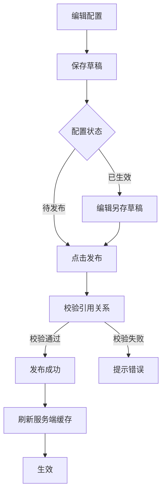

### 发布校验

| 校验项 | 说明 |
|---|---|
| 引用关系有效 | 所有关联的礼物、特效、奖励资源必须存在 |
| 概率规则合法 | 概率总和=100% |
| 奖励资源存在 | 奖励资源ID在资源库中存在 |
| 礼物未被其他配置使用 | 礼物不可跨模块复用 |


### 配置生效边界规则

| 场景 | 规则 |
|---|---|
| 新建CP关系 | 使用发布时刻的最新配置 |
| 已绑定CP等级 | **不受新配置影响**，继续使用绑定时的等级表，除非用户手动解绑后重新绑定 |
| 已绑定CP奖励 | 按绑定时的等级配置快照发放，新配置不影响已有奖励 |
| 等级阈值修改 | 仅影响新绑定关系，已绑定关系等级不自动重新计算 |
| 奖励配置修改 | 仅影响新达标等级，已发放奖励不追溯 |

> **设计原则：** CP关系建立时的配置版本决定后续等级与奖励，避免"半夜改配置导致用户等级跳变"争议。

### 删除规则

| 规则 | 说明 |
|---|---|
| 待发布状态可删除 | 未生效配置可删除 |
| 已生效状态不可删除 | 只能下线，不可删除 |
| 被引用配置不可删除 | 其他配置引用时不可删除 |

---

## 8. CP数据分析模块

### 模块背景

后台数据分析看板，用于运营监控CP系统表现。

### 8.1 数据总览（核心看板）

#### 核心指标

| 指标 | 定义 | 计算方式 |
|---|---|---|
| CP建立数 | 当前绑定状态的CP数量 | COUNT(cp_relation WHERE status='已绑定') |
| CP建立转化率 | 邀请 → 建立的转化率 | 建立数 / 发起邀请数 |
| CP用户数 | 至少有一个CP关系的用户数 | 去重统计 |
| CP用户占比 | CP用户占全部用户比例 | CP用户数 / 总用户数 |

#### 收入指标

| 指标 | 定义 | 计算方式 |
|---|---|---|
| CP总收入 | CP礼物产生的金币收入 | SUM(gift_record.gold_amount) WHERE cp_id IS NOT NULL |
| 惊喜礼物收入 | 惊喜礼物产生的收入 | SUM(gift_record.gold_amount) WHERE gift_type='惊喜礼物' |
| 超级礼物收入 | 超级礼物产生的收入 | SUM(gift_record.gold_amount) WHERE gift_type='超级礼物' |
| CP收入占比 | CP收入占总收入比例 | CP总收入 / 平台总收入 |

#### 用户价值

| 指标 | 定义 | 计算方式 |
|---|---|---|
| CP用户ARPU | CP用户平均收入 | CP总收入 / 去重CP用户数 |
| CP用户ARPPU | CP付费用户平均收入 | CP总收入 / 付费CP用户数 |
| 非CP用户ARPU | 对比指标 | 非CP用户收入 / 非CP用户数 |

---

### 8.2 转化漏斗分析

#### 行为漏斗

| 漏斗节点 | 定义 |
|---|---|
| CP入口曝光人数 | 看到CP入口的用户数 |
| 点击邀请人数 | 点击发起邀请的用户数 |
| 发起邀请人数 | 实际发起邀请的用户数 |
| 接受邀请人数 | 接受邀请的用户数 |
| 成功建立CP人数 | 建立CP关系的用户数 |

#### 转化率

| 转化率 | 计算 |
|---|---|
| 曝光 → 点击转化率 | 点击人数 / 曝光人数 |
| 点击 → 发起转化率 | 发起人数 / 点击人数 |
| 发起 → 接受转化率 | 接受人数 / 发起人数 |
| 接受 → 建立转化率 | 建立人数 / 接受人数 |

#### 分维度分析

| 维度 | 说明 |
|---|---|
| 用户类型 | 新用户 / 老用户 / 大R |
| 国家/地区 | 中东重点区域 |
| 入口类型 | 房间 / 私聊 |

---

### 8.3 收入分析

#### 收入趋势

| 指标 | 说明 |
|---|---|
| CP礼物收入趋势 | 日/周趋势图 |
| 惊喜礼物收入趋势 | 日/周趋势图 |
| 超级礼物收入趋势 | 日/周趋势图 |

#### 收入结构

| 指标 | 计算 |
|---|---|
| CP礼物收入占比 | CP礼物收入 / CP总收入 |
| 惊喜礼物占比 | 惊喜礼物收入 / CP总收入 |
| 超级礼物占比 | 超级礼物收入 / CP总收入 |

#### 收入明细

| 维度 | 字段 |
|---|---|
| 按礼物维度 | 礼物名称、收入、占比 |
| 按用户维度 | 用户ID、消费金额、消费次数 |

---

### 8.4 礼物效果分析（核心商业模块）

#### 惊喜礼物分析

| 指标 | 定义 |
|---|---|
| 触发次数 | 惊喜礼物赠送次数 |
| 命中次数 | 触发奖励的次数 |
| 命中率（各档位） | 普通档/稀有档/大奖档命中率 |
| 平均奖励价值 | 奖励价值 / 命中次数 |
| ROI | 奖励价值 / 消耗金币 |

#### 概率分布验证

| 指标 | 说明 |
|---|---|
| 实际命中分布 vs 配置概率 | 对比分析 |
| 偏差率 | 实际概率与配置概率的偏差 |
| 异常波动检测 | 偏差超过阈值时告警 |

#### 超级礼物分析

| 指标 | 定义 |
|---|---|
| 触发次数 | 超级礼物赠送次数 |
| 连送次数 | 连续赠送次数 |
| 连送率 | 连送次数 / 触发次数 |
| 复购率 | 重复赠送用户占比 |
| 单用户最高消费 | 最高消费金额 |
| 单次最高消费记录 | 单次赠送最高金额 |

---

### 8.5 用户行为分析

#### 送礼行为

| 指标 | 定义 |
|---|---|
| 人均送礼次数 | 送礼总次数 / 送礼用户数 |
| 人均送礼金额 | 送礼总金额 / 送礼用户数 |
| 连续送礼率 | 连续送礼用户占比 |
| 礼物偏好分布 | 不同礼物使用频次 |

#### CP用户行为

| 指标 | 定义 |
|---|---|
| CP用户活跃率 | 活跃CP用户 / CP用户总数 |
| CP用户留存率 | 1日/7日/30日留存 |
| CP用户平均生命周期 | CP关系平均持续时长 |
| CP用户平均互动次数 | 平均送礼/互动次数 |

#### 用户分层分析

| 层级 | 分析指标 |
|---|---|
| 新用户 | 转化率、付费表现 |
| 老用户 | 留存率、消费频次 |
| 大R用户 | 消费金额、礼物偏好 |

---

### 8.6 亲密度与等级分析

#### 等级分布

| 指标 | 定义 |
|---|---|
| 各等级用户数量 | Lv1~LvN各等级用户数 |
| 高等级用户占比 | Lv5+用户占比 |

#### 成长分析

| 指标 | 定义 |
|---|---|
| 平均升级时间 | 各等级平均升级时长 |
| 各等级流失率 | 各等级用户流失比例 |
| 等级跃迁路径 | 用户等级变化路径分析 |

#### 亲密度分析

| 指标 | 定义 |
|---|---|
| 人均亲密度 | 平均亲密度值 |
| 亲密度增长趋势 | 日/周趋势 |
| 亲密度来源占比 | 普通礼物/CP礼物/超级礼物占比 |

---

### 8.7 关系生命周期分析

#### 生命周期指标

| 指标 | 定义 |
|---|---|
| 平均CP持续时长 | CP关系平均存活时间 |
| 7日留存 | 建立后7天仍绑定的比例 |
| 30日留存 | 建立后30天仍绑定的比例 |
| 长周期关系占比 | 持续超过30天的CP比例 |

#### 关系状态变化

| 指标 | 定义 |
|---|---|
| 新增CP数 | 每日新建CP数量 |
| 解绑CP数 | 每日解除CP数量 |
| 活跃CP数 | 有互动的CP数量 |

#### 关系质量分析

| 指标 | 定义 |
|---|---|
| 高互动CP占比 | 互动频次超过阈值的CP占比 |
| 高频送礼CP占比 | 送礼频次超过阈值的CP占比 |
| 高价值CP占比 | 累计消费超过阈值的CP占比 |

---

### 8.8 CP明细数据

#### 筛选条件

| 筛选项 | 说明 |
|---|---|
| 时间范围 | 开始时间-结束时间 |
| 用户ID | 支持单用户查询 |
| CP关系ID | 支持单CP查询 |
| 礼物类型 | 普通/惊喜/超级 |

#### CP结成记录

| 字段 | 说明 |
|---|---|
| CP关系ID | cp_id |
| 发起方用户ID | initiator_user_id |
| 接收方用户ID | receiver_user_id |
| 建立时间 | create_time |
| 建立方式 | 礼物/邀请 |
| 建立礼物ID | create_gift_id |
| 当前状态 | 已绑定/已解绑 |

#### 惊喜礼物中奖记录

| 字段 | 说明 |
|---|---|
| 记录ID | record_id |
| 送礼用户ID | sender_user_id |
| 收礼用户ID | receiver_user_id |
| CP关系ID | cp_id |
| 礼物名称 | gift_name |
| 消耗金币 | gold_amount |
| 奖励档位 | reward_level（普通/稀有/大奖） |
| 奖励内容 | reward_item |
| 奖励数量 | reward_amount |
| 时间 | create_time |

#### 超级礼物触发记录

| 字段 | 说明 |
|---|---|
| 记录ID | record_id |
| 送礼用户ID | sender_user_id |
| 收礼用户ID | receiver_user_id |
| CP关系ID | cp_id |
| 礼物名称 | gift_name |
| 消耗金币 | gold_amount |
| 是否触发奖励 | is_trigger_reward |
| 奖励内容 | reward_item |
| 时间 | create_time |

---

### 8.9 数据维度切片

| 维度 | 说明 |
|---|---|
| 时间维度 | 日/周/月 |
| 用户维度 | 新用户/老用户/大R |
| 国家/地区 | 中东重点区域 |
| 礼物类型 | 普通/惊喜/超级 |
| CP等级 | Lv1~LvN |

---

### 8.10 关键统一规则

| 规则 | 说明 |
|---|---|
| 收入归属规则 | 所有金币消耗只归属送礼方（sender_user_id） |
| 用户查询规则 | user_id = sender_user_id OR user_id = receiver_user_id |
| 统计基于明细表 | 禁止直接使用汇总缓存，必须从gift_record/cp_relation聚合 |
| 时间优先级 | 明细使用gift_time，CP使用create_time/unbind_time |


## 三、附录

### 附录A：原型图映射表

| 序号 | 原型图文件名 | 对应功能模块 | 对应功能点 |
|---|---|---|---|
| 1 | CP主页.jpg | CP主页模块 | CP主页入口 |
| 2 | CP主页_已绑定.jpg | CP主页模块 | CP主页入口 |
| 3 | 已绑定CP_CP主页.jpg | CP主页模块 | CP主页状态展示 |
| 4 | 未绑定CP_CP主页.jpg | CP主页模块 | CP主页状态展示 |
| 5 | CP主页导航.jpg | CP主页模块 | CP主页入口 |
| 6 | CP亲密度展示.jpg | CP主页模块 | CP亲密度展示 |
| 7 | CP亲密度记录.jpg | CP主页模块 | CP亲密度变动记录 |
| 8 | CP亲密度变动记录.jpg | CP主页模块 | CP亲密度变动记录 |
| 9 | CP维护记录.jpg | CP主页模块 | CP维护记录 |
| 10 | 邀请CP弹窗.jpg | CP邀请模块 | CP邀请发起入口 |
| 11 | 邀请者视角_邀请CP弹窗.jpg | CP邀请模块 | CP邀请发起入口 |
| 12 | CP邀请弹窗_邀请者视角.jpg | CP邀请模块 | CP邀请发起入口 |
| 13 | CP邀请弹窗_被邀请者视角.jpg | CP邀请模块 | CP邀请发起入口 |
| 14 | CP邀请函_被邀请者视角.jpg | CP邀请模块 | CP邀请接受 |
| 15 | CP邀请函_邀请者视角.jpg | CP邀请模块 | CP邀请接受 |
| 16 | CP邀请接受弹窗_被邀请者视角.jpg | CP邀请模块 | CP邀请接受 |
| 17 | 被邀请者视角_CP邀请信函.jpg | CP邀请模块 | 消息通知-邀请通知 |
| 18 | CP邀请拒绝弹窗_被邀请者视角.jpg | CP邀请模块 | CP邀请拒绝 |
| 19 | CP邀请拒绝弹窗_邀请者视角.jpg | CP邀请模块 | CP邀请拒绝 |
| 20 | CP邀请列表.jpg | CP邀请模块 | CP邀请列表 |
| 21 | 被邀请者视角_CP邀请列表.jpg | CP邀请模块 | CP邀请列表 |
| 22 | CP邀请详情.jpg | CP邀请模块 | CP邀请详情 |
| 23 | 被邀请者视角_CP邀请详情.jpg | CP邀请模块 | CP邀请详情 |
| 24 | 礼物面板_CP玩法入口.jpg | CP邀请模块 | CP邀请发起入口 |
| 25 | 礼物面板_CP玩法入口_2.jpg | CP邀请模块 | CP邀请发起入口 |
| 26 | 系统提示组建CP_邀请者视角.jpg | CP邀请模块 | CP邀请发起入口 |
| 27 | 邀请者视角_系统主动提示组建CP.jpg | CP邀请模块 | CP邀请发起入口 |
| 28 | 邀请者视角_房间内绑定CP.jpg | CP邀请模块 | CP邀请接受 |
| 29 | CP邀请通知卡片.jpg | 消息通知模块 | CP邀请通知卡片 |
| 30 | CP升级通知.jpg | 消息通知模块 | CP升级通知 |
| 31 | CP解体通知.jpg | 消息通知模块 | CP解体通知 |
| 32 | 礼物面板_CP礼物分类.jpg | CP礼物模块 | CP礼物赠送入口 |
| 33 | 礼物面板_赠送CP礼物.jpg | CP礼物模块 | CP礼物赠送入口 |
| 34 | CP礼物记录.jpg | CP礼物模块 | CP礼物记录 |
| 35 | CP礼物记录列表.jpg | CP礼物模块 | CP礼物记录 |
| 36 | CP礼物特效.jpg | CP礼物模块 | CP礼物特效 |
| 37 | CP礼物奖励被邀请者视角.jpg | CP礼物奖励模块 | CP礼物奖励弹窗 |
| 38 | CP礼物奖励邀请者视角.jpg | CP礼物奖励模块 | CP礼物奖励弹窗 |
| 39 | CP礼物领取弹窗.jpg | CP礼物奖励模块 | CP礼物奖励弹窗 |
| 40 | 该CP礼物可加亲密度.jpg | CP礼物奖励模块 | CP礼物亲密度提示 |
| 41 | 增加CP专属礼物.jpg | CP表情与专属礼物 | CP专属礼物 |
| 42 | 增加CP表情.jpg | CP表情与专属礼物 | CP专属表情 |
| 43 | CP等级体系.jpg | CP等级模块 | CP等级详情页 |
| 44 | CP等级详情.jpg | CP等级模块 | CP等级详情页 |
| 45 | CP等级详情页.jpg | CP等级模块 | CP等级详情页 |
| 46 | CP等级权益.jpg | CP等级模块 | CP等级权益展示 |
| 47 | CP等级特权列表.jpg | CP等级模块 | CP等级特权 |
| 48 | CP升级触发奖励弹窗.jpg | CP等级模块 | CP升级奖励弹窗 |
| 49 | CP榜单.jpg | CP榜单模块 | CP榜单列表 |
| 50 | CP榜单列表.jpg | CP榜单模块 | CP榜单列表 |
| 51 | CP榜单_我的排名.jpg | CP榜单模块 | 我的排名 |
| 52 | CP说明.jpg | CP入口与展示模块 | CP功能说明页 |
| 53 | 个人主页.jpg | CP入口与展示模块 | 个人主页CP入口 |
| 54 | 个人主页_私聊跳转.jpg | CP入口与展示模块 | 个人主页CP入口 |
| 55 | 全屏资料页_绑定CP.jpg | CP入口与展示模块 | 用户资料卡CP入口 |
| 56 | 全屏资料页_绑定CP入口.jpg | CP入口与展示模块 | 用户资料卡CP入口 |
| 57 | 半屏资料页.jpg | CP入口与展示模块 | 用户资料卡CP入口 |
| 58 | 非资料页_绑定CP入口.jpg | CP入口与展示模块 | 用户资料卡CP入口 |
| 59 | 用户资料卡_已绑定CP.jpg | CP入口与展示模块 | 用户资料卡CP入口 |
| 60 | 私聊页面_CP信息展开_对方照片.jpg | CP入口与展示模块 | 私聊页CP信息展示 |
| 61 | 私聊页面_CP信息隐藏_对方照片.jpg | CP入口与展示模块 | 私聊页CP信息展示 |
| 62 | 私聊页面_收到CP消息.jpg | CP入口与展示模块 | 私聊页CP信息展示 |
| 63 | 房间_CP组全服特效.jpg | CP入口与展示模块 | 房间内CP展示 |
| 64 | CP组全服特效_礼物面板.jpg | CP礼物奖励模块 | CP全服礼物特效 |
| 65 | 赠送超级礼物全服特效_礼物面板.jpg | CP礼物奖励模块 | CP全服礼物特效 |
| 66 | 赠送超级礼物全服特效动画.jpg | CP礼物奖励模块 | CP全服礼物特效 |
| 67 | 解除关系确认弹窗.jpg | CP解除模块 | 解除关系确认 |
| 68 | 解除失败提示页.jpg | CP解除模块 | 解除失败提示 |
| 69 | 设置.jpg | CP设置模块 | CP设置入口 |
| 70 | 设置_自动拒绝CP邀请.jpg | CP设置模块 | 自动拒绝CP邀请 |

### 附录B：配置项清单

| 配置项 | 说明 | 默认值 | 所属模块 |
|---|---|---|---|
| cp_invite_expire_hours | 邀请有效期（小时） | 24 | CP邀请模块 |
| cp_gift_intimacy_multiplier | CP礼物亲密度加成倍率 | 1.5 | CP礼物模块 |
| cp_maintenance_remind_days | 维护提醒触发天数 | 7 | 消息通知模块 |
| cp_dissolution_confirm_hours | 单方解除确认等待时间（小时） | 24 | CP解除模块 |
| cp_rank_update_interval_minutes | 榜单更新间隔（分钟） | 60 | CP榜单模块 |
| cp_rank_top_n | 榜单奖励Top N | 3/10/20 | CP榜单模块 |
| cp_invite_daily_limit | 每日向同一用户发起邀请上限 | 3 | 安全风控 |
| cp_dissolution_cooldown_days | 解除后冷却期（天） | 7 | 安全风控 |
| cp_intimacy_decay_enabled | 亲密度衰减开关 | true | 衰减机制 |
| cp_intimacy_decay_daily_rate | 每日衰减比例 | 0.01 | 衰减机制 |
| cp_intimacy_decay_min | 衰减下限 | 0 | 衰减机制 |

### 附录C：数据结构

#### cp_invite（CP邀请表）

| 字段 | 类型 | 说明 |
|---|---|---|
| id | BIGINT | 主键 |
| inviter_id | BIGINT | 邀请者用户ID |
| invitee_id | BIGINT | 被邀请者用户ID |
| gift_id | BIGINT | 组建CP礼物ID |
| gift_amount | INT | 礼物数量 |
| gold_amount | BIGINT | 金币价值 |
| status | VARCHAR(20) | Pending/Accepted/Rejected/Expired/Canceled |
| expire_at | DATETIME | 已过期时间（UTC+3） |
| created_at | DATETIME | 创建时间 |
| updated_at | DATETIME | 更新时间 |

#### cp_relation（CP关系表）

| 字段 | 类型 | 说明 |
|---|---|---|
| id | BIGINT | 主键 |
| user_id_a | BIGINT | 用户A的ID |
| user_id_b | BIGINT | 用户B的ID |
| intimacy | BIGINT | 累计亲密度 |
| level | INT | 当前等级 |
| bind_at | DATETIME | 绑定时间 |
| status | VARCHAR(20) | Active/Dissolved |
| dissolved_at | DATETIME | 解除时间 |
| created_at | DATETIME | 创建时间 |
| updated_at | DATETIME | 更新时间 |

#### intimacy_log（亲密度变动表）

| 字段 | 类型 | 说明 |
|---|---|---|
| id | BIGINT | 主键 |
| cp_relation_id | BIGINT | CP关系ID |
| user_id | BIGINT | 操作用户ID |
| change_type | VARCHAR(30) | gift/maintenance/bind/system/decay |
| change_value | INT | 变动值（正/负） |
| total_after | BIGINT | 变动后总额 |
| source_id | BIGINT | 关联来源ID（礼物ID/邀请ID等） |
| created_at | DATETIME | 记录时间 |

#### cp_level_config（CP等级配置表）

| 字段 | 类型 | 说明 |
|---|---|---|
| id | INT | 主键 |
| level | INT | 等级数字 |
| name | VARCHAR(50) | 等级名称 |
| icon_url | VARCHAR(255) | 等级图标URL |
| min_intimacy | BIGINT | 升级所需最低亲密度 |
| created_at | DATETIME | 创建时间 |

#### cp_level_privilege（CP等级特权表）

| 字段 | 类型 | 说明 |
|---|---|---|
| id | BIGINT | 主键 |
| level | INT | 等级数字 |
| privilege_id | INT | 特权ID |
| privilege_name | VARCHAR(50) | 特权名称 |
| privilege_icon | VARCHAR(255) | 特权图标URL |
| privilege_desc | VARCHAR(255) | 特权描述 |

#### cp_dissolution（CP解除申请表）

| 字段 | 类型 | 说明 |
|---|---|---|
| id | BIGINT | 主键 |
| cp_relation_id | BIGINT | CP关系ID |
| initiator_id | BIGINT | 发起者ID |
| confirmor_id | BIGINT | 确认者ID |
| status | VARCHAR(20) | Pending/Confirmed/AutoConfirmed |
| expire_at | DATETIME | 自动生效时间 |
| created_at | DATETIME | 创建时间 |
| updated_at | DATETIME | 更新时间 |

### 附录D：埋点方案

| 事件名 | 触发时机 | 参数 |
|---|---|---|
| cp_invite_send | 发起CP邀请 | inviter_id, invitee_id, gift_id, gold_amount |
| cp_invite_accept | 接受CP邀请 | invite_id, inviter_id, invitee_id |
| cp_invite_reject | 拒绝CP邀请 | invite_id, inviter_id, invitee_id |
| cp_invite_expire | 邀请已过期 | invite_id |
| cp_gift_send | 赠送CP礼物 | sender_id, receiver_id, gift_id, gold_amount, intimacy_gain |
| cp_level_up | CP等级提升 | user_id_a, user_id_b, old_level, new_level |
| cp_dissolution_init | 发起解除 | cp_relation_id, initiator_id |
| cp_dissolution_confirm | 确认解除 | cp_relation_id |
| cp_rank_view | 查看CP榜单 | rank_type, my_rank |
| cp_page_view | 查看CP主页 | is_bound, intimacy, level |
| cp_auto_reject_toggle | 切换自动拒绝 | is_enabled |
