# CP系统需求文档

**版本：** 1.0完整重写版  
**生成时间：** 2026-05-15  
**输出目录：** /Users/mac/心音跳动/CP/ai实验室2  
**原型来源：** /Users/mac/心音跳动/CP/ai实验室2/原型图-功能切割  
**编写规范：** 严格按照 BDM系统1.0需求文档 结构模板

---

## 文档说明

本文档基于原型图和xmind核心规则撰写，严格以原型展示内容为准。

材料中出现但原型未展示的逻辑和描述，不在本文档体现。

原型已拆分为独立页面和交互流程图：交互流程图置于功能模块标题下方，独立页面置于功能点标题下方。

用户端仅包含普通用户视角（有CP/无CP两种状态）。

**重要说明：** CP系统为语聊场景下的社交关系绑定系统，核心业务闭环为：邀请 → 绑定 → 送礼 → 亲密度增长 → 等级变化 → 权益/奖励处理 → 榜单变化 → 房间/私聊/资料卡展示 → 再次送礼。

<span style="color: red; font-weight: bold;">**技术规范：** 所有业务数值必须由系统后台返回，禁止用户端硬编码。包括但不限于：CP专属礼物亲密度倍率（默认1.3）、幸运礼物折损比例（0.2）、邀请有效期（默认24小时）、衰减规则（3天-2%/5天-5%/7天+-10%）、等级配置参数、每日亲密度上限等。用户端仅负责展示，所有计算逻辑和配置参数均由系统后台控制。</span>

<span style="color:red"><strong>数据实时性要求：用户端凡展示"当前亲密度""本周贡献值""CP等级"等实时数据，均必须保证实时性。页面进入、送礼完成、等级变更、衰减触发后，必须重新读取或实时计算最新数据；不得读取已过期本地暂存数据或延迟批处理结果。历史亲密度记录按流水快照展示。</strong></span>

---

## 系统角色

| 角色 | 用户端入口 | 后台管理 | 说明 |
|---|---|---|---|
| 普通用户（有CP） | ✔ 查看CP主页/送礼/榜单/设置 | - | 已绑定CP关系的用户 |
| 普通用户（无CP） | ✔ 发起/接受邀请/好友推荐 | - | 未绑定CP关系的用户 |
| 被风控用户 | ✔ 受限的CP操作 | - | 邀请频次受限/CP功能冻结 |
| 运营后台 | - | ✔ 配置等级/礼物/风控/衰减/榜单参数 | 平台运营人员 |

---

## 核心规则定义

以下定义是原型中亲密度、等级、榜单字段的数据计算基础，开发前必须理解。


### CP关系唯一性规则

**（1）每个用户同一时间仅允许绑定1个CP**

限制说明：
- 用户已有CP关系时，不可发起或接受新的CP邀请
- 新的CP邀请前置校验必须检查双方CP关系状态
- 建立CP后，系统自动取消所有未处理的Outgoing邀请和自动拒绝所有Incoming邀请

**（2）CP关系为双向绑定关系**

绑定说明：
- CP关系一旦建立，双方对称拥有相同的CP标识和等级
- 亲密度、等级、在一起时长为双方共享
- 解绑操作任一方可发起，即时生效，无需对方确认

---

### 货币与换算规则

| 配置项 | 规则 | 备注 |
|--------|------|------|
| 汇率 | 1 USD = 10,000 金币 | - |
| 普通礼物亲密度 | 1 金币 = 1 亲密度 | 基础倍率 |
| 组建CP礼物亲密度 | 1 金币 = 1.5 亲密度 | **仅在邀请被接受（CP关系正式建立）时触发一次**；后续送礼走CP专属礼物规则 |
| 组建CP礼物财富值 | 1 金币 = 1 财富值 | **仅发起者获得**；被邀请者未消耗金币，不增加财富值 |
| CP专属礼物（普通） | 1 金币 = 1.3 亲密度 | 可后台配置，范围1.2~1.5；需达到对应CP等级才可赠送 |
| CP超级礼物 | CP专属礼物子类 | 需满足CP等级门槛（默认等级8+，后台可配置）；赠送后可触发全服特效 |
| CP惊喜礼物 | CP专属礼物子类 | 赠送后可随机获得限定装扮；奖励内容与概率由后台配置 |
| 幸运礼物 | 1 金币 = 0.2 亲密度 | 幸运礼物主要用于惊喜玩法，仅部分计入CP亲密度，防止刷亲密度/刷榜 |

> 原型图中"赠送该CP礼物可加1-5倍增长亲密度"为展示文案，实际倍率以后台配置为准。

---

### 数据分类与统计口径

| 数据类型 | 是否累计 | 是否衰减 | 用途 | 更新时机 |
|----------|----------|----------|------|----------|
| 总亲密度 | 是 | 是 | 等级计算、关系强度展示 | 每次有效送礼：同时更新总亲密度+本周贡献值；每次衰减：仅更新总亲密度 |
| 本周贡献值 | 否（周清零） | 否 | 榜单排名 | 每次有效送礼 |
| 财富值 | 是 | 否 | 等级升级双条件之一 | 仅组建CP礼物赠送时，发起者增加 |

---

### 统一时间口径

| 规则项 | 口径 | 适用范围 |
|--------|------|----------|
| 系统业务时区 | **东三区时间**（中东区） | 榜单周期、衰减机制、邀请已过期时间、在一起天数、每日亲密度上限、每日风控频次 |
| 自然日 | 00:00:00 - 23:59:59（东三区时间） | 所有"连续X天"按自然日计算，非滚动24小时 |
| 周榜周期 | 每周一 00:00（东三区时间）重置 | - |
| 日榜周期 | 每日 00:00（东三区时间）重置 | - |
| 邀请有效期 | 默认24小时（可后台配置），以系统后台东三区时间时间计算 | **配置变更不影响已发邀请** |

---

### 亲密度计算规则

**有效薪资流水来源（亲密度来源）**：

| 来源 | 计算规则 | 前置条件 | 用户操作→系统反馈 |
|------|----------|----------|-------------------|
| 普通礼物 | 亲密度 = 金币 × 1.0 | 已绑定CP | 选择礼物 → 点击赠送 → 扣减金币 → 亲密度实时增长 → 进度条动画填充 |
| 组建CP礼物 | 亲密度 = 金币 × 1.5 | **仅在邀请被接受时触发一次** | 被邀请者点击「接受」→ 建立CP关系 → 亲密度一次性计入 |
| CP专属礼物（普通） | 亲密度 = 金币 × 1.3（可配置1.2~1.5） | CP等级 ≥ 礼物解锁等级 | 点击CP礼物 → 扣减金币 → 亲密度增长 → 展示送礼特效 |
| CP超级礼物 | CP专属礼物子类，倍率按后台配置 | CP等级 ≥ 等级8+（可配置） | 点击赠送 → 扣减金币 → 亲密度增长 → **触发全服特效** |
| CP惊喜礼物 | CP专属礼物子类，倍率按后台配置 | CP等级 ≥ 礼物解锁等级 | 点击赠送 → 扣减金币 → 亲密度增长 → **播放随机奖励动画** |
| 幸运礼物 | 亲密度 = 金币 × 0.2 | 已绑定CP | 选择幸运礼物 → 扣减金币 → 按部分计入规则增加亲密度，用户侧文案表达为“幸运礼物主要用于惊喜玩法，仅部分计入CP亲密度” |

**亲密度写入规则**：

| 规则 | 说明 | 异常处理 |
|------|------|----------|
| 写入时机 | 每次有效送礼 | - |
| 写入内容 | 同时更新总亲密度 + 本周贡献值 + 写入亲密度流水 | - |
| 衰减写入 | 仅更新总亲密度，不影响本周贡献值 | - |
| 流水记录 | 记录来源：1-普通礼物 / 2-衰减 / 3-组建CP礼物 / 4-CP专属礼物 / 5-幸运礼物 / 6-风控修正 | - |
| 多端并发送礼 | 必须使用按顺序安全累加写入 | 覆盖写入或数据丢失 → 以系统后台累加结果为准 |
| 送礼与衰减并发 | 优先执行送礼，再执行衰减 | - |
| 每日亲密度上限 | 可配置，按东三区时间自然日统计 | 已达上限仍可送礼，但超出部分不增加亲密度；财富值正常增加；轻提示提示「今日亲密度已达上限」 |

**限制规则**：

| 配置项 | 默认值 | 说明 | 异常处理 |
|--------|--------|------|----------|
| 每日上限 | 可配置 | 按东三区时间自然日统计 | 超出部分不增加亲密度，财富值正常增加 |
| 单次最大值 | 可配置 | 防止异常大额写入溢出 | 超出则提示「单次赠送金额超限」 |
| 并发规则 | 原子累加 | 多次送礼保证累加正确 | 覆盖写入 → 系统后台以累加结果覆盖 |
| 小号/异常账号 | - | 命中风控的送礼不计入亲密度 | 轻提示提示「操作受限」 |
| 数值下限 | 亲密度 ≥ 0 | 不可为负 | 衰减至0时停止衰减 |

---

### 衰减机制规则

**衰减规则**：

| 无互动天数 | 衰减比例 | 说明 |
|------------|----------|------|
| 3天 | -2% | 开始衰减 |
| 5天 | -5% | 加速衰减 |
| 7天+ | -10% | 强衰减 |

**有效互动定义**：
- CP关系内任一方赠送有效礼物，且当日产生亲密度不少于100
- 同房行为（可选，需设置有效行为阈值防止挂机刷互动）
- 私聊消息（可选，需设置有效行为阈值防止刷消息规避衰减）

> 有效互动必须达到最低门槛后才重置无互动计时器，避免低价值礼物、刷消息或挂机同房绕过衰减。

**边界规则**：

| 规则 | 说明 | 异常处理 |
|------|------|----------|
| 新绑定保护期（降级缓冲期） | 绑定后3天内不触发衰减 | - |
| 衰减范围 | 仅影响总亲密度，不影响本周贡献值 | 榜单数据不受衰减影响 |
| 数值下限 | 衰减后亲密度不得低于0 | 降至0时停止衰减 |
| 等级联动 | 衰减后如低于当前等级阈值 → 进入等级保护期 → 保护期内仅双方可见保级提醒 → 保护期结束仍未恢复才正式降级 | 有效互动→亲密度恢复→保级成功→当前等级权益保留；非永久奖励不回收 |
| 送礼并发 | 衰减执行时若发生送礼 → 优先执行送礼，再执行衰减 | 以最新关系状态为准 |
| 降级后亲密度下限 | 降级后亲密度最低值为降级后等级的最低阈值 | - |

**用户感知与提示**：

| 阶段 | 触发条件 | 提示文案 | 用户操作→系统反馈 |
|------|----------|----------|-------------------|
| 衰减预警 | 连续2天无互动 | 「连续X天未互动，将开始衰减」 | 点击「去互动」→ 跳转CP主页/私聊 |
| 衰减提醒 | 亲密度发生衰减 | 「亲密度 -XXX（等级已按当前亲密度更新）」 | 点击「去互动保持关系」→ 跳转CP主页 |
| 等级保护 | 衰减导致亲密度低于当前等级阈值 | 先进入等级保护期，先进入保护处理；保护期结束仍未恢复时才更新CP等级标签和当前等级权益 | 双方收到私密保级提醒，可通过有效互动恢复 |

---

### CP等级体系规则

**等级配置表**：

| 等级 | 亲密度下限 | 财富值下限 | 解锁内容 | 等级奖励 |
|------|-----------|-----------|----------|----------|
| 等级1 | 0 | 0 | 基础CP标识 | CP标识等级1 |
| 等级2 | 5,000 | 3,000 | 基础CP礼物 | CP标识等级2 |
| 等级3 | 15,000 | 10,000 | CP头像框 | CP头像框 |
| 等级4 | 30,000 | 20,000 | CP主页装扮 | CP主页装扮 |
| 等级5 | 50,000 | 35,000 | 进阶CP礼物 | CP标识等级5 |
| 等级6 | 80,000 | 50,000 | CP连线特效 | CP连线特效 |
| 等级7 | 120,000 | 80,000 | CP进场动画 | CP进场动画 |
| 等级8 | 180,000 | 120,000 | CP超级礼物 | CP标识等级8 |
| 等级9 | 250,000 | 180,000 | CP专属表情 | CP专属表情 |
| 等级10 | 350,000 | 250,000 | CP聊天卡 | CP聊天卡 |
| 等级11 | 500,000 | 350,000 | 高级CP装扮 | 高级CP装扮 |
| 等级12 | 700,000 | 500,000 | 满级标识+全解锁 | 满级标识 |

> 具体等级阈值、解锁内容、奖励配置均由后台管理

**等级计算规则**：

| 规则 | 说明 | 异常处理 |
|------|------|----------|
| 升级条件 | 总亲密度 ≥ 等级下限 **且** 发起方财富值 ≥ 等级下限 | 双条件同时满足才升级 |
| 降级条件 | 总亲密度因衰减低于当前等级下限 | 先进入等级保护期；保护期结束仍未恢复至当前等级下限时正式降级 |
| 升级时机 | 亲密度写入后实时检测 | - |
| 降级时机 | 衰减后实时检测 | - |
| 配置版本 | 后台修改等级配置时生成新配置版本，按生效时间重新计算 | 新配置仅对新产生数据生效，不回溯历史等级 |

---

### CP邀请系统规则

**邀请前置校验（必须全部通过）**：

| 校验项 | 不通过时反馈 |
|--------|--------------|
| 用户A ≠ 用户B | 系统拦截，不展示邀请入口 |
| 双方均未绑定CP | 轻提示提示「对方已有CP关系」或「你已有CP关系」 |
| 双方未互相拉黑 | 轻提示提示「无法向该用户发起邀请」 |
| 双方均未开启「自动拒绝CP邀请」 | 邀请直接被系统设为已拒绝，原路退回金币 |
| 发起方未被风控限制 | 轻提示提示「操作受限，请稍后再试」 |
| 不存在重复待处理邀请 | 轻提示提示「你已有邀请待处理」 |
| 金币余额充足 | 轻提示提示「金币余额不足，请充值」+ 拉起半屏充值页面 |

**邀请状态流转**：

| 状态 | 英文 | 触发条件 | 是否退款 | 是否创建CP | 被邀请者反馈 |
|------|------|----------|----------|------------|--------------|
| 待处理 | 待处理 | 发起邀请成功 | 否 | 否 | 红点提醒+邀请函消息卡片 |
| 已接受 | 已接受 | 被邀请者点击「接受」 | 否 | 是 | 弹出恭喜成为CP结果页 |
| 已拒绝 | 已拒绝 | 被邀请者点击「狠心拒绝」/ 自动拒绝开关触发 | 是 | 否 | 轻提示提示「已拒绝」 |
| 已过期 | 已过期 | 超过有效期未处理 | 是 | 否 | 邀请函消息卡片状态更新 |
| 已取消 | 已取消 | 邀请方主动取消 / 系统因任一方已绑定CP自动取消 | 是 | 否 | 邀请函消息卡片状态更新 |

**状态命名规范（强制）**：
- 超时统一为 **已过期**，**不叫**"自动拒绝"或"自动取消"
- 自动拒绝开关触发时状态为 **已拒绝**（不是已过期）
- 风控命中时按风控策略处理（冻结/复核），不默认入账

**金币/财富值/亲密度处理表**：

| 场景 | 金币 | 财富值 | 亲密度 | 榜单贡献 |
|------|------|--------|--------|----------|
| 邀请已接受 | 不退款 | 发起者增加 | 双方增加 | 计入 |
| 主动已拒绝 | 原路退回 | 不增加 | 不增加 | 不计入 |
| 已过期 | 原路退回 | 不增加 | 不增加 | 不计入 |
| 已取消 | 原路退回 | 不增加 | 不增加 | 不计入 |
| 风控命中 | 冻结/复核/按策略处理 | 按策略 | 默认不计入 | 默认不计入 |

**用户状态模型**：

| 状态 | 说明 | 可执行操作 |
|------|------|------------|
| Idle（空闲态） | 无CP关系，无待处理邀请 | 可发起邀请 / 可接受邀请 |
| Outgoing 待处理 | 已发起邀请，等待对方响应 | **同一时间仅允许1个**；不可再次发起 |
| Incoming List | 收到多个被邀请（队列形式） | 可逐个接受/拒绝/不处理 |
| Match Ready | 双方互相邀请 | 后发起方自动接受，直接建立CP |
| CP Bound | 已绑定CP | 不可发起/接受邀请 |

**核心约束规则**：

| 规则 | 说明 | 违反时反馈 |
|------|------|------------|
| 单主动邀请原则 | 同一时间仅允许1个Outgoing | 提示「已有邀请待处理，是否继续？」 |
| 多被邀请队列 | 可同时接收多个Incoming | 列表展示，按礼物价值降序+剩余时间升序排序 |
| CP关系唯一锁 | 建立CP后清空所有未处理邀请 | 无感知，自动处理 |
| 双向匹配优先 | A邀请B且B邀请A时，后发起方不扣款 | 提示「你们互相心动了❤️」，自动建立CP |
| 建立CP后旧邀请操作 | 直接拒绝 | 轻提示「你已建立CP关系」 |

**事件优先级**：最高优先级建立CP > 次高优先级双向匹配 > 普通优先级收到邀请 > 最低优先级发起邀请

**邀请骚扰控制**：

| 策略 | 规则 | 可配置 |
|------|------|--------|
| 单用户每日邀请次数 | 限制指定数量次（默认3次） | 是 |
| 同一目标冷却时间 | 24小时 | 是 |
| 被邀请过多 | 列表折叠，展示前列 指定数量；排序：互动频率 > 礼物金额 > 在线状态 | 是 |
| 被标记为骚扰用户 | 不触发系统提示组建CP弹窗 | - |
| 小号限制 | 小号发起的邀请不计入有效邀请 | - |

---

### 风控系统规则

**风控触发场景**：

| 场景 | 检测维度 | 命中后处理 | 用户反馈 |
|------|----------|------------|----------|
| 小号/异常账号 | 账号年龄+活跃度+送礼模式 | 不计入亲密度/榜单/邀请 | 轻提示「操作受限」 |
| 频繁解绑重绑 | 30天内解绑次数 | 限制邀请频次/冻结CP功能 | 轻提示「操作频繁，请稍后再试」 |
| 异常送礼 | 单日/单次送礼金额异常 | 冻结亲密度计入/复核 | 轻提示「操作受限」 |
| 自动拒绝开关 | 用户开启「自动拒绝CP邀请」 | 所有新邀请直接设为已拒绝，退回金币 | 发起者收到退币通知 |
| 轰炸邀请 | 单用户日邀请次数超限 | 拦截新邀请 | 轻提示「今日邀请次数已达上限」 |
| 同目标重复邀请 | 24小时内对同一用户重复邀请 | 拦截 | 轻提示「请24小时后再向该用户发起邀请」 |

**风控策略配置**：

| 配置项 | 默认值 | 可配置 | 说明 |
|--------|--------|--------|------|
| 每日邀请上限 | 3次 | 是 | 按东三区时间自然日 |
| 同目标冷却时间 | 24小时 | 是 | - |
| 解绑监控周期 | 30天 | 是 | - |
| 解绑阈值 | 3次 | 是 | - |
| 单日送礼上限 | 可配置 | 是 | - |
| 小号判定规则 | 账号年龄+活跃度 | 是 | - |

> 风控命中后的金币处理：不默认入账，按风控策略处理（冻结/复核/退回）

---

### 系统提示弹窗规则

**触发条件**：

| 触发场景 | 触发频率 | 展示内容 | 用户操作→系统反馈 |
|----------|----------|----------|-------------------|
| 两人互动频繁但未组建CP | 每日最多1次 | 「你与xxx互动频繁，要组建CP吗？」 | 点击「发起CP」→ 打开CP礼物面板；点击「下次再说」→ 关闭弹窗 |
| 好友列表中无CP好友 | 每次进入好友列表最多1次 | 推荐无CP好友 | 点击「去邀请」→ 跳转邀请流程；点击「关闭」→ 关闭弹窗 |
| 亲密度衰减预警 | 触发时1次 | 「你的CP亲密度在下降...」 | 点击「去互动」→ 跳转CP主页/私聊 |

**防打扰策略**：

| 策略 | 规则 | 说明 |
|------|------|------|
| 频控 | 同一用户每24小时最多1次 | 按东三区时间自然日 |
| 冷却期 | 用户点击「下次再说」后72小时内不再弹 | - |
| 场景限制 | 仅在私聊/好友列表/房间内触发 | 不在直播间榜单等场景弹出 |
| 已有CP | 不触发 | - |
| 已有待处理邀请 | 不触发 | - |
| 已关闭提示 | 用户可在设置中关闭 | 设置路径：CP设置 → 关闭「CP推荐提醒」 |

---

### 榜单规则

**榜单类型**：

| 榜单类型 | 周期 | 统计口径 | 重置时间 | 入口 |
|----------|------|----------|----------|------|
| 周榜 | 自然周 | 本周贡献值（非总亲密度） | 每周一00:00（东三区时间） | CP主页 → 点击榜单切换标签 |
| 日榜 | 自然日 | 当日贡献值 | 每日00:00（东三区时间） | CP主页 → 点击榜单切换标签 |
| 总榜 | 全周期 | 总亲密度 | 不重置 | CP主页 → 点击榜单切换标签 |

**榜单数据口径**：

| 规则 | 说明 |
|------|------|
| 数据来源 | 本周贡献值（周榜）/ 当日贡献值（日榜）/ 总亲密度（总榜） |
| 衰减影响 | 衰减不影响榜单贡献值（仅影响总亲密度） |
| 幸运礼物 | 幸运礼物贡献值按20%计入 |
| 风控 | 风控命中的送礼不计入榜单 |
| 实时性 | 榜单数据延迟 ≤ 5分钟 |

**榜单奖励**：

| 奖励类型 | 触发 | 说明 | 发放维度 |
|----------|------|------|----------|
| 周榜前列3 | 每周一结算 | 专属头像框/标识/虚拟币 | 用户+CP关系 |
| 日榜前列1 | 每日结算 | 小额虚拟币/碎片 | 用户+CP关系 |

> 非永久奖励（限时/可消耗）发放维度为「用户+CP关系」，降级不回收

---

### 解绑规则

**解绑方式**：

| 方式 | 发起方 | 生效条件 | 用户操作→系统反馈 |
|------|--------|----------|-------------------|
| 主动解绑 | 任一方 | 点击「解除CP」→ 二次确认弹窗 → 确认 → 即时生效 | 轻提示提示「CP关系已解除」→ 双方推送通知 |
| 自动解绑 | 系统 | 任一方账号注销 → 自动解除 | 通知另一方「因对方账号注销，CP关系已自动解除」 |
| 风控解绑 | 系统 | 命中风控策略（频繁解绑重绑/异常送礼） | 通知双方 → 可能附加限制（如冷却期） |

**解绑处理逻辑**：

| 处理项 | 规则 | 说明 |
|--------|------|------|
| 亲密度 | 清零（非保留） | 解绑后双方亲密度归零 |
| 榜单 | 本周期贡献值保留至周期结束 | 自然结算 |
| 等级 | 重置为等级0 | - |
| 当前等级权益 | 解除关系后立即失效 | 纪念型永久权益和历史荣誉记录不回收 |
| 非永久奖励 | **不回收**（已到账的限时奖励、虚拟币等保留） | - |
| 组建CP礼物 | 不退回 | - |
| 重新绑定 | 可随时重新绑定（无固定冷静期） | 频繁解绑重绑由风控策略处理 |

**频繁解绑风控**：

| 策略 | 规则 | 说明 |
|------|------|------|
| 监控维度 | 同一用户30天内解绑次数 | 可配置 |
| 触发阈值 | 默认3次 | 可配置 |
| 处理方式 | 标记为异常用户 → 限制CP邀请频次 → 系统提示弹窗不再展示 | 不设固定冷静期，由风控策略动态调整 |
| 升级处理 | 严重违规 → 冻结CP功能 | - |

---

### 隐私设置规则

| 设置项 | 路径 | 选项 | 说明 |
|--------|------|------|------|
| CP标识可见性 | CP设置 → 隐私设置 | 所有人可见 / 仅好友可见 / 仅自己可见 | - |
| 自动拒绝CP邀请 | CP设置 → 隐私设置 | 开 / 关 | 开启后所有新邀请直接已拒绝 |
| CP推荐提醒 | CP设置 → 隐私设置 | 开 / 关 | 关闭后不弹出系统提示 |

---

### 并发与一致性规则

| 场景 | 策略 | 异常处理 |
|------|------|----------|
| 亲密度更新 | 系统后台写入后推送，用户端以系统后台为准 | 用户端本地暂存数据与系统后台冲突 → 系统后台覆盖 |
| 等级变化 | 系统后台计算后推送 | 延迟推送 ≤ 3秒 |
| 邀请状态 | 系统后台状态机驱动 | 用户端操作失败 → 重新加载状态 |
| 榜单数据 | 定时重新加载（延迟 ≤ 5分钟） | - |
| 配置变更 | 系统后台下发新配置 | 旧配置本地暂存数据 → 下次拉取时更新 |
| 多端同时送礼 | 按顺序安全累加写入 | 覆盖写入 → 系统后台累加结果覆盖 |
| 送礼与衰减并发 | 优先执行送礼，再执行衰减 | 以最新关系状态为准 |
| 双向邀请 | 后发起方自动接受，不二次扣款 | - |
| 建立CP时同时有多个邀请 | 按优先级处理（最高优先级建立CP > 次高优先级双向匹配 > 普通优先级收到邀请 > 最低优先级发起邀请） | - |

---

### 配置策略

| 配置项 | 默认值 | 生效策略 | 说明 |
|--------|--------|----------|------|
| 邀请有效期 | 24小时 | 新配置仅影响新发邀请 | 不影响已发邀请 |
| CP专属礼物倍率 | 1.3 | 新配置即时生效 | 正在进行的送礼使用新倍率 |
| 幸运礼物倍率 | 0.2 | 新配置即时生效 | - |
| 衰减规则 | 3天-2%/5天-5%/7天+-10% | 新配置即时生效 | 已在衰减中的关系按新规则计算 |
| 等级配置 | 12级阈值表 | 新配置生成新版本，按生效时间重新计算 | 不回溯历史等级 |
| 风控阈值 | 各项可配置 | 新配置即时生效 | - |


---


### 亲密度衰减机制

#### 设计目标

1. 防止关系长期不维护仍保持高亲密度
2. 提升用户持续互动频率
3. 避免榜单被历史数据垄断
4. 构建关系生命周期（建立 → 维系 → 衰减）

#### 衰减触发条件

| 参数 | 默认值 | 说明 |
|---|---|---|
| 无互动天数阈值 | 3天 | 连续超过此天数触发衰减 |
| 衰减执行周期 | 每日东三区时间 00:00执行 | 定时任务执行 |
| 是否开启 | 可配置 | 后台可关闭衰减功能 |

#### 有效互动定义

| 互动类型 | 是否计入 | 说明 |
|---|---|---|
| CP互送礼物 | 是（核心） | 主要维护方式 |
| 同房行为 | 可选 | 后台配置是否计入 |
| 私聊消息 | 可选 | 后台配置是否计入 |

#### 有效互动门槛与等级保护期

| 规则 | 业务口径 | 测试关注点 |
|---|---|---|
| 有效礼物门槛 | CP关系内任一方赠送有效礼物，且当日产生亲密度不少于100，才视为一次有效互动 | 低于门槛的礼物不重置无互动天数 |
| 双方消息门槛 | 双方在同一自然日内互发有效私聊消息不少于3条，可视为一次有效互动 | 单方刷消息不计入 |
| 同房门槛 | 双方同房累计不少于10分钟，且未命中挂机或异常行为判断，可视为一次有效互动 | 挂机、异常账号不计入 |
| 系统互动动作 | 双方完成一次系统定义的CP互动动作，可视为一次有效互动 | 只完成单方动作不计入 |
| 衰减执行限制 | 衰减任务按东三区时间自然日执行，每日最多执行一次；当日已产生有效互动则不执行衰减 | 同一天不能重复扣减 |
| 等级保护期 | 衰减后低于当前等级阈值时，先进入保护处理，先进入等级保护期；保护期默认48小时，可由后台配置 | 保护期内完成有效互动并恢复至当前等级阈值，应保级成功 |
| 权益拆分 | 当前等级权益随当前等级变化；已领取限时权益到期前保留；纪念型永久权益和历史荣誉记录永久保留 | 降级不得回收纪念型永久权益和历史荣誉 |


**推荐策略：**
- 1.0版本：仅送礼计入互动
- 2.0版本：送礼 + 同房 + 聊天

#### 衰减计算规则

**分段衰减策略：**

| 无互动天数 | 衰减比例 | 说明 |
|---|---|---|
| 3天 | 2% | 轻度衰减 |
| 5天 | 5% | 中度衰减 |
| 7天 | 10% | 重度衰减 |
| 14天+ | 15% | 深度衰减 |

**计算公式：**

```
衰减值 = 当前总亲密度 × 衰减比例
新亲密度 = 当前总亲密度 - 衰减值
```

#### 执行流程

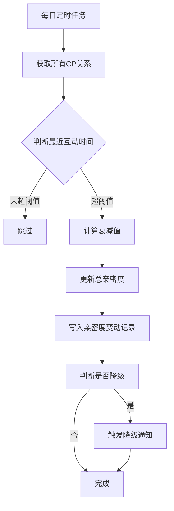
```mermaid
flowchart TD
    A[每日定时任务] --> B[获取所有CP关系]
    B --> C{判断最近互动时间}
    C -->|未超阈值| D[跳过]
    C -->|超阈值| E[计算衰减值]
    E --> F[更新总亲密度]
    F --> G[写入亲密度变动记录]
    G --> H[判断是否降级]
    H -->|是| I[触发降级通知]
    H -->|否| J[完成]
    I --> J
```

#### 边界规则

| 规则 | 说明 |
|---|---|
| 最低值保护 | 亲密度不得低于当前等级最低值 |
| 降级缓冲期 | 连续3天衰减后才触发降级 |
| 新绑定保护 | 绑定后3天内不触发衰减 |
| 并发处理 | 衰减执行时若发生送礼，以最新状态为准 |

#### 榜单影响

| 数据类型 | 是否受衰减影响 | 说明 |
|---|---|---|
| 总亲密度 | 是 | 等级判断基于此值 |
| 本周贡献值 | 否 | 榜单数据不受影响 |

#### 用户感知

| 触发时机 | 提示内容 |
|---|---|
| 2天无互动 | 「已连续2天未互动，亲密度 即将衰减」 |
| 衰减发生时 | 「亲密度 -XXX（关系冷却中）」 |
| 衰减后 | 「去互动保持关系」 |

---

### 系统提示邀请CP弹窗逻辑

#### 功能背景

在用户高频互动场景下，系统主动提示用户发起CP邀请，提升CP绑定转化率。

#### 适用范围

- 房间内聊天场景
- 私聊聊天场景

#### 触发前置条件（必须全部满足）

| 条件类型 | 具体条件 |
|---|---|
| 用户关系条件 | 双方均未绑定CP |
| 用户关系条件 | 双方未互相拉黑 |
| 用户关系条件 | 双方均未开启「自动拒绝CP邀请」 |
| 用户关系条件 | 双方未存在未处理的CP邀请 |
| 用户状态条件 | 至少一方处于当前会话场景 |
| 用户状态条件 | 对方最近活跃（5分钟内，可配置） |
| 风控条件 | 未命中骚扰限制 |
| 风控条件 | 未在冷却周期内 |

#### 触发行为类型（满足任一）

| 行为类型 | 触发阈值 | 说明 |
|---|---|---|
| 聊天触发 | 连续发送消息 ≥ 5条 | 可配置阈值 |
| 礼物触发 | 向对方送礼 ≥ 1次 | - |
| 综合触发 | T分钟内同时存在聊天+送礼 | 可配置时间窗口 |

**说明：** 所有阈值由后台配置，不写死。

#### 弹窗展示规则

| 规则项 | 说明 |
|---|---|
| 展示对象 | 仅对「邀请者」展示提示弹窗 |
| 展示内容 | 双方头像 + CP关系icon + 文案提示 + CP权益展示 |
| 文案示例 | 「你们关系不错，可以成为CP」 |

#### 防打扰策略（强制要求）

| 策略类型 | 规则 |
|---|---|
| 用户级频控 | 每个用户每日最多触发 指定数量 次（默认2次） |
| 关系级频控 | 同一对用户24小时内最多触发1次 |
| 冷却机制 | 用户关闭弹窗后，当天不再触发 |
| 不再提示 | 用户勾选后，永久关闭 |
| 高风险用户限制 | 被标记为骚扰用户，不触发该功能 |

#### 用户操作流程

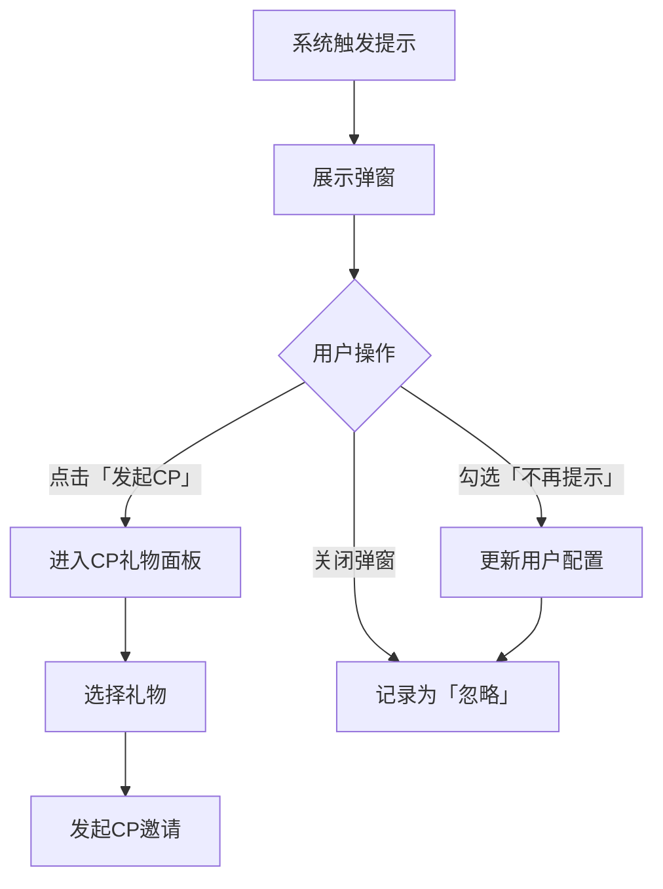
```mermaid
flowchart TD
    A[系统触发提示] --> B[展示弹窗]
    B --> C{用户操作}
    C -->|点击「发起CP」| D[进入CP礼物面板]
    D --> E[选择礼物]
    E --> F[发起CP邀请]
    C -->|关闭弹窗| G[记录为「忽略」]
    C -->|勾选「不再提示」| H[更新用户配置]
    H --> G
```

#### 异常处理

| 场景 | 处理方式 |
|---|---|
| 弹窗展示期间任一方已绑定CP | 不允许发起，提示失败原因 |
| 被邀请者离线 | 仍允许发起，延迟触达 |
| 同一用户短时间重复发起 | 拦截或合并 |

#### 运营配置项

| 配置项 | 说明 |
|---|---|
| 触发阈值（聊天次数/礼物） | 控制触发敏感度 |
| 每日触发次数上限 | 控制打扰程度 |
| 冷却时间 | 关闭后多久可再次触发 |
| 文案内容（多语言） | 适配不同区域 |
| 功能开关 | 可全局关闭 |

---

### 汇率换算规则

#### 货币与亲密度换算

| 换算项 | 换算公式 | 说明 |
|---|---|---|
| 金币与美元 | 1 USD = 10,000 金币 | 固定汇率 |
| 普通礼物亲密度 | 1 金币 = 1 亲密度 | 基础换算 |
| CP专属礼物亲密度 | 1 金币 = 1.3 亲密度 | 1.3倍加成（可配置） |
| 幸运礼物亲密度 | 1 金币 = 0.2 亲密度 | 仅部分计入CP亲密度，用于防刷榜和防异常刷亲密度 |

#### 幸运礼物折损规则

| 规则项 | 说明 |
|---|---|
| 折损比例 | 仅20%计入亲密度 |
| 计算公式 | 亲密度 = 礼物金币 × 0.2 |
| 设计目的 | 防止通过幸运礼物刷亲密度 |
| 用户端提示 | 赠送幸运礼物时必须展示「亲密度按20%计入」提示，避免用户投诉 |

#### 配置管理

| 配置项 | 配置方式 |
|---|---|
| 金币汇率 | 后台全局配置 |
| CP礼物加成倍率 | 礼物级别配置，可针对不同礼物设置不同倍率 |
| 幸运礼物折损系数 | 后台全局配置 |

---

### 冷却机制

#### 解绑冷却期

| 规则项 | 默认值 | 说明 |
|---|---|---|
| 重新绑定限制 | 无固定等待限制 | 解绑后可重新发起/接受CP邀请；异常频繁解绑重绑交由风控处理 |
| 适用范围 | 同一CP对 | 仅限制与原CP绑定，不限制与他人绑定 |
| 设计目的 | 防止反复解绑刷奖励 |

#### 邀请冷却期

| 规则项 | 默认值 | 说明 |
|---|---|---|
| 同用户邀请上限 | 每日3次 | 向同一用户每日最多发起3次邀请 |
| 超限处理 | 轻提示提示「今日邀请次数已达上限」 |

#### 弹窗冷却期

| 规则项 | 默认值 | 说明 |
|---|---|---|
| 关闭后冷却 | 当天不再触发 | 用户关闭系统提示弹窗后，当天不再展示 |
| 勾选「不再提示」| 永久关闭 | 需用户主动在设置中开启 |


## 业务流程图

以下流程图展示核心业务逻辑的流转路径。


### 一、CP邀请发起流程

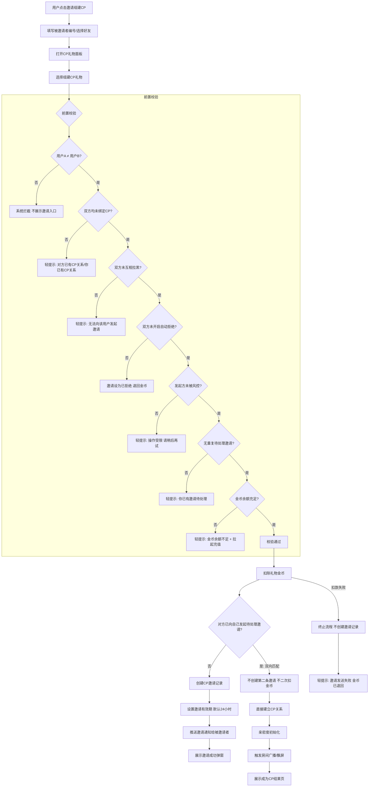
```mermaid
flowchart TD
    A[用户点击邀请组建CP] --> B[填写被邀请者编号/选择好友]
    B --> C[打开CP礼物面板]
    C --> D[选择组建CP礼物]
    D --> E{前置校验}
    
    subgraph 前置校验
    E --> E1{用户A ≠ 用户B?}
    E1 -->|否| E1a[系统拦截 不展示邀请入口]
    E1 -->|是| E2{双方均未绑定CP?}
    E2 -->|否| E2a[轻提示: 对方已有CP关系/你已有CP关系]
    E2 -->|是| E3{双方未互相拉黑?}
    E3 -->|否| E3a[轻提示: 无法向该用户发起邀请]
    E3 -->|是| E4{双方未开启自动拒绝?}
    E4 -->|否| E4a[邀请设为已拒绝 退回金币]
    E4 -->|是| E5{发起方未被风控?}
    E5 -->|否| E5a[轻提示: 操作受限 请稍后再试]
    E5 -->|是| E6{无重复待处理邀请?}
    E6 -->|否| E6a[轻提示: 你已有邀请待处理]
    E6 -->|是| E7{金币余额充足?}
    E7 -->|否| E7a[轻提示: 金币余额不足 + 拉起充值]
    E7 -->|是| F[校验通过]
    end
    
    F --> G[扣除礼物金币]
    G --> H{对方已向自己发起待处理邀请?}
    H -->|是: 双向匹配| I[不创建第二条邀请 不二次扣金币]
    I --> J[直接建立CP关系]
    H -->|否| K[创建CP邀请记录]
    K --> L[设置邀请有效期 默认24小时]
    L --> M[推送邀请通知给被邀请者]
    M --> 指定数量[展示邀请成功弹窗]
    
    G -->|扣款失败| G1[终止流程 不创建邀请记录]
    G1 --> G2[轻提示: 邀请发送失败 金币已退回]
    
    J --> O[亲密度初始化]
    O --> P[触发房间广播/飘屏]
    P --> Q[展示成为CP结果页]
```

**核心规则确认**：
- 邀请前置校验必须全部通过才能继续
- 扣款成功但邀请创建失败必须回滚金币
- 双向匹配时后发起方不二次扣款


### 二、CP邀请状态流转图


```mermaid
stateDiagram-v2
    [*] --> 待处理: 发起邀请成功
    待处理 --> 已接受: 被邀请者点击接受
    待处理 --> 已拒绝: 被邀请者点击拒绝
    待处理 --> 已拒绝: 自动拒绝开关触发
    待处理 --> 已过期: 超过有效期未处理
    待处理 --> 已取消: 邀请方主动取消
    待处理 --> 已取消: 系统因任一方已绑定CP自动取消
    
    已接受 --> [*]: 创建CP关系
    已拒绝 --> [*]: 退回金币
    已过期 --> [*]: 退回金币
    已取消 --> [*]: 退回金币
    
    note right of 待处理: 红点提醒+邀请函消息卡片
    note right of 已接受: 弹出恭喜成为CP结果页
    note right of 已拒绝: 轻提示提示已拒绝
    note right of 已过期: 邀请函消息卡片状态更新
    note right of 已取消: 邀请函消息卡片状态更新
```


### 三、接受CP邀请流程

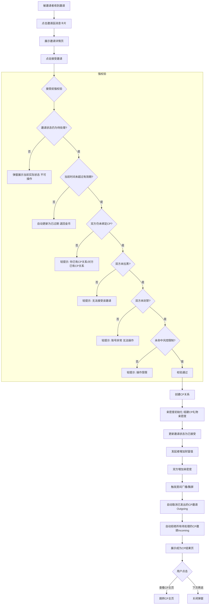
```mermaid
flowchart TD
    A[被邀请者收到邀请] --> B[点击邀请函消息卡片]
    B --> C[展示邀请详情页]
    C --> D[点击接受邀请]
    D --> E{接受前强校验}
    
    subgraph 强校验
    E --> E1{邀请状态仍为待处理?}
    E1 -->|否| E1a[弹窗展示当前实际状态 不可操作]
    E1 -->|是| E2{当前时间未超过有效期?}
    E2 -->|否| E2a[自动更新为已过期 退回金币]
    E2 -->|是| E3{双方仍未绑定CP?}
    E3 -->|否| E3a[轻提示: 你已有CP关系/对方已有CP关系]
    E3 -->|是| E4{双方未拉黑?}
    E4 -->|否| E4a[轻提示: 无法接受该邀请]
    E4 -->|是| E5{双方未封禁?}
    E5 -->|否| E5a[轻提示: 账号异常 无法操作]
    E5 -->|是| E6{未命中风控限制?}
    E6 -->|否| E6a[轻提示: 操作受限]
    E6 -->|是| F[校验通过]
    end
    
    F --> G[创建CP关系]
    G --> H[亲密度初始化 组建CP礼物亲密度]
    H --> I[更新邀请状态为已接受]
    I --> J[发起者增加财富值]
    J --> K[双方增加亲密度]
    K --> L[触发房间广播/飘屏]
    L --> M[自动取消已发出的CP邀请Outgoing]
    M --> 指定数量[自动拒绝所有待处理的CP邀请Incoming]
    指定数量 --> O[展示成为CP结果页]
    O --> P{用户点击}
    P -->|查看CP主页| Q[跳转CP主页]
    P -->|下次再说| R[关闭弹窗]
```

**接受后执行逻辑**：
1. 创建CP关系 → 亲密度初始化为组建CP礼物的亲密度值
2. 更新邀请状态为已接受
3. 发起者增加财富值（1金币=1财富值）
4. 双方增加亲密度（1金币=1.5亲密值）
5. 触发房间广播/飘屏（按组建CP礼物配置决定是否全服飘屏）
6. **自动取消**已发出的CP邀请→ 原邀请金币全额退回
7. **自动拒绝**所有待处理的CP邀请→ 原邀请金币全额退回
8. 展示成为CP结果页


### 四、拒绝CP邀请流程


```mermaid
flowchart TD
    A[被邀请者点击狠心拒绝] --> B[弹出拒绝确认二次弹窗]
    B --> C{用户确认}
    C -->|取消| D[关闭弹窗]
    C -->|确认拒绝| E[更新状态为已拒绝]
    E --> F[退回发起者金币]
    F --> G[通知发起者]
    G --> H[私聊消息/系统通知]
```

**拒绝后执行逻辑**：
- 更新状态为已拒绝
- 退回发起者金币
- 通知发起者（私聊消息/系统通知）


### 五、CP解绑流程

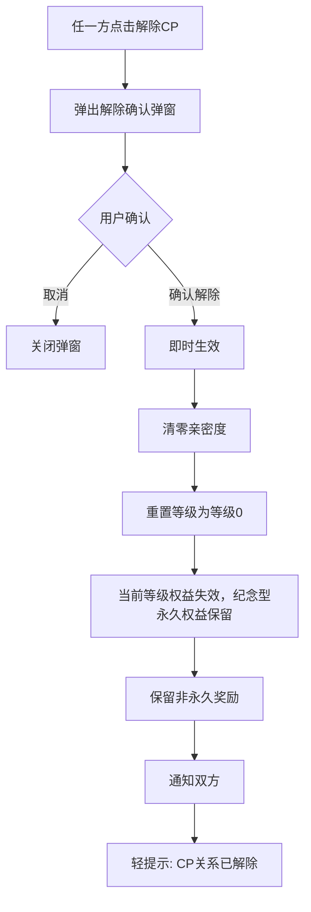
```mermaid
flowchart TD
    A[任一方点击解除CP] --> B[弹出解除确认弹窗]
    B --> C{用户确认}
    C -->|取消| D[关闭弹窗]
    C -->|确认解除| E[即时生效]
    E --> F[清零亲密度]
    F --> G[重置等级为等级0]
    G --> H[当前等级权益失效，纪念型永久权益保留]
    H --> I[保留非永久奖励]
    I --> J[通知双方]
    J --> K[轻提示: CP关系已解除]
```

**解绑处理逻辑**：
- 亲密度清零（非保留）
- 榜单本周期贡献值保留至周期结束
- 等级重置为等级0
- 当前等级权益失效；纪念型永久权益和历史荣誉记录保留
- 非永久奖励不回收
- 组建CP礼物不退回
- 可随时重新绑定（无固定冷静期）


### 六、CP送礼亲密度增长流程


```mermaid
flowchart TD
    A[用户选择CP礼物] --> B[点击赠送]
    B --> C{金币余额校验}
    C -->|不足| C1[轻提示: 金币余额不足 + 拉起充值]
    C -->|充足| D[扣减金币]
    D --> E{每日亲密度上限校验}
    E -->|已达上限| E1[亲密度不再增加 + 轻提示: 今日亲密度已达上限]
    E1 --> F1[财富值正常增加]
    E -->|未达上限| F[计算亲密度增量]
    F --> G{礼物类型}
    G -->|普通礼物| G1[亲密度 = 金币 × 1.0]
    G -->|CP专属礼物| G2[亲密度 = 金币 × 1.3]
    G -->|幸运礼物| G3[亲密度 = 金币 × 0.2]
    G3 --> F1
    G1 --> H[原子累加亲密度]
    G2 --> H
    H --> I[更新总亲密度]
    I --> J[更新本周贡献值]
    J --> K[写入亲密度流水]
    K --> L{等级校验}
    L -->|满足升级条件| M[触发升级弹窗]
    L -->|不满足| 指定数量[结束]
    M --> 指定数量
```

**亲密度写入规则**：
- 写入时机：每次有效送礼
- 写入内容：同时更新总亲密度 + 本周贡献值 + 写入亲密度流水
- 衰减写入：仅更新总亲密度，不影响本周贡献值
- 多端并发送礼：必须使用按顺序安全累加写入
- 每日亲密度上限：按东三区时间自然日统计


### 七、衰减机制流程

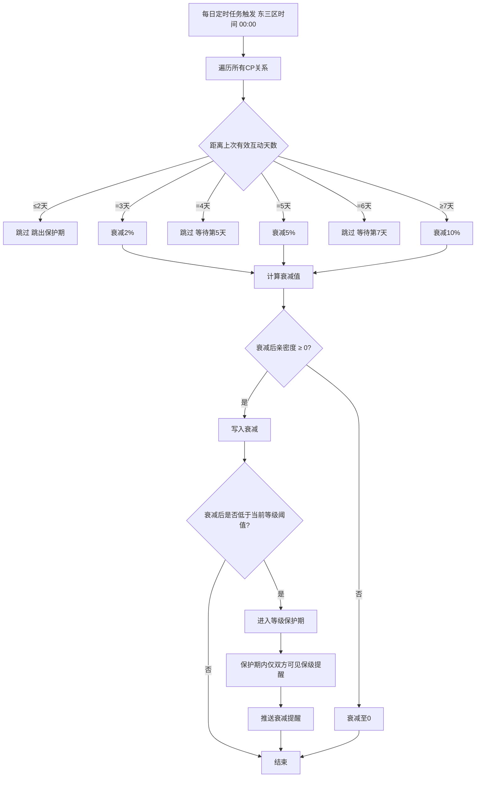
```mermaid
flowchart TD
    A[每日定时任务触发 东三区时间 00:00] --> B[遍历所有CP关系]
    B --> C{距离上次有效互动天数}
    C -->|≤2天| D[跳过 跳出保护期]
    C -->|=3天| E[衰减2%]
    C -->|=4天| F[跳过 等待第5天]
    C -->|=5天| G[衰减5%]
    C -->|=6天| H[跳过 等待第7天]
    C -->|≥7天| I[衰减10%]
    
    E --> J[计算衰减值]
    G --> J
    I --> J
    
    J --> K{衰减后亲密度 ≥ 0?}
    K -->|是| L[写入衰减]
    K -->|否| M[衰减至0]
    
    L --> 指定数量{衰减后是否低于当前等级阈值?}
    指定数量 -->|是| O[进入等级保护期]
    指定数量 -->|否| P[结束]
    
    O --> Q[保护期内仅双方可见保级提醒]
    Q --> R[推送衰减提醒]
    R --> P
    M --> P
```

**衰减规则确认**：
- 新绑定保护期（降级缓冲期）：绑定后3天内不触发衰减
- 衰减范围：仅影响总亲密度，不影响本周贡献值
- 数值下限：衰减后亲密度不得低于0，降至0时停止衰减
- 等级联动：衰减后如低于当前等级阈值 → 先进入等级保护期，保护期结束仍未恢复才正式降级


### 八、CP等级升降级流程

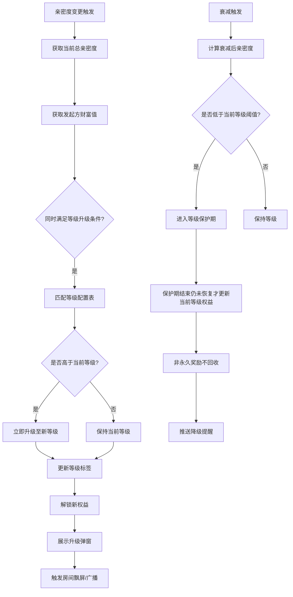
```mermaid
flowchart TD
    A[亲密度变更触发] --> B[获取当前总亲密度]
    B --> C[获取发起方财富值]
    C --> D{同时满足等级升级条件?}
    D -->|是| E[匹配等级配置表]
    E --> F{是否高于当前等级?}
    F -->|是| G[立即升级至新等级]
    F -->|否| H[保持当前等级]
    
    G --> I[更新等级标签]
    H --> I
    I --> J[解锁新权益]
    J --> K[展示升级弹窗]
    K --> L[触发房间飘屏/广播]
    
    M[衰减触发] --> 指定数量[计算衰减后亲密度]
    指定数量 --> O{是否低于当前等级阈值?}
    O -->|是| P[进入等级保护期]
    O -->|否| Q[保持等级]
    
    P --> R[保护期结束仍未恢复才更新当前等级权益]
    R --> S[非永久奖励不回收]
    S --> T[推送降级提醒]
```

**等级计算规则**：
- 升级条件：总亲密度 ≥ 等级下限 **且** 发起方财富值 ≥ 等级下限
- 降级条件：总亲密度低于当前等级下限（因衰减）
- 升级时机：亲密度写入后实时检测
- 降级时机：衰减后实时检测
- 新CP初始等级：等级1


### 九、系统提示弹窗触发流程


```mermaid
flowchart TD
    A[用户进入触发场景] --> B{是否满足触发条件?}
    B -->|否| C[不触发]
    B -->|是| D{用户是否已关闭提示?}
    D -->|是| C
    D -->|否| E{是否在冷却期?}
    E -->|是| C
    E -->|否| F{今日是否已弹窗?}
    F -->|是 且 每日限制1次| C
    F -->|否| G[展示系统提示弹窗]
    
    G --> H{用户操作}
    H -->|发起CP/去邀请| I[跳转CP邀请流程]
    H -->|去互动| J[跳转CP主页/私聊]
    H -->|下次再说| K[记录点击时间 开启72小时冷却]
    H -->|关闭| L[仅关闭弹窗]
    
    subgraph 触发条件判断
    B --> B1{场景: 私聊/好友列表/房间?}
    B1 -->|否| C
    B1 -->|是| B2{用户已有CP?}
    B2 -->|是| C
    B2 -->|否| B3{用户有待处理邀请?}
    B3 -->|是| C
    B3 -->|否| B4{触发条件满足?}
    B4 -->|互动频繁/好友无CP/衰减预警| G
    B4 -->|否| C
    end
```


---

## 一、用户端（用户端）

### 1. CP邀请模块

#### 模块背景

CP邀请模块是用户建立CP关系入口，包含发起邀请、接受邀请、拒绝邀请、邀请列表和邀请详情等功能。用户可通过多种入口发起CP邀请，被邀请者收到邀请后可接受或拒绝。

#### 用户场景

1. 用户A在个人主页或好友列表看到心仪对象，发起CP邀请
2. 用户B收到CP邀请通知，点击查看邀请详情，选择接受或拒绝
3. 用户A查看自己发出的邀请状态（待处理/已接受/已拒绝/已过期）

### 1.1 CP邀请发起入口

#### 功能说明

用户通过多种入口发起CP邀请，选择组建CP礼物后发送邀请给目标用户。

#### 对应原型


##### 图下需求拆解：礼物面板CP玩法入口

**功能说明：** 礼物面板内展示 CP 玩法入口，用户在送礼场景中可被引导进入 CP 组建流程。

**前置条件：**

| 条件项 | 说明 |
|---|---|
| 用户已登录 | 未登录不展示可操作入口 |
| CP 功能可用 | 当前版本、地区、用户分层允许使用 CP |
| 礼物面板已打开 | 房间或私聊礼物面板成功加载 |

**字段与数据来源：**

| 字段 | 说明 | 数据来源 |
|---|---|---|
| CP 入口图标 | 礼物面板中的 CP 玩法入口标识 | 客户端资源 |
| CP 入口文案 | 入口按钮/标签展示文案 | CP 功能配置 |
| 当前 CP 状态 | 未绑定/已绑定/待处理邀请 | CP 关系记录、邀请记录 |

**关键交互：** 点击 CP 入口后进入 CP 邀请发起链路；未绑定用户继续展示组建 CP 的引导和礼物选择。

**系统后台核心逻辑：** 入口展示不触发业务变更；点击后读取当前 CP 状态决定跳转目标；礼物面板的 CP 入口和资料卡、个人主页的 CP 入口使用同一状态口径。

**异常与测试关注点：** 覆盖未绑定入口点击、已绑定入口点击、入口点击后状态变化、礼物面板加载失败时入口不可用。


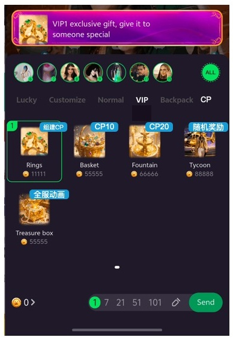


##### 图下需求拆解：礼物面板CP玩法入口2

**功能说明：** 礼物面板的另一种 CP 入口展示态，用于补充说明不同面板布局下 CP 入口的位置。业务规则与第一个入口完全一致，只是 UI 位置不同。

**前置条件：**

| 条件项 | 说明 |
|---|---|
| 用户已登录 | 未登录不展示可操作入口 |
| CP 功能可用 | 当前版本、地区、用户分层允许使用 CP |
| 礼物面板已打开 | 房间或私聊礼物面板成功加载 |

**字段与数据来源：**

| 字段 | 说明 | 数据来源 |
|---|---|---|
| CP 入口图标 | 礼物面板中的 CP 玩法入口标识 | 客户端资源 |
| CP 入口文案 | 入口按钮/标签展示文案 | CP 功能配置 |
| 当前 CP 状态 | 未绑定/已绑定/待处理邀请 | CP 关系记录、邀请记录 |

**关键交互：** 入口点击后仍进入同一邀请流程，不新增独立业务规则。

**系统后台核心逻辑：** 复用"礼物面板CP玩法入口"逻辑，不独立维护第二套规则。

**异常与测试关注点：** 同"礼物面板CP玩法入口"。


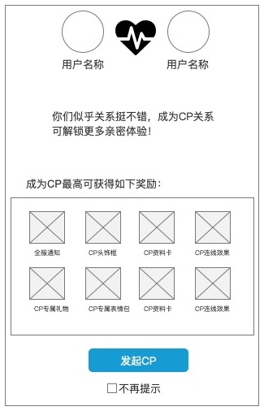


##### 图下需求拆解：系统提示组建CP-邀请者视角

**功能说明：** 邀请者侧的组建 CP 系统提示弹窗，在用户发起邀请前解释组建 CP 的价值、消耗和后续结果。该提示是邀请流程的前置引导，不是邀请本身。

**前置条件：**

| 条件项 | 说明 |
|---|---|
| 用户已登录且未绑定 CP | 已绑定用户不弹出组建提示 |
| 触发场景满足 | 用户在高频互动场景（如送礼、私聊、房间互动）中满足推荐条件 |
| 双方账号可交互 | 不处于封禁、注销、拉黑状态 |
| CP 功能可用 | 版本、地区、分层允许 |

**字段与数据来源：**

| 字段 | 说明 | 数据来源 |
|---|---|---|
| 提示文案 | 组建 CP 的价值说明和规则摘要 | CP 功能配置 |
| 组建礼物预览 | 组建所需礼物的图标、名称、金币价格 | 礼物配置 |
| 金币余额 | 当前用户可支付金币 | 钱包记录 |
| 对方资料摘要 | 推荐对象的头像、昵称 | 用户资料 |
| 确认按钮文案 | "组建CP"或"去邀请" | CP 功能配置 |
| 取消按钮文案 | "再想想"或"关闭" | CP 功能配置 |

**关键交互：** 用户确认后继续选择邀请对象或组建礼物；取消则关闭提示，不创建邀请。

**系统后台核心逻辑：** 提示展示不产生业务记录；确认后进入邀请弹窗，由邀请弹窗完成实际扣款和邀请创建；提示中的金币余额和礼物价格必须实时读取，不能使用进入页面时的旧值。

**异常与测试关注点：** 覆盖余额不足时提示、对方已绑定时提示不可组建、关闭后重新触发、提示展示期间关系状态变化。


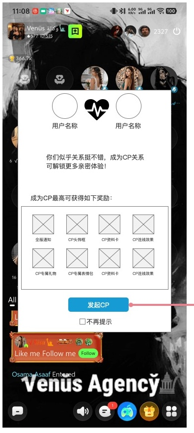


##### 图下需求拆解：系统主动提示组建CP

**功能说明：** 系统主动触发的组建 CP 引导，适用于用户在高频互动场景中满足推荐条件时弹出。与"系统提示组建CP-邀请者视角"的区别是触发方式不同：前者由用户操作触发，本提示由系统判断条件后主动弹出。

**前置条件：**

| 条件项 | 说明 |
|---|---|
| 用户未绑定 CP | 已绑定不触发 |
| 互动条件满足 | 系统判断双方互动频率、送礼记录、在线时长等达到推荐阈值 |
| 推荐频控未超限 | 同一用户不会频繁收到组建提示 |
| 双方可交互 | 不处于封禁、注销、拉黑状态 |

**字段与数据来源：**

| 字段 | 说明 | 数据来源 |
|---|---|---|
| 推荐对象资料 | 系统推荐对象的头像、昵称、等级 | 用户资料 |
| 推荐理由文案 | "你们互动很频繁"等引导文案 | CP 功能配置 |
| 组建礼物预览 | 图标、名称、金币价格 | 礼物配置 |
| 金币余额 | 当前用户可支付金币 | 钱包记录 |

**关键交互：** 用户点击主按钮进入邀请发起流程；关闭后本次引导结束，频控冷却期内不再弹出。

**系统后台核心逻辑：** 推荐算法由后台配置驱动；频控规则防止骚扰；关闭不记录为拒绝，只记录为跳过；提示展示不产生邀请记录。

**异常与测试关注点：** 覆盖频控冷却、对方已绑定、余额不足、关闭后短时间内不再弹出、跨设备频控同步。


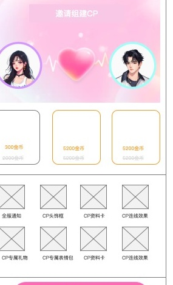


##### 图下需求拆解：邀请CP弹窗

**功能说明：** 邀请 CP 的核心弹窗，承载被邀请对象搜索/选择、组建礼物选择、金币消耗展示和确认邀请操作。这是邀请流程的实际操作界面，不是引导提示。

**前置条件：**

| 条件项 | 说明 |
|---|---|
| 用户未绑定 CP | 已绑定用户不进入邀请弹窗 |
| 用户无有效主动邀请 | 已有待处理主动邀请时不允许重复创建 |
| CP 功能可用 | 版本、地区、分层允许 |
| 钱包可读取 | 金币余额可实时查询 |

**字段与数据来源：**

| 字段 | 说明 | 数据来源 |
|---|---|---|
| 搜索输入框 | 输入用户编号或靓号搜索被邀请对象 | 客户端交互 |
| 搜索结果列表 | 匹配用户的头像、昵称、编号、等级 | 用户搜索服务 |
| 被邀请对象确认 | 选中对象的头像、昵称、编号 | 用户资料 |
| 组建礼物列表 | 可选礼物的图标、名称、金币价格 | 礼物配置 |
| 已选礼物 | 当前选中礼物的图标、名称、金币价格 | 用户选择+礼物配置 |
| 金币消耗 | 本次邀请需要支付的金币数 | 礼物配置 |
| 金币余额 | 当前用户可支付金币 | 钱包记录 |
| 余额不足提示 | 余额不够时的充值引导 | 客户端判断 |
| 确认邀请按钮 | "发送邀请" | CP 功能配置 |
| 取消按钮 | "取消"或"返回" | CP 功能配置 |

**关键交互：** 用户确认邀请后，系统校验双方 CP 状态、余额、礼物配置和风控限制；校验通过后扣减金币并创建邀请；校验失败展示具体原因。

**系统后台核心逻辑：** 创建邀请前必须同时校验：发起者未绑定、被邀请者未绑定、发起者无有效主动邀请、金币余额充足、礼物可购买、双方账号可交互、风控通过；扣款和邀请创建必须在同一事务中，任一失败则全部回滚；同一发起者同一时刻只能有一个有效主动邀请（Outgoing 单邀请限制）。

**异常与测试关注点：** 覆盖余额不足、对方已绑定、已有待处理邀请、搜索无结果、礼物下架、风控拦截、重复点击确认、扣款成功但邀请创建失败回滚、网络中断后重试。


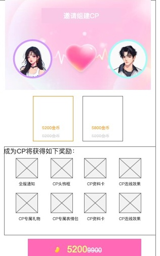


##### 图下需求拆解：邀请者视角邀请CP弹窗

**功能说明：** 邀请者视角下的邀请弹窗状态，展示邀请者提交前看到的信息。与"邀请CP弹窗"是同一弹窗的不同视角描述，重点在于提交前状态校验和提交后结果反馈。

**前置条件：** 同"邀请CP弹窗"。

**字段与数据来源：** 同"邀请CP弹窗"，额外关注提交后状态字段：

| 字段 | 说明 | 数据来源 |
|---|---|---|
| 提交结果 | 成功/失败及原因 | 邀请创建结果 |
| 待处理状态标识 | "等待对方回应" | CP 邀请记录 |
| 剩余有效期 | 邀请过期倒计时 | CP 邀请记录 |

**关键交互：** 提交成功后进入待对方处理状态，弹窗展示等待反馈；提交失败时展示余额不足、对方已绑定或风控限制等原因。

**系统后台核心逻辑：** 提交后邀请状态为待处理；倒计时按邀请创建时间+有效期计算；等待期间发起者不能创建新邀请。

**异常与测试关注点：** 覆盖提交成功、提交失败各类原因、等待期间对方已绑定其他用户、等待期间邀请过期自动取消。


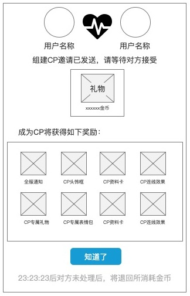


##### 图下需求拆解：CP邀请弹窗-邀请者视角

**功能说明：** 邀请者侧 CP 邀请确认弹窗，用于明确邀请内容和关系建立预期。该弹窗可能是邀请流程的最后一步确认，也可能用于查看已发出邀请的详情。

**前置条件：**

| 条件项 | 说明 |
|---|---|
| 邀请已存在或即将创建 | 弹窗绑定真实邀请记录 |
| 发起者身份确认 | 当前用户是该邀请的发起者 |
| 邀请状态可读取 | 系统后台可返回当前邀请状态 |

**字段与数据来源：**

| 字段 | 说明 | 数据来源 |
|---|---|---|
| 被邀请者资料 | 对方头像、昵称、编号、等级 | 用户资料 |
| 组建礼物信息 | 已选礼物的图标、名称、金币价格 | 礼物配置 |
| 金币消耗 | 本次邀请支付的金币数 | 钱包记录 |
| 邀请状态 | 待处理/已接受/已拒绝/已过期/已取消 | CP 邀请记录 |
| 剩余有效期 | 待处理状态的倒计时 | CP 邀请记录 |
| 确认按钮 | "确认邀请" | CP 功能配置 |
| 取消邀请按钮 | "取消邀请"（仅待处理状态可用） | CP 功能配置 |

**关键交互：** 用户确认后生成待处理邀请；同一发起者在已有有效主动邀请时不得重复创建；待处理状态下可取消邀请，取消后金币退回。

**系统后台核心逻辑：** 确认前重新校验双方关系状态、邀请有效期、组建礼物状态、用户余额和风控限制；确认后扣款和创建邀请必须原子操作；取消邀请时金币按原支付记录退回。

**异常与测试关注点：** 覆盖确认成功、余额不足、对方已绑定、已有待处理邀请、邀请过期、取消邀请退币、重复点击确认、网络中断后重试。


#### 前置条件

| 条件 | 说明 |
|---|---|
| 用户已登录 | 未登录用户不可见CP入口 |
| 用户未绑定CP | 已绑定CP用户发起邀请时轻提示提示「你已有CP关系」 |
| 目标用户未绑定CP | 目标用户已绑定CP时轻提示提示「对方已有CP关系」 |
| 双方未互相拉黑 | 拉黑状态下轻提示提示「无法向该用户发起邀请」 |
| 双方未开启自动拒绝 | 目标用户开启自动拒绝时邀请直接被设为已拒绝，原路退回金币 |
| 金币余额充足 | 余额不足时拉起充值页 |
| 不存在重复待处理邀请 | 存在待处理邀请时轻提示提示「你已有邀请待处理」 |

#### 触发方式

| 入口 | 触发方式 |
|---|---|
| CP主页邀请输入框 | 输入用户编号/靓号 → 点击搜索 → 点击「邀请组建CP」 |
| 好友推荐列表卡片 | 点击「邀请组建CP」按钮 |
| 用户资料卡「+」按钮 | 点击他人资料页「+」按钮 |
| 系统自动提示弹窗 | 点击「发起CP」按钮 |
| 房间礼物面板CP分类 | 选择组建CP礼物 → 点击赠送 |

#### 字段与数据来源

| 字段 | 说明 | 统计方式 | 数据来源 |
|---|---|---|---|
| 目标用户编号 | 被邀请者唯一标识 | 直接输入或选择 | 用户输入/好友列表 |
| 目标用户昵称 | 被邀请者显示名称 | 直接读取 | 用户中心 |
| 目标用户头像 | 被邀请者头像页面地址 | 直接读取 | 用户中心 |
| 目标用户等级 | 财富/魅力等级 | 直接读取 | 用户等级表 |
| 组建CP礼物列表 | 可选礼物清单 | 读取后台配置中可用于组建CP的礼物 | 礼物配置 |
| 礼物金币价值 | 单个礼物价值 | 直接读取 | 礼物配置表 |
| 礼物亲密度加成 | 组建CP礼物倍率 | 读取配置 | 礼物配置表，默认1.5倍 |
| 发起者金币余额 | 当前可用金币 | 实时读取 | 用户资产表 |
| 邀请有效期 | 邀请已过期时间 | 读取配置+计算 | 配置表默认24小时，系统后台东三区时间时间计算 |

#### 交互逻辑

**发起流程：**

1. 用户点击CP入口（资料卡「+」/好友列表「邀请组建CP」/礼物面板CP分类）
2. 系统弹出CP邀请弹窗，展示目标用户信息和组建CP礼物列表
3. 用户选择礼物 → 底部实时显示总价和亲密度预览
4. 用户点击「发起CP邀请（X金币）」按钮
5. 系统执行前置校验（见上表）
6. 若校验通过：扣减金币 → 创建邀请记录 → 发送通知给被邀请者 → 展示邀请成功弹窗
7. 若校验不通过：轻提示提示对应错误信息

**扣费失败处理：**

1. 金币余额不足 → 轻提示提示「金币余额不足，请充值」→ 拉起半屏充值页面
2. 扣费成功但邀请创建失败 → 回滚金币 → 轻提示提示「邀请发送失败，请稍后重试」

#### 系统后台核心逻辑

| 步骤 | 逻辑 |
|---|---|
| 1. 身份校验 | 验证用户token有效，查询用户状态 |
| 2. 关系校验 | 查询CP关系记录，确认发起者和目标用户均未绑定CP |
| 3. 黑名单校验 | 查询黑名单表，确认双方未互相拉黑 |
| 4. 自动拒绝校验 | 查询目标用户配置，若开启自动拒绝则直接返回已拒绝状态 |
| 5. 重复邀请校验 | 查询CP邀请记录，确认无相同用户对的待处理状态邀请 |
| 6. 风控校验 | 查询风控表，确认发起者未被限制CP功能 |
| 7. 金币扣减 | 调用资产服务扣减礼物对应金币数量 |
| 8. 创建邀请记录 | 写入CP邀请记录，状态为待处理，设置已过期时间（东三区时间） |
| 9. 推送通知 | 调用消息服务，向被邀请者推送邀请通知卡片 |
| 10. 返回结果 | 返回成功或失败信息 |

**幂等性保证：**

- 邀请记录使用唯一索引（发起者编号 + 被邀请者编号 + 创建时间戳）
- 金币扣减使用事务，失败则回滚

#### 权限控制

| 权限 | 说明 |
|---|---|
| 普通用户 | 可发起CP邀请 |
| 封禁用户 | 不可发起CP邀请 |
| 风控限制用户 | 限制发起频率或禁止发起 |

#### 状态设计

| 状态 | 英文 | 触发条件 | 说明 |
|---|---|---|---|
| 待处理 | 待处理 | 邀请创建成功 | 等待被邀请者响应 |
| 已接受 | 已接受 | 被邀请者点击接受 | CP关系建立成功 |
| 已拒绝 | 已拒绝 | 被邀请者点击拒绝 / 目标用户开启自动拒绝 | 金币退回发起者 |
| 已过期 | 已过期 | 超过有效期未响应 | 金币自动退回 |
| 已取消 | 已取消 | 发起者建立其他CP关系后自动取消 | 金币退回 |

#### 边界情况

| 场景 | 处理方式 |
|---|---|
| 发起过程中目标用户绑定CP | 邀请创建失败，轻提示提示「对方已有CP关系」 |
| 发起过程中发起者绑定CP | 邀请创建失败，轻提示提示「你已有CP关系」 |
| 网络中断 | 显示加载中，重试3次，失败则轻提示提示网络错误 |
| 系统后台超时 | 超时5秒后轻提示提示「请求超时，请稍后重试」 |

---

### 1.2 CP邀请接受

#### 功能说明

被邀请者收到CP邀请后，查看邀请详情并选择接受，建立CP关系。

#### 对应原型

**状态一：被邀请者收到邀请待处理**

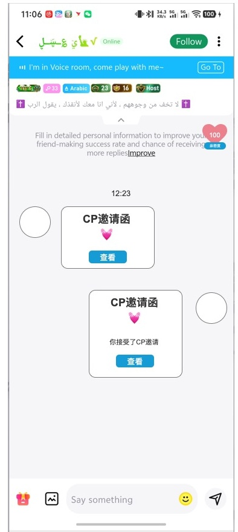


##### 图下需求拆解：CP邀请函-被邀请者视角

**功能说明：** 被邀请者在私聊中收到 CP 邀请函消息卡片。卡片展示邀请来源、邀请者资料、组建礼物和"查看"入口。这是通知型卡片，不是操作页面——点击"查看"后才进入邀请详情执行接受/拒绝。

**前置条件：**

| 条件项 | 说明 |
|---|---|
| 邀请已成功创建 | 卡片绑定真实有效的邀请记录 |
| 被邀请者可接收消息 | 账号未封禁、未注销 |
| 消息通道正常 | 私聊消息可送达 |

**字段与数据来源：**

| 字段 | 说明 | 数据来源 |
|---|---|---|
| 邀请者头像 | 发起邀请用户的头像 | 用户资料 |
| 邀请者昵称 | 发起邀请用户的昵称 | 用户资料 |
| 邀请文案 | "邀请你组建CP"或类似 | CP 消息模板 |
| 组建礼物图标 | 邀请附带的礼物图标 | 礼物配置 |
| 组建礼物名称 | 礼物名称 | 礼物配置 |
| 剩余有效期 | 邀请过期倒计时 | CP 邀请记录 |
| 查看按钮 | "查看"入口 | 消息卡片配置 |

**关键交互：** 被邀请者点击"查看"后进入邀请详情或确认弹窗；若邀请已过期、已取消或双方任一方已绑定 CP，则点击后展示不可处理提示并重新加载当前状态。

**系统后台核心逻辑：** 卡片展示时消息内容在邀请创建时生成，但点击时必须重新读取邀请当前状态；卡片不等于邀请仍有效，不能通过旧卡片绕过状态校验；邀请过期后卡片不自动删除，但点击后展示过期结果。

**异常与测试关注点：** 覆盖收到邀请卡片、点击查看待处理邀请、点击查看已过期邀请、点击查看已取消邀请、点击查看时对方已绑定、重复点击查看、消息延迟到达、跨设备消息同步。


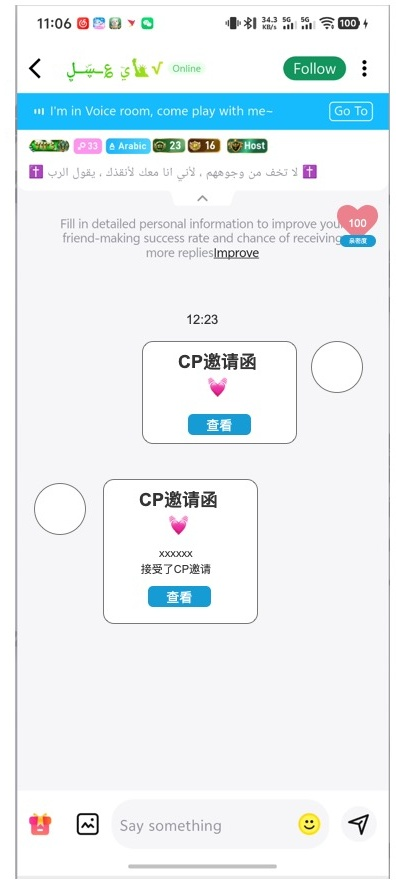


##### 图下需求拆解：CP邀请函-邀请者视角

**功能说明：** 邀请者在私聊中查看自己发出的 CP 邀请结果消息。原型文案为"对方昵称 + 接受了CP邀请"，表示对方已接受邀请并完成 CP 关系建立。这是结果态卡片，不是等待态。

**前置条件：**

| 条件项 | 说明 |
|---|---|
| 邀请已被接受 | 邀请状态为已接受，CP 关系已建立 |
| 邀请者可接收消息 | 账号正常 |

**字段与数据来源：**

| 字段 | 说明 | 数据来源 |
|---|---|---|
| 被邀请者昵称 | 接受邀请用户的昵称 | 用户资料 |
| 结果文案 | "接受了CP邀请" | CP 消息模板 |
| CP 关系入口 | "查看"跳转 CP 主页 | 消息卡片配置 |
| 初始亲密度 | 建立关系后的起始亲密度 | CP 关系记录、亲密度流水 |
| CP 等级 | 初始等级 | CP 等级配置 |

**关键交互：** 邀请者点击"查看"后进入 CP 关系详情或 CP 主页已绑定态；页面展示双方已成为 CP、当前亲密度、初始等级和后续可进行的 CP 互动入口。

**系统后台核心逻辑：** 邀请状态变为已接受后，必须同步生成 CP 关系、更新双方私聊消息卡片状态、刷新 CP 主页和房间展示；该状态下不再展示取消邀请按钮。

**异常与测试关注点：** 覆盖接受结果展示、点击进入 CP 主页、关系建立后主页刷新、消息延迟展示、跨设备消息同步。


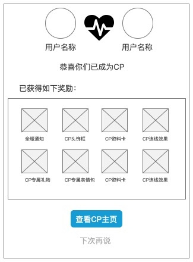


##### 图下需求拆解：CP邀请接受弹窗-被邀请者视角

**功能说明：** 被邀请者点击接受后的二次确认弹窗，避免误触直接建立关系。弹窗再次展示邀请关键信息，要求用户明确确认后才执行接受操作。

**前置条件：**

| 条件项 | 说明 |
|---|---|
| 邀请仍为待处理 | 邀请状态必须为待处理且未过期 |
| 双方均未绑定其他 CP | 接受前重新校验 |
| 邀请记录存在 | 邀请编号可查询 |

**字段与数据来源：**

| 字段 | 说明 | 数据来源 |
|---|---|---|
| 邀请者头像 | 发起者头像 | 用户资料 |
| 邀请者昵称 | 发起者昵称 | 用户资料 |
| 组建礼物信息 | 礼物图标、名称 | 礼物配置 |
| 确认文案 | "确认接受" | CP 功能配置 |
| 取消文案 | "再想想" | CP 功能配置 |
| 建立结果预览 | 接受后亲密度增加量 | 礼物配置×亲密度倍率 |

**关键交互：** 用户确认接受后，系统再次校验双方当前 CP 状态、邀请有效期和礼物状态；校验通过建立 CP 关系并失效双方其他待处理邀请。

**系统后台核心逻辑：** 接受操作必须使用分布式锁以被邀请者用户编号为并发控制依据，防止同时接受多个邀请；接受成功后：①建立 CP 关系 ②失效双方其他待处理邀请 ③按组建礼物计算初始亲密度并写入流水 ④向双方发送接受通知 ⑤刷新 CP 主页、资料卡、房间展示。

**异常与测试关注点：** 覆盖接受成功、已过期后接受、已拒绝后再次接受、双方任一方已绑定、重复点击接受、并发接受多个邀请、网络中断后重新进入。


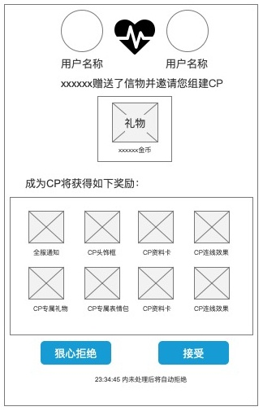


##### 图下需求拆解：CP邀请弹窗-被邀请者视角

**功能说明：** 被邀请者侧邀请弹窗，展示邀请内容（邀请者资料、组建礼物、邀请说明）和关系建立提示。弹窗提供"接受"和"拒绝"两个操作入口。

**前置条件：**

| 条件项 | 说明 |
|---|---|
| 被邀请者身份确认 | 当前用户是该邀请的被邀请者 |
| 邀请状态为待处理 | 已过期/已取消/已处理邀请不展示可操作按钮 |
| 双方均可交互 | 不处于封禁、注销、拉黑状态 |

**字段与数据来源：**

| 字段 | 说明 | 数据来源 |
|---|---|---|
| 邀请者头像 | 发起者头像 | 用户资料 |
| 邀请者昵称 | 发起者昵称 | 用户资料 |
| 邀请者等级 | 发起者 CP 或用户等级 | 用户资料/等级配置 |
| 组建礼物图标 | 礼物图标 | 礼物配置 |
| 组建礼物名称 | 礼物名称 | 礼物配置 |
| 接受后亲密度预览 | 接受后增加的亲密度 | 礼物配置×亲密度倍率 |
| 接受按钮 | "接受邀请" | CP 功能配置 |
| 拒绝按钮 | "拒绝" | CP 功能配置 |
| 剩余有效期 | 邀请过期倒计时 | CP 邀请记录 |

**关键交互：** 接受后建立 CP 关系；拒绝后弹出二次确认；若邀请已过期或已失效，系统提示不可操作并重新加载状态。

**系统后台核心逻辑：** 点击接受前必须重新校验邀请状态、有效期、双方当前 CP 关系和风控结果；不可使用弹窗打开时的旧状态直接建立关系；拒绝操作需写入拒绝原因（用户手动拒绝 vs 自动拒绝）。

**异常与测试关注点：** 覆盖正常接受、邀请已过期、邀请已取消、发起者已绑定、被邀请者已绑定、重复点击接受、网络中断后重新进入、弹窗打开期间邀请状态变化。


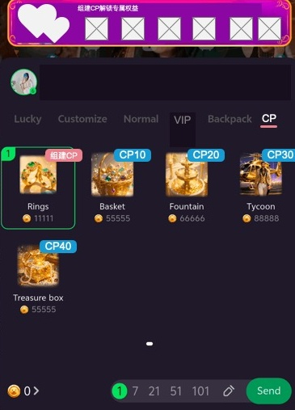


##### 图下需求拆解：房间内绑定CP-邀请者视角

**功能说明：** CP 关系建立后在房间场景中的绑定展示。该图展示的是邀请者（发起者）在房间内看到的关系标识，证明接受成功后关系状态会同步到互动场景。

**前置条件：**

| 条件项 | 说明 |
|---|---|
| CP 关系已建立 | 邀请已被接受，关系状态为已绑定 |
| 用户在房间内 | 当前场景为房间 |
| 房间支持 CP 展示 | 房间类型允许展示关系标识 |

**字段与数据来源：**

| 字段 | 说明 | 数据来源 |
|---|---|---|
| CP 对象头像 | 对方在房间中的头像 | 用户资料 |
| CP 等级标识 | 当前 CP 等级徽章 | CP 等级配置 |
| CP 关系图标 | 房间内关系标识样式 | 客户端资源/CP 等级配置 |

**关键交互：** 建立成功后双方房间展示 CP 关系标识；点击关系标识可查看 CP 摘要或进入 CP 主页；后续送礼可按 CP 关系计入亲密度。

**系统后台核心逻辑：** 房间内 CP 标识必须读取当前有效 CP 关系；关系建立、解除、等级变化后，房间展示要同步更新，不能只依赖进入房间时的旧状态；用户退出房间再进入时必须重新读取关系状态。

**异常与测试关注点：** 覆盖关系建立后房间展示、解除后标识消失、双方不在同房间、等级变化后展示更新、退出重进房间、消息延迟同步。


#### 私聊邀请函消息卡片状态规则

| 卡片状态 | 出现场景 | 当前用户看到的文案 | 点击「查看」后的去向 | 可操作动作 | 状态校验规则 |
|---|---|---|---|---|---|
| 发出邀请待处理 | 当前用户发出邀请，对方尚未处理 | CP邀请函 | 邀请详情页或待处理详情弹窗 | 查看详情；是否允许取消以最终原型为准 | 进入详情时重新校验邀请仍为待处理、未过期、双方未绑定 CP |
| 收到邀请待处理 | 当前用户收到对方邀请，尚未处理 | CP邀请函 | 邀请详情页或接受确认弹窗 | 接受、拒绝、关闭 | 接受或拒绝前重新校验邀请状态、有效期、双方关系状态和风控结果 |
| 对方已接受 | 当前用户发出的邀请被对方接受 | 对方昵称 + 接受了CP邀请 | CP主页已绑定态或 CP关系详情 | 查看关系详情，不再允许取消或重复邀请 | 必须已生成 CP关系；若消息延迟到达，以当前 CP关系状态为准 |
| 当前用户已接受 | 当前用户接受对方邀请后回到私聊 | 你已接受CP邀请或等价结果文案 | CP主页已绑定态或 CP关系详情 | 查看关系详情 | 关系建立成功后双方消息、主页、房间展示必须同步 |
| 已拒绝 | 任一方拒绝邀请 | 已拒绝CP邀请或等价结果文案 | 邀请详情结果页 | 只允许查看结果，不允许再接受 | 已拒绝邀请不能再次处理，组建礼物按退款规则处理 |
| 已过期 | 邀请超过有效期未处理 | CP邀请已过期或等价结果文案 | 邀请详情结果页 | 只允许查看结果，不允许接受 | 过期状态由系统后台按东三区时间计算并写入，页面不得自行判断后直接建立关系 |
| 已取消 | 发起方取消邀请或系统取消其他待处理邀请 | CP邀请已取消或等价结果文案 | 邀请详情结果页 | 只允许查看结果 | 已取消邀请不可恢复；若用户已建立其他 CP关系，相关待处理邀请自动失效 |

**开发补充：** 私聊消息卡片只承载展示和跳转，不能作为业务状态唯一依据。每次点击「查看」、接受、拒绝、取消，都必须读取当前邀请记录和 CP关系记录，避免用户通过旧消息卡片处理已失效邀请。

**测试补充：** 必须用同一张旧消息卡片反复测试状态变化：待处理时打开、过期后打开、对方已接受后打开、关系已解除后打开、网络延迟后打开，确保页面展示与当前业务状态一致。

#### 前置条件

| 条件 | 说明 |
|---|---|
| 邀请状态为待处理 | 已过期/已取消/已拒绝的邀请不可接受 |
| 当前时间未超过有效期 | 超时自动变更为已过期 |
| 双方仍未绑定CP | 任一方已绑定CP则接受失败 |
| 邀请未被风控拦截 | 风控拦截的邀请不可接受 |

#### 触发方式

| 入口 | 触发方式 |
|---|---|
| 私聊邀请函消息卡片 | 点击「接受邀请」按钮 |
| 邀请详情页 | 点击「接受邀请」按钮 |
| CP主页邀请列表 | 点击待处理邀请 → 点击「接受」 |

#### 字段与数据来源

| 字段 | 说明 | 统计方式 | 数据来源 |
|---|---|---|---|
| 邀请编号 | 唯一标识 | 直接读取 | CP邀请记录 |
| 发起者编号 | 邀请者用户编号 | 直接读取 | CP邀请记录 |
| 发起者昵称 | 邀请者显示名称 | 关联查询 | 用户中心 |
| 发起者头像 | 邀请者头像页面地址 | 关联查询 | 用户中心 |
| 礼物信息 | 礼物图标+名称+价值 | 直接读取 | CP邀请记录关联礼物配置 |
| 邀请创建时间 | 邀请发起时间 | 直接读取 | CP邀请记录 |
| 邀请已过期时间 | 倒计时显示 | 计算：已过期时间-当前时间 | CP邀请记录 |
| 亲密度预览 | 接受后初始亲密度 | 计算：礼物金币×1.5 | 礼物配置+计算 |

#### 交互逻辑

**接受流程：**

1. 被邀请者收到邀请通知卡片（私聊消息卡片形式）
2. 点击卡片展开邀请详情弹窗
3. 弹窗展示：发起者头像+昵称、礼物信息、亲密度预览、剩余时间
4. 用户点击「接受邀请」按钮
5. 系统执行校验：邀请状态、已过期时间、双方CP状态
6. 若校验通过：
   - 创建CP关系记录
   - 初始化亲密度（礼物金币×1.5）
   - 更新邀请状态为已接受
   - 触发房间广播（如在房间内）
   - 自动取消用户发出的其他待处理邀请
   - 自动拒绝用户收到的其他待处理邀请
   - 给发起者增加财富值（礼物金币×1）
7. 弹出「恭喜成为CP」结果页
8. 若校验不通过：轻提示提示对应错误

#### 系统后台核心逻辑

| 步骤 | 逻辑 |
|---|---|
| 1. 邀请状态校验 | 查询CP邀请记录，确认状态为待处理 |
| 2. 有效期校验 | 确认当前时间 < 已过期时间（东三区时间） |
| 3. 双方CP状态校验 | 查询CP关系记录，确认双方均未绑定 |
| 4. 创建CP关系 | 写入CP关系记录，状态为已绑定 |
| 5. 初始化亲密度 | 写入亲密度流水记录，类型为组建CP礼物 |
| 6. 更新邀请状态 | 更新CP邀请记录状态为已接受 |
| 7. 增加发起者财富值 | 更新发起者用户资产表 |
| 8. 清空其他邀请 | 更新用户发出的其他待处理邀请为已取消 |
| 9. 拒绝其他收到的邀请 | 更新用户收到的其他待处理邀请为已拒绝 |
| 10. 推送通知 | 向发起者推送「邀请被接受」通知 |
| 11. 触发广播 | 若双方在同一房间，触发房间CP广播 |

**并发处理：**

- CP关系创建必须以双方用户编号作为并发控制依据，保证同一用户同一时间只能建立一段有效 CP关系。
- 同时接受多个邀请时，仅第一笔成功，后续操作返回「你已有CP关系」。
- 同一邀请被重复点击接受时，只允许第一次处理成功，后续点击返回当前已接受结果，不重复创建关系、不重复增加亲密度、不重复推送通知。

#### 权限控制

| 权限 | 说明 |
|---|---|
| 被邀请者 | 仅被邀请者可接受该邀请 |
| 邀请者 | 可查看邀请结果，不可代替被邀请者接受 |
| 非双方用户 | 不可查看邀请详情，不可操作 |
| 被风控限制用户 | 可查看历史结果；是否允许接受新邀请按风控策略判断 |

#### 状态设计

| 对象 | 处理前状态 | 处理后状态 | 页面表现 |
|---|---|---|---|
| CP邀请 | 待处理 | 已接受 | 双方私聊消息卡片展示接受结果 |
| CP关系 | 无有效关系 | 已绑定 | CP主页、资料页、房间内展示双方 CP关系 |
| 其他已发邀请 | 待处理 | 已取消 | 再次打开旧卡片时展示已取消结果 |
| 其他收到邀请 | 待处理 | 已拒绝或已失效 | 再次打开旧卡片时不可接受 |
| 组建礼物 | 已支付并锁定 | 计入 CP建立结果 | 不重复扣款，不重复退款 |

#### 边界条件

| 场景 | 处理方式 | 测试重点 |
|---|---|---|
| 点击接受时邀请已过期 | 轻提示提示「邀请已过期」，重新加载状态为已过期 | 旧消息卡片不可继续建立关系 |
| 点击接受时发起者已绑定 CP | 轻提示提示「对方已有CP关系」，邀请自动变更为已取消 | 发起者与其他人刚建立关系后的旧邀请处理 |
| 点击接受时被邀请者已绑定 CP | 轻提示提示「你已有CP关系」，当前邀请不可接受 | 被邀请者在多设备上先接受另一邀请 |
| 双方同时互相发起邀请 | 后发起方自动接受对方邀请，不重复扣款 | 只生成一段 CP关系，一笔组建礼物按规则结算 |
| 多设备同时点击接受 | 仅第一台设备成功，其余设备展示已绑定结果 | 不重复创建关系、不重复推送 |
| 消息延迟到达 | 点击「查看」时按当前关系状态展示，不按消息到达时间判断 | 延迟消息不应把已解除关系误判为新关系 |
| 接受成功后立即退出页面 | 后台继续完成关系建立、消息通知和页面状态同步 | 再次进入页面展示已绑定态 |

#### 异常处理

| 异常场景 | 用户看到的反馈 | 系统处理 |
|---|---|---|
| 网络中断 | 展示「网络异常，请稍后重试」 | 不改变邀请状态；用户可重新点击 |
| 系统处理超时 | 展示「处理中，请稍后查看结果」 | 后台继续处理；再次进入时读取最终状态 |
| 关系创建成功但通知发送失败 | 用户进入 CP主页仍展示已绑定 | 记录通知补偿任务，后续补发或在消息列表补齐结果卡片 |
| 关系创建失败但邀请已改状态 | 自动回滚邀请状态并记录异常 | 后台告警，用户看到失败提示 |
| 礼物或资产结算失败 | 不建立 CP关系或进入待补偿状态 | 必须记录补偿明细，禁止出现关系已建立但礼物资产缺失 |

#### 行为统计

| 统计行为 | 触发时机 | 记录内容 | 用途 |
|---|---|---|---|
| 查看CP邀请函 | 用户点击私聊中的「查看」 | 当前用户、邀请记录、卡片状态、进入来源 | 分析邀请查看率 |
| 接受CP邀请 | 用户点击确认接受且处理成功 | 邀请记录、双方用户、组建礼物、接受时间 | 分析邀请成功率 |
| 接受失败 | 用户点击接受但被系统拦截 | 失败原因、邀请状态、双方关系状态 | 定位过期、重复点击、已绑定等问题 |
| 邀请结果消息展示 | 邀请状态变为已接受后消息卡片展示 | 接收用户、展示时间、消息类型 | 验证结果通知是否到达 |
| 查看已绑定关系 | 用户从邀请结果卡片进入 CP主页 | 双方用户、CP关系、入口来源 | 分析接受后转化行为 |

---

### 1.3 CP邀请拒绝

#### 功能说明

被邀请者选择拒绝CP邀请，金币退回发起者。

#### 对应原型

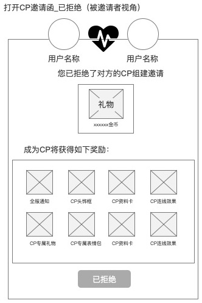


##### 图下需求拆解：CP邀请拒绝弹窗-被邀请者视角

**功能说明：** 被邀请者拒绝邀请时的确认或结果弹窗，明确拒绝动作不可恢复。拒绝后邀请状态变为已拒绝，组建礼物消耗的金币必须退回发起者。

**前置条件：**

| 条件项 | 说明 |
|---|---|
| 邀请仍为待处理 | 已过期/已取消/已接受邀请不可拒绝 |
| 被邀请者身份确认 | 当前用户是该邀请的被邀请者 |
| 拒绝操作需二次确认 | 避免误触 |

**字段与数据来源：**

| 字段 | 说明 | 数据来源 |
|---|---|---|
| 邀请者资料 | 发起者头像、昵称 | 用户资料 |
| 组建礼物信息 | 礼物图标、名称、金币价格 | 礼物配置 |
| 退币金额 | 拒绝后退回给发起者的金币数 | 钱包记录/礼物配置 |
| 确认拒绝按钮 | "狠心拒绝" | CP 功能配置 |
| 取消按钮 | "再想想" | CP 功能配置 |
| 拒绝结果文案 | "已拒绝该邀请" | CP 功能配置 |

**关键交互：** 用户确认拒绝后，邀请状态变为已拒绝，并触发发起者通知和退币逻辑；取消则关闭弹窗，邀请保持待处理。

**系统后台核心逻辑：** 拒绝必须写入拒绝原因（用户手动拒绝），与自动拒绝区分；拒绝后金币按原支付记录退回发起者，并记录退币流水；拒绝结果通知必须等退币处理完成后再发送；同一邀请只能拒绝一次。

**异常与测试关注点：** 覆盖被邀请者拒绝、发起者看到拒绝结果、退币到账、退币失败补偿、重复拒绝、拒绝后再接受不可用、网络中断后重新操作。


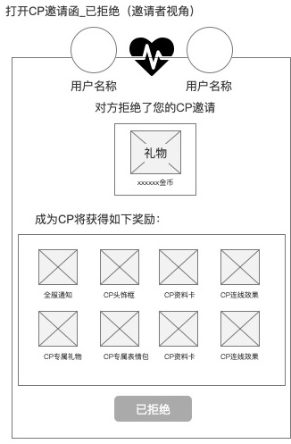


##### 图下需求拆解：CP邀请拒绝弹窗-邀请者视角

**功能说明：** 邀请者收到对方拒绝后的结果反馈，告知本次 CP 邀请失败。该弹窗或通知卡片展示拒绝结果和退币信息。

**前置条件：**

| 条件项 | 说明 |
|---|---|
| 邀请已被拒绝 | 邀请状态为已拒绝 |
| 邀请者身份确认 | 当前用户是该邀请的发起者 |
| 退币处理已完成 | 金币退回成功后再展示退币结果 |

**字段与数据来源：**

| 字段 | 说明 | 数据来源 |
|---|---|---|
| 被邀请者资料 | 对方头像、昵称 | 用户资料 |
| 拒绝结果文案 | "对方拒绝了你的CP邀请" | CP 消息模板 |
| 退币金额 | 退回的金币数 | 钱包记录 |
| 退币状态 | 已退回/退回处理中 | 钱包处理结果 |
| 重新邀请入口 | "重新邀请"（允许再次发起） | CP 功能配置 |

**关键交互：** 系统展示拒绝结果和退币信息；用户可点击重新邀请进入新的邀请流程；退币处理中时展示"退回处理中"。

**系统后台核心逻辑：** 拒绝结果通知必须在退币成功后发送；退币金额必须与原支付金额一致；退币失败时通知展示退回处理中，并生成补偿任务；拒绝后发起者可重新发起邀请，但需重新校验风控和状态。

**异常与测试关注点：** 覆盖拒绝结果展示、退币到账、退币失败处理中、重新邀请、消息延迟到达、跨设备通知同步。


#### 前置条件

| 条件 | 说明 |
|---|---|
| 邀请状态为待处理 | 已过期/已取消的邀请不可拒绝 |

#### 触发方式

| 入口 | 触发方式 |
|---|---|
| 邀请详情弹窗 | 点击「狠心拒绝」按钮 → 弹出二次确认弹窗 → 点击确认 |
| 邀请列表 | 左滑删除/点击拒绝按钮 |

#### 字段与数据来源

| 字段 | 说明 | 统计方式 | 数据来源 |
|---|---|---|---|
| 邀请编号 | 唯一标识 | 直接读取 | CP邀请记录 |
| 发起者编号 | 邀请者用户编号 | 直接读取 | CP邀请记录 |
| 礼物金币价值 | 待退回金额 | 直接读取 | CP邀请记录关联礼物配置 |

#### 交互逻辑

**拒绝流程：**

1. 用户在邀请详情弹窗点击「狠心拒绝」
2. 弹出二次确认弹窗：「确定拒绝该邀请？拒绝后金币将退回对方」
3. 用户点击「确认拒绝」
4. 系统更新邀请状态为已拒绝
5. 金币原路退回发起者
6. 向发起者推送「邀请被拒绝」通知
7. 轻提示提示「已拒绝」，弹窗关闭

#### 系统后台核心逻辑

| 步骤 | 逻辑 |
|---|---|
| 1. 邀请状态校验 | 确认状态为待处理 |
| 2. 更新邀请状态 | 更新CP邀请记录状态为已拒绝 |
| 3. 退回金币 | 调用资产服务，给发起者增加对应金币 |
| 4. 推送通知 | 向发起者推送拒绝通知 |
| 5. 写入流水 | 记录金币退回流水 |

#### 边界情况

| 场景 | 处理方式 |
|---|---|
| 用户接受某邀请后 | 自动拒绝其他待处理邀请，金币退回各发起者 |
| 拒绝时网络中断 | 重试3次，失败则轻提示提示网络错误 |
| 拒绝后再次邀请 | 被拒绝后可再次发起邀请，不受限制（每次邀请独立扣款） |

---

### 1.4 CP邀请列表

#### 功能说明

展示与当前用户相关的 CP邀请记录，用于查看待处理邀请及历史邀请结果。页面结构按原型中的邀请列表、邀请卡片和邀请详情链路描述。

#### 对应原型

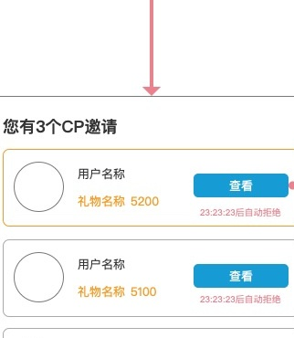


##### 图下需求拆解：CP邀请列表

**功能说明：** 当前用户作为发起者或被邀请者的 CP 邀请列表，用于查看与自己相关的邀请记录和待处理状态。列表按原型展示邀请卡片，每张卡片可点击进入详情。

**前置条件：**

| 条件项 | 说明 |
|---|---|
| 用户已登录 | 未登录不展示邀请列表 |
| 存在邀请记录 | 用户至少有一条邀请记录（含历史记录） |

**字段与数据来源：**

| 字段 | 说明 | 数据来源 |
|---|---|---|
| 邀请者资料 | 发起者头像、昵称 | 用户资料 |
| 被邀请者资料 | 被邀请者头像、昵称 | 用户资料 |
| 邀请状态标签 | 待处理/已接受/已拒绝/已过期/已取消 | CP 邀请记录 |
| 组建礼物图标 | 礼物图标 | 礼物配置 |
| 创建时间 | 邀请发起时间 | CP 邀请记录 |
| 剩余有效期 | 待处理状态的倒计时 | CP 邀请记录 |

**关键交互：** 用户点击邀请卡片进入详情页；列表不额外定义原型未展示的筛选控件；待处理邀请排在最前；列表按时间倒序展示。

**系统后台核心逻辑：** 列表必须读取系统后台当前邀请状态，不能只按本地缓存展示；邀请状态变化后列表必须刷新；分页加载避免一次性返回全量记录；待处理邀请数用于 CP 入口红点统计。

**异常与测试关注点：** 覆盖空列表、待处理邀请展示、已处理邀请展示、邀请状态变化后刷新、分页加载、网络失败重试。


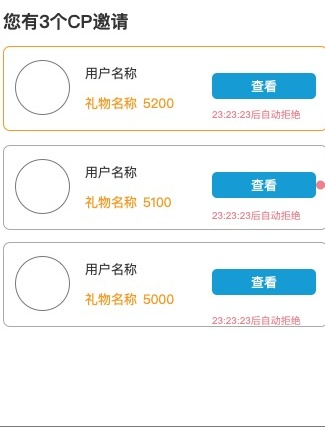


##### 图下需求拆解：被邀请者视角-CP邀请列表

**功能说明：** 被邀请者视角的邀请列表，重点展示收到的邀请和待处理状态。与"CP邀请列表"是同一列表的不同视角描述，区别在于默认排序和操作入口：被邀请者视角优先展示待处理的 Incoming 邀请。

**前置条件：** 同"CP邀请列表"。

**字段与数据来源：** 同"CP邀请列表"，额外关注被邀请者操作字段：

| 字段 | 说明 | 数据来源 |
|---|---|---|
| 接受按钮 | 待处理邀请上的"接受"入口 | CP 功能配置 |
| 拒绝按钮 | 待处理邀请上的"拒绝"入口 | CP 功能配置 |

**关键交互：** 被邀请者可在列表中直接对待处理邀请执行接受或拒绝；也可点击进入详情再操作；接受/拒绝前必须重新校验邀请当前状态。

**系统后台核心逻辑：** 被邀请者可同时收到多个待处理邀请（Incoming 多邀请队列）；但只能接受一个，接受后其他邀请自动失效；自动拒绝开关开启时，新邀请在到达列表前就已变为已拒绝。

**异常与测试关注点：** 覆盖多邀请同时存在、接受一个后其他失效、自动拒绝后列表展示、已过期邀请展示、已取消邀请展示。


#### 前置条件

- 用户已登录

#### 触发方式

- 从CP主页或消息通知中的 CP邀请入口进入
- 若原型入口与实际用户端入口不一致，以最终原型为准

#### 字段与数据来源

| 字段 | 说明 | 统计方式 | 数据来源 |
|---|---|---|---|
| 邀请编号 | 邀请记录唯一标识 | 直接读取 | CP邀请记录 |
| 对方用户信息 | 对方头像、昵称、用户编号 | 关联查询 | 用户中心 |
| 礼物信息 | 组建CP礼物图标、名称、金币价值 | 关联查询 | 礼物配置 |
| 邀请状态 | 待处理、已接受、已拒绝、已超时、已取消 | 直接读取 | CP邀请记录 |
| 剩余时间 | 仅待处理邀请展示 | 邀请过期时间 - 当前时间 | CP邀请记录 |

#### 交互逻辑

1. 用户进入 CP邀请列表页。
2. 页面展示当前用户可见的邀请卡片。
3. 用户点击邀请卡片进入邀请详情页。
4. 待处理邀请的接受/拒绝操作在邀请详情页完成。
5. 非待处理邀请仅展示最终状态。

#### 系统后台核心逻辑

- 系统后台只返回当前用户有权限查看的邀请记录。
- 过期邀请由系统后台统一转为已超时，并触发退币和通知。
- 系统后台内部可按状态查询数据，但页面按原型展示邀请卡片，不额外增加页面控件。

---

### 1.5 CP邀请详情

#### 功能说明

展示单条邀请的详细信息，待处理状态可进行接受/拒绝操作。

#### 对应原型

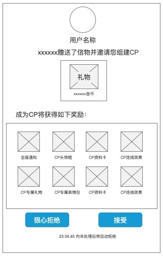


##### 图下需求拆解：CP邀请详情

**功能说明：** 邀请者视角的邀请详情页，集中展示邀请对象、礼物、状态和时间信息。详情页是操作页面——待处理状态可执行取消操作。

**前置条件：**

| 条件项 | 说明 |
|---|---|
| 邀请记录存在 | 邀请编号可查询 |
| 用户身份确认 | 当前用户是该邀请的发起者或被邀请者 |

**字段与数据来源：**

| 字段 | 说明 | 数据来源 |
|---|---|---|
| 邀请编号 | 唯一标识 | CP 邀请记录 |
| 发起者资料 | 头像+昵称+等级 | 用户资料+等级配置 |
| 被邀请者资料 | 头像+昵称+等级 | 用户资料+等级配置 |
| 组建礼物信息 | 图标+名称+金币价格 | 礼物配置 |
| 邀请状态 | 状态标签 | CP 邀请记录 |
| 创建时间 | 格式化时间 | CP 邀请记录 |
| 剩余有效期 | 倒计时 | CP 邀请记录 |
| 取消按钮 | "取消邀请"（仅待处理+发起者视角可用） | CP 功能配置 |

**关键交互：** 邀请者可在待处理状态下取消邀请，取消后金币退回；非待处理状态只展示结果，不可操作。

**系统后台核心逻辑：** 详情页每次进入都重新读取邀请状态；取消邀请必须触发退币和通知；状态幂等——同一邀请只允许一次最终操作。

**异常与测试关注点：** 覆盖列表进入详情、详情操作后列表刷新、不同状态邀请展示、无记录空状态、异常记录不可操作、取消邀请退币。


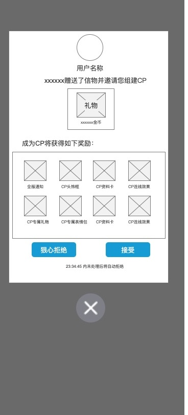


##### 图下需求拆解：被邀请者视角-CP邀请详情

**功能说明：** 被邀请者视角的邀请详情页，突出接受/拒绝决策所需的信息。详情页是操作页面——待处理状态可执行接受或拒绝。

**前置条件：**

| 条件项 | 说明 |
|---|---|
| 邀请记录存在 | 邀请编号可查询 |
| 当前用户是被邀请者 | 身份确认 |

**字段与数据来源：**

| 字段 | 说明 | 数据来源 |
|---|---|---|
| 邀请者资料 | 头像+昵称+等级 | 用户资料+等级配置 |
| 组建礼物信息 | 图标+名称+金币价格 | 礼物配置 |
| 亲密度预览 | 接受后获得的亲密度 | 礼物配置×亲密度倍率 |
| 邀请状态 | 状态标签 | CP 邀请记录 |
| 剩余有效期 | 倒计时 | CP 邀请记录 |
| 接受按钮 | "接受邀请"（仅待处理可用） | CP 功能配置 |
| 拒绝按钮 | "狠心拒绝"（仅待处理可用） | CP 功能配置 |

**关键交互：** 接受前必须二次确认；拒绝前必须二次确认；若邀请已过期、已取消或双方任一方已绑定，详情页只展示结果，不展示操作按钮。

**系统后台核心逻辑：** 同"CP邀请接受弹窗-被邀请者视角"和"CP邀请拒绝弹窗-被邀请者视角"的后台逻辑；详情页操作后返回列表时列表必须刷新。

**异常与测试关注点：** 覆盖正常接受、正常拒绝、邀请已过期后进入详情、邀请已取消后进入详情、对方已绑定后进入详情、重复点击操作、操作后返回列表刷新。


#### 前置条件

- 存在该邀请记录

#### 触发方式

- 从邀请列表点击某条邀请进入
- 从私聊邀请函消息卡片点击进入

#### 字段与数据来源

| 字段 | 说明 | 统计方式 | 数据来源 |
|---|---|---|---|
| 邀请编号 | 唯一标识 | 直接读取 | CP邀请记录 |
| 发起者信息 | 头像+昵称+等级 | 关联查询 | 用户中心+等级表 |
| 被邀请者信息 | 头像+昵称+等级 | 关联查询 | 用户中心+等级表 |
| 礼物信息 | 图标+名称+价值 | 关联查询 | 礼物配置表 |
| 邀请状态 | 状态标签 | 直接读取 | CP邀请记录 |
| 创建时间 | 格式化时间 | 直接读取 | CP邀请记录 |
| 已过期时间 | 倒计时 | 计算 | CP邀请记录 |
| 亲密度预览 | 接受后获得 | 计算：金币×1.5 | 礼物配置+计算 |

#### 交互逻辑

**待处理状态：**

1. 展示双方信息、礼物信息、倒计时
2. 底部显示「接受邀请」和「狠心拒绝」两个按钮
3. 点击「接受邀请」→ 执行接受流程
4. 点击「狠心拒绝」→ 弹出二次确认 → 执行拒绝流程

**非待处理状态：**

1. 展示双方信息、礼物信息、状态标签
2. 底部无操作按钮
3. 状态标签：已接受（已接受）、已拒绝（已拒绝）、已过期（已过期）、已取消（已取消）


---


#### 系统后台核心逻辑

| 逻辑项 | 处理规则 |
|---|---|
| 详情状态读取 | 邀请详情页必须每次进入都读取系统后台当前邀请状态，不能只使用列表传入的旧状态 |
| 操作前校验 | 接受、拒绝、取消操作前必须校验邀请仍为待处理、未过期、双方未绑定其他 CP、双方账号状态有效 |
| 状态幂等 | 同一邀请只能产生一次最终处理结果；重复点击、跨设备同时处理时，只允许第一笔有效操作成功 |
| 结果同步 | 详情页操作成功后，邀请列表、私聊消息卡片、CP主页入口和双方通知必须同步刷新 |
| 资产处理 | 拒绝、取消、过期涉及组建礼物消耗时，金币必须按原支付记录退回发起者，并记录退币结果 |
| 历史详情 | 已接受、已拒绝、已过期、已取消的邀请详情只能展示结果，不再展示可操作按钮 |

#### 异常处理

| 异常场景 | 页面处理 | 系统处理 |
|---|---|---|
| 邀请不存在 | 展示记录不存在或已删除 | 不返回敏感资料 |
| 邀请已过期 | 展示已过期结果态 | 触发过期状态和退币补偿 |
| 双方任一方已绑定其他 CP | 阻断接受操作 | 刷新邀请为不可处理状态 |
| 重复点击接受/拒绝 | 页面只保留第一次处理结果 | 使用邀请编号做去重 |
| 退币失败 | 展示退回处理中 | 记录补偿任务并可重试 |

### 2. CP主页模块

#### 模块背景

CP主页是用户查看自己CP关系状态、亲密度、等级、礼物记录等信息的核心页面。未绑定CP的用户可在此发起邀请，已绑定CP的用户可查看CP详情、维护记录、礼物记录等。

#### 用户场景

1. 未绑定用户：查看CP入口、发起邀请输入框、邀请记录
2. 已绑定用户：查看CP头像、亲密度、等级、亲密度变动记录、维护记录
3. 查看CP礼物记录：互相赠送的礼物列表
4. 查看CP等级详情：等级规则、特权、进度

### 2.1 CP主页入口

#### 功能说明

从多个入口访问CP主页，根据用户绑定状态展示不同内容。

#### 对应原型

CP主页入口分布在个人主页、用户资料卡、全屏资料页、半屏资料页与非资料页入口。该组原型用于说明用户从不同个人资料场景进入 CP 主页的路径。


#### 个人主页 - CP入口

##### 功能说明

个人主页展示 CP 入口，用于承接用户从个人资料场景进入 CP 主页。入口本身必须体现当前 CP 状态：未绑定时引导组建 CP，已绑定时进入当前 CP 主页，有待处理邀请时提示用户查看邀请记录。

##### 前置条件

| 条件项 | 说明 |
|---|---|
| 用户已登录 | 未登录用户不展示可操作入口 |
| 个人主页可访问 | 当前用户具备查看该个人主页的权限 |
| CP 功能开关开启 | 如果地区、版本或用户分层未开放 CP 功能，则隐藏入口 |

##### 字段与数据来源

| 字段 | 说明 | 数据来源 | 取值规则 |
|---|---|---|---|
| CP 状态 | 未绑定、已绑定、有待处理邀请 | CP 关系记录、邀请记录 | 服务端实时返回，不允许只看本地缓存 |
| CP 入口文案 | 入口展示名称或状态文案 | CP 功能配置 | 按当前状态返回 |
| CP 对象信息 | 已绑定时的对象头像、昵称 | 用户资料、CP 关系记录 | 仅已绑定状态展示 |
| 邀请提醒 | 是否存在待处理邀请 | CP 邀请记录 | 存在未处理邀请时展示提醒 |

##### 交互逻辑

1. 用户进入个人主页时，系统读取当前用户 CP 状态。
2. 未绑定状态点击入口，进入未绑定 CP 主页或组建引导页。
3. 已绑定状态点击入口，进入已绑定 CP 主页。
4. 存在待处理邀请时，点击入口优先进入邀请记录或邀请详情。
5. 如果点击时状态已变化，必须重新读取服务端状态后再跳转。

##### 系统后台核心逻辑

| 逻辑项 | 处理规则 |
|---|---|
| 状态判断 | 以服务端 CP 关系状态和邀请状态为准 |
| 跳转分流 | 后台返回入口状态，客户端按状态进入对应页面 |
| 状态刷新 | 关系建立、拒绝、过期、解除后，个人主页入口需重新刷新 |
| 权限限制 | 被拉黑、封禁、注销等场景不得绕过资料权限展示 CP 信息 |

##### 异常与测试关注点

| 场景 | 处理规则 |
|---|---|
| CP 状态读取失败 | 隐藏入口或展示默认入口，点击时提示刷新 |
| 邀请已过期 | 不进入邀请详情，刷新为当前真实状态 |
| 关系已解除 | 不再进入已绑定 CP 主页 |
| 重复点击入口 | 只发起一次跳转，避免重复打开页面 |


#### 个人主页 - 私聊跳转入口

##### 功能说明

个人主页中的私聊入口用于把用户带入私聊场景。该入口本身不创建 CP 关系，但私聊页需要承接 CP 邀请、CP 消息卡片、CP 关系信息展开/收起等后续能力。

##### 前置条件

| 条件项 | 说明 |
|---|---|
| 当前用户已登录 | 未登录不可进入私聊 |
| 双方允许私聊 | 需满足私聊权限、拉黑关系、账号状态等限制 |
| CP 功能可用 | CP 消息或 CP 信息展示受功能开关控制 |

##### 字段与数据来源

| 字段 | 说明 | 数据来源 |
|---|---|---|
| 私聊对象 | 被聊天用户头像、昵称、编号 | 用户资料 |
| CP 关系状态 | 双方是否已绑定 CP 或是否存在邀请 | CP 关系记录、邀请记录 |
| CP 消息卡片 | 邀请、接受、拒绝、解除等消息 | CP 消息记录 |
| 权限状态 | 是否允许发消息、是否被拉黑 | 私聊权限、关系链 |

##### 交互逻辑

1. 用户点击私聊入口后，系统先校验私聊权限。
2. 校验通过后进入私聊页。
3. 私聊页加载双方 CP 关系状态，决定是否展示 CP 信息条、CP 邀请卡片或普通聊天状态。
4. 如果双方关系变化，私聊页内 CP 信息必须同步更新。

##### 系统后台核心逻辑

| 逻辑项 | 处理规则 |
|---|---|
| 私聊权限校验 | 拉黑、封禁、注销、地区限制优先于 CP 展示 |
| CP 信息承接 | 私聊页读取同一套 CP 关系状态，不单独维护关系判断 |
| 消息卡片落地 | CP 邀请、接受、拒绝、解除结果以系统消息卡片承载 |

##### 异常与测试关注点

| 场景 | 处理规则 |
|---|---|
| 无私聊权限 | 阻断进入并提示原因 |
| CP 状态读取失败 | 私聊可正常进入，但 CP 区域降级隐藏 |
| 关系状态变更 | 私聊页刷新 CP 信息，不展示旧状态 |

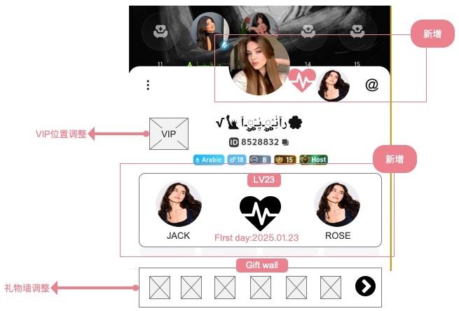

#### 用户资料卡 - 已绑定CP展示

##### 功能说明

用户资料卡在用户已绑定 CP 后展示关系身份卡片，用于在资料浏览、房间资料弹层、私聊资料入口等轻量浏览场景中露出当前 CP 关系。该区域不是单纯装饰，必须同时承担“关系状态展示”和“进入 CP 主页”的入口作用。

本次资料卡相关调整包括：顶部图片轮播区域新增、VIP 标识位置调整、CP 关系卡片新增、礼物墙区域布局调整。CP 关系卡片必须与当前用户真实 CP 关系状态一致，不能出现页面仍展示 CP 但关系已解除、等级过期、对象信息错误等情况。

##### 前置条件

| 条件项 | 说明 |
|---|---|
| 用户已登录 | 游客态或未登录态不展示可点击 CP 关系入口 |
| 被查看用户资料可见 | 当前查看者具备查看该用户资料卡的权限 |
| 被查看用户存在有效 CP 关系 | 关系状态为已绑定且未解除 |
| CP 对象账号有效 | CP 对象未注销、未封禁到不可展示状态 |
| CP 等级配置有效 | 当前亲密度可匹配到有效等级配置 |

##### 触发方式

| 触发场景 | 触发动作 | 页面表现 |
|---|---|---|
| 打开用户资料卡 | 系统加载资料卡数据 | 如果被查看用户已绑定 CP，则展示 CP 关系卡片 |
| 点击 CP 关系卡片 | 用户点击卡片任意区域 | 进入该用户 CP 主页或 CP 关系详情页，跳转目标以用户端 CP 主页规则为准 |
| 关系状态变化后重新进入资料卡 | 用户重新打开资料卡 | 重新读取关系状态，不沿用旧页面缓存 |
| 礼物墙区域点击右侧箭头 | 用户点击礼物墙入口 | 进入礼物墙详情或展示更多礼物记录 |

##### 字段与数据来源

| 字段 | 页面展示 | 说明 | 数据来源 | 计算方式/取值规则 |
|---|---|---|---|---|
| 被查看用户头像 | 左侧或右侧头像 | CP 关系中的其中一方头像 | 用户资料 | 按 CP 关系双方顺序展示；当前资料卡主用户与 CP 对象需明确区分 |
| CP 对象头像 | 左侧或右侧头像 | 另一方用户头像 | 用户资料 | 头像为空时使用默认头像，不允许空白破图 |
| 被查看用户昵称 | JACK / ROSE 位置 | CP 关系中的用户昵称 | 用户资料 | 昵称超长时按客户端规则截断 |
| CP 对象昵称 | JACK / ROSE 位置 | CP 对象昵称 | 用户资料 | 昵称超长时按客户端规则截断 |
| CP 等级 | LV23 | 当前 CP 关系等级 | CP 关系记录、CP 等级配置 | 根据当前亲密度匹配等级配置展示，不由前端写死 |
| 关系建立日期 | First day:2025.01.23 | 两人建立 CP 关系的日期 | CP 关系记录 | 取绑定成功时间，展示格式为年.月.日 |
| CP 关系图标 | 心形心跳图标 | 关系视觉标识 | 客户端资源 | 固定资源，不参与业务计算 |
| 顶部图片轮播 | 资料卡顶部多图区域 | 用户资料图片展示 | 用户相册/资料图 | 按资料卡图片排序展示 |
| VIP 标识 | VIP 徽章 | 用户会员身份 | 会员系统 | 按当前会员状态实时展示 |
| 礼物墙 | Gift wall + 礼物格子 | 用户收到或展示的礼物 | 礼物墙记录 | 取最新或配置排序的礼物，超过展示数量通过入口查看更多 |

##### 交互逻辑

1. 用户打开资料卡时，客户端请求资料卡基础信息、会员信息、CP 关系信息和礼物墙信息。
2. 系统判断被查看用户是否存在有效 CP 关系。
3. 如果不存在有效 CP 关系，资料卡不展示已绑定 CP 卡片，可按未绑定入口规则展示或隐藏。
4. 如果存在有效 CP 关系，资料卡展示 CP 关系卡片，包含双方头像、昵称、CP 等级、关系建立日期和关系图标。
5. 用户点击 CP 关系卡片时，进入 CP 主页；如果点击时关系已被解除，不能进入旧关系主页，应刷新状态并按未绑定/已解除状态处理。
6. 用户点击礼物墙右侧入口时，进入礼物墙详情；礼物墙展示不改变 CP 关系状态。
7. 顶部轮播区域只展示资料图片，不影响 CP 关系判断；VIP 位置调整只影响展示位置，不改变会员权益逻辑。

##### 系统后台核心逻辑

| 逻辑项 | 处理规则 |
|---|---|
| CP 关系读取 | 以服务端当前有效 CP 关系记录为准，客户端不得仅依据本地缓存判断是否展示 |
| CP 等级计算 | 根据当前关系亲密度匹配等级配置，返回等级名称/等级编号/展示文案 |
| 关系建立日期 | 取 CP 绑定成功时间，不取邀请发起时间、不取首次互动时间 |
| 关系对象信息 | 根据 CP 关系记录中的双方用户编号查询用户资料，确保头像、昵称与账号状态一致 |
| 状态一致性 | 资料卡展示、CP 主页、私聊 CP 信息、全屏资料页 CP 信息必须使用同一套关系状态口径 |
| 缓存处理 | 允许短时间缓存用户基础资料，但 CP 关系状态变化后必须触发刷新，避免解除后仍展示旧关系 |
| 礼物墙读取 | 礼物墙数据独立读取，不作为 CP 是否存在的判断依据 |

##### 状态设计

| 状态 | CP 卡片展示 | 点击行为 |
|---|---|---|
| 已绑定 | 展示双方头像、昵称、等级、First day | 进入 CP 主页 |
| 未绑定 | 不展示已绑定 CP 卡片 | 不进入已绑定 CP 主页 |
| 关系已解除 | 不展示已绑定 CP 卡片，或按解除状态刷新页面 | 点击旧入口时刷新状态并阻断进入旧主页 |
| CP 对象注销 | 不展示对象完整资料；按账号不可展示规则处理 | 不允许进入不可访问对象主页 |
| CP 对象封禁 | 根据封禁展示策略隐藏或降级展示 | 不允许绕过权限查看资料 |
| 等级配置缺失 | 可展示默认等级或隐藏等级 | 不影响关系卡片基础展示，但需记录异常 |

##### 边界条件

| 场景 | 处理规则 |
|---|---|
| 昵称过长 | 按客户端资料卡规则截断，不能挤压头像和心形图标 |
| 头像加载失败 | 展示默认头像，不能显示破图 |
| 建立日期为空 | 不展示错误日期；可隐藏 First day 或展示默认占位 |
| 亲密度无匹配等级 | 展示默认等级或隐藏等级，并上报异常 |
| 礼物数量不足 | 空位按礼物墙占位规则展示 |
| 礼物数量超过展示上限 | 资料卡只展示固定数量，更多内容通过礼物墙入口查看 |
| 关系刚解除但页面未刷新 | 点击 CP 卡片时重新校验关系状态，校验失败则刷新资料卡 |

##### 异常处理

| 异常场景 | 页面处理 | 系统处理 |
|---|---|---|
| CP 关系查询失败 | 暂不展示 CP 卡片，保留资料卡其他内容 | 记录查询失败原因，允许用户刷新重试 |
| 用户资料查询失败 | 使用默认头像/昵称占位或隐藏异常对象信息 | 记录用户资料读取异常 |
| CP 等级查询失败 | 隐藏等级或展示默认等级 | 记录等级配置异常 |
| 点击跳转失败 | 提示页面加载失败或关系状态已变化 | 重新拉取关系状态 |
| 权限不足 | 不展示不可访问资料，或提示无权限查看 | 不返回敏感关系详情 |

##### 权限控制

| 角色/场景 | 权限规则 |
|---|---|
| 本人查看自己资料卡 | 可查看完整 CP 展示并进入 CP 主页 |
| 其他用户查看资料卡 | 只能查看允许公开展示的 CP 信息 |
| 被拉黑用户 | 按拉黑关系限制资料卡展示和点击跳转 |
| 账号封禁/注销用户 | 不允许通过 CP 卡片绕过账号状态限制 |
| 后台运营 | 后台可查看关系记录，但前端展示仍按用户端权限规则处理 |

##### 行为统计

| 统计点 | 统计时机 | 统计用途 |
|---|---|---|
| 资料卡 CP 卡片曝光 | 用户资料卡成功展示 CP 卡片时 | 统计 CP 关系在资料浏览场景的曝光量 |
| CP 卡片点击 | 用户点击 CP 关系卡片时 | 统计从资料卡进入 CP 主页的转化 |
| 礼物墙入口点击 | 用户点击礼物墙箭头时 | 统计资料卡礼物墙详情访问 |
| 状态刷新失败 | CP 状态读取失败或点击时状态不一致 | 排查页面展示与服务端状态不一致问题 |

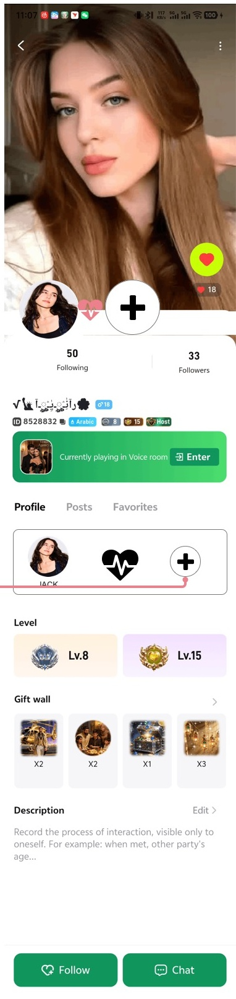

#### 全屏资料页 - 绑定CP入口

##### 功能说明

全屏资料页展示 CP 入口，用于在完整资料浏览场景中引导用户查看或组建 CP。入口展示必须根据被查看用户和当前查看者的关系状态进行分流。

##### 前置条件

| 条件项 | 说明 |
|---|---|
| 全屏资料页成功打开 | 用户资料基础信息读取成功 |
| CP 功能对当前用户可见 | 满足版本、地区、权限和功能开关要求 |
| CP 状态读取完成 | 服务端返回当前绑定/未绑定/待处理邀请状态 |

##### 字段与数据来源

| 字段 | 说明 | 数据来源 |
|---|---|---|
| CP 入口状态 | 已绑定/未绑定/待处理邀请 | CP 关系记录、邀请记录 |
| 入口文案 | 组建 CP、我的 CP、查看邀请等 | CP 功能配置 |
| CP 对象摘要 | 已绑定时展示对象头像/昵称 | 用户资料、CP 关系记录 |

##### 交互逻辑

1. 进入全屏资料页后加载 CP 入口状态。
2. 未绑定状态点击入口进入组建引导。
3. 已绑定状态点击入口进入 CP 主页。
4. 有待处理邀请时进入邀请处理页。
5. 关系解除或邀请过期后，再次点击必须重新分流。

##### 系统后台核心逻辑

| 逻辑项 | 处理规则 |
|---|---|
| 状态来源 | 统一使用 CP 关系服务返回的当前状态 |
| 权限过滤 | 资料页可见不等于 CP 详情全部可见，进入详情需二次校验 |
| 页面一致性 | 全屏资料页、半屏资料页、用户资料卡共用状态口径 |

##### 异常与测试关注点

| 场景 | 处理规则 |
|---|---|
| 状态读取超时 | 隐藏入口或展示加载失败提示 |
| 入口点击后状态变化 | 阻断旧跳转并刷新页面 |
| 权限不足 | 不展示敏感 CP 详情 |

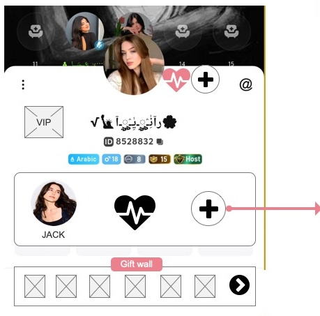

#### 非资料页 - 绑定CP入口

##### 功能说明

非资料页场景中的 CP 入口用于在房间、活动、消息等非完整资料页面中提供快速进入 CP 功能的能力。该入口不新增独立业务规则，只复用 CP 状态分流规则。

##### 前置条件

| 条件项 | 说明 |
|---|---|
| 当前页面支持 CP 入口露出 | 页面配置允许展示 |
| 用户已登录 | 未登录不可进入 CP 主页 |
| CP 功能开启 | 当前版本和地区支持 CP 功能 |

##### 字段与数据来源

| 字段 | 说明 | 数据来源 |
|---|---|---|
| 入口展示状态 | 是否展示、展示样式、状态提示 | 页面配置、CP 状态 |
| CP 状态 | 未绑定/已绑定/待处理邀请 | CP 关系记录、邀请记录 |
| 跳转目标 | CP 主页、邀请详情、组建引导 | CP 跳转配置 |

##### 交互逻辑

1. 页面加载时判断当前页面是否允许展示 CP 入口。
2. 展示入口后，点击时实时读取或校验 CP 状态。
3. 按未绑定、已绑定、待处理邀请进行跳转分流。
4. 非资料页入口不得产生与资料页入口不同的关系状态。

##### 系统后台核心逻辑

| 逻辑项 | 处理规则 |
|---|---|
| 页面配置 | 非资料页入口由页面配置控制是否展示 |
| 状态复用 | 复用 CP 主页入口的状态口径 |
| 跳转兜底 | 状态异常时进入 CP 主页默认页或提示刷新 |

##### 异常与测试关注点

| 场景 | 处理规则 |
|---|---|
| 页面不支持入口 | 不展示入口 |
| 状态异常 | 不进入错误页面，提示刷新 |
| 连续点击 | 防重复跳转 |

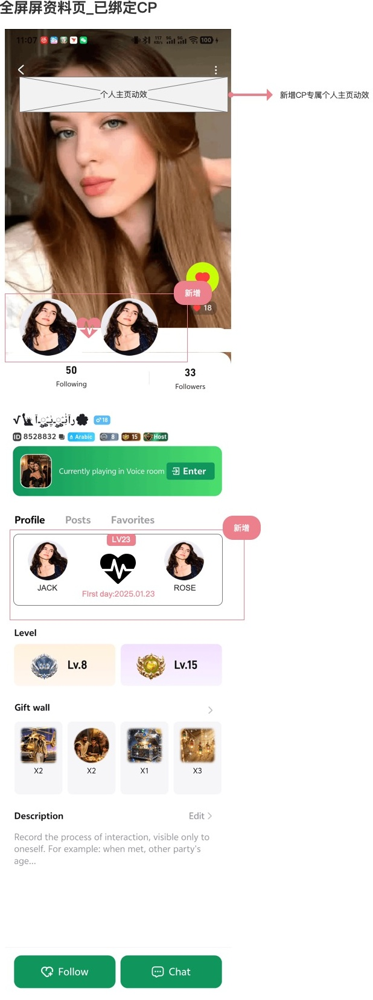

#### 全屏资料页 - 已绑定CP展示

##### 功能说明

全屏资料页在用户已绑定 CP 后展示关系身份，用于让查看者在完整资料页中识别该用户已有 CP 关系，并可进入 CP 主页查看关系内容。

##### 前置条件

| 条件项 | 说明 |
|---|---|
| 被查看用户存在有效 CP 关系 | 状态为已绑定且未解除 |
| 查看者可访问资料页 | 满足资料权限限制 |
| CP 对象资料可展示 | 对象账号未处于不可展示状态 |

##### 字段与数据来源

| 字段 | 说明 | 数据来源 |
|---|---|---|
| CP 对象头像 | 展示 CP 关系另一方头像 | 用户资料、CP 关系记录 |
| CP 对象昵称 | 展示 CP 对象昵称 | 用户资料 |
| CP 等级/亲密度 | 展示关系成长状态 | CP 关系记录、等级配置 |
| 建立日期 | 关系绑定成功日期 | CP 关系记录 |

##### 交互逻辑

1. 全屏资料页加载时读取 CP 关系。
2. 已绑定状态展示关系视觉区域。
3. 点击关系区域进入 CP 主页。
4. 如果点击时关系已解除，刷新资料页并隐藏已绑定展示。

##### 系统后台核心逻辑

| 逻辑项 | 处理规则 |
|---|---|
| 关系校验 | 点击进入 CP 主页前校验关系仍有效 |
| 信息一致 | 与用户资料卡、半屏资料页展示同一 CP 对象和等级 |
| 隐私控制 | 根据查看者权限返回可展示字段 |

##### 异常与测试关注点

| 场景 | 处理规则 |
|---|---|
| 对象资料不可见 | 隐藏对象详情或降级展示 |
| 关系解除 | 立即隐藏已绑定展示 |
| 等级数据异常 | 不影响基础关系展示 |

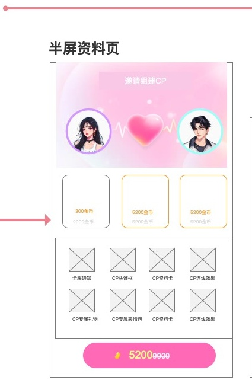

#### 半屏资料页 - CP关系入口

##### 功能说明

半屏资料页用于房间、聊天、列表等轻量查看场景。CP 关系入口需要在有限空间内展示当前关系状态，并提供进入 CP 主页的路径。

##### 前置条件

| 条件项 | 说明 |
|---|---|
| 半屏资料页成功打开 | 用户资料基础信息读取成功 |
| CP 功能可见 | 满足功能开关、版本、地区规则 |
| 查看者具备资料访问权限 | 不可绕过拉黑、封禁等限制 |

##### 字段与数据来源

| 字段 | 说明 | 数据来源 |
|---|---|---|
| CP 状态 | 当前关系状态 | CP 关系记录、邀请记录 |
| 入口样式 | 半屏内的 CP 展示样式 | 客户端配置 |
| CP 摘要 | 对象头像、昵称、等级等摘要 | 用户资料、CP 等级配置 |

##### 交互逻辑

1. 打开半屏资料页时加载 CP 状态。
2. 点击 CP 区域进入对应 CP 页面。
3. 关闭半屏只关闭当前资料弹层，不改变 CP 关系。
4. 页面重新打开时必须重新校验 CP 状态。

##### 系统后台核心逻辑

| 逻辑项 | 处理规则 |
|---|---|
| 轻量展示 | 半屏只展示摘要，不承载完整 CP 管理操作 |
| 状态一致 | 与全屏资料页、用户资料卡使用同一状态 |
| 权限过滤 | 不返回当前查看者不可见的关系详情 |

##### 异常与测试关注点

| 场景 | 处理规则 |
|---|---|
| 半屏快速打开关闭 | 不重复请求导致状态错乱 |
| 状态变化 | 下次打开刷新展示 |
| 权限不足 | 隐藏 CP 信息或提示不可查看 |

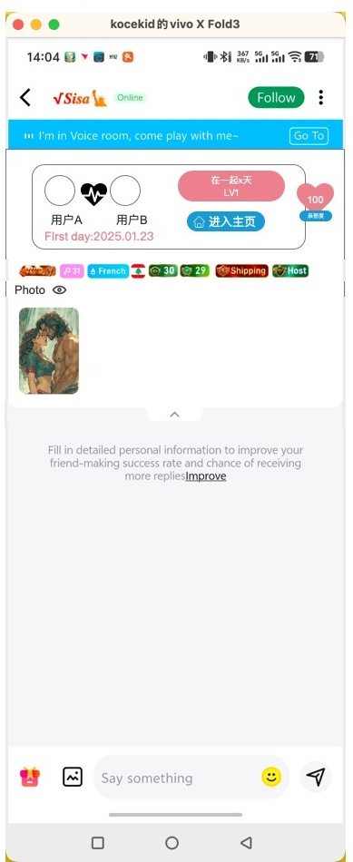

#### 私聊页面 - CP信息展开状态

##### 功能说明

私聊页面展示 CP 信息展开态，用于在聊天过程中展示对方照片和 CP 关系摘要。展开态强调关系信息可见性，并提供进入 CP 主页或关系详情的入口。

##### 前置条件

| 条件项 | 说明 |
|---|---|
| 私聊页已打开 | 双方聊天会话可访问 |
| 双方存在可展示 CP 信息 | 已绑定 CP 或存在相关 CP 消息 |
| 对方照片可展示 | 照片资源未失效且符合资料权限 |

##### 字段与数据来源

| 字段 | 说明 | 数据来源 |
|---|---|---|
| 对方照片 | 展开区域展示的照片 | 用户资料/相册 |
| CP 状态 | 当前关系状态 | CP 关系记录 |
| CP 摘要 | 等级、对象、日期等 | CP 关系记录、等级配置 |
| 展开状态 | 当前是否展开 | 客户端本地交互状态 |

##### 交互逻辑

1. 用户进入私聊页后加载 CP 信息区域。
2. 用户点击展开后展示对方照片和关系摘要。
3. 点击 CP 信息区域进入 CP 主页或关系详情。
4. 展开/收起只影响展示，不改变 CP 关系。

##### 系统后台核心逻辑

| 逻辑项 | 处理规则 |
|---|---|
| 信息读取 | 私聊页从 CP 关系服务读取关系摘要 |
| 图片权限 | 对方照片按资料可见性规则返回 |
| 状态同步 | 关系解除后私聊页 CP 信息应刷新或隐藏 |

##### 异常与测试关注点

| 场景 | 处理规则 |
|---|---|
| 图片加载失败 | 展示默认占位图 |
| 关系解除 | 隐藏展开入口或刷新为未绑定状态 |
| 快速展开收起 | 不重复触发关系变更请求 |

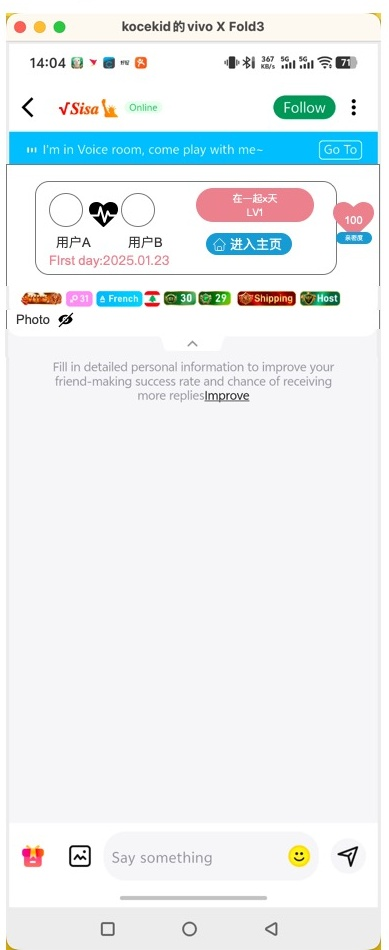

#### 私聊页面 - CP信息收起状态

##### 功能说明

私聊页面 CP 信息收起态用于减少聊天区域占用，仅保留必要关系入口或提示。收起态仍需保持 CP 状态准确，不能因为收起就停止状态同步。

##### 前置条件

| 条件项 | 说明 |
|---|---|
| 私聊页可访问 | 双方会话允许打开 |
| CP 信息区域允许展示 | CP 功能开关开启 |
| 当前存在可展示 CP 状态 | 已绑定或存在相关邀请/消息 |

##### 字段与数据来源

| 字段 | 说明 | 数据来源 |
|---|---|---|
| 收起态入口 | 展开按钮或简化关系条 | 客户端样式配置 |
| CP 状态摘要 | 是否已绑定、是否有邀请 | CP 关系记录、邀请记录 |
| 会话对象 | 当前聊天对象资料 | 用户资料 |

##### 交互逻辑

1. 默认或用户操作后进入收起态。
2. 收起态保留展开入口。
3. 用户点击展开入口后切换为展开态。
4. 收起态不影响消息发送、接收和 CP 关系状态。

##### 系统后台核心逻辑

| 逻辑项 | 处理规则 |
|---|---|
| 展示状态 | 展开/收起为客户端展示状态，不写入 CP 关系 |
| 状态刷新 | 收起态也需要响应关系变化消息 |
| 权限限制 | 私聊不可见时不展示 CP 信息 |

##### 异常与测试关注点

| 场景 | 处理规则 |
|---|---|
| 收起后关系解除 | 入口刷新或隐藏 |
| 连续点击展开 | 防止动画和状态错乱 |
| 会话切换 | 不串用上一个会话 CP 信息 |

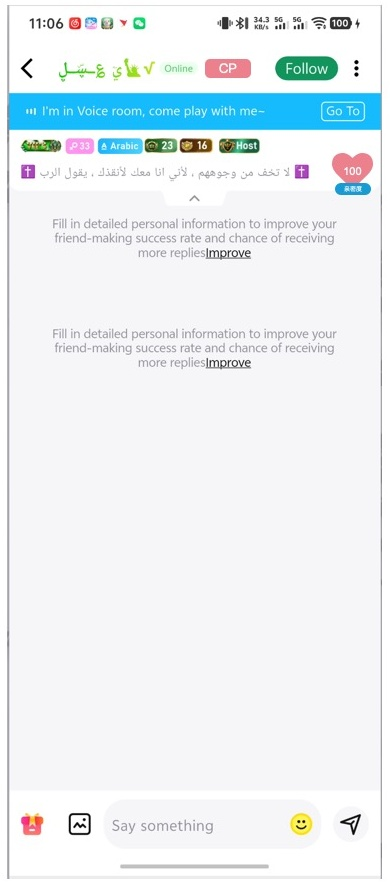

#### 私聊页面 - 收到CP消息

##### 功能说明

私聊页面收到 CP 相关消息时，以消息卡片承接邀请、接受、拒绝、解除、升级、奖励等 CP 事件。消息卡片必须能让用户回到对应业务落地页，而不是只做普通文本提示。

##### 前置条件

| 条件项 | 说明 |
|---|---|
| 私聊会话存在 | 双方会话未被系统限制 |
| CP 事件已产生 | 邀请、接受、拒绝、解除、升级等奖励事件发生 |
| 消息接收方有效 | 接收方账号可接收系统消息 |

##### 字段与数据来源

| 字段 | 说明 | 数据来源 |
|---|---|---|
| 消息类型 | 邀请、接受、拒绝、解除、升级、奖励 | CP 事件记录 |
| 消息文案 | 私聊中展示的提示文案 | CP 消息模板 |
| 跳转目标 | 邀请详情、CP 主页、奖励弹窗等 | CP 事件类型 |
| 事件状态 | 已处理、未处理、已过期 | CP 邀请记录、关系记录 |

##### 交互逻辑

1. CP 事件发生后，系统向对应用户发送私聊消息卡片。
2. 用户点击消息卡片时，根据消息类型进入对应页面。
3. 如果邀请已处理或过期，进入时展示最新状态，不允许重复处理。
4. 如果关系已解除，不能通过历史消息进入旧关系主页。

##### 系统后台核心逻辑

| 逻辑项 | 处理规则 |
|---|---|
| 消息生成 | CP 事件变更时生成系统消息，不依赖客户端自行拼接 |
| 幂等控制 | 同一事件不能重复生成多条关键操作消息 |
| 状态校验 | 点击消息卡片时校验事件当前状态 |
| 权限控制 | 历史消息不得绕过当前资料和关系权限 |

##### 异常与测试关注点

| 场景 | 处理规则 |
|---|---|
| 邀请已过期 | 展示过期状态，不允许接受 |
| 重复点击消息 | 不重复处理 CP 事件 |
| 历史关系已解除 | 阻断旧主页进入并提示状态已变化 |


#### 前置条件

- 用户已登录

#### 触发方式

| 入口 | 触发方式 |
|---|---|
| Mine页「CP」入口 | 点击进入CP主页；如实际用户端入口不在底部导航，以原型为准 |
| 个人主页「我的CP」卡片 | 点击进入 |
| 房间内CP头像 | 点击进入 |
| 好友列表CP入口 | 点击进入 |

#### 字段与数据来源

| 字段 | 说明 | 统计方式 | 数据来源 |
|---|---|---|---|
| 用户CP状态 | 已绑定/未绑定 | 查询 | CP关系记录 |
| CP对象信息 | 头像+昵称+编号 | 关联查询 | 用户中心 |
| CP亲密度 | 当前值 | 直接读取 | CP关系记录 |
| CP等级 | 当前等级 | 计算：根据亲密度匹配等级表 | CP等级配置 |
| CP绑定时间 | 建立时间 | 直接读取 | CP关系记录 |

#### 交互逻辑

**未绑定用户：**

1. 展示「寻找你的CP」引导页
2. 顶部显示邀请输入框（搜索用户编号/靓号）
3. 下方展示「邀请记录」入口
4. 底部展示CP功能介绍卡片

**已绑定用户：**

1. 顶部展示双方头像（CP头像区）
2. 显示CP昵称、编号、亲密度、等级
3. 下方展示：亲密度变动记录、维护记录、礼物记录、等级详情入口
4. 底部显示「解除CP」入口（弱化按钮）

#### 系统后台核心逻辑

- 查询CP关系记录，判断用户CP状态
- 若已绑定，关联查询CP对象信息和亲密度_log 表
- 若未绑定，查询是否有待处理邀请（展示红点）

---

### 2.2 CP亲密度展示

#### 功能说明

展示当前亲密度值、等级进度条、距离下一等级所需亲密度。

#### 对应原型

亲密度展示位于 CP 主页与 CP 等级权益页中：CP 主页展示当前关系进度，等级权益页展示等级门槛与权益说明。

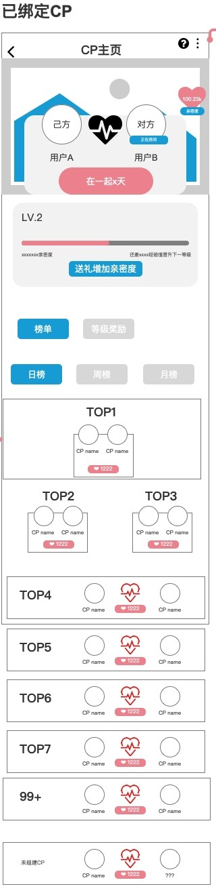


##### 图下需求拆解：已绑定CP-CP主页

**功能说明：** 已绑定 CP 主页展示双方头像、昵称、CP 等级、亲密度进度、在一起时长、权益入口和关系操作入口。这是用户查看当前 CP 关系状态的主页面。

**前置条件：**

| 条件项 | 说明 |
|---|---|
| 用户存在有效 CP 关系 | 关系状态为已绑定且未解除 |
| CP 对象资料可展示 | 对方账号未处于不可展示状态 |
| CP 功能可用 | 版本、地区、分层允许 |

**字段与数据来源：**

| 字段 | 说明 | 数据来源 |
|---|---|---|
| 双方头像 | 左右展示双方头像 | 用户资料 |
| 双方昵称 | 左右展示双方昵称 | 用户资料 |
| CP 等级 | 当前等级编号和名称 | CP 等级配置 |
| CP 等级图标 | 等级徽章 | CP 等级配置 |
| 当前亲密度 | 关系累计亲密度 | CP 关系记录 |
| 下一级所需亲密度 | 升级所需值 | CP 等级配置 |
| 进度百分比 | 当前等级内进度 | 计算得出 |
| 在一起天数 | 从建立时间到当前的天数 | CP 关系建立时间 |
| CP 主页背景板 | 按等级映射的背景资源 | 后台资源配置 |
| 等级权益入口 | "查看权益" | CP 功能配置 |
| 送礼入口 | "送礼增加亲密度" | CP 功能配置 |
| 榜单入口 | "榜单" | CP 功能配置 |
| 设置入口 | "设置" | CP 功能配置 |
| 解除关系入口 | "解除关系" | CP 功能配置 |
| 亲密度记录入口 | 查看亲密度变动明细 | CP 功能配置 |

**关键交互：** 用户进入页面后可查看等级进度、亲密度记录、等级权益、CP 礼物和解除关系入口；页面每次进入都要重新加载当前关系状态。

**系统后台核心逻辑：** CP 主页必须读取当前有效关系；关系解除、等级保护期、亲密度变化后页面要同步更新；背景板等展示资源随 CP 等级实时映射；在一起天数按东三区自然日计算，建立当天记为第1天。

**异常与测试关注点：** 覆盖已绑定进入、关系解除后返回、亲密度变化后刷新、等级保护期展示、权益入口可用性、网络失败重试。


#### 字段与数据来源

| 字段 | 说明 | 统计方式 | 数据来源 |
|---|---|---|---|
| 当前亲密度 | 总值 | 直接读取 | CP关系记录 |
| 当前等级 | 等级数字 | 匹配计算 | CP等级配置 |
| 等级图标 | 等级徽章页面地址 | 直接读取 | CP等级配置 |
| 下一等级亲密度 | 升级所需值 | 直接读取 | CP等级配置 |
| 进度百分比 | 当前进度 | 计算：(当前-本级起点)/(下一级-本级起点)×100% | 计算得出 |

#### 交互逻辑

1. 展示亲密度 数字（如：12,580）
2. 展示等级图标和等级名称（如：等级.5 默契CP）
3. 展示进度条（当前亲密度 到下一级的进度）
4. 点击进度条 → 跳转等级详情页

---


#### 前置条件

| 条件项 | 说明 |
|---|---|
| 用户已绑定 CP | 未绑定状态不展示当前关系亲密度进度 |
| CP 关系有效 | 关系未解除，且关系编号可查询 |
| 等级配置有效 | 当前亲密度可匹配到等级区间 |
| 亲密度流水可读取 | 当前总亲密度与进度条必须能追溯到流水记录 |

#### 系统后台核心逻辑

| 逻辑项 | 处理规则 |
|---|---|
| 亲密度总额 | 当前亲密度由有效亲密度流水累计并扣除衰减、风控修正后得到 |
| 等级匹配 | 系统后台按当前亲密度匹配等级配置，返回当前等级和下一等级门槛 |
| 进度计算 | 进度百分比 = 当前等级区间内已完成亲密度 / 当前等级到下一等级所需亲密度 |
| 满级处理 | 满级时不再展示下一等级差值，展示满级或已达最高等级状态 |
| 状态同步 | 送礼、衰减、系统修正后，CP主页亲密度和亲密度记录必须同步 |
| 关系解除 | 解除后当前主页不展示旧关系亲密度，历史记录只作为历史关系记录查看 |

#### 边界与异常

| 场景 | 处理规则 |
|---|---|
| 等级配置缺失 | 展示基础亲密度数值，隐藏等级进度，并记录配置异常 |
| 亲密度为 0 | 展示初始等级和 0 进度 |
| 亲密度超过最高等级 | 展示最高等级和满级状态 |
| 流水延迟 | 以系统后台返回总额为准，不由客户端自行累加 |

### 2.3 CP亲密度变动记录

#### 功能说明

展示近期亲密度变动明细，包含变动原因、时间和亲密度变化值。页面按原型中的亲密度记录列表描述。

#### 对应原型

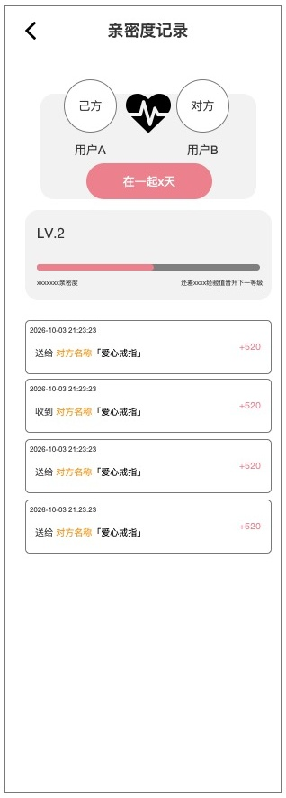


##### 图下需求拆解：亲密度记录

**功能说明：** 亲密度记录页展示 CP 关系内每次亲密度增加、扣减、维护和系统调整记录，供用户追溯亲密度变化来源。

**前置条件：**

| 条件项 | 说明 |
|---|---|
| 用户已绑定 CP | 未绑定不展示当前关系记录 |
| CP 关系有效 | 关系编号可查询 |

**字段与数据来源：**

| 字段 | 说明 | 数据来源 |
|---|---|---|
| 变动说明 | 送礼增加、衰减扣减、维护奖励、系统修正等 | 亲密度流水记录 |
| 变动值 | 本次增加或减少的亲密度值 | 亲密度流水记录 |
| 变动后总额 | 该记录后的亲密度总值 | 亲密度流水记录 |
| 变动时间 | 记录发生时间 | 亲密度流水记录 |
| 关联礼物 | 若为礼物赠送，展示礼物图标和名称 | 礼物配置 |
| 记录来源 | 送礼/衰减/维护/系统修正/风控调整 | 亲密度流水记录 |

**关键交互：** 用户从 CP 主页进入记录页后按时间倒序查看明细；点击记录可查看来源类型、变化数值、发生时间和关联礼物或系统原因。

**系统后台核心逻辑：** 记录页必须与 CP 主页亲密度总额使用同一套流水口径；任何亲密度变化都必须有可追溯明细；衰减记录需标注衰减原因和计算周期；分页加载避免一次性返回全量。

**异常与测试关注点：** 覆盖送礼增加、衰减扣减、系统调整、分页加载、空记录、关系解除后查看历史记录。


#### 前置条件

- 用户已绑定CP

#### 触发方式

- 从CP主页点击亲密度记录相关入口；入口名称以原型为准

#### 字段与数据来源

| 字段 | 说明 | 统计方式 | 数据来源 |
|---|---|---|---|
| 记录编号 | 唯一标识 | 直接读取 | 亲密度流水记录 |
| 变动说明 | 送礼、衰减、系统修正等业务说明 | 按流水来源生成展示文案 | 亲密度流水记录 |
| 变动值 | 本次亲密度增加或减少值 | 直接读取 | 亲密度流水记录 |
| 变动后总额 | 该记录后的亲密度总值 | 直接读取 | 亲密度流水记录 |
| 时间 | 记录发生时间 | 直接读取 | 亲密度流水记录 |
| 关联礼物 | 若为礼物赠送，展示礼物图标和名称 | 关联查询 | 礼物配置 |

#### 交互逻辑

1. 用户进入亲密度记录页。
2. 页面按原型展示亲密度变动记录。
3. 每条记录展示变动说明、变动值和时间。
4. 若原型支持点击记录查看详情，则进入对应详情；若原型未展示点击态，不强制定义详情入口。

#### 系统后台核心逻辑

- 亲密度记录必须按 CP关系编号 查询，避免历史关系串数据。
- 系统后台可按时间倒序返回记录；数据量控制属于系统后台实现，不作为页面可见功能描述。
- 亲密度衰减、风控修正、礼物赠送等来源需要生成清晰业务文案。

---

### 2.4 CP维护记录

#### 功能说明

展示 CP关系维护相关记录或维护提醒结果。当前原型目录未提供独立“维护记录”页面截图，因此本节只保留系统后台记录口径和可展示信息。

#### 对应原型


##### 图下需求拆解：亲密度记录-维护记录承载

**功能说明：** 亲密度记录页中的维护记录区域，展示用户维护 CP 关系（如送礼、互动）产生的亲密度变动明细。这是亲密度记录页的子视图，不是独立页面。

**前置条件：** 同"亲密度记录"。

**字段与数据来源：**

| 字段 | 说明 | 数据来源 |
|---|---|---|
| 维护来源 | 送礼/互动/系统奖励 | 亲密度流水记录 |
| 维护时间 | 维护操作发生时间 | 亲密度流水记录 |
| 亲密度变化 | 本次维护获得的亲密度 | 亲密度流水记录 |
| 关联礼物/互动 | 礼物名称或互动类型 | 礼物配置/互动配置 |

**关键交互：** 维护记录与亲密度记录共用列表，通过来源筛选或标签区分；点击记录查看来源详情。

**系统后台核心逻辑：** 维护产生的亲密度增加必须写入流水；维护记录和衰减记录在同一流水表中，通过来源字段区分；维护奖励按后台配置触发。

**异常与测试关注点：** 覆盖送礼维护、互动维护、系统自动维护、维护记录与衰减记录混合展示。


#### 前置条件

- 用户已绑定CP

#### 触发方式

- 若原型提供维护记录入口，则从对应入口进入；当前原型未明确入口时，不强制定义页面入口

#### 字段与数据来源

| 字段 | 说明 | 统计方式 | 数据来源 |
|---|---|---|---|
| 记录编号 | 唯一标识 | 直接读取 | 维护记录或亲密度流水记录 |
| 维护方式 | 送礼、互动、系统提醒等 | 按系统记录生成展示文案 | 维护记录/亲密度流水 |
| 亲密度变化 | 本次维护对应亲密度变化 | 直接读取 | 亲密度流水 |
| 时间 | 维护发生时间 | 直接读取 | 维护记录/亲密度流水 |

#### 交互逻辑

1. 页面仅在原型存在入口时展示维护记录。
2. 记录展示维护方式、亲密度变化和时间。
3. 页面仅展示原型可承载的记录信息，不额外增加页面控件。

#### 系统后台核心逻辑

- 维护记录与亲密度流水必须能追溯到 CP关系编号。
- 若维护行为触发亲密度变化，应同步写入亲密度流水。
- 若维护行为只触发提醒，不产生亲密度变化，不应伪造亲密度记录。

---

### 2.5 CP解除关系

#### 功能说明

已绑定 CP 用户可主动解除当前 CP关系。解除关系会影响主页展示、等级权益、亲密度增长、专属礼物/表情使用和历史关系记录，因此必须通过确认弹窗降低误操作，并在失败时给出明确反馈。

#### 对应原型

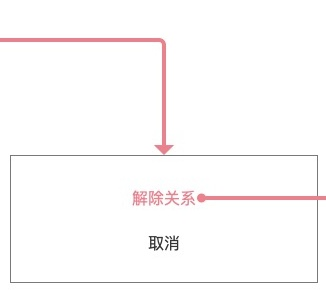


##### 图下需求拆解：解除关系确认弹窗

**功能说明：** 用户主动解除 CP 关系时的二次确认弹窗，避免误触导致关系直接解除。弹窗必须明确告知解除后的影响：等级权益失效、专属礼物不可用、亲密度保留为历史记录。

**前置条件：**

| 条件项 | 说明 |
|---|---|
| 用户存在有效 CP 关系 | 未绑定无需解除 |
| 用户主动点击解除关系 | 系统确认后才弹出 |

**字段与数据来源：**

| 字段 | 说明 | 数据来源 |
|---|---|---|
| CP 对象资料 | 对方头像、昵称 | 用户资料 |
| 解除影响说明 | "解除后等级权益失效、专属礼物不可用" | CP 功能配置 |
| 确认解除按钮 | "确认解除" | CP 功能配置 |
| 取消按钮 | "再想想" | CP 功能配置 |

**关键交互：** 用户确认后执行解除；取消关闭弹窗，关系保持不变；解除成功后跳转 CP 主页未绑定态。

**系统后台核心逻辑：** 解除必须同时：①更新 CP 关系状态为已解除 ②失效双方等级权益 ③失效专属礼物和表情 ④向双方发送解除通知 ⑤刷新 CP 主页、资料卡、房间展示；解除后无固定重绑等待限制；异常频繁解绑/重绑交由风控处理。

**异常与测试关注点：** 覆盖确认解除、取消解除、解除后主页刷新、解除后权益失效、解除后通知发送、解除失败回滚、对方同时在操作时并发处理。


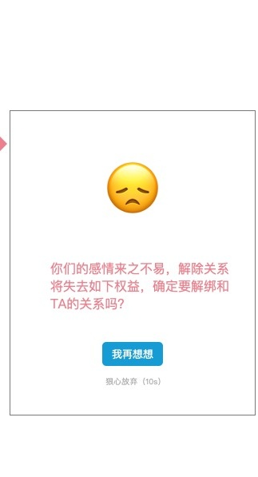


##### 图下需求拆解：解除失败提示页

**功能说明：** 解除关系操作失败时的结果提示页，告知用户解除未成功及原因。

**前置条件：**

| 条件项 | 说明 |
|---|---|
| 解除操作已发起 | 用户已确认解除 |
| 解除失败 | 系统校验不通过或处理异常 |

**字段与数据来源：**

| 字段 | 说明 | 数据来源 |
|---|---|---|
| 失败原因 | 网络异常/关系已解除/并发冲突等 | 解除处理结果 |
| 重试按钮 | "重试" | CP 功能配置 |
| 返回按钮 | "返回" | CP 功能配置 |

**关键交互：** 用户可重试解除操作；返回则保持当前关系状态不变。

**系统后台核心逻辑：** 解除失败不改变关系状态；失败原因必须记录；允许用户重试；并发冲突时以系统最终状态为准。

**异常与测试关注点：** 覆盖网络异常、关系已解除、并发冲突、重试成功、重试仍失败、返回后状态一致性。


#### 前置条件

| 条件 | 说明 |
|---|---|
| 当前用户已绑定CP | 未绑定用户不展示解除入口 |
| 当前关系仍有效 | 已解除、已失效、状态异常时不可重复解除 |
| 未命中风控限制 | 频繁解除/重绑时按风控结果提示 |

#### 触发方式

- 从 CP主页进入设置页后点击解除关系入口。
- 若原型在 CP主页直接展示解除入口，则以最终原型为准。

#### 字段与数据来源

| 字段 | 说明 | 统计/计算方式 | 数据来源 |
|---|---|---|---|
| 当前CP对象 | 将被解除关系的对方 | 当前有效 CP关系读取 | CP关系记录 |
| 当前CP等级 | 解除前等级 | 当前亲密度匹配等级配置 | CP等级配置、亲密度汇总 |
| 当前权益 | 解除后会失效的当前等级权益 | 当前等级权益配置 | 权益配置 |
| 确认状态（confirm_状态） | 用户是否完成二次确认 | 用户点击确认后生成 | 页面操作 + 系统校验 |

#### 交互逻辑

1. 用户点击解除关系。
2. 系统弹出确认弹窗，展示解除后影响和情绪化提示。
3. 用户点击“我再想想”，弹窗关闭，CP关系保持不变。
4. 用户确认解除后，系统再次校验当前 CP关系是否仍有效。
5. 解除成功后，双方当前 CP状态变为未绑定，并收到解除通知。
6. 若解除失败，页面保留当前关系状态，并展示失败原因。

#### 系统后台核心逻辑

- 解除关系必须以当前有效 CP关系为对象，重复点击或并发解除只允许成功一次。
- 解除成功后，当前等级展示、当前等级权益、CP专属礼物/表情使用权限立即失效。
- 已发放的非永久奖励不回收，历史关系记录保留。
- 无固定重绑等待限制；异常频繁解绑/重绑交由风控处理，不写死固定等待天数。
- 解除成功必须写入关系状态变更日志，记录发起人、解除时间、解除前等级和解除前亲密度。

---

### 2.6 CP主页状态与展示规则

本补充来自《CP功能结构_最终版本》《CP系统核心业务规则（系统后台对接版）》与《CP业务流程图》，用于补齐原文中 CP主页描述过粗的问题。


#### 对应原型

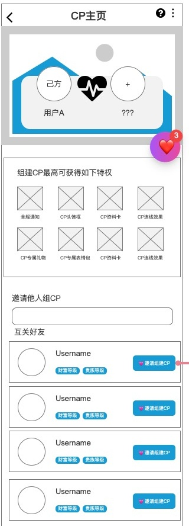


##### 图下需求拆解：未绑定CP-CP主页

**功能说明：** 未绑定 CP 状态下的 CP 主页，用于引导用户了解权益并发起组建 CP。不展示解除关系入口、当前等级权益等已绑定能力。

**前置条件：**

| 条件项 | 说明 |
|---|---|
| 用户不存在有效 CP 关系 | 状态为未绑定 |
| CP 功能可用 | 版本、地区、分层允许 |

**字段与数据来源：**

| 字段 | 说明 | 数据来源 |
|---|---|---|
| 权益预览 | 未绑定用户可见的 CP 权益列表 | CP 功能配置/等级权益配置 |
| 邀请入口 | "组建CP"或"邀请" | CP 功能配置 |
| 搜索输入框 | 搜索用户编号/靓号 | 客户端交互 |
| 邀请记录入口 | "邀请记录" | CP 功能配置 |
| CP 说明入口 | "了解CP" | CP 功能配置 |
| 推荐好友列表 | 推荐组建 CP 的好友 | 推荐算法/好友关系 |

**关键交互：** 用户可查看权益预览、进入邀请流程或查看 CP 说明；不展示解除关系入口。

**系统后台核心逻辑：** 未绑定主页只展示引导和权益预览；不允许出现解除关系、当前等级权益等已绑定能力；推荐好友按后台算法生成；邀请记录入口展示用户的历史邀请列表。

**异常与测试关注点：** 覆盖未绑定空态、查看说明、发起邀请入口、返回主页、已有待处理邀请时的展示差异。


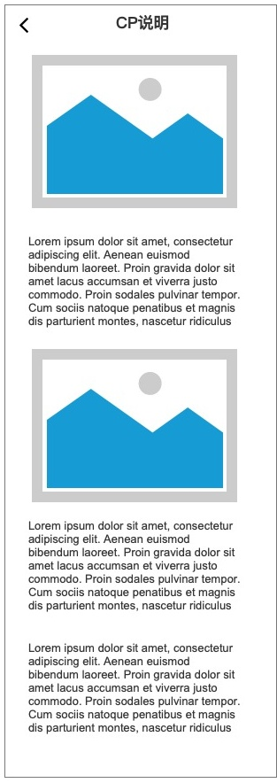


##### 图下需求拆解：CP说明

**功能说明：** CP 功能说明页，解释 CP 玩法、权益、亲密度和关系经营价值。这是信息展示页，不是操作页面。

**前置条件：**

| 条件项 | 说明 |
|---|---|
| 用户已登录 | 未登录不展示 |
| CP 说明内容已配置 | 后台已维护说明文案和资源 |

**字段与数据来源：**

| 字段 | 说明 | 数据来源 |
|---|---|---|
| 说明文案 | CP 玩法介绍、权益说明、亲密度规则 | CP 功能配置 |
| 权益图示 | 各等级权益预览 | CP 等级配置/权益资源 |
| 返回按钮 | 返回 CP 主页 | 客户端交互 |
| 发起邀请入口 | "去组建CP" | CP 功能配置 |

**关键交互：** 用户阅读说明后可返回 CP 主页或继续发起组建 CP。

**系统后台核心逻辑：** 说明内容从后台配置读取，支持运营更新；页面不产生任何业务变更。

**异常与测试关注点：** 覆盖正常浏览、返回主页、点击组建、内容加载失败。


##### 功能说明

CP主页不是单纯展示页，而是 CP 关系的主经营入口。页面需要根据用户当前 CP 状态切换两套结构：未绑定状态用于转化建联，已绑定状态用于关系经营、亲密度增长、等级权益展示、榜单竞争和解除关系。

##### 页面状态与展示规则

| 页面状态 | 触发条件 | 页面重点 | 用户可操作 |
|---|---|---|---|
| 未绑定CP | 当前用户不存在有效 CP 关系 | 展示未绑定关系卡、权益预览、邀请入口、好友推荐 | 搜索用户、邀请组建CP、查看功能说明 |
| 已绑定CP | 当前用户存在有效 CP 关系 | 展示双方关系卡、等级、亲密度、在一起天数、背景板、榜单入口、送礼入口 | 送礼增加亲密度、查看等级权益、查看榜单、进入设置、解除关系 |
| 存在待处理邀请 | 用户收到或发出待处理邀请 | 入口红点、邀请列表、邀请详情 | 查看邀请、接受、拒绝、取消 |
| 关系已解除 | 当前关系已解绑 | 不再展示为当前 CP；历史数据仅作为记录留存 | 可重新发起或接受新邀请，频繁操作交由风控处理 |

##### 字段与数据来源

| 字段 | 说明 | 统计/计算方式 | 数据来源 |
|---|---|---|---|
| 当前CP状态（cp_状态） | 判断当前用户是否已绑定 CP | 有有效 CP 关系则为已绑定；无有效关系则为未绑定 | CP关系记录 |
| CP关系编号 | 当前 CP 关系唯一标识 | 建立关系时生成；解除后保留历史记录 | CP关系记录 |
| CP对象用户信息 | 对方头像、昵称、用户编号、财富等级、魅力等级 | 读取对方用户资料；敏感状态按隐私规则过滤 | 用户资料服务 |
| CP等级 | 当前 CP 关系等级 | 按总亲密度匹配等级配置 | CP等级配置、亲密度汇总 |
| 当前亲密度 | 当前 CP 关系累计亲密度 | 有效亲密度流水累加，扣除衰减后得到当前值 | 亲密度流水、衰减记录 |
| 下一级所需亲密度 | 升级到下一等级所需值 | 下一等级门槛 - 当前亲密度；满级时展示满级状态 | CP等级配置 |
| 在一起天数 | CP 建立后的自然日天数 | 按 东三区时间 自然日计算，建立当天记为第1天 | CP关系建立时间 |
| CP主页背景板 | 页面背景资源 | 按当前 CP 等级映射后台配置资源；未绑定时展示初级背景 | 后台资源配置 |
| 待处理邀请数 | Mine 页 CP 入口红点数量 | 统计当前用户收到的待处理邀请，超过99显示超过九十九 | CP邀请记录 |

##### 交互逻辑

1. 用户从 Mine 页、资料卡、私聊页或房间入口进入 CP主页。
2. 系统先读取当前用户 CP 状态。
3. 若未绑定 CP，页面展示未绑定关系卡、权益预览、搜索/邀请入口和推荐好友列表。
4. 若已绑定 CP，页面展示双方头像、CP等级、亲密度、在一起天数、等级背景板和关系经营入口。
5. 用户点击“送礼增加亲密度”时，打开 CP 礼物面板，默认选中 CP 对方为收礼对象。
6. 用户点击“榜单”时，进入 CP榜单页，默认展示当前周期榜单。
7. 用户点击“设置”时，进入 CP设置页，可查看自动拒绝邀请开关、解除关系入口等能力。
8. 用户点击“解除关系”时，必须先弹出确认弹窗，不允许直接解除。

##### 系统后台核心逻辑

- CP主页所有展示必须以系统后台当前 CP 关系状态为准，页面本地暂存数据不能自行判断用户仍处于绑定关系。
- 关系解除后，当前 CP 状态立即变为未绑定；历史关系数据保留，但不再参与当前主页展示、等级权益展示和亲密度增长。
- 在一起天数按 东三区时间 自然日计算，建立当天记为第1天；重新绑定同一用户也按新 CP 关系重新计算，不继承上一段关系。
- CP主页背景、连线、资料卡、气泡框等展示资源必须从后台配置读取，并随当前 CP 等级实时映射。
- 若亲密度衰减导致等级变化，主页展示必须同步重新加载，但非永久奖励不因降级回收。


##### 前置条件

| 条件项 | 说明 |
|---|---|
| 当前用户已登录 | 未登录不可进入 CP主页 |
| CP 功能开启 | 当前地区、版本和用户分层允许使用 CP 功能 |
| CP 状态可读取 | 系统后台可返回未绑定、已绑定、待处理邀请等状态 |

### 3. CP礼物模块

#### 模块背景

CP礼物模块是用户通过赠送礼物增加亲密度 的核心功能。包含CP礼物列表、赠送流程、礼物记录、礼物特效等。

#### 用户场景

1. 用户在房间礼物面板选择CP礼物，赠送给对方
2. 用户查看赠送礼物获得的亲密度 加成
3. 用户查看双方互相赠送的礼物记录

### 3.1 CP礼物赠送入口

#### 功能说明

用户通过礼物面板选择CP礼物，赠送给CP对象或任意用户。

#### 对应原型

礼物赠送入口对应礼物面板中的 CP 玩法入口、CP专属礼物，以及“该礼物可加亲密度”的赠送前提示。

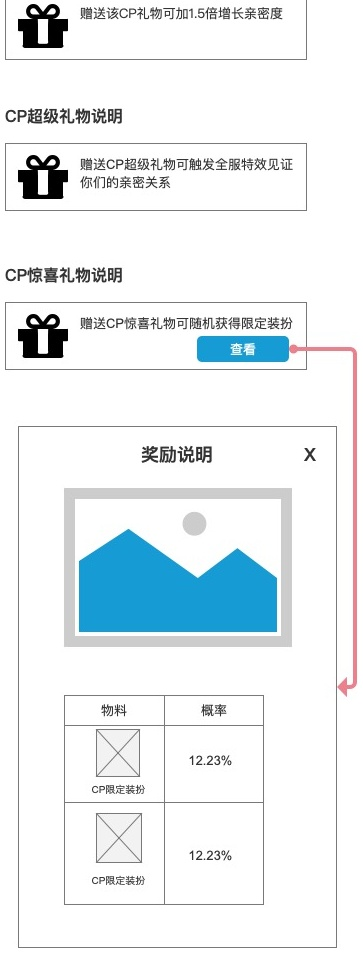


##### 图下需求拆解：该CP礼物可加亲密度

**功能说明：** 礼物说明图展示当前 CP 礼物可增加亲密度的提示，用于帮助用户理解赠送该礼物后的关系成长收益。

**前置条件：**

| 条件项 | 说明 |
|---|---|
| 用户已登录 | 未登录不可查看礼物详情 |
| CP 关系有效 | 双方存在有效 CP 关系 |
| 礼物处于上架状态 | 下架礼物不展示 |

**字段与数据来源：**

| 字段 | 说明 | 数据来源 |
|---|---|---|
| 礼物图标 | 礼物展示图标 | 礼物配置 |
| 礼物名称 | 礼物展示名称 | 礼物配置 |
| 金币价格 | 礼物售价 | 礼物配置 |
| 亲密度增长值 | 赠送后可增加的亲密度 | 礼物配置×亲密度倍率 |
| 亲密度倍率 | 当前倍率 | CP 建立配置/礼物配置 |
| 亲密度进度条 | 赠送后等级进度预览 | 计算得出 |

**关键交互：** 用户在礼物面板查看或选择 CP 礼物时展示亲密度增长提示；点击赠送后按当前关系状态和礼物配置计算亲密度。

**系统后台核心逻辑：** 礼物提示文案必须与后台配置的亲密度倍率一致；关系失效、等级不足或礼物下架时不能继续赠送；倍率配置变更后提示文案实时更新。

**异常与测试关注点：** 覆盖礼物可赠送、关系失效、等级不足、倍率配置变更、赠送成功后亲密度更新、提示文案与实际增长一致等场景。


#### 前置条件

| 条件 | 说明 |
|---|---|
| 用户已登录 | 未登录不可赠送礼物 |
| 金币余额充足 | 余额不足时拉起充值 |
| 目标用户存在 | 用户编号有效 |

#### 触发方式

| 入口 | 触发方式 |
|---|---|
| 房间礼物面板CP分类 | 选择礼物 → 点击赠送 |
| 私聊礼物面板 | 点击「赠送礼物」→ 选择CP礼物 |
| 用户资料页礼物按钮 | 点击「+」→ 选择CP礼物 |
| CP主页礼物入口 | 点击「赠送礼物」→ 选择礼物 |

#### 字段与数据来源

| 字段 | 说明 | 统计方式 | 数据来源 |
|---|---|---|---|
| 礼物编号 | 唯一标识 | 直接读取 | 礼物配置 |
| 礼物名称 | 显示名称 | 直接读取 | 礼物配置 |
| 礼物图标 | 图片页面地址 | 直接读取 | 礼物配置 |
| 礼物金币价值 | 单价 | 直接读取 | 礼物配置 |
| 亲密度 加成倍率 | CP礼物专属倍率 | 直接读取 | 礼物配置，类型=CP_gift |
| 礼物特效 | 动效配置 | 直接读取 | 礼物配置 |
| 是否双人礼物 | 是否同时展示双方头像 | 直接读取 | 礼物配置 |

#### 交互逻辑

**赠送流程：**

1. 用户进入礼物面板，选择「CP礼物」分类
2. 展示CP礼物列表；排序以原型展示和后台配置为准
3. 用户选择礼物 → 底部显示总价和亲密度 预览
4. 若用户已绑定CP：
   - 默认赠送对象为CP
   - 原型未展示切换其他赠送对象，本期默认收礼对象为当前CP对象
5. 若用户未绑定CP：
   - 选择赠送对象
   - 若赠送组建CP礼物 → 触发CP邀请流程
6. 点击「赠送」按钮
7. 执行金币扣减 → 创建礼物记录 → 增加亲密度 → 触发房间特效
8. 轻提示提示「赠送成功，获得X亲密度」

#### 系统后台核心逻辑

| 步骤 | 逻辑 |
|---|---|
| 1. 金币扣减 | 调用资产服务，扣减礼物金币价值 |
| 2. 写入礼物记录 | 写入礼物记录 |
| 3. 增加亲密度 | 若赠送对象为CP，写入亲密度流水记录，计算加成值 |
| 4. 触发特效 | 调用房间服务，播放礼物特效 |
| 5. 增加财富值 | 给接收者增加财富值（金币×1） |
| 6. 推送通知 | 向接收者推送礼物通知 |

**亲密度 加成计算：**

| 场景 | 加成倍率 |
|---|---|---|
| 赠送给CP | 配置倍率（默认1.5倍） |
| 赠送给非CP | 1倍（不加成） |
| 组建CP礼物 | 1.5倍（首次绑定） |

---

### 3.2 CP礼物记录

#### 功能说明

展示 CP关系内礼物赠送相关记录，或在亲密度记录中体现礼物来源。当前原型没有独立“礼物记录”页面截图，因此本节按礼物结果反馈与亲密度记录承载。

#### 对应原型

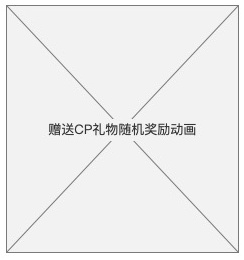


##### 图下需求拆解：CP礼物记录-礼物结果承载

**功能说明：** 本节复用 CP 礼物领取弹窗和亲密度记录页承载礼物结果。礼物赠送成功后展示奖励结果，并在亲密度记录中保留礼物来源。

**前置条件：**

| 条件项 | 说明 |
|---|---|
| CP 礼物赠送成功 | 奖励弹窗在支付成功后触发 |
| CP 关系有效 | 关系编号可查询 |
| 亲密度流水存在 | 本次赠送已产生亲密度记录 |

**字段与数据来源：**

| 字段 | 说明 | 数据来源 |
|---|---|---|
| 礼物编号 | 本次赠送礼物的唯一标识 | 礼物配置 |
| 礼物名称 | 礼物展示名称 | 礼物配置 |
| 礼物图标 | 礼物展示图标 | 礼物配置 |
| 赠送时间 | 本次赠送发生时间 | 送礼记录 |
| 亲密度变化 | 本次增加的亲密度 | 亲密度流水 |
| 奖励内容 | 本次触发的奖励 | 奖励配置+计算结果 |
| 领取状态 | 已领取/待领取 | 奖励记录 |

**关键交互：** 用户赠送礼物后展示结果弹窗；点击领取奖励完成发放；关闭弹窗后仍可在亲密度记录页追溯本次礼物结果。

**系统后台核心逻辑：** 礼物支付、亲密度增加、奖励发放、礼物记录写入必须按同一次业务结果处理，任一环节失败都要有补偿或可追溯状态；同一送礼记录的奖励只能发放一次。

**异常与测试关注点：** 覆盖普通礼物、惊喜礼物、超级礼物、奖励领取失败、关闭弹窗后补领、记录页追溯和重复点击领取等场景。

#### 前置条件

- 用户已绑定CP

#### 触发方式

- 从亲密度记录或礼物结果反馈中查看礼物相关记录；若最终原型未提供独立入口，则不单独做礼物记录页

#### 字段与数据来源

| 字段 | 说明 | 统计方式 | 数据来源 |
|---|---|---|---|
| 记录编号 | 唯一标识 | 直接读取 | 礼物记录 |
| 礼物信息 | 图标、名称、金币价值 | 关联查询 | 礼物配置 |
| 赠送者 | 送礼用户 | 直接读取 | 礼物记录 |
| 接收者 | 收礼用户 | 直接读取 | 礼物记录 |
| 增加亲密度 | 本次礼物对应有效亲密度 | 关联亲密度流水 | 亲密度流水记录 |
| 时间 | 赠送时间 | 直接读取 | 礼物记录 |

#### 交互逻辑

1. 礼物赠送成功后，在礼物结果弹窗或亲密度记录中展示相关结果。
2. 若用户进入礼物相关记录，仅展示礼物信息、亲密度变化和时间。
3. 页面仅展示原型可承载的礼物记录信息。

#### 系统后台核心逻辑

- 礼物记录必须与礼物流水、亲密度流水关联。
- 同一笔礼物只生成一条主礼物流水，奖励结果通过奖励记录关联。
- 系统后台可按时间倒序返回数据；数据量控制属于系统后台实现，不作为页面可见功能。

---

### 3.3 CP礼物特效

#### 功能说明

赠送CP礼物时在房间内播放专属特效，包含双人头像展示、亲密度 数值飘字等。

#### 对应原型

礼物特效对应 CP组全服特效、超级礼物全服特效礼物面板与动画展示。

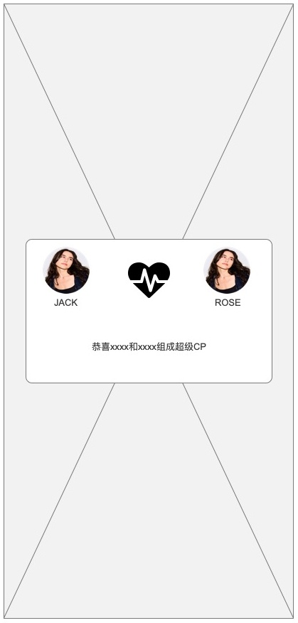


##### 图下需求拆解：CP组全服特效礼物面板

**功能说明：** 礼物面板中展示 CP 组全服特效礼物，用于告诉用户该礼物具备高曝光效果。这是礼物选择界面，不是送礼结果界面。

**前置条件：**

| 条件项 | 说明 |
|---|---|
| 用户已登录 | 未登录不可送礼 |
| CP 功能可用 | 版本、地区允许 |
| 礼物面板已打开 | 房间或私聊场景 |

**字段与数据来源：**

| 字段 | 说明 | 数据来源 |
|---|---|---|
| 全服特效礼物图标 | 礼物图标 | 礼物配置 |
| 全服特效礼物名称 | 礼物名称 | 礼物配置 |
| 金币价格 | 礼物售价 | 礼物配置 |
| 等级门槛标识 | 最低使用等级 | CP 等级权益配置 |
| 全服特效标识 | "全服特效"标签 | 礼物配置 |

**关键交互：** 用户选择礼物后，系统校验 CP 关系、等级门槛、金币余额和风控限制。

**系统后台核心逻辑：** 礼物支付成功后才能触发亲密度、榜单贡献和特效播放；等级不足、关系失效、余额不足时必须阻断。

**异常与测试关注点：** 覆盖普通送礼、专属礼物、超级礼物、等级不足、余额不足、关系解除后送礼、特效播放失败等场景。


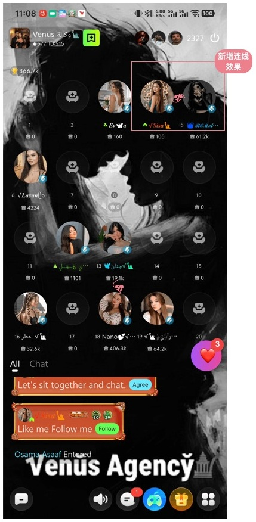


##### 图下需求拆解：房间CP组全服特效

**功能说明：** 房间内播放 CP 组全服特效的效果，用于展示送礼后的外显反馈。这是特效播放界面，不是操作界面。

**前置条件：**

| 条件项 | 说明 |
|---|---|
| CP 礼物赠送成功 | 特效在支付成功后触发 |
| 房间场景有效 | 用户在可播放特效的房间内 |
| 特效资源有效 | 动效资源未失效 |

**字段与数据来源：**

| 字段 | 说明 | 数据来源 |
|---|---|---|
| 特效动画 | 全服特效播放动画 | 礼物配置/特效资源 |
| 双人头像 | 是否展示双方头像环绕 | 礼物配置 |
| 亲密度飘字 | "亲密度 +X" | 礼物配置×亲密度倍率 |
| 播放时长 | 特效持续时间 | 礼物配置 |
| 播放范围 | 全服/房间内 | 礼物配置/频控策略 |

**关键交互：** 礼物支付成功后播放特效；播放范围和频控按后台配置执行；特效播放完毕后消失。

**系统后台核心逻辑：** 特效播放不作为支付成功的唯一依据，必须以系统送礼结果为准；播放失败不影响送礼结果；频控策略防止同一房间频繁刷屏。

**异常与测试关注点：** 覆盖特效正常播放、播放失败、用户退出房间、频控限制、资源加载失败。


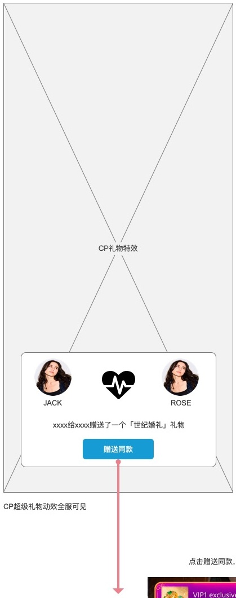


##### 图下需求拆解：赠送超级礼物全服特效礼物面板

**功能说明：** 超级礼物在礼物面板中的展示态，体现高等级或高价值礼物入口。与"CP组全服特效礼物面板"类似，但超级礼物有更高等级门槛和更隆重特效。

**前置条件：**

| 条件项 | 说明 |
|---|---|
| 用户已登录 | 未登录不可送礼 |
| CP 关系有效 | 超级礼物需绑定有效 CP |
| 等级门槛满足 | 当前 CP 等级达到超级礼物要求 |

**字段与数据来源：**

| 字段 | 说明 | 数据来源 |
|---|---|---|
| 超级礼物图标 | 礼物图标 | 礼物配置 |
| 超级礼物名称 | 礼物名称 | 礼物配置 |
| 金币价格 | 礼物售价 | 礼物配置 |
| 等级门槛标识 | 最低使用等级 | CP 等级权益配置 |
| 全服特效标识 | "全服特效"标签 | 礼物配置 |

**关键交互：** 等级不足、礼物下架或余额不足时不可完成赠送，并展示明确失败原因。

**系统后台核心逻辑：** 赠送前必须校验 CP 关系有效、等级满足、余额充足、礼物可购买、风控通过；支付成功后触发亲密度、榜单贡献、全服特效和奖励。

**异常与测试关注点：** 覆盖等级不足、余额不足、关系解除、礼物下架、赠送成功。


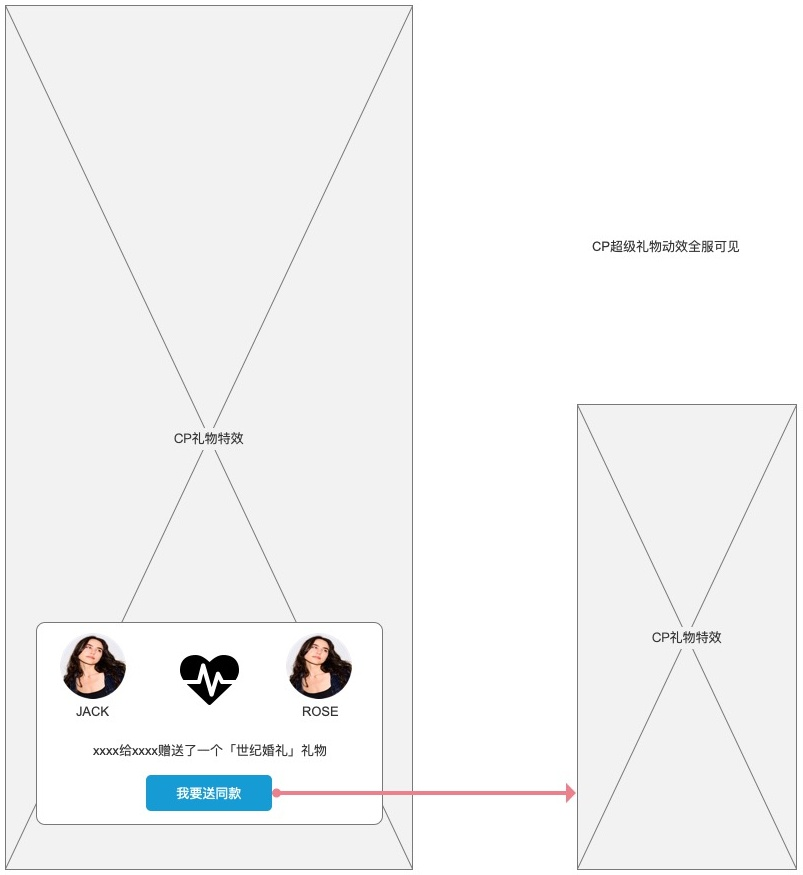


##### 图下需求拆解：赠送超级礼物全服特效动画

**功能说明：** 赠送超级礼物后的全服特效动画，是支付成功后的结果反馈。与"房间CP组全服特效"类似但更隆重。

**前置条件：**

| 条件项 | 说明 |
|---|---|
| 超级礼物赠送成功 | 特效在支付成功后触发 |
| 播放场景有效 | 全服/房间可播放 |

**字段与数据来源：**

| 字段 | 说明 | 数据来源 |
|---|---|---|
| 超级特效动画 | 全服超级特效播放动画 | 礼物配置/特效资源 |
| 双人头像 | 展示双方头像环绕 | 礼物配置 |
| 亲密度飘字 | "亲密度 +X" | 礼物配置×亲密度倍率 |
| 播放时长 | 特效持续时间 | 礼物配置 |
| 播放范围 | 全服 | 礼物配置/频控策略 |

**关键交互：** 动画播放不作为支付成功的唯一依据，必须以系统送礼结果为准。

**系统后台核心逻辑：** 特效播放是结果反馈，不是支付成功依据；播放失败不回滚已成功送礼；频控策略防止刷屏。

**异常与测试关注点：** 覆盖特效正常播放、播放失败、用户退出、频控限制、资源加载失败。


#### 字段与数据来源

| 字段 | 说明 | 统计方式 | 数据来源 |
|---|---|---|---|
| 特效类型 | 全屏/局部/飘字 | 直接读取 | 礼物配置 |
| 特效时长 | 播放时长（秒） | 直接读取 | 礼物配置 |
| 双人头像 | 是否展示双方头像 | 直接读取 | 礼物配置 |
| 亲密度 飘字 | 是否展示获得值 | 直接读取 | 礼物配置 |

#### 交互逻辑

1. 赠送CP礼物成功后
2. 房间内播放礼物特效（全屏动画）
3. 若为双人礼物：展示双方头像环绕动画
4. 飘字显示：「亲密度 +X」
5. 特效播放完毕后消失


---


#### 前置条件

| 条件项 | 说明 |
|---|---|
| 双方存在有效 CP 关系 | 特效类 CP 礼物必须绑定当前有效关系，组建礼物按邀请规则处理 |
| 礼物处于可赠送状态 | 礼物未下架、未隐藏、未超过使用时间 |
| 用户余额充足 | 金币余额必须足够支付本次礼物 |
| 等级门槛满足 | 专属礼物、超级礼物、全服特效礼物按等级权益校验 |
| 房间或展示场景有效 | 房间内特效必须存在可播放场景，离线场景只记录结果不强制播放 |

#### 系统后台核心逻辑

| 逻辑项 | 处理规则 |
|---|---|
| 支付优先级 | 先完成金币扣减和送礼记录创建，成功后再触发亲密度、榜单、特效和奖励 |
| 特效触发 | 特效播放是结果反馈，不是支付成功依据；播放失败不回滚已成功送礼 |
| 亲密度入账 | 按礼物配置倍率计算亲密度，并写入亲密度流水 |
| 榜单贡献 | 符合当前周期、关系有效、风控通过的亲密度才计入榜单贡献 |
| 等级校验 | 专属礼物和超级礼物赠送前必须校验当前 CP 等级，不允许客户端绕过 |
| 失败补偿 | 扣款成功但送礼记录或亲密度入账失败时，必须回滚或生成补偿任务 |

#### 边界与异常

| 场景 | 处理规则 |
|---|---|
| 余额不足 | 阻断赠送并提示余额不足 |
| 关系已解除 | 阻断赠送，不增加亲密度，不播放 CP 特效 |
| 礼物下架 | 隐藏或置灰礼物，不允许继续支付 |
| 等级不足 | 提示所需等级，不扣款 |
| 特效播放失败 | 不影响送礼结果，但需记录播放失败 |

### 3.4 CP礼物奖励与亲密度提示

#### 功能说明

CP礼物除基础送礼外，还可能触发奖励弹窗、领取弹窗、亲密度提示和特殊动效。本节只描述礼物结果反馈，不再重复礼物入口、礼物记录和全服特效规则。

#### 对应原型

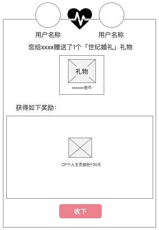


##### 图下需求拆解：CP礼物奖励邀请者视角

**功能说明：** 送礼者侧的 CP 礼物奖励弹窗，展示本次送礼触发的奖励内容。这是送礼结果反馈，不是送礼操作界面。

**前置条件：**

| 条件项 | 说明 |
|---|---|
| 本次 CP 礼物赠送成功 | 奖励弹窗在支付成功后触发 |
| 奖励配置有效 | 当前礼物存在奖励规则 |
| 奖励尚未展示 | 同一笔送礼结果只弹一次 |

**字段与数据来源：**

| 字段 | 说明 | 数据来源 |
|---|---|---|
| 礼物信息 | 本次赠送礼物的图标、名称 | 礼物配置 |
| 亲密度增加 | 本次获得的亲密度 | 礼物配置×亲密度倍率 |
| 奖励内容 | 亲密度奖励/礼物奖励/等级进度 | 奖励配置+计算结果 |
| 收下按钮 | "收下" | CP 功能配置 |
| 关闭按钮 | 右上角关闭 | 客户端交互 |

**关键交互：** 用户点击收下后奖励入账；关闭弹窗不能导致奖励丢失；奖励已入账不受弹窗关闭影响。

**系统后台核心逻辑：** 奖励在送礼成功时已入账，弹窗只是结果展示；同一送礼记录的奖励只能发放一次；关闭弹窗不触发退回；奖励结果与亲密度流水绑定，可追溯。

**异常与测试关注点：** 覆盖奖励正常展示、点击收下、关闭弹窗后奖励仍到账、重复点击收下、奖励发放失败补偿、重新进入页面查看结果。


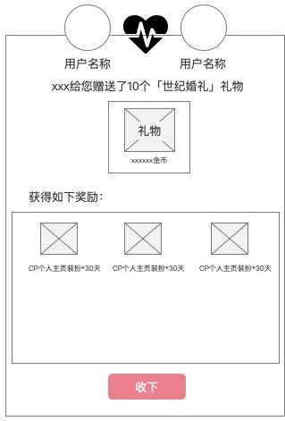


##### 图下需求拆解：CP礼物奖励被邀请者视角

**功能说明：** 收礼者侧的奖励反馈，展示对方送礼后自己获得或感知到的奖励结果。双方视角看到的奖励内容可以不同，但底层奖励结算只能执行一次。

**前置条件：**

| 条件项 | 说明 |
|---|---|
| 对方 CP 礼物赠送成功 | 收礼方奖励由对方送礼触发 |
| 奖励配置对收礼方有效 | 当前礼物存在收礼方奖励规则 |

**字段与数据来源：**

| 字段 | 说明 | 数据来源 |
|---|---|---|
| 送礼者资料 | 对方头像、昵称 | 用户资料 |
| 礼物信息 | 本次赠送礼物的图标、名称 | 礼物配置 |
| 获得的亲密度 | 本次关系增加的亲密度 | 礼物配置×亲密度倍率 |
| 奖励内容 | 收礼方获得的奖励 | 奖励配置+计算结果 |

**关键交互：** 奖励内容以系统生成结果为准，不因双方视角不同重复发放；关闭弹窗不影响奖励。

**系统后台核心逻辑：** 双方视角展示可以不同，但奖励结算只能按同一笔 CP 礼物结果执行一次；不得因邀请者和被邀请者各展示一次而重复发放。

**异常与测试关注点：** 覆盖收礼方看到奖励反馈、双方奖励内容不同、奖励只发放一次、消息延迟、关闭后再次进入、奖励补偿到账。


##### 图下需求拆解：CP礼物领取弹窗

**功能说明：** CP 礼物奖励领取弹窗，用于完成奖励确认和到账反馈。弹窗是结果展示，奖励在送礼成功时已入账。

**前置条件：**

| 条件项 | 说明 |
|---|---|
| 本次 CP 礼物赠送成功 | 弹窗在支付成功后触发 |
| 奖励配置有效 | 当前礼物存在奖励规则 |
| 奖励尚未领取展示 | 同一笔送礼结果只弹一次 |

**字段与数据来源：**

| 字段 | 说明 | 数据来源 |
|---|---|---|
| 礼物信息 | 本次赠送礼物的图标、名称 | 礼物配置 |
| 奖励内容 | 亲密度奖励/礼物奖励/等级进度 | 奖励配置+计算结果 |
| 领取按钮 | "领取" | CP 功能配置 |
| 关闭按钮 | 右上角关闭 | 客户端交互 |
| 领取状态 | 已领取/待领取 | 奖励记录 |

**关键交互：** 用户领取后更新领取状态；发放失败时记录失败原因并支持补发；关闭弹窗不影响奖励。

**系统后台核心逻辑：** 奖励在送礼成功时已入账，弹窗只是展示；同一送礼记录的奖励只能发放一次；关闭弹窗不触发退回；发放失败生成补偿任务。

**异常与测试关注点：** 覆盖奖励弹窗展示、点击领取、关闭弹窗、发放失败补发、双方视角奖励差异、重复点击领取。


#### 字段与数据来源

| 字段 | 说明 | 统计/计算方式 | 数据来源 |
|---|---|---|---|
| 奖励记录编号 | 本次奖励唯一记录 | 礼物送出成功后生成 | 奖励记录 |
| 奖励项列表 | 开出的奖励内容 | 按后台概率配置生成 | 奖励配置 |
| 奖励数量 | 奖励个数或有效天数 | 按奖励项配置 | 奖励配置 |
| 领取状态（领取_状态） | 待领取、已领取、发放失败 | 点击收下后更新 | 奖励记录 |
| 预计增加亲密度 | 送礼前展示的预计值 | 礼物金币 × 当前礼物倍率 | 礼物配置 |
| 实际增加亲密度 | 送礼成功后的实际值 | 扣除每日上限、风控限制后的有效值 | 亲密度流水 |

#### 交互逻辑

1. 用户送出 CP惊喜礼物或带奖励机制的 CP礼物。
2. 系统完成扣金币、送礼、亲密度计算后，生成奖励结果。
3. 页面展示奖励结果弹窗，展示奖励名称、图标、数量或有效期。
4. 用户点击“收下”后，奖励入账并关闭弹窗。
5. 若用户直接关闭弹窗，奖励记录仍保留，按产品规则自动入账或下次补弹，不能丢失奖励。
6. 若预计亲密度与实际亲密度不同，必须说明原因，例如达到上限或风控修正。

#### 系统后台核心逻辑

- 奖励生成必须绑定礼物流水编号，防止同一笔礼物重复开奖。
- 奖励发放必须有去重口径，建议使用“礼物流水编号 + 奖励项编号 + 接收用户编号”。
- 奖励入账失败时必须记录失败原因，并支持补发。
- 概率配置变更只影响变更后新产生的礼物流水，不追溯历史奖励结果。
- 超过上限部分不计入亲密度和榜单贡献，但礼物消费与财富值仍按普通送礼规则处理。

---


#### 前置条件

| 条件项 | 说明 |
|---|---|
| 本次 CP 礼物赠送成功 | 奖励与亲密度提示不能早于支付成功出现 |
| 奖励配置有效 | 当前礼物或等级对应奖励规则可查询 |
| 奖励对象明确 | 明确奖励发给送礼者、收礼者还是双方 |
| 奖励未重复领取 | 同一送礼记录或同一奖励结果不能重复发放 |

### 4. CP等级模块

#### 模块背景

CP等级模块定义了CP关系的等级体系，根据累计亲密度自动升级。不同等级享有不同特权，等级越高特权越丰富。等级是CP关系深度的可视化表达。

#### 用户场景

1. 用户查看当前CP等级和升级进度
2. 用户了解各等级特权和升级条件
3. 等级提升时收到升级通知和特权解锁提示

### 4.1 CP等级详情页

#### 功能说明

展示CP等级列表、各等级条件、当前等级进度、特权说明。

#### 对应原型

等级详情页对应 CP等级权益页，展示等级门槛、当前等级、下一等级进度与权益说明。

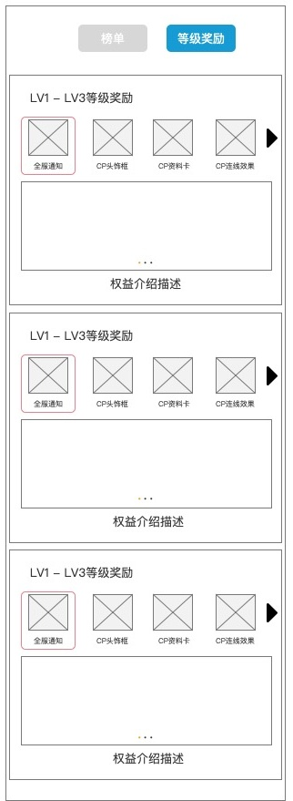


##### 图下需求拆解：CP等级权益

**功能说明：** CP 等级权益页展示当前等级已解锁权益、下一等级可解锁权益、权益说明和使用条件，帮助用户理解继续提升亲密度的收益。

**前置条件：**

| 条件项 | 说明 |
|---|---|
| 用户存在有效 CP 关系 | 未绑定不展示当前关系权益 |
| 等级配置有效 | 当前亲密度可匹配等级 |
| 权益资源已配置 | 资源未下架 |

**字段与数据来源：**

| 字段 | 说明 | 数据来源 |
|---|---|---|
| 当前等级 | 等级编号和名称 | CP 等级配置 |
| 等级图标 | 等级徽章 | CP 等级配置 |
| 当前亲密度 | 当前累计亲密度 | CP 关系记录 |
| 下一级门槛 | 升级所需亲密度 | CP 等级配置 |
| 权益列表 | 各等级可解锁权益（头像框/进场特效/气泡/专属礼物/专属表情/称号） | CP 等级权益配置 |
| 已解锁标识 | 当前等级已解锁的权益 | CP 等级+权益配置 |
| 未解锁标识 | 需要更高等级的权益，展示锁图标和所需等级 | CP 等级权益配置 |

**关键交互：** 用户点击权益入口查看权益详情；未达到等级的权益展示未解锁状态；达到等级后展示可用状态。

**系统后台核心逻辑：** 权益状态必须按当前等级和权益类型判断；当前等级权益、限时权益、纪念型永久权益和历史荣誉要分开处理；等级变化后权益列表实时刷新。

**异常与测试关注点：** 覆盖已解锁、未解锁、等级保护期、正式降级、限时权益到期、纪念型永久权益保留。


#### 前置条件

- 用户已绑定CP

#### 触发方式

| 入口 | 触发方式 |
|---|---|
| CP主页等级图标 | 点击等级图标 |
| CP主页进度条 | 点击进度条 |
| 消息中心升级通知 | 点击通知 |

#### 字段与数据来源

| 字段 | 说明 | 统计方式 | 数据来源 |
|---|---|---|---|
| 等级编号 | 唯一标识 | 直接读取 | CP等级配置 |
| 等级名称 | 显示名称 | 直接读取 | CP等级配置 |
| 等级图标 | 徽章页面地址 | 直接读取 | CP等级配置 |
| 升级所需亲密度 | 门槛值 | 直接读取 | CP等级配置 |
| 特权列表 | 该等级可用特权 | 关联查询 | CP等级权益配置 |
| 当前亲密度 | 总值 | 直接读取 | CP关系记录 |
| 当前等级 | 等级数字 | 匹配计算 | CP等级配置 |
| 升级进度 | 百分比 | 计算 | CP关系记录+CP等级配置 |

#### 交互逻辑

1. 页面顶部展示当前等级信息（图标+名称+亲密度 值）
2. 中部展示等级列表（纵向排列）
3. 当前等级高亮，未达到等级灰色
4. 点击某等级 → 展开该等级特权详情
5. 底部展示升级攻略：「赠送礼物可快速提升亲密度」

#### 系统后台核心逻辑

- 查询CP等级配置，获取所有等级配置
- 查询CP关系记录，获取当前亲密度
- 根据亲密度 匹配当前等级
- 关联查询各等级特权列表

**等级升级判断逻辑：**

```
当前亲密度 >= 该等级最低亲密度 且 < 下一等级最低亲密度 → 该等级
```

**升级触发时机：**

- 亲密度 变动后实时判断
- 若超过下一等级门槛 → 触发升级事件
- 升级事件：推送通知、更新等级图标、解锁特权

---

### 4.2 CP等级特权

#### 功能说明

各等级对应的特权功能，包含专属标识、进场特效、专属礼物、房间特权等。

#### 对应原型

等级特权对应 CP等级权益页，同时与 CP专属表情、CP专属礼物解锁展示联动。

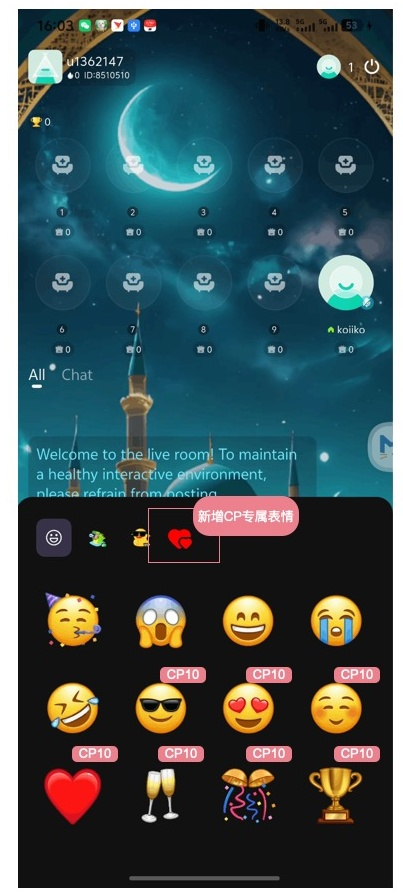


##### 图下需求拆解：增加CP表情

**功能说明：** CP 等级权益中的专属表情配置或展示，用于说明等级达到后可解锁新的互动表达。发送时系统仍需校验当前 CP 关系和等级。

**前置条件：**

| 条件项 | 说明 |
|---|---|
| 用户存在有效 CP 关系 | 未绑定不可使用 CP 专属表情 |
| 当前等级达到解锁门槛 | 等级不足不可发送 |
| 表情资源有效 | 资源未下架 |

**字段与数据来源：**

| 字段 | 说明 | 数据来源 |
|---|---|---|
| 表情资源 | 专属表情图/动画 | CP 等级权益配置 |
| 解锁等级 | 最低使用等级 | CP 等级权益配置 |
| 锁定状态 | 等级不足时展示锁图标 | 等级判断 |

**关键交互：** 用户等级不足时按原型状态提示所需等级；发送时系统仍需校验当前 CP 关系和等级。

**系统后台核心逻辑：** 等级权益必须按当前关系的当前等级判断；关系解除或等级下降后，使用权限要重新校验；表情资源下架后不展示。

**异常与测试关注点：** 覆盖等级达标、等级不足、关系解除、权益下架、升级后重新加载、降级保护期。


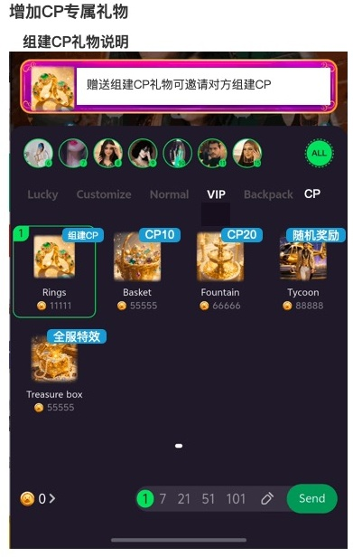


##### 图下需求拆解：增加CP专属礼物

**功能说明：** CP 等级权益中的专属礼物配置或展示，用于说明等级权益与礼物能力的联动。达到等级后可使用对应礼物；关系解除或等级下降后按当前等级权限重新校验。

**前置条件：**

| 条件项 | 说明 |
|---|---|
| 用户存在有效 CP 关系 | 未绑定不可赠送 CP 专属礼物 |
| 当前等级达到解锁门槛 | 等级不足不可选择 |
| 礼物处于上架状态 | 下架礼物不可选 |

**字段与数据来源：**

| 字段 | 说明 | 数据来源 |
|---|---|---|
| 专属礼物图标 | 礼物图标 | 礼物配置 |
| 专属礼物名称 | 礼物名称 | 礼物配置 |
| 金币价格 | 礼物售价 | 礼物配置 |
| 亲密度倍率 | 赠送后获得的亲密度倍率 | 礼物配置 |
| 解锁等级 | 最低使用等级 | CP 等级权益配置 |
| 锁定状态 | 等级不足时展示锁图标 | 等级判断 |

**关键交互：** 用户达到等级后可使用对应礼物；关系解除或等级下降后按当前等级权限重新校验；赠送前校验余额和风控。

**系统后台核心逻辑：** 专属礼物赠送前必须校验 CP 关系有效、当前等级满足、礼物可购买、余额充足、风控通过；支付成功后才增加亲密度、计入榜单、触发特效。

**异常与测试关注点：** 覆盖等级达标赠送、等级不足选择、关系解除后赠送阻断、礼物下架、升级后礼物解锁、降级后礼物锁定。


#### 字段与数据来源

| 字段 | 说明 | 统计方式 | 数据来源 |
|---|---|---|---|
| 特权编号 | 唯一标识 | 直接读取 | CP等级权益配置 |
| 特权名称 | 显示名称 | 直接读取 | CP等级权益配置 |
| 特权图标 | 图标页面地址 | 直接读取 | CP等级权益配置 |
| 特权描述 | 功能说明 | 直接读取 | CP等级权益配置 |
| 最低等级 | 解锁等级 | 直接读取 | CP等级权益配置 |

#### 等级特权列表（示例配置）

| 等级 | 亲密度 门槛 | 特权 |
|---|---|---|
| 等级.1 初识CP | 0 | CP头像框 |
| 等级.2 相识CP | 500 | 进场提示 |
| 等级.3 暧昧CP | 2,000 | 专属聊天气泡 |
| 等级.4 甜蜜CP | 5,000 | 专属礼物特效 |
| 等级.5 默契CP | 12,000 | 双人进场特效 |
| 等级.6 甜蜜CP | 30,000 | 专属头像框+进场特效+房间特权 |
| 等级.7 灵魂CP | 60,000 | 全部特权+专属称号 |

**注意：** 以上为示例配置，实际等级和门槛以后台配置表为准。

#### 交互逻辑

1. 用户点击某等级 → 展开特权列表
2. 已解锁特权：正常显示
3. 未解锁特权：灰色+锁图标，标注「等级.X解锁」
4. 点击某特权 → 展示特权详情和效果预览

---


#### 前置条件

| 条件项 | 说明 |
|---|---|
| 用户存在有效 CP 关系 | 关系解除后不再享受当前关系权益 |
| 当前等级已计算 | 系统后台已返回当前等级和权益列表 |
| 权益配置已发布 | 专属表情、专属礼物、头像框、特效等资源有效 |

#### 系统后台核心逻辑

| 逻辑项 | 处理规则 |
|---|---|
| 权益判断 | 使用当前 CP 关系等级判断权益是否可用，不能只看用户历史最高等级 |
| 使用前校验 | 发送 CP 表情、赠送专属礼物、播放专属特效前必须校验关系仍有效且等级满足 |
| 配置变更 | 权益资源下架或门槛调整后，前端展示和实际使用校验必须同步 |
| 关系解除 | 解除后当前关系权益立即失效；历史奖励是否保留按奖励配置执行 |
| 降级处理 | 亲密度衰减导致等级降低时，当前等级权益按最新等级校验；已发永久奖励不强制回收 |

#### 边界与异常

| 场景 | 处理规则 |
|---|---|
| 等级不足 | 展示锁定状态和所需等级 |
| 权益资源缺失 | 隐藏该权益或展示不可用状态 |
| 关系已解除 | 阻断使用并刷新页面 |
| 配置读取失败 | 不展示可用权益，避免误导用户 |

### 4.3 CP等级升级通知

#### 功能说明

CP等级提升时，向双方推送升级通知。

#### 触发方式

- 亲密度 达到升级门槛时自动触发

#### 交互逻辑

1. 亲密度 变动后判断是否升级
2. 若升级 → 推送通知给双方：「恭喜！你们的CP等级已升级为等级.X」
3. 通知卡片展示：新等级图标+名称+新解锁特权
4. 点击通知 → 跳转等级详情页
5. 房间内展示升级特效（若双方在房间内）

#### 系统后台核心逻辑

| 步骤 | 逻辑 |
|---|---|
| 1. 亲密度 变动 | 写入亲密度流水记录 |
| 2. 计算新等级 | 根据累计亲密度 匹配等级表 |
| 3. 判断是否升级 | 新等级 > 旧等级 → 升级 |
| 4. 更新等级 | 更新CP关系记录等级字段 |
| 5. 推送通知 | 调用消息服务，向双方推送升级通知 |
| 6. 解锁特权 | 更新用户特权表 |
| 7. 触发房间特效 | 若双方在房间内，播放升级特效 |


---


### 4.4 CP等级权益与奖励规则

#### 功能说明

本节统一 CP等级权益和升级奖励的业务口径，避免在等级详情页、等级特权和升级通知里重复解释同一套规则。

#### 权益类型

| 类型 | 说明 | 升级时处理 | 降级时处理 | 重新升级时处理 |
|---|---|---|---|---|
| 当前等级权益 | 背景板、连线、气泡框、展示样式 | 跟随等级升级 | 跟随等级降级或进入保护期后降级 | 跟随当前等级恢复 |
| 当前等级功能权限 | CP专属礼物、表情、超级礼物等使用权限 | 达到门槛后解锁 | 等级低于门槛后不可继续使用 | 再次达到门槛后恢复 |
| 非永久奖励 | 金币、礼物、限时装扮、道具等奖励 | 当前 CP关系首次达到奖励等级时发放 | 已发放的不回收 | 同一 CP关系同等级不重复发放 |
| 历史最高等级 | 当前 CP关系曾达到的最高等级 | 升级时更新 | 降级不回退 | 仅用于展示/纪念，不参与重复领奖 |

#### 系统后台核心逻辑

- 等级计算必须以 CP关系编号 为维度，不能只按单个用户维度计算。
- 等级奖励去重键建议使用“CP关系编号 + 等级 + 奖励项”，防止重复发放。
- 当前等级权益随当前等级变化；非永久奖励一经发放不因降级回收。
- 后台等级配置修改后，是否影响已绑定 CP关系必须以配置生效策略为准；已发放奖励不得因配置变更自动重算。
- 衰减造成等级下降时，涉及公开展示权益的变化必须走保护期/提醒策略，避免用户感知为系统突然惩罚。

---

### 5. CP榜单模块

#### 模块背景

CP榜单模块展示 CP 亲密度排名。当前原型确认日榜、周榜、月榜三种周期切换，上榜 CP 可获得额外曝光。榜单是 CP 系统的社交竞争元素。

#### 用户场景

1. 用户浏览CP榜单，查看当前热门CP
2. 用户查看自己和CP的排名和亲密度
3. 榜单结算时上榜CP获得奖励

### 5.1 CP榜单列表

#### 功能说明

展示 CP 亲密度排行榜。当前 CP榜单原型可见“榜单 / 等级奖励”主切换，以及“日榜 / 周榜 / 月榜”时间维度切换；页面结构按该原型范围描述。

#### 对应原型

本节对应“CP榜单模块”原型中的榜单切换标签、日榜/周榜/月榜切换与前列排名列表。原型展示 前列1 独立大卡、前列2-前列3并列卡片、前列4及以后列表式排名，并包含超过九十九排名状态。


##### 图下需求拆解：CP榜单模块

**功能说明：** CP 榜单页展示日榜、周榜等排名信息，以及当前用户所在 CP 关系的自身排名和亲密度贡献。榜单是 CP 关系竞争的核心展示。

**前置条件：**

| 条件项 | 说明 |
|---|---|
| 榜单功能开启 | 后台配置榜单可用 |
| 榜单数据存在 | 当前周期有有效统计结果 |
| 用户可查看该榜单 | 权限和地区允许 |

**字段与数据来源：**

| 字段 | 说明 | 数据来源 |
|---|---|---|
| 榜单/等级奖励切换 | 主 Tab 切换 | 客户端交互 |
| 日榜/周榜/月榜切换 | 周期切换 | 客户端交互 |
| TOP1 展示卡 | 头像、昵称、等级、贡献值 | 榜单计算+用户资料 |
| TOP2-3 并列卡 | 头像、昵称、等级、贡献值 | 榜单计算+用户资料 |
| TOP4+ 列表行 | 头像、昵称、等级、贡献值 | 榜单计算+用户资料 |
| 我的排名区域 | 排名、贡献值、未上榜状态 | 榜单计算+CP 关系记录 |
| 空状态 | 榜单为空时的占位提示 | 客户端资源 |

**关键交互：** 用户可切换榜单周期查看不同排名；点击榜单项可查看 CP 主页或榜单详情；自身排名区域固定展示当前状态；未绑定用户展示组建引导。

**系统后台核心逻辑：** 榜单按东三区周期统计有效亲密度贡献；风控异常、关系解除后的流水不计入；贡献值相同时按首次达到时间排序，仍相同按 CP 关系编号兜底；周期结束生成固定榜单结果；我的排名按 CP 关系编号查询，不能只按用户编号串历史关系。

**异常与测试关注点：** 覆盖日榜、周榜、未上榜、未绑定 CP、排名变化、周期切换、榜单结算后重新加载、空榜单、数据延迟展示。


#### 前置条件

- 用户已登录

#### 触发方式

| 入口 | 触发方式 |
|---|---|
| CP主页榜单区域 | 点击榜单相关入口进入CP榜单页 |

#### 字段与数据来源

| 字段 | 说明 | 统计方式 | 数据来源 |
|---|---|---|---|
| 排名 | 名次 | 按当前周期有效亲密度贡献排序 | CP榜单记录 |
| CP信息 | 双方头像、昵称或原型展示的CP组合信息 | 关联查询 | 用户中心、CP关系记录 |
| 亲密度/贡献值 | 当前周期累计有效亲密度 | 统计计算 | 亲密度流水记录 |
| 榜单周期 | 日榜、周榜、月榜 | 按东三区时间周期生成 | 榜单配置 |

#### 交互逻辑

1. 用户从 CP主页进入榜单页。
2. 页面展示“榜单 / 等级奖励”主切换。
3. 在榜单页内支持日榜、周榜、月榜切换。
4. 列表按原型展示 前列1、前列2-前列3、前列4及以后排名结构。
5. 底部展示当前用户自身排名区域；未组建 CP 时展示未组建占位态。
6. 页面不额外扩展原型之外的入口或详情跳转能力。

#### 系统后台核心逻辑

**榜单数据生成：**

| 周期 | 统计范围 | 说明 |
|---|---|---|
| 日榜 | 东三区时间自然日 | 原型可见 |
| 周榜 | 东三区时间自然周 | 原型可见 |
| 月榜 | 东三区时间自然月 | 原型可见 |

**统计逻辑：**

```
周期亲密度 = 当前CP关系在该周期内的有效亲密度变动合计
```

- 当前页面榜单周期按原型展示的日榜、周榜、月榜处理。
- 榜单重新加载频率属于系统后台/产品配置，不在当前页面原型中展示为固定页面规则。
- 历史榜单快照、风控过滤和排序兜底属于系统后台规则，不新增页面控件。

---

### 5.2 CP榜单结算

#### 功能说明

榜单周期结束时，向前列 指定数量名CP发放奖励。

#### 奖励规则（示例配置）

| 榜单类型 | 奖励范围 | 奖励内容 |
|---|---|---|
| 日榜前列3 | 第1-3名 | 金币奖励+专属徽章 |
| 周榜前列10 | 第1-10名 | 金币奖励+限定礼物 |
| 月榜前列20 | 第1-20名 | 金币奖励+特权体验卡 |

**注意：** 实际奖励以后台配置为准。

#### 系统后台核心逻辑

| 步骤 | 逻辑 |
|---|---|
| 1. 榜单结算触发 | 定时任务在周期结束时刻触发 |
| 2. 统计最终排名 | 统计该周期内亲密度 排名 |
| 3. 判断奖励范围 | 根据配置获取前列 指定数量 |
| 4. 发放奖励 | 调用资产服务发放金币、徽章等 |
| 5. 写入流水 | 记录奖励发放记录 |
| 6. 推送通知 | 向上榜CP推送获奖通知 |

---

### 5.3 我的排名

#### 功能说明

已绑定CP用户在榜单中查看自己的排名和亲密度。

#### 对应原型


##### 图下需求拆解：CP榜单模块-我的排名区域

**功能说明：** CP 榜单页底部固定的"我的排名"区域，展示当前用户 CP 关系在榜单中的排名和贡献值。该区域独立于榜单列表，始终展示。

**前置条件：**

| 条件项 | 说明 |
|---|---|
| 用户已绑定 CP | 未绑定展示组建引导 |
| 当前周期有统计结果 | 榜单已计算 |

**字段与数据来源：**

| 字段 | 说明 | 数据来源 |
|---|---|---|
| 我的排名 | 当前名次；未上榜展示"未上榜" | 榜单计算结果 |
| CP 对象头像 | 对方头像 | 用户资料 |
| 我的贡献值 | 当前周期累计贡献亲密度 | 亲密度流水+榜单计算 |
| 距上一名差距 | 亲密度差值 | 榜单计算结果 |
| 未绑定引导 | "组建CP上榜单" | CP 功能配置 |

**关键交互：** 已绑定上榜：展示排名和贡献值；已绑定未上榜：展示未上榜和贡献值；未绑定：展示组建引导；点击可跳转 CP 主页。

**系统后台核心逻辑：** 我的排名按 CP 关系编号查询，不按用户编号；榜单列表和我的排名使用同一周期和排序口径；未上榜阈值按榜单展示上限判断。

**异常与测试关注点：** 覆盖上榜展示、未上榜展示、未绑定展示、排名变化、周期切换后刷新、结算后刷新。


#### 前置条件

- 用户已绑定CP

#### 字段与数据来源

| 字段 | 说明 | 统计方式 | 数据来源 |
|---|---|---|---|
| 我的排名 | 当前名次 | 查询 | CP榜单记录 |
| 我的亲密度 | 周期累计值 | 统计 | 亲密度流水记录 |
| 距离上一名差距 | 亲密度 差值 | 计算 | 排名数据 |

#### 交互逻辑

1. 若用户未上榜（排名>100），展示「未上榜」
2. 若用户上榜，展示排名和亲密度
3. 显示「距离上一名还差X亲密度」


---


#### 系统后台核心逻辑

| 逻辑项 | 处理规则 |
|---|---|
| 查询口径 | 我的排名按当前 CP 关系编号查询，不能只按用户编号查询，避免历史关系串榜 |
| 周期一致 | 我的排名与榜单列表必须使用同一榜单类型和同一周期 |
| 未上榜处理 | 未进入展示名次时展示未上榜或超过九十九，不展示上一周期排名冒充当前结果 |
| 未绑定处理 | 未绑定 CP 用户展示组建引导，不查询历史 CP 的当前排名 |
| 数据延迟 | 榜单计算延迟时展示加载中或更新时间，不允许客户端自行排序 |

#### 边界与异常

| 场景 | 处理规则 |
|---|---|
| 当前 CP 无贡献 | 展示未上榜或贡献为 0 |
| 周期切换 | 重新查询对应周期我的排名 |
| 关系解除 | 不展示旧关系的当前榜单身份 |
| 榜单结算中 | 展示结算中提示或最近更新时间 |

### 5.4 CP榜单周期与结算规则

##### 功能说明

CP榜单用于展示 CP 关系在不同周期内的亲密度贡献排名，承接送礼增长和关系竞争。页面能力以原型可见的榜单/等级奖励切换、日榜/周榜/月榜切换、前列排名与我的排名区域为准；排序、风控过滤、周期结算属于系统后台规则，不作为额外页面控件。

##### 榜单类型与周期口径

| 榜单类型 | 周期口径 | 数据来源 | 默认定位 | 是否需要结算快照 |
|---|---|---|---|---|
| 日榜 | 东三区时间 自然日 | 当日有效亲密度贡献 | 用户进入榜单时可默认日榜或按产品配置 | 是 |
| 周榜 | 东三区时间 自然周 | 本周有效亲密度贡献 | 源材料标注周榜为核心 | 是 |
| 月榜 | 东三区时间 自然月 | 本月有效亲密度贡献 | 用于月度关系竞争 | 是 |

##### 字段与数据来源

| 字段 | 说明 | 统计/计算方式 | 数据来源 |
|---|---|---|---|
| 排名 | CP关系在当前榜单中的名次 | 按有效贡献值降序排序 | 榜单计算结果 |
| CP双方信息 | 双方头像、昵称、等级等 | 读取 CP关系双方用户资料 | CP关系、用户资料 |
| 榜单贡献值 | 当前周期计入榜单的有效亲密度 | 有效亲密度流水按周期汇总，风控异常不计入 | 亲密度流水、风控结果 |
| 当前周期 | 榜单周期标识 | 日/周/月按 东三区时间 生成周期键 | 系统时间服务 |
| 我的排名 | 当前用户 CP 关系在榜单中的排名 | 当前用户已绑定CP时查询本关系排名；未绑定时展示未组建状态 | 榜单计算结果 |
| 上榜状态（名次_状态） | 是否进入前列榜单 | 未上榜但有贡献时展示超过九十九或“未上榜” | 榜单计算结果 |

##### 交互逻辑

1. 用户从 CP主页点击榜单入口进入 CP榜单页。
2. 页面展示榜单/等级奖励主切换，并支持日榜、周榜、月榜切换。
3. 切换周期时，系统重新加载对应周期榜单数据。
4. 前列1 使用重点展示卡片，前列2-前列3 使用并列卡片，前列4及以后使用列表展示。
5. 用户未组建 CP 时，底部“我的排名”区域展示未组建 CP 占位态，并引导组建 CP。
6. 用户已组建 CP 但未上榜时，底部展示当前 CP 信息、贡献值和未上榜状态。
7. 榜单为空时展示空状态，不允许展示上一周期本地暂存数据数据冒充当前榜单。

##### 系统后台核心逻辑

- 榜单贡献值必须来自有效亲密度流水，超出每日亲密度上限、风控异常、关系已解除后的送礼不计入榜单。
- 排序规则：贡献值高者在前；贡献值相同时按首次达到该贡献值时间早者在前；仍相同时按 CP关系编号 做稳定兜底排序。
- 周期结束时应生成不可变榜单快照，历史榜单、奖励结算、客服追溯均读取快照，不被后续流水回滚随意影响。
- 风控用户或异常亲密度记录不得进入榜单；被剔除后应重新计算排名。
- 我的排名必须以当前 CP关系编号 查询，不能只按用户编号查，否则同一用户历史关系会串榜。

### 6. CP设置模块

#### 模块背景

CP设置模块允许用户配置CP相关功能开关，包含自动拒绝邀请、隐私设置等。

#### 用户场景

1. 用户开启自动拒绝，避免收到CP邀请骚扰
2. 用户设置CP隐私，隐藏CP关系

---

### 6.1 CP设置入口

#### 功能说明

从CP主页或个人主页进入CP设置页。

#### 前置条件

- 用户已登录

#### 触发方式

| 入口 | 触发方式 |
|---|---|
| CP主页「设置」按钮 | 点击进入 |
| 个人主页「CP设置」| 点击进入 |

#### 设置项

| 设置项 | 说明 | 默认值 |
|---|---|---|
| 自动拒绝CP邀请 | 开启后自动拒绝所有CP邀请 | 关闭 |
| 隐藏CP关系 | 开启后他人不可见CP信息 | 关闭 |
| CP升级通知 | 开启后等级提升时推送通知 | 开启 |
| CP维护提醒 | 开启后长期未维护推送提醒 | 开启 |

#### 交互逻辑

1. 展示设置列表
2. 用户切换开关 → 保存设置
3. 自动拒绝开启后，现有待处理邀请不变更，新邀请自动拒绝

#### 系统后台核心逻辑

| 步骤 | 逻辑 |
|---|---|
| 1. 读取用户配置 | 查询用户设置记录 |
| 2. 更新配置 | 更新用户设置记录 |
| 3. 返回结果 | 返回成功/失败 |

---

### 6.2 自动拒绝CP邀请

#### 功能说明

开启后，所有收到的CP邀请自动变为已拒绝状态，金币原路退回发起者。

#### 对应原型

自动拒绝 CP 邀请对应隐私设置入口与开启后的设置状态。

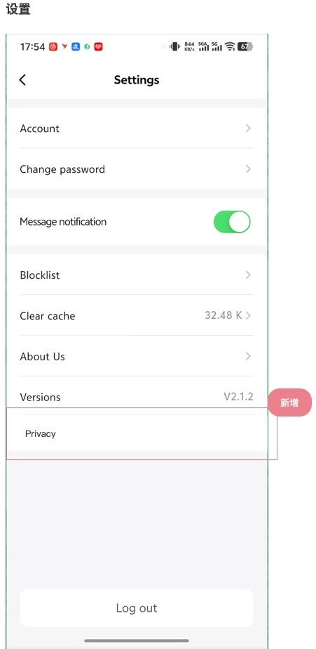


##### 图下需求拆解：设置

**功能说明：** CP 设置页入口，承载自动拒绝、关系管理等用户偏好设置。该页面展示当前用户的 CP 设置状态。

**前置条件：**

| 条件项 | 说明 |
|---|---|
| 用户已登录 | 未登录不可进入设置 |
| 设置页可访问 | CP 功能可用 |

**字段与数据来源：**

| 字段 | 说明 | 数据来源 |
|---|---|---|
| 自动拒绝开关 | 当前开启/关闭状态 | 用户 CP 设置记录 |
| 解除关系入口 | "解除CP关系"（仅已绑定时展示） | CP 功能配置 |
| CP 邀请提醒开关 | 是否接收邀请类通知 | 用户 CP 设置记录 |
| 风控限制提示 | 频繁操作时的限制说明 | 风控系统 |

**关键交互：** 用户进入设置页后读取系统保存的真实状态，不以本地缓存为准；每个设置项变更需校验和确认。

**系统后台核心逻辑：** 设置项必须读取系统保存状态；自动拒绝只影响开启后的新邀请，不追溯历史待处理邀请；设置变更写入操作日志。

**异常与测试关注点：** 覆盖开启/关闭、保存失败回滚、不同设备状态同步、设置读取失败降级展示。


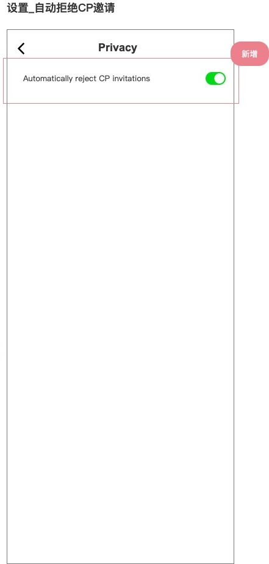


##### 图下需求拆解：设置自动拒绝CP邀请

**功能说明：** 自动拒绝 CP 邀请开关，用于控制新收到邀请的默认处理方式。开启后所有新邀请自动变为已拒绝状态，金币原路退回发起者。注意：这是设置操作，不是邀请操作，不应使用邀请字段模板。

**前置条件：**

| 条件项 | 说明 |
|---|---|
| 用户已登录 | 未登录不可进入设置 |
| 用户未绑定 CP 或规则允许配置 | 已绑定用户此设置项可能隐藏 |

**字段与数据来源：**

| 字段 | 说明 | 数据来源 |
|---|---|---|
| 自动拒绝开关 | 当前开启/关闭状态 | 用户 CP 设置记录 |
| 开关变更时间 | 最近一次开启或关闭时间 | 设置变更日志 |
| 二次确认文案 | "开启后将自动拒绝所有CP邀请" | CP 功能配置 |
| 确认按钮 | "确认开启" | CP 功能配置 |
| 取消按钮 | "取消" | CP 功能配置 |
| 轻提示文案 | "已开启自动拒绝" | CP 功能配置 |

**关键交互：** 开启后仅影响新收到的邀请；关闭后新邀请恢复待处理；历史已拒绝邀请不恢复；二次确认后才生效。

**系统后台核心逻辑：** 开关状态必须由系统保存并跨设备同步；自动拒绝触发的拒绝状态必须和用户手动拒绝区分原因字段；新邀请到达时查询该开关，若开启则直接更新邀请状态为已拒绝并触发退币；开关变更写入操作日志。

**异常与测试关注点：** 覆盖开启、关闭、保存失败回滚、新邀请自动拒绝、历史邀请不恢复、不同设备状态同步、开关开启期间退币失败处理。


#### 前置条件

| 条件 | 说明 |
|---|---|
| 用户未绑定CP | 已绑定CP用户无此设置项 |

#### 交互逻辑

1. 用户进入CP设置页
2. 开启「自动拒绝CP邀请」开关
3. 二次确认弹窗：「开启后将自动拒绝所有CP邀请，是否确认？」
4. 确认后开启，所有新邀请自动拒绝
5. 轻提示提示「已开启自动拒绝」

#### 系统后台核心逻辑

| 步骤 | 逻辑 |
|---|---|
| 1. 更新配置 | 将用户设置记录中的自动拒绝状态更新为开启 |
| 2. 新邀请到达时判断 | 查询配置，若开启则直接更新邀请状态为已拒绝 |
| 3. 退回金币 | 调用资产服务退回金币 |

---


#### 字段与数据来源

| 字段 | 说明 | 统计方式 | 数据来源 |
|---|---|---|---|
| 自动拒绝开关 | 当前用户是否开启自动拒绝 CP 邀请 | 直接读取 | 用户 CP 设置记录 |
| 设置修改时间 | 最近一次开启或关闭时间 | 直接读取 | 设置变更日志 |
| 生效范围 | 是否影响历史邀请 | 固定规则：仅影响新邀请 | CP 设置规则 |
| 自动拒绝原因 | 系统拒绝、用户手动拒绝 | 按触发方式生成 | CP邀请记录 |
| 退币状态 | 自动拒绝后发起者金币是否退回 | 查询钱包处理结果 | 钱包记录 |
| 跨设备同步状态 | 不同设备看到的开关状态 | 读取系统保存值 | 用户设置记录 |

#### 异常处理

| 异常场景 | 页面处理 | 系统处理 |
|---|---|---|
| 设置保存失败 | 页面回滚到保存前状态 | 不改变系统设置 |
| 新邀请触发自动拒绝但退币失败 | 发起者看到退回处理中 | 生成退币补偿任务 |
| 开关状态跨设备不一致 | 重新拉取系统状态 | 以系统保存值为准 |

### 6.3 CP设置变更规则

#### 功能说明

本节统一 CP设置页中自动拒绝、解除关系、邀请提醒和风控提示的生效边界，避免在各入口重复写规则。

#### 设置项与生效范围

| 设置项 | 说明 | 生效范围 | 默认值 | 是否需要系统保存 |
|---|---|---|---|---|
| 自动拒绝CP邀请 | 开启后自动拒绝他人发来的 CP邀请 | 仅影响新收到的邀请；不追溯已存在待处理邀请 | 关闭 | 是 |
| 解除CP关系 | 主动结束当前 CP关系 | 当前有效 CP关系 | 无 | 是 |
| CP邀请提醒 | 是否接收 CP邀请类通知 | 通知展示，不影响邀请记录创建 | 开启 | 是 |
| 风控限制提示 | 频繁邀请、频繁解绑重绑时展示限制原因 | 当前用户 | 系统判断 | 是 |

#### 交互逻辑

1. 用户进入 CP设置页，系统加载当前设置状态和当前关系状态。
2. 用户开启自动拒绝后，新收到的 CP邀请自动进入已拒绝状态，并通知发起者。
3. 用户关闭自动拒绝后，新邀请恢复正常待处理；历史已拒绝邀请不自动恢复。
4. 用户点击解除关系，进入解除关系确认流程。
5. 设置保存失败时，页面回滚到系统保存的原状态，并提示保存失败。

#### 系统后台核心逻辑

- 设置变更必须写入操作日志，包含用户、设置项、旧值、新值和修改时间。
- 自动拒绝开关必须由系统保存并参与邀请创建前校验，不能只做本地开关。
- 自动拒绝触发的拒绝状态必须和用户手动拒绝区分原因，便于客服追溯。
- 设置页展示必须读取系统真实状态，不能只用用户端本地本地暂存数据。
- 解除后无固定重绑等待限制；异常频繁解绑/重绑交由风控处理。

---

### 7. 消息通知模块

#### 模块背景

CP系统涉及多种消息通知场景，包含邀请通知、接受/拒绝通知、升级通知、维护提醒等。

#### 通知类型

| 通知类型 | 触发场景 | 接收者 | 展示形式 |
|---|---|---|---|
| CP邀请通知 | 发起邀请 | 被邀请者 | 私聊邀请函卡片 |
| 邀请被接受通知 | 接受邀请 | 发起者 | 系统消息卡片 |
| 邀请被拒绝通知 | 拒绝邀请 | 发起者 | 系统消息卡片 |
| CP升级通知 | 等级提升 | 双方 | 系统消息卡片 |
| CP维护提醒 | 长期未维护 | 双方 | 系统消息卡片 |
| CP解体通知 | 解除CP关系 | 双方 | 系统消息卡片 |

---

### 7.1 CP邀请通知卡片

#### 功能说明

被邀请者收到CP邀请时，在私聊中展示邀请函卡片。

#### 对应原型

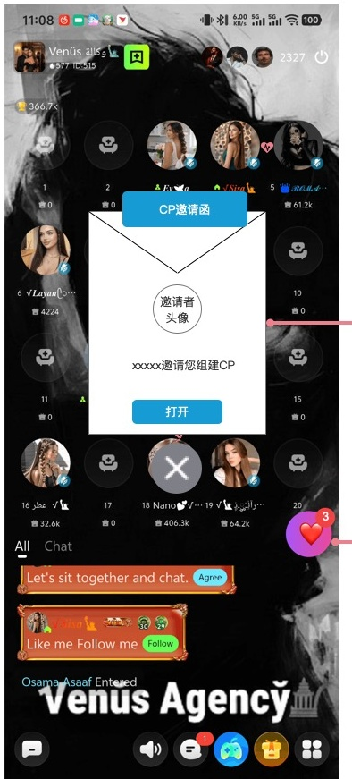


##### 图下需求拆解：被邀请者视角CP邀请信函

**功能说明：** 被邀请者在私聊中收到 CP 邀请信函卡片，卡片用于提醒用户有待处理邀请，并提供"查看"入口。与"CP邀请函-被邀请者视角"是同一类卡片在不同场景的展示，业务逻辑一致。

**前置条件：**

| 条件项 | 说明 |
|---|---|
| 邀请已成功创建 | 卡片绑定真实邀请记录 |
| 被邀请者可接收消息 | 账号未封禁、未注销 |

**字段与数据来源：**

| 字段 | 说明 | 数据来源 |
|---|---|---|
| 邀请者头像 | 发起者头像 | 用户资料 |
| 邀请者昵称 | 发起者昵称 | 用户资料 |
| 邀请文案 | 邀请主题和说明 | CP 消息模板 |
| 组建礼物信息 | 礼物图标、名称 | 礼物配置 |
| 剩余有效期 | 邀请过期倒计时 | CP 邀请记录 |
| 查看按钮 | "查看"入口 | 消息卡片配置 |

**关键交互：** 用户点击"查看"后进入邀请详情；若邀请仍可处理，则展示接受/拒绝操作；若邀请已过期、已取消或双方任一方已绑定 CP，则展示结果状态并禁止继续处理。

**系统后台核心逻辑：** 卡片点击时必须重新读取邀请最新状态；卡片不等于邀请仍有效；通知发送失败不影响邀请记录。

**异常与测试关注点：** 覆盖收到邀请卡片、点击查看待处理邀请、点击查看已过期邀请、点击查看已取消邀请、重复点击查看、消息延迟到达。


#### 字段与数据来源

| 字段 | 说明 | 统计方式 | 数据来源 |
|---|---|---|---|
| 邀请编号 | 唯一标识 | 直接读取 | CP邀请记录 |
| 发起者信息 | 头像+昵称 | 关联查询 | 用户中心 |
| 礼物信息 | 图标+名称 | 关联查询 | 礼物配置表 |
| 邀请时间 | 格式化时间 | 直接读取 | CP邀请记录 |
| 已过期倒计时 | 剩余时间 | 计算 | CP邀请记录 |

#### 交互逻辑

1. 邀请卡片展示：发起者头像+昵称+「邀请你组建CP」+礼物信息+倒计时
2. 卡片下方展示两个按钮：「接受邀请」/「拒绝」
3. 点击「接受邀请」→ 跳转邀请详情页并执行接受流程
4. 点击「拒绝」→ 弹出二次确认 → 执行拒绝流程
5. 点击卡片其他区域 → 跳转邀请详情页

---


#### 前置条件

| 条件项 | 说明 |
|---|---|
| 被邀请者收到有效邀请 | 通知必须绑定真实 CP 邀请记录 |
| 邀请仍在有效期内 | 过期、取消、已处理邀请不展示可操作按钮 |
| 接收方账号可接收消息 | 封禁、注销等状态按消息规则处理 |

#### 系统后台核心逻辑

| 逻辑项 | 处理规则 |
|---|---|
| 通知生成 | 邀请创建成功后生成通知卡片，通知卡片绑定邀请编号 |
| 点击校验 | 点击通知进入详情时重新读取邀请当前状态 |
| 操作一致 | 通知卡片、邀请列表、邀请详情对同一邀请状态展示一致 |
| 旧卡片处理 | 邀请过期、取消、已接受后，旧通知卡片不能继续处理，只能展示结果 |
| 消息补偿 | 通知发送失败不影响邀请记录，但用户进入邀请列表时必须能看到该邀请 |

#### 异常处理

| 异常场景 | 处理规则 |
|---|---|
| 通知发送失败 | 记录失败并允许补发；邀请列表仍可查看 |
| 旧通知重复点击 | 跳转后展示最新结果，不重复处理 |
| 邀请已过期 | 展示已过期状态并阻断接受 |

### 7.2 CP升级通知

#### 功能说明

CP等级提升时，向双方推送升级通知。

#### 对应原型

CP升级通知对应升级触发奖励弹窗，用户升级后通过弹窗承接奖励感知与领取动作。

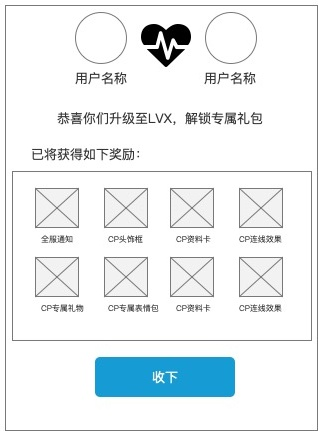


##### 图下需求拆解：CP升级触发奖励弹窗

**功能说明：** CP 等级提升后触发的奖励弹窗，展示本次升级解锁的权益或奖励内容。弹窗是结果展示，奖励在升级时已入账。

**前置条件：**

| 条件项 | 说明 |
|---|---|
| CP 等级发生提升 | 亲密度跨越等级门槛 |
| 当前 CP 关系有效 | 关系解除不触发升级奖励 |
| 升级奖励配置有效 | 存在可发放配置 |

**字段与数据来源：**

| 字段 | 说明 | 数据来源 |
|---|---|---|
| 新等级 | 等级编号和名称 | CP 等级配置 |
| 新等级图标 | 等级徽章 | CP 等级配置 |
| 新解锁特权列表 | 本次升级解锁的权益 | CP 等级权益配置 |
| 奖励内容 | 升级奖励详情 | 升级奖励配置 |
| 领取按钮 | "领取" | CP 功能配置 |
| 关闭按钮 | 右上角关闭 | 客户端交互 |

**关键交互：** 用户点击领取或关闭弹窗后，奖励资格仍应保留；再次进入相关入口时可查看已获得奖励。

**系统后台核心逻辑：** 升级奖励必须绑定本次等级变化记录，同一等级同一关系只能发放一次；弹窗展示失败不能导致奖励丢失；降级后再升级不重复发奖（同一 CP 关系同一等级只发一次）。

**异常与测试关注点：** 覆盖升级触发、重复升级判断、领取奖励、关闭弹窗、发放失败补偿、降级后奖励保留规则。


#### 字段与数据来源

| 字段 | 说明 | 统计方式 | 数据来源 |
|---|---|---|---|
| 新等级 | 等级数字+名称 | 直接读取 | CP等级配置 |
| 新等级图标 | 徽章页面地址 | 直接读取 | CP等级配置 |
| 新解锁特权 | 特权列表 | 关联查询 | CP等级权益配置 |

#### 交互逻辑

1. 系统消息卡片展示：「恭喜！你和[CP昵称]的CP等级已升级为等级.X」
2. 展示新等级图标和名称
3. 展示新解锁特权（若有）
4. 点击通知 → 跳转等级详情页

---


#### 前置条件

| 条件项 | 说明 |
|---|---|
| CP 等级发生提升 | 本次亲密度变化跨过新的等级门槛 |
| 当前 CP 关系有效 | 关系解除后不触发当前关系升级通知 |
| 升级奖励配置有效 | 若有奖励，需存在可发放配置 |

#### 系统后台核心逻辑

| 逻辑项 | 处理规则 |
|---|---|
| 升级判定 | 亲密度变化后由系统后台判断是否跨越等级门槛 |
| 奖励去重 | 同一 CP 关系同一等级的升级奖励只能发放一次 |
| 通知对象 | 升级通知发送给 CP 双方，文案和奖励状态保持一致 |
| 弹窗失败 | 弹窗展示失败不影响奖励资格，用户再次进入可查看或领取 |
| 降级后再升级 | 是否再次奖励按后台配置；默认不重复发放同一关系同一等级奖励 |

#### 异常处理

| 异常场景 | 处理规则 |
|---|---|
| 奖励发放失败 | 记录补偿任务，弹窗展示发放中或稍后查看 |
| 重复触发升级 | 不重复发奖，只更新通知展示 |
| 等级配置变更 | 以触发时系统计算结果为准，并记录等级快照 |

### 7.3 CP维护提醒

#### 功能说明

用户长期未维护CP关系时，推送提醒通知。

#### 前置条件

| 条件 | 说明 |
|---|---|
| 用户已绑定CP | 未绑定不触发 |
| 超过配置天数未维护 | 默认7天，可配置 |

#### 交互逻辑

1. 系统消息卡片展示：「你已X天未与CP互动，亲密度 可能会衰减哦」
2. 点击通知 → 跳转CP主页

---

### 7.4 CP解体通知

#### 功能说明

CP关系解除时，向双方推送通知。

#### 对应原型


##### 图下需求拆解：CP解体通知-解除结果反馈

**功能说明：** CP 关系解除后的系统消息通知，用于告知双方关系已失效。通知卡片是结果反馈，不是操作入口——关系已在系统后台解除。

**前置条件：**

| 条件项 | 说明 |
|---|---|
| CP 关系已解除 | 系统确认关系已失效 |
| 双方可接收消息 | 账号正常 |

**字段与数据来源：**

| 字段 | 说明 | 数据来源 |
|---|---|---|
| 解除结果文案 | "你与XX的CP关系已解除" | CP 消息模板 |
| 解除发起方 | 本人/对方/系统 | 解除关系记录 |
| CP 主页入口 | 点击通知进入 CP 主页未绑定态 | 消息卡片配置 |
| 权益失效说明 | 等级权益、专属礼物已失效 | CP 功能配置 |

**关键交互：** 用户确认解除后，双方收到解除结果通知；点击通知进入 CP 主页未绑定态，原 CP 权益和专属礼物入口同步失效。

**系统后台核心逻辑：** 解除成功、消息通知、主页状态、礼物入口、等级权益必须同步更新，不能出现通知已发但关系仍可用的割裂状态。

**异常与测试关注点：** 覆盖主动解除、对方解除、自动解除、通知点击跳转、解除后权益失效、通知重复推送和消息延迟。


#### 交互逻辑

1. 系统消息卡片展示：「你与[CP昵称]的CP关系已解除」
2. 若为对方发起解除：「[CP昵称]已解除与你的CP关系」
3. 点击通知 → 跳转CP主页（未绑定态）


---


#### 前置条件

| 条件项 | 说明 |
|---|---|
| CP 关系解除成功 | 通知必须在系统确认关系已解除后发送 |
| 双方账号可接收通知 | 账号封禁、注销按消息规则处理 |
| 解除来源明确 | 需要区分本人主动解除、对方解除、系统解除 |

#### 字段与数据来源

| 字段 | 说明 | 统计方式 | 数据来源 |
|---|---|---|---|
| CP关系编号 | 被解除的关系唯一标识 | 直接读取 | CP关系记录 |
| 解除发起方 | 本人、对方、系统 | 按解除操作记录生成 | 解除关系记录 |
| 解除时间 | 关系失效时间 | 直接读取 | CP关系记录 |
| 通知接收方 | 双方用户 | 由 CP 关系双方生成 | CP关系记录 |
| 跳转目标 | CP主页未绑定态 | 固定规则 | CP页面配置 |

#### 系统后台核心逻辑

| 逻辑项 | 处理规则 |
|---|---|
| 状态先行 | 必须先完成关系解除，再发送解除通知 |
| 权益失效 | 解除后 CP主页、资料卡、私聊CP信息、专属礼物、等级权益同步失效 |
| 历史保留 | 历史亲密度、礼物记录、榜单快照按历史记录保留，不参与当前关系 |
| 通知去重 | 同一次解除只发送一组解除通知，重复解除请求不重复推送 |
| 跳转校验 | 点击解除通知进入 CP主页时，展示未绑定态或当前最新关系状态 |

#### 异常处理

| 异常场景 | 页面处理 | 系统处理 |
|---|---|---|
| 通知发送失败 | 用户进入 CP主页时仍显示未绑定态 | 记录失败并允许补发 |
| 解除后旧入口点击 | 刷新为未绑定态 | 阻断旧关系主页访问 |
| 重复解除请求 | 展示关系已解除 | 不重复写解除记录 |

### 7.5 消息通知触发与补偿规则

##### 功能说明

消息通知模块负责把 CP邀请、接受、拒绝、超时、取消、升级、维护提醒、解除关系、退币等结果及时告知双方。通知不是装饰，它承接状态变化和资产处理结果，必须与系统后台状态一致。

##### 通知类型与触发规则

| 通知类型 | 接收方 | 触发时机 | 通知内容重点 | 是否关联业务状态 |
|---|---|---|---|---|
| CP邀请通知 | 被邀请者 | 发起邀请成功 | 邀请人、礼物、剩余时间、接受/拒绝入口 | 是，待处理 |
| 邀请接受通知 | 邀请者/双方 | 被邀请者接受 | 已成为CP、亲密度增加、关系入口 | 是，已接受 |
| 邀请拒绝通知 | 邀请者 | 被邀请者拒绝或自动拒绝 | 邀请被拒绝、金币已退回 | 是，已拒绝 |
| 邀请超时通知 | 双方或邀请者 | 邀请超过有效期 | 邀请已超时、金币已退回 | 是，已过期 |
| 邀请取消通知 | 被邀请者/邀请者 | 邀请方取消或系统取消 | 邀请已取消、金币已退回 | 是，已取消 |
| CP升级通知 | 双方 | CP等级提升 | 新等级、解锁权益、奖励领取状态 | 是，等级变化 |
| CP维护提醒 | 双方 | 亲密度衰减前/保护期内 | 关系维护提醒、互动引导 | 是，衰减/保护期 |
| CP解除通知 | 双方 | 任一方解除关系 | 关系已解除、权益失效说明 | 是，关系解除 |
| 退币通知 | 原付款方 | 拒绝/超时/取消导致退款 | 退回金币数量、原因 | 是，钱包变动 |

##### 字段与数据来源

| 字段 | 说明 | 统计/计算方式 | 数据来源 |
|---|---|---|---|
| 通知编号 | 通知唯一标识 | 状态变化时生成 | 通知服务 |
| 业务对象编号 | 关联邀请、关系、奖励或退币记录 | 按触发来源绑定 | CP邀请/CP关系/钱包记录 |
| 通知状态（notification_状态） | 已发送、发送失败、已读 | 通知服务回执更新 | 通知服务 |
| 剩余时间 | 邀请待处理剩余时间 | 邀请过期时间 - 当前时间 | CP邀请记录 |
| 退款金额 | 退回金币数量 | 原邀请礼物消耗金币数 | 钱包记录 |

##### 交互逻辑

1. 用户收到 CP邀请后，通知卡片展示邀请人、礼物、权益说明和剩余时间。
2. 用户点击通知卡片进入邀请详情页，详情页必须重新校验邀请当前状态。
3. 若邀请已被接受、拒绝、取消或超时，详情页展示最终状态，不再展示可操作按钮。
4. 发生升级、解除、退币等结果时，通知文案必须明确说明发生了什么和用户下一步能做什么。
5. 通知发送失败不应影响主业务状态，但必须记录失败并允许补发或在用户进入页面时展示最新状态。

##### 系统后台核心逻辑

- 通知只能反映系统后台最终状态，不能由页面根据本地倒计时自行改成已超时。
- 退币通知必须在钱包退回成功后发送；如果退币补偿处理中，通知应展示“退回处理中”或延迟发送，避免用户看到已退但余额未变。
- 邀请状态变更与通知发送需要有业务对象编号关联，便于客服追溯。
- 同一状态变化不要重复发送多条相同通知；需要用业务对象编号 + 状态作为去重口径。

## 二、开发重点注意事项

### 1. 并发与数据一致性

| 问题 | 说明 | 解决方案 |
|---|---|---|
| 同时接受多个邀请 | 用户同时收到多个邀请，可能并发接受 | 使用分布式锁（以用户编号作为并发控制依据），仅第一个成功 |
| 双方同时互相邀请 | A邀请B和B邀请A同时存在 | 后发起方自动接受对方邀请，不重复扣款 |
| 金币扣减与邀请创建 | 金币扣减成功但邀请创建失败 | 使用数据存储事务，失败则回滚金币 |
| 亲密度 变动与等级计算 | 并发增加亲密度 可能导致等级判断错误 | 使用原子操作更新亲密度，变动后重新计算等级 |

### 2. 时区处理

| 问题 | 说明 | 解决方案 |
|---|---|---|
| 中东区时区 | 中东区使用东三区时间，所有时间计算基于东三区时间 | 系统后台统一使用东三区时间计算，用户端展示时转换 |
| 榜单周期 | 日榜/周榜/月榜的时间范围基于东三区时间 | 定时任务使用东三区时间时区触发 |
| 邀请已过期 | 已过期时间基于东三区时间 | 创建邀请时计算已过期时间=当前东三区时间时间+有效期 |

### 3. 衰减机制

| 问题 | 说明 | 解决方案 |
|---|---|---|
| 亲密度 衰减 | 长期未维护CP关系导致亲密度 衰减 | 每日定时任务检查维护记录，超期则按配置衰减 |
| 衰减精度 | 亲密度 衰减后可能低于当前等级门槛 | 衰减后重新计算等级，可能降级 |
| 衰减下限 | 亲密度 衰减是否允许降为0 | 配置衰减下限，默认不低于0 |

### 4. 安全与风控

| 问题 | 说明 | 解决方案 |
|---|---|---|
| 刷亲密度 | 用户通过反复解除再绑定刷亲密度 | 解除CP后冷却期内不可再次绑定同一用户 |
| 小号互刷 | 用户注册小号互送礼物刷亲密度 | 风控系统监测异常赠送行为，限制频率 |
| 邀请骚扰 | 用户频繁向同一人发送邀请 | 每日向同一用户最多发起X次邀请（可配置） |

### 5. 性能优化

| 问题 | 说明 | 解决方案 |
|---|---|---|
| 榜单查询 | 实时统计亲密度排名压力大 | 使用本地暂存数据；重新加载频率按系统后台配置执行 |
| 亲密度 变动记录 | 记录量大，查询慢 | 分表存储，按月分表，支持分页查询 |
| 原型图加载 | 页面内嵌大量图片 | 使用CD指定数量加速，图片懒加载 |

### 6. 幂等性

| 操作 | 幂等键 | 说明 |
|---|---|---|
| 创建邀请 | 发起者编号 + 被邀请者编号 + 创建时间戳 | 防止重复创建邀请 |
| 接受邀请 | 邀请编号 | 防止重复接受 |
| 拒绝邀请 | 邀请编号 | 防止重复拒绝 |
| 金币退回 | 邀请编号 + 退回类型 | 防止重复退回 |
| 亲密度 变动 | 变动来源编号 + 变动类型 | 防止重复增加亲密度 |

---


---

# 二、平台后台

## 1. CP等级配置模块

#### 模块背景

后台配置CP等级体系，包含等级门槛、奖励配置、发布管理。

#### 对应原型

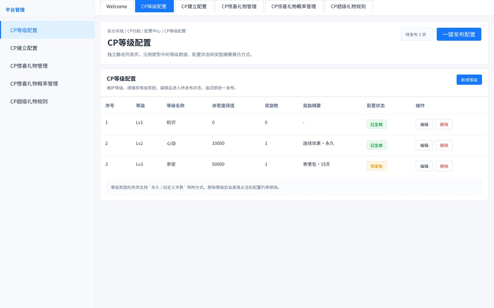


##### 图下需求拆解：CP等级配置

**功能说明：** 后台 CP 等级配置列表，运营可查看各等级门槛、权益和状态。这是后台管理页面，不是客户端页面。

**前置条件：**

| 条件项 | 说明 |
|---|---|
| 运营已登录后台 | 后台权限校验通过 |
| 等级配置数据存在 | 至少有一条等级配置 |

**字段与数据来源：**

| 字段 | 说明 | 数据来源 |
|---|---|---|
| 等级编号 | 等级唯一标识 | CP 等级配置 |
| 等级名称 | 等级展示名称 | CP 等级配置 |
| 亲密度门槛 | 升级所需最低亲密度 | CP 等级配置 |
| 等级图标 | 徽章资源 | CP 等级配置 |
| 等级状态 | 启用/停用 | CP 等级配置 |
| 权益数量 | 该等级关联的权益数 | CP 等级权益配置 |

**关键交互：** 运营可查看等级配置并进入编辑；列表页不直接修改已发布配置。

**系统后台核心逻辑：** 等级门槛必须递增；停用等级不影响已绑定 CP 的当前等级判断；新配置只影响后续等级计算，不追溯重算历史等级。

**异常与测试关注点：** 覆盖新增、编辑、保存失败、停用、重新启用、配置冲突。


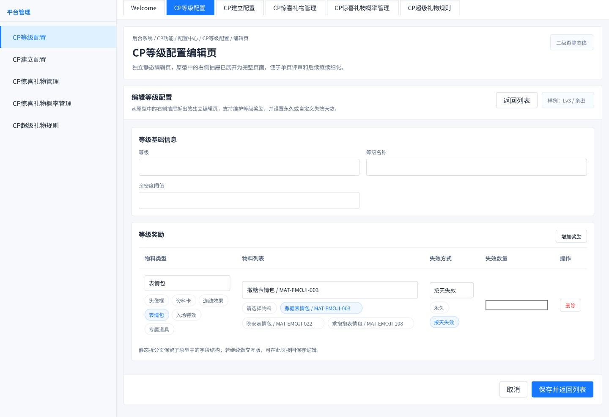


##### 图下需求拆解：CP等级配置编辑页

**功能说明：** CP 等级配置编辑页，运营可维护等级门槛、权益资源和奖励内容。

**前置条件：**

| 条件项 | 说明 |
|---|---|
| 运营已登录后台 | 后台权限校验通过 |
| 编辑对象存在 | 新增或编辑已有配置 |

**字段与数据来源：**

| 字段 | 说明 | 类型 | 必填 |
|---|---|---|---|
| 等级名称 | 等级展示名称 | 文本 | 是 |
| 亲密度门槛 | 升级所需最低亲密度 | 数字 | 是 |
| 等级图标 | 徽章资源 | 图片 | 是 |
| 等级状态 | 启用/停用 | 开关 | 是 |
| 关联权益 | 该等级解锁的权益列表 | 多选 | 否 |
| 升级奖励 | 升级到该等级的奖励内容 | 配置 | 否 |

**关键交互：** 保存前必须校验等级门槛递增、资源完整、奖励不重复；发布后按配置生效策略执行。

**系统后台核心逻辑：** 保存前校验必填项、启停状态、生效范围和历史数据保护；配置变更不得随意重算历史结果；编辑已发布配置时需二次确认影响范围。

**异常与测试关注点：** 覆盖新增、编辑、保存失败、停用、重新启用、配置冲突。


### 1.1 等级列表

#### 功能说明

展示所有CP等级配置，支持新建、编辑、删除操作。

#### 字段定义

| 字段名 | 说明 | 数据来源 |
|---|---|---|
| 等级 | 等级1~等级指定数量 | 后台配置 |
| 等级名称 | 如「初识」「心动」等 | 后台配置 |
| 亲密度阈值 | 升级所需最低亲密度 | 后台配置 |
| 奖励数量 | 该等级解锁的奖励项数 | 统计计算 |
| 奖励摘要 | 奖励内容简述 | 后台配置 |
| 配置状态 | 待发布/已生效 | 状态字段 |
| 操作 | 编辑/删除 | - |

#### 交互逻辑

1. 列表展示所有等级配置
2. 支持按等级排序（默认升序）
3. 点击「新建」→ 弹出等级编辑页
4. 点击「编辑」→ 弹出等级编辑页（回填数据）
5. 点击「删除」→ 二次确认 → 删除（待发布状态可删，已生效状态不可删）

---

### 1.2 等级编辑

#### 功能说明

编辑单个等级的基础信息和奖励配置。

#### 字段定义

**基础信息：**

| 字段名 | 说明 | 校验规则 |
|---|---|---|
| 等级 | 等级数字 | 必填，唯一，连续 |
| 等级名称 | 显示名称 | 必填，最多20字符 |
| 亲密度阈值 | 升级门槛 | 必填，数值，阈值递增 |

**等级奖励配置：**

| 字段名 | 说明 | 校验规则 |
|---|---|---|
| 奖励类型 | 头像框/资料卡/连线效果/表情包/入场特效/专属道具 | 必填 |
| 奖励资源编号 | 资源库中有效编号 | 必填，资源必须存在 |
| 失效方式 | 永久/按天 | 必填 |

> **权益保留规则：** 永久权益一旦发放，即使后续等级降级仍可继续使用；按天权益到期后自动失效，等级降级不提前收回。
| 失效值 | 天数（按天时必填） | 按天时必填 |
| 排序 | 展示顺序 | 数字 |

#### 交互逻辑

1. 点击「新建等级」或「编辑」→ 弹出编辑页
2. 填写基础信息
3. 添加奖励配置项（支持多条）
4. 点击「保存草稿」→ 保存为待发布状态
5. 点击「发布」→ 校验通过后生效

#### 校验规则

| 规则 | 说明 |
|---|---|
| 等级唯一且连续 | 不允许跳级，等级1→等级2→等级3... |
| 阈值递增 | 后一级阈值 > 前一级阈值 |
| 奖励不可重复 | 同一等级内奖励资源编号不可重复 |
| 奖励资源必须有效 | 校验资源库中资源存在 |

---

## 2. CP建立配置模块

#### 模块背景

配置CP建立（绑定）时的礼物、特效、奖励规则。

#### 对应原型

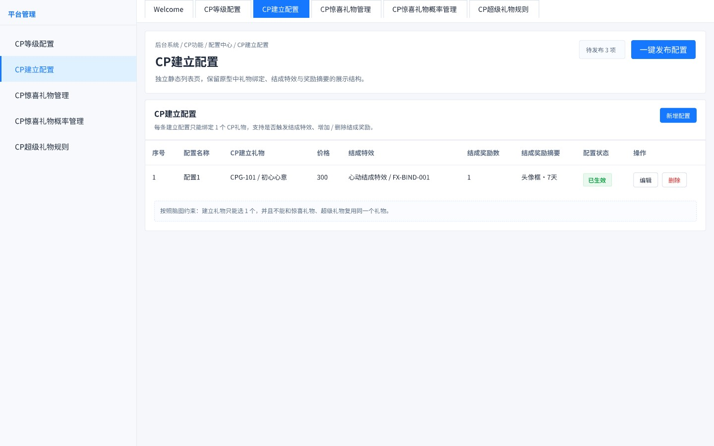


##### 图下需求拆解：CP建立配置

**功能说明：** CP 建立配置列表，运营可查看组建 CP 礼物、邀请有效期和建立规则。

**前置条件：**

| 条件项 | 说明 |
|---|---|
| 运营已登录后台 | 后台权限校验通过 |
| 建立配置数据存在 | 至少有一条配置 |

**字段与数据来源：**

| 字段 | 说明 | 数据来源 |
|---|---|---|
| 配置编号 | 唯一标识 | CP 建立配置 |
| 组建礼物 | 邀请时必须赠送的礼物 | 礼物配置 |
| 亲密度倍率 | 礼物→亲密度的转换倍率 | CP 建立配置 |
| 邀请有效期 | 邀请过期时间 | CP 建立配置 |
| 配置状态 | 启用/停用 | CP 建立配置 |

**关键交互：** 运营从列表进入新增或编辑；停用配置不影响历史已产生邀请。

**系统后台核心逻辑：** 新配置只影响后续邀请，不追溯修改历史邀请；停用配置后新邀请不可使用该配置。

**异常与测试关注点：** 覆盖新增、编辑、保存失败、停用、重新启用、配置冲突。


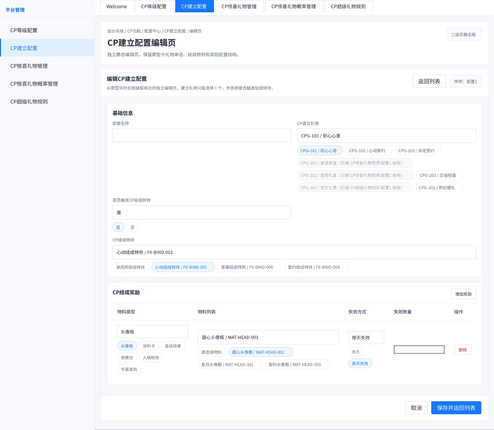


##### 图下需求拆解：CP建立配置编辑页

**功能说明：** CP 建立配置编辑页，运营可维护组建礼物、亲密度倍率、邀请文案和有效期。

**前置条件：**

| 条件项 | 说明 |
|---|---|
| 运营已登录后台 | 后台权限校验通过 |
| 编辑对象存在 | 新增或编辑已有配置 |

**字段与数据来源：**

| 字段 | 说明 | 类型 | 必填 |
|---|---|---|---|
| 组建礼物 | 邀请时必须赠送的礼物 | 下拉选择 | 是 |
| 亲密度倍率 | 礼物→亲密度的转换倍率 | 数字 | 是 |
| 邀请有效期 | 邀请过期时间（小时） | 数字 | 是 |
| 邀请文案模板 | 邀请消息的文案模板 | 文本 | 是 |
| 配置状态 | 启用/停用 | 开关 | 是 |

**关键交互：** 保存时校验礼物可用性、倍率范围和有效期；新配置只影响后续邀请。

**系统后台核心逻辑：** 保存前校验必填项、启停状态、生效范围和历史数据保护；配置变更不得随意重算历史结果。

**异常与测试关注点：** 覆盖新增、编辑、保存失败、停用、重新启用、配置冲突。


### 2.1 配置列表

#### 功能说明

展示所有CP建立配置，每个配置绑定一个建立礼物。

#### 字段定义

| 字段名 | 说明 | 数据来源 |
|---|---|---|
| 序号 | 自增序号 | - |
| 配置名称 | 配置标识 | 后台配置 |
| CP建立礼物 | 礼物编号/名称 | 关联礼物系统 |
| 礼物价格 | 金币价值 | 礼物系统只读 |
| 结成特效 | 是否触发特效 | 后台配置 |
| 奖励数量 | 奖励项数 | 统计计算 |
| 奖励摘要 | 奖励内容简述 | 后台配置 |
| 配置状态 | 待发布/已生效 | 状态字段 |
| 操作 | 编辑/删除 | - |

---

### 2.2 配置编辑

#### 功能说明

编辑CP建立配置的礼物绑定、特效、奖励。

#### 字段定义

**基础信息：**

| 字段名 | 说明 | 校验规则 |
|---|---|---|
| 配置名称 | 配置标识 | 必填 |
| CP建立礼物 | 单选礼物 | 必填，只能选CP礼物 |
| 是否触发结成特效 | 开关 | - |
| 结成特效编号 | 特效资源编号 | 触发特效时必填 |

**结成奖励：**

| 字段名 | 说明 | 校验规则 |
|---|---|---|
| 奖励类型 | 资源类型 | 必填 |
| 奖励资源编号 | 资源库编号 | 必填，资源必须有效 |
| 失效方式 | 永久/按天 | 必填 |

> **权益保留规则：** 按 8.2「CP等级配置管理」中的统一权益保留规则执行。
| 失效值 | 天数 | 按天时必填 |

#### 系统后台逻辑

| 触发时机 | 执行逻辑 |
|---|---|
| 发起邀请 | 校验礼物是否为建立礼物 → 写入邀请快照（礼物信息+配置） |
| 接受邀请 | 原子建立CP关系 → 关闭冲突邀请 → 发放奖励 → 播放结成特效 |

#### 校验规则

| 规则 | 说明 |
|---|---|
| 一个礼物只能绑定一个配置 | 礼物不可跨配置复用 |
| 只能选择CP礼物 | 礼物类型必须为CP礼物 |
| 特效必须合法 | 特效编号必须存在 |
| 奖励资源必须有效 | 校验资源库 |

---

## 3. CP礼物规则模块

#### 模块背景

CP礼物规则为逻辑层，定义礼物在CP系统中的业务属性。

#### 礼物类型

| 类型 | 英文标识 | 说明 |
|---|---|---|
| 建联礼物 | BI指定数量D | 用于建立CP关系 |
| 普通礼物 | 指定数量ORMAL | 常规CP礼物 |
| 高级礼物 | ADVA指定数量CED | 高价值CP礼物 |
| 随机礼物 | RA指定数量DOM | 惊喜礼物（概率奖励） |

#### 礼物业务字段（来源：礼物系统）

| 字段名 | 说明 |
|---|---|
| 是否CP礼物 | 标识是否属于CP礼物分类 |
| 礼物类型 | BI指定数量D/指定数量ORMAL/ADVA指定数量CED/RA指定数量DOM |
| 解锁等级 | 使用该礼物所需CP等级 |
| 是否未绑定可见 | 未绑定CP用户是否可见 |
| 是否未绑定可用 | 未绑定CP用户是否可赠送 |
| 亲密度倍率 | 赠送时亲密度加成倍率 |
| 榜单倍率 | 榜单贡献加成倍率 |
| 广播类型 | 无/房间/全服 |
| 广播文案 | 广播时展示的文案 |
| 特效资源 | 礼物特效资源编号 |
| 状态 | 启用/下线 |

#### 规则约束

| 约束 | 说明 |
|---|---|
| 建联配置绑定 | BUILD类型礼物只能绑定一个建立配置 |
| 惊喜礼物配置绑定 | RA指定数量DOM类型礼物只能绑定一个惊喜礼物配置 |
| 超级礼物配置绑定 | 高级礼物只能绑定一个超级礼物配置 |
| 不可跨模块复用 | 同一礼物不可同时出现在多个配置模块 |

---

## 4. CP惊喜礼物管理模块

#### 模块背景

配置惊喜礼物（随机礼物）的礼物池和概率规则。

#### 对应原型

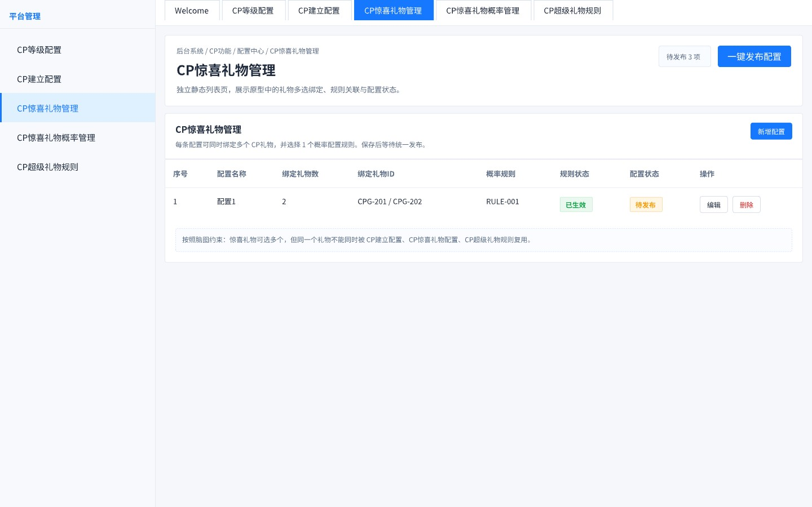


##### 图下需求拆解：CP惊喜礼物管理

**功能说明：** CP 惊喜礼物管理列表，运营可查看已配置的惊喜礼物及启停状态。

**前置条件：**

| 条件项 | 说明 |
|---|---|
| 运营已登录后台 | 后台权限校验通过 |
| 惊喜礼物数据存在 | 至少有一条配置 |

**字段与数据来源：**

| 字段 | 说明 | 数据来源 |
|---|---|---|
| 配置编号 | 唯一标识 | CP 惊喜礼物配置 |
| 触发礼物 | 触发惊喜效果的礼物 | 礼物配置 |
| 奖励池 | 可能获得的奖励列表 | CP 惊喜礼物配置 |
| 概率组 | 各奖励档位的概率分配 | CP 惊喜礼物概率配置 |
| 配置状态 | 启用/停用 | CP 惊喜礼物配置 |

**关键交互：** 运营可进入编辑或调整状态；停用后新送礼不再触发该配置。

**系统后台核心逻辑：** 停用后不影响已触发的惊喜礼物结果；概率变更只影响新送礼。

**异常与测试关注点：** 覆盖新增、编辑、保存失败、停用、重新启用、配置冲突。


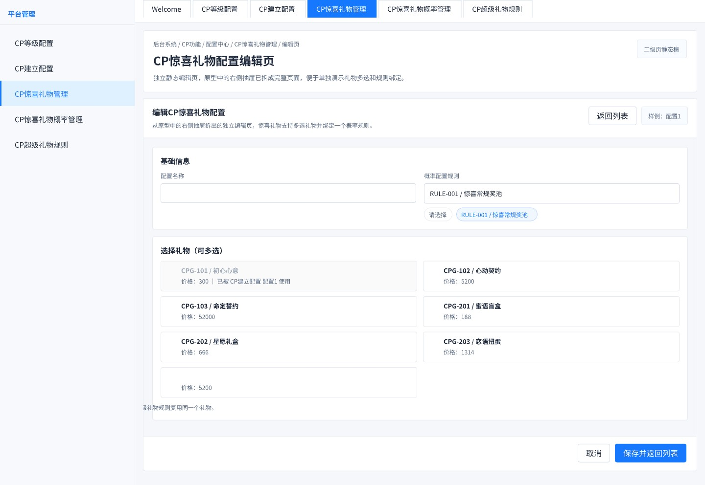


##### 图下需求拆解：CP惊喜礼物配置编辑页

**功能说明：** CP 惊喜礼物配置编辑页，运营可维护触发礼物、奖励池、概率组和展示文案。

**前置条件：**

| 条件项 | 说明 |
|---|---|
| 运营已登录后台 | 后台权限校验通过 |
| 编辑对象存在 | 新增或编辑已有配置 |

**字段与数据来源：**

| 字段 | 说明 | 类型 | 必填 |
|---|---|---|---|
| 触发礼物 | 触发惊喜效果的礼物 | 下拉选择 | 是 |
| 奖励池 | 可能获得的奖励列表 | 配置 | 是 |
| 概率组 | 各档位概率值 | 配置 | 是 |
| 展示文案 | 惊喜礼物弹窗文案 | 文本 | 是 |
| 配置状态 | 启用/停用 | 开关 | 是 |

**关键交互：** 发布前校验概率合计、奖励库存、有效期和互斥规则。

**系统后台核心逻辑：** 概率合计必须为 100%；奖励资源有效性校验；保存后新送礼才使用新概率。

**异常与测试关注点：** 覆盖新增、编辑、保存失败、停用、重新启用、概率合计校验失败。


### 4.1 配置列表

#### 功能说明

展示所有惊喜礼物配置，每个配置绑定一个概率规则和多个礼物。

#### 字段定义

| 字段名 | 说明 | 数据来源 |
|---|---|---|
| 序号 | 自增序号 | - |
| 配置名称 | 配置标识 | 后台配置 |
| 绑定礼物数量 | 该配置下的礼物数 | 统计计算 |
| 礼物编号列表 | 绑定的礼物编号 | 后台配置 |
| 概率规则编号 | 关联的概率规则 | 后台配置 |
| 配置状态 | 待发布/已生效 | 状态字段 |
| 操作 | 编辑/删除 | - |

---

### 4.2 配置编辑

#### 功能说明

编辑惊喜礼物配置，绑定礼物池和概率规则。

#### 字段定义

**基础信息：**

| 字段名 | 说明 | 校验规则 |
|---|---|---|
| 配置名称 | 配置标识 | 必填 |
| 概率规则编号 | 单选概率规则 | 必填，规则必须存在 |

**礼物绑定：**

| 字段名 | 说明 | 校验规则 |
|---|---|---|
| 礼物多选 | 选择多个RA指定数量DOM类型礼物 | 必填，至少1个 |
| 展示信息 | 礼物编号、名称、价格、使用状态 | 只读展示 |

#### 系统后台逻辑

| 触发时机 | 执行逻辑 |
|---|---|
| 送礼时 | 判断是否为惊喜礼物 → 命中配置 → 查找概率规则 → 抽奖结算 → 发放奖励 |

#### 校验规则

| 规则 | 说明 |
|---|---|
| 礼物不可重复绑定 | 同一礼物不可出现在多个配置 |
| 礼物不可跨模块复用 | 礼物已绑定其他模块则不可选 |
| 概率规则必须存在 | 关联的概率规则编号必须有效 |

---

## 5. CP惊喜礼物概率管理模块

#### 模块背景

配置惊喜礼物的概率规则和奖励池。

#### 对应原型

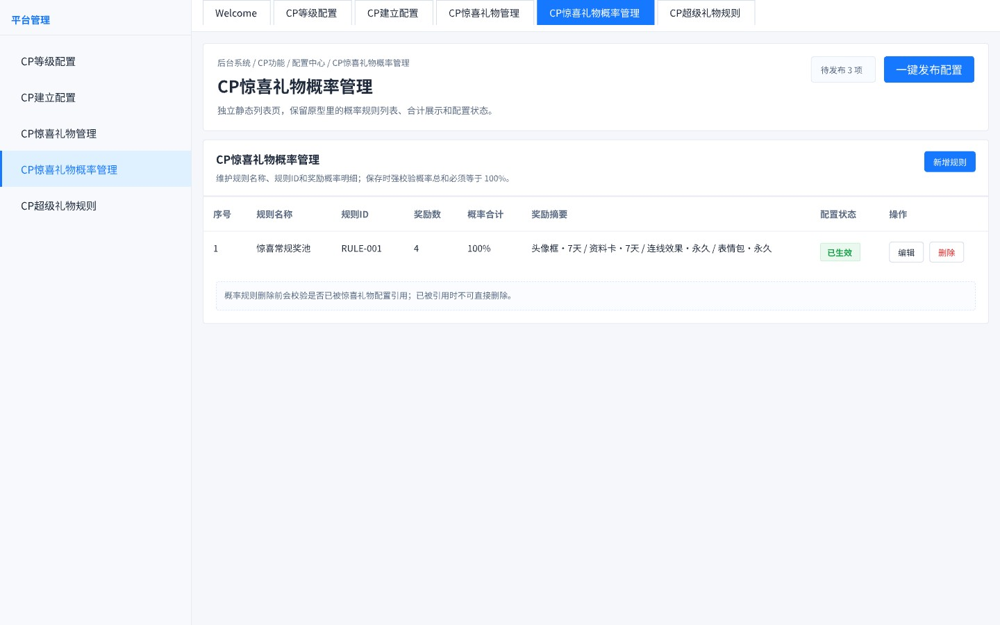


##### 图下需求拆解：CP惊喜礼物概率管理

**功能说明：** 惊喜礼物概率管理列表，运营可查看不同奖励档位和概率配置。

**前置条件：**

| 条件项 | 说明 |
|---|---|
| 运营已登录后台 | 后台权限校验通过 |
| 概率配置数据存在 | 至少有一条配置 |

**字段与数据来源：**

| 字段 | 说明 | 数据来源 |
|---|---|---|
| 档位编号 | 奖励档位唯一标识 | CP 惊喜礼物概率配置 |
| 档位名称 | 档位展示名称 | CP 惊喜礼物概率配置 |
| 概率值 | 该档位的中奖概率 | CP 惊喜礼物概率配置 |
| 奖励内容 | 该档位的奖励 | CP 惊喜礼物概率配置 |

**关键交互：** 运营可进入编辑页调整概率；线上配置变更只影响新产生的礼物流水。

**系统后台核心逻辑：** 概率变更不追溯已产生的惊喜结果；概率合计必须为 100%。

**异常与测试关注点：** 覆盖新增、编辑、保存失败、概率合计校验。


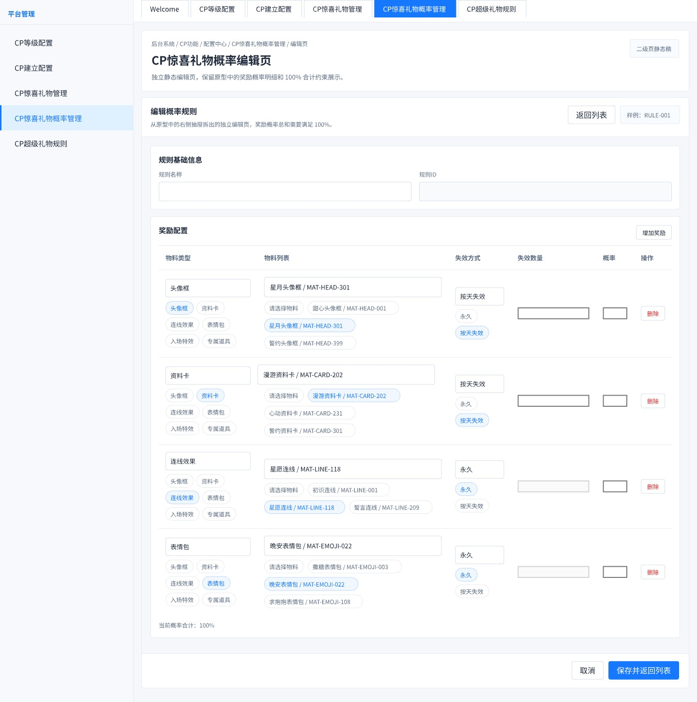


##### 图下需求拆解：CP惊喜礼物概率编辑页

**功能说明：** 惊喜礼物概率编辑页，运营可维护奖励档位、概率值和生效范围。

**前置条件：**

| 条件项 | 说明 |
|---|---|
| 运营已登录后台 | 后台权限校验通过 |
| 编辑对象存在 | 新增或编辑已有配置 |

**字段与数据来源：**

| 字段 | 说明 | 类型 | 必填 |
|---|---|---|---|
| 档位名称 | 档位展示名称 | 文本 | 是 |
| 概率值 | 中奖概率 | 数字 | 是 |
| 奖励内容 | 该档位的奖励 | 配置 | 是 |
| 生效范围 | 适用地区/用户分层 | 多选 | 否 |

**关键交互：** 保存时校验概率合计、档位互斥和奖励资源有效性。

**系统后台核心逻辑：** 概率合计校验；档位互斥校验；保存后新送礼才使用新概率。

**异常与测试关注点：** 覆盖新增、编辑、保存失败、概率合计校验失败。


### 5.1 概率规则列表

#### 功能说明

展示所有概率规则，每个规则定义一个奖励池。

#### 字段定义

| 字段名 | 说明 | 数据来源 |
|---|---|---|
| 序号 | 自增序号 | - |
| 规则名称 | 规则标识 | 后台配置 |
| 规则编号 | 唯一标识 | 系统生成 |
| 奖励数量 | 奖励池项数 | 统计计算 |
| 概率总和 | 各档位概率之和 | 计算校验（=100%） |
| 奖励摘要 | 奖励内容简述 | 后台配置 |
| 配置状态 | 待发布/已生效 | 状态字段 |
| 操作 | 编辑/删除 | - |

---

### 5.2 概率规则编辑

#### 功能说明

编辑概率规则的奖励池配置。

#### 字段定义

**基础信息：**

| 字段名 | 说明 | 校验规则 |
|---|---|---|
| 规则名称 | 规则标识 | 必填 |
| 规则编号 | 唯一标识 | 系统自动生成 |

**奖励池配置：**

| 字段名 | 说明 | 校验规则 |
|---|---|---|
| 奖励类型 | 资源类型 | 必填 |
| 奖励资源编号 | 资源库编号 | 必填，资源必须有效 |
| 失效方式 | 永久/按天 | 必填 |

> **权益保留规则：** 按 8.2「CP等级配置管理」中的统一权益保留规则执行。
| 失效值 | 天数 | 按天时必填 |
| 概率 | 中奖概率（%） | 必填，所有概率之和=100% |

#### 系统后台逻辑

| 步骤 | 逻辑 |
|---|---|
| 1. 抽奖 | 根据规则编号抽奖，返回奖励结果 |
| 2. 发放 | 调用资产服务发放奖励 |
| 3. 记录 | 写入中奖记录 |

#### 校验规则

| 规则 | 说明 |
|---|---|
| 概率总和必须100% | 所有奖励概率之和=100% |
| 奖池不能为空 | 至少配置1个奖励 |
| 奖励不可重复 | 奖励资源编号不可重复 |
| 被引用规则不可删除 | 规则被配置引用时不可删除 |

---

## 6. CP超级礼物规则模块

#### 模块背景

配置超级礼物（高价值礼物）的奖励规则。

#### 对应原型

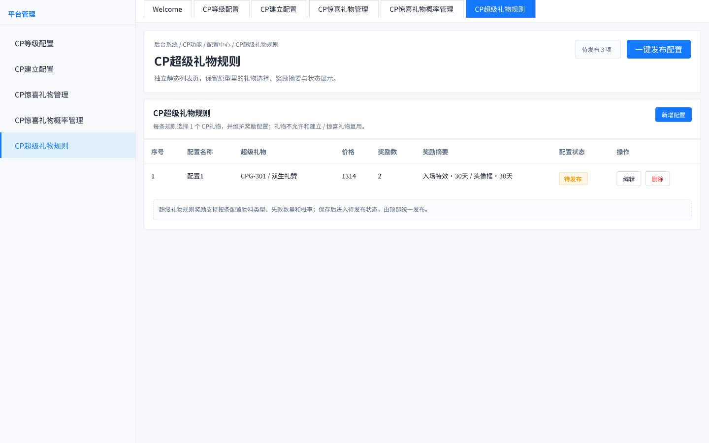


##### 图下需求拆解：CP超级礼物规则

**功能说明：** CP 超级礼物规则列表，运营可查看超级礼物触发条件、播放范围和频控规则。

**前置条件：**

| 条件项 | 说明 |
|---|---|
| 运营已登录后台 | 后台权限校验通过 |
| 超级礼物规则数据存在 | 至少有一条配置 |

**字段与数据来源：**

| 字段 | 说明 | 数据来源 |
|---|---|---|
| 规则编号 | 唯一标识 | CP 超级礼物规则配置 |
| 等级门槛 | 使用该超级礼物的最低 CP 等级 | CP 超级礼物规则配置 |
| 礼物条件 | 触发全服特效的礼物 | 礼物配置 |
| 播放范围 | 全服/房间/私聊 | CP 超级礼物规则配置 |
| 频控策略 | 播放频率限制 | CP 超级礼物规则配置 |
| 规则状态 | 启用/停用 | CP 超级礼物规则配置 |

**关键交互：** 运营可查看规则状态并进入编辑；停用后新送礼不再触发超级礼物规则。

**系统后台核心逻辑：** 停用规则不影响已播放的特效；等级门槛和频控策略由后台实时校验。

**异常与测试关注点：** 覆盖新增、编辑、保存失败、停用、重新启用。


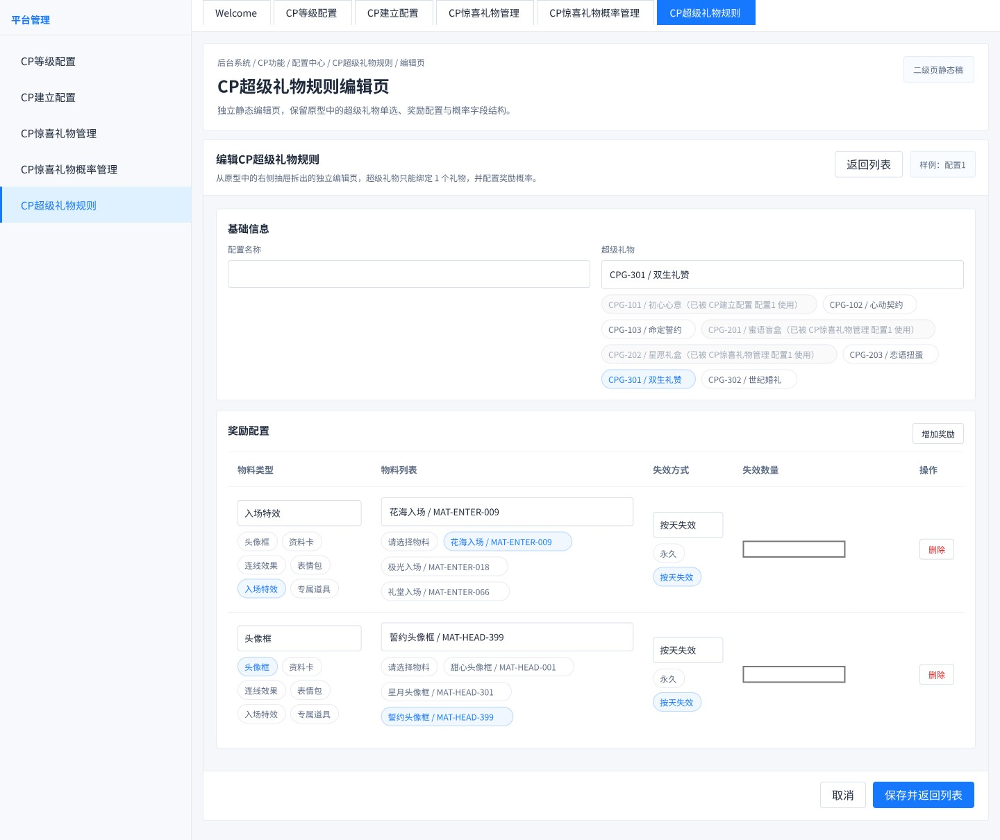


##### 图下需求拆解：CP超级礼物规则编辑页

**功能说明：** CP 超级礼物规则编辑页，运营可维护等级门槛、礼物条件、动效资源和频控策略。

**前置条件：**

| 条件项 | 说明 |
|---|---|
| 运营已登录后台 | 后台权限校验通过 |
| 编辑对象存在 | 新增或编辑已有配置 |

**字段与数据来源：**

| 字段 | 说明 | 类型 | 必填 |
|---|---|---|---|
| 等级门槛 | 最低 CP 等级 | 数字 | 是 |
| 礼物条件 | 触发全服特效的礼物 | 下拉选择 | 是 |
| 播放范围 | 全服/房间/私聊 | 多选 | 是 |
| 频控策略 | 播放频率限制 | 配置 | 是 |
| 动效资源 | 全服特效动画资源 | 文件 | 是 |
| 规则状态 | 启用/停用 | 开关 | 是 |

**关键交互：** 保存时校验礼物、等级、资源和播放范围配置完整。

**系统后台核心逻辑：** 保存前校验必填项和资源有效性；配置变更只影响后续送礼。

**异常与测试关注点：** 覆盖新增、编辑、保存失败、停用、重新启用、资源缺失。


### 6.1 配置列表

#### 功能说明

展示所有超级礼物配置，每个配置绑定一个超级礼物。

#### 字段定义

| 字段名 | 说明 | 数据来源 |
|---|---|---|
| 序号 | 自增序号 | - |
| 配置名称 | 配置标识 | 后台配置 |
| 礼物编号 | 超级礼物编号 | 后台配置 |
| 礼物名称 | 礼物显示名称 | 关联查询 |
| 价格 | 金币价值 | 关联查询 |
| 奖励数量 | 奖励项数 | 统计计算 |
| 奖励摘要 | 奖励内容简述 | 后台配置 |
| 配置状态 | 待发布/已生效 | 状态字段 |
| 操作 | 编辑/删除 | - |

---

### 6.2 配置编辑

#### 功能说明

编辑超级礼物配置的奖励。

#### 字段定义

**基础信息：**

| 字段名 | 说明 | 校验规则 |
|---|---|---|
| 配置名称 | 配置标识 | 必填 |
| 超级礼物 | 单选高级礼物 | 必填 |

**奖励配置：**

| 字段名 | 说明 | 校验规则 |
|---|---|---|
| 奖励类型 | 资源类型 | 必填 |
| 奖励资源编号 | 资源库编号 | 必填，资源必须有效 |
| 失效方式 | 永久/按天 | 必填 |

> **权益保留规则：** 按 8.2「CP等级配置管理」中的统一权益保留规则执行。
| 失效值 | 天数 | 按天时必填 |

#### 系统后台逻辑

| 触发时机 | 执行逻辑 |
|---|---|
| 送礼时 | 命中超级礼物规则 → 发放奖励 → 触发广播 |

#### 校验规则

| 规则 | 说明 |
|---|---|---|
| 礼物不可复用 | 同一礼物不可绑定多个配置 |
| 奖励必须有效 | 奖励资源必须存在 |

---

## 7. 发布机制

### 状态定义

| 状态 | 说明 | 可操作 |
|---|---|---|
| 待发布 | 草稿状态，未生效 | 编辑、删除、发布 |
| 已生效 | 已发布，系统后台使用 | 编辑（另存草稿）、下线 |

### 发布流程

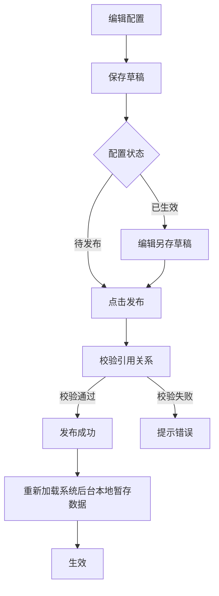
```mermaid
flowchart TD
    A[编辑配置] --> B[保存草稿]
    B --> C{配置状态}
    C -->|待发布| D[点击发布]
    D --> E[校验引用关系]
    E -->|校验通过| F[发布成功]
    E -->|校验失败| G[提示错误]
    F --> H[重新加载系统后台本地暂存数据]
    H --> I[生效]
    C -->|已生效| J[编辑另存草稿]
    J --> D
```

### 发布校验

| 校验项 | 说明 |
|---|---|
| 引用关系有效 | 所有关联的礼物、特效、奖励资源必须存在 |
| 概率规则合法 | 概率总和=100% |
| 奖励资源存在 | 奖励资源编号在资源库中存在 |
| 礼物未被其他配置使用 | 礼物不可跨模块复用 |


### 配置生效边界规则

| 场景 | 规则 |
|---|---|
| 新建CP关系 | 使用发布时刻的最新配置 |
| 已绑定CP等级 | **不受新配置影响**，继续使用绑定时的等级表，除非用户手动解绑后重新绑定 |
| 已绑定CP奖励 | 按绑定时的等级配置快照发放，新配置不影响已有奖励 |
| 等级阈值修改 | 仅影响新绑定关系，已绑定关系等级不自动重新计算 |
| 奖励配置修改 | 仅影响新达标等级，已发放奖励不追溯 |

> **设计原则：** CP关系建立时的配置版本决定后续等级与奖励，避免"半夜改配置导致用户等级跳变"争议。

### 删除规则

| 规则 | 说明 |
|---|---|
| 待发布状态可删除 | 未生效配置可删除 |
| 已生效状态不可删除 | 只能下线，不可删除 |
| 被引用配置不可删除 | 其他配置引用时不可删除 |

---

## 8. CP数据分析模块

#### 模块背景

后台数据分析看板，用于运营监控CP系统表现。

### 8.1 数据总览（核心看板）

#### 核心指标

| 指标 | 定义 | 计算方式 |
|---|---|---|
| CP建立数 | 当前绑定状态的CP数量 | 统计当前处于已绑定状态的CP关系数量 |
| CP建立转化率 | 邀请 → 建立的转化率 | 建立数 / 发起邀请数 |
| CP用户数 | 至少有一个CP关系的用户数 | 去重统计 |
| CP用户占比 | CP用户占全部用户比例 | CP用户数 / 总用户数 |

#### 收入指标

| 指标 | 定义 | 计算方式 |
|---|---|---|
| CP总收入 | CP礼物产生的金币收入 | 汇总CP关系内产生的礼物金币收入 |
| 惊喜礼物收入 | 惊喜礼物产生的收入 | 汇总惊喜礼物产生的金币收入 |
| 超级礼物收入 | 超级礼物产生的收入 | 汇总超级礼物产生的金币收入 |
| CP收入占比 | CP收入占总收入比例 | CP总收入 / 平台总收入 |

#### 用户价值

| 指标 | 定义 | 计算方式 |
|---|---|---|
| CP用户ARPU | CP用户平均收入 | CP总收入 / 去重CP用户数 |
| CP用户ARPPU | CP付费用户平均收入 | CP总收入 / 付费CP用户数 |
| 非CP用户ARPU | 对比指标 | 非CP用户收入 / 非CP用户数 |

---

### 8.2 转化漏斗分析

#### 行为漏斗

| 漏斗节点 | 定义 |
|---|---|
| CP入口曝光人数 | 看到CP入口的用户数 |
| 点击邀请人数 | 点击发起邀请的用户数 |
| 发起邀请人数 | 实际发起邀请的用户数 |
| 接受邀请人数 | 接受邀请的用户数 |
| 成功建立CP人数 | 建立CP关系的用户数 |

#### 转化率

| 转化率 | 计算 |
|---|---|
| 曝光 → 点击转化率 | 点击人数 / 曝光人数 |
| 点击 → 发起转化率 | 发起人数 / 点击人数 |
| 发起 → 接受转化率 | 接受人数 / 发起人数 |
| 接受 → 建立转化率 | 建立人数 / 接受人数 |

#### 分维度分析

| 维度 | 说明 |
|---|---|
| 用户类型 | 新用户 / 老用户 / 大R |
| 国家/地区 | 中东重点区域 |
| 入口类型 | 房间 / 私聊 |

---

### 8.3 收入分析

#### 收入趋势

| 指标 | 说明 |
|---|---|
| CP礼物收入趋势 | 日/周趋势图 |
| 惊喜礼物收入趋势 | 日/周趋势图 |
| 超级礼物收入趋势 | 日/周趋势图 |

#### 收入结构

| 指标 | 计算 |
|---|---|
| CP礼物收入占比 | CP礼物收入 / CP总收入 |
| 惊喜礼物占比 | 惊喜礼物收入 / CP总收入 |
| 超级礼物占比 | 超级礼物收入 / CP总收入 |

#### 收入明细

| 维度 | 字段 |
|---|---|
| 按礼物维度 | 礼物名称、收入、占比 |
| 按用户维度 | 用户编号、消费金额、消费次数 |

---

### 8.4 礼物效果分析（核心商业模块）

#### 惊喜礼物分析

| 指标 | 定义 |
|---|---|
| 触发次数 | 惊喜礼物赠送次数 |
| 命中次数 | 触发奖励的次数 |
| 命中率（各档位） | 普通档/稀有档/大奖档命中率 |
| 平均奖励价值 | 奖励价值 / 命中次数 |
| 投入产出比 | 奖励价值 / 消耗金币 |

#### 概率分布验证

| 指标 | 说明 |
|---|---|
| 实际命中分布 对比 配置概率 | 对比分析 |
| 偏差率 | 实际概率与配置概率的偏差 |
| 异常波动检测 | 偏差超过阈值时告警 |

#### 超级礼物分析

| 指标 | 定义 |
|---|---|
| 触发次数 | 超级礼物赠送次数 |
| 连送次数 | 连续赠送次数 |
| 连送率 | 连送次数 / 触发次数 |
| 复购率 | 重复赠送用户占比 |
| 单用户最高消费 | 最高消费金额 |
| 单次最高消费记录 | 单次赠送最高金额 |

---

### 8.5 用户行为分析

#### 送礼行为

| 指标 | 定义 |
|---|---|
| 人均送礼次数 | 送礼总次数 / 送礼用户数 |
| 人均送礼金额 | 送礼总金额 / 送礼用户数 |
| 连续送礼率 | 连续送礼用户占比 |
| 礼物偏好分布 | 不同礼物使用频次 |

#### CP用户行为

| 指标 | 定义 |
|---|---|
| CP用户活跃率 | 活跃CP用户 / CP用户总数 |
| CP用户留存率 | 1日/7日/30日留存 |
| CP用户平均生命周期 | CP关系平均持续时长 |
| CP用户平均互动次数 | 平均送礼/互动次数 |

#### 用户分层分析

| 层级 | 分析指标 |
|---|---|
| 新用户 | 转化率、付费表现 |
| 老用户 | 留存率、消费频次 |
| 大R用户 | 消费金额、礼物偏好 |

---

### 8.6 亲密度与等级分析

#### 等级分布

| 指标 | 定义 |
|---|---|
| 各等级用户数量 | 等级1~等级指定数量各等级用户数 |
| 高等级用户占比 | 等级5+用户占比 |

#### 成长分析

| 指标 | 定义 |
|---|---|
| 平均升级时间 | 各等级平均升级时长 |
| 各等级流失率 | 各等级用户流失比例 |
| 等级跃迁路径 | 用户等级变化路径分析 |

#### 亲密度分析

| 指标 | 定义 |
|---|---|
| 人均亲密度 | 平均亲密度值 |
| 亲密度增长趋势 | 日/周趋势 |
| 亲密度来源占比 | 普通礼物/CP礼物/超级礼物占比 |

---

### 8.7 关系生命周期分析

#### 生命周期指标

| 指标 | 定义 |
|---|---|
| 平均CP持续时长 | CP关系平均存活时间 |
| 7日留存 | 建立后7天仍绑定的比例 |
| 30日留存 | 建立后30天仍绑定的比例 |
| 长周期关系占比 | 持续超过30天的CP比例 |

#### 关系状态变化

| 指标 | 定义 |
|---|---|
| 新增CP数 | 每日新建CP数量 |
| 解绑CP数 | 每日解除CP数量 |
| 活跃CP数 | 有互动的CP数量 |

#### 关系质量分析

| 指标 | 定义 |
|---|---|
| 高互动CP占比 | 互动频次超过阈值的CP占比 |
| 高频送礼CP占比 | 送礼频次超过阈值的CP占比 |
| 高价值CP占比 | 累计消费超过阈值的CP占比 |

---

### 8.8 CP明细数据

#### 筛选条件

| 筛选项 | 说明 |
|---|---|
| 时间范围 | 开始时间-结束时间 |
| 用户编号 | 支持单用户查询 |
| CP关系编号 | 支持单CP查询 |
| 礼物类型 | 普通/惊喜/超级 |

#### CP结成记录

| 字段 | 说明 |
|---|---|
| CP关系编号 | 当前CP关系唯一记录 |
| 发起方用户编号 | 发起组建CP的一方 |
| 接收方用户编号 | 接收CP邀请的一方 |
| 建立时间 | 创建时间 |
| 建立方式 | 礼物/邀请 |
| 建立礼物编号 | 用于组建CP的礼物 |
| 当前状态 | 已绑定/已解绑 |

#### 惊喜礼物中奖记录

| 字段 | 说明 |
|---|---|
| 记录编号 | 当前明细唯一记录 |
| 送礼用户编号 | 发起送礼的一方 |
| 收礼用户编号 | 收到礼物的一方 |
| CP关系编号 | 当前CP关系唯一记录 |
| 礼物名称 | 用户看到的礼物名称 |
| 消耗金币 | 本次送礼消耗的金币数量 |
| 奖励档位 | 奖励_等级（普通/稀有/大奖） |
| 奖励内容 | 奖励_item |
| 奖励数量 | 奖励_amount |
| 时间 | 创建时间 |

#### 超级礼物触发记录

| 字段 | 说明 |
|---|---|
| 记录编号 | 当前明细唯一记录 |
| 送礼用户编号 | 发起送礼的一方 |
| 收礼用户编号 | 收到礼物的一方 |
| CP关系编号 | 当前CP关系唯一记录 |
| 礼物名称 | 用户看到的礼物名称 |
| 消耗金币 | 本次送礼消耗的金币数量 |
| 是否触发奖励 | 本次送礼是否获得奖励 |
| 奖励内容 | 奖励_item |
| 时间 | 创建时间 |

---

### 8.9 数据维度切片

| 维度 | 说明 |
|---|---|
| 时间维度 | 日/周/月 |
| 用户维度 | 新用户/老用户/大R |
| 国家/地区 | 中东重点区域 |
| 礼物类型 | 普通/惊喜/超级 |
| CP等级 | 等级1~等级指定数量 |

---

### 8.10 关键统一规则

| 规则 | 说明 |
|---|---|
| 收入归属规则 | 所有金币消耗只归属送礼方 |
| 用户查询规则 | 当前用户为送礼方或收礼方 |
| 统计基于明细表 | 禁止直接使用汇总本地暂存数据，必须从礼物明细和CP关系记录聚合 |
| 时间优先级 | 明细使用送礼时间，CP使用创建时间/解除时间 |


## 三、附录

### 附录A：原型图映射表

| 序号 | 原型图文件名 | 对应功能模块 | 对应功能点 |
|---|---|---|---|
| 1 | CP主页.jpg | CP主页模块 | CP主页入口 |
| 2 | CP主页_已绑定.jpg | CP主页模块 | CP主页入口 |
| 3 | 已绑定CP_CP主页.jpg | CP主页模块 | CP主页状态展示 |
| 4 | 未绑定CP_CP主页.jpg | CP主页模块 | CP主页状态展示 |
| 5 | CP主页导航.jpg | CP主页模块 | CP主页入口 |
| 6 | CP亲密度展示.jpg | CP主页模块 | CP亲密度展示 |
| 7 | CP亲密度记录.jpg | CP主页模块 | CP亲密度变动记录 |
| 8 | CP亲密度变动记录.jpg | CP主页模块 | CP亲密度变动记录 |
| 9 | CP维护记录.jpg | CP主页模块 | CP维护记录 |
| 10 | 邀请CP弹窗.jpg | CP邀请模块 | CP邀请发起入口 |
| 11 | 邀请者视角_邀请CP弹窗.jpg | CP邀请模块 | CP邀请发起入口 |
| 12 | CP邀请弹窗_邀请者视角.jpg | CP邀请模块 | CP邀请发起入口 |
| 13 | CP邀请弹窗_被邀请者视角.jpg | CP邀请模块 | CP邀请发起入口 |
| 14 | CP邀请函_被邀请者视角.jpg | CP邀请模块 | CP邀请接受 |
| 15 | CP邀请函_邀请者视角.jpg | CP邀请模块 | CP邀请接受 |
| 16 | CP邀请接受弹窗_被邀请者视角.jpg | CP邀请模块 | CP邀请接受 |
| 17 | 被邀请者视角_CP邀请信函.jpg | CP邀请模块 | 消息通知-邀请通知 |
| 18 | CP邀请拒绝弹窗_被邀请者视角.jpg | CP邀请模块 | CP邀请拒绝 |
| 19 | CP邀请拒绝弹窗_邀请者视角.jpg | CP邀请模块 | CP邀请拒绝 |
| 20 | CP邀请列表.jpg | CP邀请模块 | CP邀请列表 |
| 21 | 被邀请者视角_CP邀请列表.jpg | CP邀请模块 | CP邀请列表 |
| 22 | CP邀请详情.jpg | CP邀请模块 | CP邀请详情 |
| 23 | 被邀请者视角_CP邀请详情.jpg | CP邀请模块 | CP邀请详情 |
| 24 | 礼物面板_CP玩法入口.jpg | CP邀请模块 | CP邀请发起入口 |
| 25 | 礼物面板_CP玩法入口_2.jpg | CP邀请模块 | CP邀请发起入口 |
| 26 | 系统提示组建CP_邀请者视角.jpg | CP邀请模块 | CP邀请发起入口 |
| 27 | 邀请者视角_系统主动提示组建CP.jpg | CP邀请模块 | CP邀请发起入口 |
| 28 | 邀请者视角_房间内绑定CP.jpg | CP邀请模块 | CP邀请接受 |
| 29 | CP邀请通知卡片.jpg | 消息通知模块 | CP邀请通知卡片 |
| 30 | CP升级通知.jpg | 消息通知模块 | CP升级通知 |
| 31 | CP解体通知.jpg | 消息通知模块 | CP解体通知 |
| 32 | 礼物面板_CP礼物分类.jpg | CP礼物模块 | CP礼物赠送入口 |
| 33 | 礼物面板_赠送CP礼物.jpg | CP礼物模块 | CP礼物赠送入口 |
| 34 | CP礼物记录.jpg | CP礼物模块 | CP礼物记录 |
| 35 | CP礼物记录列表.jpg | CP礼物模块 | CP礼物记录 |
| 36 | CP礼物特效.jpg | CP礼物模块 | CP礼物特效 |
| 37 | CP礼物奖励被邀请者视角.jpg | CP礼物奖励模块 | CP礼物奖励弹窗 |
| 38 | CP礼物奖励邀请者视角.jpg | CP礼物奖励模块 | CP礼物奖励弹窗 |
| 39 | CP礼物领取弹窗.jpg | CP礼物奖励模块 | CP礼物奖励弹窗 |
| 40 | 该CP礼物可加亲密度.jpg | CP礼物奖励模块 | CP礼物亲密度提示 |
| 41 | 增加CP专属礼物.jpg | CP表情与专属礼物 | CP专属礼物 |
| 42 | 增加CP表情.jpg | CP表情与专属礼物 | CP专属表情 |
| 43 | CP等级体系.jpg | CP等级模块 | CP等级详情页 |
| 44 | CP等级详情.jpg | CP等级模块 | CP等级详情页 |
| 45 | CP等级详情页.jpg | CP等级模块 | CP等级详情页 |
| 46 | CP等级权益.jpg | CP等级模块 | CP等级权益展示 |
| 47 | CP等级特权列表.jpg | CP等级模块 | CP等级特权 |
| 48 | CP升级触发奖励弹窗.jpg | CP等级模块 | CP升级奖励弹窗 |
| 49 | CP榜单.jpg | CP榜单模块 | CP榜单列表 |
| 50 | CP榜单列表.jpg | CP榜单模块 | CP榜单列表 |
| 51 | CP榜单_我的排名.jpg | CP榜单模块 | 我的排名 |
| 52 | CP说明.jpg | CP入口与展示模块 | CP功能说明页 |
| 53 | 个人主页.jpg | CP入口与展示模块 | 个人主页CP入口 |
| 54 | 个人主页_私聊跳转.jpg | CP入口与展示模块 | 个人主页CP入口 |
| 55 | 全屏资料页_绑定CP.jpg | CP入口与展示模块 | 用户资料卡CP入口 |
| 56 | 全屏资料页_绑定CP入口.jpg | CP入口与展示模块 | 用户资料卡CP入口 |
| 57 | 半屏资料页.jpg | CP入口与展示模块 | 用户资料卡CP入口 |
| 58 | 非资料页_绑定CP入口.jpg | CP入口与展示模块 | 用户资料卡CP入口 |
| 59 | 用户资料卡_已绑定CP.jpg | CP入口与展示模块 | 用户资料卡CP入口 |
| 60 | 私聊页面_CP信息展开_对方照片.jpg | CP入口与展示模块 | 私聊页CP信息展示 |
| 61 | 私聊页面_CP信息隐藏_对方照片.jpg | CP入口与展示模块 | 私聊页CP信息展示 |
| 62 | 私聊页面_收到CP消息.jpg | CP入口与展示模块 | 私聊页CP信息展示 |
| 63 | 房间_CP组全服特效.jpg | CP入口与展示模块 | 房间内CP展示 |
| 64 | CP组全服特效_礼物面板.jpg | CP礼物奖励模块 | CP全服礼物特效 |
| 65 | 赠送超级礼物全服特效_礼物面板.jpg | CP礼物奖励模块 | CP全服礼物特效 |
| 66 | 赠送超级礼物全服特效动画.jpg | CP礼物奖励模块 | CP全服礼物特效 |
| 67 | 解除关系确认弹窗.jpg | CP解除模块 | 解除关系确认 |
| 68 | 解除失败提示页.jpg | CP解除模块 | 解除失败提示 |
| 69 | 设置.jpg | CP设置模块 | CP设置入口 |
| 70 | 设置_自动拒绝CP邀请.jpg | CP设置模块 | 自动拒绝CP邀请 |

### 附录B：配置项清单

| 配置项 | 说明 | 默认值 | 所属模块 | 生效边界 |
|---|---|---|---|---|
| 邀请有效期 | CP邀请发出后允许对方处理的时间 | 24小时 | CP邀请模块 | 只影响新发出的邀请，已经发出的邀请不追溯改变 |
| CP礼物亲密度加成倍率 | 赠送CP专属礼物时亲密度增长倍率 | 1.5 | CP礼物模块 | 新产生的送礼记录按当前配置计算 |
| 维护提醒触发天数 | 连续未互动达到该天数后提醒用户维护关系 | 7天 | 消息通知模块 | 只影响新触发的提醒 |
| 单方解除确认等待时间 | 发起解除后等待对方确认或自动生效的时间 | 24小时 | CP解除模块 | 只影响新发起的解除申请 |
| 榜单更新间隔 | 榜单数据重新计算的间隔 | 60分钟 | CP榜单模块 | 新一轮榜单计算时生效 |
| 榜单奖励名次范围 | 可获得榜单奖励的名次范围 | 前3/前10/前20 | CP榜单模块 | 按榜单周期结算时使用 |
| 每日同对象邀请上限 | 同一用户每天可向同一对象发起CP邀请的次数 | 3次 | 安全风控 | 按东三区自然日统计 |
| 解除后冷却期 | 用户解除CP后再次组建CP前的限制时间 | 7天 | 安全风控 | 从解除成功时间开始计算 |
| 是否开启亲密度衰减 | 控制长期不互动是否扣减亲密度 | 开启 | 衰减机制 | 关闭后不再产生新的衰减 |
| 每日衰减比例 | 满足衰减条件后每天扣减的比例 | 1% | 衰减机制 | 每次衰减计算时读取当前配置 |
| 衰减下限 | 亲密度最低可被扣减到的数值 | 0 | 衰减机制 | 不允许扣成负数 |

### 附录C：业务数据口径

#### CP邀请记录

| 信息项 | 说明 | 读写规则 | 测试关注点 |
|---|---|---|---|
| 邀请记录编号 | 每一次CP邀请的唯一记录 | 发起邀请成功后生成 | 重复点击发起邀请不能生成多条有效记录 |
| 邀请者用户编号 | 发出邀请的用户 | 发起时写入，不允许后续修改 | 邀请者退出页面后记录仍存在 |
| 被邀请者用户编号 | 接收邀请的用户 | 发起时写入，不允许后续修改 | 被邀请者已绑定CP时必须拦截 |
| 组建礼物编号 | 本次邀请使用的组建礼物 | 发起时写入 | 礼物下架或失效时不能继续发起 |
| 礼物数量 | 本次邀请消耗的礼物数量 | 发起时写入 | 数量异常时必须拦截 |
| 金币价值 | 本次邀请对应的金币消耗 | 发起时按礼物价格计算 | 余额不足时不能生成邀请 |
| 邀请状态 | 待处理、已接受、已拒绝、已过期、已取消 | 每次状态变化只允许从当前有效状态流转 | 已过期邀请不能再接受；已拒绝邀请不能再接受 |
| 过期时间 | 邀请自动失效时间 | 发起时按邀请有效期计算 | 配置变更不影响已发邀请 |
| 创建时间 | 邀请生成时间 | 发起成功时写入 | 用于排序和有效期判断 |
| 更新时间 | 最近一次状态变化时间 | 状态变化时更新 | 列表和详情页展示一致 |

#### CP关系记录

| 信息项 | 说明 | 读写规则 | 测试关注点 |
|---|---|---|---|
| CP关系编号 | 一段CP关系的唯一记录 | 邀请被接受后生成 | 同一用户同一时间只能有一个有效关系 |
| 关系双方 | 绑定CP的两个用户 | 建立关系时写入，不区分主从 | 两端主页展示必须一致 |
| 累计亲密度 | 当前CP关系累计获得的亲密度 | 送礼、维护、衰减等动作后更新 | 多端同时送礼时不能丢失累计值 |
| 当前等级 | 根据亲密度和财富值计算出的等级 | 亲密度或配置变化后重新判断 | 等级变化后权益和页面标签同步更新 |
| 绑定时间 | CP关系正式建立的时间 | 接受邀请成功时写入 | 在一起时长按该时间计算 |
| 关系状态 | 已绑定、已解除 | 解除成功后改变状态 | 解除后双方入口、礼物、权益全部失效 |
| 解除时间 | 关系解除成功时间 | 解除成功时写入 | 解除后历史记录可查，当前关系不可用 |

#### 亲密度变动记录

| 信息项 | 说明 | 读写规则 | 测试关注点 |
|---|---|---|---|
| 变动记录编号 | 每次亲密度变化的唯一记录 | 发生亲密度变化时生成 | 送礼成功必须有对应变动记录 |
| CP关系编号 | 本次变动所属关系 | 写入当前有效关系 | 关系已解除后不能新增亲密度 |
| 操作用户编号 | 触发变动的用户 | 由送礼、维护或系统规则产生 | 系统衰减时允许没有具体操作人 |
| 变动类型 | 送礼、维护、绑定、系统调整、衰减 | 按真实来源写入 | 不同类型要能被后台筛选 |
| 变动值 | 本次增加或扣减的亲密度 | 增长为正数，衰减为负数 | 不允许把总亲密度扣成负数 |
| 变动后总额 | 本次变化完成后的亲密度总额 | 每次变化后写入 | 与CP主页展示一致 |
| 关联来源 | 对应礼物、邀请或系统操作记录 | 有来源时必须可追溯 | 后台查看明细能定位来源 |
| 记录时间 | 本次变化发生时间 | 变化完成时写入 | 榜单和流水按该时间统计 |

#### CP等级配置

| 信息项 | 说明 | 读写规则 | 测试关注点 |
|---|---|---|---|
| 等级编号 | 等级配置的唯一标识 | 后台配置生成 | 不同等级不能重复 |
| 等级数字 | 用户看到的CP等级 | 后台配置 | 等级顺序必须连续 |
| 等级名称 | 等级展示名称 | 后台配置 | 用户端、后台展示一致 |
| 等级图标 | 等级徽章素材地址 | 后台配置 | 素材失效时页面要有兜底展示 |
| 升级所需亲密度 | 达到该等级所需最低亲密度 | 后台配置 | 阈值不能倒挂 |
| 配置创建时间 | 等级配置生成时间 | 后台保存时写入 | 用于追溯配置版本 |

#### CP等级权益配置

| 信息项 | 说明 | 读写规则 | 测试关注点 |
|---|---|---|---|
| 权益记录编号 | 每条权益配置的唯一记录 | 后台配置生成 | 同一等级同一权益不可重复 |
| 所属等级 | 该权益从哪个等级开始可用 | 后台配置 | 等级不足时入口不可用 |
| 权益编号 | 对应装扮、表情、礼物等权益资源 | 后台配置 | 权益资源下架后要有处理策略 |
| 权益名称 | 用户看到的权益名称 | 后台配置 | 与用户端展示一致 |
| 权益图标 | 权益展示图标 | 后台配置 | 素材加载失败要有默认图 |
| 权益描述 | 权益使用说明 | 后台配置 | 不出现无法实现的承诺文案 |

#### CP解除申请记录

| 信息项 | 说明 | 读写规则 | 测试关注点 |
|---|---|---|---|
| 解除记录编号 | 每次解除申请的唯一记录 | 发起解除时生成 | 同一关系不能同时存在多条有效解除申请 |
| CP关系编号 | 要解除的CP关系 | 发起时写入 | 关系已解除时不能重复发起 |
| 发起者用户编号 | 发起解除的一方 | 发起时写入 | 发起者本人能看到解除进度 |
| 确认者用户编号 | 需要确认解除的一方 | 发起时写入 | 确认者能收到提示 |
| 解除状态 | 待确认、已确认、自动确认 | 根据用户确认或等待时间变化 | 自动确认时间到后关系必须解除 |
| 自动生效时间 | 未确认时自动解除的时间 | 发起解除时计算 | 修改等待时长不影响已发起申请 |
| 创建时间 | 解除申请生成时间 | 发起成功时写入 | 用于倒计时展示 |
| 更新时间 | 最近一次状态变化时间 | 状态变化时更新 | 详情页和通知状态一致 |

### 附录D：行为统计方案

| 统计事件 | 触发时机 | 记录内容 | 用途 |
|---|---|---|---|
| 发起CP邀请 | 用户成功发起CP邀请 | 邀请者、被邀请者、组建礼物、金币消耗 | 分析邀请转化和骚扰风险 |
| 接受CP邀请 | 被邀请者接受邀请并建立关系 | 邀请记录、双方用户、建立时间 | 分析邀请成功率 |
| 拒绝CP邀请 | 被邀请者拒绝邀请 | 邀请记录、双方用户、拒绝时间 | 分析拒绝原因和邀请质量 |
| 邀请过期 | 邀请超过有效期未处理 | 邀请记录、过期时间 | 分析邀请处理效率 |
| 赠送CP礼物 | 用户在CP关系内成功送礼 | 送礼方、收礼方、礼物、金币消耗、亲密度增长 | 分析CP礼物收入和亲密度增长 |
| CP等级提升 | CP关系等级提升 | 双方用户、原等级、新等级 | 分析等级成长和权益触达 |
| 发起解除关系 | 用户发起解除CP关系 | CP关系、发起者、发起时间 | 分析解除原因和关系生命周期 |
| 确认解除关系 | 用户确认解除或系统自动解除 | CP关系、解除方式、解除时间 | 分析关系流失 |
| 查看CP榜单 | 用户进入CP榜单页 | 榜单类型、用户当前名次 | 分析榜单访问和竞争活跃度 |
| 查看CP主页 | 用户进入CP主页 | 是否已绑定、亲密度、等级 | 分析CP入口访问和状态分布 |
| 切换自动拒绝 | 用户开启或关闭自动拒绝CP邀请 | 开关状态、操作时间 | 分析隐私设置使用情况 |
