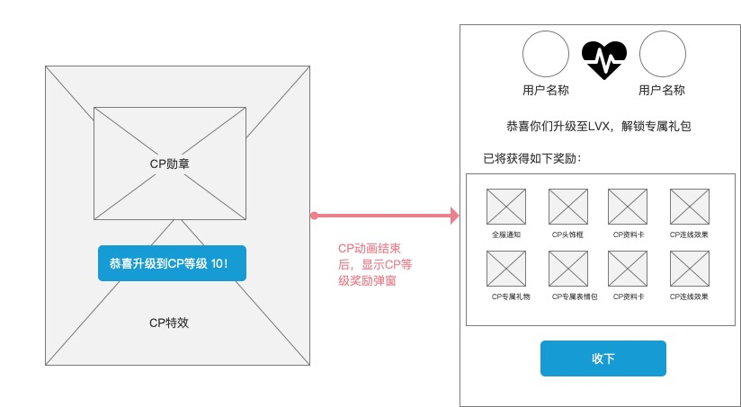
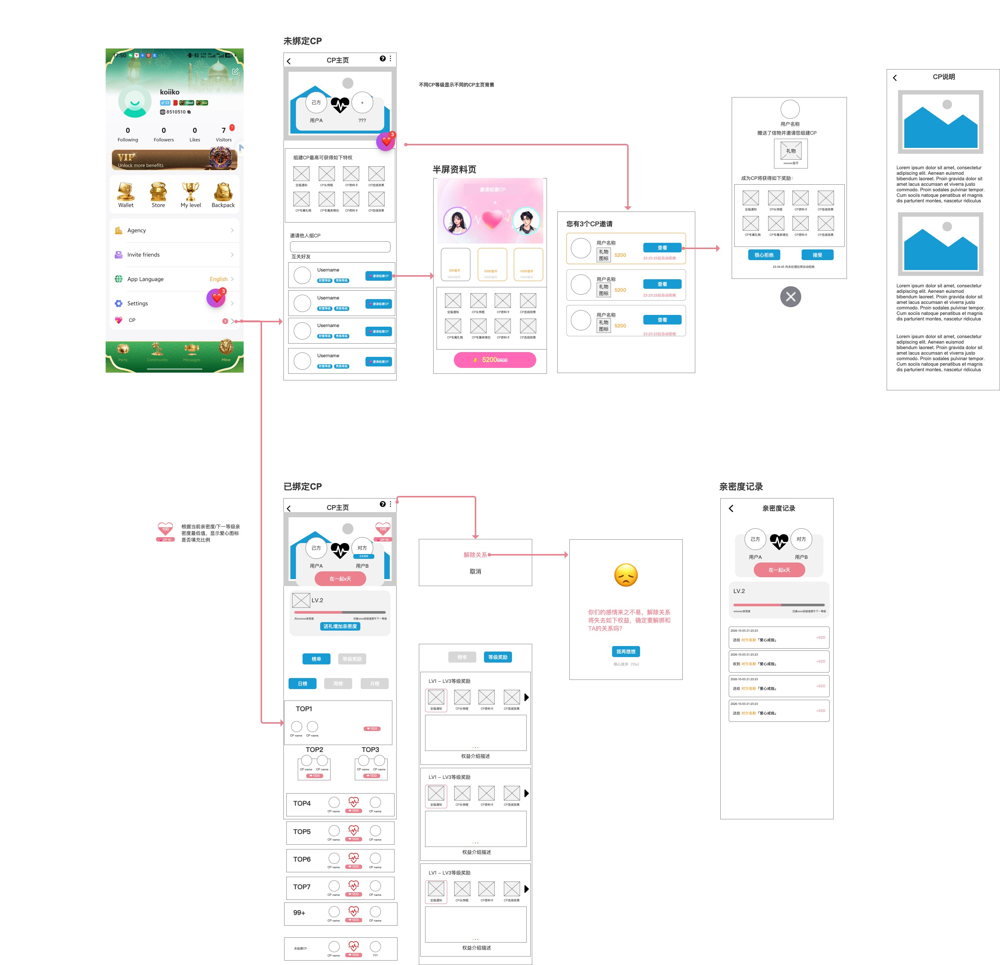
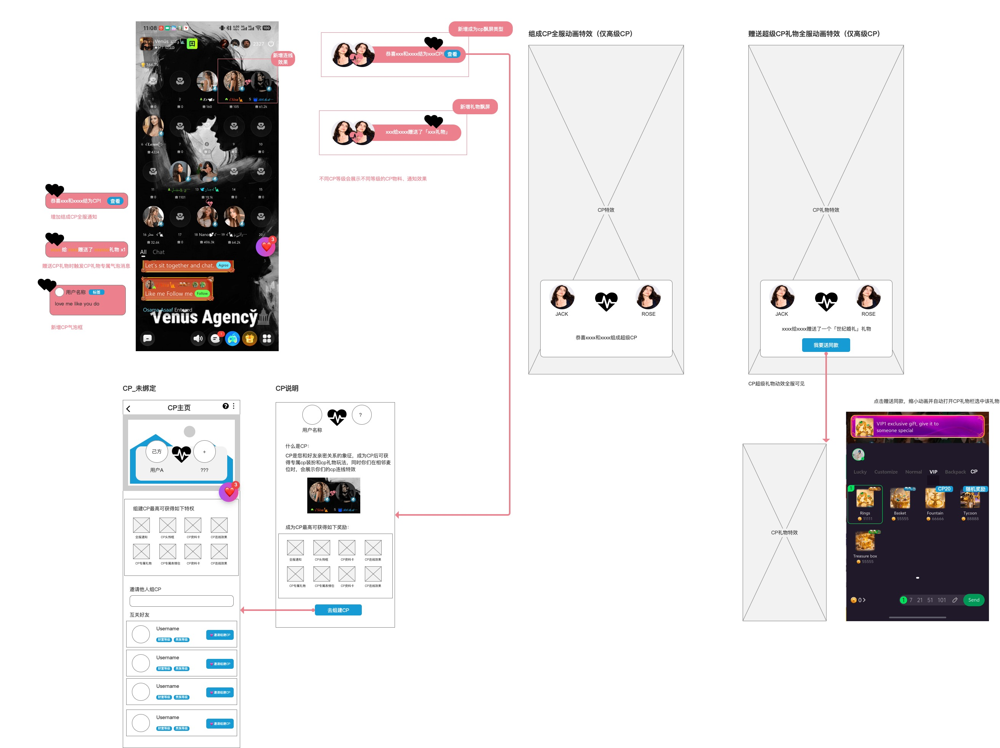
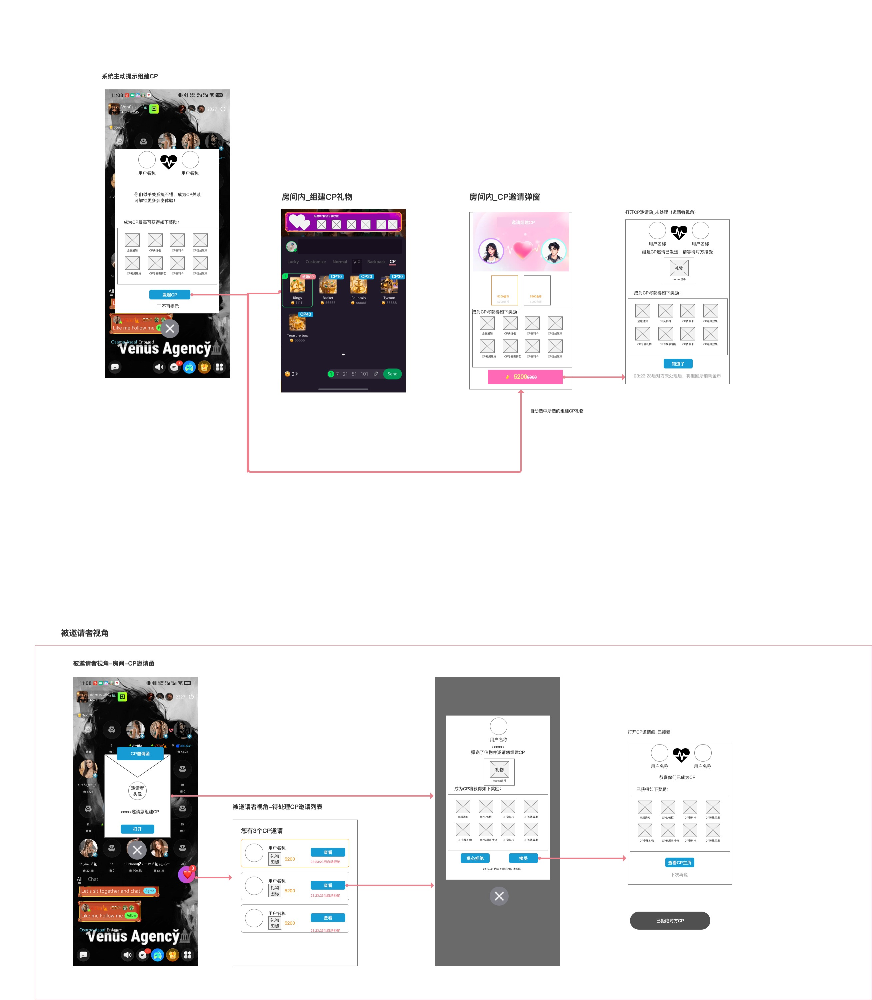
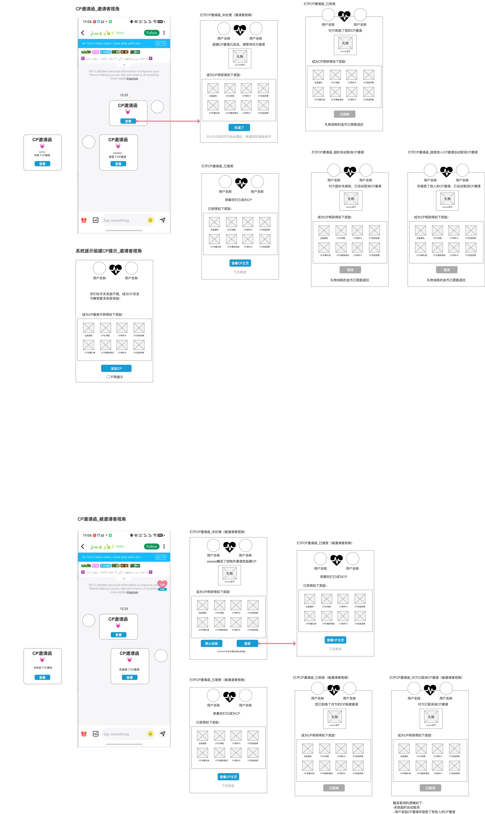
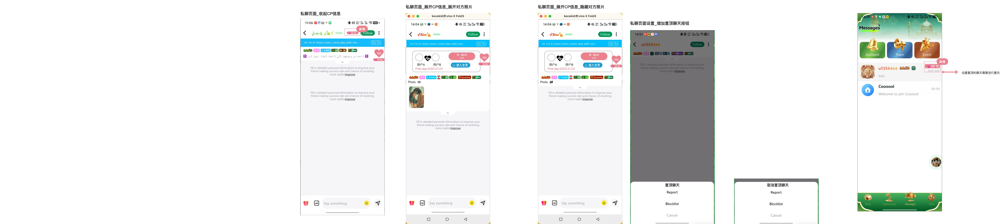
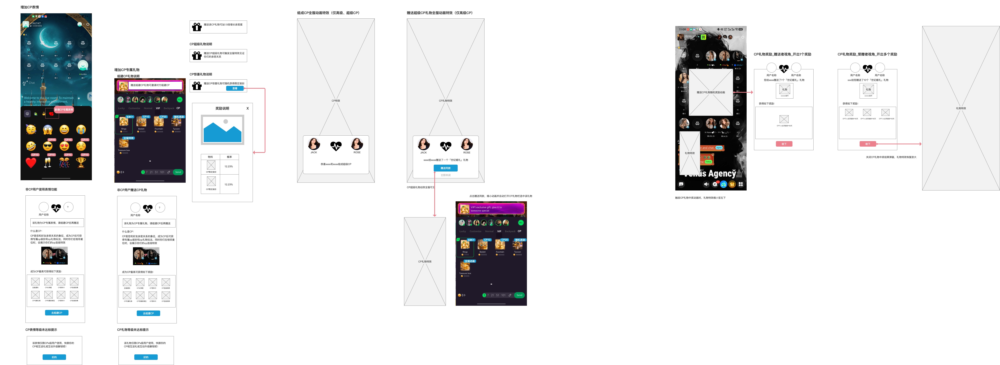
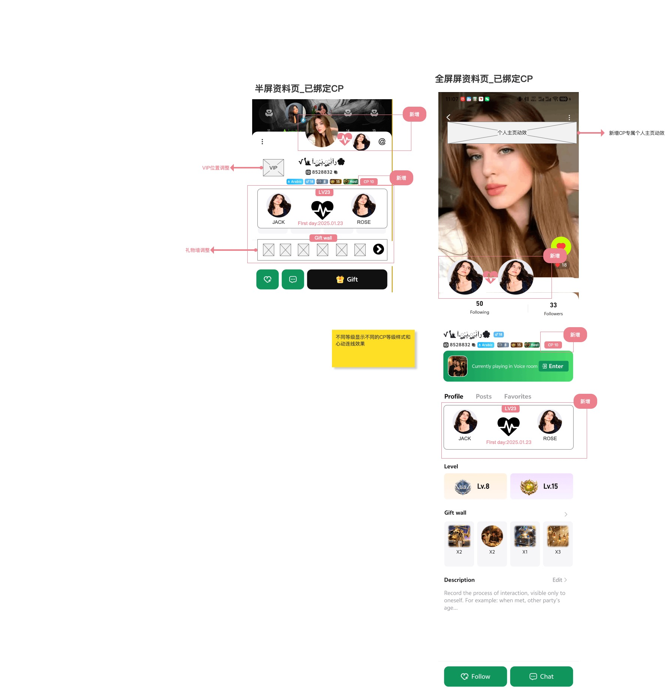
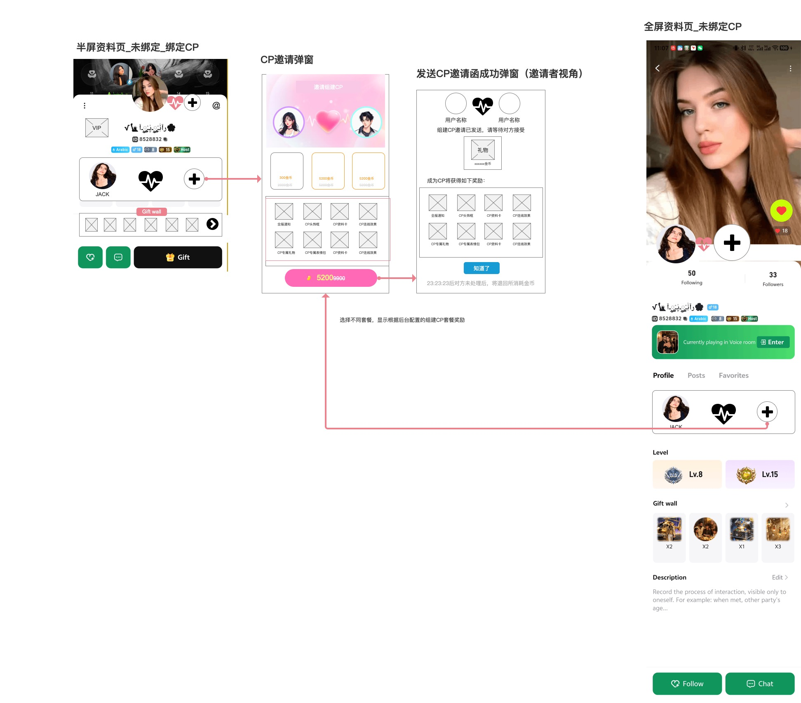
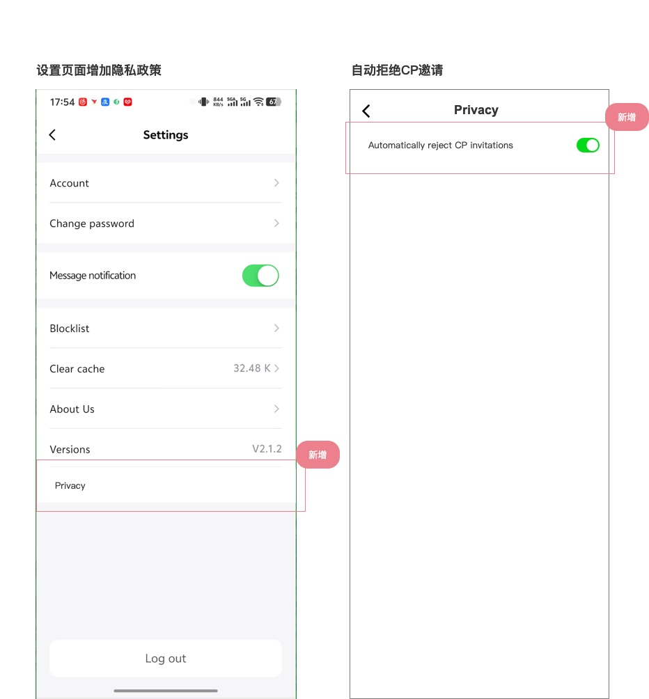

# CP系统产品需求文档

> **版本**：v1.0
> **生成时间**：2026-04-20
> **来源材料**：CP功能结构_最终版本.xmind、CP核心逻辑.xmind、原型图目录

---

## 一、产品背景与目标

### 1.1 产品背景

语聊场景中用户关系缺乏结构化表达，高价值用户需要更多展示与互动空间，礼物消费缺少关系承载场景。

### 1.2 产品目标

| 目标 | 说明 |
|------|------|
| 构建用户关系 | 通过CP绑定建立稳定的社交关系 |
| 提升送礼转化率 | CP关系驱动礼物消费，提升LTV |
| 增强房间互动 | CP连线、广播、特效增强房间氛围 |
| 构建榜单竞争 | 周榜/日榜驱动用户持续投入 |

---

## 二、核心业务模型

### 2.1 核心对象

| 对象 | 说明 |
|------|------|
| User | 用户 |
| CPRelation | CP关系 |
| CPInvite | CP邀请 |
| Intimacy | 亲密度 |

### 2.2 关系定义

- 每个用户同一时间仅允许绑定 **1个CP**
- CP关系为 **双向绑定关系**

### 2.3 货币与换算

| 配置项 | 规则 |
|--------|------|
| 汇率 | 1 USD = 10,000 金币 |
| 普通礼物亲密度 | 1 金币 = 1 亲密度 |
| CP专属礼物亲密度 | 1 金币 = 1.3 亲密度（可配置） |
| 幸运礼物亲密度 | 1 金币 = 0.2 亲密度（折损80%） |

### 2.4 数据分类

| 数据类型 | 是否累计 | 是否衰减 | 用途 |
|----------|----------|----------|------|
| 总亲密度 | 是 | 是 | 等级计算、关系强度展示 |
| 本周贡献值 | 否（周清零） | 否 | 榜单排名 |

---

## 三、业务流程规则

### 3.1 CP邀请流程

#### 发起邀请

**入口**：
- 聊天卡片入口
- 用户资料卡入口
- 系统自动提示弹窗

**前置条件**：
- 用户A ≠ 用户B
- 双方未绑定CP
- 双方未互相拉黑
- 双方均未开启「自动拒绝CP邀请」
- 双方未存在未处理的CP邀请
- 金币余额充足

**前置校验提示**：
- 发起邀请前校验对方状态，若对方已开启「自动拒绝CP邀请」，提示「对方暂时无法接受CP邀请」并阻止发起

**特殊规则**：
- 双方互相发起CP邀请时，后发起方 **自动接受** 对方的CP邀请
- 双向匹配时，后发起方的邀请被系统拦截并自动接受对方邀请，金币不扣除

**邀请执行**：
1. 扣除礼物金币
2. 创建邀请记录
3. 设置邀请有效期（默认24小时，可配置）
4. 推送邀请通知

### 3.2 邀请状态流转

| 状态 | 触发条件 |
|------|----------|
| Pending（待处理） | 邀请已发送，等待对方响应 |
| Accepted（已接受） | 被邀请者点击接受 |
| Rejected（已拒绝） | 被邀请者手动拒绝 / 接受其他CP邀请后自动拒绝 |
| Expired（已过期） | 超过有效期未处理 |

### 3.3 接受邀请

**校验条件**：
- 邀请状态为待处理
- 当前时间未超过有效期
- 双方仍未绑定CP
- **双方均未开启「自动拒绝CP邀请」**（若对方在邀请发送后新开启，接受时需拦截并提示「对方暂时无法接受CP邀请」）

**执行逻辑**：
1. 创建CP关系
2. 初始化亲密度
3. 更新状态为已接受
4. 触发房间广播
5. 自动取消已发送的CP邀请
6. 自动拒绝所有待处理的CP邀请
7. 给发起者增加财富值（1金币=1财富值）
8. 给CP双方增加亲密度（1金币=1.5亲密值）

### 3.4 拒绝邀请

- 更新状态为已拒绝
- 退回发起者金币

### 3.5 超时机制

| 配置项 | 规则 |
|--------|------|
| 默认有效期 | 24小时（可配置） |
| 触发条件 | 当前时间 ≥ 过期时间 |
| 执行逻辑 | 状态变更为已超时，自动退回金币，通知用户 |

---

## 四、邀请系统状态机

### 4.1 用户状态模型

| 状态 | 说明 |
|------|------|
| Idle（空闲态） | 无CP关系，无待处理邀请 |
| Outgoing Pending | 已发起邀请，等待对方响应 |
| Incoming List | 收到多个被邀请（队列形式） |
| Match Ready | 双向匹配（A邀请B，B邀请A） |
| CP Bound | 已绑定CP |

### 4.2 核心约束规则

| 规则 | 说明 |
|------|------|
| 单主动邀请原则 | 用户同一时间仅允许存在 **1个主动邀请** |
| 多被邀请队列 | 用户可同时接收多个邀请，采用Inbox队列管理 |
| CP关系唯一锁 | 接受邀请后立即清空所有未处理邀请，锁定CP关系 |
| 双向匹配优先 | A邀请B且B邀请A时，进入Match Ready状态，支持一键建立CP |

### 4.3 状态冲突处理

| 场景 | 处理方案 |
|------|----------|
| 已发起邀请 → 再次发起 | 拦截，提示"已有邀请待处理" |
| 已发起邀请 → 接受他人邀请 | 自动取消主动邀请，建立CP |
| 多个邀请同时被接受 | 服务端加锁，仅允许一个成功 |
| 双向邀请 | 进入Match Ready，提示"你们互相心动了❤️" |

---

## 五、亲密度规则

**原型图**：


### 5.1 亲密度来源

| 来源 | 计算规则 |
|------|----------|
| 普通礼物 | 亲密度 = 金币 × 1.0 |
| CP专属礼物 | 亲密度 = 金币 × 1.3（可配置） |
| 幸运礼物 | 亲密度 = 金币 × 0.2（折损80%） |

### 5.2 亲密度写入规则

- 更新总亲密度
- 更新本周贡献值
- 写入亲密度记录

### 5.3 限制规则

| 配置项 | 说明 |
|--------|------|
| 每日上限 | 可配置 |
| 单次最大值 | 可配置 |
| 并发规则 | 多次送礼需保证累加正确，不允许数据覆盖或丢失 |

### 5.4 亲密度衰减机制

**设计目标**：
- 防止关系长期不维护仍保持高亲密度
- 提升用户持续互动频率
- 避免榜单被历史数据垄断

**衰减规则**：

| 无互动天数 | 衰减比例 |
|------------|----------|
| 3天 | -2% |
| 5天 | -5% |
| 7天+ | -10% |

**有效互动定义**：
- CP互送礼物（核心）
- 同房行为（可选）
- 私聊消息（可选）

**边界规则**：
- 亲密度衰减后，CP等级同步降级至对应等级
- 降级处理：收回当前等级未拥有的奖励类型，已有奖励类型降级为当前等级对应的奖励
- **历史最高等级同步降级**：降级后历史最高等级记录同步更新，用户重新升级后可再次获得奖励
- 新绑定后3天内不触发衰减
- 衰减仅影响总亲密度，不影响本周贡献值

**执行时机**：
- 每日凌晨3:00服务端批量执行（可配置）

---

## 六、CP等级体系

**原型图**：




### 6.1 等级配置表

| 等级 | 名称 | 所需亲密度 | 累计亲密度 | 等效美元 |
|------|------|------------|------------|----------|
| Lv1 | 初识 | 0 | 0 | $0 |
| Lv2 | 心动 | 10,000 | 10,000 | $1 |
| Lv3 | 亲密 | 50,000 | 50,000 | $5 |
| Lv4 | 暧昧 | 200,000 | 200,000 | $20 |
| Lv5 | 热恋 | 500,000 | 500,000 | $50 |
| Lv6 | 深情 | 1,000,000 | 1,000,000 | $100 |
| Lv7 | 依赖 | 3,000,000 | 3,000,000 | $300 |
| Lv8 | 挚爱 | 10,000,000 | 10,000,000 | $1,000 |
| Lv9 | 灵魂伴侣 | 30,000,000 | 30,000,000 | $3,000 |
| Lv10 | 命定之人 | 100,000,000 | 100,000,000 | $10,000 |
| Lv11 | 传奇CP | 300,000,000 | 300,000,000 | $30,000 |
| Lv12 | 神话CP | 1,000,000,000 | 1,000,000,000 | $100,000 |

### 6.2 升级规则

- **触发条件**：总亲密度 ≥ 当前等级阈值
- **执行逻辑**：自动升级，触发升级提示
- **动画表现**：
  - 高等级：全屏动画
  - 中等级：半屏动画
  - 低等级：轻提示

### 6.3 奖励发放

| 配置项 | 规则 |
|--------|------|
| 发放时机 | 升级动画结束后自动发放至用户账户，弹窗点击「收下」仅确认查看 |
| 发放对象 | CP双方同时发放，奖励对等 |
| 重复获取 | 每个升级奖励每对情侣仅获得1次（解除关系重新绑定后可再次获得）|

### 6.4 奖励类型

| 类型 | 示例 |
|------|------|
| 装扮类 | CP头像框、CP资料卡皮肤 |
| 表现类 | CP连线特效、全服广播 |
| 互动类 | CP专属表情、CP专属礼物解锁 |

---

## 七、榜单规则

**原型图**：


### 7.1 榜单类型

| 类型 | 周期 | 重置时间 |
|------|------|----------|
| 周榜（核心） | 每周 | 每周一 00:00（UTC+3） |
| 日榜（可选） | 每日 | 每日 00:00（UTC+3） |

### 7.2 数据来源

- 本周贡献值

### 7.3 排序规则

- 按贡献值降序排列
- 同分情况下按时间优先

### 7.4 展示结构

| 区域 | 展示内容 |
|------|----------|
| TOP1 | 高亮展示 |
| TOP2/3 | 次级展示 |
| TOP4~N | 列表展示 |

**榜单交互**：
- 榜单条目为纯展示，点击无跳转
- 榜单Tab（日榜/周榜/月榜）可切换，切换后刷新数据

### 7.5 CP等级升级详细规则

#### 7.5.1 升级触发条件

| 条件 | 说明 |
|------|------|
| 亲密度阈值 | CP亲密度达到等级阈值时自动升级 |
| 触发时机 | 实时触发（送礼/互动行为后） |
| 多级合并 | 多级升级合并展示（如LV8→LV10），仅播放最高等级动画 |

**触发时机控制**：
- 即时触发
- 延迟触发（动画队列中执行）

#### 7.5.2 升级动画表现

| 等级区间 | 动画类型 |
|----------|----------|
| 高等级 | 全屏动画 |
| 中等级 | 半屏动画 |
| 低等级 | 轻提示 |

**动画内容**：
- CP徽章展示
- CP特效动画
- 升级提示文案（恭喜升级到CP等级X）

**动画冲突处理**：

| 冲突场景 | 处理方案 |
|----------|----------|
| 与礼物动画冲突 | 队列播放（低优先级） |
| 与中奖动画冲突 | 默认低于中奖动画 |

#### 7.5.3 奖励弹窗系统

| 配置项 | 说明 |
|--------|------|
| 弹窗触发 | CP升级动画结束后触发，强制展示（不可跳过） |
| 头部信息 | 双方用户头像 + CP标识（心跳icon） + 文案"恭喜升级至LVX，解锁专属礼包" |
| 奖励展示区 | 奖励列表网格：全服通知、CP头像框、CP资料卡、CP连线效果、CP专属礼物、CP专属表情包 |
| 操作区 | 按钮：收下 |

#### 7.5.4 奖励发放机制

| 配置项 | 规则 |
|--------|------|
| 发放方式 | 弹窗展示不影响奖励发放，奖励在升级动画结束后自动发放至用户账户（点击「收下」仅确认查看，不影响发放逻辑） |
| 发放对象 | 双方用户同时发放，奖励对等 |

**奖励类型分类**：

| 类型 | 示例 |
|------|------|
| 装扮类 | CP头像框、CP资料卡皮肤 |
| 表现类 | CP连线特效、全服广播 |
| 互动类 | CP专属表情、CP专属礼物解锁 |

#### 7.5.5 奖励表现系统

- 全服广播：升级广播，高等级强化展示
- 视觉强化：CP等级标签展示（如LV10），CP关系强化视觉

#### 7.5.6 用户体验设计

| 设计点 | 说明 |
|--------|------|
| 节奏控制 | 动画 → 弹窗 强节奏闭环，不允许跳过关键奖励信息 |
| 打扰控制 | 多次升级合并展示，高等级优先展示 |
| 反馈强化 | 升级成就感强化，奖励可视化展示 |

---

## 八、解绑规则

### 8.1 解绑方式

- 用户主动解绑

### 8.2 执行逻辑

1. CP关系状态变为已解绑
2. 清除当前关系绑定
3. 解绑后送礼不计入亲密度

**解绑成功反馈**：
- Toast提示：「你们已解除CP关系」
- 页面自动刷新，返回未绑定状态
- 亲密度历史记录保留（仅展示，不可再增长）

**重新绑定规则**：
- 解绑后可立即重新绑定，无冷静期限制
- 重新绑定后亲密度从0开始计算（历史记录仅展示）

### 8.3 解绑确认弹窗

**原型图**：


| 元素 | 说明 |
|------|------|
| 情绪提示 | "你们的感情来之不易…" |
| 风险提示 | 解除后失去权益 |
| 操作按钮 | 「我再想想」（主按钮）/「狠心放弃」（次要按钮，红色警示） |
| 点击「我再想想」 | 关闭弹窗，返回CP主页，无其他操作 |
| 点击「狠心放弃」 | 确认解绑，执行解绑流程 |
| 冷静机制 | 弹窗打开时启动10秒倒计时，倒计时结束前「狠心放弃」按钮置灰不可点击，倒计时结束后按钮可点击 |

---

## 九、风控规则

### 9.1 异常行为识别

| 行为 | 说明 |
|------|------|
| 同IP频繁绑定 | 多账号同IP操作 |
| 同设备异常操作 | 设备指纹异常 |
| 高频送礼 | 短时间内大量送礼 |
| 刷消息规避衰减 | 发送无意义消息 |

### 9.2 风控处理策略

| 策略 | 说明 |
|------|------|
| 不计入亲密度 | 异常数据不计入 |
| 禁止进入榜单 | 榜单屏蔽 |
| 限制操作 | 限制绑定/邀请 |
| 设置有效行为阈值 | 过滤刷量行为 |

---

## 十、功能模块详情

### 10.1 CP主页模块

**原型图**：



#### 10.1.1 Mine页入口

**原型图**：


| 元素 | 说明 |
|------|------|
| 展示位置 | Mine（个人中心）列表 |
| 入口名称 | CP |
| 状态提示 | 红点提醒（未处理/可操作） |
| 点击行为 | 跳转CP主页 |

#### 10.1.2 未绑定状态

**原型图**：


| 元素 | 说明 |
|------|------|
| 页面标题 | CP主页 |
| 顶部关系卡片 | 当前状态：未绑定，展示用户A + 占位用户??? |
| 权益展示 | 九宫格展示：全服通知、CP头像框、CP资料卡、CP连线效果、CP专属礼物、CP专属表情 |
| 邀请模块 | 输入框搜索用户昵称/ID，快速邀请 |
| 好友推荐列表 | 展示互关好友，含头像、昵称、财富/魅力等级标签，操作按钮「邀请组建CP」 |
| 好友头像点击 | 点击头像跳转对方资料页，查看详情后再决定是否邀请 |
| 「邀请组建CP」点击 | 点击按钮打开CP邀请弹窗，弹窗内展示套餐选项及发送流程 |

**推荐策略**：
- 亲密度高优先
- 互动频繁优先
- 高付费用户优先
- 可扩展：同房互动用户、最近聊天用户

#### 10.1.3 已绑定状态

**原型图**：


| 元素 | 说明 |
|------|------|
| 页面标题 | CP主页 |
| 顶部关系卡片 | 双方头像 + CP连线icon（心电图） + 昵称 + 在一起天数，点击跳转CP详情页 |
| 亲密度展示 | 当前等级（LV.X）、进度条、升级所需值 |
| 已解锁权益 | 根据当前等级展示已解锁权益（装扮类、表现类、互动类），九宫格形式展示 |
| 榜单区域 | Tab切换：日榜/周榜/月榜，展示TOP CP组合（不可点击） |
| 等级奖励 | Tab切换：榜单 / 等级奖励，展示各等级解锁权益 |
| 操作入口 | 右上角「...」→ 点击展开菜单，菜单仅含「解除关系」选项 |

---

### 10.2 CP邀请函模块

**原型图**：


#### 10.2.1 邀请者视角

| 状态 | 展示内容 |
|------|----------|
| 待处理 | "组建CP邀请已发送，请等待对方接受" + 礼物信息 + 倒计时 |
| 已接受 | "恭喜你们已成为CP" + 奖励展示 + 查看CP主页按钮 |
| 已拒绝 | "对方拒绝了您的CP邀请" + 礼物信息 |

#### 10.2.2 被邀请者视角

| 元素 | 说明 |
|------|------|
| 基础信息 | 双方头像 + CP连线icon |
| 礼物信息 | 礼物图标 + 名称 + 金币价值 |
| 权益展示 | 九宫格奖励列表 |
| 操作按钮 | 接受 / 狠心拒绝 |
| 倒计时 | 显示剩余时间，超时自动拒绝 |

---

### 10.3 房间CP功能模块

**原型图**：





#### 10.3.1 CP连线展示

| 元素 | 说明 |
|------|------|
| 展示位置 | 房间麦位区域 |
| 展示形式 | 双方头像连线 |
| 动态效果 | 连线动画（发光/跳动），不同等级不同样式 |

#### 10.3.2 全服飘屏

| 场景 | 文案 |
|------|------|
| CP建立 | 恭喜xxx与xxx成为CP |
| CP送礼 | xxx给xxx赠送了xxx礼物 |

#### 10.3.3 CP高级礼物飘屏

| 展示内容 | 说明 |
|----------|------|
| CP关系屏显 | 双头像 + 心形icon + "查看详情"按钮，点击跳转资料页 |
| CP礼物屏显 | 双头像 + 礼物文案 |

**分级展示**：

| CP等级 | 飘屏效果 |
|--------|----------|
| 普通CP | 基础动画 |
| 高级CP | 差异化动画/颜色 |
| 超级CP | 强化展示时长+专属特效 |

#### 10.3.4 CP气泡消息系统

| 气泡类型 | 触发 | 说明 |
|----------|------|------|
| CP送礼气泡 | 赠送CP礼物时 | CP礼物专属气泡样式 |
| CP建立全服公告气泡 | 建立CP时 | "恭喜xxx与xxx成为CP"，根据礼物等级展示不同气泡样式 |

**气泡特征**：
- 特殊背景气泡（区别普通消息）
- 动画效果（淡入/漂浮）

#### 10.3.5 CP说明页

| 内容 | 说明 |
|------|------|
| CP定义说明 | CP关系解释 |
| 玩法说明 | CP装扮、CP礼物、CP互动效果 |
| 展示案例 | 示例CP展示图 |
| 权益说明 | 成为CP可获得奖励 |
| 行为引导 | 按钮：去组建CP |

#### 10.3.6 从众转化入口

**动画内嵌按钮**：
- 按钮：赠送同款
- 点击行为：跳转礼物面板，自动定位同款礼物
- 默认行为：自动选中该礼物，支持快速发送

**礼物面板联动**：
- 自动打开面板并定位到CP分类
- 当前同款礼物高亮展示
- 默认数量选中
- 礼物特效自动缩小至左下角

**用户行为链路**：
```
用户观看全服动画 → 点击「赠送同款」 → 打开礼物面板 → 发送礼物
                                ↓
                    普通用户 → 付费用户（转化核心路径）
```

#### 10.3.7 邀请列表聚合模块

**触发场景**：同时存在多个CP邀请时

| 元素 | 说明 |
|------|------|
| 展示形式 | 列表卡片，爱心icon + 未处理数量（超出99显示99+） |
| 邀请者信息 | 头像 + 昵称 |
| 礼物信息 | 礼物图标 + 价值 |
| 倒计时 | 剩余时间 |
| 操作按钮 | 查看 |

**排序逻辑**：
- 按礼物价值排序
- 按时间排序

#### 10.3.8 系统自动提示弹窗

**触发条件**（满足任一）：
- 连续发送消息 ≥ X条
- 向对方送礼 ≥ 1次
- T分钟内同时存在聊天+送礼行为

**前置条件**：
- 双方均未绑定CP
- 双方未互相拉黑
- 双方均未开启「自动拒绝CP邀请」
- 双方未存在未处理的CP邀请
- 未命中骚扰限制

**展示内容**：
- 双方头像 + CP连线icon
- 文案："你们关系不错，可以成为CP"
- CP权益展示（显示最高价值组建CP礼物的权益）
- 操作按钮：发起CP / 关闭
- 勾选项：不再提示

**防打扰策略**：
- 每个用户每日最多触发N次（如2次）
- 同一对用户24小时内最多触发1次
- 关闭后当天不再触发
- 勾选"不再提示"后永久关闭

#### 10.3.9 房间内邀请提示入口（被邀请者视角）

| 元素 | 说明 |
|------|------|
| 展示位置 | 房间内浮层卡片 |
| 展示内容 | CP邀请函 + 邀请者头像 + 简要文案"xxx邀请你成为CP" |
| 操作按钮 | 打开 / 关闭 |

**弹窗优先级规则**：
- 系统自动提示弹窗（10.3.8）与房间内邀请提示（10.3.9）不互斥，可同时触发
- 若两个弹窗同时触发，优先展示房间内邀请提示（被邀请者视角）
- 房间邀请提示关闭后，系统自动提示弹窗可继续展示

#### 10.3.10 CP礼物与关系绑定逻辑

| 配置项 | 说明 |
|--------|------|
| 触发机制 | 赠送"组建CP礼物" |
| 行为结果 | 自动发起CP邀请 |
| 替代路径 | 用户无需主动邀请 |
| 优势 | 降低操作成本，提升转化率 |

#### 10.3.11 CP邀请接收处理系统（被邀请者视角）

**邀请详情弹窗**：

| 区域 | 内容 |
|------|------|
| 基础信息 | 双方头像 + CP连线icon（心电图） |
| 邀请说明 | "xxx给你赠送了礼物并邀请你成为CP" |
| 礼物展示 | 礼物图标 + 礼物价值（金币） |
| 权益展示 | 全服通知、CP头像框、CP资料卡、CP连线效果、CP专属礼物、CP专属表情 |

**用户决策操作**：

| 操作 | 说明 |
|------|------|
| 接受 | 点击接受，成为CP |
| 狠心拒绝 | 点击拒绝 |
| 倒计时 | 显示剩余时间，超时自动拒绝 |
| 默认行为 | 无操作 → 自动拒绝 |

**接受后结果页**：
- 状态展示：恭喜成为CP
- 展示内容：双人头像 + CP关系标识
- 奖励展示：已获得权益列表
- 操作：查看CP主页 / 下次再说

**拒绝后状态**：
- 状态提示：已拒绝成为CP
- 按钮状态：已拒绝（不可点击）
- 礼物处理：是否退回（后台控制）

---

### 10.4 私聊CP功能模块

**原型图**：





#### 10.4.1 CP信息展示

##### 私聊页面CP标识

| 元素 | 说明 |
|------|------|
| 展示位置 | 私聊页面顶部 |
| 展示内容 | CP关系标识 + 亲密度等级 |
| 交互入口 | 点击快捷进入CP主页 |

##### CP资料展开/收起

| 模式 | 展示内容 |
|------|----------|
| 展开模式 | 双方头像 + CP等级 + 亲密度 + 对方照片 |
| 收起模式 | 仅显示CP关系标识，隐藏详细信息 |

#### 10.4.2 CP专属互动

| 功能 | 说明 |
|------|------|
| CP邀请函发送 | 发送绑定CP邀请卡片，展示申请信息 |
| CP专属礼物 | 礼物面板入口，CP专属礼物标识 |
| CP快捷操作 | 一键送花/比心、快捷发送CP表情 |

#### 10.4.3 聊天界面CP邀请卡片（邀请者视角）

##### 卡片展示

| 元素 | 说明 |
|------|------|
| 卡片标题 | CP邀请函 |
| 图标 | 心形图标 |
| 邀请状态 | 待处理 / 已接受：xxx接受了CP邀请 / 已拒绝：xxx拒绝了CP邀请 |
| 操作按钮 | 「查看」按钮，点击跳转邀请详情页 |

##### 交互逻辑

- 点击卡片或「查看」按钮打开CP邀请函详情页
- 根据邀请状态显示不同详情页内容

#### 10.4.4 系统提示组建CP弹窗（邀请者视角）

##### 触发条件

- 系统检测到用户关系亲密度达到阈值
- 聊天互动频繁时触发

##### 弹窗内容

| 元素 | 说明 |
|------|------|
| 头像展示 | 双方用户头像 |
| 提示文案 | "你们似乎关系挺不错，成为CP关系可解锁更多亲密体验！" |
| 奖励预览 | 8项奖励：全服通知、CP头像框、CP资料卡、CP连线效果、CP专属礼物、CP专属表情包等 |

##### 操作按钮

| 按钮 | 说明 |
|------|------|
| 发起CP | 主按钮，点击进入CP邀请流程 |
| 不再提示 | 复选框，勾选后不再弹出该提示 |

#### 10.4.5 CP邀请函详情页（邀请者视角）

##### 未处理状态

| 区域 | 内容 |
|------|------|
| 页面头部 | 双方用户头像 + 用户名称 + 心形连接图标 |
| 状态提示 | "组建CP邀请已发送，请等待对方接受" |
| 礼物信息 | 礼物图标 + 消耗金币数量 |
| 奖励展示 | "成为CP将获得如下奖励：" + 8项奖励网格展示 |
| 操作区域 | 「知道了」按钮 + 倒计时提示"XX:XX:XX后对方未处理，将退回所消耗金币" |

##### 已接受状态

| 区域 | 内容 |
|------|------|
| 页面头部 | 双方用户头像 + 用户名称 + 心形连接图标 |
| 状态提示 | "恭喜你们已成为CP" |
| 奖励展示 | "已获得如下奖励：" + 8项奖励网格展示 |
| 操作按钮 | 「查看CP主页」（主按钮）+ 「下次再说」（次要按钮） |

##### 已拒绝状态

| 区域 | 内容 |
|------|------|
| 页面头部 | 双方用户头像 + 用户名称 + 心形连接图标 |
| 状态提示 | "对方拒绝了您的CP邀请" |
| 礼物信息 | 礼物图标 + 消耗金币数量 |
| 奖励展示 | "成为CP将获得如下奖励："（灰色展示） |
| 状态标签 | 已拒绝状态标签（不可点击） |

#### 10.4.6 CP邀请核心业务流程

##### 发起CP邀请流程

```
入口1：聊天界面点击CP邀请卡片
入口2：系统提示弹窗点击发起CP
    ↓
选择CP对象
    ↓
选择礼物（消耗金币）
    ↓
发送邀请
    ↓
等待对方响应
```

##### 邀请状态流转

| 状态变化 | 触发条件 |
|----------|----------|
| 待处理 → 已接受 | 对方点击接受 |
| 待处理 → 已拒绝 | 对方点击拒绝 |
| 待处理 → 超时取消 | 超过有效期，自动退回金币 |

##### 奖励发放

| 时机 | 接受邀请后立即发放 |
|------|-------------------|
| 奖励类型 | 虚拟形象类：头像框、资料卡、连线效果 |
| | 互动类：专属礼物、专属表情包 |
| | 公告类：全服通知 |

#### 10.4.7 异常处理

##### 超时机制

- 设置邀请有效期（默认24小时）
- 超时后自动退回消耗的金币
- 通知邀请者

##### 重复邀请限制

- 对方未处理前不可重复发送
- 被拒绝后可再次发起

##### 金币不足处理

- 选择礼物时校验金币余额
- 余额不足引导充值

#### 10.4.8 CP邀请卡片（被邀请者视角）

##### 聊天消息态

| 视角 | 状态 | 文案 | 操作 |
|------|------|------|------|
| 发送方 | 已发送 | "你已发送CP邀请" | 查看 |
| 接收方 | 待处理 | "收到CP邀请" | 查看 |
| 结果态 | 已接受 | "你接受了CP邀请" | - |
| 结果态 | 已拒绝 | "你拒绝了CP邀请" | - |

#### 10.4.9 CP邀请详情弹窗（被邀请者视角）

##### 基础信息展示

| 元素 | 说明 |
|------|------|
| 头像 | 双方头像 |
| 昵称 | 用户昵称 |
| 邀请文案 | "xxx邀请你成为CP" |

##### 礼物信息

| 元素 | 说明 |
|------|------|
| 礼物图标 | 礼物图片 |
| 礼物名称 | 礼物名称 |
| 金币价值 | 礼物金币价值 |

##### 成为CP奖励展示

| 展示形式 | 说明 |
|----------|------|
| 九宫格布局 | 图标 + 名称 |
| 奖励项 | 全服通知、CP头像框、CP专属标识、CP进场特效、CP专属礼物、CP亲密度加成、CP聊天卡、CP动态效果 |
| 配置能力 | 支持后台配置 |

##### 用户操作

| 按钮 | 说明 |
|------|------|
| 接受 | 主按钮，点击接受邀请 |
| 狠心拒绝 | 次要按钮，点击拒绝邀请 |

##### 倒计时机制

- 展示邀请剩余时间
- 超时自动拒绝

#### 10.4.10 邀请结果页（被邀请者视角）

##### 接受成功页

| 元素 | 说明 |
|------|------|
| 状态提示 | "恭喜成为CP" |
| 双人展示 | 头像 + CP标识 |
| 奖励展示 | 获得的奖励列表 |

---

### 10.5 礼物面板CP功能模块

**原型图**：



#### 10.5.1 CP专属礼物

| 类型 | 说明 |
|------|------|
| 组建CP礼物 | 赠送后触发CP邀请 |
| 普通CP礼物 | 增加亲密度 |
| 高级CP礼物 | 触发全服/房间特效 |
| 随机奖励CP礼物 | 随机掉落奖励 |

**CP礼物标识**：
- CP专属
- 组建CP
- 全服特效
- 随机奖励

#### 10.5.2 随机奖励机制

**触发条件**：
- 礼物类型为随机奖励类CP礼物
- 满足最小赠送数量

**发放逻辑**：

| 视角 | 规则 |
|------|------|
| 发送者 | 单次赠送开出1个奖励，多连可能触发额外奖励 |
| 接收者 | 单次赠送开出多个奖励（配置型），多连奖励数量/质量提升 |

**奖励类型**：
- 装扮类：CP主页装扮、CP头像框
- 特效类：CP连线特效、CP进场动画
- 功能类：CP聊天卡、CP专属表情
- 稀有奖励：限定款（低概率）

**动画处理**：
- 中奖触发后礼物动画缩小为左下角浮窗
- 中奖动画作为主视觉展示2~3秒
- 点击确认领取或5秒后自动关闭
- 中奖弹窗消失后自动恢复礼物动画为主视觉

#### 10.5.2.1 概率与掉落机制（核心商业化）

**基础概率**：
- 每个奖励有独立概率
- 不同礼物绑定不同奖池

**多抽机制**：
- 单次抽奖
- 连续抽奖（10连）
- 多次赠送提高高价值掉落概率

**奖励分层**：

| 层级 | 说明 |
|------|------|
| 普通奖励 | 常规掉落 |
| 稀有奖励 | 低概率掉落 |
| 限定奖励 | 特定活动/礼物专属 |

**概率展示**：
- 每个物料概率（如12.23%）
- 支持后台动态配置

#### 10.5.2.2 奖励动画兼容逻辑

**动画分层**：
- 礼物动画：缩小为左下角浮窗持续播放
- 中奖动画：作为主视觉展示

**展示流程**：
1. 中奖触发后立即切换主视角至中奖动画
2. 礼物动画不暂停，仅缩小展示
3. 中奖动画展示时长：2~3秒
4. 点击确认领取，或5秒后自动关闭弹窗

**恢复机制**：
- 中奖弹窗消失后，自动恢复礼物动画为主视觉
- 恢复过程需平滑过渡（渐变/缩放）

**连续触发处理**：
- 多次中奖进行合并展示
- 同一时间窗口内（3秒）仅触发一次完整中奖动画

**设计原则**：
- 不阻断用户送礼操作链路
- 优先保证中奖即时反馈
- 保持房间体验连续性

#### 10.5.2.3 CP全服动画与传播功能

**触发场景**：
- 组建CP成功（高级/超级CP）
- 赠送超级CP礼物

**展示范围**：
- 当前房间可见
- 全服广播（可配置）

**展示内容**：
- 双方头像 + CP标识（心电图icon）
- 文案：恭喜xxx与xxx成为超级CP / xxx给xxx赠送了「世纪婚礼」礼物

**动画优先级**：
- 高优先级（覆盖普通消息）
- 遇到礼物动画队列时，插入下个播放动画

**动画与性能控制**：

| 控制点 | 说明 |
|--------|------|
| 动画队列管理 | 多动画排队播放 |
| 限流机制 | 同时播放数量限制 |
| 优先级管理 | 超级礼物 > 普通礼物 |
| 用户体验控制 | 可缩小动画（弱化模式） |

**状态与限制**：
- CP关系限制：部分动画仅CP用户触发
- 礼物等级限制：高等级礼物触发全服动画
- 冷却机制：防刷屏限制

#### 10.5.3 CP表情包

| 类型 | 说明 |
|------|------|
| 免费CP表情 | 基础爱心/亲密互动类 |
| 高级CP表情 | 仅指定CP等级可使用 |

**非CP用户拦截**：
- 点击CP表情时触发弹窗
- 提示："该表情为CP专属"
- 展示CP权益说明
- 按钮："去组建CP"

**等级未达标提示**：
- 文案："该表情仅限CPx级用户使用，快跟你的CP相互送礼或互动升级解锁吧！"
- 按钮："好的"

---

### 10.6 用户资料卡CP模块

**原型图**：





#### 10.6.1 半屏资料页（房间内入口）

| 元素 | 说明 |
|------|------|
| VIP信息 | VIP标识展示 |
| CP关系卡片 | 双方头像 + CP连线 + CP等级 + CP建立时间 |
| 动态效果 | 连线动画，不同等级不同样式 |
| Gift Wall | 礼物墙，点击跳转全屏个人资料页 |

#### 10.6.2 未绑定状态

**原型图**：


| 元素 | 说明 |
|------|------|
| CP模块 | 当前用户头像 + CP连线icon + "+"按钮（邀请入口） |
| 点击"+" | 打开CP邀请弹窗 |

#### 10.6.3 CP邀请弹窗（资料页触发）

| 元素 | 说明 |
|------|------|
| 页面标题 | 邀请组建CP |
| 顶部展示 | 双方头像 + 心形动画 |
| 套餐选择 | 低档/中档/高档卡片，默认选中最低价 |
| 权益展示 | 根据所选套餐实时更新 |
| 支付按钮 | 显示当前选中套餐价格 + "立即组建CP" |
| 发送成功 | 展示发送邀请成功反馈弹窗 |

#### 10.6.4 全屏资料页

| 元素 | 说明 |
|------|------|
| 页面结构 | 顶部背景（大图）+ 用户头像 + CP展示 |
| CP展示强化 | 双头像 + 连线 + 浮层展示 |
| CP信息模块 | Profile模块内嵌CP关系卡片（双头像 + CP等级 + CP建立时间） |

#### 10.6.5 CP专属主页动效

| 配置项 | 说明 |
|--------|------|
| 展示位置 | 个人主页顶部 |
| 动效类型 | CP专属背景动画 + 连线强化动画 |
| 触发条件 | 已绑定CP，高等级CP解锁更高级动效 |

#### 10.6.6 CP亲密度进度展示组件

**组件定义**：
- 使用场景：用户资料页、CP主页、私聊顶部、房间CP展示区

**组件结构**：

| 区域 | 内容 |
|------|------|
| 数值展示区 | 当前亲密度数值（示例：100） |
| 等级标识区 | CP等级标签（示例：CP 10） |
| 进度表现区 | 爱心图标容器 + 填充进度（由下至上/环形填充） |

**进度计算逻辑**：
- 进度 = 当前亲密度 / 下一等级所需亲密度
- 达到满级时进度展示为100%
- 跨级增长时触发升级逻辑

**动态反馈机制**：

| 反馈类型 | 说明 |
|----------|------|
| 实时更新 | 送礼后实时增长，聊天互动后增长 |
| 动画效果 | 数值递增动画 + 爱心填充动画 + 微反馈（轻震动/高亮） |
| 强反馈 | 达到阈值时触发升级动画 + 弹窗提示 |

**用户体验设计**：

| 设计点 | 说明 |
|--------|------|
| 可理解性 | 用户可直观看到当前进度、距离升级差距 |
| 激励设计 | 进度越接近满值，视觉强化（发光/颜色变化） |
| 情绪设计 | 使用"爱心"而非进度条，强化情感属性 |

---

### 10.7 隐私设置模块

**原型图**：



#### 10.7.1 CP邀请控制开关

| 配置项 | 说明 |
|--------|------|
| 功能名称 | Automatically reject CP invitations（自动拒绝CP邀请） |
| 控件类型 | Switch开关 |
| 默认状态 | 关闭 |
| 开启后 | 自动拒绝所有CP邀请，不触发主动提示 |
| 关闭后 | 正常接收CP邀请 |

#### 10.7.2 邀请方反馈

- 对方提示："对方暂时无法接受CP邀请"
- 不提示具体原因（保护隐私）

#### 10.7.3 用户保护场景

| 保护对象 | 说明 |
|----------|------|
| 新用户保护 | 防止频繁邀请骚扰 |
| 女性用户保护 | 重点保护群体 |
| 高价值用户保护 | 大R用户避免骚扰 |

---

### 10.8 系统通知模块

#### 10.8.1 CP相关通知

| 类型 | 内容 |
|------|------|
| 申请通知 | 收到CP申请推送、申请被接受/拒绝通知、申请过期提醒 |
| 升级通知 | CP等级升级推送、新特权解锁提醒 |
| 解除通知 | CP关系解除确认、解除后权益失效提醒 |

#### 10.8.2 全服播报

| 类型 | 内容 |
|------|------|
| CP升级播报 | 高级CP升级全服公告、特殊CP成就播报 |
| CP绑定播报 | 高级CP绑定全服祝福 |

---

## 十一、边界情况处理

### 11.1 邀请流程边界

| 场景 | 风险 | 处理方案 |
|------|------|----------|
| 重复发起邀请 | 产生多条待处理记录 | 存在待处理邀请时禁止再次发起 |
| 同时收到多个邀请 | 多重绑定 | 接受第一个后自动关闭其他邀请 |
| 邀请过期后被接受 | 状态错乱 | 校验时间，超时直接拒绝 |
| 扣款成功但邀请创建失败 | 用户资产损失 | 必须回滚金币 |

### 11.2 关系状态边界

| 场景 | 风险 | 处理方案 |
|------|------|----------|
| 同时绑定多个CP | 多CP关系 | 强约束：一个用户仅允许一个CP，使用唯一锁控制 |
| 解绑与送礼并发 | 数据写入异常 | 以关系状态为准，已解绑不计入亲密度 |
| 解绑后数据处理 | 数据污染 | 保留历史亲密度（不可再增长） |

### 11.3 亲密度边界

| 场景 | 风险 | 处理方案 |
|------|------|----------|
| 并发送礼 | 覆盖写入/数据丢失 | 使用原子累加 |
| 幸运礼物刷分 | 榜单作弊 | 幸运礼物折损（20%计入） |
| 亲密度溢出 | 数值溢出 | 设置上限或使用大数存储 |
| 亲密度为负 | 显示异常 | 最小值限制为0 |

### 11.4 等级系统边界

| 场景 | 风险 | 处理方案 |
|------|------|----------|
| 降级后重复领奖励 | 刷奖励 | 奖励仅首次发放（基于历史最高等级）；衰减降级时历史最高等级同步降级，用户重新升级后可再次获得 |
| 换CP刷奖励 | 多次领奖励 | 奖励绑定用户维度，不随CP重置 |
| 多级连升 | 漏发奖励 | 按等级逐级发放 |
| 等级降级 | 用户体验差 | 设置降级缓冲期或保护机制 |

### 11.5 衰减机制边界

| 场景 | 风险 | 处理方案 |
|------|------|----------|
| 刚送礼又触发衰减 | 用户感知异常 | 优先执行用户行为，再执行衰减 |
| 刷互动规避衰减 | 规避机制 | 设置有效行为阈值 |
| 新CP立即衰减 | 体验差 | 新绑定保护期（3天） |

### 11.6 榜单边界

| 场景 | 风险 | 处理方案 |
|------|------|----------|
| 同分排序 | 排序不稳定 | 按时间优先 |
| 榜单刷新延迟 | 数据不同步 | 明确延迟范围（1-5分钟） |
| 榜单作弊 | 不公平 | 风控过滤异常数据 |

### 11.7 支付与资产边界

| 场景 | 风险 | 处理方案 |
|------|------|----------|
| 余额不足 | 负资产 | 前后端双校验 |
| 重复支付 | 多扣金币 | 幂等控制 |
| 支付成功但逻辑失败 | 用户投诉 | 补偿机制或重试机制 |

### 11.8 多端与并发边界

| 场景 | 风险 | 处理方案 |
|------|------|----------|
| 多设备操作 | 状态不一致 | 服务端统一状态 |
| 网络延迟 | 请求重复发送 | 请求幂等 |

---

## 十二、数据结构建议

### 12.1 CP关系表（cp_relation）

| 字段 | 类型 | 说明 |
|------|------|------|
| id | BIGINT | 主键 |
| user_id_a | BIGINT | 用户A ID |
| user_id_b | BIGINT | 用户B ID |
| total_intimacy | BIGINT | 总亲密度 |
| weekly_contribution | BIGINT | 本周贡献值 |
| level | INT | 当前等级 |
| created_at | DATETIME | 建立时间 |
| updated_at | DATETIME | 更新时间 |
| status | TINYINT | 状态：1-有效，2-已解绑 |

### 12.2 CP邀请表（cp_invite）

| 字段 | 类型 | 说明 |
|------|------|------|
| id | BIGINT | 主键 |
| inviter_id | BIGINT | 邀请者ID |
| invitee_id | BIGINT | 被邀请者ID |
| gift_id | BIGINT | 礼物ID |
| gift_coins | BIGINT | 礼物金币价值 |
| status | TINYINT | 状态：1-待处理，2-已接受，3-已拒绝，4-已过期 |
| created_at | DATETIME | 创建时间 |
| expired_at | DATETIME | 过期时间 |

### 12.3 亲密度记录表（intimacy_log）

| 字段 | 类型 | 说明 |
|------|------|------|
| id | BIGINT | 主键 |
| cp_relation_id | BIGINT | CP关系ID |
| user_id | BIGINT | 操作用户ID |
| intimacy_change | BIGINT | 亲密度变化值（正/负） |
| source | TINYINT | 来源：1-送礼，2-衰减 |
| created_at | DATETIME | 创建时间 |

---

## 十三、埋点与数据统计

### 13.1 核心埋点

| 事件 | 说明 |
|------|------|
| cp_invite_send | 发起CP邀请 |
| cp_invite_accept | 接受CP邀请 |
| cp_invite_reject | 拒绝CP邀请 |
| cp_invite_expire | CP邀请过期 |
| cp_gift_send | CP礼物赠送 |
| cp_level_up | CP等级升级 |
| cp_rank_view | 榜单查看 |
| cp_unbind | CP解绑 |
| cp_auto_prompt_show | 系统自动提示弹窗展示 |
| cp_auto_prompt_click | 系统自动提示弹窗点击 |

### 13.2 数据指标

| 指标 | 计算方式 |
|------|----------|
| CP绑定率 | 已绑定CP用户数 / 活跃用户数 |
| CP用户送礼占比 | CP用户送礼金额 / 总送礼金额 |
| CP留存率（1日/7日） | 绑定CP后1日/7日仍活跃的用户比例 |
| 榜单参与率 | 榜单有数据的CP对数 / 总CP对数 |
| 平均亲密度 | 所有CP关系的平均总亲密度 |
| 邀请转化率 | 接受邀请数 / 发起邀请数 |

---

## 十四、权限矩阵

### 14.1 用户权限

| 操作 | 权限 |
|------|------|
| 发起CP | 普通用户 |
| 接受CP | 普通用户 |
| 解绑CP | CP双方用户 |
| 开启/关闭自动拒绝 | 用户自己 |

### 14.2 运营权限

| 操作 | 权限 |
|------|------|
| 强制解绑CP | 运营 |
| 修改亲密度 | 运营 |
| 封禁用户CP能力 | 运营 |
| 控制榜单展示 | 运营 |
| 配置等级阈值 | 运营 |
| 配置衰减规则 | 运营 |

### 14.3 用户状态限制

| 状态 | 限制 |
|------|------|
| 封禁用户 | 不可发起CP，不可参与榜单 |

---

## 十五、服务端一致性规则

### 15.1 实时性定义

| 数据 | 实时性 |
|------|--------|
| 亲密度 | 实时 |
| CP关系状态 | 实时 |
| 榜单 | 可延迟（1-5分钟） |

### 15.2 多端同步

- 用户A和用户B状态必须一致
- 房间内实时更新CP关系

### 15.3 刷新机制

| 场景 | 机制 |
|------|------|
| 房间CP连线 | 实时刷新 |
| 榜单 | 定时刷新 |
| CP主页 | 进入时拉取最新数据 |

---

## 十六、异常与兜底规则

### 16.1 极端情况

| 场景 | 处理 |
|------|------|
| 亲密度异常增长 | 限制 |
| 亲密度异常减少 | 回滚 |

### 16.2 空数据处理

| 场景 | 处理 |
|------|------|
| 无CP关系 | 展示引导 |
| 榜单无数据 | 展示默认提示 |

### 16.3 服务降级

| 场景 | 处理 |
|------|------|
| 榜单服务异常 | 不展示榜单 |
| CP系统关闭 | 隐藏入口 |

---

## 附录A：原型图映射

| 原型图 | 模块 |
|--------|------|
| 01-Mine页CP入口.png | CP主页模块 - 入口 |
| 02-未绑定CP主页.png | CP主页模块 - 未绑定状态 |
| 03-半屏资料页-未绑定.png | 用户资料卡CP模块 - 未绑定 |
| 04-CP邀请函弹窗.png | CP邀请函模块 |
| 05-CP权益说明.png | CP邀请函模块 - 权益说明 |
| 06-已绑定CP主页.png | CP主页模块 - 已绑定状态 |
| 07-解绑确认弹窗.png | 解绑规则 - 确认弹窗 |
| 08-亲密度记录.png | 亲密度规则 - 记录展示 |
| 09-CP榜单.png | 榜单规则 |
| 10-等级奖励.png | CP等级体系 - 奖励展示 |
| cp等级.jpg | CP等级体系 |
| 房间.jpg | 房间CP功能模块 |
| 房间绑定cp.jpg | 房间CP功能模块 - 绑定入口 |
| 个人资料页绑定cp.jpg | 用户资料卡CP模块 - 绑定入口 |
| 用户资料卡.jpg | 用户资料卡CP模块 |
| 隐私设置.jpg | 隐私设置模块 |
| 私聊页面.jpg | 私聊CP功能模块 |
| 私聊页面_1.jpg | 私聊CP功能模块 |
| 礼物面板_表情功能.jpg | 礼物面板CP功能模块 |

---

## 附录B：配置项清单

| 配置项 | 默认值 | 说明 |
|--------|--------|------|
| 邀请有效期 | 24小时 | CP邀请超时时间 |
| 每日触发次数上限 | 2次 | 系统自动提示弹窗每日上限 |
| 同一对用户触发间隔 | 24小时 | 系统自动提示同一对用户间隔 |
| 无互动天数阈值 | 3天 | 亲密度衰减触发阈值 |
| 新绑定保护期 | 3天 | 新绑定后不触发衰减 |
| 衰减比例 | 2%/5%/10% | 按无互动天数分段 |
| CP专属礼物亲密度倍率 | 1.3 | CP礼物亲密度加成 |
| 幸运礼物亲密度折损 | 0.2 | 幸运礼物亲密度折损系数 |
| 榜单刷新延迟 | 1-5分钟 | 榜单数据延迟范围 |
| 时区 | UTC+3 | 中东区标准时区 |

---

## 附录C：系统闭环

```
邀请 → 绑定 → 送礼 → 亲密度增长 → 榜单竞争
    ↑                                ↓
    └──── 无互动触发衰减 ← 用户回流互动 ←┘
```

---

*文档结束*
